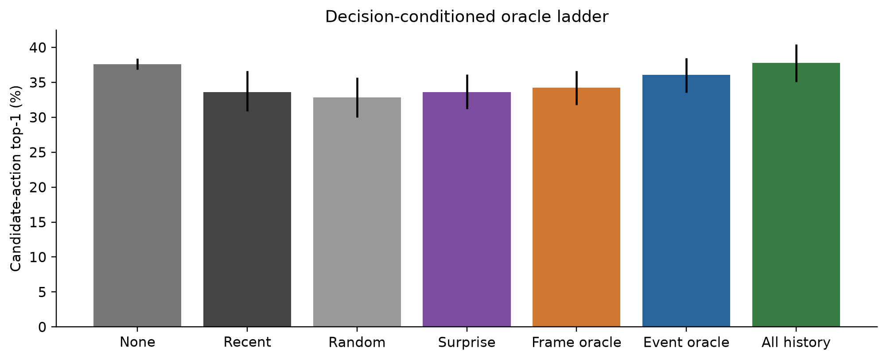
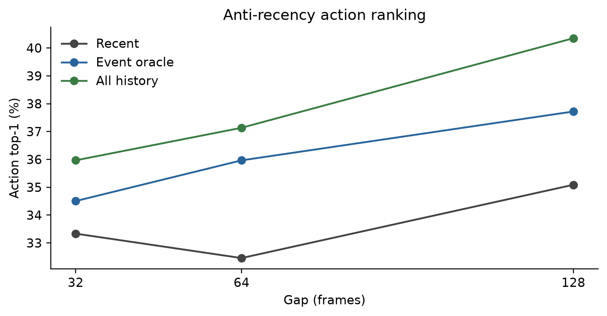
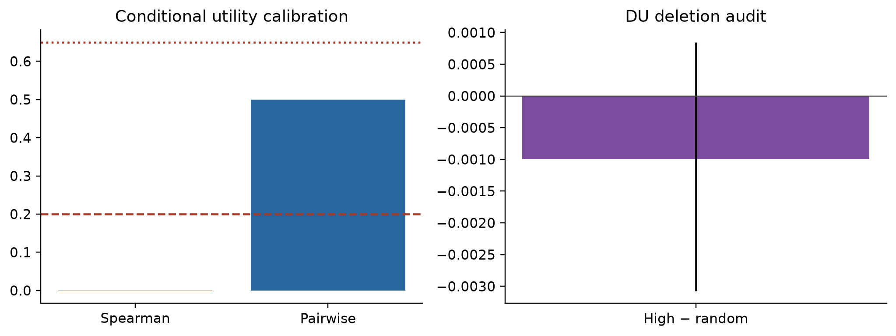
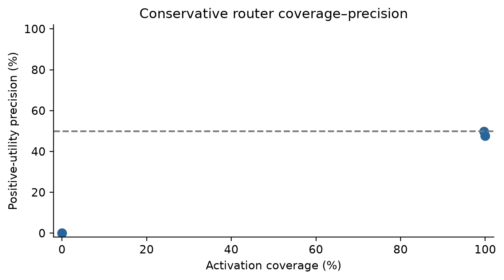

# Decision-Conditioned Memory Utility

## Verdict

The PointMaze decision-memory campaign completed three seeds at gaps 32/64/128.
It changes the target from generic latent reconstruction to goal- and
candidate-action-conditioned decision loss:

`DU(m|q,A) = L_decision(M\m,q,A) - L_decision(M,q,A)`.

**Gate 1 passes weakly through oracle-gap closure. Gate 2 fails.** No executed
use or breadth phase was run.

## Infrastructure and scope

The campaign reuses:

- unmodified PointMaze render caches and train-only DINO features;
- the fixed suffix-collision source/donor recipes;
- frozen action-conditioned hosts and raw memory adapters;
- automatic surprise/semantic-change event candidates;
- the admitted PointMaze controller and controller audit.

The admitted controller can execute standard OGBench task goals. The controlled
branch-future target in this diagnostic is not a standard task goal ID, so the
valid endpoint is candidate-action ranking and goal-conditioned rollout error,
not executed success.

No cue overlay, cue label, known cue time, reward, goal state, manual event
label, manual saliency, selector graph, or Graph-CEM component is used. The
recent six-frame latent/action suffix is exactly equal across paired branches.
The chronology remains a disclosed controlled splice of unmodified native
frames/actions rather than a native rollout.

## Task

Each query contains:

- an exact shared recent observation/action suffix;
- a branch-specific early raw visual event;
- a branch-specific future DINO goal latent;
- four candidate action sequences: own-source, paired-source, donor, and
  unrelated-source native actions.

All methods receive the same query, action candidates, memory-token budget, and
host calls. The correct action is evaluator-known but position-shuffled.

## Gate 1 — oracle decision opportunity

Aggregate action-ranking accuracy:

- no memory: **37.62%**, CI **[36.84%, 38.40%]**;
- recent-only: **33.63%**, CI **[30.90%, 36.65%]**;
- random event: **32.85%**, CI **[30.02%, 35.67%]**;
- surprise: **33.63%**, CI **[31.19%, 36.16%]**;
- oracle frame: **34.21%**, CI **[31.77%, 36.65%]**;
- oracle discovered event: **36.06%**, CI **[33.53%, 38.50%]**;
- all-history upper bound: **37.82%**, CI **[35.09%, 40.45%]**.

Relative to recent-only:

- oracle frame: **+0.58 percentage points**, CI
  **[−0.19, +1.27] percentage points**;
- oracle discovered event: **+2.44 percentage points**,
  CI **[+1.36, +3.41] percentage points**;
- all history: **+4.19 percentage points**, CI
  **[+3.02, +5.36] percentage points**.

Discovered events recover **58.14%** of the resolved all-history action-ranking
gap. Gate 1 therefore passes the preregistered >=25% closure clause, although
neither frame nor event reaches the standalone +5-point threshold.

Per gap:

- gap 32: recent **33.33%**, event oracle **34.50%**, all history **35.96%**;
- gap 64: recent **32.46%**, event oracle **35.96%**, all history **37.13%**;
- gap 128: recent **35.09%**, event oracle **37.72%**, all history **40.35%**.

## Decision head and conditional utility router

A compact frozen-host decision head receives current context, future-goal
latent, candidate actions, event latent, and event age. It is trained with
list-wise candidate-action ranking. After freezing the head, three
uncertainty-aware utility routers regress true within-query event deletion
utility. Validation calibrates a one-sided lower confidence bound and
abstention threshold.

The learned policy improves action accuracy by only **+0.97 percentage
points**, CI **[0.00, +1.75] percentage points**. Its lower interval is not
positive.

Conditional utility is chance:

- DU Spearman: **−0.0012**, CI **[−0.0066, 0.0088]**;
- pairwise accuracy: **0.4999**, CI **[0.4938, 0.5033]**;
- high-minus-random utility deletion: **−0.000997**,
  CI **[−0.003073, 0.000847]**.

Mean activation coverage is **66.57%** with **32.50%** positive-utility
precision. Two seeds activate almost every query; one abstains completely.
The activated mean utility is not reliably positive.

## Gate decisions

- Gate 1 oracle opportunity: **PASS by 58.14% closure**.
- Standalone oracle event gain >=5 points: **FAIL (+2.44 points)**.
- Learned decision-memory gain lower CI >0: **FAIL**.
- DU Spearman >0.2 or pairwise >=0.65: **FAIL**.
- Ordinary recent-path safety: **PASS**.
- Gate 2: **FAIL**.
- Executed use: **NOT REACHED**.
- Cube/Puzzle breadth: **NOT REACHED**.

The action-ranking endpoint is not described as planning.

## Diagnosis

Changing from generic reconstruction to decision loss increases oracle
specificity, but the useful headroom remains small: the complete history adds
only 4.19 percentage points over recent-only. Event-level DU is still not predictable within
the same query/action set. The router consequently activates broadly with
near-random utility precision.

The limiting factor is no longer the generic latent objective alone. This
controlled branch task does not provide a sufficiently large, learnable
decision-memory effect for event routing.

## Recommendation

Stop router, conditioner, selector, and graph work on this controlled splice.
The sole justified next experiment is a genuinely native long-horizon
**standard-goal** PointMaze task where the admitted controller, candidate
actions, goal-distance loss, and executed success all refer to the same native
task definition. It must establish >=5-point resolved oracle execution/action
headroom before any learned memory model is trained.

## Artifacts

- `scripts/build_cem_decision_task.py`
- `scripts/run_cem_decision_memory.py`
- `scripts/test_cem_decision_memory.py`
- `scripts/plot_cem_decision_memory.py`
- `outputs/cem_decision_memory_v1/report.json`
- `outputs/cem_decision_memory_report.json`
- `outputs/cem_decision_memory_v1/launch_receipt.json`
- per-cell oracle and decision results, models, evaluations, and decision logs;
- five white-background PNG/PDF figure pairs and figure receipt.

All jobs completed on GPUs 1/2; GPU3 was unused. No paper, graph, commit, or
push operation was performed.
