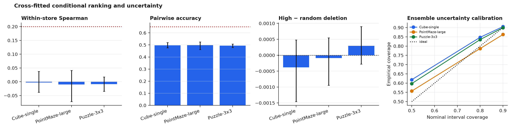
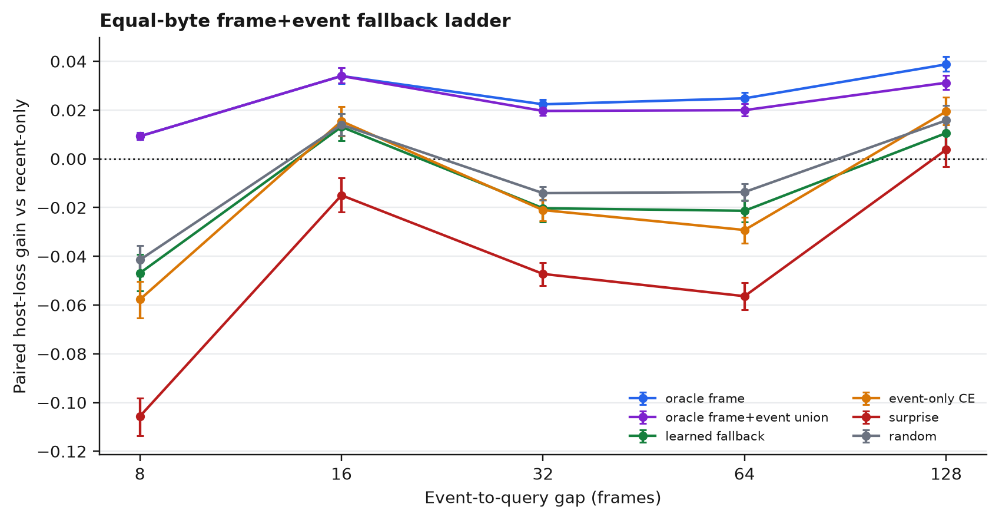
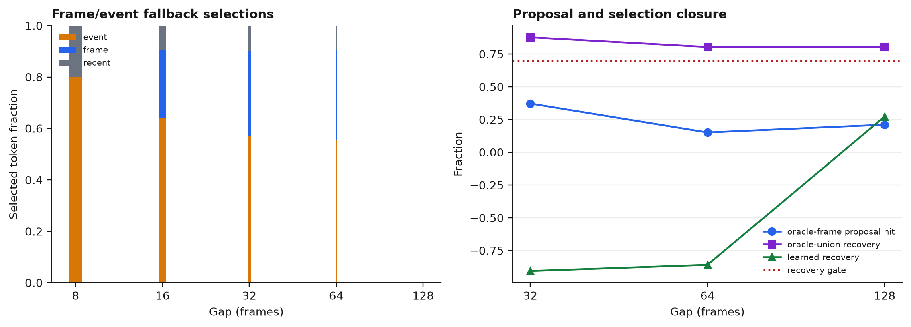
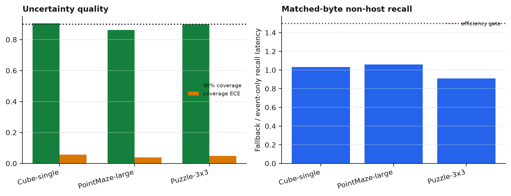

# Flat Frame+Event Fallback Selector

## Verdict

The fallback campaign completed 9 cells over PointMaze-large, Cube-single, and
Puzzle-3x3 with three optimization seeds each. It fixed candidate availability
but did not fix conditional value ranking or selection.

- **Conditional ranking gate: FAIL.** Hierarchical within-store Spearman is
  **-0.0072** (95% CI **[-0.0320, 0.0158]**), pairwise accuracy is **0.4961**
  (95% CI **[0.4821, 0.5093]**), and high-minus-random conditional deletion is
  **-0.000057** (95% CI **[-0.000529, 0.000390]**). No environment has a
  positive deletion-gap lower bound.
- **Opportunity/recovery gate: FAIL.** Oracle historical frames still beat
  recent-only at gaps 32/64/128. The learned fallback has **-36.12%** aggregate
  high-gap recovery and has no high gap where it beats both event-only and
  recent-only with a resolved interval.
- **Efficiency gate: PASS.** Mean non-host recall latency is **1.000x**
  event-only; the worst cell is **1.359x**, below the 1.5x limit. Selected
  bytes and host calls are identical.
- **Uncertainty calibration works.** Mean 90% interval coverage is **0.889**
  and coverage ECE is **0.048**. Calibrated uncertainty therefore does not
  rescue ranking.

Graph reconsideration is not authorized. No graph, scale, official-host, or
control phase was run.

## Method

### Candidate pool and resource contract

`lewm/models/fallback_selector.py` and
`scripts/run_cem_fallback_selector.py` implement a flat candidate pool with a
fixed 20-slot proposal tensor:

- 8 automatic event candidates ranked by frozen-host surprise and frozen-DINO
  temporal change;
- 8 raw historical frame candidates chosen by label-free DINO k-center
  coverage after excluding event proposals;
- 4 newest legal recent candidates.

Every candidate payload is one 96-dimensional float32 DINO token. The proposal
pool is 7,680 bytes; every evaluated memory arm reads exactly four tokens
(1,536 bytes) and invokes one online host rollout. Event-only uses the same
20-slot tensor and ensemble size with non-event candidates masked, so measured
non-host latency is comparable.

The selector receives query/context, candidate latent, age, surprise/change,
candidate type embedding, discovery uncertainty, frozen-router score, and
store occupancy. Five bootstrap heads predict conditional-effect mean and
aleatoric variance. Ensemble disagreement supplies epistemic variance.
Validation trajectories calibrate a multiplicative uncertainty scale. Test
selection uses a one-sided lower confidence bound; realized test futures are
available only to post-hoc metrics and oracles.

### No-manual-cue contract

- Candidate construction consumes frozen DINO latents, actions, timestamps,
  frozen-host surprise, and temporal DINO changes.
- Cue labels, cue positions, manual cue times, rewards, goal state, and
  simulator state are not loaded by the selector.
- Branch identity in the controlled suffix-collision task is evaluator-only.
- All selected arms use the same bytes, read tokens, and host calls.
- Frozen host digests are unchanged in every cell.

### Cross-fitted conditional targets

Training uses only gaps 32/64/128. Source-pair IDs assign all copies of a
trajectory pair to one of three folds. For each fold:

1. train a memory conditioner/router on the other two folds;
2. freeze that policy;
3. generate deletion targets on the held-out fold;
4. rebuild and reroute the occupied store after every deletion.

The target remains

`D(G|M,q)=[L(M\G,q)-L(M,q)]/[L(empty,q)+1e-8]`.

Five occupancy contexts are generated per query: full pool, router top-8,
type-balanced event/frame top-8, uncertainty-adjusted top-8, and deterministic
random top-8. The router reads four items, so deleting a selected group reruns
fallback to the next occupied item.

Each cell contains **8,070 out-of-fold target rows**. Fold receipts show
179/179/180 training pairs and 90/90/89 held-out label pairs, with **zero pair
overlap** in every fold. Selector training combines variance-aware Gaussian
NLL, Huber calibration, and pairwise/list-wise losses only within one
store/query.

## Conditional ranking

Intervals resample suffix-collision pairs within optimization seed and seeds
within environment, then average environments.

| Environment | Spearman (95% CI) | Pairwise accuracy (95% CI) | High-random deletion (95% CI) |
|---|---:|---:|---:|
| Cube-single | -0.0028 [-0.0385, 0.0372] | 0.4971 [0.4761, 0.5202] | -0.000379 [-0.001457, 0.000479] |
| PointMaze-large | -0.0101 [-0.0719, 0.0408] | 0.4974 [0.4616, 0.5252] | -0.000089 [-0.000944, 0.000547] |
| Puzzle-3x3 | -0.0088 [-0.0349, 0.0172] | 0.4939 [0.4784, 0.5073] | 0.000297 [-0.000277, 0.000898] |
| **Hierarchical mean** | **-0.0072 [-0.0320, 0.0158]** | **0.4961 [0.4821, 0.5093]** | **-0.000057 [-0.000529, 0.000390]** |

Cross-fitting removes policy/label self-fit, but the target remains
unpredictable on unseen trajectory pairs. The result is stronger than the
previous diagnosis: neither singleton targets, in-policy conditional targets,
nor cross-fitted long-gap conditional targets provide a learnable ordering
with the current host/conditioner features.



## Oracle and selection decomposition

Values are paired host-loss gains over equal-byte recent-only. Positive is
better.

| Gap | Oracle frame | Oracle union | Union recovery | Event-only CE | Learned fallback | Learned recovery |
|---:|---:|---:|---:|---:|---:|---:|
| 8 | 0.00926 | 0.00926 | 1.000 | -0.05770 | -0.04687 | -5.059 |
| 16 | 0.03398 | 0.03398 | 1.000 | 0.01544 | 0.01310 | 0.385 |
| 32 | 0.02237 | 0.01964 | 0.878 | -0.02103 | -0.02027 | -0.907 |
| 64 | 0.02482 | 0.01996 | 0.804 | -0.02921 | -0.02132 | -0.859 |
| 128 | 0.03875 | 0.03121 | 0.806 | 0.01940 | 0.01055 | 0.272 |

The candidate pool solves the previous proposal bottleneck: oracle union
recovers **87.8%, 80.4%, and 80.6%** of oracle-frame gain at gaps 32, 64, and
128, respectively. Exact oracle-frame index hit rates are lower
(37.2%/15.1%/21.1%), showing that temporally/semantically similar fallback
frames recover most utility without reproducing the exact oracle index.

The learned selector loses the available gain. At gaps 32 and 64 it is
resolved worse than recent-only:

- gap 32: **-0.02027**, 95% CI **[-0.02588, -0.01470]**;
- gap 64: **-0.02132**, 95% CI **[-0.02586, -0.01698]**.

At gap 128 fallback beats recent-only by **0.01055**
([0.00470, 0.01663]) but is worse than event-only by **-0.00885**
([-0.01416, -0.00361]). It therefore has no qualifying high-gap win.



## Frame/event decisions

The fallback head does use the new frame candidates:

| Gap | Event selection | Frame selection | Recent selection | Uncertainty-driven fallback |
|---:|---:|---:|---:|---:|
| 32 | 57.0% | 33.0% | 10.0% | 2.4% |
| 64 | 55.7% | 34.7% | 9.6% | 3.0% |
| 128 | 49.9% | 40.1% | 10.1% | 2.5% |

Most frame selections are caused by a higher frame lower-confidence bound,
not a reversal caused specifically by event uncertainty. The selected mixture
therefore confirms that the type gate is active; its utility estimates are
wrong.



## Uncertainty and efficiency

| Environment | 90% coverage | Coverage ECE | Recall latency ratio |
|---|---:|---:|---:|
| Cube-single | 0.905 | 0.058 | 1.032x |
| PointMaze-large | 0.863 | 0.039 | 1.058x |
| Puzzle-3x3 | 0.899 | 0.048 | 0.911x |
| **Mean** | **0.889** | **0.048** | **1.000x** |

The maximum cell latency ratio is 1.359x. Uncertainty and efficiency gates are
therefore not the blocker. Predictive intervals can be calibrated while the
mean ordering remains uninformative.



## Gate decisions

| Gate | Decision | Exact reason |
|---|---|---|
| Conditional ranking | **FAIL** | Spearman lower CI < 0.2; pairwise 0.496 < 0.65; 0/3 positive deletion environments. |
| Opportunity/recovery | **FAIL** | Oracle opportunity passes, but learned recovery is -36.12% and there are zero resolved wins over both recent/event-only. |
| Efficiency | **PASS** | Worst recall ratio 1.359x < 1.5x; bytes and host calls match. |
| Minimal graph reconsideration | **NOT RUN** | Recovery prerequisites failed. |
| 10-environment scale | **NOT RUN** | Fallback prerequisite failed. |
| Raw official DINO-WM | **NOT RUN** | Fallback/graph prerequisite failed. |
| Executed control | **NOT RUN** | Prediction and graph prerequisites failed. |

No `outputs/graph_cem_reconsider_v1/` artifact was created because graph work
was not authorized.

## Diagnosis and recommendation

The decomposition is now decisive:

1. **Opportunity exists.** Oracle history beats recent-only.
2. **Candidate availability is adequate.** Frame+event union recovers over 80%
   of high-gap frame-oracle gain.
3. **Uncertainty is adequately calibrated.**
4. **Recall compute is within budget.**
5. **Conditional utility ranking fails under every tested target protocol.**

Stop Graph-CEM and stop adding selector complexity to the current
DINO-feature breadth host. Use recent-only as the conservative deployed
baseline. A future restart should change the host-memory conditioner or use
native long trajectories where memory utility is larger and more stable; it
should not add graph edges when candidate utility cannot be ranked.

## Reproduction

```bash
# Tests.
.venv/bin/python -m pytest -q \
  scripts/test_cem_fallback_selector.py \
  scripts/test_run_cem_conditional_ce.py \
  scripts/test_graph_cem_long_gap.py \
  scripts/test_run_cem_raw_ogbench.py

# One cell; repeat environments and seeds 0/1/2 on GPUs 0/1/2.
.venv/bin/python scripts/run_cem_fallback_selector.py \
  --env-name pointmaze-large-navigate-v0 --seed 0 --gpu 0

# Aggregate and figures.
.venv/bin/python scripts/run_cem_fallback_selector.py --aggregate
.venv/bin/python scripts/plot_cem_fallback_selector.py
```

## Artifacts

- Machine decision: `outputs/cem_fallback_report.json`
- Aggregate: `outputs/cem_fallback_selector_v1/report.json`
- Launch receipt: `outputs/cem_fallback_selector_v1/launch_receipt.json`
- Cells: `outputs/cem_fallback_selector_v1/cells/<env>/s<seed>/`
- Per-cell: `result.json`, `evaluation.npz`, `decision_log.json`, `model.pt`
- Figure receipt: `outputs/cem_fallback_selector_v1/figure_receipt.json`
- Figures:
  `docs/assets/cem_fallback_{candidate_oracle_ladder,calibration_ranking,frame_event_selections,uncertainty_pareto}.{png,pdf}`

All jobs completed without failure on GPUs 0/1/2. GPU3 was not used. Existing
Graph-CEM outputs were preserved. `paper_c/` and `paper_d/` were not modified.

## Limitations

- The anti-recency task remains a disclosed controlled splice/teleport
  diagnostic rather than a native rollout.
- Optimization seeds share the fixed trajectory split.
- Pool storage is larger than selected memory; event-only and fallback use the
  same fixed 20-slot proposal tensor for latency matching.
- Hosts are DINO-feature action-conditioned predictors, not the released
  official DINO-WM checkpoint.
- Test conditional effects are post-hoc diagnostics and never select test
  candidates.
