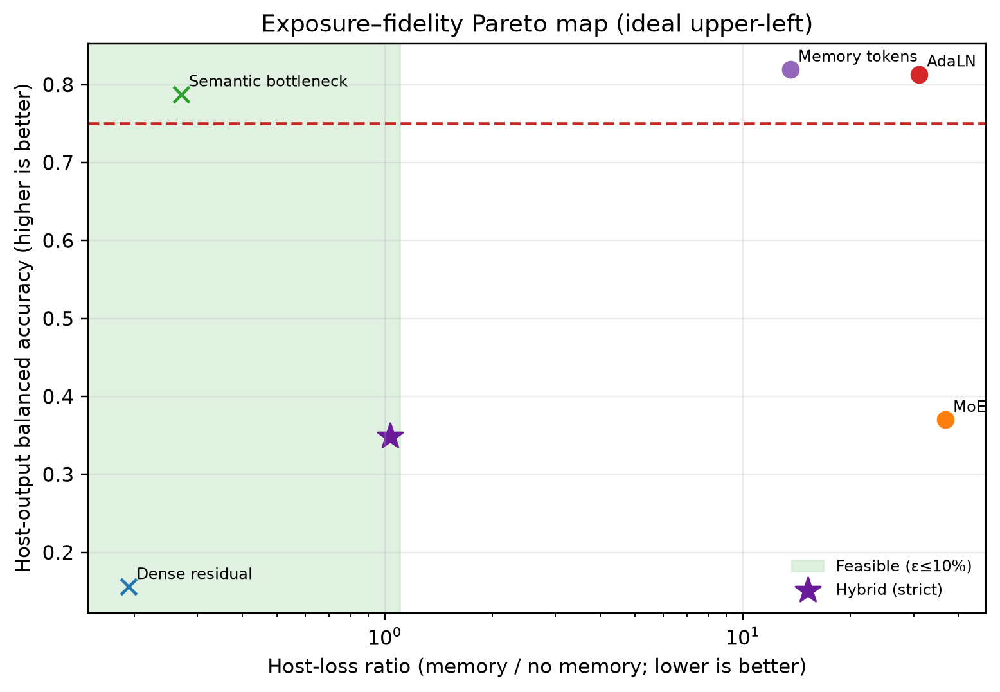
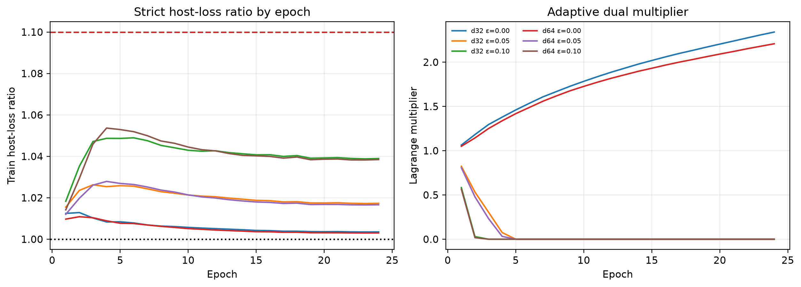

# Final Hybrid CEM–LeWM Exposure Interface

## Joint verdict

The selected configuration is **d=32, ε=0.10**
over seeds [0, 1, 2]. The joint gate
**did not pass**. A run is
counted only when host-output BAcc ≥0.75, every control ≤0.217, and strict
next-latent loss respects its configured constraint.

- Host-output BAcc: 0.349 ± 0.005
- Controls: reset 0.126, host_only 0.142, no_state 0.142, shuffled 0.147, random 0.121
- Strict host loss, memory / baseline:
  0.009989 /
  0.009664
- Host-loss ratio: 1.0336 ± 0.0006;
  all-seed feasible: True
- Geometry Pearson / rank:
  0.983 /
  0.963
- Causal cue deletion / random deletion Δloss:
  -0.000099 /
  -0.000000

## Interface and training

The label-free path is CEM causal event store → six distinct retrieved memory
tokens → normalized semantic bottleneck → bounded query-conditioned decoder →
complete frozen official LeWM output. Same-base branch identity is inferred by
latent equality. A primal-dual augmented Lagrangian adapts its multiplier from
the relative constraint violation every minibatch; the JSON records per-epoch
violation magnitude/rate and final multipliers.

Diagnostic ladder (memory token → bottleneck → decoded signal → host):
0.967 →
0.878 →
0.840 →
0.349.

## Overhead and integrity

- Trainable parameters: 177,922
  (0.987% of frozen host).
- Measured batch-latency overhead:
  1371.9%.
- Frozen digest: `5589632959b98370ad96001523025bc265686e82b87376d327da18cbd555f879`; unchanged in all runs.
- Semantic labels used in training loss: false.

## Direct comparison

| Interface | Host BAcc | Host-loss ratio | Metric note |
|---|---:|---:|---|
| Dense residual | 0.156 | 0.19 | legacy cue-conditioned endpoint; not strict |
| MoE | 0.370 | 36.79 |  |
| Semantic bottleneck | 0.787 | 0.27 | legacy cue-conditioned target; not strict |
| AdaLN | 0.813 | 31.08 |  |
| Memory tokens | 0.819 | 13.59 |  |
| **Hybrid** | **0.349** | **1.034** | strict next-latent |

Legacy dense-residual and semantic-adapter ratios use their original
cue-conditioned target and are marked non-strict; they must not be interpreted
as strict feasibility evidence. The Pareto verdict is based on the strict
points for memory tokens, AdaLN, MoE, and this hybrid.

