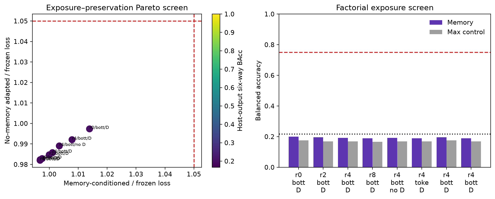
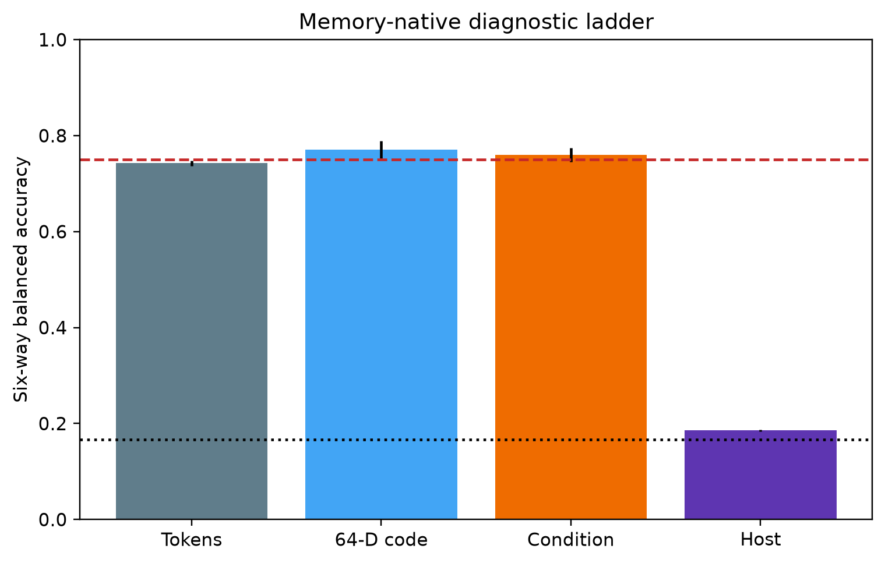

# CEM–LeWM Memory-Native LoRA Report

## Verdict

The joint gate **did not pass**.
The selected configuration is rank **2**, interface
**bottleneck_tokens**, predictor location **qkv_adaln**, with
no-memory distillation **True**.

Across three seeds, memory-conditioned host-output BAcc was
**0.185 ± 0.002** and the
maximum control was **0.175 ± 0.005**.
Memory-conditioned future loss was **0.009615** versus
the frozen baseline **0.009681**
(ratio **0.993**). Ordinary no-memory PushT
loss changed from **0.009681** to
**0.009479**
(ratio **0.979**).

## Factorial screen

| Rank | Interface | Distill | Location | Host BAcc | Max control | Memory loss ratio | No-memory ratio | Trainable |
|---:|---|---|---|---:|---:|---:|---:|---:|
| 0 | bottleneck_tokens | True | qkv_adaln | 0.200 | 0.175 | 1.014 | 0.997 | 0.488% |
| 2 | bottleneck_tokens | True | qkv_adaln | 0.196 | 0.169 | 1.000 | 0.985 | 0.794% |
| 4 | bottleneck_tokens | True | qkv_adaln | 0.192 | 0.169 | 0.997 | 0.982 | 1.101% |
| 8 | bottleneck_tokens | True | qkv_adaln | 0.190 | 0.167 | 0.998 | 0.983 | 1.714% |
| 4 | bottleneck_tokens | False | qkv_adaln | 0.192 | 0.169 | 1.003 | 0.989 | 1.101% |
| 4 | tokens | True | qkv_adaln | 0.190 | 0.169 | 0.997 | 0.982 | 1.101% |
| 4 | bottleneck_tokens | True | qkv | 0.196 | 0.175 | 1.008 | 0.992 | 0.922% |
| 4 | bottleneck_tokens | True | adaln | 0.190 | 0.169 | 1.001 | 0.986 | 0.666% |

## Geometry, causality, and efficiency

- Six-way geometry Pearson/Spearman:
  **0.985 / 0.969**.
- Cue-group / random deletion Δloss:
  **-0.000024 / 0.000004**.
- Trainable parameters: **143,234**
  (**0.794%** of the official host).
- Predictor-plus-memory latency overhead:
  **6.5%**.
- Diagnostic ladder (tokens → 64-D code → conditioning → host):
  **0.742 →
  0.771 →
  0.760 →
  0.185**.

## Integrity and protocol

The encoder and every original LeWM tensor remained frozen. Base digest
`5589632959b98370ad96001523025bc265686e82b87376d327da18cbd555f879` was unchanged: **True**.
LoRA and memory-interface tensors were stored separately. Training used latent
matching among six same-base rendered counterfactuals; semantic labels were
used only by post-hoc linear probes. Ordinary no-memory examples were the
paired unmodified PushT trajectories (`z_base`) and were distilled against the
original host outputs.

