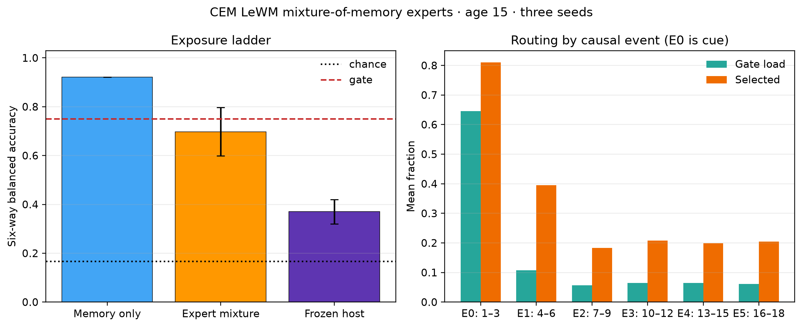

# CEM LeWM Mixture-of-Memory Experts

Architecture B was evaluated on six-way PushT visual binding at age 15 with seeds [0, 1, 2]. The official LeWM host remained frozen (digest `5589632959b98370ad96001523025bc265686e82b87376d327da18cbd555f879`), and semantic labels were used only for the post-hoc audit.

## Exact results

- Memory-only: 0.920833 ± 0.000000 ([0.9208333333333333, 0.9208333333333333, 0.9208333333333333])
- Expert-mixture output: 0.697917 ± 0.099143 ([0.5666666666666667, 0.80625, 0.7208333333333333])
- Frozen host output: 0.370139 ± 0.049574 ([0.32708333333333334, 0.4395833333333334, 0.34375])
- Dense-residual v3 host baseline: 0.155556 ± 0.005468
- Strict future-latent loss with memory: 0.356193; without memory: 0.009682; reset: 0.010097.

Controls (mean balanced accuracy): full=0.370139, host_only=0.177083, reset=0.170833, no_state=0.177083, shuffled=0.163194, random=0.168056

## Routing and causality

- Mean routing entropy: 0.441350; normalized entropy: 0.636733.
- Mean gate load by event expert: [0.6455702185630798, 0.10750341415405273, 0.05640631044904391, 0.06436025475462277, 0.06466418753067653, 0.06149567663669586].
- Cue event retrieval frequency: 1.000000; selection frequency: 0.809722.
- Expert deletion Δ future loss: [-0.3464450959096818, 0.01301533170367798, 0.004227424636256829, 0.006701591079116851, 0.005127224241894307, 0.005726685562371534].

## Verdict and failures

Success gate: **FAIL** (host output ≥0.75 and every control ≤0.217).
Six-way geometry: **not_preserved_at_host_output**.

- Host-output six-way balanced accuracy did not meet 0.75.
- Expert-mixture six-way geometry was not robust across seeds.
- Router load remained cue-expert dominated despite balancing.
- Deleting the cue expert improved strict future-latent loss, showing a separability/prediction objective conflict.

