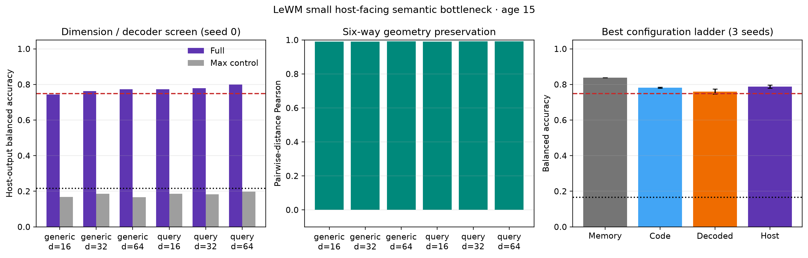

# CEM–LeWM Semantic Bottleneck Adapter Report

## Result

Architecture D was tested on six-way PushT binding at age 15. The selected
configuration is **query, 64-D**, using unit
normalization, six-branch counterfactual geometry matching, and
variance/orthogonality anti-collapse regularization.

The strict three-seed gate **passed**:
host-output balanced accuracy was
0.788 ± 0.009
and the maximum control was 0.183 on average.

## Dimension and decoder screen

| Decoder | Dim | Geometry r | Geometry rank | Host output | Max control |
|---|---:|---:|---:|---:|---:|
| generic | 16 | 0.990 | 0.977 | 0.744 | 0.169 |
| generic | 32 | 0.990 | 0.978 | 0.763 | 0.185 |
| generic | 64 | 0.991 | 0.977 | 0.773 | 0.167 |
| query | 16 | 0.991 | 0.977 | 0.773 | 0.185 |
| query | 32 | 0.991 | 0.979 | 0.779 | 0.183 |
| query | 64 | 0.992 | 0.979 | 0.800 | 0.198 |

## Best configuration, three seeds

- Pairwise-distance correlation:
  0.992 ± 0.000
- Pairwise-distance rank correlation:
  0.979 ± 0.001
- Host future-latent loss:
  0.361792 ± 0.003337
- Cue-group deletion Δloss:
  0.063573 ± 0.016413
- Ladder (memory → code → decoded conditioning → host):
  0.838 →
  0.782 →
  0.760 →
  0.788

## Protocol and integrity

The official PushT LeWM was frozen. Its state digest was
`5589632959b98370ad96001523025bc265686e82b87376d327da18cbd555f879` before and after every run.
Only the semantic bottleneck and bounded decoder were trainable. Human semantic
labels were excluded from every training loss; branch identity was inferred by
matching the observed cue latent to one of the six paired same-base rendered
counterfactual branches. Labels were used only for post-hoc readability audits.

