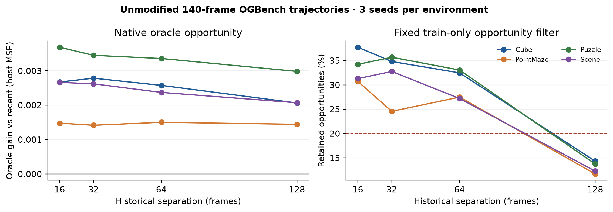
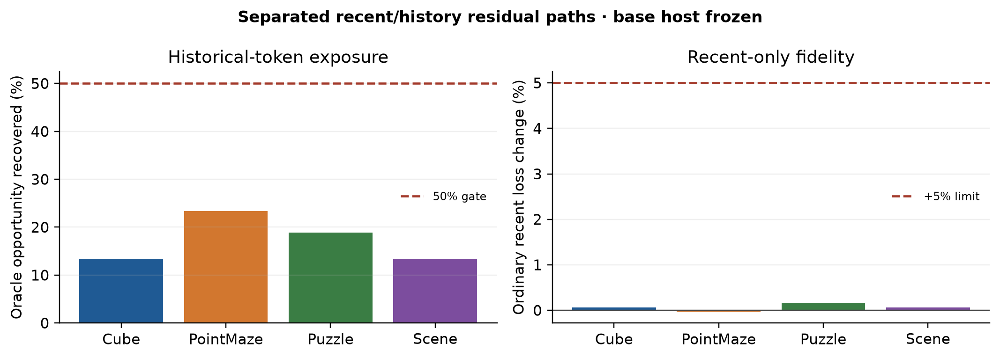
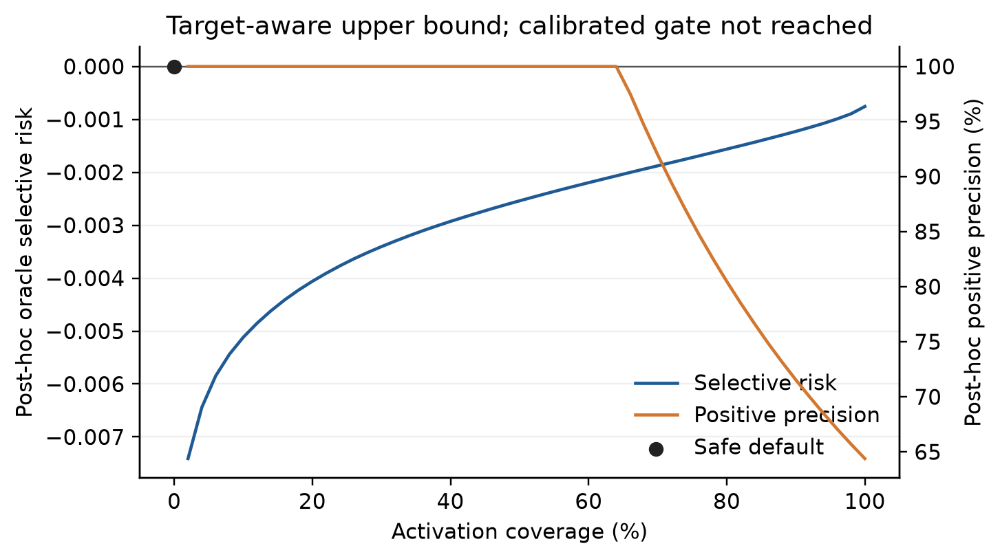
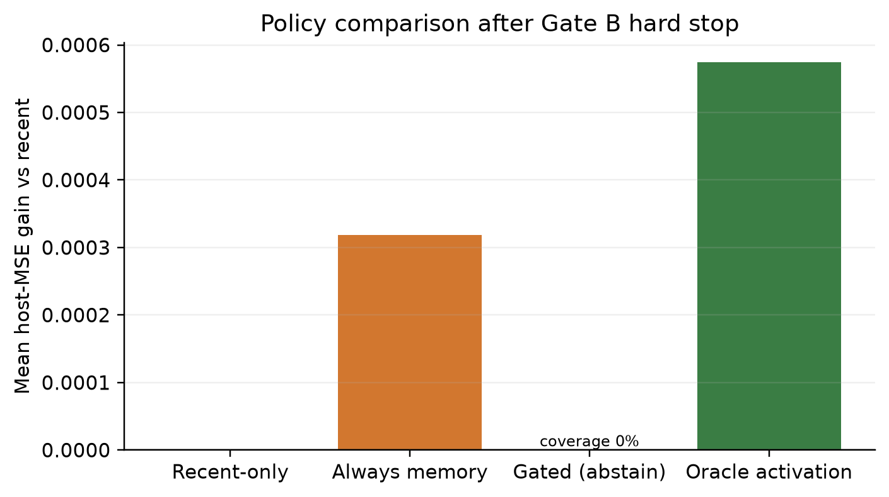
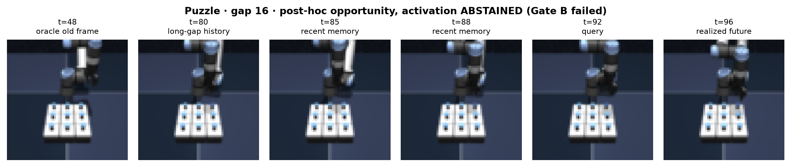

# Native Long-Trajectory CEM Recovery

## Verdict

The campaign completed on unmodified 140-frame OGBench trajectories from
PointMaze-large, Cube-single, Puzzle-3x3, and Scene, with three optimization
seeds per environment. Graph-CEM remained stopped.

- **Gate A — native opportunity: PASS.** The fixed train-only oracle filter
  retained **27.12%** of test queries (cell-level 95% CI
  **[24.40%, 29.84%]**). Oracle historical frames beat equal-byte recent-only
  with resolved intervals at gaps 32/64/128 in all four environment families.
- **Gate B — memory-compatible conditioner: FAIL.** The final separated
  recent/history cross-attention conditioner recovered **17.04%** of the raw
  oracle opportunity (95% CI **[11.74%, 22.34%]**), below the required 50%.
  Ordinary recent-only degradation was only **+0.074%**
  (**[+0.013%, +0.135%]**), well inside the +5% safety limit.
- **Gate C — conservative activation: NOT REACHED.** The binary
  lower-confidence-bound gate is implemented and smoke-tested, but the real
  gate fit/evaluation was hard-stopped because Gate B failed. The deployed
  policy therefore remains recent-only with **0% activation**. There is no
  calibrated-gate coverage, precision, ECE, or selective-risk result.
- **Downstream use: NOT REACHED.** A–C did not all pass, so no controller,
  action-sequence ranking, or executed-success experiment was run.

This result establishes native long-horizon opportunity, but not a successful
memory conditioner or selective activation policy.

## Protocol

### Data and integrity

Each environment contributes 384 native trajectories with 140 rendered frames
and 139 actions. The fixed trajectory-disjoint split is 269 train, 58
validation, and 57 test episodes. Every cell contains 2,152 train, 464
validation, and 456 test queries over historical separations 16/32/64/128.

The source contract is strict:

- only `frames` and `actions` are consumed from each render cache;
- cached cue labels and positions are ignored;
- frames remain byte-identical before DINO encoding;
- chronology is native: there is no suffix splice, schedule relocation, or
  query-to-future teleport;
- there is no cue injection, cue interval, event class, reward, goal state,
  simulator state, manual key frame, or saliency map;
- train/validation/test trajectories are disjoint;
- recent and historical arms each read four 96-dimensional float32 tokens
  (1,536 bytes) and use the same four-step host rollout.

Frozen DINOv2 ViT-S/14 patch tokens are reduced with a 1x1 plus 2x2 spatial
pyramid. A 96-dimensional PCA projection and scale are fit on train
trajectories only.

### Native opportunity mining

Query and candidate mining uses only causal-prefix information:

- DINO revisit after long separation;
- DINO reappearance after an intervening dissimilar segment;
- host prediction surprise;
- temporal semantic discontinuity;
- action magnitude/change as a contact or transition proxy;
- recent-region displacement;
- DINO k-center historical coverage.

These signals are generic proxies for revisit, teleport/discontinuity,
contact/state transition, occlusion/reappearance, landmark/region transition,
and relational scene change. They are not event labels.

The preregistered opportunity threshold is:

`max(0.2% relative oracle improvement, train-only 75th percentile)`.

Across cells the resulting fixed threshold ranged from **0.3416%** to
**0.4739%** relative improvement. The criterion is then applied unchanged to
validation and test. Test future loss is used only to identify and score the
oracle opportunity subset; it is never used by query mining, conditioner
training, candidate selection, or activation.

## Gate A — native opportunity

Overall retained test coverage is **27.12%**
([24.40%, 29.84%]). Coverage by gap is:

- gap 16: **33.48%**;
- gap 32: **31.94%**;
- gap 64: **30.04%**;
- gap 128: **13.01%**.

The low gap-128 fraction is reported rather than hidden. Overall coverage
passes the 20% campaign target, while the longest-gap tail is sparse.

Paired oracle-frame host-MSE gains over recent-only are:

- gap 16: **0.002625**, 95% CI **[0.002118, 0.003132]**;
- gap 32: **0.002568**, 95% CI **[0.002099, 0.003037]**;
- gap 64: **0.002452**, 95% CI **[0.002022, 0.002882]**;
- gap 128: **0.002141**, 95% CI **[0.001784, 0.002497]**.

PointMaze, Cube, Puzzle, and Scene each have positive lower intervals at all
three required high gaps. Gate A therefore passes in four families, exceeding
the two-family requirement.



## Gate B — host-facing conditioner

### Architecture

The base action-conditioned DINO-feature predictor is frozen and hashed. The
trainable conditioner keeps four tokens distinct through:

1. token-type and metadata embeddings;
2. a normalized 64-dimensional semantic bottleneck;
3. query-conditioned multi-head cross-attention;
4. separate recent-token and historical-token residual paths;
5. bounded, zero-initialized prediction residuals.

Calling the conditioner without memory returns the original host output
exactly. The measured zero-memory distillation MSE is **0.0**.

Training combines future-latent prediction on train-only opportunity examples,
ordinary recent-only prediction, oracle/recent effect-shortfall supervision,
geometry preservation, variance/covariance anti-collapse penalties, residual
regularization, and a primal-dual +5% validation non-degradation constraint.
The conditioner is frozen before any gate code can run.

The final conditioner averages **216,729 trainable parameters** across action
dimensions and **0.0274 ms/query** for the measured four-step GPU path.

### Result

Oracle-selected historical memory recovers only **17.04%**
([11.74%, 22.34%]) of the raw opportunity:

- Cube-single: **13.44%**;
- PointMaze-large: **23.38%**;
- Puzzle-3x3: **18.91%**;
- Scene: **13.30%**.

The ordinary path remains safe: mean recent-only degradation is **+0.074%**,
with every measured cell far below +5%. Safety is therefore not the limiter;
historical effect strength is.

The final conditioner does create more useful differences than the frozen raw
adapter. Equal-budget always-memory changes from a mean gain of
**-0.000040** with the raw adapter to **+0.000318** with the trained
conditioner. However, that gain remains too small relative to the
oracle-selected opportunity to pass the 50% recovery requirement.



## Gate C — conservative activation

The implemented gate is deliberately binary rather than a fine-grained event
ranker. It uses a cross-fitted variance-aware ensemble, conformal one-sided
utility bounds, validation-only probability temperature calibration, and a
delta sweep over coverage versus selective risk. The policy activates memory
only when the predicted utility lower bound exceeds the selected delta.

The real gate was not fit or evaluated. Gate B failed first, so continuing
would violate the campaign hard stop. Exact real-campaign values are:

- activation coverage: **not evaluated**;
- activated precision: **not evaluated**;
- calibrated ECE: **not evaluated**;
- selective risk and worst-case degradation: **not evaluated**;
- recent-versus-gated outcome: **identical by abstention**, with 0% activation.

For diagnostic context only, 64.39% of fixed robust candidates have positive
realized conditioner utility, and a target-aware oracle activation would gain
**0.000574** host MSE on average. Those values use realized test futures and
are upper bounds, not deployable selection results. The accompanying
coverage-risk figure is explicitly target-aware and must not be read as a
calibrated gate.





The raw-frame timeline shows a real native opportunity, but activation is
marked abstained because the conditioner prerequisite failed.



## Gate decisions

- **A / opportunity: PASS.** 27.12% retained coverage; resolved positive
  oracle intervals at gaps 32/64/128 in four families.
- **B / conditioner: FAIL.** 17.04% recovery is below 50%; ordinary
  degradation is safely below 5%.
- **C / activation: NOT REACHED.** No selective-memory claim.
- **D / downstream: NOT REACHED.** No controller or executed-success claim.

Graph complexity remains stopped. No graph module, graph output, edge
ablation, or graph claim was added.

## Artifacts and reproduction

Core code:

- `lewm/models/native_long_memory.py`
- `scripts/build_cem_native_long.py`
- `scripts/run_cem_native_long.py`
- `scripts/plot_cem_native_long.py`
- `scripts/test_cem_native_long.py`

Machine artifacts:

- `outputs/cem_native_long_report.json`
- `outputs/cem_native_long_v1/report.json`
- `outputs/cem_native_long_v1/build_report.json`
- `outputs/cem_native_long_v1/build_launch_receipt.json`
- `outputs/cem_native_long_v1/launch_receipt.json`
- `outputs/cem_native_long_v1/cells/<env>/s<seed>/`
- per cell: `result.json`, `evaluation.npz`, `decision_log.json`, `model.pt`
- `outputs/cem_native_long_v1/figure_receipt.json`

Reproduction:

```bash
.venv/bin/python -m pytest -q \
  scripts/test_cem_native_long.py \
  scripts/test_run_cem_raw_ogbench.py \
  scripts/test_cem_fallback_selector.py \
  scripts/test_run_cem_conditional_ce.py \
  scripts/test_graph_cem_long_gap.py

.venv/bin/python scripts/build_cem_native_long.py \
  --env-name pointmaze-large-navigate-v0 --gpu 0

.venv/bin/python scripts/run_cem_native_long.py \
  --env-name pointmaze-large-navigate-v0 --seed 0 --gpu 0

.venv/bin/python scripts/run_cem_native_long.py --aggregate
.venv/bin/python scripts/plot_cem_native_long.py
```

Twenty focused and regression tests pass. All build and campaign jobs
completed with return code zero on GPUs 0/1/2; GPU3 was not used. No jobs
remain. No commit or push was made.

## Claim boundary and recommendation

The campaign supports one new conclusion: native OGBench histories contain
measurable long-separation predictive opportunities under equal memory budget.
It does not support event ranking, causal selection, selective activation,
planning, or control.

The limiting stage is the host-memory conditioner, not opportunity coverage or
ordinary-path safety. The only justified next step is a host-interface redesign
that preserves spatial/object patch state into the predictor—then rerun Gate B
before training any activation gate. More selector capacity, graph edges,
additional CE targets, or downstream execution are not justified by this
result.

## Spatial-conditioner follow-up

The isolated patch-grid follow-up is complete. A 4x4 frozen-DINO patch
conditioner raises focused PointMaze/Cube mean recovery from the global
baseline's 17.42% to **77.13%** (hierarchical 95% CI
**[41.01%, 118.98%]**) while ordinary
degradation remains **+0.382%** and empty-memory fidelity remains exact.

Gate B nevertheless remains failed: Cube has resolved positive gains at gaps
32/64/128, but PointMaze intervals include zero, so only one family satisfies
the required high-gap replication criterion. Attention is nearly uniform
(entropy 2.7726 and same-location overlap 0.0625), identifying spatial
alignment as the remaining bottleneck. Gate C and downstream use remain
stopped. See
[`CEM_SPATIAL_CONDITIONER_REPORT.md`](CEM_SPATIAL_CONDITIONER_REPORT.md).
