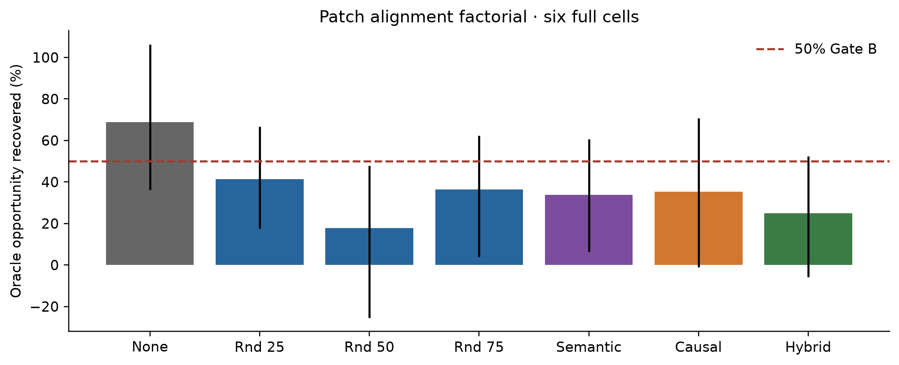
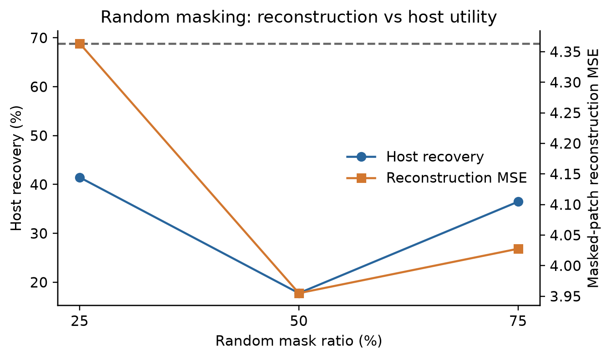
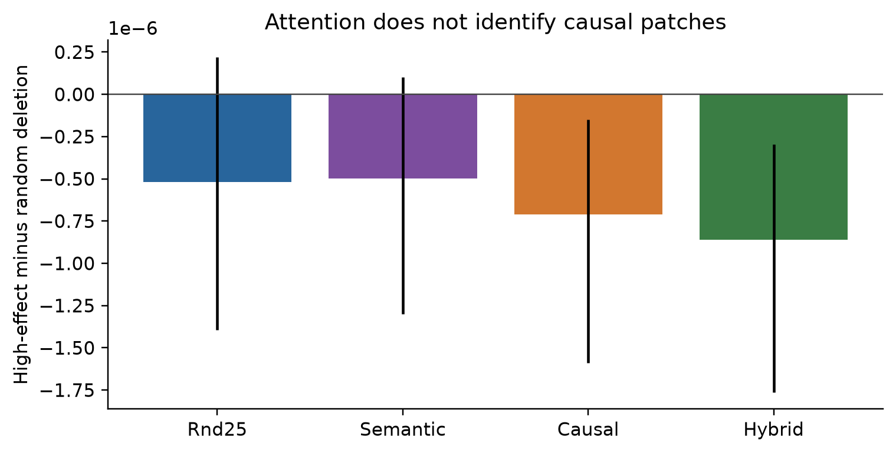
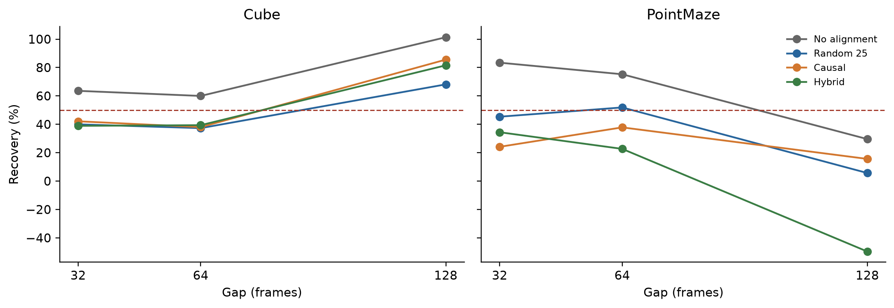
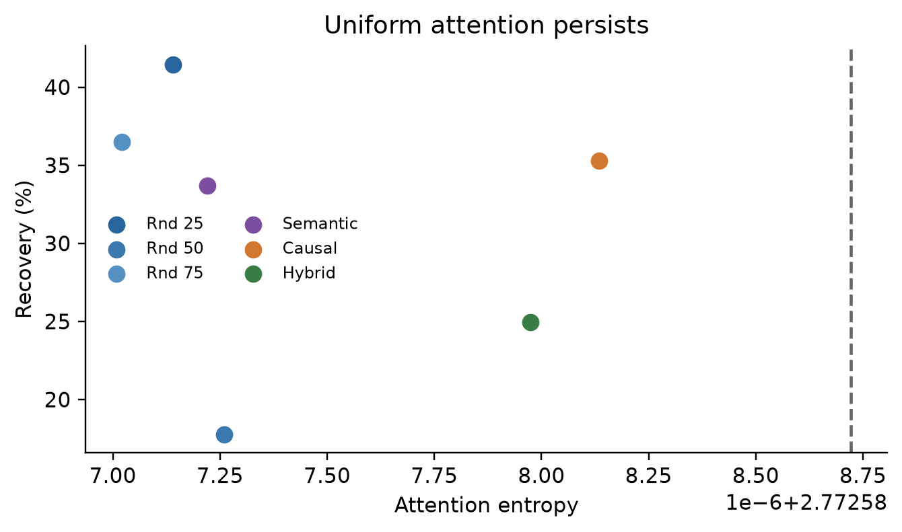

# Patch Alignment and Random Masking

## Verdict

The full label-free factorial completed on the fixed native Gate-A dataset:
Cube-single and PointMaze-large, three seeds each, gaps 32/64/128. The host,
candidate pool, opportunity masks, oracle frame indices, memory bytes, test
host calls, and recent-path safety contract are unchanged.

**Gate B fails and Gate C is hard-stopped.**

The existing no-alignment patch-grid conditioner remains best at **68.86%**
aggregate recovery (cell-bootstrap CI **[36.14%, 106.33%]**). Every masking
or alignment treatment reduces host recovery:

- random 25%: **41.46%**, CI **[17.64%, 66.75%]**;
- random 50%: **17.76%**, CI **[−25.45%, 47.77%]**;
- random 75%: **36.47%**, CI **[4.00%, 62.31%]**;
- semantic-change 50%: **33.68%**, CI **[6.37%, 60.64%]**;
- causal patch alignment: **35.28%**, CI **[−1.08%, 70.83%]**;
- random-25% plus causal: **24.97%**, CI **[−5.88%, 52.40%]**.

Ordinary degradation remains safe: causal alignment is **+0.264%** and hybrid
is **+0.209%**, far below +5%. Empty memory remains exact. Safety is not the
limiter.

## Random masking answer

Random masking does **not** improve decision-relevant representation.

The validation-selected random ratio is 25% for host recovery, but it reaches
only 41.46%, versus 68.86% without alignment. Random 50% gives the best DINO
reconstruction among random masks (**3.955 MSE**) yet the worst recovery
(**17.76%**). This directly separates reconstruction quality from host utility.
Random 75% reconstruction is 4.028 MSE and recovery is 36.47%; stronger masking
does not recover subtle high-value patches.

Attention remains uniform at every ratio:

- entropy: **2.772587**, effectively `ln(16)`;
- same-location overlap: **0.0625**, effectively `1/16`;
- patch ranking stays at chance.

Random masking is therefore only an augmentation baseline here. It neither
concentrates attention nor improves memory-vs-recent prediction.

## Causal alignment result

Patch deletion targets were generated once from a frozen pre-alignment policy.
The policy digest is unchanged before and after target generation. Trajectory
fold receipts have zero overlap; targets are never updated from the model being
trained. Test futures are used only for retrospective deletion audits.

The causal target is not identifiable from attention:

- causal patch Spearman: **−0.0173**,
  CI **[−0.0412, 0.0066]**;
- causal pairwise accuracy: **0.4950**,
  CI **[0.4864, 0.5030]**;
- high-effect minus random deletion: **−0.000000709**,
  CI **[−0.000001590, −0.000000151]**.

Hybrid alignment is also at chance:

- Spearman **−0.0205**;
- pairwise accuracy **0.4930**;
- high-minus-random deletion **−0.000000861**,
  CI **[−0.000001763, −0.000000296]**.

The supervised ranking loss therefore does not make attention causal. It
slightly encourages the wrong ordering under held-out deletion.

## Cube versus PointMaze

No-alignment remains stronger and more stable. Selected per-gap recoveries:

Cube:

- gap 32: no alignment **63.57%**, random-25 **39.96%**,
  causal **42.12%**, hybrid **38.92%**;
- gap 64: no alignment **59.98%**, random-25 **37.30%**,
  causal **38.03%**, hybrid **39.38%**;
- gap 128: no alignment **101.33%**, random-25 **68.12%**,
  causal **85.57%**, hybrid **81.55%**.

PointMaze:

- gap 32: no alignment **83.41%**, random-25 **45.35%**,
  causal **24.14%**, hybrid **34.41%**;
- gap 64: no alignment **75.26%**, random-25 **51.88%**,
  causal **37.83%**, hybrid **22.68%**;
- gap 128: no alignment **29.59%**, random-25 **5.68%**,
  causal **15.61%**, hybrid **−49.64%**.

Relative to no alignment, PointMaze causal recovery changes by **−44.40
percentage points**, CI **[−50.59, −33.37]**. Hybrid changes by **−60.45
points**, CI **[−65.87, −50.81]**. The primary success condition is therefore
decisively failed.

## Why alignment failed

The causal patch effects are extremely small and unstable relative to the
global future-latent loss. Attention entropy and overlap remain uniform even
with direct ranking supervision. Frozen-DINO reconstruction can be improved
without preserving the sparse patches that change the global host target.

This is not a safety failure or a memory-capacity failure. It is an
identifiability failure: the current global host loss does not provide a stable
patch-level historical credit signal.

## Gate decisions

- Recovery >=50%: **FAIL** for every new treatment.
- PointMaze improvement over no alignment: **FAIL**, resolved negative for
  causal and hybrid.
- Ordinary degradation <=5%: **PASS**.
- Empty-memory exactness: **PASS**.
- Gate B: **FAIL**.
- Gate C: **NOT RUN**.
- Downstream: **NOT RUN**.

The conditioner line stops here. More mask schedules, ranking heads, selector
capacity, or graph structure are not justified. The remaining defensible
direction is to change the host supervision itself—e.g. a spatial future-patch
prediction loss with effects large enough to identify—before revisiting
memory conditioning.

## Artifacts

- `lewm/models/spatial_memory_conditioner.py`
- `scripts/run_cem_patch_alignment.py`
- `scripts/run_cem_patch_alignment_helpers.py`
- `scripts/plot_cem_patch_alignment.py`
- `scripts/test_cem_patch_alignment.py`
- `outputs/cem_patch_alignment_v1/report.json`
- `outputs/cem_patch_alignment_report.json`
- `outputs/cem_patch_alignment_v1/launch_receipt.json`
- six cell directories with six model checkpoints, evaluations, and
  patch-level decision logs;
- five white-background PNG/PDF figure pairs and
  `outputs/cem_patch_alignment_v1/figure_receipt.json`.

All full jobs completed on GPUs 1/2. GPU3 was not used. No selector, graph,
paper, commit, or push operation was performed.
