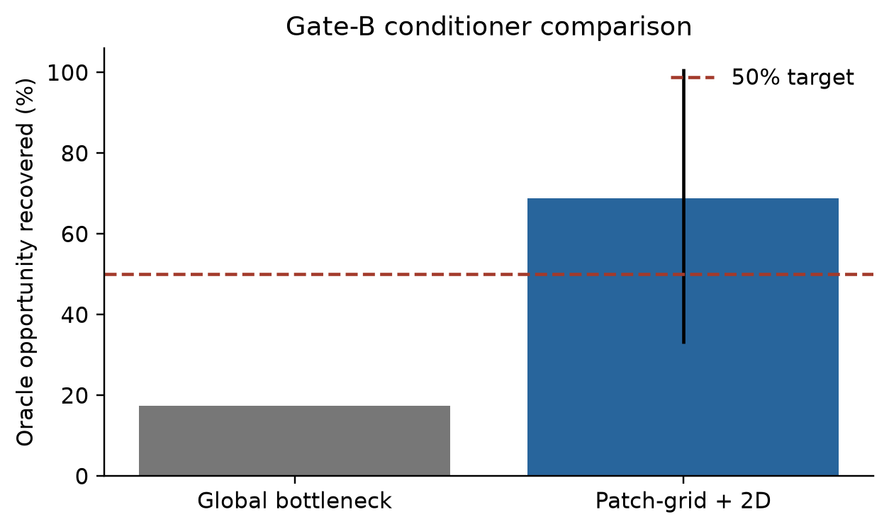
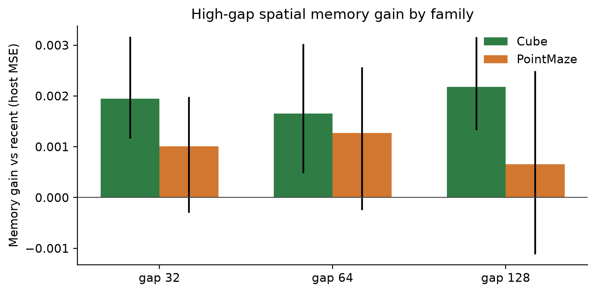
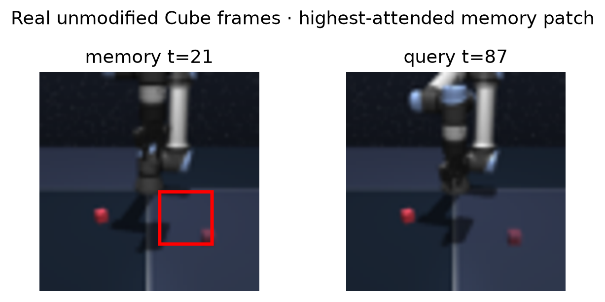
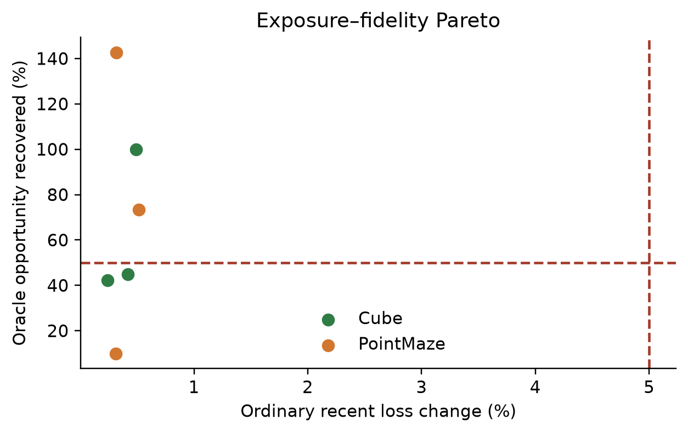

# Spatial / Object-Preserving Conditioner Recovery

## Verdict

The isolated Gate-B experiment completed on the unchanged native long-memory
dataset. It compared the existing global semantic bottleneck with a frozen-DINO
4x4 patch-grid conditioner carrying explicit 2D coordinates.

**Gate B fails under the full criterion.**

- The patch-grid conditioner recovers **77.13%** of oracle opportunity over six
  PointMaze/Cube confirmation cells, with a trajectory/environment/seed
  bootstrap 95% CI of **[41.01%, 118.98%]**. The simple cell mean is 68.86%.
- Mean ordinary recent-only degradation is **+0.382%**; the maximum cell is
  **+0.516%**, both below the +5% limit.
- Empty memory returns the frozen host exactly: fidelity MSE **0.0**.
- Cube has resolved positive gains at gaps 32/64/128, but PointMaze intervals
  include zero at all three high gaps. Only one family passes the positive-CI
  requirement; at least two are required.
- The recovery lower interval clears the preferred 40% level.

The mean recovery exceeds 50%, but family replication does not. Gate C and
downstream use were therefore not run.

## Fixed inputs and isolation

The experiment reuses `outputs/cem_native_long_v1` without changing:

- trajectory splits or query recipes;
- Gate-A thresholds, opportunity masks, or oracle frame indices;
- event discovery, candidate selection, or memory cohorts;
- the action-conditioned host or raw memory adapter.

Every cell reconstructs Gate A from its frozen checkpoint and asserts exact
equality with the stored test opportunity mask and oracle frame indices.
Host digests remain unchanged. No cue labels, event labels, reward, goal state,
manual patch, selector, or Graph-CEM component is loaded.

## Conditioner

The tested spatial path uses:

- frozen DINOv2 `x_norm_patchtokens`;
- a 4x4 spatial pooling of the 14x14 patch grid;
- 16 historical memory tokens and 16 current query tokens;
- explicit normalized 2D coordinates and extent;
- age, timestamp, and action-segment metadata;
- current-patch to memory-patch bounded cross-attention;
- location-preserving slot residuals followed by separate recent/history host
  heads;
- zero-initialized host residuals and gates.

Only the conditioner is trainable. The host has no trainable adapter.

The model averages **2,276,962 parameters**. Its fixed payload is
**49,664 bytes** (16 tokens containing patch features, reserved delta fields,
coordinates/extent, and metadata), versus 1,536 bytes for the global baseline.
Both paths use four host rollout calls. Wall-clock cell time averaged 31.2 s;
standalone inference latency was not isolated in this focused run.

## Requested smoke

Smoke used seed 0, 192 train queries and 128 validation/test queries:

- Cube-single on GPU2: global recovery **8.31%**; spatial recovery **36.70%**,
  memory-gain CI **[0.000252, 0.001640]**.
- PointMaze-large on GPU1: global recovery **15.16%**; spatial recovery
  **−4.58%**, memory-gain CI **[−0.002011, 0.001150]**.

Training emitted per-epoch loss, validation recovery, and ordinary degradation.
The mixed smoke did not justify object/delta breadth. A focused full-query
patch-grid confirmation was run before stopping expansion.

## Full focused confirmation

Three seeds each were run for Cube-single and PointMaze-large.

Cube recoveries were **99.98%**, **42.13%**, and **44.99%**. PointMaze
recoveries were **9.91%**, **142.71%**, and **73.45%**. The high variance is
why the mean alone is insufficient.

Resolved high-gap host-MSE gains:

- Cube gap 32: **0.001943**, CI **[0.001166, 0.003166]**;
- Cube gap 64: **0.001654**, CI **[0.000481, 0.003025]**;
- Cube gap 128: **0.002181**, CI **[0.001331, 0.003162]**.

Unresolved PointMaze gains:

- gap 32: **0.001012**, CI **[−0.000293, 0.001980]**;
- gap 64: **0.001272**, CI **[−0.000245, 0.002572]**;
- gap 128: **0.000659**, CI **[−0.001111, 0.002492]**.

## Spatial diagnostics

Mean attention entropy is **2.7726**, essentially `ln(16)`, and all 16 memory
patches are utilized. Mean same-location overlap is only **0.0625**, also the
uniform-attention value. Identity-preservation cosine is **0.749**, while mean
slot gate is **0.116** and residual norm is **0.000192**.

Thus the conditioner can expose useful spatial history in Cube, but it does not
learn selective spatial alignment: attention remains nearly uniform. This
explains the unstable PointMaze transfer and identifies **spatial alignment**
as the limiting factor rather than predictor insensitivity or empty-path
safety.

## Gate decision and next step

- Recovery mean >=50%: **PASS**.
- Ordinary degradation <=5%: **PASS**.
- Empty-memory exactness: **PASS**.
- Positive high-gap CI in at least two families: **FAIL (1/2)**.
- Preferred recovery lower CI >40%: **PASS (41.01%)**.
- Overall Gate B: **FAIL**.
- Gate C: **NOT RUN**.
- Downstream: **NOT RUN**.

Object-token and event-delta variants were not expanded after the mixed smoke
and unresolved family confirmation. The next defensible experiment is not
more selection or graph work: it is a small alignment-specific correction
(for example, non-uniform locality/transport supervision) on the same fixed
patch-grid interface, validated first on PointMaze. No paper claim is added.

## Artifacts

- `lewm/models/spatial_memory_conditioner.py`
- `scripts/run_cem_spatial_conditioner.py`
- `scripts/test_cem_spatial_conditioner.py`
- `scripts/plot_cem_spatial_conditioner.py`
- `outputs/cem_spatial_conditioner_v1/report.json`
- `outputs/cem_spatial_conditioner_report.json`
- six full cell directories with models, evaluations, patch banks, and
  patch-level decision logs;
- seed-0 `smoke_result.json` files for both requested smoke environments;
- `outputs/cem_spatial_conditioner_v1/figure_receipt.json`.

All six confirmation jobs completed on GPUs 1/2. GPU3 was not used. No
selector, graph, paper, commit, or push operation was performed.

## Alignment and random-masking follow-up

The final alignment factorial is complete on the same six cells. No new
treatment improves the 68.86% no-alignment baseline: random 25/50/75 recover
41.46%/17.76%/36.47%, semantic-change masking recovers 33.68%, causal
alignment 35.28%, and random-plus-causal 24.97%.

Random 50% gives the best masked-patch reconstruction but only 17.76% host
recovery, proving that reconstruction does not imply decision-relevant memory.
Causal and hybrid patch ranking remains chance; both reduce PointMaze recovery
with resolved negative intervals. Attention remains uniform. Gate B and Gate C
remain failed/stopped, and the conditioner line is closed for this global host
loss. Full results:
[`CEM_PATCH_ALIGNMENT_REPORT.md`](CEM_PATCH_ALIGNMENT_REPORT.md).
