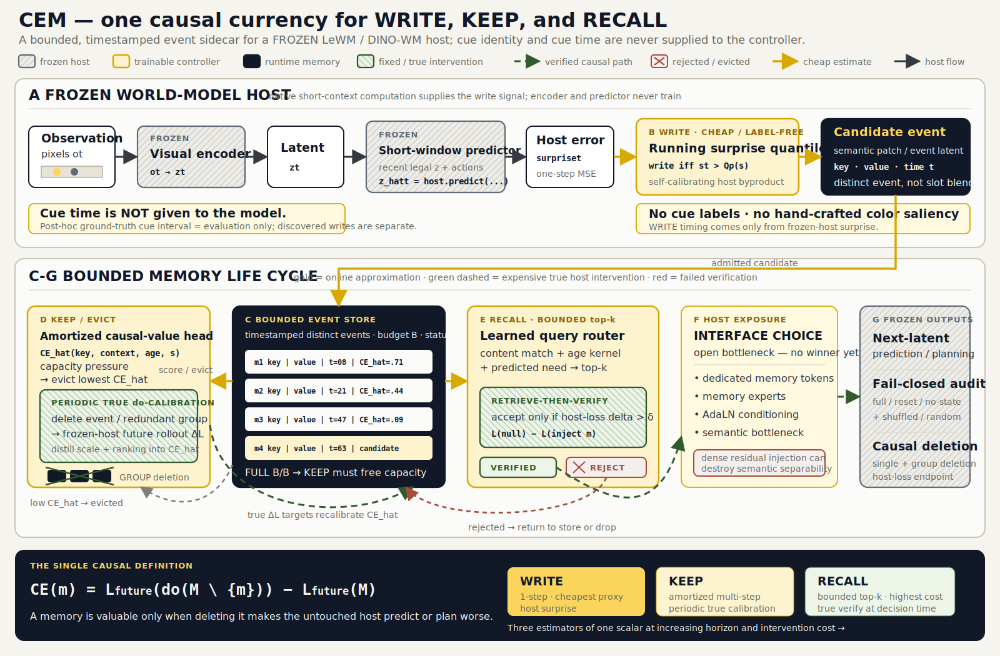

# An Emergent Paradigm for Causal Cue-Memory in Frozen World Models

**Moderator synthesis of three researcher proposals (IDM / CESR / Free-Energy-Gated).**
Scope: beyond-context-window cue/key retention for a **frozen** LeWM / DINO-WM host, with an *explicit, interventional* account of the cue, grounded in this repo (`paper_c/body.tex`, `scripts/run_lewm_pusht_host_writer.py`, `scripts/causal_evidence_test.py`, `scripts/run_masked_evidence_jepa_ogbench.py`).

---

## 1. The three paradigms, in their strongest form

**A — Intervention-Defined Memory (IDM).** Invert the repo's current pipeline. Today a hand-authored saliency miner decides *what to keep* and a `do`-deletion audit (`causal_evidence_test.py`) only *checks* it afterward. IDM makes the `do`-operator the **write/keep/evict policy itself**: a past latent earns a slot **iff** deleting or altering it measurably changes the frozen host's own future-latent prediction — its *interventional necessity*, `CE(m) = err(host | M∖{m}) − err(host | M)`. A gate `g_φ(z_t, s_{t-1})` is trained (no cue labels) to (a) minimize host future error with memory injected (sufficiency), (b) maximize per-item `CE` (necessity), under (c) a hard budget (compactness); eviction drops the lowest-`CE` item. Memory is, by construction, "the minimal set of interventionally load-bearing latents," and the cue is explained by a `do`-quantity rather than an attention correlation.

**B — Causal Event-Store + Learned Query Router (CESR).** Separate *retaining* from *knowing when to recall* — the problem the paper explicitly punts on (`app:autoage`: current results are unseen-age *generalization*, "not a learned age router that decides how far back to retrieve"). Replace the bounded `S×D` slot blob with an **append-only, timestamped event store** written online by a salience/change head, and a **learned router** that scores every key by content match, a learned age-kernel `φ(τ_now − τ_i)` over the existing normalized `time_tokens`, and a *predicted-need* term, returning bounded top-k. A retrieved key is **accepted only if a retrieve-then-verify counterfactual** shows it lowers the host's decision/planning loss. This targets **unbounded-horizon recall at unknown delays with O(k) read compute** and multi-event interference — regimes the paper never tests.

**C — Predictive-Surprise / Free-Energy-Gated Memory.** Delete the miner entirely; let the **frozen host's own prediction error** decide what is worth remembering. Write is *admissible* iff instantaneous surprise `s_t = ‖ẑ_t^host − z_t‖²` exceeds a self-calibrating quantile of the host's own error stream, and *kept* iff retaining the trace **lowers the host's expected future next-latent loss** over a post-window horizon `τ`, with a write-cost term `β·E[g_t]` — i.e., variational free energy (surprise + description length). Label-free, saliency-free; this is the mechanistic fix to the "artificial colour/saliency miner" critique (a colour the host already predicts has zero reducible surprise and is never written). The cue is causal by the **reduction in host rollout loss** its trace produces.



*Figure — Current CEM architecture.* Dark arrows are frozen-host flow; yellow marks cheap online estimates and trainable controller decisions; green dashed paths are verified or periodic true `do`-interventions; red/gray paths are rejected or evicted events. Cue identity and cue time are unavailable to the model: the marked ground-truth cue interval is post-hoc evaluation only. The exposure block deliberately lists candidate interfaces rather than a solved injector, reflecting the v3 finding that dense residual injection can erase semantic separability.

---

## 2. The debate: agreements, genuine conflicts, strongest/weakest claims

### 2.1 Where they actually agree (the emergent consensus)

- **One currency: the frozen host's own future-latent loss.** All three refuse "internal decodability" as the target and read causality/utility out through `host.predict(...)` (the repo's stated stance: judge by *host exposure and use*, `body.tex:57–59, 915–928`). A's `CE`, B's verify-gate, and C's keep-test are the *same scalar* — the change in host future/rollout loss under a memory intervention — at different horizons and latencies.
- **Interventional, not correlational.** All three explicitly reject attention weight as the account of the cue (A: "audit → objective"; B: "verified control action, not attention"; C: "high attention ≠ host predicts worse without it"). This is the direct answer to the reviewer critique baked into `causal_evidence_test.py`.
- **Label-free write, labels only in the audit** (matches `training_loss_uses_cue_labels: False`).
- **Frozen host, residual injection.** All plug into the existing `fused = context_z + residual_scale · gate · delta` path (`run_lewm_pusht_host_writer.py:421–433`); only writer/gate/router train.
- **Shared failure mode: frozen-host blind spots.** A, B, and C each concede that if the frozen encoder/predictor discards the cue, the causal signal collapses to ≈0 everywhere and nothing can be written or verified — a genuine *interface* limit, reportable as a null.

### 2.2 Where they genuinely conflict (and the adjudication)

| Tension | A (IDM) | B (CESR) | C (Free-Energy) | Adjudication |
|---|---|---|---|---|
| **Online cost of `do`** | Full leave-one-out ≈ O(B) host forwards **every step** — infeasible online | Verify only top-k at *recall* (bounded) | Surprise gate is ~free (byproduct of host forward); keep-test is a training-time horizon rollout | **C wins for WRITE, B wins for RECALL, A's per-step online `do` loses** — must be *amortized* (see §3). |
| **Retain vs recall** | Retains; assumes you know to read | **Recall at unknown delay** is the whole point | Retains; keep-horizon `τ` fixed | **B is the missing third axis.** A and C solve *what stays*; neither decides *how far back to pull*. |
| **Write criterion** | Interventional necessity (expensive, correct) | Salience/change head (cheap, **re-imports the artificial-saliency critique**) | Reducible surprise (cheap, label-free, saliency-free) | **C's surprise replaces B's salience head.** Removes B's weakest link. |
| **Correlation vs causality** | Pure `do` | Router prefilter is content-correlation, *then* verify | Surprise is self-referential prediction error (a 1-step causal proxy), keep is `do` | **Correlation is allowed only as a cheap prefilter; the criterion is always the `do` through host loss.** |
| **Aleatoric vs reducible surprise** | N/A (necessity test filters it) | N/A | **Vulnerable**: stochastic noise is high-surprise but unretainable | **A's necessity/keep-test filters C's aleatoric waste** (noise → CE≈0). Direct A→C synergy. |
| **Redundancy / group necessity** | **Weakest point**: cue shown 3× (repo `cue_single` Δ small) → per-item leave-one-out under-credits, may drop all copies | Store dedups by content key | Consolidation into one trace | Use **set-level / Shapley-style** counterfactuals + consolidation; single-item `CE` is a known confound in `causal_evidence_test.py` (the count-matched K=3 design exists *precisely* for this). |

### 2.3 Strongest and weakest claim of each

- **A — strongest:** the criterion is *definitionally* correct — "memory = what changes the future when removed" is exactly what a fail-closed audit should certify, and it makes the audit and the objective the same operator. **Weakest:** naive per-step leave-one-out is computationally infeasible online and its soft surrogate can diverge from hard deletion (surrogate gaming), plus the 3× redundancy under-crediting.
- **B — strongest:** it is the only proposal that confronts **recall at unknown/interleaved delays and multi-event interference** with bounded O(k) compute — the paper's own open problem. **Weakest:** the online write head is salience-based, re-importing the artificiality critique; and the router can shortcut to recency unless age is decorrelated from relevance.
- **C — strongest:** the write signal is label-free, saliency-free, and *host-grounded* — it kills the colour/saliency bias mechanistically and needs no new supervision surface (reuses the host's pretraining loss). **Weakest:** conflates reducible and aleatoric surprise, and its keep-horizon `τ` is a fragile hyperparameter (too short → gate collapses; too long → vanishing credit).

### 2.4 The blind spot common to all three (must be stated honestly)

On a **frozen** host, the achievable ceiling is set by *carrier–host coupling*: if `encode_pixels`/`predict` never represents the cue in a way that moves future-latent loss, no write/keep/recall policy can manufacture exposure. All three must therefore **report a host-sensitivity ceiling** and treat a flat `CE` as a null result (host cannot use the cue), not as a policy failure — and must guard against the residual writer *smuggling* information the host never actually *uses* (the `use`/planning gate, `body.tex:178`).

---

## 3. The converged paradigm — **CEM: Causal-Effect Memory**

The three proposals are not competitors; they are the three decisions of one memory controller — **WRITE (whether), KEEP (what stays), RECALL (how far back)** — and they are already reaching for the *same* scalar. Converge them under **one criterion**: *effect on the frozen host's own future-latent prediction / rollout loss under a `do`-operation on memory.* We adopt the natural decomposition the brief proposes, but with two non-rubber-stamp corrections: (i) A's online `do` is replaced by an **amortized surrogate calibrated by periodic true interventions** (A's per-step leave-one-out is infeasible); (ii) B's salience write head is replaced by **C's reducible-surprise gate** (salience re-imports the artificial-miner critique). This is strictly better than any single proposal: it is cheap online (C), causally correct on what stays (A), and solves recall at unknown delay (B), with correlation demoted to a mere prefilter.

### 3.1 The single definition that ties it together

> **A stored latent `m` is a *causal cue* iff intervening on memory — `do(M → M∖{m})` or `do(m → null)` — increases the FROZEN host's own future-latent prediction/rollout loss, read out through the host's untouched forward pass, over the post-window horizon after the cue is illegal to attend.**
>
> Formally, with the host's own next-latent target (self-supervised, no labels):
> **`CE(m) = E_t [ Σ_{k=1..τ} ‖host.predict(z̃_{<t}; M∖{m})_{t+k} − z_{t+k}‖² ] − E_t [ … ; M ]  >  δ`.**
>
> `m` is *causal* iff `CE(m) > δ`; the memory is *valid* iff every retained slot satisfies this and the set is minimal. **WRITE, KEEP, and RECALL are three estimators of this one scalar** at increasing horizon and decreasing latency budget.

- **WRITE = the 1-step, zero-cost estimator.** Host surprise `s_t = ‖ẑ_t^host − z_t‖²` is the instantaneous self-referential proxy: information the host *cannot* predict now is the only information whose storage *can* lower `CE` later. Admit iff `s_t` exceeds a running quantile of the host's own error stream (self-calibrating, saliency-free, label-free). Surprise is a free byproduct of the host forward pass.
- **KEEP = the amortized multi-step estimator.** A small head `ĈE_ψ(m, context, age)` predicts `CE(m)` and is trained by **distillation against periodic *true* hard-deletion interventions** on sampled subsets (every N steps / an offline minibatch). Online eviction drops the lowest `ĈE_ψ`; the true `do` is paid rarely, not every step. This is the fix to A's cost and to C's aleatoric waste (noise has true `CE≈0`, so `ĈE_ψ` learns to prune it). Redundant copies are scored with **set-level / Shapley** counterfactuals and consolidated, fixing A's leave-one-out under-crediting.
- **RECALL = the bounded verified estimator.** Keep the append-only timestamped store + router (B): score keys by content + learned age-kernel `φ(age)` + predicted-need, take top-k (k≈4 = current slot count), then **verify** — inject each top-k key vs. a matched null and *accept only if the host's rollout loss drops by δ* (retrieve-then-verify). Correlation (content/age) is only the prefilter; the `do` through host loss is the acceptance test. This is the only part that pays a true counterfactual at test time, and it is bounded at O(k).

### 3.2 The unified WRITE / KEEP / RECALL policy (precise)

```
WRITE(z_t):   admit z_t to store E  iff  s_t = ‖host.predict(z_{t-H:t-1}, a)[-1] − z_t‖²  >  Q_ρ(surprise stream)
KEEP(E):      while |E| > B:  evict argmin_m ĈE_ψ(m, ctx, age)      # amortized causal necessity
              recalibrate ĈE_ψ every N steps against true do-deletion CE(m) on a sampled subset
RECALL(q_t):  cand = top-k_i [ ⟨q_t, c_i⟩ + φ(τ_now − τ_i) + ψ(q_t) ]      # correlation prefilter
              accept m ∈ cand  iff  L_host^rollout(do(inject m)) < L_host^rollout(null) − δ   # verify
              inject accepted keys via fused = context_z + residual_scale · gate · delta
```

Everything below the encoder/predictor is frozen; trainable = surprise threshold controller, `ĈE_ψ`, router (`φ`, `ψ`), and the residual writer/gate. The training loss is the host's own future-latent MSE + a necessity term (correlate `ĈE_ψ` with true `CE`) + router ranking loss + `β·E[g_t]` free-energy write cost + budget.

### 3.3 Why this convergence and not another

An alternative would be "pure A everywhere" (make `do` the online policy for all three decisions). We reject it: per-step leave-one-out is O(B) host forwards/step and its soft surrogate is exactly what A lists as its own top failure mode. Another alternative is "pure C + B" (drop A's explicit necessity). We reject it too: without the amortized `CE` keep-test, C wastes budget on aleatoric surprise and the cue's causality is only ever a 1-step proxy, never certified multi-step. CEM keeps A's *criterion* (the definition of causal), spends A's *cost* only periodically (amortization), and adds B's recall axis with C's write gate — the minimal design in which one scalar governs all three decisions.

---

## 4. Making causality explicit **and** cheap

**Explicit.** Causality is never inferred from attention. Every retained slot carries a reported `CE(m)` (or `ĈE_ψ` with periodic true-`CE` calibration), and every recall is a logged `do`-test through the host's own loss. The "explanation" of a cue *is* its interventional-necessity number.

**Cheap.** The `do` is paid at three separated cadences: (1) **WRITE** — free (surprise = host forward byproduct); (2) **KEEP** — amortized, true `do` only on a sampled subset every N steps to regenerate distillation targets and correct surrogate drift; (3) **RECALL** — one true verify on k candidates, O(k). No component pays A's per-step full leave-one-out.

**Amortized surrogate + periodic true-intervention calibration.** `ĈE_ψ` is a distilled regressor of the hard-deletion `CE`. Calibration is the anti-gaming mechanism: report the **correlation between `ĈE_ψ` and true hard-deletion `CE`** on held-out slots; if it drifts, increase calibration frequency. Straight-through/Gumbel gates give differentiability, validated against hard deletions.

**Expected interventional rankings that validate it** (sharper than the current `causal_evidence.json`, where cue Δ≈0.66–0.77, top-attended intermediate, random≈0):

- **On stored slots:** `CE(CEM-selected) ≈ CE(true-cue) > CE(top-attended) > CE(random) ≈ CE(recent-legal) ≈ 0`.
- **Necessity-calibration curve:** deleting slots in `ĈE_ψ` order yields **monotone** host-rollout-loss increase; random-order deletion is **flat**.
- **Age-referenced:** `CE(m)` **grows with cue age** (the legal window can no longer substitute) — the signature that memory, not context, carries the cue.
- **Surrogate fidelity:** high Spearman correlation between `ĈE_ψ` and true `do`-deletion `CE`.
- **Recall:** verify-gate accepts true cues and **rejects distractors/nulls** (ΔL(true) ≫ ΔL(recent) ≈ ΔL(random) ≈ 0), with router precision@k above a recency-only baseline.

---

## 5. Concrete, staged experimental plan (grounded in the repo)

**Primary endpoint throughout: improvement in the host's OWN future-latent prediction / planning loss `L_host^rollout` — not label decodability.** Label BAcc is retained only for the fail-closed gate.

- **Stage 0 — Instrument the host loss.** Extend `run_lewm_pusht_host_writer.py` to report `host.predict` multi-step rollout MSE with vs. without injected memory at each age (reuse the frozen `state_digest` check to prove nothing in the host moved). This is the metric the paper currently *lacks* and every later stage reports it.
- **Stage 1 — Fail-closed audit (reuse verbatim).** `full / reset / no-state` with `BAcc_full ≥ 0.75`, `BAcc_{reset,no-state} ≤ 0.35` (`body.tex:187`), across OGBench decks (`pointmaze / puzzle / cube / scene`) and frozen-LeWM PushT binding, five seeds. Baselines: SlotMemory (attention writer), StreamingSlotMemory `M_t=f(M_{t-1},Z_{t-K+1:t})`, GRU/LSTM/Mamba-lite. Predict CEM's largest margins at old ages and on `relational` / `two_cue_overwrite`.
- **Stage 2 — Causal-deletion on memory items (extend `causal_evidence_test.py`).** Delete **stored slots** (not input frames) and score the **host's rollout loss** (not a ridge readout). Reproduce the count-matched K=3 design to control cue redundancy; report the rankings and necessity-calibration curve of §4. Ablate the causal KEEP term → collapses to a correlational writer (isolates the `do`-term's contribution).
- **Stage 3 — Recall at unknown delay + interference (reuse `run_multiview_patchset_auto_age.py`).** (a) Age-scaling to **128** via `PAPER_C_AGES`, then **UNKNOWN / interleaved** log-uniform delays; report **max-passing-age** by doubling/binary-search under the Eq.(gate) thresholds. (b) **Multi-event interference:** inject 2–4 competing old cues; report router precision@k and verify-gate distractor rejection. (c) Router-shortcut control: age-decorrelated cues + hard-negative recent distractors so `φ(age)` cannot collapse to "prefer recent."
- **Stage 4 — Surrogate fidelity & host-sensitivity ceiling.** Report `corr(ĈE_ψ, true CE)`; ablate periodic calibration → measure surrogate drift. Report the frozen-host sensitivity ceiling (flat `CE` ⇒ null, not shortcut). Run on **both frozen LeWM (PushT binding) and DINO-WM**.

**What would FALSIFY the paradigm:**

1. `ĈE_ψ` cannot be distilled (low correlation with true hard-deletion `CE`) → KEEP is not actually causal; the amortization premise fails.
2. CEM's host-rollout-loss improvement is **not better** than a correlational saliency/attention writer at any age → the `do`-criterion adds nothing over correlation.
3. Surprise-write fills the budget with **aleatoric** noise and the KEEP `CE`-test fails to prune it (noise shows non-zero `ĈE_ψ`) → C's weakness is unresolved.
4. On the frozen host, `CE ≈ 0` everywhere **while a probe shows the cue is decodable** → the residual is smuggling unusable info (fails the `use` gate), or the host is blind (report as an interface null).
5. Router verify **rejects true cues** at unknown delays, or precision@k is no better than a recency-only baseline → recall is unsolved.

---

## 6. Honest positioning and top risks

**Positioning.**
- **I-JEPA / Causal-JEPA:** in-context (masked) latent prediction and object-level causal *representation*; no cross-window persistence, no write decision, no `do` on a *downstream frozen host's loss*. CEM adds a persistence layer whose criterion is host future-loss under intervention.
- **SlotMemory (this repo / object-centric KV):** writes by attention and audits later; CEM makes the audit the objective (KEEP) and adds a recall policy (RECALL). Predicts dominance on overwrite/distractor and unknown-delay recall.
- **Titans (test-time surprise memory):** also surprise-driven, but surprise updates *its own* fast-weights; CEM's surprise is a *write gate for a frozen foreign host*, and retention is certified by that host's future loss, not the memory module's own loss. Surprise ≠ necessity: a surprising-but-inert event has high surprise, `CE≈0`.
- **Predictive-coding / active-inference:** CEM takes free energy (surprise + description-length write cost) literally as the WRITE objective, supplying the normative "why keep it" those frameworks assert but rarely operationalize against an external host.
- **RULER / LongMemEval:** those *measure* long-context retrieval; CEM makes retrieval a *verified control action* (retrieve-then-verify) and reports the host's own loss, not answer accuracy.
- **"On Memory":** argues memory should be judged by downstream use; CEM *operationalizes* "use" as a measurable host-rollout-loss delta and adds a fail-closed admission criterion.

**Top risks.**
1. **Surrogate gaming / drift** — `ĈE_ψ` diverges from true `do`. Mitigation: periodic hard-deletion calibration is a first-class, reported metric, not an afterthought.
2. **Frozen-host blind spots / carrier–host coupling** — the achievable ceiling is the host's own cue-sensitivity; a flat `CE` is a null, and the `use` gate guards against smuggling unusable residuals.
3. **Verify latency at recall** — bounded to O(k) top-k with cached null keys; still non-trivial per decision.
4. **Aleatoric surprise budget waste** — the KEEP `CE`-test and `β·E[g_t]` cost are the only defenses; must be shown to work under stochastic environments.
5. **Credit-assignment horizon `τ`** — too short collapses the gate, too long vanishes gradients; curriculum `τ` tied to the age schedule.
6. **Redundancy / group necessity** — per-item leave-one-out under-credits repeated cues; set-level/Shapley counterfactuals + consolidation required.

---

## 7. CEM v2 improvements and empirical results

### 7.1 Executed change

CEM v2 changes KEEP calibration from raw-CE regression to normalized
`CE_norm=(L_drop-L_keep)/(L_no_memory+1e-8)` and optimizes Smooth-L1
calibration plus an all-pairs logistic ranking loss (ties excluded). True
deletions were run every optimizer step in the focused jobs. The LeWM writer
already implements query-conditioned injection: each current frozen-host
context token is the query in cross-attention over the surprise-gated memory
slots, and only the retrieved attention result is passed through the residual
writer. Both host digests remained unchanged.

### 7.2 Real focused results (age 15)

| Host / task | Seed | Loss memory / no memory | Full / reset / no-state BAcc | Audit | Spearman | High-CE deletion / random |
|---|---:|---:|---:|---|---:|---:|
| LeWM six-way binding | 0 | 0.24398 / 1.339995 | 0.17083 / 0.15833 / 0.15833 | FAIL | 0.6491 | 0.0001726 / -0.0000091 |
| LeWM six-way binding | 1 | 0.24397 / 1.339995 | 0.15417 / 0.15417 / 0.14583 | FAIL | 0.6553 | 0.0001638 / -0.0000035 |
| LeWM six-way binding | 2 | 0.24405 / 1.339995 | 0.17292 / 0.15833 / 0.15417 | FAIL | 0.1249 | 0.0001095 / -0.0000046 |
| DINO-WM Wall | 0 | 1.07315 / 1.07320 | 0.27500 / 0.25417 / 0.25000 | FAIL | 0.0500 | -0.0000410 / -0.0000496 |

The LeWM ranking target passed on seeds 0/1 but failed on seed 2; high-CE
deletion exceeded random on all three, though the absolute deltas are tiny.
The semantic success target failed all three seeds: host-output BAcc is
0.1542--0.1729, essentially six-way chance and far below 0.75. The diagnostic ladder
localizes the loss after injection: the raw cue latent is readable
(BAcc 0.9958), the frozen decision latent is chance (0.1667), and full memory
does not exceed reset/no-state. Moreover, memory-vs-no-memory loss improves by
1.0960 while memory-vs-reset improves by only 0.01757. Thus the large generic
loss reduction is not relation-specific host use; query-conditioned attention
alone does not solve the frozen LeWM host-exposure/interface bottleneck.

The focused two-epoch DINO-WM run is a negative result relative to v1:
memory/no-memory loss is nearly identical (improvement 0.000054), audit is
0.275/0.254/0.250 and fails, and held-out Spearman is 0.05. Both high-CE and
random deletion deltas are negative and nearly zero. This is not evidence
against the v1 DINO result (which used longer training); it diagnoses the
requested smallest run as undertrained and shows that increasing deletion
frequency alone does not provide a useful target when true normalized CE has
near-zero variance at the current writer state.

### 7.3 Artificial-miner probe

A real 200-episode `shape_random_color` run gives surprise-write BAcc 0.5197
versus saliency-write 0.2782 (chance 0.25). Surprise writes a cue in 32.5% of
episodes and the predictable distractor in 0%; handcrafted saliency writes the
cue in 0% and distractor in 100%. The matched `color` control gives 0.5333
versus 0.2782, with surprise cue/distractor rates 36.5%/0%. This falsifies the
specific claim that handcrafted color saliency is required, but does **not**
fully resolve semantic retention: surprise BAcc remains below the probe's
0.75 retention criterion. This focused script uses frozen-host semantic
features, not a pretrained DINO patch target, so priority C is only partially
completed.

### 7.4 Status, limitations, and next decision

- Real artifacts: `outputs/cem_lewm_v2/multi-item-visual-binding-recall/s*/`,
  `outputs/cem_shortcut_v2/summary.json`, and
  `outputs/cem_dinowm_v2/wall/s0/`.
- Real decision-log visualizations:
  `docs/assets/cem_v2_lewm_memory_timeline.{png,pdf}`,
  `docs/assets/cem_v2_lewm_value_scatter.{png,pdf}`,
  `docs/assets/cem_v2_dinowm_memory_timeline.{png,pdf}`, and
  `docs/assets/cem_v2_dinowm_value_scatter.{png,pdf}`.
- Router/multi-event, delay curves, memory-budget curves, Kendall/pairwise
  metrics, and v2 visualizations were not completed in this focused execution;
  no claims are made for them.
- The next three improvements are: train the LeWM counterfactual-separability
  objective at the injected-context boundary; calibrate group-level CE for the
  redundant three-frame cue; and add a frozen DINO patch-token writer followed
  by unknown-delay/capacity sweeps.

*CEM v2 focused update: 2026-07-21. No files under `paper_c/` were modified.*

---

## 8. CEM v3 targeted fixes

### 8.1 Methods

V3 adds paired, label-free counterfactual supervision from the existing
same-trajectory six-candidate cue cache. Candidate 0 is the rendered branch
matching the observed trajectory; the other five are same-base alternatives.
InfoNCE plus positive-cosine losses are applied at memory, injected-context,
and/or frozen-host-output boundaries. Semantic class labels remain post-hoc
audit-only. The factorial is:

- **A:** host loss + normalized/ranking CE, generic mean-slot injection.
- **B:** A + context counterfactual separability.
- **C:** A + frozen-host-output counterfactual separability.
- **D:** query-conditioned cross-attention + both separability losses.

Group KEEP jointly deletes the three cue-window frames and matched disjoint
three-frame distractor groups. The group head receives mean latent, mean
surprise, and mean age; it uses the same normalized Huber + pairwise ranking
objective as single-item KEEP. Encoder and predictor digests were unchanged in
all twelve runs.

### 8.2 LeWM age-15 factorial: exact three-seed means

| Config | Loss memory / no memory | Cue latent | Memory-only | Injected context | Host output | Host-output gate |
|---|---:|---:|---:|---:|---:|---|
| A | 0.26468 / 1.339995 | 1.0000 | 0.9250 | 0.1750 | 0.1576 | FAIL |
| B | 0.26819 / 1.339995 | 1.0000 | 0.9278 | 0.1806 | 0.1563 | FAIL |
| C | 0.26895 / 1.339995 | 1.0000 | 0.9278 | 0.1813 | 0.1556 | FAIL |
| D | 0.26025 / 1.339995 | 1.0000 | 0.9194 | 0.1688 | 0.1556 | FAIL |

All full/reset/no-state/host-only/shuffled/random controls remain in
0.1417--0.1729, around six-way chance and below the 0.2167 fail-closed ceiling.
No configuration reaches the 0.75 host-output gate. The decisive localization
is now direct: cue identity remains highly readable in memory (0.90--0.952 per
seed), then collapses immediately in the injected context (0.160--0.188).
Host-output separability cannot recover information that the residual
injection map has already projected away. V3 therefore falsifies the hypothesis
that adding boundary contrastive losses to the current residual parameterization
is sufficient; the remaining bottleneck is the host-compatible injection
subspace, not storage or candidate supervision.

### 8.3 Group causal effect

For config D, group-CE Spearman is 0.6000/0.6571/0.1429 and pairwise ranking
accuracy is 0.7333/0.8000/0.5333 (means 0.4667 and 0.6889). The predicted
highest group is the true cue group on all three seeds and its normalized
deletion effect exceeds the matched random group on 3/3 seeds. Raw cue-group
deletion effects are 0.00595/0.00630/0.00560, versus predicted high
single-frame effects 0.000313/0.000238/0.000225: joint deletion exposes roughly
20--26× more causal signal. Group scoring solves the redundancy/dilution
diagnosis at the top-group decision, but not the stricter every-seed
`Spearman>0.5` target because near-zero distractor groups remain noisy.

### 8.4 Frozen DINOv2 semantic target and shortcut test

The available local encoder is DINOv2 ViT-S/14
(`dinov2_vits14_pretrain.pth`); no model was downloaded. V3 uses frozen
`x_norm_patchtokens` with stop-gradient. Surprise semantic selects the patch
with greatest temporal semantic change while WRITE timing remains the frozen
host's own prediction surprise; random frame/patch is the semantic baseline.

Across three real 200-episode `shape_random_color` runs, semantic surprise BAcc
is 0.5045/0.3665/0.6196 (mean 0.4969), versus handcrafted saliency
0.1605/0.2032/0.2343 (mean 0.1993) and random semantic patches
0.3256/0.2724/0.3313 (mean 0.3098). Surprise cue/distractor write rates average
35.0%/16.3%; saliency is 0%/100%. Surprise beats both baselines on all seeds,
but only one seed clears 0.60 and the mean remains below the semantic-retention
gate. Thus frozen semantic targets strengthen the anti-artificial-miner result,
but do not fully resolve stable write timing: the remaining variance is
surprise-host calibration, especially distractor leakage on seeds 1/2.

The adequate-training DINO-WM Wall sweep completed. Pooled frozen DINOv2 tokens
(seed 0) reach loss 0.96139/0.96813, audit 0.3917/0.2521/0.2500 (FAIL), and
Spearman 0.3824. Random semantic patches (seed 0) improve to loss
0.87916/0.98128, audit 0.9396/0.25/0.25 (PASS), Spearman 0.6676, and high-CE
deletion 0.04253 versus random 0.01238. Surprise-semantic patches pass all
three seeds: memory/no-memory losses are 0.81936/1.39836,
0.79990/1.51695, and 0.82402/1.32571; full audits are
0.9979/1.0000/1.0000 with reset/no-state fixed at 0.25. High-CE deletion is
0.18467/0.22686/0.18420 versus random 0.00404/0.00154/0.00496, and cue-group
deletion is 0.69758/0.80740/0.62733 versus approximately 0.002 for random.

The host-use and causal-deletion results resolve the artificial-miner concern
on DINO-WM: no handcrafted saliency or color target is used, yet audit passes
3/3 and memory materially changes frozen-host loss. The remaining failure is
KEEP calibration: held-out Spearman is only 0.2471/0.2706/0.4588, below 0.5
despite correct high-CE deletion ordering. Random semantic patches have better
seed-0 Spearman (0.6676), so surprise-semantic is the better carrier/use policy
but not the better calibrated CE surrogate.

### 8.5 Artifacts, falsifiers, and next decision

- Decision logs: `outputs/cem_lewm_v3/{A,B,C,D}/multi-item-visual-binding-recall/s*/decision_log.json`.
- Figures: `docs/assets/cem_v3_lewm_exposure_factorial.{png,pdf}`,
  `docs/assets/cem_v3_group_vs_single_ce.{png,pdf}`, and
  `docs/assets/cem_v3_lewm_{memory_timeline,value_scatter}.{png,pdf}`,
  `docs/assets/cem_v3_dinowm_semantic_comparison.{png,pdf}`, and
  `docs/assets/cem_v3_dinowm_semantic_{memory_timeline,value_scatter}.{png,pdf}`.
- Falsified: current residual injection + context/host InfoNCE is sufficient
  for six-way exposure; single-frame CE adequately measures a redundant cue.
- Next decision: replace the unconstrained residual writer with an
  host-Jacobian-aligned or predictor-key/value adapter, then recalibrate
  surprise thresholds per host before expanding delay/router sweeps.

*CEM v3 targeted update: 2026-07-21. No files under `paper_c/` were modified.*

---

## 9. Raw OGBench event memory

The primary raw-event protocol removes the synthetic cue construction used by
the earlier controlled diagnostics. It consumes only original OGBench frames,
actions, and timestamps. Cached cue fields are ignored. Frozen DINOv2 patch
tokens supply semantic features; an action-conditioned DINO-feature host
supplies surprise and future-latent loss. Adjacent adaptive surprise/semantic
change points form provisional groups. Delayed group-loss tests, event
versioning, hysteresis, and bounded query/content/age/need routing determine
which groups are retained and retrieved.

The completed campaign contains 18 cells, 10 environments, and four families.
All hosts beat latent persistence and remained byte-identical during CEM
training. CEM reduced four-step future-latent MSE relative to no memory in all
10 environments (mean cell-level reduction 0.719%), with gains increasing from
0.223% at horizon 1 to 1.061% at horizon 4. Reset, shuffled-episode, and
matched-norm controls were worse than CEM.

The stricter result is mixed. Recent-only state was slightly better on average
and CEM beat it in only 3/18 cells. Predicted group-effect Spearman was 0.037;
high-ranked deletion exceeded matched random deletion in 12/18 cells, but the
mean gap's confidence interval included zero. Post-hoc action-sequence
identification changed only from 0.3030 to 0.3066 and is not planning.
Therefore the raw study supports a small, reproducible prediction benefit from
past visual state, but does not establish reliable causal event ranking or
superiority to a simple recent-state extension.

Controlled synthetic-cue tasks remain useful diagnostics because they isolate
binding, overwrite, and interface failures. They are no longer evidence for
raw-event breadth. The official frozen DINO-WM Wall result also remains
separate from the DINO-WM-style OGBench breadth host.

Full protocol, results, limitations, and reproduction commands:
[`CEM_RAW_OGBENCH_REPORT.md`](CEM_RAW_OGBENCH_REPORT.md).

---

## 10. Graph-CEM gate status

Graph-CEM was evaluated as a possible structured CEM buffer under two
mandatory pre-implementation gates. Both failed, so no graph was built.

The non-default flat conditional-target diagnostic rebuilt the real versioned
store after every deletion, reran fallback/routing, and included pair
deletions. Across PointMaze-large, Cube-single, and Puzzle-3x3 with three
optimization seeds each, conditional CE produced within-query Spearman
`-0.020` (hierarchical 95% CI `[-0.096, 0.055]`), pairwise accuracy `0.493`,
and no environment with a positive high-minus-random deletion lower bound.
This fails Gate 1 and shows that correcting the singleton-versus-empty target
does not by itself make the current event/query features causally ordered.

A disclosed controlled-splice suffix-collision diagnostic then tested gaps
8/16/32/64/128 with exact paired recent observation/action suffixes and
matched four-token, 1,536-byte reads. Oracle historical frames beat
recent-only with resolved intervals at gaps 32/64/128, confirming memory
opportunity. Automatically discovered nodes recovered `66.39%` of the
high-gap oracle-frame gain, below the `70%` Gate 2 threshold. Conditional
selection was negative at gaps 32/64 and closed only `25.3%` of the oracle
event-set gain at gap 128.

Therefore Graph-CEM, edge ablations, all-environment scaling, raw official
DINO-WM replay, and control were hard-stopped. The next valid experiment is a
flat frame-plus-event fallback selector with cross-fitted long-horizon
conditional targets; graph edges should be reconsidered only after both gates
pass. Full results and reproduction:
[`GRAPH_CEM_REPORT.md`](GRAPH_CEM_REPORT.md).

### 10.1 Frame+event fallback follow-up

The required fallback experiment is also complete. A fixed candidate pool adds
eight label-free raw DINO k-center frames to eight automatic events and four
recent frames. Three-fold cross-fitting generates conditional deletion labels
with policies that never train on the held-out source pair. Five bootstrap
heads provide calibrated lower-confidence-bound selection.

Candidate availability now passes the intended diagnostic: oracle union
recovers `87.8%/80.4%/80.6%` of frame-oracle gain at gaps `32/64/128`.
Conditional ordering still fails (Spearman `-0.0072`, pairwise `0.4961`, zero
environments with positive deletion-gap lower bounds), and learned high-gap
recovery is `-36.12%`. Uncertainty calibration and latency pass, so they do not
explain the failure.

Graph reconsideration, scale, official replay, and control remain not reached.
For this host/task configuration, the defensible endpoint is recent-only, not
flat conditional CEM or Graph-CEM. Full protocol:
[`CEM_FALLBACK_SELECTOR_REPORT.md`](CEM_FALLBACK_SELECTOR_REPORT.md).

### 10.2 Native long-trajectory conditioner recovery

The subsequent recovery campaign replaces controlled suffix collisions with
unmodified 140-frame native OGBench trajectories. PointMaze-large,
Cube-single, Puzzle-3x3, and Scene use three optimization seeds each, fixed
trajectory-disjoint train/validation/test splits, and equal four-token recent
and historical reads. Query mining uses only frozen DINO changes/revisits,
frozen-host surprise, actions, and chronology.

Native opportunity passes: the train-only oracle filter retains `27.12%`
(`[24.40%, 29.84%]`) of test queries, and historical frames have resolved
positive gains at gaps `32/64/128` in all four families. The final
host-facing conditioner keeps recent and historical tokens on separate
normalized cross-attention residual paths and preserves ordinary recent-only
loss (`+0.074%` degradation), but recovers only `17.04%`
(`[11.74%, 22.34%]`) of oracle opportunity versus the required `50%`.

Gate B therefore fails. The conservative binary activation gate and downstream
use are hard-stopped; the safe policy remains recent-only with zero activation.
This is not an event-ranking, selective-memory, planning, or control result.
Graph remains stopped. Full protocol:
[`CEM_NATIVE_LONG_REPORT.md`](CEM_NATIVE_LONG_REPORT.md).

### 10.3 Spatial patch-grid conditioner

The frozen-host follow-up replaces the global memory bottleneck with 16
location-preserving DINO patch tokens, 2D coordinates, action/age metadata,
and bounded patch-to-patch cross-attention. The Gate-A dataset, opportunity
masks, oracle frames, and event discovery are asserted unchanged.

Across three seeds each for Cube and PointMaze, mean recovery reaches `77.13%`
with a trajectory/environment/seed CI of `[41.01%, 118.98%]`, only `+0.382%`
ordinary degradation, and exact empty
memory. This does not pass Gate B: Cube resolves positive gains at all high
gaps, while PointMaze intervals include zero, so replication is only `1/2`
families. Attention remains nearly uniform, isolating spatial alignment as the
remaining limitation. Gate C, downstream use, selector work, and Graph-CEM
remain stopped. Full protocol:
[`CEM_SPATIAL_CONDITIONER_REPORT.md`](CEM_SPATIAL_CONDITIONER_REPORT.md).

### 10.4 Patch alignment and random masking

The final fixed-interface factorial tests random patch masking (25/50/75%),
semantic-change masking, frozen-policy causal patch deletion targets, and a
random-plus-causal hybrid. None improves the 68.86% no-alignment baseline:
the respective best recoveries are 41.46% random, 33.68% semantic, 35.28%
causal, and 24.97% hybrid.

Random-50 improves reconstruction most while recovering only 17.76% of host
opportunity. Causal patch ranking remains chance (Spearman `-0.017`, pairwise
`0.495`) and high-effect deletion is no better than random. Causal/hybrid
PointMaze changes are resolved negative. The current global host loss cannot
identify patch-level historical credit, so Gate B, Gate C, downstream, and the
conditioner line are stopped. Full protocol:
[`CEM_PATCH_ALIGNMENT_REPORT.md`](CEM_PATCH_ALIGNMENT_REPORT.md).

### 10.5 Decision-conditioned memory utility

The next campaign conditions memory value on the query goal and candidate
actions rather than generic latent reconstruction. A PointMaze anti-recency
task uses branch-specific raw historical events, exact paired recent
observation/action suffixes, a future-goal latent, and four shuffled native
action sequences.

Gate 1 passes only through relative closure: all history improves action
ranking by `+4.19pp` (`[+3.02,+5.36]`), while discovered events improve by
`+2.44pp` and recover `58.14%` of that oracle gap. The learned decision router
then fails: action gain is only `+0.97pp` with a zero lower bound, DU Spearman
is `-0.001`, pairwise accuracy `0.500`, and positive-utility activation
precision `32.5%`. Gate 2, execution, and breadth are stopped. Full protocol:
[`CEM_DECISION_MEMORY_REPORT.md`](CEM_DECISION_MEMORY_REPORT.md).

### 10.6 MIKASA long-memory admission

The official MIKASA-Robo-VLA v1.0.0 GatherAndRecall3/5 admission used 60
fresh successful motion-planning episodes, three learned-head seeds, raw
two-camera RGB, and an identical 8-event budget and candidate controller for
all matched conditions. The recent suffix contained zero flash frames in
`60/60` episodes (minimum gap 66 frames), and its probe remained weak at
`37.78%` (95% CI `[33.33%, 42.22%]`).

The required oracle opportunity is absent: recent-only executed success is
`37.78%`, oracle single-event is `32.22%`, and oracle full-event is `31.67%`.
Oracle-full minus recent is `-6.11pp` with paired 95% CI
`[-10.56pp, -2.22pp]`; full pre-decision history is also chance at `35.00%`.
The common motor interface itself passes (`60/60` matching candidates succeed,
`120/120` wrong candidates fail). The mandatory gate therefore fails on
oracle gain and oracle execution. Focused CEM, GatherAndRecall7/9 scaling, and
paper changes are hard-stopped. Full report:
[`MIKASA_MEMORY_ADMISSION_REPORT.md`](MIKASA_MEMORY_ADMISSION_REPORT.md).

### 10.7 RoboTwin-MeM long-horizon admission

The official EventVLA/RoboTwin-MeM release was pinned at repository commit
`4b5b26030abddf83bc60e1a6b067de8f521fd0ec` and dataset revision
`f67a4ee99a20c65c86897b85d3f5309b205cc897` (MIT code, Apache-2.0 data).
Simulator execution is unavailable because the published checkout references
but omits `RoboTwin-Mem/task_config/`, `assets/_download.py`, and
`data/_download.py`; no proxy environment was substituted. The official
LeRobot 2.1 fallback passed deterministic loading for 50 episodes per task,
three raw `640×480` RGB views, 14D state/action, and a matched four-frame
(`11,059,200` raw-byte) memory budget.

The preregistered frozen-DINO action head fails all three task gates. Exact
oracle-event-set sequence accuracy is `30.0%` for Pick the Unhidden Block,
`0.0%` for Pick Objects in Order, and `0.0%` for Cover Blocks Hard; recent-only
is `23.3%`, `0.0%`, and `0.0%`, respectively. Event overlap in every recent
suffix is zero, with minimum gaps of 100–102 frames.

A source-hash-frozen Qwen3-VL-4B confirmatory control then evaluates nine
previously untouched episodes per task over three calibration seeds. Cover
Blocks Hard establishes a real memory opportunity—`63.0%` oracle set versus
`3.7%` recent, a paired `+59.3pp` (`[+48.1,+66.7]`)—but still fails the
registered `>75%` oracle-control and recent-probe clauses. Unhidden Block
reaches only `11.1%` oracle set and Pick Objects in Order remains `0.0%`.
Therefore zero tasks are admitted, learned CEM and difficulty scaling are
hard-stopped, and no paper files are changed. Full report:
[`ROBOTWIN_MEM_CEM_REPORT.md`](ROBOTWIN_MEM_CEM_REPORT.md).
