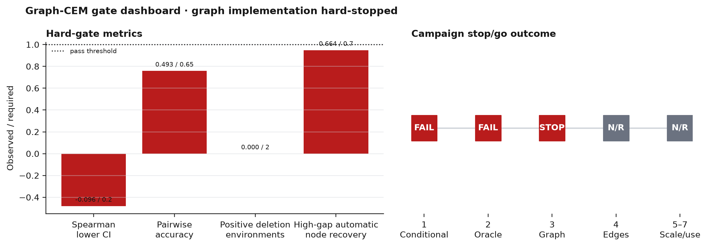
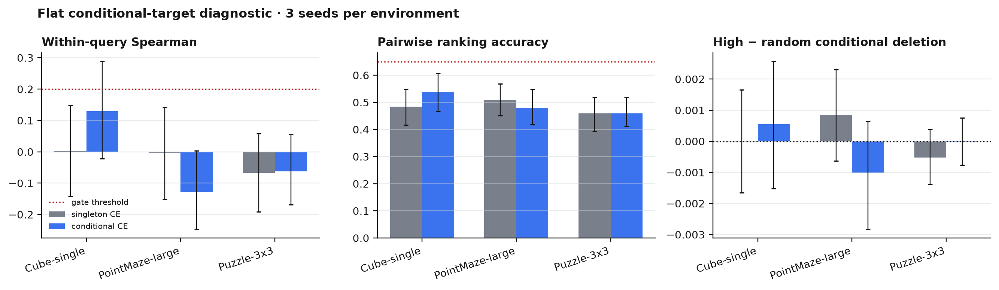
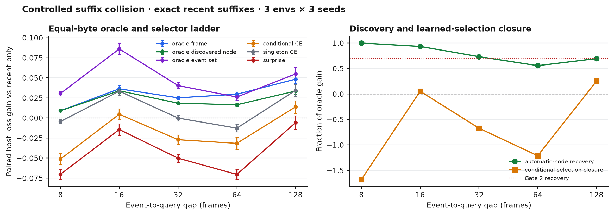

# Graph-CEM Gated Campaign

## Verdict

The campaign stopped before graph implementation, exactly as required by the
preregistered hard gates.

- **Gate 1 — flat conditional target: FAIL.** Conditional CE achieved
  within-query Spearman **-0.020** (hierarchical 95% CI **[-0.096, 0.055]**),
  pairwise accuracy **0.493** (95% CI **[0.457, 0.531]**), and a
  high-minus-random conditional deletion gap of **-0.000167** (95% CI
  **[-0.001129, 0.000752]**). No environment had a positive deletion-gap
  lower bound.
- **Gate 2 — anti-recency opportunity/discovery: FAIL.** The oracle-frame
  opportunity criterion passed at gaps 32/64/128, but automatic discovered
  nodes recovered only **66.39%** of the high-gap oracle-frame gain, below the
  required 70%.
- **Graph built: no.** There is no graph-versus-flat or edge-shuffle result.
  Phases 3--7 were not run.

The result is not “no memory opportunity.” A best historical frame beat the
equal-byte recent-only baseline with resolved intervals at every tested gap.
The bottlenecks are automatic event discovery and learned causal-value
selection. The current flat conditional head should not replace singleton CEM,
and graph structure is not justified yet.

## Hard-gate dashboard



## Phase 1 — flat conditional-target diagnostic

### Protocol

`scripts/run_cem_conditional_ce.py` is a new, non-default path. The original
`scripts/run_cem_raw_ogbench.py`, its outputs, and paper reproduction remain
unchanged.

For each query, the diagnostic:

1. reconstructs the versioned store with the original learned promotion
   threshold, hysteresis, verification delay, semantic keys, and router;
2. uses diagnostic capacity at least four and read top-k two so realistic
   multi-group interactions are observable;
3. measures the full routed-store loss `L(M,q)`;
4. deletes one occupied event payload, rebuilds the store from its history,
   allows same-key fallback, and reruns routing;
5. labels the group with
   `D(G|M,q)=[L(M\G,q)-L(M,q)]/[L(empty,q)+1e-8]`;
6. repeats joint deletions for occupied pairs.

No deleted vector, metadata, version payload, or relation is exposed to the
conditioner. Across all nine test cells the leak counter was zero. The
diagnostic observed 11,147 occupied groups and 2,111 within-store pairs:

| Environment | Seeds | Occupied groups | Pair deletions | Payload leaks |
|---|---:|---:|---:|---:|
| Cube-single | 3 | 3,433 | 539 | 0 |
| PointMaze-large | 3 | 3,692 | 689 | 0 |
| Puzzle-3x3 | 3 | 4,022 | 883 | 0 |

The conditional head predicts a mean and log variance. Training combines
Gaussian NLL, Smooth-L1 calibration, within-query pairwise logistic ranking,
within-query list-wise ranking, and pair-deletion regression. Pair/list-wise
comparisons never cross occupancies or queries. Frozen host digests were
unchanged.

PointMaze-large and Cube-single reuse the three existing optimization
checkpoints. Puzzle seeds 1/2 were trained under this diagnostic because the
raw breadth campaign had only seed 0. The trajectory split remains the fixed,
recorded 538/115/115 split in every cell.

### Results

All intervals below resample optimization seeds and then trajectories within
seed.

| Environment | Conditional Spearman (95% CI) | Pairwise accuracy (95% CI) | High-random deletion (95% CI) |
|---|---:|---:|---:|
| Cube-single | 0.130 [-0.022, 0.289] | 0.539 [0.468, 0.607] | 0.000544 [-0.001520, 0.002574] |
| PointMaze-large | -0.128 [-0.248, 0.003] | 0.480 [0.418, 0.548] | -0.001021 [-0.002838, 0.000646] |
| Puzzle-3x3 | -0.062 [-0.168, 0.056] | 0.460 [0.411, 0.519] | -0.000024 [-0.000763, 0.000749] |
| **Hierarchical mean** | **-0.020 [-0.096, 0.055]** | **0.493 [0.457, 0.531]** | **-0.000167 [-0.001129, 0.000752]** |

The singleton head evaluated against the same conditional targets was also
near chance: Spearman **-0.023** and pairwise accuracy **0.484**. Conditional
training therefore did not expose hidden ordering signal; it changed neither
the scientific conclusion nor the deployed recommendation.



### Gate 1 decision

The rank criterion required either a Spearman lower bound above 0.2 or
pairwise accuracy at least 0.65. Both failed. The deletion criterion required
a positive lower bound in at least two of three environments; the count was
zero. **Gate 1 failed.**

This localizes the raw CEM problem beyond the original target mismatch. Under
the current weak residual conditioner, true conditional effects are small,
fallback-dependent, and cannot be ordered reliably by the available event,
query, age, surprise, or store-summary features.

## Phase 2 — suffix collision and oracle ladder

### Controlled construction

`scripts/build_graph_cem_long_gap.py` creates pair recipes for PointMaze-large,
Cube-single, and Puzzle-3x3. Every branch uses only existing unmodified raw
render frames:

1. two common donor warmup frames;
2. two branch-specific early source frames;
3. repeated common donor filler frames;
4. an exactly matched six-frame recent observation/action suffix;
5. a branch-specific source future at a controlled teleport boundary.

This is explicitly a **controlled temporal splice and query-to-future
teleport**, not native simulator chronology or executed control. Pair mining
uses a train-only frozen-DINO future principal direction to pair opposite
projection tails. No semantic class, cue label, cue time, reward, or simulator
state trains discovery, memory, or selection.

The post-hoc recent-suffix audit reports:

- exact paired suffix fraction: **1.000**;
- maximum paired suffix latent difference: **0.0**;
- maximum paired suffix action difference: **0.0**;
- evaluator-only linear branch balanced accuracy: **0.500**.

### Equal-resource protocol

Every memory arm reads four 96-dimensional float32 tokens: **1,536 serialized
bytes**, four read tokens, and one online host rollout after selection.
Recent-only spends all four tokens on the newest legal pre-context frames.
Oracle search uses extra evaluation-only host calls and the realized future;
those calls are reported separately and are never attributed to deployable
methods.

The ladder contains:

- best historical frame plus three recent filler tokens;
- best automatically discovered node plus three recent filler tokens;
- exact best four-node automatic event set;
- surprise, singleton CE, conditional CE, and random automatic candidates;
- recent-only and no memory.

Automatic discovery ranks at most 12 legal frames by the maximum of
frozen-host surprise and frozen-DINO temporal change, scaled by train-only
75th-percentile thresholds.

### Oracle and selector results

Values are paired host-future-loss gains over equal-byte recent-only. Positive
is better. Intervals are hierarchical over environment, optimization seed,
and suffix-collision pair.

| Gap | Oracle frame (95% CI) | Oracle auto node | Oracle event set | Auto recovery | Conditional CE (95% CI) |
|---:|---:|---:|---:|---:|---:|
| 8 | 0.00900 [0.00779, 0.01035] | 0.00900 | 0.03050 | 1.000 | -0.05122 [-0.05852, -0.04412] |
| 16 | 0.03631 [0.03247, 0.04039] | 0.03390 | 0.08602 | 0.934 | 0.00460 [-0.00204, 0.01124] |
| 32 | 0.02511 [0.02298, 0.02728] | 0.01839 | 0.04033 | 0.733 | -0.02712 [-0.03331, -0.02112] |
| 64 | 0.02956 [0.02696, 0.03224] | 0.01643 | 0.02611 | 0.556 | -0.03166 [-0.03931, -0.02409] |
| 128 | 0.04834 [0.04313, 0.05376] | 0.03356 | 0.05485 | 0.694 | 0.01386 [0.00603, 0.02146] |

Environment-level high-gap results show that the opportunity is not driven by
one family:

| Environment | Gap | Oracle frame gain (95% CI) | Auto recovery | Conditional CE gain (95% CI) |
|---|---:|---:|---:|---:|
| Cube-single | 32 | 0.02531 [0.02108, 0.03046] | 0.718 | -0.02615 [-0.03745, -0.01620] |
| Cube-single | 64 | 0.02946 [0.02573, 0.03367] | 0.555 | -0.02957 [-0.04374, -0.01557] |
| Cube-single | 128 | 0.05738 [0.04645, 0.07075] | 0.729 | 0.03606 [0.02327, 0.04940] |
| PointMaze-large | 32 | 0.02604 [0.02246, 0.03010] | 0.745 | -0.03738 [-0.05120, -0.02401] |
| PointMaze-large | 64 | 0.03443 [0.02911, 0.03987] | 0.601 | -0.03997 [-0.05576, -0.02402] |
| PointMaze-large | 128 | 0.04776 [0.03950, 0.05689] | 0.692 | -0.00671 [-0.02476, 0.01010] |
| Puzzle-3x3 | 32 | 0.02397 [0.02155, 0.02644] | 0.735 | -0.01782 [-0.02583, -0.01113] |
| Puzzle-3x3 | 64 | 0.02478 [0.02094, 0.02850] | 0.494 | -0.02546 [-0.03284, -0.01764] |
| Puzzle-3x3 | 128 | 0.03989 [0.03469, 0.04536] | 0.647 | 0.01224 [0.00519, 0.01940] |

The oracle frame criterion passes at all gaps at least 32. High-gap automatic
node recovery is **0.6639**, below 0.70. **Gate 2 therefore fails.**

The learned conditional selector is worse than recent-only at gaps 32 and 64
with resolved negative intervals. At gap 128 it recovers only 25.3% of the
oracle event-set gain. Singleton CE is also unstable: approximately zero at
gap 32, negative at 64, and positive only at 128. The opportunity is real in
this controlled task, but automatic discovery and learned selection do not
close it reliably.



## Phases 3--7

| Phase | Status | Reason |
|---|---|---|
| 3 — simple 32-node graph | Not run | Both mandatory gates did not pass. |
| 4 — edge/structure ablation | Not run | No graph was built. |
| 5 — all-environment scale | Not run | Graph gate was not reached. |
| 6 — raw official DINO-WM | Not run | Graph and prediction gates did not pass. |
| 7 — executed control | Not run | Prediction and graph gates did not pass. |

The existing official frozen DINO-WM Wall result remains a separate controlled
artifact. It was not rerun or relabeled as raw chronological evidence. No
planning or control claim is made.

## Recommendation

**Stop the current Graph-CEM path due selection and discovery headroom.**
Do not build graph edges, and do not promote the present flat conditional head
over singleton CEM.

The top next step is a flat **frame-plus-event fallback selector**:

1. keep a sparse automatically sampled raw-frame fallback beside discovered
   events;
2. train cross-fitted, long-horizon conditional targets with a frozen
   conditioner snapshot;
3. require Gate 1 and at least 70% automatic recovery again;
4. add graph structure only if an oracle event set consistently improves on
   the oracle frame and learned flat selection closes a material fraction of
   that gap.

## Reproduction

```bash
# Unit and compatibility tests.
.venv/bin/python -m pytest -q \
  scripts/test_run_cem_conditional_ce.py \
  scripts/test_graph_cem_long_gap.py \
  scripts/test_run_cem_raw_ogbench.py

# Phase 1 cells (repeat for the three environments and seeds 0/1/2).
.venv/bin/python scripts/run_cem_conditional_ce.py \
  --env-name pointmaze-large-navigate-v0 --seed 0 --gpu 0
.venv/bin/python scripts/run_cem_conditional_ce.py --aggregate

# Build all Phase 2 recipes, then run the 3x3 cells.
.venv/bin/python scripts/build_graph_cem_long_gap.py --all
.venv/bin/python scripts/run_graph_cem_long_gap.py \
  --env-name pointmaze-large-navigate-v0 --seed 0 --gpu 0
.venv/bin/python scripts/run_graph_cem_long_gap.py --aggregate

# Exact figures and overall machine decision.
.venv/bin/python scripts/plot_graph_cem_gates.py
```

GPU3 is rejected by both runners. The completed launch receipts show only GPUs
0/1/2 and no failed or still-running jobs.

## Artifacts

- Overall machine report: `outputs/graph_cem_report.json`
- Phase 1 report: `outputs/graph_cem_conditional_v1/report.json`
- Phase 1 cells: `outputs/graph_cem_conditional_v1/cells/<env>/s<seed>/`
- Phase 2 build receipts: `outputs/graph_cem_long_gap_v1/build/<env>/`
- Phase 2 report: `outputs/graph_cem_long_gap_v1/report.json`
- Phase 2 cells: `outputs/graph_cem_long_gap_v1/cells/<env>/s<seed>/`
- Launch receipts: `outputs/graph_cem_{conditional,long_gap}_v1/launch_receipt.json`
- Figure receipt: `outputs/graph_cem_long_gap_v1/figure_receipt.json`
- Figures:
  `docs/assets/graph_cem_{gate_dashboard,conditional_calibration,oracle_ladder_vs_gap}.{png,pdf}`

## Limitations and exclusions

- The long-gap task uses disclosed temporal splicing and a controlled teleport;
  it establishes diagnostic opportunity, not native-environment realism.
- The three optimization seeds share the fixed trajectory split. Intervals
  nest trajectory resampling inside seed and average environments; they are
  not claims about independent data splits.
- Phase 1 expands diagnostic capacity/read top-k while preserving learned
  thresholds and router parameters. This was necessary to observe
  interactions and is not the original tuned deployment configuration.
- Breadth hosts are DINO-feature action-conditioned predictors, not the
  released official DINO-WM checkpoint.
- Oracle selection uses the realized future and is evaluation-only.
- Graph latency, budget Pareto, official raw replay, and control are absent
  because the hard gates stopped those phases.
- `paper_c/` and `paper_d/` were not modified.

## Follow-up frame+event fallback result

The recommended recovery experiment is complete:
[`CEM_FALLBACK_SELECTOR_REPORT.md`](CEM_FALLBACK_SELECTOR_REPORT.md).

A fixed 20-candidate pool combines eight automatic events, eight label-free
raw DINO k-center frames, and four recent frames. Five-member bootstrap
ensembles train on three-fold out-of-fold conditional deletion labels from
five realistic occupancy contexts. Selected memory remains four tokens/1,536
bytes and one host call.

The pool fixes candidate availability: oracle frame+event union recovers
87.8%/80.4%/80.6% of oracle-frame gain at gaps 32/64/128. Learned ranking does
not improve. Hierarchical Spearman is `-0.0072`, pairwise accuracy is `0.4961`,
and no environment has a positive high-minus-random deletion lower bound.
Learned high-gap recovery is `-36.12%`; fallback is worse than recent-only at
gaps 32/64 and, although positive at 128, loses to event-only there.

Uncertainty calibration (90% coverage `0.889`, ECE `0.048`) and efficiency
(mean `1.000x`, maximum `1.359x`) pass. The remaining bottleneck is therefore
conditional utility ranking, not proposal recall, uncertainty, or compute.
Minimal graph reconsideration remains unauthorized and is now rejected for
this host/task configuration.
