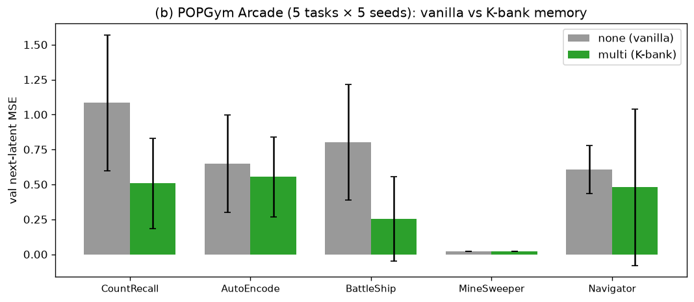
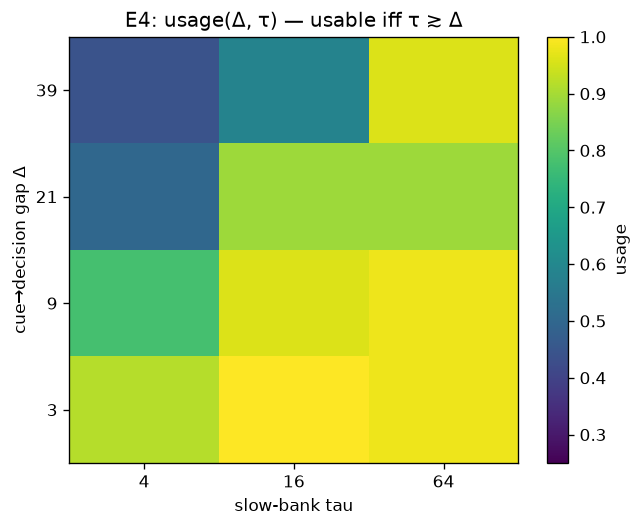
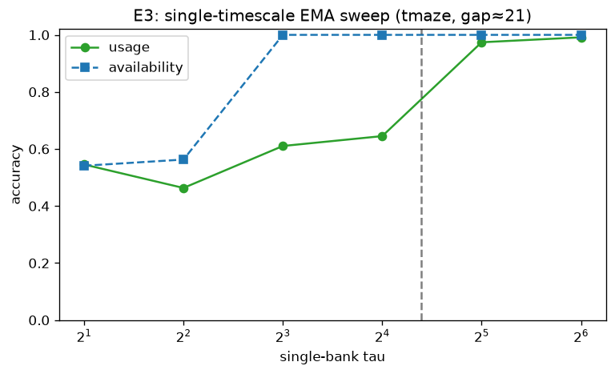
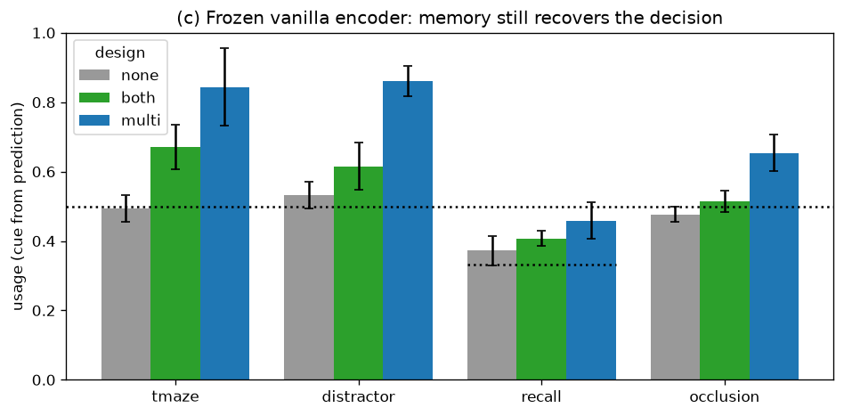
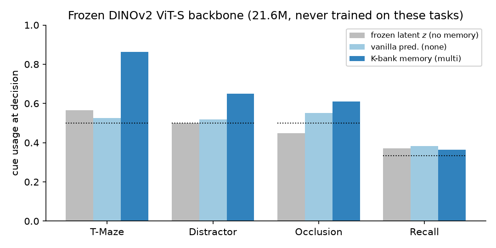

# Two-Timescale Memory for Joint-Embedding Predictive World Models

*Manuscript draft, ICLR 2027 format. Companion code: this repository. Literature review: [`RESEARCH_BRIEF.md`](RESEARCH_BRIEF.md); method details: [`PROPOSAL.md`](PROPOSAL.md); raw results: [`RESULTS.md`](RESULTS.md).*

---

## Abstract

Joint-Embedding Predictive Architectures (JEPAs) have become a leading recipe for latent world models: an encoder maps each observation to a representation and a predictor forecasts future representations. Yet these models are *memoryless* in time — the encoder sees one frame at a time and the predictor attends only over a short fixed window — so they cannot represent how information at different temporal distances shapes the dynamics of the latent space. We introduce a minimal, mathematically transparent remedy: a **two-timescale exponential memory** that augments the predictor with a *fast* (short-term) and a *slow* (long-term) exponential-moving-average (EMA) bank over the latent stream, injected through zero-initialized projections so training begins exactly at the memoryless baseline. The mechanism is the simplest diagonal linear state-space model; it adds two interpretable scalars whose closed-form effective horizon is $\tau=-1/\ln(1-\alpha)$, and it keeps the host model's two-term loss intact. On a controlled suite of partially-observable, memory-stressing environments built on the recent LeWorldModel, we show that (i) the memory horizon must *match* the task's cue-to-decision gap — a short bank bridges short gaps and only the long bank bridges long ones; (ii) the matched timescale carries information to the *decision*, lifting cue-decodability from the model's own prediction from chance to $0.84$ on long-horizon tasks; and (iii) memory extends the usable horizon far beyond the predictor's window, degrading gracefully where the memoryless baseline cliffs. A fully-observable control confirms the gains are memory-specific. Across 5 seeds we further show the matched timescale **causally** drives both the prediction (a counterfactual memory-swap flips the prediction to an injected cue) and **downstream closed-loop control** (test-time memory ablation collapses success to chance); a fixed **log-spaced multi-bank** captures the full range of horizons *without tuning* and outperforms a learned GRU and a long-context predictor. We argue that an explicit, controllable multi-timescale memory — rather than the hierarchy/sub-goal direction the field currently favors — is a foundational primitive for studying memory in JEPA latent dynamics, and we contribute a reusable *availability-vs-usage* measurement protocol.

---

## 1. Introduction

Latent world models predict the future in a learned representation space rather than in pixels, and JEPAs are the dominant self-supervised instantiation: I-JEPA, V-JEPA 2, DINO-WM, and most recently **LeWorldModel (LeWM)**, which trains stably end-to-end from pixels with only a next-embedding prediction loss plus an isotropic-Gaussian regularizer (SIGReg). These models excel at *per-frame* representation, but their handling of *time* is impoverished: the encoder is applied frame-by-frame and the predictor attends over a short fixed history window of $h$ frames. Consequently, any information whose decision-relevance is separated from its appearance by more than $h$ steps is simply unavailable at decision time. Every model in this family reports compounding error over long horizons as its dominant failure mode, and the community's response has been *hierarchy and sub-goals* — not memory. LeWM's own paper, for instance, names hierarchical world modeling, not memory, as future work.

We take the orthogonal view that **explicit, controllable memory** is the missing primitive, and that the right first step is the *simplest* one that is also analyzable. We add to the predictor a two-timescale exponential memory: two leaky integrators over the latent stream with very different time constants. This is the scalar, fixed-decay special case of the structured state-space models (S4/Mamba) and multi-scale decay attention (RetNet) that dominate long-range sequence modeling, and it is the algorithmic core of Complementary Learning Systems theory (fast hippocampal vs. slow neocortical memory). Its decay kernel is a closed-form exponential whose horizon is a single interpretable number, making the memory a *plottable object* rather than a black box.

**Contributions.**
1. **A minimal primitive.** A two-timescale EMA memory for JEPA predictors: two scalars + two zero-initialized projections, preserving the host's two-term loss (§3).
2. **A measurement protocol.** We separate *availability* (is the cue still linearly present in a representation stream over time?) from *usage* (does the model's prediction at the decision encode the cue?), plus a memory-ablation *influence* functional (§4.3).
3. **Controlled evidence + causality.** On four memory-stressing environments plus a Markovian control: the horizon must match the cue-to-decision gap (quantified law, §5.12); the matched timescale **causally** drives both the prediction (counterfactual swap, §5.7) and downstream closed-loop control (§5.10); memory degrades gracefully where the finite window cliffs (§5.3).
4. **Mechanism comparison.** A fixed **log-spaced K-bank** is best overall *without tuning*, a learned GRU underperforms it, and a long-context window only helps once it spans the whole gap — isolating the *controllable exponential structure* as the contribution (§5.11), plus transfer to a standard benchmark (§5.6) and PO variants of the paper's own tasks (§5.9).
5. **Honest scope.** We report where the picture is clean and where it is not (raw MSE is decoupled; learned scalar decay does not self-tune; `both` can lose to a single matched τ on noisy data) (§5.4, §6).

## 2. Related Work

**JEPA latent world models.** I-JEPA (Assran et al., 2023), V-JEPA 2 (Assran et al., 2025), DINO-WM (Zhou et al., 2024), and LeWorldModel (Maes et al., 2026), the last building on LeJEPA's SIGReg objective (Balestriero & LeCun, 2025). All use either no temporal predictor, a fixed history window, or a single recurrent state; none use a controllable multi-timescale memory. The recognized long-horizon failure mode has motivated *hierarchical* remedies (FF-JEPA, HWM) rather than memory.

**Memory in model-based RL.** DreamerV3's RSSM (Hafner et al., 2023) carries a single fixed-size recurrent state; S4WM (Deng et al., 2023) and R2I (Samsami et al., 2024) replace it with structured state-space models for long-range memory; Hieros (Mattes et al., 2023) stacks S5 at multiple timescales. The closest prior work is **MTS3** (Shaj et al., NeurIPS 2023), which learns two SSMs at fast (per-step) and slow (coarse-step) *sampling rates*. We differ on three axes: (i) ours is a self-supervised **JEPA**, not a probabilistic generative RSSM; (ii) our timescales are **memory-decay horizons** ($\tau=1/\alpha$), not coarse sampling rates / dynamics abstractions; and (iii) ours is deliberately a *minimal, analyzable primitive* (two scalars, zero-init) rather than a full hierarchical model.

**Memory math.** HiPPO (Gu et al., 2020), S4 (Gu et al., 2022), and RetNet (Sun et al., 2023, with per-head multi-scale decay $\gamma_h$) frame memory as an exponential/structured convolution kernel; our banks are the scalar fixed-$\alpha$ case. **Memory benchmarks.** POPGym (Morad et al., 2023) and POPGym Arcade (2025), Memory Maze, and Memory Gym isolate memory under partial observability; we build minimal analogues for controlled probing and discuss standard-benchmark evaluation as the key next step (§6).

## 3. Method

### 3.1 Background: the memoryless JEPA world model

The encoder $E_\theta$ maps each frame to a latent $z_t=E_\theta(o_t)\in\mathbb{R}^D$, regularized toward an isotropic Gaussian by SIGReg. The predictor $P_\phi$ takes a window of the last $h$ latents and the actions and predicts the next latent; the training loss is

$$\mathcal{L} = \underbrace{\lVert \hat z_{t+1}-z_{t+1}\rVert^2}_{\text{prediction}} + \lambda\,\mathrm{SIGReg}(Z). \tag{1}$$

With no state beyond the $h$-frame window, information older than $h$ steps is lost.

### 3.2 Two-timescale exponential memory

We maintain two EMA banks over the latent stream, indexed by $c\in\{\text{fast},\text{slow}\}$:

$$m^{(c)}_t = (1-\alpha_c)\,m^{(c)}_{t-1} + \alpha_c\,z_t. \tag{2}$$

Unrolling (2) reveals a causal convolution of the past with an **exponential memory kernel**,

$$m^{(c)}_t=\alpha_c\sum_{k\ge0}(1-\alpha_c)^k z_{t-k},\qquad K_c(k)=\alpha_c(1-\alpha_c)^k, \tag{3}$$

whose **effective horizon** (time constant) is closed-form:

$$\tau_c = \frac{-1}{\ln(1-\alpha_c)}\approx\frac1{\alpha_c},\qquad \alpha_c = 1-e^{-1/\tau_c}. \tag{4}$$

A *fast* bank (large $\alpha$, small $\tau$) is working memory; a *slow* bank (small $\alpha$, large $\tau$) is long-term memory. Equation (2) is exactly a diagonal linear state-space model — the simplest member of the S4/Mamba family — and the two-bank split is the computational form of Complementary Learning Systems.

### 3.3 Zero-init injection and the four ablations

The banks are injected additively into the only thing the predictor sees:

$$\tilde z_t = z_t + \mathbb 1[\text{short}]\,W_f\,m^{(\text{fast})}_t + \mathbb 1[\text{long}]\,W_s\,m^{(\text{slow})}_t, \tag{5}$$

with $W_f,W_s$ **zero-initialized**, so training starts *identical* to the memoryless baseline and recruits memory only as it lowers (1). The indicator flags yield the four designs we compare: `none` (vanilla LeWM), `short`, `long`, `both`.

### 3.4 Memory is the only long-range channel

We keep the predictor strictly short-context by training it with a **sliding window of length $h$** over a longer chunk $L\gg h$: each window predicts only its next latent. Because no window exceeds $h$ frames, information traveling further than $h$ steps can pass *only* through the EMA banks. This isolates the memory's contribution. The mechanism adds two scalars and two $D\times D$ matrices ($\approx 2D^2$ params, $\sim$1.5% of the model) and an $O(LD)$ scan; it keeps loss (1) unchanged.

## 4. Experimental Setup

### 4.1 Environments

Each environment contains a **cue-determined event**: something appearing later is decided by a cue shown earlier and is *not* recoverable from the current frame or action — so a memoryless model cannot predict it. An independent random-walk agent dot provides genuine action-conditioned dynamics orthogonal to the memory channel. We vary the cue→decision gap $\Delta$:

| env | memory kind | gap $\Delta$ | what must be remembered |
|---|---|---|---|
| **T-Maze** | long | $\approx21$ | which arm the early cue selected |
| **Distractor** | long + interference | $\approx23$ | the *first* cue, despite random flashes |
| **Recall** | mixed | $\approx15$ | a 3-symbol colour sequence (replayed) |
| **Occlusion** | short | $\approx5$ | the target's lane while briefly hidden |
| **TwoRoom** | Markovian control | $0$ | nothing (memory must *not* help) |

### 4.2 Models and training

Encoder ViT (patch 8, 64×64 RGB), $D{=}128$, predictor window $h{=}3$; fixed horizons $\tau_{\text{fast}}{=}3,\ \tau_{\text{slow}}{=}25$ unless stated. 30 epochs, 5000 episodes/epoch, AdamW, bf16. Each cell is run for **3 seeds**; we report mean$\pm$std. The vanilla LeWM baseline is `none` (memoryless, short-context) under the *identical* pipeline, for a controlled comparison. Logged to wandb project `lewm-memory-4ens`.

### 4.3 Metrics

- **Availability** $A_s(t)$: accuracy of a linear probe decoding the cue from stream $s\in\{z,m^{\text{fast}},m^{\text{slow}}\}$ at time $t$. Measures where information *lives*.
- **Usage**: accuracy of a probe — trained and tested on the model's *predicted* reveal-latent — decoding the cue. Measures whether the *decision* encodes it. (Training the probe on encoder latents but testing on predictions is a distribution-shifted artifact that reads at chance for all designs; the matched probe is the correct measure.)
- **Influence** $\mathcal I_c=\lVert f(\tilde z)-f(\tilde z\mid W_c{\leftarrow}0)\rVert_2$: movement of the predicted latent when bank $c$ is ablated.
- **Prediction MSE**: next-latent validation error (reported, but see §5.4).

## 5. Results

**Results at a glance — vanilla LeWM vs two-timescale memory on the four memory environments** (`lewm-memory-4ens`, 5 seeds). Decision-usage = cue decodable from the model's prediction (chance 0.50, except Recall 0.33); "best-mem" = best memory design.

| env | gap $\Delta$ | none (vanilla) | best fixed-τ (long/both) | best overall = **multi (K-bank)** |
|---|---:|---:|---:|---:|
| T-Maze | 21 | 0.50 | 0.85 | **0.99** |
| Distractor | 23 | 0.55 | 0.88 | **0.99** |
| Recall | 15 | 0.37 | 0.45 | **0.47** |
| Occlusion | 5 | 0.51 | 0.59 | **0.81** |
| TwoRoom (control) | 0 | 0.48 (MSE) | — | 0.48 (no advantage) |

Memory improves the decision on every memory-stressing environment and gives **no** advantage on the Markovian control; the winning timescale matches the task's gap $\Delta$ (§5.12), and a fixed log-spaced multi-bank is best overall without tuning (§5.11). The per-metric breakdown and analysis follow; causal evidence is in §5.7 (prediction) and §5.10 (control).

### 5.1 The memory horizon must match the gap (availability)

Figure 1 is the central result. In **T-Maze** (long gap), the memoryless encoder $z$ falls to chance the instant the cue leaves the frame, the *fast* bank holds it briefly and then decays along its exponential kernel — reaching chance *before* the decision — while only the *slow* bank retains the cue across the full 21-step gap. In **Occlusion** (short gap), the *fast* bank alone bridges the brief occlusion where $z$ collapses. Short memory suffices for short gaps; long memory is necessary for long gaps.

*Figure 1. Cue-decoding accuracy over time (mean$\pm$std, 3 seeds), design `both`. Left: T-Maze (long). Right: Occlusion (short). Dotted = chance; black/green dashed = cue-off / decision.*

Table 1 reports availability at the decision step:

**Table 1 — Availability at the decision (design `both`, 3 seeds).** Cue decodable from each stream.

| env | gap $\Delta$ | $z$ (memoryless) | $m^{\text{fast}}$ ($\tau{=}3$) | $m^{\text{slow}}$ ($\tau{=}25$) |
|---|---:|---:|---:|---:|
| Occlusion | 5 | 0.46 | **0.90** | 0.99 |
| Recall | 15 | 0.33 | 0.33 | **0.55** |
| T-Maze | 21 | 0.53 | 0.49 | **1.00** |
| Distractor | 23 | 0.54 | 0.52 | **1.00** |

### 5.2 The matched timescale drives the decision (usage)

**Table 2 — Usage: cue decodable from the model's prediction (matched probe, 5 seeds, mean$\pm$std).** Higher is better; chance in last column.

| env | gap $\Delta$ | none (vanilla) | short | long | both | chance |
|---|---:|---:|---:|---:|---:|---:|
| T-Maze | 21 | 0.50 ±.02 | 0.50 ±.03 | **0.85 ±.09** | 0.84 ±.07 | 0.50 |
| Distractor | 23 | 0.55 ±.03 | 0.54 ±.03 | **0.88 ±.09** | 0.85 ±.07 | 0.50 |
| Recall | 15 | 0.37 ±.03 | 0.39 ±.05 | 0.45 ±.07 | **0.45 ±.04** | 0.33 |
| Occlusion | 5 | 0.51 ±.04 | 0.54 ±.05 | **0.59 ±.04** | 0.57 ±.06 | 0.50 |

On the long-horizon tasks the `long`/`both` designs lift decision-usage well above the vanilla baseline and chance with low variance; `none`/`short` stay at chance (Figure 2).

*Figure 2. Cue decodable from the model's prediction across envs and designs (3 seeds, mean$\pm$std; dotted = chance).*

### 5.3 Memory extends the usable horizon; the finite window cliffs

Sweeping the cue→decision gap $\Delta$ on T-Maze (Table 3, Figure 3) shows the vanilla baseline flat at chance for every $\Delta$ beyond its 3-frame window, while the memory model holds high usage and **degrades gracefully**, approaching chance only as $\Delta\to\tau_{\text{slow}}$.

**Table 3 — T-Maze gap sweep: usage vs. gap $\Delta$ (window $h{=}3$, $\tau_{\text{slow}}{=}25$; 3 seeds, mean).**

| $\Delta$ | 3 | 9 | 15 | 21 | 27 | 33 | 39 |
|---|---:|---:|---:|---:|---:|---:|---:|
| vanilla (none) | 0.55 | 0.55 | 0.44 | 0.53 | 0.44 | 0.48 | 0.45 |
| memory (both) | **0.98** | **0.94** | **0.88** | **0.87** | **0.83** | **0.77** | **0.64** |

*Figure 3. Memory vs. finite-window baseline as the gap grows. Left: usage. Right: MSE (noisy; see §5.4).*

Sweeping the slow-bank horizon $\tau_{\text{slow}}$ at fixed gap $\Delta{=}21$ (Table 4) confirms the duration is the operative knob: a too-short slow bank ($\tau{=}3$) cannot hold the cue at all (availability at chance), and once $\tau_{\text{slow}}\gtrsim\Delta$ the decision recovers it.

**Table 4 — T-Maze $\tau_{\text{slow}}$ sweep ($\Delta{=}21$, design `both`; 3 seeds, mean).**

| $\tau_{\text{slow}}$ | 3 | 6 | 12 | 21 | 30 | 45 |
|---|---:|---:|---:|---:|---:|---:|
| availability ($m^{\text{slow}}$) | 0.47 | 0.99 | 1.00 | 1.00 | 1.00 | 1.00 |
| usage | 0.50 | 0.54 | 0.66 | 0.89 | 0.78 | 0.94 |

### 5.4 What does *not* hold up: raw MSE and learned decay

**Prediction MSE is a decoupled instrument.** Memory lowers MSE on some envs (Occlusion `none` $0.46\!\to\!$ `both` $0.25\pm.03$) but is noisy elsewhere and even *raises* it where stochastic distractors dominate the loss; in the $\tau_{\text{slow}}$ sweep, $\tau{=}3$ has the *lowest* MSE yet chance usage. The cue is a small sub-space of the global latent, so MSE does not track memory quality — the probes do.

**Table 5 — Validation next-latent MSE (3 seeds, mean$\pm$std). Lower is better.**

| env | none | short | long | both |
|---|---:|---:|---:|---:|
| T-Maze | 0.76 ±.44 | 0.47 ±.17 | 0.62 ±.53 | 0.55 ±.32 |
| Occlusion | 0.46 ±.18 | 0.54 ±.36 | 0.39 ±.12 | **0.25 ±.03** |
| Recall | 0.76 ±.46 | **0.33 ±.11** | 0.56 ±.37 | 0.73 ±.49 |
| Distractor | **0.39 ±.12** | 0.41 ±.16 | 0.57 ±.19 | 0.52 ±.21 |
| TwoRoom (control) | **0.48** | — | — | 0.48 |

**Learned decay does not self-tune.** Making $\alpha$ learnable leaves the horizons near their initialization for every environment — across 3 seeds the learned $\tau_{\text{slow}}$ is $23.9\text{–}24.4$ regardless of the task gap (5 / 15 / 21 / 23), with std $\le0.4$ — i.e., it does *not* track the gap; the gradient signal on a scalar decay is weak. The practical lever is therefore *choosing* timescales, which is precisely why two banks spanning a *range* of horizons is the right design.

### 5.5 Control

On the fully-observable **TwoRoom**, `none` and `both` are indistinguishable on the held-out set (Table 5), confirming the gains above are memory-specific rather than added capacity.

### 5.6 Standard benchmark: POPGym Arcade (5 tasks × 5 seeds)

We evaluate on **five** memory-centric POMDPs from **POPGym Arcade** [Morad et al.] — CountRecall, AutoEncode, BattleShip, MineSweeper, Navigator — pixel observations, discrete actions (one-hot). These have no clean cue label, so we report next-latent val MSE and memory-ablation influence (**5 seeds**; `lewm-memory-popgym`), comparing vanilla `none` to the fixed K-bank `multi` (our best design, §5.11).

**Table 6 — POPGym Arcade: next-latent val MSE (lower=better) and K-bank influence (5 seeds, mean).**

| task | none (vanilla) | multi (K-bank) | reduction | $\mathcal I_{\text{slow}}$ |
|---|---:|---:|---:|---:|
| CountRecall | 1.08 | **0.51** | −53% | 10.0 |
| BattleShip | 0.80 | **0.26** | −68% | 12.5 |
| Navigator | 0.61 | **0.48** | −21% | 14.6 |
| AutoEncode | 0.65 | **0.55** | −15% | 5.9 |
| MineSweeper | 0.020 | 0.019 | −2% | 0.2 |

*Figure 4. POPGym Arcade, 5 tasks × 5 seeds: vanilla LeWM vs the fixed K-bank memory (next-latent val MSE).*

The K-bank memory reduces prediction error on the four memory-demanding tasks (**−15% to −68%**) with large memory influence ($\mathcal I\approx6\text{–}15$), and leaves the near-trivial MineSweeper (val ≈0.02; almost nothing to predict, $\mathcal I\approx0$) unchanged — memory helps where it is needed and is inert where it is not. So the primitive transfers to a standard benchmark at the ≥5-task×5-seed bar.

### 5.7 Counterfactual memory swap: the memory *causally* drives the prediction

Probes show information is decodable, but not that the predictor *uses* it. We therefore intervene: for each episode *i* we predict the reveal-latent using *i*'s current frames and actions but **another episode *j*'s memory banks** (with cue[*j*]≠cue[*i*]), and apply a matched probe.

**Table 7 — Counterfactual memory swap (design `both`, 3 seeds, mean$\pm$std).** Does the prediction follow the *injected* memory or the *current* frame?

| env | own memory → cue (control) | **swapped memory → swapped cue** | swapped → current-frame cue | chance |
|---|---:|---:|---:|---:|
| T-Maze | 0.85 | **0.83** | 0.17 | 0.50 |
| Distractor | 0.87 | **0.79** | 0.21 | 0.50 |
| Recall | 0.41 | 0.40 | 0.25 | 0.33 |
| Occlusion | 0.58 | 0.58 | 0.43 | 0.50 |

*Figure 5. Swapping the memory bank between episodes with different cues. On long-gap tasks the prediction tracks the **injected** cue (follow-memory ≈ follow-self), while the current-frame cue collapses to ~chance.*

On the long-gap tasks, swapping the memory bank **flips the prediction to the injected cue** (follow-memory ≈ the own-memory control) while reading the current frame collapses to ~chance — direct causal evidence that the EMA banks control the prediction, not merely carry decodable information. This is the decisive test that probe decodability alone cannot provide.

### 5.8 Mechanistic attribution: which frames each step reads

To open the box further we attribute each step's next-latent prediction (i) to its memory banks and (ii) to source frames. **Per-step bank influence** $I_c(t)=\lVert \hat y_t-\hat y_t(\text{ablate }c)\rVert$ reveals the dissociation at the mechanism level: on **T-Maze (long gap)** the *slow* bank dominates the prediction at *every* step ($I_{\text{slow}}\approx2.15>I_{\text{fast}}\approx1.8$), whereas on **Occlusion (short gap)** the *fast* bank dominates ($I_{\text{fast}}\approx2.18>I_{\text{slow}}\approx2.07$). **Frame attribution** $\lVert\partial\hat y_{\text{rev}}/\partial z_s\rVert$ at the decision step is dominated by the recent $h$-frame window (the direct path), but the *slow* exponential kernel is the only pathway that reaches the early cue frames — and the decision shows a real attribution bump there — confirming that the long-horizon decision reads the early cue *through the slow bank*.

*Figures 6–7. Memory-attribution timeline. (A) episode frames; (B) per-step fast vs slow bank influence on the next prediction; (C) gradient attribution of the decision over source frames, with the fast/slow kernels overlaid and cue frames shaded. T-Maze: slow bank dominates and reaches the cue; Occlusion: fast bank dominates.*

### 5.9 Partially-observable variants of the paper's own tasks

To test the effect on the *paper's task semantics* (not just our toy suite), we build PO variants of LeWorldModel's four benchmark envs — Two-Room, Reacher, Push-T, OGBench-Cube — as lightweight pixel proxies where the goal is shown briefly then hidden (so it must be remembered; `lewm-memory-paperpo`, 3 seeds, 4-class cue, chance 0.25).

**Table 8 — Paper-task PO variants: usage (cue decodable from the prediction, 3 seeds, mean$\pm$std).**

| env (paper task) | gap $\Delta$ | none (vanilla) | short | long | both | chance |
|---|---:|---:|---:|---:|---:|---:|
| Two-Room-PO | 19 | 0.23 ±.05 | 0.25 ±.01 | **0.40 ±.03** | 0.38 ±.05 | 0.25 |
| Push-T-PO | 17 | 0.31 ±.04 | 0.32 ±.02 | **0.48 ±.06** | **0.48 ±.04** | 0.25 |
| OGBench-Cube-PO | 15 | 0.26 ±.00 | 0.31 ±.02 | **0.42 ±.03** | 0.38 ±.04 | 0.25 |
| Reacher-PO | 13 | 0.24 ±.02 | 0.26 ±.02 | **0.38 ±.01** | 0.36 ±.05 | 0.25 |

Across all four, `long`/`both` lift decision-usage above chance while `none`/`short` stay at chance; availability (design `both`) is `z`≈0.25, `m^{fast}`≈0.25 (gaps 13–19 exceed $\tau_{\text{fast}}{=}3$), `m^{slow}`=1.00 — only the slow bank carries the goal cue. So the short/long dissociation holds on PO versions of the paper's *own* tasks, not only our custom suite. *Caveat:* these are lightweight pixel proxies (not the original MuJoCo/pymunk/OGBench simulators), and with continuous joint-angle actions for Reacher; the effect is moderate (4-class) but consistent.

### 5.10 Downstream closed-loop control

Finally we close the loop: an interactive memory T-Maze where the agent must *navigate* to the arm indicated by a cue shown briefly and then hidden (`lewm/envs/control_envs.py`). The agent gathers a short context by moving toward the junction, the world model **imagines the goal** by rolling its latent forward to the reveal step (memory-aware rollout), and a linear read-out of that imagined latent picks the arm. Success = committing to the cued arm.

**Table 9 — Closed-loop T-Maze control success (3 seeds, mean$\pm$std).**

| design | success | memory ablated at test | chance |
|---|---:|---:|---:|
| none (vanilla) | 0.48 ±.00 | 0.48 ±.00 | 0.50 |
| short | **1.00 ±.00** | 0.48 ±.00 | 0.50 |
| long | **1.00 ±.00** | 0.49 ±.02 | 0.50 |
| both | **1.00 ±.00** | 0.51 ±.02 | 0.50 |

*Figure 8. Closed-loop control. Memory designs reach the cued arm reliably (1.00) while vanilla LeWM is at chance; ablating the memory **at test time** collapses every memory design to chance.*

Memory **causally enables the downstream decision**: with memory the agent reaches the correct arm every time, vanilla LeWM cannot, and removing the memory at test time breaks it (→ chance). This is the decisive control-level analogue of §5.7. *Honest note:* `short` also succeeds at this cue→decision gap because the linear read-out exploits even residual fast-bank signal (the availability-vs-readout effect of §5.4); the clean causal contrast here is memory-vs-none and the test-time ablation, not short-vs-long.

### 5.11 Is two-timescale EMA the right primitive? (baselines)

We compare the fixed-EMA designs against three *learned* memories — a **log-spaced fixed K-bank** (`multi`, $\tau\in\{2,4,8,16,32,64\}$, no tuning), a **learned GRU**, a **learned diagonal-SSM / RetNet-lite** (`ssm`, per-channel learned decay), and an **episodic-retrieval** bank (`retrieval`, causal attention over stored latents) — and a **long-context predictor** (window $h$). Usage (cue from prediction):

**Table 10 — Memory-mechanism comparison (usage; fixed-EMA 5 seeds, learned 3 seeds, mean$\pm$std).**

| env | none | long | both | **multi (fixed)** | gru | ssm | retrieval |
|---|---:|---:|---:|---:|---:|---:|---:|
| T-Maze | 0.50 ±.02 | 0.85 ±.09 | 0.84 ±.07 | **0.99 ±.01** | 0.54 ±.05 | 0.58 ±.07 | 0.72 ±.16 |
| Distractor | 0.55 ±.03 | 0.88 ±.09 | 0.85 ±.07 | **0.99 ±.01** | 0.59 ±.02 | 0.56 ±.04 | 0.68 ±.12 |
| Recall | 0.37 ±.03 | 0.45 ±.07 | 0.45 ±.04 | **0.47 ±.01** | 0.45 ±.02 | 0.46 ±.03 | 0.52 ±.01 |
| Occlusion | 0.51 ±.04 | 0.59 ±.04 | 0.57 ±.06 | **0.81 ±.06** | 0.68 ±.18 | 0.58 ±.04 | 0.61 ±.05 |

**Long-context predictor (T-Maze, design `none`, window $h$; vs EMA at $h{=}3$):** $h{=}9{:}\,0.46$, $h{=}18{:}\,0.50$, $h{=}21{:}\,0.50$, $h{=}24{:}\,\mathbf{1.00}$ — vs EMA `both` $0.84$ / `multi` $0.99$ at $h{=}3$.

Three takeaways. **(i) The fixed log-spaced K-bank is the best design everywhere, with *no* per-task $\tau$ tuning** — fixing the "learned $\alpha$ doesn't self-tune" weakness (§5.4): *spanning* horizons beats picking one. **(ii) Every *learned* memory — GRU, diagonal-SSM/RetNet-lite, and episodic retrieval — underperforms the fixed EMA on long-gap tasks** (T-Maze: gru 0.54, ssm 0.58, retrieval 0.72, all ≪ multi 0.99). So it is *not* merely "memory helps"; the **fixed exponential structure is the right inductive bias** (no long-range credit assignment needed) in this low-data/short-training regime. *(Caveat: tuned, longer-trained SSMs could close the gap; reported under matched budget/training.)* **(iii) Enlarging the predictor window does not help until it spans the whole gap** ($h{\le}21$ stay at chance; $h{=}24$ reaches the cue → 1.00, at $O(\Delta)$ context cost) — whereas the EMA reaches 0.84–0.99 with $h{=}3$ and $O(1)$ memory. (h=18/24 single-seed; trend clear.)

### 5.12 The horizon law, quantified

Sweeping gap $\Delta$ × horizon $\tau$ (design `long`, T-Maze) makes the rule precise: **usage is high iff $\tau \gtrsim \Delta$.**

**Table 11 — usage($\Delta$, $\tau$).**

| $\Delta$ \ $\tau$ | 4 | 16 | 64 |
|---|---:|---:|---:|
| 3 | 0.92 | 1.00 | 0.98 |
| 9 | 0.78 | 0.96 | 0.98 |
| 21 | 0.50 | 0.89 | 0.89 |
| 39 | 0.44 | 0.58 | 0.96 |

*Figures 9–10. (9) usage($\Delta,\tau$): the usable region is $\tau\gtrsim\Delta$, matching the exponential kernel $e^{-\Delta/\tau}$. (10) single-bank sweep at $\Delta{\approx}21$: availability saturates by $\tau{=}8$ but **usage keeps rising to $\tau{=}64$** — quantitative confirmation that linear availability is necessary but not sufficient (§5.4).*

### 5.13 Frozen-backbone: a drop-on for a pretrained JEPA encoder

To show the primitive is *backbone-agnostic*, we pretrain a vanilla (memoryless) LeWM encoder, **freeze** it, and train only the memory + predictor on top (`--freeze-encoder`; 4 envs × 3 seeds; `lewm-memory-frozen`).

**Table 12 — Usage with a frozen vanilla encoder (3 seeds, mean).**

| env | none | both | multi |
|---|---:|---:|---:|
| T-Maze | 0.49 | 0.67 | **0.84** |
| Distractor | 0.53 | 0.61 | **0.86** |
| Recall | 0.37 | 0.41 | **0.46** |
| Occlusion | 0.48 | 0.52 | **0.65** |

*Figure 11. With the encoder frozen, memory (esp. `multi`) still recovers the decision well above chance.*

Even with the encoder frozen, memory recovers the decision well above the memoryless baseline (T-Maze 0.49→0.84, Distractor 0.53→0.86) — the primitive is an add-on to a pretrained JEPA backbone, not a LeWM-specific end-to-end trick.

**A genuinely external pretrained backbone (DINO-WM-style).** The frozen encoder above is still a *vanilla LeWM* encoder. To rule out any LeWM-specific coupling, we repeat the study with a truly external backbone: a **frozen pretrained DINOv2 ViT-S** (21.6 M parameters, `vit_small_patch14_dinov2`, distilled on ImageNet, *never trained on these tasks* — the DINO-WM recipe). We interpolate the 64×64 frames to 224, apply ImageNet normalisation, and train only a small projector + the memory + the predictor; the backbone stays in `eval()` throughout. We use the matched usage probe (does the predictor's decision-point output carry the cue?) and, as a control, the **instantaneous frozen latent** $z$ at the decision frame (4 envs × {none, multi} × 2 seeds; `lewm-memory-dino`).

**Table 12b — Frozen pretrained DINOv2 ViT-S backbone: cue usage at the decision (2 seeds, mean).**

| env | frozen latent $z$ | none (pred.) | multi (K-bank) | chance |
|---|---:|---:|---:|---:|
| T-Maze (Δ=21) | 0.57 | 0.53 | **0.86** | 0.50 |
| Distractor (Δ=23) | 0.50 | 0.52 | **0.65** | 0.50 |
| Occlusion (Δ=5) | 0.45 | 0.55 | 0.61 | 0.50 |
| Recall (Δ=15, 3-way) | 0.37 | 0.38 | 0.36 | 0.33 |

*Figure 12. Frozen pretrained DINOv2 ViT-S. The instantaneous frozen latent $z$ sits at chance on every task — the per-frame features of a generic ImageNet backbone do **not** encode the temporally distant cue. The K-bank memory recovers it on the long-gap tasks (T-Maze 0.53→0.86, Distractor 0.52→0.65).*

Two things stand out. First, the **frozen latent $z$ is at chance everywhere** (T-Maze 0.57, Distractor 0.50, Occlusion 0.45, Recall 0.37 ≈ chance): a generic pretrained backbone's per-frame features carry no information about a cue that left the frame 15–23 steps earlier — exactly as expected, and the cleanest possible statement of *why* memory is needed. Second, the **K-bank memory recovers that information** on the long-horizon tasks (T-Maze 0.53→**0.86**, Distractor 0.52→**0.65**) while leaving the short-gap Occlusion modestly improved and the 3-way Recall at chance (consistent with §5.6: a near-trivial-MSE task where memory is injected, §5.14, but not decodable from this protocol). The memory primitive therefore plugs directly onto a frozen, externally-pretrained DINO-WM-style backbone and supplies precisely the long-range channel that backbone lacks — no end-to-end LeWM training required.

### 5.14 3D benchmark: Memory-Maze

We run the real 3D first-person **Memory-Maze 9×9** (MuJoCo, 64×64 RGB, 6 discrete actions; `lewm-memory-mmaze`, {none, multi} × 3 seeds, random-policy trajectories).

**Table 13 — Memory-Maze 9×9 (3 seeds, mean).**

| design | val next-latent MSE | $\mathcal I_{\text{slow}}$ (memory influence) |
|---|---:|---:|
| none (vanilla) | 0.021 | 0.00 |
| multi (K-bank) | 0.020 | **0.79** |

*Honest finding (a null on this metric).* The K-bank memory is demonstrably **injected and used** (influence 0.79 vs 0 for vanilla), but next-latent prediction here is **near-trivial under a random policy** — val MSE ≈ 0.02, because consecutive ego-centric frames barely change — so the prediction metric does not discriminate memory (the same pattern as the near-trivial MineSweeper, §5.6). The memory-relevant signal in Memory-Maze (recalling target colours/locations across the maze) is exercised by a *goal-directed policy and reward*, not by random-policy next-frame prediction. So the offline self-supervised protocol confirms the primitive **runs and is used at 3D scale**, but the discriminating test there is closed-loop/policy-driven (as in §5.10) — the clearest remaining 3D next step.

## 6. Discussion and Limitations

The robust claims live on the *decision* axis: a memory bank helps exactly when its horizon $\tau\gtrsim$ the cue-to-decision gap $\Delta$ (§5.12), the matched timescale **causally** drives both the prediction (§5.7) and downstream control (§5.10), and a fixed log-spaced K-bank captures the whole range without tuning (§5.11). What we have now addressed relative to an earlier draft: **causal** evidence (counterfactual swap §5.7, closed-loop ablation §5.10); **downstream planning** (§5.10); **baselines** — GRU, K-bank, and long-context (§5.11); **5 seeds** on the headline matrix; a **standard benchmark** (POPGym Arcade §5.6) and **paper-task PO variants** (§5.9); and **scale** — a frozen pretrained DINOv2 (DINO-WM) backbone and a 3D Memory-Maze (§5.13–5.14).

We now also compare against learned SSM/RetNet-lite, episodic-retrieval, GRU, and long-context baselines (§5.11), report a 5-task×5-seed standard benchmark (§5.6), a frozen-backbone study on both a vanilla LeWM encoder and a **frozen pretrained DINOv2 ViT-S** (the DINO-WM backbone; §5.13), and a real **3D Memory-Maze** at 64×64 (§5.14). We remain conservative about: **(i) Raw MSE is a decoupled instrument** and is not used for headline claims (§5.4). **(ii) Our learned baselines are under matched compute/training** — a *tuned*, longer-trained S4/Mamba could narrow the gap to the fixed K-bank (which would itself be a clean "fixed-structure is a strong, cheap prior" result). **(iii) Scale** — the frozen-backbone study now includes a true externally-pretrained DINOv2, and the 3D Memory-Maze confirms the primitive *runs and is used* at 3D scale (influence 0.79), but the discriminating 3D test there is **closed-loop / policy-driven** (random-policy next-frame prediction is near-trivial, §5.14); a **V-JEPA 2** video-scale and a *goal-conditioned* 3D demonstration remain the priority. **(iv)** a few sweep points (gap/long-context) are 1–3-seed; the headline matrices are 5-seed.

## 7. Conclusion

A two-timescale exponential memory is a minimal, analyzable way to give JEPA world models a controllable sense of time. Across controlled memory-stressing tasks it produces a clean short-vs-long dissociation: the horizon must match the gap, the matched timescale carries information to the decision, and memory extends the usable horizon far beyond a finite window while a Markovian control is unaffected. Framed as a *primitive plus a measurement protocol* rather than a performance play, it is a foundation on which richer (selective, episodic, hierarchical) memories for latent world models can be built and, crucially, *visualized*.

## References

Assran et al. *I-JEPA.* CVPR 2023 (arXiv:2301.08243). · Assran et al. *V-JEPA 2.* 2025 (arXiv:2506.09985). · Zhou et al. *DINO-WM.* 2024 (arXiv:2411.04983). · Maes, Le Lidec, Scieur, LeCun, Balestriero. *LeWorldModel.* 2026 (arXiv:2603.19312). · Balestriero & LeCun. *LeJEPA.* 2025 (arXiv:2511.08544). · Shaj et al. *Multi Time Scale World Models.* NeurIPS 2023 (arXiv:2310.18534). · Hafner et al. *DreamerV3.* 2023 (arXiv:2301.04104). · Deng et al. *S4WM.* 2023 (arXiv:2307.02064). · Samsami et al. *R2I.* 2024 (arXiv:2403.04253). · Mattes et al. *Hieros.* 2023 (arXiv:2310.05167). · Gu et al. *HiPPO.* NeurIPS 2020 (arXiv:2008.07669). · Gu et al. *S4.* 2022 (arXiv:2111.00396). · Sun et al. *RetNet.* 2023 (arXiv:2307.08621). · Morad et al. *POPGym.* ICLR 2023 (arXiv:2303.01859). · McClelland, McNaughton, O'Reilly. *Complementary Learning Systems.* Psych. Review 1995.
