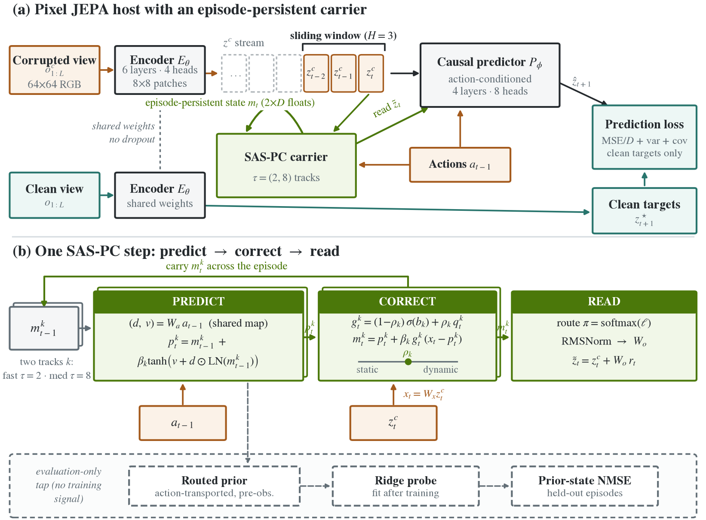
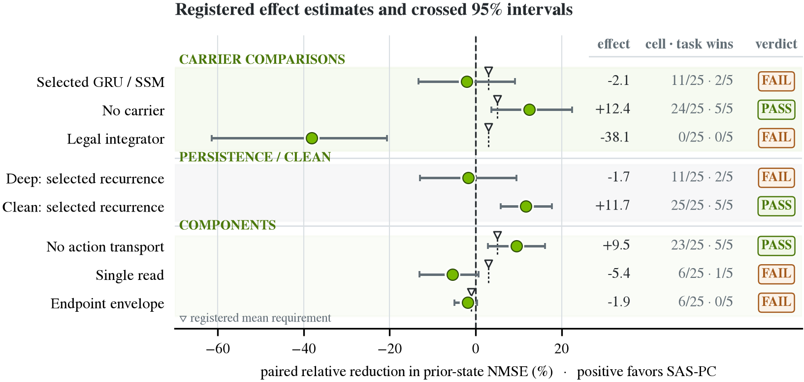
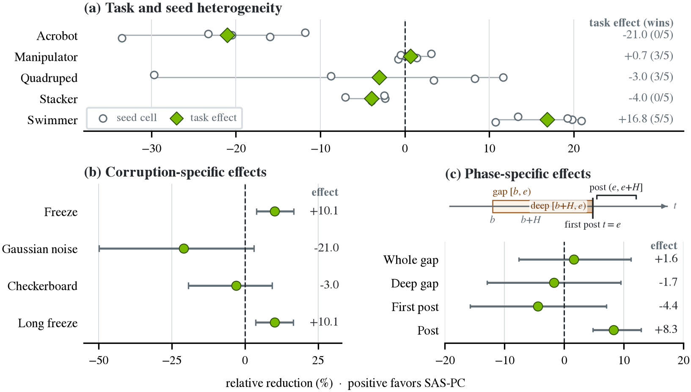
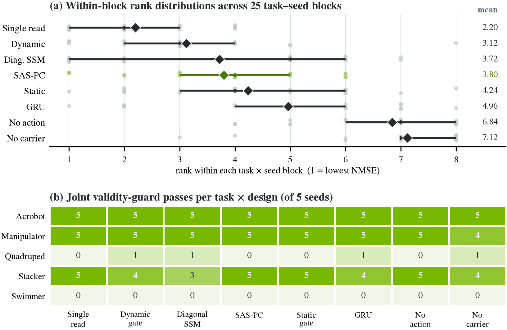

# Finite Context Is Not Persistent State: A Frozen Falsification Study in a LeWorldModel-Derived JEPA

## Abstract

Pixel joint-embedding predictors can be temporally causal and still forget: evidence disappears the moment it leaves a finite context window. We test whether an explicit persistent state repairs this in a LeWorldModel (LeWM)-derived pixel JEPA. The candidate, a compact Shared-Action Shrinkage Predict--Correct (SAS-PC) module, adds two action-conditioned predict--correct states to a true sliding $H=3$ predictor; it receives no simulator state, reward, corruption label, or memory-specific objective. Before opening the cohort we froze five DeepMind Control tasks, eight separately trained designs, five seeds, 100 epochs, four held-out corruption families, and eleven conjunctive gates. The 200-cell confirmation **fails**. SAS-PC changes held-out prior-state error (positive favors SAS-PC) by **+12.44%** versus no carrier, **-2.10%** versus the per-cell better GRU/SSM (95% crossed-bootstrap CI **[-13.35%, +9.11%]**), and **-38.12%** versus a causally legal initial-frame/action integrator. Its action-transport intervention passes at **+9.48%**, while the joint-read contrast is **-5.39%**. Swimmer and Acrobot take opposite signs in all five seeds against the recurrent envelope, every integrator comparison is unfavorable, and representation-rank and convergence guards fail. The favorable no-carrier and action-transport contrasts therefore cannot be promoted to confirmed class or mechanism claims. Finite context is not persistent state, but that architectural fact is not itself a performance result.

## 1. Introduction

Joint-Embedding Predictive Architectures (JEPAs) learn dynamics by forecasting representations rather than reconstructing pixels. Recent systems add action conditioning, short video context, and latent-space planning \citep{ref1,ref2,ref3,ref4}, but their temporal states are not interchangeable, and three regimes are worth separating. A frame-local encoder carries no temporal state at all. A causal predictor over the latest $H$ latent/action tokens has *finite-context* memory: it can integrate evidence inside the window, but whatever leaves the window is unrecoverable. An episode state $m_t=F(m_{t-1},z_t,a_{t-1})$ can, in principle, *persist* evidence indefinitely. None of these properties implies causal representation learning \citep{ref5}.

Published LeWM is action-conditioned and causally masked, with configured history $H=3$ for PushT and OGBench-Cube and $H=1$ for TwoRoom \citep{ref1}; it is therefore neither memoryless nor non-causal. The narrower question this paper asks is whether an explicit state surviving beyond $H$ transports *useful* information under partial observability. Because any recurrent module beats a windowed baseline whenever old evidence has value, a candidate carrier must also survive ordinary recurrent baselines, a causally legal initial-frame/action summary, exact component interventions, and representation and convergence health checks.

We integrate compact Shared-Action Shrinkage Predict--Correct (SAS-PC) memory into a causally normalized, VICReg-style \citep{ref17} LeWM-derived pixel host. All eight designs share the encoder, the $H=3$ predictor, data, targets, optimization, and evaluation; only the persistent carrier or a named intervention changes. Because the objective replaces LeWM's SIGReg recipe \citep{ref16}, this is an architecture study, **not** evidence that SAS-PC improves original LeWM.

The result is deliberately sharper than "memory helps." Favorable finite-window and action-transport contrasts coexist with unfavorable stronger references, unsupported hierarchy contrasts, and failed validity guards; task, seed, corruption, and phase decompositions show why these statements must remain separate. Our contributions are: (i) an explicit within-grid integration separating finite context from persistent state, with the carrier's update equations and design rationale in full; (ii) a frozen $5$-task $\times$ $8$-design $\times$ $5$-seed confirmation with recurrent, integrator, intervention, health, and convergence controls; and (iii) a complete, task- and seed-resolved falsification identifying exactly which registered contrasts pass and which fail.

## 2. Related Work and Claim Scope

Finite-context JEPAs include DINO-WM, seq-JEPA, and LeWM \citep{ref1,ref2,ref3}; a Transformer over a configured block need not preserve evidence after the block is discarded. Persistent state is well established in PlaNet/Dreamer recurrent state-space models (RSSMs), recurrent and S4 world-model comparisons, and long-horizon memory studies \citep{ref6,ref7,ref8,ref9,ref10}. Multi-timescale state and predict--correct filtering predate SAS-PC in MTS3 and recurrent Kalman networks, and ELMUR and Flow Equivariant World Models provide other structured memories \citep{ref11,ref12,ref13,ref14,ref15}. We therefore claim neither the first recurrent world model nor any novelty for recurrence, filtering, action conditioning, or multiple timescales in isolation.

Our claims form a strict ladder. The information-flow graph (Figure \ref{fig:fig-v18-architecture}) establishes an **architectural** distinction between finite context and persistent state. Absence of future inputs establishes **temporal causality**, not causal representation. A registered performance contrast tests **state utility**; a separately retrained component control tests an implemented **mechanism**. None identifies environment causal structure; we evaluate the first four levels and use "causal" only for temporal information flow or an explicit model intervention. The full claim boundary is registered in Appendix G.

## 3. Architecture: A Persistent Carrier Inside a Finite-Context Host

Every design uses a per-frame Vision Transformer (ViT) encoder $E_\theta$ ($64\times64$ RGB, $8\times8$ patches, $D=128$, six layers, four heads), an action-conditioned causal Transformer predictor $P_\phi$ (four layers, eight heads), and the true sliding window of the latest $H=3$ latent/action tokens (Figure \ref{fig:fig-v18-architecture}). Two synchronized views share encoder weights: corrupted frames produce the recurrent input $z_t^c=E_\theta(o_t^c)$, while clean frames produce active, non-stop-gradient targets $z_t^\star=E_\theta(o_t)$ with dropout disabled. Per-frame feature normalization prevents future-frame or cross-example leakage; target statistics couple samples only through the loss. For valid aligned windows $\mathcal W$, the host objective is

$$
\mathcal L=\mathbb E_{(i,t)\in\mathcal W}\!\left[\tfrac1D\big\|P_\phi(\tilde z^c_{i,t-2:t},a_{i,t-2:t})-z^\star_{i,t+1}\big\|_2^2\right]+\mathcal L_{\mathrm{var}}(Z^\star)+\mathcal L_{\mathrm{cov}}(Z^\star),
\label{eq:host}
$$

with unit-weight VICReg-style variance and covariance terms applied *only to active clean targets* (exact forms in Appendix A). Regularizing targets rather than predictions stabilizes the joint-embedding fixed point without giving the memory path an auxiliary teacher: there is no memory-specific loss, no hidden-clean update, and no state, reward, or corruption-label input anywhere in the model. This VICReg-style objective differs from original SIGReg LeWM \citep{ref1,ref16,ref17}; Section 2 scopes every claim accordingly.

*SAS-PC adds an episode-persistent path while the host predictor retains a finite $H=3$ window. Corrupted and clean streams share the encoder, but only corrupted latents update memory. Green nodes are the SAS-PC predict--correct path; teal denotes clean targets and losses. Solid edges are model or training flow; the dashed strip at the bottom is the pre-correction tap that exists only for frozen post-training evaluation.*

### 3.1 The carrier: predict, correct, read

SAS-PC maintains two full-width states $m_t^k\in\mathbb R^D$, $k\in\{f,m\}$, with fixed structural timescales $\tau=(2,8)$ and rates $\beta_k=1-e^{-1/\tau_k}$. Each step factors into three stages.

**Predict: shared action transport.** A single bias-free map $W_a$ splits the last action into a multiplicative channel gate and an additive drive, $(d_{t-1},v_{t-1})=W_a\,a_{t-1}$, and extrapolates both states:

$$
p_t^k=m_{t-1}^k+\beta_k\tanh\!\big(v_{t-1}+d_{t-1}\odot\mathrm{LN}(m_{t-1}^k)\big).
\label{eq:predict}
$$

Equation \ref{eq:predict} advances each state as a bounded-drive integrator: $\beta_k$ is the discrete-time update rate of a process with time constant $\tau_k$, so the fast state ($\tau_f=2$) tracks within-window transients while the medium state ($\tau_m=8$) spans the 6--12-step training gaps and reaches toward the held-out 16--24-step freezes. The rates are fixed scalars by design: with learned rates, the rate, gate, and shrinkage parameters become mutually non-identifiable, and learned per-channel rate spectra underperformed two fixed scalars during development on disjoint tasks. The $\tanh$ bounds the per-step action displacement so blind rollouts cannot diverge, and $d_{t-1}\odot\mathrm{LN}(m_{t-1}^k)$ makes transport state-dependent rather than a constant drift; both levels share one physical $W_a$ because level-specific heads lost to a shared-action control in the same disjoint-task development. During a corruption gap this term supplies the only forward dynamics acting on the belief (correction still fires, but on a corrupted latent); it is exactly the component the no-action arm deletes, elevating action transport from a design choice to a registered, testable mechanism.

**Correct: shrinkage-gated innovation.** The current corrupted latent is projected once, $x_t=W_xz_t^c$, and each prior is corrected by its innovation $x_t-p_t^k$:

$$
\begin{aligned}
q_t^k&=\sigma\!\big(b_k+[\,w_z^\top\mathrm{LN}(z_t^c)+w_e^\top\mathrm{LN}(x_t-p_t^k)\,]/\sqrt D\big),\\
g_t^k&=(1-\rho_k)\,\sigma(b_k)+\rho_k\,q_t^k,\qquad
m_t^k=p_t^k+\beta_k\,g_t^k\,(x_t-p_t^k),\qquad \rho_k=\sigma(c_k).
\end{aligned}
\label{eq:correct}
$$

The gate $g_t^k$ plays the role of a Kalman gain \citep{ref12}, but with two deliberate restrictions. First, the correction is *rate-scaled*: multiplying by $\beta_k$ caps each level's observation intake at its structural timescale, a shrinkage that prevents a slow state from being overwritten by one noisy frame. Second, $g_t^k$ is a convex mixture of a constant "static expert" $\sigma(b_k)$, which trusts observations by a fixed amount, and an input-conditioned "dynamic expert" $q_t^k$, which reads the latent and the innovation. The learned scalar $\rho_k$ selects a point on this segment; $\rho_k\to0$ recovers purely static correction and $\rho_k\to1$ purely dynamic correction, which are exactly the frozen static and dynamic endpoint arms. Development on disjoint tasks showed static winning on some tasks and dynamic on others, so SAS-PC learns the interpolation instead of committing globally; whether the learned point beats the per-cell better endpoint is the shrinkage gate of Table \ref{tbl:gate-receipts}. The mixture also encodes a falsifiable prediction about corruption type: when observations are merely *absent* (freezes), correction is cheap and transport dominates, but when the incoming latent is itself *corrupted* (noise, checkerboard), an input-conditioned gate must learn to close; Section 5's corruption decomposition tests this.

**Read: routed residual with a null initialization.** A single time-independent softmax combines the corrected states, and a residual returns the result to the predictor stream:

$$
\tilde z_t^c=z_t^c+W_o\,\mathrm{RMSNorm}\big(\pi_fm_t^f+\pi_mm_t^m\big),\qquad \pi=\mathrm{softmax}(\ell).
\label{eq:read}
$$

The route is deliberately not a per-token router: any dynamic-memory claim must then live in action evolution or correction timing, where the interventions can test it, rather than in a confounded learned horizon selector. RMSNorm anchors the read scale so state magnitude cannot act as a shortcut, and the residual form leaves the predictor interface unchanged, making the no-carrier host an exact ablation. Initialization is identity/zero ($W_x=I$, $W_o=W_a=0$, uniform route, $\rho_k=\tfrac12$): at step zero the fused model *is* the no-carrier host, so every memory effect is learned and all paired arms start from the same prediction path; both states warm-start from $W_xz_0^c$. The module carries $2D$ persistent floats and $2D^2+2AD+2D+6$ trainable parameters --- 33,286--36,614 across task action dimensions, versus 35,048 for the width-matched GRU; recurrent carriers differ by at most 5.29% and total models by at most 0.09%.

### 3.2 Matched carriers and exact interventions

Because every stage of Equations \ref{eq:predict}--\ref{eq:read} is a separable design decision, each frozen arm deletes or pins exactly one of them (Table \ref{tbl:arms}). The GRU (gated recurrent unit) and diagonal state-space model (SSM) carriers read visual latents only, while the shared predictor remains action-conditioned for all arms; the no-action arm therefore isolates *internal* action transport within the candidate family rather than action information in general. All arms are separately trained from scratch; none is a post hoc modification of a shared checkpoint.

\begin{table}[!b]
\centering
\caption{The eight frozen arms as equation-level interventions. Every arm retrains the full model; only the named component changes. Parameter receipts are in Appendix A.}
\label{tbl:arms}
\footnotesize
\setlength{\tabcolsep}{5pt}
\begin{tabular}{@{}lll@{}}
\toprule
\textcolor{NVIDIADark}{\textbf{Arm}} & \textcolor{NVIDIADark}{\textbf{Change relative to Eqs.~(\ref{eq:predict})--(\ref{eq:read})}} & \textcolor{NVIDIADark}{\textbf{Question it isolates}} \\
\midrule
No carrier & carrier deleted ($\tilde z_t^c=z_t^c$) & is any episode state useful? \\
GRU & carrier $\to$ parameter-matched GRU on $z_t^c$ & does generic recurrence suffice? \\
Diag.\ SSM & carrier $\to$ learned diagonal SSM on $z_t^c$ & does linear recurrence suffice? \\
\colorbox{NVIDIAPale}{\strut SAS-PC} & none (full candidate) & the candidate \\
No action & $W_a\equiv0$ in Eq.~(\ref{eq:predict}) & internal action transport \\
Single read & $\pi=(0,1)$ pinned in Eq.~(\ref{eq:read}) & value of the two-state read \\
Static & $\rho_f=\rho_m=0$ in Eq.~(\ref{eq:correct}) & input-independent correction \\
Dynamic & $\rho_f=\rho_m=1$ in Eq.~(\ref{eq:correct}) & fully input-conditioned correction \\
\bottomrule
\end{tabular}
\end{table}

## 4. Frozen Evaluation

### 4.1 Cohort, corruptions, and grid

The unopened cohort contains Acrobot Swingup, Manipulator Bring Ball, Quadruped Run, Stacker Stack-4, and Swimmer-15 from DeepMind Control \citep{ref18} (hereafter Acrobot, Manipulator, Quadruped, Stacker, Swimmer). Each task supplies 1,200 training and 240 validation episodes of length 48 with disjoint random-action trajectories; native task state is never a training input. Training corrupts a 6--12-step interval by mean replacement or spatial cutout. Evaluation uses four *unseen* corruption families: frozen frame (freeze), Gaussian noise, checkerboard replacement, and 16--24-step long freezes. We froze $5$ tasks $\times$ $8$ designs $\times$ $5$ optimizer seeds $=200$ cells, each trained with AdamW (learning rate $3{\times}10^{-4}$, weight decay $10^{-5}$, batch 64) for exactly 100 epochs --- no early stopping, best-checkpoint selection, task or seed exclusion, rescue sweep, or architecture revision; exact optimization, parameter, and hash receipts are in Appendix A.

### 4.2 Prior-state endpoint and conservative references

After training, ridge probes ($\lambda=10^{-3}$) map each model coordinate to the native task observation; labels appear only in this frozen evaluation layer. The primary coordinate is the **prior before the current observation** --- the $H=3$ predictor prior for no carrier, the previous hidden read for GRU, the transition prior for SSM, and the action-transported routed prior for SAS-PC --- because a pre-correction prior is the only coordinate that measures information *transported through* missing observations rather than read off the current frame. Per-coordinate normalized mean-squared error (NMSE) standardizes each target dimension by its clean-training standard deviation, and the headline averages deep-gap plus first-post samples within each held-out corruption, then averages the four corruptions. For candidate error $c_{ts}$ and reference error $r_{ts}$ on task $t$ and seed $s$,

$$
\delta_{ts}=\frac{r_{ts}-c_{ts}}{\max(|r_{ts}|,10^{-12})},
\label{eq:effect}
$$

with **positive favoring SAS-PC** and tasks and seeds weighted equally. Two references are deliberately conservative. The *recurrent envelope* selects the lower of separately trained GRU/SSM per task--seed cell on the primary metric and reuses that fixed identity for deep and clean checks, so the candidate faces the stronger baseline in every cell. The *legal integrator* (Appendix E) fits the same ridge target from the candidate's own initial-frame embedding, recent and cumulative executed actions, and normalized time; it never reads a later frame, and it exists to expose how much of the endpoint a causally legal shortcut can already explain. Confidence intervals (CIs) use 100,000 crossed bootstrap draws resampling the task and seed axes independently, which preserves both generalization axes; an iid bootstrap over 25 cells would estimate a different quantity.

### 4.3 The conjunctive confirmation rule

Confirmation was registered as a *conjunction* of eleven gates spanning integrity, the recurrent/no-carrier/integrator comparisons, deep-gap persistence, the component interventions of Table \ref{tbl:arms}, a clean-prior guard, representation health (per-cell channel variance and effective rank), and late-training convergence. All thresholds, the metric, the aggregation, and the analysis code were frozen before any cohort result existed; any single miss fixes the immutable label `CONFIRMATION_FAILED`. The gates are enumerated with their frozen requirements and observed receipts in Table \ref{tbl:gate-receipts}.

## 5. Results: The Frozen Conjunction Fails

The write-once analysis validates **200/200** cells, all 100-epoch histories, rollouts, remote receipts, and source/cache/command hashes. Four gates pass and seven fail; the official label is **`CONFIRMATION_FAILED`**. Table \ref{tbl:gate-receipts} gives every gate receipt, and Figure \ref{fig:fig-v18-evidence} places every registered effect on one sign convention.

\begin{table}[!t]
\centering
\caption{Frozen confirmation gates and observed receipts. Decisions use unrounded values.}
\label{tbl:gate-receipts}
\footnotesize
\setlength{\tabcolsep}{3.5pt}
\begin{tabular}{@{}l >{\raggedright\arraybackslash}p{0.285\linewidth} >{\raggedright\arraybackslash}p{0.405\linewidth} l@{}}
\toprule
\textcolor{NVIDIADark}{\textbf{Gate}} & \textcolor{NVIDIADark}{\textbf{Registered requirement}} & \textcolor{NVIDIADark}{\textbf{Observed}} & \textcolor{NVIDIADark}{\textbf{Verdict}} \\
\midrule
Integrity & 200/200 valid cells & 200/200 & \textbf{\textcolor{NVIDIADark}{PASS}} \\
Recurrent envelope & $\geq$3\%; CI$>$0; $\geq$18/25; $\geq$4/5 & -2.10\%; [-13.35\%, +9.11\%]; 11/25; 2/5 & \textbf{\textcolor{FailAmber}{FAIL}} \\
No carrier & $\geq$5\%; $\geq$20/25; $\geq$4/5 & +12.44\%; 24/25; 5/5 & \textbf{\textcolor{NVIDIADark}{PASS}} \\
Integrator & $\geq$3\%; $\geq$18/25; $\geq$4/5 & -38.12\%; 0/25; 0/5 & \textbf{\textcolor{FailAmber}{FAIL}} \\
Deep gap & CI$>$0; $\geq$3/5 & -1.74\%; [-12.95\%, +9.46\%]; 2/5 & \textbf{\textcolor{FailAmber}{FAIL}} \\
Action transport & $\geq$5\%; CI$>$0; $\geq$18/25; $\geq$4/5 & +9.48\%; [+2.88\%, +16.09\%]; 23/25; 5/5 & \textbf{\textcolor{NVIDIADark}{PASS}} \\
Joint read & $\geq$3\%; CI$>$0; $\geq$18/25; $\geq$4/5 & -5.39\%; [-13.12\%, +0.67\%]; 6/25; 1/5 & \textbf{\textcolor{FailAmber}{FAIL}} \\
Shrinkage & mean and CI$\geq$-1\% & -1.89\%; [-4.88\%, +0.37\%] & \textbf{\textcolor{FailAmber}{FAIL}} \\
Clean guard & degradation$\leq$3\% & effect +11.73\% & \textbf{\textcolor{NVIDIADark}{PASS}} \\
Representation & var$\geq10^{-4}$; rank$\geq$16; 200/200 & var 0.0228 (200/200); rank 2.02 (144/200) & \textbf{\textcolor{FailAmber}{FAIL}} \\
Convergence & $|$late change$|\leq$5\%; 200/200 & max +132.09\%; 126/200 & \textbf{\textcolor{FailAmber}{FAIL}} \\
\bottomrule
\end{tabular}
\end{table}

*Registered effects on one sign convention. Green points are SAS-PC estimates, gray bars are crossed task-by-seed 95% intervals, and the right columns report estimates, cell/task wins, and gate verdicts. Positive favors SAS-PC; zero is an effect reference, not every row's decision boundary. Table \ref{tbl:gate-receipts} gives the distinct frozen criteria; decisions use unrounded values.*

### 5.1 The no-carrier contrast is favorable; stronger references are not

The no-carrier effect is broad (**+12.44%**, 24/25 cells, 5/5 tasks): within this grid, episode state descriptively beats the finite window. It is not a validated class or method-ranking result, because the stronger references reverse it. The per-cell recurrent envelope yields **-2.10%** (GRU selected 10 times, SSM 15), and the legal integrator is better in **25/25 cells and 5/5 tasks** --- pooled prior-state NMSE 0.889 for SAS-PC against 0.656 for the integrator. Even the integrator's smallest task-level advantage corresponds to a SAS-PC effect of **-15.91%**, the largest **-77.40%**. The integrator is a diagnostic rather than a deployable world model, but the miss is neither marginal nor task-specific.

The recurrent comparison is structured rather than uniformly noisy (Figure \ref{fig:fig-v18-secondary}a). Acrobot is **-21.04%** with 0/5 seed wins while Swimmer is **+16.83%** with 5/5; Quadruped's task effect is only **-3.02%**, yet its cells range from **-29.67%** to **+11.62%**. The near-zero aggregate therefore combines stable task reversals with one genuinely seed-sensitive task; it is not evidence of task-invariant equivalence. Table \ref{tbl:task-nmse} reports the underlying per-task errors.

\begin{table}[!t]
\centering
\caption{Held-out prior-state NMSE by task. Mean $\pm$ SD over five seeds; lower is better. Green identifies the candidate header; bold denotes the lowest mean across the four designs.}
\label{tbl:task-nmse}
\small
\setlength{\tabcolsep}{4.2pt}
\begin{tabular}{@{}l r@{\,\(\pm\)\,}l r@{\,\(\pm\)\,}l r@{\,\(\pm\)\,}l r@{\,\(\pm\)\,}l@{}}
\toprule
& \multicolumn{8}{c}{\textcolor{NVIDIADark}{\textbf{Trained design}}} \\
\cmidrule(lr){2-9}
\textbf{Task} & \multicolumn{2}{c}{\textbf{No carrier}} & \multicolumn{2}{c}{\textbf{GRU}} & \multicolumn{2}{c}{\textbf{Diag. SSM}} & \multicolumn{2}{c}{\colorbox{NVIDIAPale}{\strut\textcolor{NVIDIADark}{\textbf{SAS-PC}}}} \\
\midrule
Acrobot & 0.713 & 0.027 & 0.685 & 0.053 & \bfseries 0.472 & \bfseries 0.019 & 0.572 & 0.047 \\
Manipulator & 1.017 & 0.025 & 0.978 & 0.007 & 0.967 & 0.016 & \bfseries 0.959 & \bfseries 0.012 \\
Quadruped & 1.200 & 0.195 & \bfseries 1.064 & \bfseries 0.004 & 1.170 & 0.177 & 1.097 & 0.179 \\
Stacker & 0.961 & 0.014 & 0.913 & 0.008 & \bfseries 0.895 & \bfseries 0.008 & 0.930 & 0.020 \\
Swimmer-15 & 1.222 & 0.158 & 1.101 & 0.042 & 1.079 & 0.024 & \bfseries 0.890 & \bfseries 0.045 \\
\bottomrule
\end{tabular}
\vspace{1pt}
\begin{minipage}{0.98\linewidth}\footnotesize\textit{Note.} NMSE is standardized within task and is not pooled across tasks.\end{minipage}
\end{table}

Clean-state quality also fails to transfer to the corrupted endpoint. Against the same fixed recurrent identities, SAS-PC gains **+11.73%** (95% CI [+5.82%, +17.70%]; 25/25 cells) on the clean prior but **-2.10%** on the registered corrupted prior. Uniform clean decodability does not establish robust missing-observation transport.

The aggregate further hides a corruption reversal (Figure \ref{fig:fig-v18-secondary}b). Freeze is **+10.10%** (25/25 cells, 5/5 tasks) and long freeze **+10.10%** (23/25, 5/5), whereas Gaussian noise is **-20.95%** (6/25, 1/5) and checkerboard **-2.98%** (9/25, 1/5). The complete carrier's advantage is descriptively confined to replacement-style temporal freezes rather than generic corruption robustness --- the pattern Equation \ref{eq:correct} makes testable.

*Where the aggregate changes sign. (a) Seed cells and task-mean effects against the primary-selected recurrent identity. (b) Corruption-specific and (c) equal-condition phase effects with descriptive crossed 95% intervals; the timeline glyph defines the phases. Positive favors SAS-PC. The post phase excludes the first reappearing observation; deep gap is nested within whole gap. Panels (b, c) are unadjusted, define no new gate, and cannot change `CONFIRMATION_FAILED`.*

The phase profile sharpens the interpretation (Figure \ref{fig:fig-v18-secondary}c). Deep-gap (**-1.74%**, 11/25) and first-post (**-4.42%**, 10/25) effects are unfavorable, but the later post-gap effect is **+8.27%** (95% CI [+4.75%, +12.86%]; 23/25 cells, 5/5 tasks). Descriptively, the candidate looks most useful during recovery after observations resume --- not at the deepest missing-observation or first-reappearance points where a persistent-transport story would predict an advantage.

### 5.2 Action transport passes its contrast; hierarchy contrasts do not

Removing recurrent action features (the no-action arm) worsens all five task means and 23/25 cell effects, giving **+9.48%** (95% CI [+2.88%, +16.09%]) and passing its registered contrast; its descriptive effect stays positive under every corruption, from **+5.30%** to **+10.48%**. The complete carrier's recurrent-baseline reversal is therefore narrower than the contribution of action transport itself: the mechanism of Equation \ref{eq:predict} meets its registered bar within this grid even where the full design does not.

The hierarchy evidence points the other way. Joint access to both states yields **-5.39%** (95% CI [-13.12%, +0.67%]) with only 6/25 wins; it is near neutral on freeze (**+0.50%**) and long freeze (**+1.65%**) but unfavorable on Gaussian (**-12.57%**) and checkerboard (**-8.00%**). Learned shrinkage loses every task mean to the per-cell better fixed-$\rho$ endpoint (**-1.89%**; dynamic selected 18 of 25 cells, static 7), so the interior point of Equation \ref{eq:correct} was not vindicated either. Consistently, the simpler single-read control has the best within-block rank profile of all eight designs --- mean rank **2.20** (first in 10/25, top-three in 20/25) versus **3.80** for full SAS-PC (3/25; 10/25; Figure \ref{fig:fig-v18-task-design}, Appendix C). These ranks are descriptive, but they reinforce rather than rescue the failed component contrasts.

The optimizer-seed axis makes the same separation. Equal-task effects are positive at all five seeds for no carrier and action transport, but at only 2/5 seeds for the recurrent envelope and 0/5 for joint read. This consistency check is not a gate; it shows the favorable class and action patterns are less seed-dependent than the SAS-PC-specific and hierarchy comparisons.

### 5.3 Validity failures concentrate by task and span arms

Variance passes 200/200 cells, but effective rank passes only **144/200** and convergence **126/200**. The strongest favorable recurrent task, Swimmer (**+16.83%**, 5/5 wins), has 0/40 joint guard passes; the strongest unfavorable task, Acrobot (**-21.04%**, 0/5), has 40/40 (Table \ref{tbl:validity-by-task}). Yet joint-pass counts are nearly identical across designs --- 14/25 to 15/25, with SAS-PC at 15/25 --- so the health problem is task-structured rather than specific to one arm (Figure \ref{fig:fig-v18-task-design}). We do not filter to the 118 jointly passing cells: that would redefine the frozen estimand after seeing outcomes.

\begin{table}[H]
\centering
\caption{Representation-rank and convergence receipts by task. Counts aggregate eight designs $\times$ five seeds.}
\label{tbl:validity-by-task}
\small
\setlength{\tabcolsep}{8pt}
\begin{tabular}{@{}lrrr@{}}
\toprule
\textcolor{NVIDIADark}{\textbf{Task}} & \textcolor{NVIDIADark}{\textbf{Rank $\geq 16$}} & \textcolor{NVIDIADark}{\textbf{Change $\leq 5\%$}} & \textcolor{NVIDIADark}{\textbf{Both guards}} \\
\midrule
Acrobot & 40/40 & 40/40 & 40/40 \\
Manipulator & 40/40 & 39/40 & 39/40 \\
Quadruped & 24/40 & 5/40 & 4/40 \\
Stacker & 40/40 & 35/40 & 35/40 \\
Swimmer-15 & 0/40 & 7/40 & 0/40 \\
\midrule\textbf{Overall} & \textbf{144/200} & \textbf{126/200} & \textbf{118/200} \\
\bottomrule
\end{tabular}
\end{table}

These diagnostics leave an artifact-complete falsification but block promotion of the within-grid rankings to claims about a generally superior healthy, converged system. Appendix B reports all registered contrasts in full; Appendix C gives all eight raw designs, exact ranks, and condition/phase receipts; Appendix D gives arm-level health and convergence counts.

## 6. Discussion and Limitations

**A class benefit is not a carrier benefit.** A causal $H=3$ predictor has no episode state, so the favorable no-carrier contrast is compatible with older evidence being useful. The stronger recurrent envelope asks a different question: does *this* shared-action predict--correct carrier use that opportunity better than ordinary learned recurrence? Its negative estimate prevents that promotion. The distinction matters because a finite-window baseline can make any recurrent module look like evidence for its own internal design; only the registered comparators can establish that SAS-PC is the right implementation.

**The integrator changes how the endpoint should be read.** Under random-action control trajectories, an initial visual embedding plus executed actions and time retains substantial information about native state. Losing all 25 integrator comparisons does not mean later images are useless; it means the chosen prior-state endpoint admits a strong causally legal shortcut, and SAS-PC does not extract more decodable state than that summary. Future memory benchmarks should report both a recurrent visual baseline and an initial-frame/action integrator; beating only the finite-window host leaves the central ambiguity unresolved.

**Predict--correct behavior is corruption-dependent.** Freezes preserve the last visual value while removing new evidence; Gaussian and checkerboard corrupt the current input itself. The sign reversal is consistent with the hypothesis embedded in Equation \ref{eq:correct}: action prediction helps when observations are absent, while correction can hurt when the incoming latent is unreliable and the learned gate fails to close. The phase profile sharpens this --- the favorable descriptive effect appears after observations resume, resembling improved recovery more than superior blind propagation. It remains a hypothesis because condition and phase intervals are unadjusted and the exporter did not retain per-step gate trajectories.

**Clean decodability is not persistent transport.** SAS-PC improves every clean-prior cell against the fixed recurrent identities while losing the corresponding corrupted-prior contrast. A clean objective can strengthen latent statistics or ordinary one-step prediction without preserving the right information through missing observations. Memory studies should therefore report clean prior, blind-gap prior, first-reappearance correction, and later recovery separately; a single clean linear-probe gain cannot stand in for memory robustness.

**The two-state hierarchy is not supported.** Action transport is the only component intervention meeting its registered bar, and its effect spans all four corruptions. In contrast, the single-read control has the best rank profile, the joint-read contrast is unfavorable, and learned interior shrinkage loses to the endpoint envelope. The data support neither a necessary fast/medium decomposition nor learned horizon discovery: here the extra routed read behaves as complexity without demonstrated benefit, though multiple state variables may still help in other regimes.

**Validity is part of the estimand, not a cleanup step.** Swimmer supplies the strongest favorable recurrent effect while failing the rank guard in every arm; Acrobot supplies the strongest unfavorable effect while passing everywhere. Because joint-pass counts are nearly constant across designs, the pathology is not a convenient excuse for one candidate's loss --- it is a task-level warning about what the whole grid measures. Filtering to healthy cells would answer a different question, so the negative label retains all 200 cells.

**Design implication for a new cohort.** The next study should combine an exact-SIGReg LeWM host with representation stabilization, an action-conditioned *single-state* predict--correct baseline, internally action-conditioned GRU/SSM comparators, and the same legal integrator; it should retain per-step correction gates and route weights, preregister deep-gap versus recovery-phase predictions, and evaluate executed control or planning in addition to state probes. Those changes test the narrow hypotheses exposed here --- action transport and recovery --- instead of rerunning the rejected broad claim.

Limitations remain substantial. The host uses VICReg-style clean-target regularization rather than original SIGReg LeWM; corruptions and random actions emphasize state estimation, not return. GRU matching is approximate, and the comparison does not exhaust RSSM, S4/Mamba, retrieval, or long-context baselines. SAS-PC was selected adaptively on other tasks. The exporter retained only final shrinkage coefficients and action-feature norms; **per-step gate vectors and route weights were not retained**, so no trajectory-level claim is possible. Any replay is post hoc and cannot alter the frozen result; all proposed extensions require a genuinely new cohort.

## 7. Conclusion

Finite context and persistent state are different architectural properties, but a favorable no-carrier contrast is insufficient to validate a recurrent design. Across 200 frozen cells, the no-carrier and action-transport contrasts favor SAS-PC; the stronger recurrent and integrator references do not; the hierarchy contrasts are unsupported; and the validity guards fail. The complete negative result is more informative than a baseline win: it falsifies the broad method claim on this cohort while isolating action transport --- the one mechanism that survived its own intervention --- as the hypothesis a new, valid cohort should test.

## Reproducibility Statement

\begingroup\small
The anonymous supplement contains the frozen protocol and source, all 200 cell rows, 33 registered contrasts, task/seed effect matrices, figures, and deterministic verification tools. Hash-bound private artifacts additionally retain checkpoints, histories, held-out rollouts, and remote receipts. Two process-level interruptions were audited before final analysis. The first occurred with 136 valid cells and required four complete-cell restarts; the second occurred with 180 valid cells and required one. The schema-v2 audit verifies interrupted and replacement logs, local and remote W&B terminal states, replacement artifact hashes, terminal runner quiescence, and the final attempts, runs, summary, CSV, and analysis bytes; all five replacements reached epoch 100. Appendix F itemizes the audited interruptions. Full identities are redacted for review; the curated archive can be verified without the private repository.
\endgroup

## References

Maes, Le Lidec, Scieur, LeCun, Balestriero. *LeWorldModel: Stable End-to-End Joint-Embedding Predictive Architecture from Pixels.* 2026 (arXiv:2603.19312). · Ghaemi, Muller, Bakhtiari. *seq-JEPA: Autoregressive Predictive Learning of Invariant-Equivariant World Models.* NeurIPS 2025. · Zhou, Pan, LeCun, Pinto. *DINO-WM: World Models on Pre-trained Visual Features Enable Zero-Shot Planning.* ICML 2025. · Assran et al. *V-JEPA 2: Self-Supervised Video Models Enable Understanding, Prediction and Planning.* 2025 (arXiv:2506.09985). · Schölkopf et al. *Toward Causal Representation Learning.* Proceedings of the IEEE, 2021. · Hafner et al. *Learning Latent Dynamics for Planning from Pixels.* ICML 2019. · Hafner et al. *Dream to Control: Learning Behaviors by Latent Imagination.* ICLR 2020. · Hafner et al. *Mastering Diverse Control Tasks through World Models.* Nature, 2025. · Deng, Park, Ahn. *Facing Off World Model Backbones: RNNs, Transformers, and S4.* NeurIPS 2023. · Samsami et al. *Mastering Memory Tasks with World Models.* ICLR 2024. · Shaj et al. *Multi Time Scale World Models.* NeurIPS 2023. · Becker et al. *Recurrent Kalman Networks: Factorized Inference in High-Dimensional Deep Feature Spaces.* ICML 2019. · Shaj et al. *Action-Conditional Recurrent Kalman Networks for Forward and Inverse Dynamics Learning.* CoRL 2020, PMLR 155, 2021. · Cherepanov, Kovalev, Panov. *ELMUR: External Layer Memory with Update/Rewrite for Long-Horizon RL Problems.* ICLR 2026. · Lillemark et al. *Flow Equivariant World Models: Structured Memory for Dynamic Environments.* ICML 2026 (arXiv:2601.01075). · Balestriero, LeCun. *LeJEPA: Provable and Scalable Self-Supervised Learning Without the Heuristics.* 2025 (arXiv:2511.08544). · Bardes, Ponce, LeCun. *VICReg: Variance-Invariance-Covariance Regularization for Self-Supervised Learning.* ICLR 2022. · Tassa et al. *DeepMind Control Suite.* 2018 (arXiv:1801.00690).

## Appendix A. Exact protocol and analysis

### A.1 Objective terms, initialization, and parameter matching

The variance and covariance terms of Equation \ref{eq:host} act on the matrix $\bar Z^\star$ of batch-and-time-centered active clean targets with $N$ rows:

$$
\mathcal L_{\mathrm{var}}(Z^\star)=\frac1D\sum_{d=1}^{D}\max\!\big(0,\,1-\sqrt{\mathrm{Var}(z^\star_{\cdot d})+\varepsilon}\big),\qquad
\mathcal L_{\mathrm{cov}}(Z^\star)=\frac1D\sum_{d\ne d'}C_{dd'}^2,\quad C=\frac{\bar Z^{\star\top}\bar Z^\star}{N-1}.
\label{eq:vicreg}
$$

All three loss terms have unit weight; there is no selectable regularizer coefficient. Clean-frame activations, simulator state, rewards, and corruption labels or masks never enter the recurrent update; there is no memory teacher and no memory-specific loss. SAS-PC initialization is $W_x=I$, $W_o=W_a=0$, $b_f=b_m=2$, $c_f=c_m=0$, uniform route. The GRU width is fixed once by minimizing $|4Dh+3h^2+6h-(2D^2+16D)|$ over hidden sizes $h\le D$, never re-selected per task.

### A.2 Immutable identities

The frozen execution identities are:

\begin{table}[H]
\centering
\caption{Frozen execution and artifact identities.}
\label{tbl:artifact-identities}
\footnotesize
\begin{tabular}{@{}ll@{}}
\toprule
\textcolor{NVIDIADark}{\textbf{Identity}} & \textcolor{NVIDIADark}{\textbf{Frozen value or SHA-256 prefix}} \\
\midrule
clean worktree at freeze & \texttt{True} \\
protocol SHA-256 & \texttt{357cbe1296926802\ldots} \\
canonical public command-list SHA-256 & \texttt{408051d027c55ae5\ldots} \\
cache-manifest SHA-256 & \texttt{81e3efc64b822741\ldots} \\
cache-sidecar SHA-256 & \texttt{dbc2db0700c30a3e\ldots} \\
artifact-manifest SHA-256 & \texttt{1e3bbcee667a98a6\ldots} \\
cell CSV SHA-256 & \texttt{71144b471acbf88a\ldots} \\
contrast CSV SHA-256 & \texttt{78b804c3acfc433c\ldots} \\
\bottomrule
\end{tabular}
\end{table}

The four-GPU queue was fixed as GPU 0: Acrobot then Stacker; GPU 1: Manipulator; GPU 2: Quadruped; GPU 3: Swimmer. Every task used optimizer seeds 18001--18005. The protocol stores all 200 expanded commands and per-source SHA-256 values; the final analyzer revalidates them before writing results.

### A.3 Metric phases

For target time $t$ and corruption interval $[b,e)$, `gap` is $b\le t<e$, `deep` is $b+H\le t<e$, `first_post` is $t=e$, and `post` is $e<t\le e+H$. The primary held-out metric selects deep and first-post samples. This selection, the four-corruption average, and all probe splits were frozen before launch.

### A.4 Crossed bootstrap

Let $\Delta\in\mathbb R^{5\times5}$ contain task-by-seed paired effects. Each draw samples five task indices and five seed indices independently with replacement, takes their Cartesian $5\times5$ submatrix, and averages all entries. We use 100,000 PCG64 draws with seed 18018 and linear 2.5/97.5 percentiles, preserving the two crossed generalization axes.

### A.5 Comparator identity

For each task--seed cell, the recurrent identity is the lower primary held-out prior NMSE of GRU and SSM; exact ties select GRU. The same identity supplies deep and clean references; selecting a new best model separately for those metrics is prohibited. Static/dynamic identity is selected per cell only for the endpoint noninferiority contrast.

### A.6 Frozen arms and parameter receipts

The eight arms of Table \ref{tbl:arms} are separately trained; GRU/SSM update from visual latents only, although the shared predictor remains action-conditioned. SAS-PC has 33,286--36,614 carrier parameters across action dimensions; the fixed GRU width gives 35,048. Recurrent carrier sizes differ by at most 5.29% and total models by at most 0.09%.

## Appendix B. Registered contrasts in full

All eight registered primary contrasts with crossed 95% and 90% intervals and pooled absolute errors:

\begin{table}[H]
\centering
\caption{Registered held-out primary contrasts with 95\% and 90\% crossed bootstrap intervals and pooled candidate/reference NMSE. Deep gap and clean prior use the deep and clean prior-state NMSE against the recurrent envelope; action transport and joint read compare against the no-action and single-read controls; the endpoint envelope is the shrinkage gate of Table \ref{tbl:gate-receipts}.}
\label{tbl:contrast-full}
\footnotesize
\setlength{\tabcolsep}{3.4pt}
\begin{tabular}{@{}lrrrrrr@{}}
\toprule
\textcolor{NVIDIADark}{\textbf{Contrast}} & \textcolor{NVIDIADark}{\textbf{Effect}} & \textcolor{NVIDIADark}{\textbf{95\% CI}} & \textcolor{NVIDIADark}{\textbf{90\% CI}} & \textcolor{NVIDIADark}{\textbf{cells}} & \textcolor{NVIDIADark}{\textbf{tasks}} & \textcolor{NVIDIADark}{\textbf{cand./ref. NMSE}} \\
\midrule
Recurrent envelope & -2.10\% & [-13.35\%, +9.11\%] & [-11.55\%, +7.36\%] & 11/25 & 2/5 & 0.889/0.893 \\
No carrier & +12.44\% & [+3.65\%, +22.43\%] & [+4.89\%, +20.70\%] & 24/25 & 5/5 & 0.889/1.023 \\
Legal integrator & -38.12\% & [-61.38\%, -20.58\%] & [-56.84\%, -21.91\%] & 0/25 & 0/5 & 0.889/0.656 \\
Deep gap & -1.74\% & [-12.95\%, +9.46\%] & [-11.15\%, +7.70\%] & 11/25 & 2/5 & 0.883/0.891 \\
Clean prior & +11.73\% & [+5.82\%, +17.70\%] & [+6.81\%, +16.92\%] & 25/25 & 5/5 & 0.738/0.843 \\
Action transport & +9.48\% & [+2.88\%, +16.09\%] & [+3.94\%, +15.02\%] & 23/25 & 5/5 & 0.889/1.000 \\
Joint read & -5.39\% & [-13.12\%, +0.67\%] & [-11.64\%, +0.07\%] & 6/25 & 1/5 & 0.889/0.855 \\
Endpoint envelope & -1.89\% & [-4.88\%, +0.37\%] & [-4.22\%, +0.00\%] & 6/25 & 0/5 & 0.889/0.876 \\
\bottomrule
\end{tabular}
\end{table}

The table is generated directly from `confirmation_analysis.json`; decisions use full precision, so rounding here cannot change a gate. All 200 auditable cell rows, the 33 registered contrast rows, the $5\times5$ cell-effect matrices, and selected identities are supplied in `confirmation_cells.csv`, `confirmation_contrasts.csv`, and `confirmation_analysis.json`.

## Appendix C. Full results

Table \ref{tbl:task-nmse} and Table \ref{tbl:component-controls} jointly report all eight trained designs. Values are held-out prior-state NMSE as mean $\pm$ standard deviation over five optimizer seeds; lower is better.

\begin{table}[H]
\centering
\caption{Held-out prior-state NMSE for SAS-PC component and endpoint controls by task (mean $\pm$ SD over five seeds; lower is better).}
\label{tbl:component-controls}
\small
\begin{tabular}{@{}lrrrr@{}}
\toprule
\textcolor{NVIDIADark}{\textbf{Task}} & \textcolor{NVIDIADark}{\textbf{No action}} & \textcolor{NVIDIADark}{\textbf{Single read}} & \textcolor{NVIDIADark}{\textbf{Static}} & \textcolor{NVIDIADark}{\textbf{Dynamic}} \\
\midrule
Acrobot & 0.619 $\pm$ 0.174 & 0.483 $\pm$ 0.054 & 0.609 $\pm$ 0.118 & 0.548 $\pm$ 0.037 \\
Manipulator & 1.026 $\pm$ 0.030 & 0.953 $\pm$ 0.013 & 0.957 $\pm$ 0.011 & 0.958 $\pm$ 0.011 \\
Quadruped & 1.304 $\pm$ 0.214 & 1.019 $\pm$ 0.137 & 1.131 $\pm$ 0.188 & 1.120 $\pm$ 0.231 \\
Stacker & 0.958 $\pm$ 0.027 & 0.905 $\pm$ 0.013 & 0.932 $\pm$ 0.026 & 0.921 $\pm$ 0.020 \\
Swimmer-15 & 1.092 $\pm$ 0.050 & 0.916 $\pm$ 0.038 & 0.991 $\pm$ 0.142 & 0.878 $\pm$ 0.010 \\
\bottomrule
\end{tabular}
\end{table}

\begin{table}[H]
\centering
\caption{Clean prior-state NMSE by task (mean $\pm$ SD over five seeds; lower is better). Bold denotes the lowest mean per task.}
\label{tbl:clean-task-nmse}
\small
\begin{tabular}{@{}lrrrr@{}}
\toprule
\textcolor{NVIDIADark}{\textbf{Task}} & \textcolor{NVIDIADark}{\textbf{No carrier}} & \textcolor{NVIDIADark}{\textbf{GRU}} & \textcolor{NVIDIADark}{\textbf{Diag. SSM}} & \textcolor{NVIDIADark}{\textbf{SAS-PC}} \\
\midrule
Acrobot & 0.410 $\pm$ 0.016 & 0.462 $\pm$ 0.014 & 0.364 $\pm$ 0.020 & \textbf{0.329 $\pm$ 0.014} \\
Manipulator & 0.921 $\pm$ 0.005 & 0.925 $\pm$ 0.002 & 0.927 $\pm$ 0.005 & \textbf{0.879 $\pm$ 0.006} \\
Quadruped & 1.045 $\pm$ 0.009 & 1.054 $\pm$ 0.002 & 1.057 $\pm$ 0.003 & \textbf{0.841 $\pm$ 0.029} \\
Stacker & 0.868 $\pm$ 0.006 & 0.863 $\pm$ 0.007 & 0.862 $\pm$ 0.006 & \textbf{0.821 $\pm$ 0.003} \\
Swimmer-15 & 0.980 $\pm$ 0.002 & 1.008 $\pm$ 0.001 & 1.016 $\pm$ 0.001 & \textbf{0.818 $\pm$ 0.012} \\
\bottomrule
\end{tabular}
\end{table}

*(a) Within-task, within-seed rank distributions for all eight designs; light points are the 25 task--seed ranks, bars span the interquartile range, ticks mark medians, diamonds mark mean rank, and rank 1 is the lowest NMSE within a block. SAS-PC is highlighted only to locate the candidate; ranks are descriptive, pool no raw NMSE across tasks, and define no superiority test. (b) Joint validity-guard passes per task and design (of five seeds), showing that guard failures are task-structured rather than design-specific.*

Exact rank summaries are:

\begin{table}[H]
\centering
\caption{Descriptive within-task, within-seed rank summaries corresponding to Figure \ref{fig:fig-v18-task-design}.}
\label{tbl:design-ranks}
\small
\begin{tabular}{@{}lrrrr@{}}
\toprule
\textcolor{NVIDIADark}{\textbf{Design}} & \textcolor{NVIDIADark}{\textbf{Mean rank}} & \textcolor{NVIDIADark}{\textbf{Median}} & \textcolor{NVIDIADark}{\textbf{First}} & \textcolor{NVIDIADark}{\textbf{Top-3}} \\
\midrule
Single read & 2.20 & 2 & 10/25 & 20/25 \\
Dynamic & 3.12 & 3 & 3/25 & 18/25 \\
Diag. SSM & 3.72 & 5 & 7/25 & 12/25 \\
SAS-PC & 3.80 & 4 & 3/25 & 10/25 \\
Static & 4.24 & 4 & 1/25 & 9/25 \\
GRU & 4.96 & 5 & 1/25 & 5/25 \\
No action & 6.84 & 7 & 0/25 & 0/25 \\
No carrier & 7.12 & 7 & 0/25 & 1/25 \\
\bottomrule
\end{tabular}
\end{table}

The frozen recurrent-envelope identity counts by task are:

\begin{table}[H]
\centering
\caption{Recurrent-envelope identities selected on the primary metric and reused for deep, clean, task, and corruption slices.}
\label{tbl:recurrent-identities}
\small
\begin{tabular}{@{}lrr@{}}
\toprule
\textcolor{NVIDIADark}{\textbf{Task}} & \textcolor{NVIDIADark}{\textbf{GRU selected}} & \textcolor{NVIDIADark}{\textbf{SSM selected}} \\
\midrule
Acrobot & 0/5 & 5/5 \\
Manipulator & 2/5 & 3/5 \\
Quadruped & 5/5 & 0/5 \\
Stacker & 0/5 & 5/5 \\
Swimmer-15 & 3/5 & 2/5 \\
\bottomrule
\end{tabular}
\end{table}

Condition-specific component effects and equal-condition phase slices provide secondary context for Figure \ref{fig:fig-v18-secondary}:

\begin{table}[H]
\centering
\caption{Descriptive corruption-specific component effects. Positive values favor full SAS-PC; no multiplicity correction or decision gate is defined.}
\label{tbl:secondary-components}
\small
\begin{tabular}{@{}lrrr@{}}
\toprule
\textcolor{NVIDIADark}{\textbf{Corruption}} & \textcolor{NVIDIADark}{\textbf{vs no carrier}} & \textcolor{NVIDIADark}{\textbf{action transport}} & \textcolor{NVIDIADark}{\textbf{joint read}} \\
\midrule
Freeze & +10.91\% & +9.79\% & +0.50\% \\
Gaussian noise & +16.68\% & +10.48\% & -12.57\% \\
Checkerboard & +5.70\% & +5.30\% & -8.00\% \\
Long freeze & +10.11\% & +9.44\% & +1.65\% \\
\bottomrule
\end{tabular}
\end{table}

\begin{table}[H]
\centering
\caption{Descriptive phase effects against the primary-selected GRU/SSM identity, averaged equally across corruptions. Deep gap is nested within whole gap; intervals are unadjusted and define no decision gate.}
\label{tbl:secondary-phases}
\small
\begin{tabular}{@{}lrr@{}}
\toprule
\textcolor{NVIDIADark}{\textbf{Phase}} & \textcolor{NVIDIADark}{\textbf{Effect [95\% CI]}} & \textcolor{NVIDIADark}{\textbf{Cell/task wins}} \\
\midrule
Whole gap & +1.58\% [-7.60\%, +11.20\%] & 13/25; 3/5 \\
Deep gap & -1.74\% [-12.95\%, +9.46\%] & 11/25; 2/5 \\
First post-gap & -4.42\% [-15.80\%, +7.04\%] & 10/25; 1/5 \\
Post-gap & +8.27\% [+4.75\%, +12.86\%] & 23/25; 5/5 \\
\bottomrule
\end{tabular}
\end{table}

Per-corruption and per-phase values remain in each cell's `metrics.json` and held-out rollout arrays. The paper does not pool raw task-state MSE across heterogeneous tasks.

## Appendix D. Representation and convergence

\begin{table}[H]
\centering
\caption{Representation-health receipts by design.}
\label{tbl:representation-by-design}
\small
\begin{tabular}{@{}lrrrr@{}}
\toprule
\textcolor{NVIDIADark}{\textbf{Design}} & \textcolor{NVIDIADark}{\textbf{Min. variance}} & \textcolor{NVIDIADark}{\textbf{Min. rank}} & \textcolor{NVIDIADark}{\textbf{Variance pass}} & \textcolor{NVIDIADark}{\textbf{Rank pass}} \\
\midrule
No carrier & 0.0296 & 2.92 & 25/25 & 18/25 \\
GRU & 0.0230 & 2.02 & 25/25 & 17/25 \\
Diag. SSM & 0.0309 & 3.81 & 25/25 & 19/25 \\
SAS-PC & 0.0228 & 2.02 & 25/25 & 18/25 \\
No action & 0.0233 & 2.03 & 25/25 & 18/25 \\
Single read & 0.0245 & 2.38 & 25/25 & 18/25 \\
Static & 0.0349 & 4.62 & 25/25 & 18/25 \\
Dynamic & 0.0233 & 2.02 & 25/25 & 18/25 \\
\bottomrule
\end{tabular}
\end{table}

\begin{table}[H]
\centering
\caption{Late-window convergence receipts by design.}
\label{tbl:convergence-by-design}
\small
\begin{tabular}{@{}lrr@{}}
\toprule
\textcolor{NVIDIADark}{\textbf{Design}} & \textcolor{NVIDIADark}{\textbf{Largest late change}} & \textcolor{NVIDIADark}{\textbf{Convergence pass}} \\
\midrule
No carrier & +39.38\% & 15/25 \\
GRU & +43.71\% & 15/25 \\
Diag. SSM & +47.70\% & 16/25 \\
SAS-PC & +90.25\% & 15/25 \\
No action & +132.09\% & 17/25 \\
Single read & +120.28\% & 15/25 \\
Static & +36.58\% & 17/25 \\
Dynamic & +47.34\% & 16/25 \\
\bottomrule
\end{tabular}
\end{table}

Representation health requires both thresholds to be met in every cell. Convergence is the absolute relative change between mean validation predictive loss over epochs 81--90 and 91--100. The gate requires every cell's late change to be at most 5%; no failing arm is removed.

## Appendix E. Integrator guard

For target $t$, the legal feature vector is $[E_\theta(o_0),a_{t-3:t-1},\sum_{j=0}^{t-1}a_j,t/(L-1)]$, with zero-padding before three actions exist. The candidate checkpoint supplies $E_\theta$; a ridge map is fit on clean training targets and evaluated only on deep and first-post held-out samples. The integrator receives no observation after the visible $o_0$.

\begin{table}[H]
\centering
\caption{Legal initial-frame/action integrator guard by task. Positive paired reduction favors SAS-PC.}
\label{tbl:integrator-guard}
\small
\begin{tabular}{@{}lrrrr@{}}
\toprule
\textcolor{NVIDIADark}{\textbf{Task}} & \textcolor{NVIDIADark}{\textbf{SAS-PC prior NMSE}} & \textcolor{NVIDIADark}{\textbf{Integrator NMSE}} & \textcolor{NVIDIADark}{\textbf{Paired reduction}} & \textcolor{NVIDIADark}{\textbf{Seed wins}} \\
\midrule
Acrobot & 0.572 & 0.416 & -37.45\% & 0/5 \\
Manipulator & 0.959 & 0.821 & -16.74\% & 0/5 \\
Quadruped & 1.097 & 0.618 & -77.40\% & 0/5 \\
Stacker & 0.930 & 0.802 & -15.91\% & 0/5 \\
Swimmer-15 & 0.890 & 0.622 & -43.14\% & 0/5 \\
\bottomrule
\end{tabular}
\end{table}

## Appendix F. Adaptive provenance and restart

SAS-PC was selected after V1--V7 development on different tasks. Its earlier adaptive V8 study completed 325 cells but had immutable label `PILOT_NO_GO_FINAL_DESCRIPTIVE`; it cannot rescue the present confirmation (V18). V9--V17 are likewise development/host audits, not confirmation. Interruption 1, `acrobot.swingup/vicreg_ssm/s18005`: last interrupted epoch 62; interrupted/replacement log hashes `dfe369fac5d9`/`de69a7091d8a`; replacement epochs 1--100. Interruption 1, `manipulator.bring_ball/vicreg_ssm/s18005`: last interrupted epoch 31; interrupted/replacement log hashes `3492682adbf9`/`2c516e0b6f8c`; replacement epochs 1--100. Interruption 1, `quadruped.run/vicreg_ssm/s18005`: last interrupted epoch 9; interrupted/replacement log hashes `6a72339d3e8e`/`6f005ea3ae51`; replacement epochs 1--100. Interruption 1, `swimmer.swimmer15/vicreg_ssm/s18005`: last interrupted epoch 62; interrupted/replacement log hashes `4029c6a1b1be`/`5e0815242313`; replacement epochs 1--100. Interruption 2, `stacker.stack_4/vicreg_hacssmv8_static/s18003`: last interrupted epoch 37; interrupted/replacement log hashes `e74f6ba0dcb1`/`63b9ee95f0eb`; replacement epochs 1--100. The runner's JSON attempts ledger records terminal subprocess returns, so process-killed attempts are supplied by this independently verified schema-v2 lineage receipt. The audit's separately classified parent-only pause did not signal the trainer and is not counted as an additional restart. The registered commands, seeds, source hashes, and stopping rule were unchanged.

## Appendix G. Claim boundary

The study can establish only a persistent-state or component-intervention result for a VICReg-trained LeWM-derived finite-context host on the frozen corruption cohort. It cannot establish improvement to original SIGReg LeWM, executed-return or planning gains, causal discovery, learned semantic hierarchy, calibrated uncertainty, learned horizon discovery, or robustness beyond these tasks and corruptions.

## Appendix H. LLM Usage Statement

OpenAI Codex assisted with code review, experiment monitoring, artifact auditing, deterministic result-to-manuscript tooling, and manuscript drafting/editing. The authors verified the executed code, artifacts, statistics, citations, and final claims and retain responsibility for the work.
