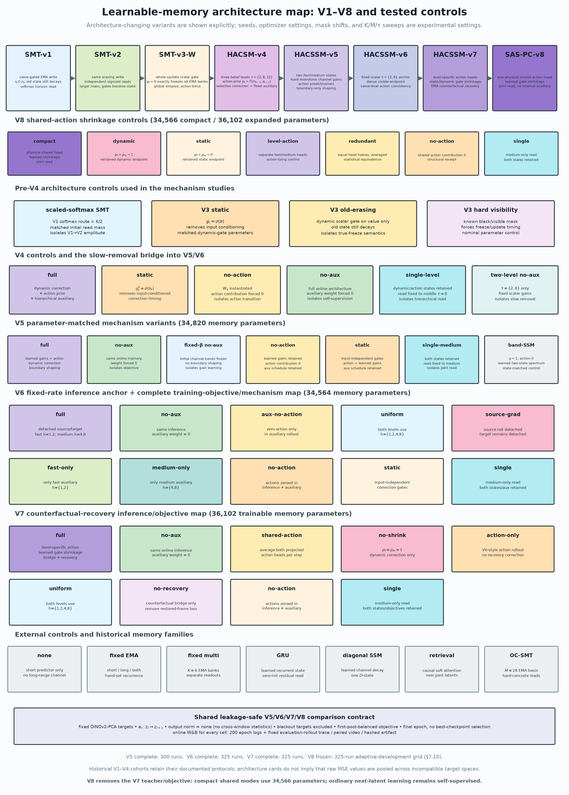
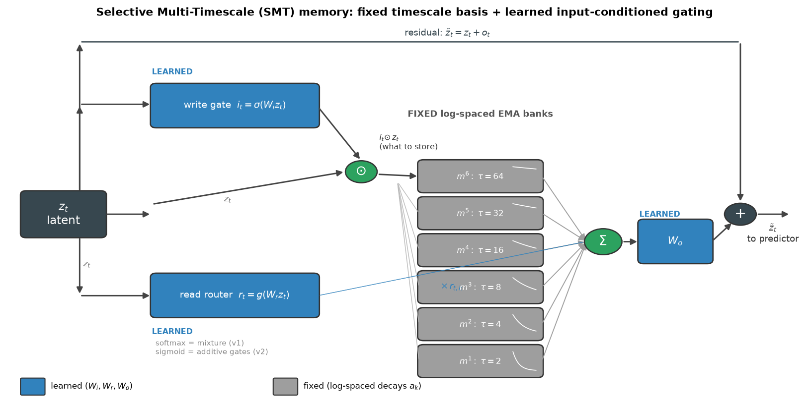
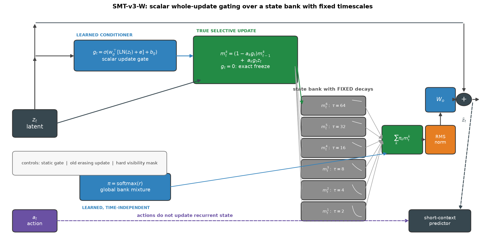
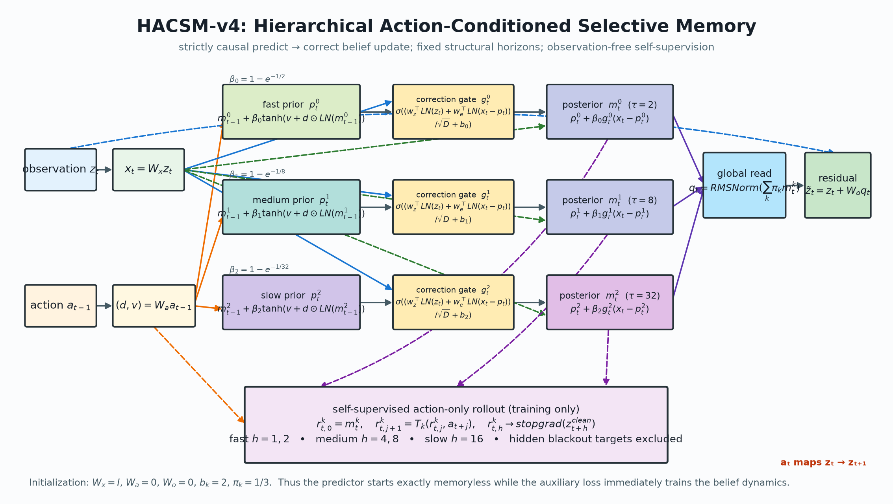
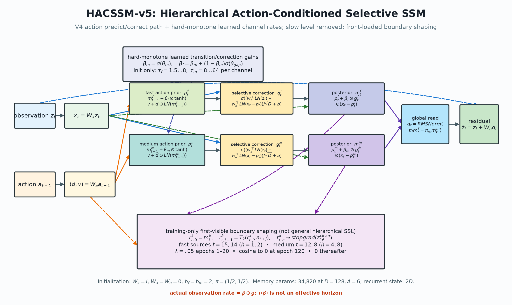
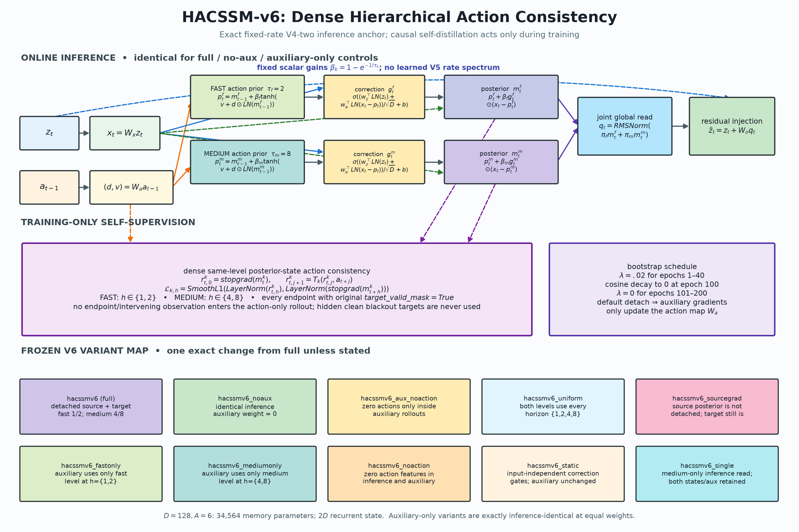
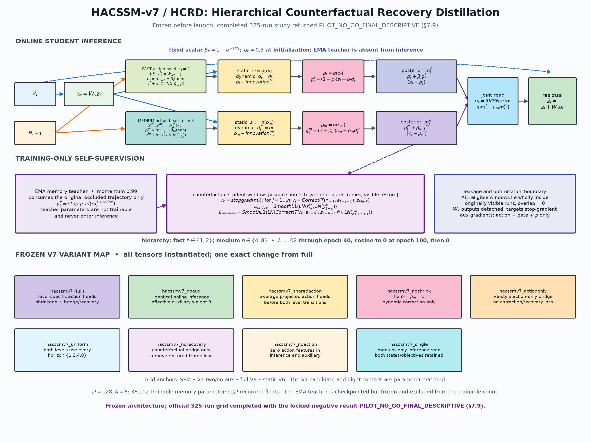
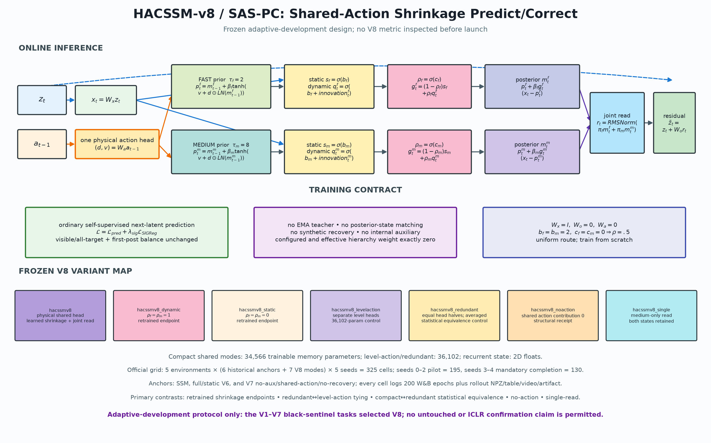
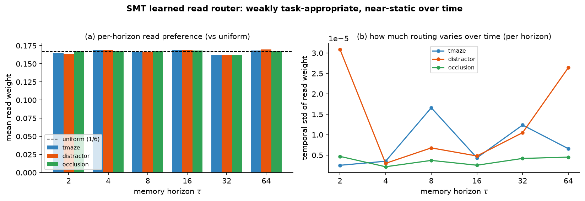
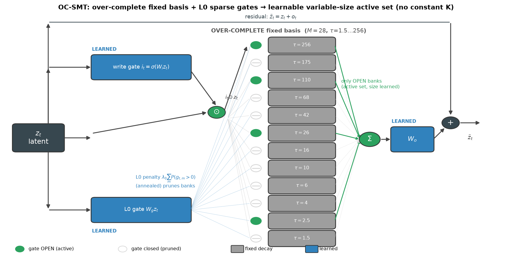

# Learnable memory for LeWorldModel: SMT-v1–v3 and HACSM/HACSSM-v4–v8

*Design and experiment record. Branch: `learnable-memory`. Implementations: `SelectiveMultiTimescaleMemory` (V1/V2), `SelectiveUpdateMemoryV3`, `HierarchicalActionConditionedMemory` (HACSM-v4 and the fixed-rate V6 inference anchor), `HierarchicalActionConditionedSSMMemory` (HACSSM-v5), `HierarchicalCounterfactualRecoveryMemory` (HACSSM-v7/HCRD), and `SharedActionShrinkageMemory` (HACSSM-v8/SAS-PC) in `lewm/models/memory.py`. Status as of 2026-06-29: every reported result through V7 is complete. The 325-cell V7 study returned immutable pilot `NO_GO` and locked final `PILOT_NO_GO_FINAL_DESCRIPTIVE`; full V7 beats SSM by 6.07% but the special objective adds only .30% and loses its direct shared-action/recovery controls (§7.9). V8 is the frozen compact response (§2.7/§7.10): one physical shared action head, learned per-level correction shrinkage, joint read, and no internal teacher or auxiliary. No V8 metric has been inspected and no V8 performance claim is made before its complete 325-cell adaptive-development grid finishes.*

## 1. Motivation — what our study tells us to do next

The companion paper (`docs/ICLR.md`) establishes two empirical facts that, together, point directly at this design:

1. **In the companion synthetic study, a fixed log-spaced bank of EMA horizons was the best memory tested** — it beat a learned GRU, a learned diagonal-SSM/RetNet-lite, and episodic retrieval on the long-gap tasks, *without any per-task tuning* (§5.11). Later common-target cohorts in this document do not preserve that global ranking (§7.2, §7.5–7.6). *Spanning* horizons nevertheless motivated the first design.
2. **A learnable scalar decay does not self-tune in this setup** — making the one global EMA rate `α` learnable leaves the horizon near its initialization regardless of the task gap (§5.4). This observation does not by itself diagnose whether gradient magnitude, parameterization, optimization, or another cause is responsible.

The naive reading is "memory should be fixed." But this repository's ungated fixed-bank baseline cannot allocate capacity or vary its bank mixture with the input, and it does not obviously scale (it reads the same spectrum of horizons at every step). Other fixed-decay architectures can still have content-dependent reads, as RetNet illustrates (§4). The research question is therefore:

> **How do we make short/long memory learnable and scalable without relying on the global learned scalar decay that failed in this setup?**

**Original hypothesis (SMT):** keep the decays **fixed** (the reliable prior) and move **all** learnability to *input-conditioned gating* — a learned **write gate** (what to store) and a learned **read router** (which horizon to use, per step). Learning *selection over* a fixed timescale basis should have a better-conditioned gradient than learning the decay itself.

**Empirical verdict.** SMT-v2 does not support the selection hypothesis: its gates are almost static and can be replaced by calibration means without hurting the saved models (§5). L0 routing finds either a dense model or a quality-destroying closed/static subset, and the strongest OC-SMT result uses all 28 banks (§9). SMT-v3 fixes the erasing write rule and learns a causally important black-sentinel gate (§7.5). HACSM-v4 then fixes action blindness: swapping only memory-path blackout actions raises first-post MSE by 12.46%, and V4 beats V3 by 12.49% across paired cells (§7.6). V5 confirms that action transport and a joint two-state read matter, but its wide learned channel spectrum and boundary-only auxiliary regress; full V5 loses to SSM and the fixed `τ={2,8}` no-aux bridge (§7.7). V6 restores that fixed-rate anchor and beats SSM, but dense action-only posterior consistency adds only .39%, degrades deep-blackout prediction, and loses to its static-correction control (§7.8). V7 preserves the structural gains: action transport and the joint read improve first-post prediction by 14.93% and 9.39%, and learned static/dynamic shrinkage improves 1.10% over forced-dynamic correction. Its visible-only counterfactual recovery objective, however, adds only .30% over no-aux; shared action heads and removing recovery are each slightly better than full V7. V8 therefore retains only the supported action/joint-read/shrinkage mechanisms, physically ties the action map, and returns to ordinary self-supervised next-latent prediction (§2.7). The defensible contribution remains a controlled study of when recurrent/action/selective paths are used—not a generally superior selective hierarchy or automatic memory sizing.

## 2. The architecture


*Figure 1. Consolidated map of the V1→V8 evolution, architecture-changing V3 controls, V4 controls, every V5–V8 mechanism variant, and external/historical memory families. Seeds, optimizer settings, mask placements, and ordinary hyperparameter sweeps are intentionally omitted. The completed V5–V7 grids (§7.7–7.9) and frozen V8 grid (§7.10) share the leakage-safe comparison contract; historical cards retain their documented protocols.*

### 2.1 SMT-v1/v2: gated-value write + input-conditioned read


*Figure 2. SMT-v1/v2 data flow. The latent `z_t` is gated by a learned **write gate** `i_t` and written into `K` **fixed** log-spaced EMA banks (`τ=2…64`); a learned **read router** `r_t` weights the banks; the weighted read-out is projected by learned `W_o` and added back residually. V1 uses a softmax router and V2 independent sigmoid read gates. Blue = learned (`W_i,W_r,W_o`); gray = fixed decays.*

Compact data flow:

```
                 ┌─ write gate  i_t = σ(W_i z_t) ─┐                    fixed banks
   z_t ──┬──────►│            (LEARNED)           │── i_t⊙z_t ──► [ τ=2 ][ τ=4 ]…[ τ=64 ]
         │       └───────────────────────────────┘                       │  │      │
         │                                                                ▼  ▼      ▼
         │        read router  r_t = g(W_r z_t)  (LEARNED) ───► weights r_{t,1..K}
         │                                                                │
         │                                          o_t = W_o( Σ_k r_{t,k} m^k_t )  (LEARNED)
         └──────────────────────────────── + ◄─────────────────────────────┘
                                            │
                                      z̃_t = z_t + o_t   ──►  predictor
```

Let `z_t ∈ R^D` be the encoder latent. SMT maintains `K` EMA banks at **fixed** log-spaced horizons `τ_1<…<τ_K` (default `τ ∈ {2,4,8,16,32,64}`), `a_k = 1 − e^{−1/τ_k}`:

```
write / input gate     i_t   = σ(W_i z_t)                       ∈ (0,1)^D     (what to store)
bank-k recurrence      m^k_t = (1 − a_k) m^k_{t−1} + a_k (i_t ⊙ z_t)         (a_k FIXED)
read router            r_t   = g(W_r z_t / T), g=softmax or sigmoid           (which horizon)
memory read-out        o_t   = W_o ( Σ_k r_{t,k} · m^k_t )
injected latent        z̃_t   = z_t + o_t
```

Only `W_i` (D×D), `W_r` (D×K), `W_o` (D×D), and the write/router biases (D+K) are learned — `2D² + DK + D + K` parameters (33,670 at D=128, K=6; about 1.5–1.6% of the original full-ViT synthetic model, not of every configuration). The decays `a_k` are buffers. Three design choices matter:

- **Fixed basis, learned selection.** The model never learns a timescale; it parameterizes *which* known timescales to read and *what* to write into them. This avoids relying on the global learned scalar `α` that stayed near initialization in §5.4 while keeping the spanning-horizons prior of §5.11.
- **Input-conditioned write gate** `i_t`. Mamba-style selectivity, but on *what to store* rather than *how fast to forget*: in principle the model can ignore distractors and write only decision-relevant content into the (fixed-horizon) banks. Section 5 shows that this behavior did not emerge in the saved models.
- **Small (not zero) read-out init.** The EMA/`multi` designs zero-init their read-outs to start exactly at the memoryless baseline. SMT cannot: the router and write gate sit *upstream* of the multiplicative read-out, so a zero read-out gives them *exactly zero gradient at step 0*. We instead use a small read-out init (≈5% deviation from baseline) so every learned part trains from the first step. *(Verified: with zero-init the router/gate gradients are 0; with small init they are non-zero.)*

### 2.2 SMT-v3-W: whole-update gating + global normalized read


*Figure 3. SMT-v3-W (“whole-update”) data flow. A learned scalar `g_t` changes the complete update rate of every EMA state with a fixed decay, so `g_t=0` freezes old state exactly. A learned but time-independent simplex `π` mixes the six banks, the read is RMS-normalized, and one shared `W_o` injects it residually. Actions enter only the short-context predictor; they do not propagate the recurrent state. The controls isolate conditioning, recurrence semantics, and known visibility; dynamic/static is the clean active-parameter match, while the hard-visibility control is only nominally parameter-matched.*

V3 is not merely a new router setting. It changes where selection acts:

```text
conditioned update gate  g_t = sigmoid(w_g^T [LayerNorm(z_t) + e] + b_g)       scalar
true bank update         m_t^k = (1-a_k g_t)m_{t-1}^k + a_k g_t z_t            a_k fixed
global horizon mixture   pi = softmax(r)                                        time-independent
normalized read          q_t = RMSNorm(sum_k pi_k m_t^k)
residual injection       z_tilde_t = z_t + W_o q_t
```

The architectural distinction is easiest to see side by side:

| version | write/update semantics | horizon read | memory parameters (`D=128,K=6`) | observed behavior |
|---|---|---|---:|---|
| **SMT-v1** | vector gate scales the new value; old state still decays | per-step softmax, total mass 1 | 33,670 | weak initial result; unit-mass amplitude confound |
| **SMT-v2** | same gated-value write | per-step independent sigmoids, initial mass ≈`K/2` | 33,670 | stronger usage, but learned read/write gates are nearly static |
| **SMT-v3-W** | scalar gate multiplies the whole EMA update; `g_t=0` is exact freeze | one global simplex + RMS-normalized read | 16,647 | gate is causal and dynamic, but specializes to the exact black sentinel and returns `NO_GO` |
| **HACSM-v4** | action prior advances three belief states, then a per-level gate corrects from the observation | one global simplex over `τ={2,8,32}` + RMS-normalized read | 34,566 | actions are causally necessary and V4 beats V3, but SSM wins 4/5 means and the fixed auxiliary fails |
| **HACSSM-v5** | action prior + correction use hard-monotone learned per-channel gains over two states | one global simplex over fast/medium states + RMS-normalized read | 34,820 | complete: action/joint read matter, but wide channel spectra and boundary shaping regress; full V5 loses to SSM |
| **HACSSM-v6** | exact V4-two fixed scalar `τ={2,8}` predict/correct recurrence; dense same-level consistency is training-only | one global simplex over fast/medium states + RMS-normalized read | 34,564 | complete: beats SSM, but the objective adds only .39% over no-aux and full V6 loses to static correction |
| **HACSSM-v7 / HCRD** | fixed `τ={2,8}`, level-specific action heads, learned static/dynamic gate shrinkage; EMA counterfactual recovery is training-only | one global simplex over fast/medium states + RMS-normalized read | 36,102 | complete: shrinkage, action, and joint read help, but the objective effect is .30%; shared action and no-recovery controls slightly outperform full V7 |
| **HACSSM-v8 / SAS-PC** | fixed `τ={2,8}`, one physical shared action head, per-level learned gate shrinkage; no internal auxiliary or teacher | one global simplex over fast/medium states + RMS-normalized read | 34,566 | frozen: tests whether the supported V7 mechanisms survive physical compaction and ordinary next-latent self-supervision |

V3's simplification is deliberate: it removes content-dependent horizon routing so its experiment asks one clean question—**does input-conditioned update timing help beyond an equally parameterized static gate?** HACSM-v4 retains the global read but adds action prediction, a three-level hierarchy, and self-supervision. Sections 7.5–7.6 give the matched controls and results.

### 2.3 HACSM-v4: hierarchical action predict/correct memory


*Figure 4. HACSM-v4 replaces V3's action-blind EMA with three full-width belief states at fixed structural horizons `τ={2,8,32}`. The previous action first predicts each state forward; a learned reliability gate then controls the observation correction. Training-only action rollouts supervise the fast, medium, and slow states at horizons `{1,2}`, `{4,8}`, and `{16}` without consuming intervening observations or hidden clean blackout targets.*

For level `k`, let `β_k=1-exp(-1/τ_k)`, `x_t=W_x z_t`, and split the shared action projection as `(d_{t-1},v_{t-1})=W_a a_{t-1}`. The strictly causal update is

```text
action prior       p_t^k = m_{t-1}^k + β_k tanh(v_{t-1} + d_{t-1} ⊙ LayerNorm(m_{t-1}^k))
correction gate    g_t^k = sigmoid((w_z^T LN(z_t) + w_e^T LN(x_t-p_t^k))/sqrt(D) + b_k)
posterior          m_t^k = p_t^k + β_k g_t^k (x_t-p_t^k)
global read        q_t   = RMSNorm(sum_k softmax(r)_k m_t^k)
residual input     z_tilde_t = z_t + W_o q_t
```

The timing convention is explicit: `a_t` maps `z_t → z_{t+1}`. When a correction closes, the action prior still evolves the belief through missing observations—the capability V3 lacks. The global route intentionally remains time-independent, so any dynamic mechanism claim belongs to action evolution or correction timing rather than a confounded per-token horizon router.

The hierarchical self-supervised target is an observation-free rollout from the online posterior:

```text
r^k_{t,0}   = m^k_t
r^k_{t,j+1} = T_k(r^k_{t,j}, a_{t+j})
target      = stopgrad(z_clean_{t+h})
```

Fast uses `h={1,2}`, medium `h={4,8}`, and slow `h=16`. For each horizon, the loss is `0.5*mean(all valid endpoints)+0.5*mean(first-post endpoints)`; the three level losses are averaged and enter the total objective with the prospectively fixed weight `0.1`. Endpoint validity alone controls inclusion, so a source may lie inside the blackout while no hidden target at `t=10…15` is ever used. At `L=32` with blackout `[10,16)`, the eligible endpoint counts per episode are respectively `25,24,22,18,16`, and every first-post target is exactly time 16 with source times `15,14,12,8,0`.

At `D=128,A=6,K=3`, HACSM-v4 has `2D²+2AD+2D+2K = 34,566` memory parameters, versus 33,024 for the diagonal SSM (+4.67%). It carries three recurrent `D`-states rather than one, but does not add prediction heads: states live directly in the shared target coordinates. `W_x=I`, `W_a=0`, `W_o=0`, `b_k=2`, and a uniform route make the fused predictor exactly memoryless at initialization while the auxiliary objective immediately supplies gradients to the action dynamics.

The matched controls retain the same nominal parameters: `hacsmv4_static` removes input conditioning from correction gates, `hacsmv4_noaction` zeros only the recurrent action path, `hacsmv4_noaux` sets the auxiliary weight to zero, and `hacsmv4_single` fixes the read to the middle `τ=8` state. Full experiment protocol and results are in §7.6.

### 2.4 HACSSM-v5: learned-rate two-level action hierarchy


*Figure 5. Prospective HACSSM-v5 architecture. V5 retains V4's causally useful action predict/correct path, removes the slow `τ=32` level, and replaces the two remaining scalar rates with hard-monotone learned per-channel gains initialized from fast and medium SSM-like spectra. Training-only action rollouts shape the already-weighted first-visible boundary early in optimization and decay to exactly zero; this is boundary shaping, not evidence of general hierarchical self-supervision.*

For every channel, V5 parameterizes medium gain and the non-negative fast/medium gap as

```text
beta_medium = sigmoid(theta_medium)
beta_fast   = beta_medium + (1-beta_medium) sigmoid(theta_gap)
```

Thus `0<β_medium≤β_fast<1` throughout training. Fast gains initialize from log-spaced `τ=1.5…8`, medium gains from `τ=8…64`, using `β=1-exp(-1/τ)`. These bands are **initialization priors only**, not post-training bounds. Because the actual observation rate is `β⊙g`, `τ(β)` is a gain diagnostic rather than an identifiable effective memory horizon.

With `(d_{t-1},v_{t-1})=W_a a_{t-1}` and `x_t=W_xz_t`, both action advance and observation correction use the same channel gain:

```text
action prior       p_t^k = m_{t-1}^k + β_k ⊙ tanh(v_{t-1}+d_{t-1}⊙LN(m_{t-1}^k))
correction gate    g_t^k = sigmoid((w_z^T LN(z_t)+w_e^T LN(x_t-p_t^k))/sqrt(D)+b_k)
posterior          m_t^k = p_t^k + β_k ⊙ g_t^k (x_t-p_t^k),       k∈{fast,medium}
global read        q_t   = RMSNorm(softmax(r)_f m_t^f + softmax(r)_m m_t^m)
residual input     z_tilde_t = z_t + W_o q_t
```

Initialization is again exactly memoryless at the predictor: `W_x=I`, `W_a=W_o=0`, `b_f=b_m=2`, and the route is uniform. At `D=128,A=6`, V5 has `2D²+2AD+4D+4=34,820` memory parameters: +0.73% versus V4 and +5.44% versus SSM. Its recurrent state is `2D`, versus V4's `3D` and SSM's `D`; parameter proximity is therefore not state matching.

The auxiliary uses four action-only rollouts whose endpoints are the canonical first visible target at time 16: fast sources `t={15,14}` at horizons `{1,2}`, and medium sources `t={12,8}` at `{4,8}`. Hidden targets remain excluded and endpoints are stop-gradient. Its locked schedule is `.05` for epochs 1–20, cosine decay over epochs 21–120 to exactly zero, then zero for epochs 121–200. The auxiliary duplicates a target already emphasized by the `.5` primary first-post weight, so a gain by full V5 alone is an objective/system gain; the inference architecture is stronger only if `hacssmv5_noaux` also beats SSM.

The parameter-matched V5 controls are `static`, `noaction`, `fixedbeta_noaux`, `noaux`, `single` (medium read only), and `ssmcontrol` (`g=1`, no action, same learned two-state rate spectrum). `hacsmv4_two_noaux` provides the sequential bridge with two fixed scalar levels `τ={2,8}`. Section 7.7 freezes the complete 12-design all-environment ladder before launch.

### 2.5 HACSSM-v6: dense hierarchical action consistency on the fixed-rate anchor


*Figure 5b. Frozen prelaunch HACSSM-v6 architecture and complete variant map. Online inference is exactly the strongest V1–V5 development-grid design: two fixed scalar levels `τ={2,8}`, causal action predict/correct updates, and a joint global read. V6 changes the training signal, not the default inference transition. Dense action-only rollouts match same-level online posterior states at originally visible endpoints; source and target are stop-gradient by default, the loss is scale-normalized, and hidden clean blackout targets never enter the objective. The completed result and mechanism audit are in §7.8.*

V5 supplies two unusually direct constraints on the next design. Replacing action transport or the joint fast/medium read loses about 11% in every paired cell, so V6 keeps both. Conversely, even frozen V5 channel spectra lose 7.30% to two fixed scalar rates, and V5's boundary-only auxiliary hurts all five environment means, so V6 restores the exact `hacsmv4_two_noaux` inference equations with `β_k=1-exp(-1/τ_k)` and `τ_f=2,τ_m=8`:

```text
action prior       p_t^k = m_{t-1}^k + β_k tanh(v_{t-1}+d_{t-1}⊙LN(m_{t-1}^k))
correction gate    g_t^k = sigmoid((w_z^T LN(z_t)+w_e^T LN(x_t-p_t^k))/sqrt(D)+b_k)
posterior          m_t^k = p_t^k + β_k g_t^k (x_t-p_t^k),      k∈{fast,medium}
global read        q_t   = RMSNorm(softmax(r)_f m_t^f + softmax(r)_m m_t^m)
residual input     z_tilde_t = z_t + W_o q_t
```

The training-only objective uses the online posterior itself as a causal self-distillation target. For every level/horizon pair and every endpoint `t+h` whose **original** `target_valid_mask` is true,

```text
source             r^k_{t,0}   = stopgrad(m^k_t)
action rollout     r^k_{t,j+1} = T_k(r^k_{t,j}, a_{t+j})
target             y^k_{t,h}   = stopgrad(m^k_{t+h})
consistency        L_{k,h}     = SmoothL1(LayerNorm(r^k_{t,h}), LayerNorm(y^k_{t,h}))
hierarchy          fast: h={1,2}; medium: h={4,8}
```

The rollout receives actions only: neither endpoint observations nor intervening observations are consumed. A source may precede an originally visible endpoint across a masked interval, but a hidden clean blackout state is never an endpoint target. Layer normalization removes state scale as a shortcut. Detaching both online source and target while keeping fixed `β_k` means the default auxiliary gradient updates only the shared action map `W_a`; it cannot directly pull the correction/read states away from the primary objective. The locked bootstrap weight is `.02` for epochs 1–40, cosine-decays to exactly zero at epoch 100, and remains zero for epochs 101–200.

Every V6 variant is parameter-matched at `D=128,A=6` (34,564 memory parameters and `2D` recurrent floats); auxiliary-only variants are exactly inference-identical when their parameters are equal:

| design | exact change from full V6 |
|---|---|
| `hacssmv6` | detached source and target; fast horizons `{1,2}`, medium `{4,8}` |
| `hacssmv6_noaux` | identical inference and computed diagnostics; effective auxiliary weight forced to zero |
| `hacssmv6_aux_noaction` | actions are zeroed only inside auxiliary rollouts; online inference is unchanged |
| `hacssmv6_uniform` | both levels receive every horizon `{1,2,4,8}`, testing whether the hierarchy assignment matters |
| `hacssmv6_sourcegrad` | source posterior is not detached; target remains stop-gradient |
| `hacssmv6_fastonly` | auxiliary supervises only the fast level at `{1,2}` |
| `hacssmv6_mediumonly` | auxiliary supervises only the medium level at `{4,8}` |
| `hacssmv6_noaction` | action features are zeroed in both inference and auxiliary rollouts |
| `hacssmv6_static` | the correction gate is input-independent; auxiliary definition is unchanged |
| `hacssmv6_single` | inference read is fixed to medium only; both states and both-level auxiliary remain instantiated |

This is self-supervised in the narrow, auditable sense that targets come from the model's own causal online posterior and require no labels, simulator state, or hidden clean observations. It is not evidence for general semantic hierarchy: V6's dense objective adds only .39% over no-aux and V7's visible-only recovery objective adds only .30%, while both reuse the same exact black-sentinel development regime. Untouched corruptions and task-level outcomes remain necessary for a stronger claim.

### 2.6 HACSSM-v7 / HCRD: hierarchical counterfactual recovery distillation


*Figure 5c. Frozen-before-launch HACSSM-v7 architecture and complete variant map for the completed 325-cell study. V7 keeps the fixed `τ={2,8}` two-state hierarchy and joint read, gives each level its own action head, and learns a per-level convex shrinkage between V6's exact static and dynamic correction experts. Its training-only EMA teacher sees only the original occluded trajectory. The student synthesizes black spans wholly inside originally visible runs and matches both the bridge state and the posterior after one restored visible frame. Every tested V7 variant is shown; the locked negative result is reported in §7.9.*

V6 supplies a specific failure diagnosis rather than a license for an unconstrained redesign. Actions and the two-level read are essential, but the action-only posterior target is mismatched: full V6 gains only .39% over its inference-identical no-auxiliary anchor, and using real actions makes the held-out consistency objective worse than zero actions. Static correction is the strongest V1–V6 development-grid design, while dynamic correction remains better on two task means. V7 therefore preserves the fixed rates and read, separates the fast/medium action maps, and makes the static-versus-dynamic choice a learned **shrinkage** rather than a single global architectural decision.

For level `k∈{fast,medium}`, the online student uses

```text
level action       (d^k_{t-1},v^k_{t-1}) = W_a^k a_{t-1}
action prior       p_t^k = m_{t-1}^k + β_k tanh(v^k_{t-1}+d^k_{t-1}⊙LN(m_{t-1}^k))
static expert      s_k = sigmoid(b_k)
dynamic expert     d_t^k = sigmoid(b_k + (w_z^T LN(z_t)+w_e^T LN(x_t-p_t^k))/sqrt(D))
shrinkage          ρ_k = sigmoid(c_k)
correction gate    g_t^k = (1-ρ_k)s_k + ρ_k d_t^k
posterior          m_t^k = p_t^k + β_k g_t^k (x_t-p_t^k)
```

The two scalar `ρ_k` values initialize at `.5`. Thus `ρ_k→0` exactly recovers static correction and `ρ_k→1` recovers the dynamic V6 gate, while intermediate values regularize the input-conditioned innovation toward the stable expert. The `noshrink` control fixes both values to one. Level-specific `W_a^k` heads allow fast and medium dynamics to specialize; the `sharedaction` control averages their projected features before either transition. The rates remain fixed at `β_k=1-exp(-1/τ_k)` for `τ={2,8}`, and the read remains the joint global simplex used by V4-two and V6.

The training-only objective creates deterministic counterfactual gaps without touching a hidden clean target. Let `M_t` be the original target-valid mask. For **every** source/horizon window `[t,t+h+1]` with `M_{t:t+h+2}=True`, the student starts from `stopgrad(m_t)`, applies the observed actions, replaces the next `h` visible latents by the canonical black latent already present in the corrupted input, and then consumes the actual visible latent at `t+h+1`. A momentum-`.99` EMA copy of the memory module processes only the original occluded input and supplies stop-gradient same-level posterior targets:

```text
student source     r_0 = stopgrad(m_t)
counterfactual     r_j = Correct(T(r_{j-1},a_{t+j-1}), z_black),     j=1...h
bridge loss        L_bridge = SmoothL1(LN(r_h^k), LN(stopgrad(m^k_teacher,t+h)))
visible recovery   u = Correct(T(r_h,a_{t+h}), z_{t+h+1})
recovery loss      L_recovery = SmoothL1(LN(u^k), LN(stopgrad(m^k_teacher,t+h+1)))
hierarchy          fast: h={1,2}; medium: h={4,8}
```

Eligibility is computed from the **original** mask before synthetic corruption, so these windows have zero overlap with the real blackout. The black latent is the mean of the actually observed corrupted blackout inputs, not a clean frame. The teacher never receives the counterfactual student sequence, is frozen with respect to backpropagation, and never enters online inference. `W_x` outputs are detached inside the auxiliary, so its gradients are restricted to the action, correction-gate, and shrinkage parameters; `W_x`, `W_o`, and the route remain primary-objective only. The weight reuses V6's locked `.02` schedule through epoch 40, cosine decay to zero at epoch 100, and zero thereafter. This is self-supervised occlusion/recovery distillation, but it remains a synthetic missingness objective rather than evidence of semantic hierarchy or control performance.

All nine V7 modes instantiate the same student tensors and have 36,102 trainable memory parameters at `D=128,A=6`; the frozen EMA teacher is checkpointed but excluded from that count and from inference:

| design | exact change from full V7 |
|---|---|
| `hacssmv7` | level-specific action heads, learned static/dynamic shrinkage, hierarchical bridge and restored-frame recovery |
| `hacssmv7_noaux` | identical online inference and computed diagnostics; effective auxiliary weight forced to zero |
| `hacssmv7_sharedaction` | average the two projected action heads before applying either level transition |
| `hacssmv7_noshrink` | fix `ρ_f=ρ_m=1`, recovering dynamic-only correction |
| `hacssmv7_actiononly` | replace counterfactual correction/recovery with the V6-style action-only bridge target |
| `hacssmv7_uniform` | assign every horizon `{1,2,4,8}` to both levels |
| `hacssmv7_norecovery` | retain the counterfactual bridge loss but remove the restored-frame recovery term |
| `hacssmv7_noaction` | zero recurrent action features in online inference and the auxiliary |
| `hacssmv7_single` | fix the inference read to medium only while retaining both states and both-level objectives |

The frozen comparison ladder uses four anchors—SSM, V4-two/no-aux, full V6, and static V6—plus these nine V7 designs, for `5 environments × 13 designs × 5 seeds = 325` required cells. All 325 cells completed with 200 online W&B epoch records and a fixed evaluation-rollout table, paired video, and hashed artifact. The architecture and protocol were frozen before launch; the verified result and receipts are in §7.9.

### 2.7 HACSSM-v8 / SAS-PC: compact shared-action shrinkage


*Figure 5d. Frozen prelaunch SAS-PC architecture and complete seven-mode V8 map. V8 keeps V7's fixed `τ={2,8}`, per-level correction shrinkage, and joint read, but replaces the two projected action heads by one physical shared tensor and removes the EMA teacher, posterior matching, and counterfactual recovery objective. Ordinary next-latent prediction remains self-supervised. The expanded controls distinguish action tying from parameter compaction; no V8 result is implied by the diagram.*

V7 gives unusually direct design constraints. Removing actions or the joint read loses 14.93% and 9.39%, and learned shrinkage beats forced-dynamic correction by 1.10%; those mechanisms stay. In contrast, level-specific heads lose to their shared-action control, the special objective adds only .30% over no-aux, and removing recovery is slightly better. V8 is therefore a simplification, not another objective bundle.

For both levels `k∈{fast,medium}`, with fixed `β_k=1-exp(-1/τ_k)` and one shared action projection,

```text
shared action      (d_{t-1},v_{t-1}) = W_a a_{t-1}
action prior       p_t^k = m_{t-1}^k + β_k tanh(v_{t-1}+d_{t-1}⊙LN(m_{t-1}^k))
observation        x_t = W_x z_t
static expert      s_k = sigmoid(b_k)
dynamic expert     q_t^k = sigmoid(b_k+(w_z^T LN(z_t)+w_e^T LN(x_t-p_t^k))/sqrt(D))
shrinkage          ρ_k = sigmoid(c_k)
correction gate    g_t^k = (1-ρ_k)s_k + ρ_k q_t^k
posterior          m_t^k = p_t^k + β_k g_t^k(x_t-p_t^k)
joint read         r_t = RMSNorm(π_f m_t^f + π_m m_t^m),  π=softmax(route)
residual           z_tilde_t = z_t + W_o r_t
```

V8 trains only with the existing prediction and SIGReg losses. It has no private clean-target API, memory teacher, synthetic window, or hierarchical weight; both configured and effective auxiliary weights are exactly zero. Initialization remains `W_x=I`, `W_o=W_a=0`, `b_f=b_m=2`, `c_f=c_m=0` (`ρ=.5`), and a uniform route. The post-open V7 means `ρ=(.614,.546)` are not baked into initialization.

The compact modes have `2D²+2AD+2D+3K=34,566` trainable memory parameters at `D=128,A=6,K=2`, versus V7's 36,102, and retain `2D` recurrent floats. `levelaction` and `redundant` intentionally retain 36,102 parameters:

| design | exact V8 change / role |
|---|---|
| `hacssmv8` | nominated compact shared head, learned shrinkage, joint read |
| `hacssmv8_dynamic` | compact retrained endpoint with `ρ_f=ρ_m=1` |
| `hacssmv8_static` | compact retrained endpoint with `ρ_f=ρ_m=0` |
| `hacssmv8_levelaction` | separate fast/medium heads; primary action-tying reference |
| `hacssmv8_redundant` | two equal averaged heads; physical-compaction equivalence reference |
| `hacssmv8_noaction` | zero shared action contribution |
| `hacssmv8_single` | medium-only read while both states remain instantiated |

The clean attribution chain is `redundant↔levelaction` for action tying, compact↔redundant for physical compaction, compact↔retrained `ρ={0,1}` for shrinkage, and compact↔no-action/single for structural use. Compact↔level-action is only a bundle contrast because tensor count also changes. V8 checkpoints train from scratch and intentionally contain no V7 teacher keys.

## 3. Why it is scalable

- **Linear time / memory.** Each bank/state is a diagonal recurrence: `O(L·K·D)` with `K` small (V5–V8 use `K=2`). V6 adds bounded action rollouts; V7 adds bounded counterfactual predict/correct windows and a training-only EMA memory copy; V8 removes those training-only paths. None introduces `O(L²)` attention.
- **Parallelizable in principle.** The recurrence `m^k_t = (1−a_k)m^k_{t−1} + a_k u_t` admits an associative scan. The current code uses a Python sequential scan for `L=32`; no parallel implementation or long-sequence benchmark exists yet.
- **Explicit hierarchy with bounded state.** SMT-v1–v3 can be stacked by depth; V4 carries three fixed-rate belief levels, V5 carries two learned-rate levels with hard per-channel ordering, and V6–V8 use two fixed scalar-rate levels. V7 specializes action heads and shrinkage by level; V8 keeps per-level shrinkage but physically shares the action map and removes the internal auxiliary. None currently has a parallel implementation or long-sequence scaling benchmark.
- **Constant recurrent state in streaming form.** The recurrence needs `K·D` state regardless of sequence length. The current training implementation materializes the full sequential scan and its activations; the claimed constant state is algorithmic/streaming, not a measured peak-memory result for this code path.

## 4. Relation to prior work and revised positioning

| Method | Decay/timescale | Input-dependent? | Our difference |
|---|---|---|---|
| **Mamba / S6** (Gu & Dao 2023) | learned input-dependent `Δ` | yes (learns timescale) | V1–V4 and V6–V8 fix rate bases; V5 learns channel gains but not token-dependent `Δ`, so neither our failed global scalar nor V5 tests/refutes Mamba selectivity |
| **Mega** (arXiv:2209.10655) | learned multi-dim EMA coefficients | no (static EMA) | V5 is closest in learned channel gains, but adds action prediction, correction gates, hard fast/medium ordering, and explicit causal interventions |
| **HGRN2** (arXiv:2404.07904) | learned data-dependent decay, monotone by depth | yes | V5 enforces monotonicity between two within-layer states, while its gains are global parameters rather than token-dependent depth bounds |
| **RetNet** (Sun et al. 2023) | fixed multi-scale decay per head | yes, through content-dependent Q/K/V (decay fixed) | our explicit recurrent states expose action/gate/rate counterfactuals; V5 learns gains, V6 fixes two gains, V7 adds action-head/gate shrinkage plus training-only recovery, and V8 compacts the supported inference path; all routes remain global |
| **Titans** (arXiv:2501.00663) | deep memory meta-learned at test time | yes (test-time) | orthogonal axis; SMT is a cheap, interpretable train-time module (composable with it) |
| **Instance-conditional timescales of decay** (arXiv:2212.05908) | mixture over fixed decay rates via a learned scorer | yes | closest idea, but for *non-stationary supervised instance weighting* — we bring it to *sequence/world-model memory* with per-step routing, a learned write gate, and the short/long interpretability protocol |

**Net positioning, revised after the experiments.** SMT occupies the fixed-decay-basis + learned-gating quadrant. SMT-v2 is functionally static; V3 mainly separates an explicit black token from visible inputs (§7.5). V4 adds a genuine action-conditioned predict/correct path, but its slow level and fixed auxiliary fail and it trails SSM (§7.6). V5's learned spectrum and boundary shaping do not improve the strongest fixed-rate bridge (§7.7). V6's dense posterior-state action consistency is a controlled negative objective result: the action/joint-read mechanisms survive, but the auxiliary barely moves the inference-identical anchor and static correction wins (§7.8). V7 shows that learned shrinkage improves over forced-dynamic correction and again confirms action/joint-read use, but its self-distillation objective, level-specific action heads, and recovery term do not outperform their direct controls (§7.9). V8 is the frozen compact/no-special-objective response; it has no result yet (§7.10). This is filtering/mechanism evidence, not architectural novelty or general hierarchy. The ICLR audit (§10) therefore remains diagnostic pending untouched task-level tests.

## 5. Interpretability — little observed switching in the synthetic tasks

Because the horizons are fixed and known, the router output `r_t` is directly plottable as a **read preference over known horizons** (`route_weights()`). The diagnostic below uses the seed-0 `smt` sigmoid/v2 checkpoints; it normalizes the six independent gates to sum to one before plotting them:


*Figure 6. Normalized read preferences for three seed-0 SMT-v2 checkpoints. Mean preferences are close to uniform, and the temporal standard deviation of the episode-averaged weights is ≈10⁻⁵. This diagnostic shows little shared time-dependent switching; averaging episodes can hide episode-specific variation.*

**Honest finding: useful switching did not emerge.** An all-seed audit still finds extremely small normalized within-episode router variation (≈10⁻⁵–5×10⁻⁵) and write-gate variation (≈3×10⁻⁵–10⁻⁴) on these synthetic tasks. This is an output-level result, not evidence that `W_r≈0`: the final router-weight norms remain near ordinary initialization. The supported conclusion is that neither learned gate developed meaningful input/time dependence under this evaluation.

Even exactly constant SMT gates would not make SMT equivalent to `multi`. SMT keeps an input write gate and applies one shared projection after the weighted bank sum, `W_o Σ_k r_k m_t^k`; `multi` instead has a separate `D×D` readout for every bank. Static routing therefore gives a weakly varying shared-projection mixture, not `multi`'s parameterization.

This sharpens the central question: can a task or intervention elicit content dependence that improves predictions over a static-gate control? Harder interference (§7.3) does not, and the direct interventions below now answer the question negatively for the saved checkpoints.

### Direct gate interventions: dynamic conditioning is dispensable in the saved models

We evaluated all 12 sigmoid-SMT checkpoints under eight no-retraining conditions: original gates; read, write, or both gates replaced by their means from 256 disjoint calibration episodes; read/write gates resampled from strictly earlier times in the same episode; and gates shuffled across episodes at the same time index. Evaluation uses the canonical 256 episodes and matched usage probe. Mean replacement preserves learned static per-bank/per-channel amplitudes while removing dynamic input/time conditioning.

| task | original usage | both gates replaced by means | paired Δ usage | paired Δ validation MSE |
|---|---:|---:|---:|---:|
| T-Maze | 0.9610 | 0.9610 | +0.0000 | +1.57×10⁻⁶ |
| Distractor | 0.9740 | 0.9740 | +0.0000 | −1.38×10⁻⁶ |
| Recall | 0.4242 | 0.4199 | −0.0043 | −0.72×10⁻⁶ |
| Occlusion | 0.6147 | 0.6364 | +0.0216 | −2.92×10⁻⁶ |

Across every individual intervention and checkpoint, the largest absolute validation-MSE change is **1.09×10⁻⁵**. Read/write mean replacement changes the gate outputs by only ≈6.2×10⁻⁵ / 4.2×10⁻⁵ on average; past-only time resampling and episode shuffles are similarly tiny and do not systematically hurt usage. An earlier full-sequence time-shuffle diagnostic was discarded because it could move a future/post-reveal gate backward; the reported CSV was regenerated with strictly causal time donors and retains the same conclusion. Two complete runs of the corrected protocol produced byte-identical per-run and grouped CSVs. A backend diagnostic changed one T-Maze probe label out of 77 when cuDNN TF32 was disabled, so the manifest preserves the canonical analysis backend.

**Conclusion.** These checkpoints do not use meaningful dynamic read routing or write selection. SMT-v2 is empirically a fixed timescale basis with learned, nearly static additive amplitudes. This does not prove that all static gates can be removed without retraining, but it rules out attributing the reported gains to input- or time-selective gating.

## 6. Original experiment plan and completion status

1. **Headline comparison — complete.** `none` vs fixed `multi` vs SMT was run on the four synthetic memory environments, including harder interference variants. SMT does not consistently beat `multi` (§7).
2. **Scalability — not established.** The current scan is sequential and was not benchmarked at `L∈{64,128}`. The dense basis-size factorial is complete, but it is a quality—not wall-clock or memory-scaling—study (§9.4).
3. **Selectivity and mechanism ablations — complete through V7; V8 frozen.** Router mass matching, causal gate replacement, static/dynamic and old/new-recurrence controls, hard visibility, shifted masks, L0 cardinality, action/no-aux/single-level controls, and memory-only action interventions were tested. V5 adds learned/frozen-rate and boundary-objective controls; V6 completes dense-objective hierarchy, detach, and action controls; V7 completes action-head, shrinkage, recovery, and horizon controls (§7.5–7.9). V8 prospectively tests physical sharing/compaction and retrained shrinkage endpoints (§7.10). A competitively tuned Mamba-style learned-`Δ` baseline remains undone.
4. **Router/update/action diagnostics — complete through V7; V8 frozen.** SMT-v2 gates are nearly static (§5); V3 gates are black-sentinel selective (§7.5). V4 adds a genuinely used action path: cross-episode blackout-action replacement raises first-post MSE 12.46% while no-action/SSM controls are invariant. V5 reproduces the importance of action and a two-level read in all 25 paired cells. V6 shows that its action-only consistency target has little primary effect and that static correction is stronger. V7 again confirms action and joint-read dependence, finds a positive learned-shrinkage contrast, and finds no positive contribution from level-specific rather than shared action heads or from the recovery term (§7.7–7.9). V8's action-tying, compaction, endpoint, and structural receipts are predeclared but not yet observed.
5. **Simulator/robotic diagnostic — complete, with a narrower outcome.** The old self-latent comparison was integrity-corrected but remains invalid across independently learned coordinate systems (§7.1). A new fixed-DINO, paired-clean-target factorial removes that flaw and evaluates shifted masks (§7.2); it is an offline latent-prediction diagnostic, not robot-control performance.
6. **Optimization-budget and V3 factorial — complete.** The 125-cell 100-epoch audit shows the old 30-epoch ranking was undertrained and still not converged. The subsequent matched 225-cell, 200-epoch V3 grid, 900 mask evaluations, and 100 gate audits are complete and return `NO_GO` (§7.2, §7.5).
7. **Causal-predictor V4 pilot — complete and stopped prospectively.** A four-run normalization calibration selected batch-independent `predictor_norm=none`; the 135-cell V4 pilot and post-decision mask/gate/action/level diagnostics are complete. V4 beats V3 but not SSM, and the auxiliary ablation is negative, so the locked protocol did not launch its 165-run expansion (§7.6).
8. **Learned-rate V5 all-environment study — complete.** All 300 cells, 60,000 epoch records, and 300 fixed evaluation-rollout packages completed with online W&B receipts. The immutable pilot and final descriptive label are negative; the fixed-rate V4-two/no-aux bridge remains strongest (§2.4/§7.7).
9. **Dense self-supervised V6 study — complete.** All 325 cells, 65,000 online W&B epoch records, fixed-rollout packages, and the provenance/identity audits completed. The pilot and final labels are negative; full V6 beats SSM but not static V6, and the dense auxiliary adds only .39% over no-aux (§2.5/§7.8).
10. **Counterfactual-recovery V7 study — complete.** All 325 cells, 65,000 W&B epoch records, and 325 rollout artifact/table/video bundles passed cloud verification. The immutable 195-cell pilot is `NO_GO`; the mandatory completion leaves the locked final label `PILOT_NO_GO_FINAL_DESCRIPTIVE`. The visible-only teacher/student contract, four anchors, nine V7 designs, and every threshold were frozen before launch (§2.6/§7.9); excluded engineering smokes never enter a result or decision.
11. **Compact shared-action V8 study — frozen, not yet launched.** The implementation, seven modes, six anchors, 195/130 staging, strict overall-best and compact-noninferiority gates, deterministic bootstrap, identity receipts, online W&B/rollout requirements, and adaptive-development limitation are fixed in §2.7/§7.10. No V8 performance metric has been inspected.

## 7. Initial validation results

**v1 (softmax mixture router), 4 envs × 3 seeds, 30 epochs (usage = cue decodable from the prediction; mean±std).**

| env | none | **multi (fixed)** | **smt (learnable)** | chance |
|---|---:|---:|---:|---:|
| T-Maze (Δ21) | 0.49 ±.02 | **0.99 ±.00** | 0.80 ±.06 | 0.50 |
| Distractor (Δ23) | 0.55 ±.03 | **1.00 ±.00** | 0.79 ±.04 | 0.50 |
| Recall (Δ15) | 0.32 ±.03 | **0.47 ±.01** | 0.40 ±.03 | 0.33 |
| Occlusion (Δ5) | 0.48 ±.06 | **0.71 ±.02** | 0.59 ±.02 | 0.50 |

Two honest takeaways:
1. **In this initial K=6 comparison, SMT is the strongest learned memory on T-Maze.** It reaches 0.80, above GRU 0.54, learned SSM 0.58, and retrieval 0.72. The later dense M=28 OC-SMT sweep is stronger (§9), so this is not a global ranking across the completed study. The result supports retaining a fixed timescale basis while learning around it; it does not by itself show content-dependent selection.
2. **It does not beat the fixed K-bank** (0.80 vs 0.99; 0.79 vs 1.00). The fixed basis with per-bank readouts remains a strong baseline.

**Initial diagnosis.** A unit-mass softmax may attenuate the bank signals relative to independent additive gates. This motivated replacing it with sigmoid gates, but that change also raises total read mass from exactly 1 to roughly `K/2=3` at initialization. Softmax-vs-sigmoid therefore confounds routing geometry with amplitude; the mass-matched control below resolves that confound.

**v2 (additive sigmoid gates, `--smt-router sigmoid`).** Independent sigmoid gates close much of the usage gap to the fixed K-bank, 4 envs × 3 seeds:

| env | none | **multi (fixed)** | smt-v1 (softmax) | **smt-v2 (sigmoid)** | chance |
|---|---:|---:|---:|---:|---:|
| T-Maze (Δ21) | 0.49 | 0.99 | 0.80 | **0.96 ±.02** | 0.50 |
| Distractor (Δ23) | 0.55 | 1.00 | 0.79 | **0.97 ±.03** | 0.50 |
| Recall (Δ15) | 0.32 | 0.47 | 0.40 | 0.42 ±.03 | 0.33 |
| Occlusion (Δ5) | 0.48 | 0.71 | 0.59 | 0.61 ±.04 | 0.50 |

The mean change is large on T-Maze (+0.16) and Distractor (+0.18), bringing SMT-v2 within 0.03 of `multi` on both. These are differences in means, not an equivalence test, and “input-conditioned” describes the mechanism rather than the nearly static learned behavior (§5). Recall and Occlusion still trail.

### Mass-matched router control

`--smt-router scaled_softmax` preserves softmax's relative horizon weights but multiplies them by `K/2`, matching sigmoid's initial total mass. This isolates read amplitude from independent gating (4 environments × 3 seeds; population mean±std; `outputs/smt_scaled_softmax/master_metrics.csv`):

| env | unit-mass softmax | mass-matched softmax | sigmoid |
|---|---:|---:|---:|
| T-Maze | 0.797±.058 | 0.879±.052 | **0.961±.021** |
| Distractor | 0.792±.038 | 0.961±.028 | **0.974±.028** |
| Recall | 0.398±.034 | **0.502±.016** | 0.424±.034 |
| Occlusion | 0.593±.016 | **0.723±.054** | 0.615±.043 |

**Revised diagnosis.** Read amplitude explains much of the original v1→v2 improvement: scaled softmax nearly reaches sigmoid on Distractor and exceeds it on Recall and Occlusion. T-Maze retains a sigmoid advantage (+0.082 over scaled softmax), so independent gates can still matter there, but the old claim that convex mixing alone was the bottleneck is not supported. None of these aggregate results demonstrates content-dependent routing; the gates remain nearly static (§5).

### Synthetic encoder normalization audit

The synthetic checkpoints use `BatchNorm1d(track_running_stats=False)` after the ViT projector. The canonical encoder flattens the episode and time axes, so each frame's normalization statistics include future frames and other evaluation episodes. We audited 36 saved checkpoints without retraining: seeds 0–2 from `outputs/smt` for `none`/`multi` and from `outputs/smt_v2` for sigmoid SMT. All use the same 4,000-episode, 30-epoch budget as the comparison immediately above. Within this matched cohort, we first exactly reproduced every source-master usage and validation-MSE value, then encoded one time slice at a time so that time `t` could not affect any earlier latent. Each slice still contains all 256 evaluation episodes, so this is a causal-in-time sensitivity analysis—not a deployable streaming fix.

An earlier exploratory audit used 5,000-episode `outputs/4ens` `none`/`multi` checkpoints with the 4,000-episode SMT checkpoints. Its within-checkpoint normalization sensitivity agrees with the matched audit, but its cross-design gaps are not controlled and are not used below. Those original records are retained in `outputs/causal_encoder_audit`; the matched primary records are in `outputs/causal_encoder_audit_matched`.

Population-mean usage over three seeds per environment was:

| environment | none: canonical → time-slice | multi: canonical → time-slice | SMT: canonical → time-slice |
|---|---:|---:|---:|
| T-Maze | .489 → .498 | .987 → .987 | .961 → .948 |
| Distractor | .554 → .554 | 1.000 → 1.000 | .974 → .978 |
| Recall | .325 → .329 | .472 → .459 | .424 → .424 |
| Occlusion | .481 → .489 | .710 → .732 | .615 → .636 |
| **overall (12 runs/design)** | **.462 → .468** | **.792 → .794** | **.744 → .747** |

The overall paired advantage over `none` changes only from +.330 to +.327 for `multi` and from +.281 to +.279 for SMT. Every per-environment memory advantage stays positive; the largest absolute per-environment gap change is .022, and the largest per-run usage change is .052 (4 of 77 probe episodes). Canonical versus time-slice latents have mean MSE `2.54e-7` and cosine similarity .999955; reveal-history latent MSE is `7.51e-8`, and the resulting reveal prediction has MSE `1.39e-5` and cosine .999992 between protocols. The largest absolute self-consistent validation-MSE change is `1.34e-3`. Future-time normalization leakage is therefore structurally present, but it does not materially explain the saved synthetic usage advantages.

The audit exposes a separate representation/deployment problem. Mean pre-BN channel variance is only `5.78e-12`, far below BN's `1e-5` epsilon, and the median entropy effective rank is 5.86/128 (per-run range 1.50–15.90). A single-frame, single-episode call fails because stateless BatchNorm has only one sample; time-slice evaluation remains transductive across 256 episodes. Before making an online or causal-world-model claim, the synthetic encoder should be retrained with a fixed-statistics or per-sample normalization and evaluated at batch size one. The complete analysis is reproducible with `scripts/analyze_causal_encoder_normalization.py`; full run-, time-, contrast-, representation-, hash-, and environment-level records are in `outputs/causal_encoder_audit_matched`.

### 7.1 Simulator/OGBench integrity audit and corrected descriptive re-evaluation

The original dm_control/OGBench evaluation had a data-integrity bug: the rollout seed also generated the continuous-action prototypes, so action index `k` meant one continuous action in training (seed 0) and a different action in validation (seed 7777). We separated `prototype_seed=0` from the rollout seed, use independent RNGs, persist the prototypes and provenance, and version the cache as schema v3. Every `.occ` trajectory is now an exact masked copy of one clean cached rollout; this is necessary because independently resetting OGBench did not reproduce pixel-identical trajectories.

Training used the correct seed-0 prototypes and saved the final epoch without validation selection, so the existing weights did not need retraining. We regenerated validation data and re-evaluated all 75 checkpoints (60 dm_control, 15 OGBench). Corrected all-window **self-latent** MSE means are:

| env (occluded) | none | multi | SMT |
|---|---:|---:|---:|
| Reacher | .328 | .175 | .182 |
| Ball-in-Cup | .331 | .173 | .136 |
| Finger-spin | .333 | .175 | .175 |
| Cheetah | .122 | .155 | **.108** |
| OGBench-Cube | .329 | .177 | .177 |

The first, second, third, and fifth rows barely move, but Cheetah changes materially from the superseded `.240/.201/.227` table: `multi` is now worse than `none`, and SMT is lowest. Full per-phase values and paired deltas are in `outputs/action_semantics_fix`.

This is a fresh corrected held-out set, not a one-variable causal intervention on the old validation set. Historically one RNG drew the prototypes and then the action indices; separating those streams changes the seed-7777 action-index sequence and resulting state trajectory as well as fixing prototype semantics. Differences from the superseded table therefore cannot be attributed solely to the prototype correction. The revised evaluator now binds both checkpoints and evaluation caches by SHA-256.

**These corrected numbers are still not a valid cross-model performance comparison.** Each checkpoint predicts in its independently learned encoder coordinates, and the middle-window target is the latent of the black frame—not the hidden clean scene. The existing influence metric is measured only at the final frame, long after the blackout, so it cannot show that memory was recruited during occlusion. The table is retained only as an integrity-corrected description of the old checkpoints; no percentage-improvement or robotic-tracking claim should be based on it. Section 7.2 reports the completed fixed-feature, paired-clean-target replacement.

### 7.2 Fixed-feature, paired-clean-target occlusion study

We completed the required replacement experiment. Its purpose is narrow: compare memory designs in **one immutable target coordinate system per environment**, using the clean scene as the target while the model input is blacked out. It is an offline next-feature-prediction test under uniformly random indices over six fixed continuous-action prototypes shared across training and validation—not native continuous random control, robot return, or a control benchmark.

#### Target audit and protocol

The first candidate target—each environment's seed-0 learned LeWM encoder—failed a predeclared quality audit on all five environments. The source projector uses `BatchNorm1d(track_running_stats=False)`, so even `eval()` latents depend on the other frames in the evaluation batch. We estimated fixed clean-train moments from all 19,200 training frames and then measured the pre-BN representation. The quality gate required mean channel variance ≥`1e-5` and covariance effective rank ≥2:

| clean environment | pre-BN mean channel variance | variance after fixed BN | covariance effective rank | failure |
|---|---:|---:|---:|---|
| Reacher | 6.95×10⁻¹¹ | 6.72×10⁻⁶ | 12.21 | variance collapse |
| Ball-in-Cup | 1.31×10⁻¹⁰ | 1.27×10⁻⁵ | 14.03 | variance collapse |
| Finger-spin | 2.96×10⁻¹⁰ | 2.86×10⁻⁵ | 3.06 | variance collapse |
| Cheetah | .1159 | .9749 | 1.03 | rank collapse |
| OGBench-Cube | .2826 | .9745 | 1.34 | rank collapse |

The ranks in the first three rows do not rescue representations whose total variance is numerically negligible. The complete records are in `outputs/shared_encoder_audit`. This also makes the original private-latent MSE tables weaker than a coordinate mismatch alone would suggest: some learned targets are batch-dependent or collapsed.

We therefore froze the exact cached `vit_small_patch14_dinov2.lvd142m` DINOv2 ViT-S/14 weights and preprocessing, extracted the 384-D CLS feature from **clean pixels only**, and fit one deterministic, non-whitened PCA per environment using only visible positions from the 600 clean training trajectories. Validation data and blackout positions were excluded from the PCA fit. The occluded input stream was derived afterward by replacing `[10,16)` with the exact DINO feature of an all-black frame; targets remained the paired clean features. Model, preprocessing, pixel-cache, PCA, and semantic-content hashes are recorded in each manifest.

The predeclared 64-D target gate required ≥95% retained variance and failed on four of five environments, so no 64-D predictor was trained. We moved to 128 dimensions before model training:

| environment | raw mean channel variance | raw effective rank | variance retained at 64-D | retained at 128-D | 128-D clean-val rank |
|---|---:|---:|---:|---:|---:|
| Reacher | .404 | 41.24 | 92.32% | 97.26% | 32.01 |
| Ball-in-Cup | .455 | 21.06 | 94.63% | 97.99% | 17.97 |
| Finger-spin | .615 | 28.76 | 94.86% | 98.21% | 24.54 |
| Cheetah | .225 | 18.15 | 96.72% | 98.91% | 16.40 |
| OGBench-Cube | .771 | 39.39 | 90.86% | 96.34% | 30.49 |

These checks establish non-collapsed, shared targets; they do not prove that DINO CLS preserves every simulator state variable. A simulator-state or pose-decoding audit is still needed before calling the metric physical state tracking.

The exact black-frame feature is also a conspicuous synthetic missingness sentinel rather than a natural occlusion. Across environments its projected norm is 39.5–44.4, versus a mean clean-feature norm of 9.0–16.7, and its MSE to the paired clean blackout features is 13.86–16.44. It is produced through the exact declared DINO preprocessing—not hand-constructed corruption—but the resulting distribution shift helps explain severe blackout-transition errors (up to MSE 13.09 and `R²=−18.15`). Conclusions from this experiment apply to explicit black-token missingness.

We then trained `none`, GRU, diagonal SSM, fixed six-bank `multi`, and sigmoid SMT for five optimizer seeds on each of the five environments: **5×5×5 = 125 runs**, 30 epochs each. One DINO-PCA artifact is shared by all 25 runs in an environment. Hidden clean targets inside the blackout are masked out of the training loss; first-post-blackout prediction is the predeclared primary outcome, while deep-blackout clean-target error is explicitly zero-shot/off-objective. Raw MSE is compared only within an environment because PCA scales differ.

#### Primary result: memory helps the learned predictor at reappearance, but not every simple control

The table reports clean-target first-post-blackout MSE, population mean±std over five training seeds; lower is better. `constant` and `last-visible` are deterministic feature-space controls rather than trained models.

| environment | constant | last-visible hold | none | GRU | SSM | multi | SMT |
|---|---:|---:|---:|---:|---:|---:|---:|
| Reacher | 1.162 | **.717** | 2.118±.556 | 1.673±.455 | 1.156±.003 | 1.054±.012 | 1.046±.029 |
| Ball-in-Cup | 1.264 | 2.290 | 1.253±.006 | 1.229±.008 | 1.201±.004 | 1.079±.022 | **1.073±.036** |
| Finger-spin | 1.799 | **1.254** | 3.268±.312 | 2.511±.234 | 1.784±.003 | 1.638±.038 | 1.549±.098 |
| Cheetah | 0.689 | 1.014 | .689±.004 | .679±.005 | .661±.004 | **.645±.004** | .649±.004 |
| OGBench-Cube | 2.174 | **1.778** | 3.994±.373 | 3.767±.354 | 2.138±.004 | 1.889±.041 | 1.804±.049 |

Paired by optimizer seed, `multi` and SMT beat the independently trained `none` model in all 25/25 environment-seed pairs. SSM also wins 25/25, while GRU improves every environment mean and 24/25 pairs. `multi`/SMT have the largest descriptive first-post reductions under this budget (6–55% by environment), and their within-environment paired bootstrap intervals in `outputs/shared_clean_occlusion/paired_grouped.csv` exclude zero; SSM's do as well. Both `multi` and SMT also achieve positive constant-normalized first-post `R²` on every environment (SMT .058–.170). This supports recurrent memory generally—not fixed EMA uniquely—as a useful path for the first visible target after a blackout.

Those intervals are descriptive, not definitive significance tests: each environment has only five optimization seeds, for which even 5/5 wins have a minimum two-sided exact sign-test `p=0.0625`. Validation trajectories are shared across seeds, per-trajectory errors were not retained for a trajectory bootstrap, and no multiplicity correction was applied across methods, phases, environments, and masks.

It is **not** evidence that SMT's learned gates are selective, nor that learned memory universally tracks hidden state. SMT and `multi` are very close: SMT wins 17/25 original-mask seed pairs and four of five environment means, but the within-environment SMT−`multi` mean differences are only −.008 (Reacher), −.006 (Ball), −.089 (Finger), +.004 (Cheetah), and −.086 (Cube). These small, mixed five-seed differences do not establish SMT superiority. SMT uses fewer trainable parameters than `multi` (850,438 vs 915,072), which is a parameter-count advantage only; runtime, recurrent state, and memory use were not benchmarked. More importantly, last-visible hold is better than both learned models on Reacher and Finger and slightly better on the original OGBench-Cube mask—three of five environments. On the 25 original-mask seed cells, SMT beats hold in only 12, while GRU, SSM, and `multi` each do so in 10. The learned models beat that control reliably only on Ball-in-Cup and Cheetah.

The auxiliary phases sharpen the limitation:

- Test-time removal of the memory injection raises `multi`/SMT first-post MSE to 4.23–5.45, so those predictors genuinely rely on the recurrent path. Reliance is not the same as superiority to a simple control.
- That reliance is phase-localized: across all 100 GRU/SSM/`multi`/SMT runs, ablation *improves* blackout-transition error in 90 and makes whole-sequence error worse in only 56. Ablation is itself a distribution shift; the independently trained `none` model remains the performance counterfactual.
- Deep-blackout targets were excluded from training. In that off-objective phase, 9 of the 10 `multi`/SMT environment cells are worse than the corresponding `none` model; Finger, Reacher, and Cube degrade strongly. Recovery errors differ little and have no consistent winner.
- Supplying clean rather than blacked-out inputs makes `multi` and SMT worse than `none` in all five environments. This out-of-distribution control warns that the learned behavior is mask/training-regime specific rather than a generic next-feature improvement.
- All five downstream seeds share one fixed target artifact per environment. Their spread estimates optimization variability only, not uncertainty from choosing the visual representation.
- Training had not visibly converged at the fixed 30-epoch budget: every run's validation loss at epoch 30 is lower than at epoch 25, and 120/125 improve from epoch 29 to 30. Some between-design differences may therefore reflect optimization speed.

#### Shifted and longer blackout masks

Without retraining, all 125 checkpoints were evaluated on the original mask, two shifted six-frame masks, and a longer nine-frame mask (**500 evaluations**). Original-mask values reproduce the training analyzer within tolerance. The cells below are paired mean first-post MSE changes relative to `none`; negative is better:

| environment | original `[10,16)` | early `[6,12)` | late `[14,20)` | longer `[10,19)` |
|---|---:|---:|---:|---:|
| Reacher | −1.065 / −1.072 | −1.067 / −1.075 | −1.061 / −1.066 | −.712 / −.689 |
| Ball-in-Cup | −.174 / −.179 | −.048 / −.057 | −.145 / −.158 | −.129 / −.194 |
| Finger-spin | −1.630 / −1.719 | −1.631 / −1.718 | −1.626 / −1.719 | −1.069 / −1.112 |
| Cheetah | −.044 / −.040 | −.041 / −.037 | −.041 / −.040 | −.019 / −.035 |
| OGBench-Cube | −2.104 / −2.190 | −2.108 / −2.196 | −2.104 / −2.188 | −1.401 / −1.437 |

*Each cell is `multi / SMT`. Full GRU, SSM, ablation, deep-blackout, recovery, constant, and last-visible results are in `outputs/shared_clean_occlusion/mask_generalization_per_run.csv` and `mask_generalization_grouped.csv`.*

For completeness, averaging the paired **within-environment relative improvement over `none`** across the 25 environment-seed cells gives:

| mask condition | GRU | SSM | multi | SMT |
|---|---:|---:|---:|---:|
| original `[10,16)` | 10.6% | 28.3% | 33.8% | 34.9% |
| early `[6,12)` | 10.1% | 26.7% | 31.6% | 32.8% |
| late `[14,20)` | 10.9% | 28.8% | 33.0% | 34.3% |
| longer `[10,19)` | 8.9% | 21.3% | 26.3% | 28.0% |

These are descriptive averages of relative paired effects; raw MSE is not pooled across environments.

The mean advantage over the trained `none` predictor survives all 20 environment×mask combinations, so the first-post effect is not tied only to the training blackout's absolute position. It still does not overcome last-visible hold on Reacher or Finger under any tested mask; OGBench-Cube crosses that baseline only for the longer mask. This is a limited robustness test: early/late masks overlap the training interval, the longer mask contains it, all conditions reuse the same 150 validation trajectories, and every mask uses the same extreme black token. The robust statement is therefore **first-post improvement over a learned memoryless predictor under several deterministic black-token masks**, not universal hidden-state reconstruction, natural-occlusion robustness, or control.

#### Artifact integrity and known packaging caveats

The audit found all 125 factorial cells and all 500 mask-evaluation rows complete. Checkpoints agree exactly with their `metrics.json`; source-cache and feature hashes, schemas, manifests, and within-environment shared-feature invariants validate; and original-mask re-evaluation parity is better than `9.2e-7` for every checked metric. The three files under `dino_features/` are the Cheetah-only 64-D feature pilot—the sole environment that passed the 95% gate—not a trained model sensitivity study; no 64-D predictor was trained, and the complete factorial uses `dino_features_d128/` only.

Two packaging issues remain. Fifty GRU/SSM `metrics.json` files contain non-RFC `NaN` literals only in inapplicable tau/alpha fields (all core outcomes are finite; future saves emit `null`). The aggregate CSVs do not yet carry their own checksum/provenance manifest, and mask rows do not repeat checkpoint/feature hashes even though the evaluator validates those inputs. Also, `grouped.csv` reports population standard deviations while paired tables report sample standard deviations; every table above states which convention it uses.

#### 100-epoch optimization-budget audit

We repeated the complete five-environment × five-design × five-seed fixed-DINO grid for 100 epochs (`outputs/shared_clean_occlusion_100`; 125 checkpoints and 500 shifted-mask evaluations). This audit retains the legacy `first_post_loss_weight=0`: it trains the mean over all visible targets rather than the balanced SMT-v3 objective below. It therefore diagnoses the earlier 30-epoch budget, but its absolute values should not be compared with a differently weighted cohort except through baselines retrained inside that cohort. The DINO/PCA output-content and PCA-component hashes match the 30-epoch artifacts for all five environments.

Clean-target first-post MSE, population mean±std over five optimizer seeds (lower is better):

| environment | constant | last-visible | none | GRU | SSM | multi | SMT |
|---|---:|---:|---:|---:|---:|---:|---:|
| Reacher | 1.162 | **.717** | 1.174±.001 | .993±.082 | .896±.025 | **.750±.006** | .761±.004 |
| Ball-in-Cup | 1.264 | 2.290 | 1.236±.001 | 1.150±.087 | **.941±.010** | .958±.005 | .953±.008 |
| Finger-spin | 1.799 | 1.254 | 1.807±.000 | 1.537±.148 | **1.238±.021** | 1.247±.010 | 1.261±.022 |
| Cheetah | .689 | 1.014 | .670±.001 | .657±.005 | .641±.002 | **.608±.007** | .611±.008 |
| OGBench-Cube | 2.174 | 1.778 | 2.182±.002 | 1.977±.045 | **1.496±.040** | 1.638±.033 | 1.641±.011 |

All four recurrent designs beat the same-seed `none` predictor in 25/25 environment-seed cells. SSM and `multi` each beat last-visible hold in four of five environment means; SMT does so in three and GRU in two. Reacher hold remains best. SSM is the best learned design on Ball, Finger, and Cube, while `multi` is best on Reacher and Cheetah. Thus longer training strengthens the recurrent-memory result but weakens any fixed-bank-specific story: no one architecture dominates, and the simple hold control still wins one task.

Relative to the 30-epoch artifacts, all 125 matched environment/design/seed first-post errors are lower; the 25 environment×design means fall by 1.36%–47.51%. More importantly, 100 epochs still fail a convergence audit. Validation prediction loss falls from epoch 90 to 100 in 117/125 cells; the median relative fall is 1.546%, the maximum is 3.406%, and three cells exceed 3%. Median falls by design are GRU 1.346%, `multi` 1.480%, `none` 1.513%, SMT 1.563%, and SSM 1.977%. Every checkpoint's best validation epoch lies in 91–100, and 79/125 attain it at epoch 100. The 30-epoch ranking was therefore optimization-budget dependent, and even 100 epochs is not a credible convergence endpoint; this motivated the fixed 200-epoch SMT-v3 protocol rather than validating a final ranking.

The four-mask re-evaluation tells the same bounded story. Mean paired relative first-post gains over `none` for GRU / SSM / `multi` / SMT are 9.76 / 22.93 / 24.76 / 24.36% on the original mask, 8.90 / 16.50 / 21.85 / 21.00% early, 9.76 / 21.77 / 21.79 / 21.37% late, and 6.12 / 13.61 / 18.37 / 17.10% on the longer mask. These reuse the same 150 validation trajectories and extreme black token and do not repair the convergence failure. Five seeds quantify optimizer variability only; they do not cover the target representation, trajectory sample, or environment. Deep-blackout targets remain off-objective, and the experiment remains feature prediction rather than state decoding or control. This 100-epoch cohort also lacks a cohort-level source/output manifest; its checkpoint histories, metrics, and feature hashes pass semantic checks, but its producer provenance is weaker than the V3 cohort's.

### 7.3 Selectivity under harder interference (exp #1, harder variants)

The decisive test set up by §5: does the learnable gating *beat* the fixed K-bank once a static mixture is no longer sufficient? Harder Distractor (more interference flashes) and Recall (longer sequence), usage (population means over three seeds; chance Distractor 0.50, Recall 0.33):

| task (hardness) | none | **multi (fixed)** | **smt (learnable)** | smt − multi |
|---|---:|---:|---:|---:|
| Distractor n=10 | 0.44 | **0.98** | 0.96 | −0.02 |
| Distractor n=16 (harder) | 0.52 | **0.99** | 0.91 | **−0.08** |
| Recall seq=5 | 0.39 | **0.40** | 0.38 | −0.03 |
| Recall seq=7 (harder) | 0.35 | 0.36 | **0.42** | **+0.06** |

*(3 seeds each, full 36-run sweep.)*

**The selectivity hypothesis is largely not confirmed.** Under *heavier* distractor interference SMT does **not** beat `multi`; the gap actually *widens against* SMT at n=16 (−0.08) — the opposite of the predicted "write gate suppresses distractors" effect. The lone positive is harder Recall (seq=7, +0.06), but in a regime where every method sits near 3-way chance. This is consistent with the nearly static gate outputs (§5): the extra machinery does not reliably beat `multi` and underperforms it under heavy interference, without a demonstrated selectivity payoff.

### 7.4 Conclusion (honest)

Under the controlled usage metric, learned gating over a fixed decay basis is competitive with—but does not consistently outperform—the K=6 `multi` prior. SMT-v2 approaches `multi` on T-Maze and Distractor, remains lower on Recall and Occlusion, and trails under heavier distractor interference. The mass-matched control shows that read amplitude, not demonstrated selectivity, explains most of the softmax→sigmoid gain. The original simulator MSE table is descriptive and is not evidence of cross-model equivalence.

The causal-in-time encoder audit shows that future-frame BatchNorm statistics do not materially explain the saved synthetic usage gaps, but it does not validate online inference: the current encoder is severely low-variance/low-rank, depends on other evaluation episodes, and fails on a singleton frame. This is a robustness result for the archived checkpoints, not a substitute for retraining a deployable causal encoder.

The shared-DINO study (§7.2) removes that coordinate flaw and supplies a real positive result: across five environments, recurrent designs improve first-post means over an independently trained memoryless predictor and the effect survives shifted masks. The 100-epoch rerun changes the ranking materially—SSM is best on three environments and `multi` on two—and is still improving in 117/125 cells over epochs 90→100. This supports recurrent memory generally, not a fixed-bank winner. It also bounds the claim: last-visible hold remains best on Reacher, deep-blackout zero-shot tracking usually degrades, clean-input behavior is worse, and equal-budget training is not competitive baseline tuning.

Before V3, the evidence therefore supported only a fixed exponential feature path for short-horizon post-occlusion prediction, with no useful content-dependent selection, automatic sizing, general hidden-state tracking, or downstream control. Dense OC-SMT (§9) adds one lead—an over-complete M=28 configuration improves synthetic Occlusion usage—but M also changes parameter count and readout initialization and interacts with horizon range and stochastic hard-concrete training. V3 (§7.5) narrows the negative statement: dynamic gating can help when missingness is an explicit sentinel. V4 (§7.6) narrows it again: an action-conditioned hierarchical state really uses controls outside the short predictor window and helps on longer gaps, but its fixed auxiliary does not help overall and SSM remains stronger on four of five canonical environment means. Neither result establishes semantic selection, general hidden-state tracking, or downstream control.

### 7.5 SMT-v3-W: true selective update

The earlier SMT write rule, `m_t^k=(1-a_k)m_{t-1}^k+a_k(g_t z_t)`, does not preserve memory when its write gate closes: `g_t=0` still decays the old state. SMT-v3-W (“whole-update”; `SelectiveUpdateMemoryV3`; `--memory-mode smtv3`) instead gates the complete EMA update:

```text
g_t       = sigmoid(w_g^T [LayerNorm(z_t) + e] + b_g)
m_t^k     = (1 - a_k g_t) m_{t-1}^k + a_k g_t z_t
a_k       = 1 - exp(-1/tau_k),  tau = {2,4,8,16,32,64} fixed
pi        = softmax(r)                                      (global bank mixture)
m_bar_t   = sum_k pi_k m_t^k
z_tilde_t = z_t + W_o [m_bar_t / sqrt(mean(m_bar_t^2)+eps)]
```

Thus `g_t=0` exactly freezes every bank and `g_t=1` recovers the ordinary fixed EMA. The gate is one scalar per time step, shared by channels and banks. All banks warm-start from `z_0`, so `g_0` is deliberately unused. The global simplex and parameter-free RMS normalization remove the read-mass/amplitude confound exposed by the scaled-softmax ablation; `W_o` is shared and zero-initialized.

Four separately trained, nominally parameter-matched variants isolate the mechanism:

- `smtv3`: content-conditioned gate with the true freeze recurrence above.
- `smtv3_static`: the same gate parameters evaluated only at learned offset `e`, producing a learned constant across examples and time; this removes input conditioning.
- `smtv3_old`: the same dynamic conditioner with the old erasing recurrence, isolating complete-update gating from gated-value writing.
- `smtv3_oracle`: an explicit visibility mask forces update on visible tokens and freeze on black tokens; the implementation fails if the mask is omitted. This is a visibility control, not a capability upper bound.

At `D=128,K=6`, every variant instantiates `D^2+2D+K+1=16,647` memory parameters: `D` for `e`, `D+1` for the scalar gate, `K` route logits, and `D^2` for the bias-free output projection. The oracle does not execute the 257 conditioner/gate parameters, so nominal parameter equality is not equality of active gradients; dynamic versus static is the clean matched comparison. Sigmoid SMT-v2 has 33,670 memory parameters and six-bank `multi` has 98,304. In this fixed-feature setup, the effective predictor-only count is 816,768 and V3 has 833,415 active trainable parameters. The legacy `none` object reports 849,536 only because it instantiates two inactive `128×128` fusion projections, so that raw count is not a fairness advantage.

The V3 factorial uses the literal objective `0.5*mean(MSE over all valid targets) + 0.5*mean(first-post MSE)`. First-post is itself one of the 23 valid targets, giving it an effective coefficient of `0.5+0.5/23=52.17%`, not an exclusive 50/50 split. Hidden blackout targets remain excluded. With precomputed identity features, SIGReg is constant with respect to model parameters, so this cohort optimizes prediction loss only.

The exact factorial is five environments × nine designs (`none`, GRU, SSM, `multi`, SMT-v2, and the four V3 variants) × five optimizer seeds = **225 independently trained checkpoints**, each for 200 epochs, followed by four-mask evaluation and gate counterfactuals (`scripts/run_smt_v3.sh`, `scripts/analyze_smt_v3.py`, `outputs/smt_v3_shared`). The numeric thresholds were recorded internally before launch and left unchanged, but were neither externally preregistered nor cryptographically timestamped; causal-window and provenance fixes to the analyzer were finalized while training ran. The primary matched test is dynamic versus static first-post MSE; supporting checks include dynamic versus old recurrence, the visibility control, a calibration-mean gate intervention restricted to the causal prefix `t=1…15`, shifted masks, last-visible hold, clean-input behavior, and convergence. Gate AUROC/gap used for the decision likewise excludes unused `t=0` and post-target gates; full-sequence values are descriptive only.

The scope is intentionally narrow. The recurrence sees observations but not actions; actions enter only the length-three predictor, so it cannot integrate controls throughout the six-step blackout. A positive result would show selective retention and/or recognition of the conspicuous all-black DINO token, not controlled hidden dynamics. Gate AUROC would measure missingness-sentinel detection rather than semantic/task relevance, the route is global, the gate is scalar, and all six horizons remain hand-set. All epochs also monitor the same 150 validation trajectories used by the analyses. Any promising result therefore remains exploratory until confirmed on untouched rollout seeds and, ultimately, task return/control.

#### Completed 225-run result: real black-token gating, but `NO_GO`

The full grid completed and passed exact validation: 225/225 checkpoints, 900 checkpoint×mask evaluations, 100 V3 gate audits, and 15,000 per-episode gate/intervention rows. The two tables report clean-target first-post MSE, population mean±std over five optimizer seeds (lower is better). They are all from the same 200-epoch, first-post-weighted cohort; `hold` is deterministic.

| environment | hold | none | GRU | SSM | multi | SMT-v2 |
|---|---:|---:|---:|---:|---:|---:|
| Reacher | **.717** | 1.182±.003 | .818±.042 | .774±.009 | .856±.020 | .915±.011 |
| Ball-in-Cup | 2.290 | 1.164±.003 | 1.173±.030 | **.930±.024** | 1.128±.038 | 1.198±.050 |
| Finger-spin | 1.254 | 1.816±.001 | 1.274±.016 | **1.207±.019** | 1.474±.010 | 1.561±.027 |
| Cheetah | 1.014 | .632±.001 | .861±.039 | **.599±.012** | .623±.023 | .640±.017 |
| OGBench-Cube | 1.778 | 2.185±.002 | 1.751±.027 | **1.540±.053** | 1.870±.021 | 1.958±.019 |

| environment | V3 static | V3 old-erasing | **V3 dynamic** | hard visibility |
|---|---:|---:|---:|---:|
| Reacher | .888±.030 | .839±.032 | .778±.033 | **.774±.011** |
| Ball-in-Cup | 1.124±.041 | 1.070±.029 | **1.048±.018** | 1.091±.025 |
| Finger-spin | 1.619±.031 | 1.465±.029 | 1.356±.037 | **1.341±.012** |
| Cheetah | .629±.009 | **.615±.011** | .624±.022 | .657±.019 |
| OGBench-Cube | 1.977±.009 | 1.812±.016 | **1.706±.020** | 1.764±.016 |

V3 does produce the first convincing dynamic-gate effect in this repository. Relative improvement of the dynamic environment mean over its static control, paired-win count, and the descriptive dynamic-versus-old recurrence effect are:

| environment | dynamic vs static | paired wins | dynamic vs old-erasing | paired wins |
|---|---:|---:|---:|---:|
| Reacher | 12.38% | 5/5 | 7.27% | 5/5 |
| Ball-in-Cup | 6.69% | 5/5 | 2.05% | 3/5 |
| Finger-spin | 16.27% | 5/5 | 7.47% | 5/5 |
| Cheetah | .75% | 3/5 | −1.51% | 2/5 |
| OGBench-Cube | 13.68% | 5/5 | 5.84% | 5/5 |

Across the 25 paired cells, the mean within-pair dynamic-versus-static reduction is **9.91% with 23/25 wins**; dynamic versus old-erasing is 4.19% with 20/25 wins. The latter was not part of the locked decision criteria and is supporting evidence, not a confirmatory test. Dynamic also beats `none` in every environment mean and 22/25 pairs. This establishes that the learned timing matters in this training/evaluation setup; unlike SMT-v2, the gate is not functionally static.

The intervention and gate traces agree, but identify a very specific mechanism. On the causal prefix `t=1…15`, dynamic gates average `.932` on visible tokens and `.075` on the exact black token: gap `.857`, AUROC **1.000** in all 25 runs. Replacing every dynamic gate in a checkpoint by one checkpoint-specific scalar—its arithmetic mean over all 600 training episodes and `t=1…15`—raises first-post MSE by a mean 86.6% across paired cells and erases 7.70× the dynamic-static gain. This is a strong causal intervention, although the arithmetic mean is not matched for nonlinear recurrent retention mass. The result is best described as **learning to freeze on a conspicuous black sentinel**, not semantic content selection.

Temporal mask shifts do not remove the pooled effect: mean paired dynamic-versus-static reductions are 9.91% on `[10,16)`, 7.38% on early `[6,12)`, 11.47% on late `[14,20)`, and 7.98% on longer `[10,19)`. They are not uniformly robust: Cheetah changes by +.76%, −1.70%, −7.04%, and −3.64% respectively, and all masks reuse the same sentinel and validation trajectories. The hard visibility control beats static on four environment means but beats hold on only three; it is a separately optimized mechanism control, not an upper bound.

The broader performance test fails. SSM has lower environment-mean MSE than dynamic V3 on **all five** tasks and wins 22/25 paired cells. V3 beats last-visible hold only on Ball, Cheetah, and Cube; it loses on Reacher and Finger. Only three environments, rather than the required four, clear a 10% dynamic-static gain. Clean-input MSE is 10.6% better than static on average, so clean-input regression is not the reason for failure.

The locked convergence rule also fails: median epoch-190→200 validation-prediction improvement is only `.034%`, but 14/225 cells exceed the 3% point-to-point threshold and the maximum, a Reacher/old-erasing cell, is 8.67%. More robust descriptive windows indicate a near plateau: comparing means over epochs 181–190 and 191–200 gives median −.155%, p95 +.913%, and maximum +1.397% improvement. The brittle single-epoch maximum is retained as the internally fixed screen, not treated as evidence that every cell needs extension. Because the scientific screen already fails and the robust summaries are close to flat, we did not spend another full grid on longer training.

The analyzer's locked output is therefore **`NO_GO`**. It fails the ≥4/5 large-gain criterion, the ≥4/5 hold criterion, and the pointwise convergence rule; its terminal oracle heuristic also fires. Oracle failure alone should not reject an architecture, and the thresholds are deterministic screens on reused validation data rather than hypothesis tests. The independent substantive conclusion is nevertheless the same: V3 learns useful black-sentinel timing, but does not beat the matched-budget diagonal SSM, does not consistently beat a trivial hold, cannot propagate actions through the gap, and has no natural-occlusion or return evidence. The protocol therefore did not trigger an untouched-test or control-return expansion.

#### V3 insights

1. **Whole-update gating fixes a mismatch with the intended freeze semantics of V1/V2.** Scaling only the incoming value does not mean “do not write”; it writes zero while old state decays. V1/V2 implement their stated equation correctly, but that equation cannot freeze memory. V3's rate-gated recurrence can and beats the matched old-erasing control by 4.19% on average, although Cheetah is a counterexample.
2. **A causal dynamic gate is not automatically semantic selectivity.** Static retraining and mean-gate intervention show that timing genuinely matters, but AUROC 1.0 reveals what was learned: detect one extreme missingness token. General selectivity requires training/testing across unseen corruptions and task-relevant distractors.
3. **The simpler read is sufficient for the mechanism test, not for winning the benchmark.** V3 removes the per-token horizon router, uses half the memory parameters of SMT-v2, and still produces the strongest gating evidence. Yet SSM wins 22/25 paired cells, so gate interpretability is not a substitute for predictive quality.
4. **Actions were the architectural ceiling.** V3 can retain the pre-gap appearance and the predictor can use only its last three actions, but the recurrent state cannot evolve through the full blackout. This finding directly motivated HACSM-v4's action-conditioned predict/correct belief state rather than another black-token gate sweep.
5. **Training budget changes the apparent winner.** The 30→100 epoch rerun changes design rankings, while the 200-epoch endpoint remains noisy under a brittle cellwise rule. Future comparisons need per-baseline tuning, stable window-based convergence criteria, and an untouched test split selected before architecture iteration.
6. **Publication value is diagnostic.** The useful story is why V2 appears selective but is static, why true-update V3 becomes dynamic on explicit missingness, and why that still fails against SSM/hold. It is not evidence for general learned memory, automatic sizing, or control.

All primary artifacts are in `outputs/smt_v3_shared`: `grouped.csv`, `v3_contrasts.csv`, `v3_gate_grouped.csv`, `convergence.csv`, `mask_generalization_per_run.csv`, `decision.json`, and the hash-complete `v3_manifest.json`. The operator log records a 0/225 clear start, and launch/final SHA-256 snapshots match for the producer sources. The final manifest attests all 225 checkpoint pairs, five environment feature bundles (15 files), 12 outputs, analysis code, and producer sources. Checkpoints do not embed their producer-code hashes, so the clear start and unchanged-during-training claim remain an operator-record attestation rather than cryptographic source binding.

### 7.6 HACSM-v4: action-conditioned hierarchy fixes V3's ceiling, but is not the overall winner

HACSM-v4 (§2.3) was the direct follow-up to V3 insight 4: let every recurrent state evolve under the complete action stream, then selectively correct it from observations. The experiment also tests the stronger idea in the question motivating this version—whether memory can become **self-supervised and hierarchical**, rather than receiving only the one-step predictor gradient.

#### Causal predictor repair and prospective normalization choice

Before launch, an implementation audit found a new leakage path independent of the memory recurrence. `MemoryLeWorldModel.compute_loss` flattens all sliding windows into a `B×W` batch, while the legacy predictor ends in `BatchNorm1d(track_running_stats=False)`. Consequently, every prediction uses statistics from later windows even in evaluation. Archived V1–V3 numbers remain valid descriptions of their implemented protocols, but they are not numerically pooled with the new cohort.

Both per-token LayerNorm and no output normalization remove this coupling. A four-run, explicitly exploratory Reacher calibration (`seed=98`, 30 epochs; not part of the decision grid) found that LayerNorm's per-token scale constraint hurt both architectures:

| design | final LayerNorm first-post MSE | no output norm first-post MSE | relative change |
|---|---:|---:|---:|
| SSM | .8573 | **.7738** | −9.75% |
| HACSM-v4 | .7829 | **.7035** | −10.14% |

We therefore locked `predictor_norm=none` for **every** main-cohort design before creating any main checkpoint. Focused tests verify that an anchor window is unchanged when unrelated/later windows are appended, while the legacy BatchNorm test changes as expected. The causal mode also preserves target magnitude, which varies substantially across the non-whitened DINO-PCA vectors.

#### Locked staged protocol

Stage A was five environments × nine designs × seeds `{0,1,2}` = **135 independent 200-epoch runs**. Designs were `none`, fixed `multi`, SSM, causally retrained V3, and full/static/no-action/no-aux/single-level HACSM-v4. All use the exact V3 DINO-PCA artifacts, 600/150 train/validation episodes, `L=32`, `D=128`, history 3, batch 64, the balanced first-post weight `.5`, final-epoch checkpoints, and no best-validation selection. HACSM-v4 uses auxiliary weight `.1` and the fixed horizons in §2.3.

The permissive expansion screen was fixed in code and source-hashed before launch. Expansion to seeds 3–4 plus GRU and causally retrained V1/V2 required, among other checks, V4 to beat SSM by at least 1% over paired cells, win at least 9/15 pairs and 3/5 environment means, and show positive action and auxiliary ablations. A failed Stage A stops rather than spending another 165 runs. This is an internal deterministic screen on reused validation trajectories, not a hypothesis test or external preregistration.

#### Completed 135-run result

All 135 checkpoints completed, strictly reloaded, matched their JSON metrics, contained 200 finite epochs, and passed source/feature hash revalidation. The tables report clean-target first-post MSE, population mean±std over three optimizer seeds (lower is better); hold is deterministic. Every value is from the same causal-predictor cohort.

| environment | hold | none | fixed multi | SSM | V3 dynamic | **V4 full** |
|---|---:|---:|---:|---:|---:|---:|
| Reacher | **.717** | 1.177±.001 | .848±.008 | .819±.015 | .871±.010 | .872±.008 |
| Ball-in-Cup | 2.290 | 1.158±.002 | 1.213±.023 | **.978±.031** | 1.171±.028 | 1.028±.014 |
| Finger-spin | 1.254 | 1.815±.001 | 1.475±.001 | **1.202±.015** | 1.429±.024 | 1.282±.018 |
| Cheetah | 1.014 | .635±.005 | .782±.013 | .656±.004 | .835±.019 | **.607±.011** |
| OGBench-Cube | 1.778 | 2.224±.008 | 1.889±.015 | **1.483±.008** | 1.807±.019 | 1.577±.018 |

| environment | static correction | no action | no auxiliary | single `τ=8` read | **V4 full** |
|---|---:|---:|---:|---:|---:|
| Reacher | .898±.018 | **.867±.007** | .870±.009 | .891±.006 | .872±.008 |
| Ball-in-Cup | **.980±.013** | 1.120±.022 | 1.049±.011 | .984±.004 | 1.028±.014 |
| Finger-spin | 1.424±.040 | 1.452±.014 | 1.288±.017 | 1.314±.022 | **1.282±.018** |
| Cheetah | .605±.026 | .794±.011 | **.588±.012** | .609±.012 | .607±.011 |
| OGBench-Cube | 1.691±.015 | 1.829±.019 | **1.544±.017** | 1.627±.015 | 1.577±.018 |

V4 is a real improvement over V3, but not over the strongest baseline. Across the 15 paired environment/seed cells, full V4 reduces first-post MSE versus causally retrained V3 by **12.49% with 13/15 wins**. The per-environment reductions are 12.15% Ball, 27.39% Cheetah, 10.26% Finger, −.06% Reacher, and 12.72% Cube. This directly validates the diagnosis that V3's action-blind recurrence is a ceiling.

Against SSM, however, V4 is **3.43% worse on mean paired relative change**, wins only **3/15** cells, and has the lower environment mean only on Cheetah. It beats last-visible hold on Ball, Cheetah, and Cube—again 3/5, not a general win. Clean-input first-post MSE is 4.76% better than SSM on paired relative average, so an across-the-board clean-input regression does not explain the failure.

The component ablations are informative:

- **Actions work.** Full V4 improves over `noaction` by 11.34% over paired cells with 12/15 wins. The largest environment-level effects occur on Finger, Cheetah, Ball, and Cube; Reacher is effectively action-insensitive under this target.
- **Dynamic correction is useful on average but not universal.** Full improves over static by 2.81% with 11/15 wins, yet static is substantially better on Ball and marginally better on Cheetah.
- **The hierarchy is modestly useful.** Full improves over the single-middle-level read by .73% with 12/15 paired wins, but Ball again reverses the effect.
- **The fixed auxiliary objective does not earn its cost.** Full is .65% worse than `noaux` on mean paired relative change and wins only 6/15 cells. It helps Ball and some Finger cells, is nearly neutral on Reacher, and hurts Cheetah/Cube. Thus the states can be trained self-supervised and do learn action dynamics, but the equal-level `{1,2}/{4,8}/{16}` raw-feature MSE is not a generally beneficial regularizer.

Late training is stable enough that extension is not the explanation: the absolute change between mean validation prediction loss over epochs 181–190 and 191–200 has median .441%, p95 1.976%, and maximum 2.212%. Only 50/135 signed changes are improvements; many cells mildly deteriorate, consistent with generalization rather than unfinished optimization.

The locked analyzer returns **`NO_GO`** and `expand=false`. It fails all three SSM-performance conditions and the auxiliary-mechanism condition; it passes the action condition, the 3/5 hold condition, and the clean-input condition. The 165-run expansion was therefore not launched. This prevents an adaptive five-seed search from turning one Cheetah success into an “overall best” claim.

#### Post-decision causal diagnostics

After the decision was frozen, we replayed all 135 checkpoints under shifted masks and ran gate/action/level interventions on the V4 family. These diagnostics are explicitly descriptive and cannot change `expand=false`. Original-mask replay matches every saved primary metric within the evaluator tolerance.

| mask condition | V4 paired relative reduction vs SSM | interpretation |
|---|---:|---|
| original `[10,16)` | −3.43% | V4 worse |
| early `[6,12)` | −2.25% | V4 worse |
| late `[14,20)` | −5.53% | V4 worse |
| longer `[10,19)` | **+5.08%** | V4 better |

The longer blackout is the one robustness condition where action-evolving hierarchy overtakes SSM on pooled paired relative change. This is consistent with the intended mechanism, but it was inspected after the pilot stopped and still uses the same black sentinel and trajectories.

The learned correction gates also remain sentinel detectors. On the causal prefix `t=1…15`, visible/black means are `.845/.159` for `τ=2`, `.890/.204` for `τ=8`, and `.905/.237` for `τ=32`; all three have visible-token AUROC 1.000. Replacing all three gate trajectories by per-level causal-prefix means calibrated on 600 training episodes raises full-V4 first-post MSE by **41.27%** on average. Dynamic correction is therefore causally important, but—as in V3—the classifier is still distinguishing the exact projected black image from visible features.

The action intervention is stronger evidence for the new capability. Predictor actions are held correct while only the memory path's early-blackout actions `a_10:a_12` are replaced by same-time actions from deterministically paired other episodes. This in-distribution swap changes 8.47% of complete-sequence action tokens and raises V4 first-post MSE by **12.46%**. Zeroing the same early actions raises it 7.17%; zeroing the full memory-path gap raises it 10.72%. `hacsmv4_noaction` and SSM change by exactly zero under every memory-only action override. Thus V4 genuinely transports control information outside the predictor's three-action window; the gain is not merely a different observation gate.

Level-read ablations show an asymmetric hierarchy. Dropping fast memory worsens first-post MSE by 10.93%, dropping medium by .56%, and dropping slow *improves* it by .12% on average. Fast-only, medium-only, and slow-only reads worsen by 22.05%, 2.96%, and 24.49%. Multiple levels are useful jointly, but the slow level has no positive marginal read contribution under this metric; the equal slow auxiliary is therefore a plausible source of the negative `noaux` contrast.

#### V4 insights and next architecture

1. **Hierarchical self-supervised memory is technically and causally possible.** The action-only rollouts are leak-free, targets are stop-gradient, hidden blackout targets never enter, and action-transition parameters receive immediate gradients. The action ablation confirms that the online model uses the path.
2. **Self-supervision must be scheduled or uncertainty-weighted.** A fixed `.1` weight and equal averaging give the difficult `h=16` slow objective one third of auxiliary mass. The results favor auxiliary pretraining/annealing, learned uncertainty weights, or a separate target head over forcing every state directly into raw DINO-PCA coordinates throughout training.
3. **The publication bar remains unmet.** V4 repairs action blindness and substantially beats V3, which is a useful architectural result. It still loses the primary SSM direction, the auxiliary ablation is negative, all corruptions use one black sentinel, and no result measures simulator state or executed return.

Primary artifacts are in `outputs/hacsm_v4_shared`: `protocol.json`, `pilot_per_run.csv`, `pilot_grouped.csv`, `pilot_paired_contrasts.csv`, `pilot_convergence.csv`, `pilot_decision.json`, and the hash-complete `hacsm_v4_manifest.json`. The manifest attests 135 checkpoint/metric pairs, all fixed feature inputs, producer sources, analysis outputs, and logs. Post-decision outputs are `pilot_mask_generalization_per_run.csv`, `pilot_v4_gate_per_run.csv`, `pilot_v4_action_interventions.csv`, `pilot_v4_level_ablations.csv`, `pilot_diagnostics.json`, and `pilot_diagnostics_manifest.json`; they cannot change the locked `NO_GO`. These compact protocol/result/manifest files are versioned with the study despite the general `outputs/` ignore rule. The 135 checkpoints and execution logs remain uncommitted because of size; the primary manifest retains their exact hashes, so a durable external checkpoint bundle is still required for independent replay.

### 7.7 HACSSM-v5: completed all-environment study

**Frozen pre-launch record.** No V5 **decision-grid** metric had been inspected when the following protocol was committed. After freezing the original choices, one excluded seed-99 engineering smoke run used batch 600 and 120 epochs solely to validate end-to-end execution. A first official attempt from commit `a5ed62b` was then interrupted immediately after the user added mandatory W&B rollout logging: 53/300 cells had finished, no pilot analysis had occurred, none of their metrics were inspected, and the entire namespace was invalidated rather than mixed with the revised protocol. One subsequent seed-99, one-epoch/batch-600 W&B engineering smoke verified online synchronization, trace/video media, and artifact upload; it is tagged `engineering-smoke,excluded` and cannot enter any table or decision. The architecture, initialization, boundary schedule, control ladder, seeds, training budget, logging contract, and thresholds were committed before recreating the official namespace. V4 results motivated the design but could not count as V5 evidence.

Stage A is five environments × 12 designs × seeds `{0,1,2}` = **180 independent 200-epoch runs**:

| role | design | isolated question |
|---|---|---|
| basic controls | `none`, SSM | does any recurrent path help; does V5 beat the strongest prior baseline? |
| V4 anchors | full V4, V4-noaux | does V5 improve the prior action architecture and its stronger objective ablation? |
| slow-removal bridge | `hacsmv4_two_noaux` | what changes from removing `τ=32` alone? |
| state/spectrum control | `hacssmv5_ssmcontrol` | do two learned-rate states help with `g=1` and no recurrent action? |
| frozen spectral control | `hacssmv5_fixedbeta_noaux` | does the initialized two-band spectrum help before learning gains? |
| inference candidate | `hacssmv5_noaux` | do learned gains + action + dynamic correction beat SSM without boundary shaping? |
| mechanism controls | `hacssmv5_noaction`, `hacssmv5_static`, `hacssmv5_single` | are action transport, dynamic correction, and the joint two-state read useful? |
| complete system | `hacssmv5` | does the front-loaded boundary objective improve the inference candidate? |

Every cell uses the exact V4 fixed DINO-PCA artifacts, 600/150 episodes, `L=32`, `D=128`, predictor history 3, batch 64, AdamW `3e-4/1e-5`, `predictor_norm=none`, first-post weight `.5`, hidden-target exclusion, and the final epoch without best-checkpoint selection. V4 full retains its original fixed auxiliary `.1`; V4-noaux/two-level-noaux use zero. V5 full/mechanism controls use the §2.4 `.05→0` schedule; V5-noaux, frozen-beta-noaux, and state/spectrum control use zero.

**Required online logging and rollout record.** All 300 cells log every train/validation epoch and final metric to the `crlc112358/lewm-memory-popgym` W&B project under study `hacssm-v5`; online authentication is a launch precondition rather than an offline fallback. Every completed cell also uploads (i) a per-target-time table comparing full memory, no-memory, and last-visible errors on fixed validation episode 0, (ii) a paired video with the occluded input on the left and synchronized clean target on the right, and (iii) a SHA-256-attested `eval_rollout.npz` artifact containing predictions, targets, actions, visibility, and error traces. This is the primary **closed-loop-on-observations latent evaluation trajectory**, not an open-loop control-return claim. The local `wandb_run.json`, W&B transaction file, rollout archive, checkpoint, and metrics must all validate before a cell counts as complete. Before final publication, the runner also queries W&B and requires every run to be cloud-visible as `finished`, with the exact rollout artifact metadata/SHA and nonempty table/video; all run IDs/URLs and the cloud-verification receipt are retained in the final manifest.

After the first 180 cells, the analyzer records an immutable prospective screen using every condition below. Per the explicit all-experiment instruction, seeds `{3,4}` then run regardless—another 120 cells, **300 total**—but cannot reverse a failed pilot:

1. Full V5 improves over SSM by at least 1% over paired cells, wins at least 9/15 pairs and 3/5 environment means.
2. Full V5 clears the same 1%, 9/15, and 3/5 bar versus V4-noaux.
3. Full V5 beats last-visible hold in at least 3/5 environment means, and its clean-input first-post MSE is no more than 5% worse than SSM.
4. Full V5 has positive paired improvement with at least 8/15 wins versus V5-noaux, no-action, static, and single-medium controls.
5. V5-noaux has positive paired improvement with at least 8/15 wins versus both frozen-beta-noaux and SSM. This prevents boundary shaping alone from being called a better memory architecture.
6. Absolute epoch-window change from 181–190 to 191–200 is below 1% median, 3% p95, and 5% maximum.

Any pilot failure produces immutable prospective `NO_GO`. The requested seeds 3–4 are then descriptive precision runs, not a second chance to pass the screen. A pilot pass allows the five-seed final labels below, but even “best in this locked grid” is not ICLR-quality confirmation: seed-7777 trajectories are now adaptive development data. An overall-best publication claim additionally requires frozen evaluation on new rollout seeds and an unseen mask/corruption family, plus state/return outcomes.

If the pilot passes, the analyzer emits `OVERALL_BEST_IN_LOCKED_GRID` only if full V5 improves over SSM by at least 5% with 18/25 paired wins and 4/5 environment-mean wins; improves over V4-noaux by at least 3% with 17/25 wins and 4/5 means; is the all-design locked-grid environment-mean envelope winner (including `none`) on at least 4/5 tasks; beats hold on 4/5; clears a 3%, 17/25, 3/5 bar against noaux/no-action/static/single; and retains the convergence bounds above. Positive paired directions against SSM and V4-noaux without all bars yield `PROMISING_NOT_OVERALL_BEST`; otherwise the final label is `NO_GO`. A failed pilot forces `PILOT_NO_GO_FINAL_DESCRIPTIVE` regardless of the five-seed estimate. Even the strongest label remains development-grid language until the untouched tests above pass.

#### Completion, W&B evidence, and locked decision

The recreated study completed **300/300** cells from clean producer commit `14b5d370dd154c24233b364532801983dfb51da6`. All cells trained for 200 epochs. The final manifest's cloud receipt independently found **300 finished W&B runs, 300 rollout artifacts, 300 rollout tables, and 300 rollout videos** in `crlc112358/lewm-memory-popgym` under study `hacssm-v5`. The manifest SHA-256 is `99d25180d63d5b0ebaaf85d44ee1744b0d34df4ba4fb0c0567853e5f49ab7950`. Its publication required a narrowly scoped recovery because W&B's local `debug-core.log` symlinks resolve into a user cache: regular files retain SHA-256 and byte counts, while symlinks record their lexical targets without following external paths. The recovery attests that tracked producer sources were unchanged and the worktree was clean; it did not rerun, replace, or inspect a different model grid.

The immutable three-seed screen returned **`NO_GO`**. Full V5 was 3.07% worse than SSM over its 15 paired cells (4/15 wins; one of five environment means), and it failed the principal architecture/objective bars. Seeds `{3,4}` were then completed exactly as required and independently retained the direction: V5 was 3.57% worse than SSM over those ten pairs (4/10 wins). The locked five-seed label is therefore **`PILOT_NO_GO_FINAL_DESCRIPTIVE`**; later precision did not and cannot rewrite the pilot.

#### Five-seed primary result

The sign convention below is paired relative MSE reduction `(reference−candidate)/reference`, so positive favors the candidate. These are descriptive development-grid comparisons, not hypothesis tests.

| candidate | reference | paired reduction | wins | environment-mean wins | interpretation |
|---|---|---:|---:|---:|---|
| full V5 | SSM | **−3.27%** | 8/25 | 1/5 | fails the main baseline direction |
| full V5 | V4-noaux | **−0.56%** | 12/25 | 2/5 | no improvement over the stronger V4 objective ablation |
| full V5 | V4-two-noaux | **−8.67%** | 4/25 | 1/5 | learned-spectrum V5 loses decisively to two scalar rates |
| full V5 | V5-noaux | **−1.12%** | 6/25 | 0/5 | front-loaded boundary shaping hurts every environment mean |
| V5-noaux | frozen-beta V5 | **−0.16%** | 13/25 | 1/5 | learning the initialized gains is effectively neutral/slightly harmful |
| frozen-beta V5 | V4-two-noaux | **−7.30%** | 4/25 | 1/5 | the wide per-channel spectral parameterization is already the larger regression |
| full V5 | V5-no-action | **+11.10%** | 25/25 | 5/5 | recurrent action transport is essential |
| full V5 | V5-single-medium | **+10.99%** | 25/25 | 5/5 | the joint two-state read is essential |
| full V5 | V5-static | **+2.13%** | 17/25 | 3/5 | dynamic correction helps modestly and non-uniformly |
| V4-two-noaux | SSM | **+4.78%** | 19/25 | 3/5 | strongest design in this locked development grid |

Full V5 versus SSM is heterogeneous rather than a near tie everywhere:

| environment | full V5 MSE | SSM MSE | paired reduction | wins |
|---|---:|---:|---:|---:|
| Ball-in-Cup | 1.057538 | **0.964454** | −9.72% | 0/5 |
| Cheetah | **0.606067** | 0.652896 | +7.16% | 5/5 |
| Finger | 1.274393 | **1.211203** | −5.25% | 1/5 |
| Reacher | 0.820131 | **0.817231** | −0.38% | 2/5 |
| OGBench cube | 1.587447 | **1.467705** | −8.16% | 0/5 |

Ranking all 12 designs separately within each environment avoids averaging incompatible PCA scales. `hacsmv4_two_noaux` is rank 1 on Cheetah (`.563934`), Finger (`1.128896`), and OGBench (`1.368990`); SSM is rank 1 on Ball-in-Cup (`.964454`); V5-noaux is rank 1 on Reacher (`.815383`). Full V5 ranks 8th, 6th, 5th, 4th, and 7th on Ball-in-Cup, Cheetah, Finger, Reacher, and OGBench respectively. Thus the best tested V1–V5 development-grid performer is the **V4 two-level no-auxiliary bridge**, not full V5. It improves over SSM by 4.78% with 19/25 paired wins, but only three of five environment means, so it does not establish a universal or untouched-test winner.

#### Where V5 helps and fails

The trajectory-phase comparison sharpens the failure. Relative to SSM, full V5 improves the blackout-transition metric by **8.54%** (18/25; four environment means), pre-blackout by 2.16%, recovery by .59%, and late post-blackout by 3.16%. It degrades **deep blackout by 7.11%** (4/25; one environment mean) and the primary first-visible boundary by 3.27%. In other words, the action hierarchy reacts well at entry but does not retain the right latent state through the gap; the boundary auxiliary does not repair that failure and instead worsens full V5 relative to V5-noaux in all five environment means.

The rate diagnostics support a more precise architectural diagnosis. Full V5's learned aggregate fast/medium horizons average `3.60/22.77`, while its channel extremes span roughly `1.25–9.16` and `6.33–74.47` across runs. Yet freezing that initialized spectrum still loses to scalar `τ={2,8}` V4-two by 7.30%, and allowing gain learning changes V5-noaux versus frozen-beta by only −.16%. The evidence therefore points primarily to the **wide per-channel spectral parameterization**, not merely a bad optimizer trajectory for the gain parameters. This comparison changes the bundled rate parameterization rather than one isolated scalar, so it does not rule out every learned or input-dependent decay design.

The final-window convergence audit passes exactly as frozen: absolute epoch-window change has median **.402%**, p95 **1.698%**, and maximum **3.613%**, below the 1%/3%/5% bounds. Non-convergence under that declared check is not a viable explanation for the negative result.

The most defensible V5 conclusions are therefore narrow:

1. The action predict/correct path and a joint fast/medium read are reproducibly useful; deleting either loses about 11% and all 25 pairs.
2. Removing V4's dispensable `τ=32` state is the largest positive tested structural change: V4-two beats full V4 and V4-noaux in all 25 paired cells by 8.02% and 7.30% respectively.
3. V5's boundary-only self-supervision is not the route to a stronger memory. It duplicates the weighted first-visible target, hurts all five environment means, and provides no evidence of broad hierarchical consistency.
4. V5 does not support an “overall best” or ICLR performance claim. The same development trajectories and exact black sentinel are reused, and no control return, simulator-state metric, or untouched corruption family is present.

The locked primary files remain `protocol.json`, `pilot_{per_run,grouped,paired_contrasts,convergence,decision}.*`, `{per_run,grouped,paired_contrasts,convergence,decision}.*`, and `hacssm_v5_manifest.json` under `outputs/hacssm_v5_shared`. The separate read-only post-hoc package is `v5_posthoc_diagnostics.json`, `v5_posthoc_{contrasts,env_ranks,phase_contrasts,seed_stage,rate_ranges,convergence}.csv`, and `v5_posthoc_diagnostics_manifest.json`. It re-verifies primary hashes before and after writing and cannot alter the locked decision or primary manifest.

### 7.8 HACSSM-v6: completed dense self-supervision study

**Frozen prelaunch record (preserved).** At clean producer commit `5ae7de8e31780a3892ebc08f250532fa5661e313`, no V6 decision-grid metric had been inspected. V5's completed failure analysis was legitimate design input: it identified fixed `τ={2,8}`, action transport, and a joint read as the strongest tested anchor, while ruling out the V5 spectrum/boundary bundle as the next candidate. Section 2.5, the implementation, the 13-design ladder, every seed, the W&B rollout contract, and the pilot/final/V7 thresholds below were frozen together before any official V6 cell was launched. The default candidate was `hacssmv6`; positive full-versus-no-aux evidence was required because its online architecture is intentionally not new. Figure 5b remains the frozen architecture and complete variant map; no architecture or threshold below was revised after seeing a V6 result.

One excluded W&B engineering smoke run validated the revised producer before launch: run `8rwtvfir`, study `hacssm-v6-wandb-smoke`, seed 99, batch 600, and 100 epochs. The cloud run finished with exactly 100 epoch rows, the rollout table/video were present, and its rollout artifact SHA-256 was `4fb89a2deb192ad1ea5fdb5b0169dd2701f2de8cde9aa01160daed0ecdf07982`. It is tagged `engineering-smoke,excluded`; its training or evaluation values cannot enter a pilot, final table, design decision, or performance claim.

The grid uses five occluded/clean pairs—Ball-in-Cup, Cheetah, Finger, Reacher, and OGBench cube—and these **13 designs**:

| family | designs | question |
|---|---|---|
| baselines/anchors | SSM, `hacsmv4_two_noaux`, `hacssmv5_noaux` | compare against the strongest baseline, best fixed-rate bridge, and V5 learned-rate no-aux design |
| objective anchor | `hacssmv6_noaux` | does dense self-supervision improve exactly identical inference? |
| auxiliary mechanism | `hacssmv6_aux_noaction`, `hacssmv6_uniform`, `hacssmv6_sourcegrad`, `hacssmv6_fastonly`, `hacssmv6_mediumonly` | are actions, level/horizon assignment, detach, and both levels necessary? |
| inference mechanism | `hacssmv6_noaction`, `hacssmv6_static`, `hacssmv6_single` | do action transport, dynamic correction, and the joint read remain necessary? |
| candidate | `hacssmv6` | detached dense hierarchical action consistency on the fixed two-rate anchor |

Every cell reuses the exact V5 fixed DINO-PCA artifacts and leakage-safe common-target contract: 600/150 episodes, `L=32`, `D=128`, predictor history 3, batch 64, AdamW `3e-4/1e-5`, `predictor_norm=none`, first-post weight `.5`, hidden-target exclusion, and final-epoch evaluation without best-checkpoint selection. V6 variants use the §2.5 `.02→0` bootstrap schedule; `hacssmv6_noaux` has zero effective weight. The V4-two and V5-no-aux anchors retain zero effective auxiliary gradients. Cross-environment summaries use paired relative reduction `(reference−V6)/reference`; raw latent MSE is never pooled across environments.

The required execution is **325 independent 200-epoch cells**:

1. Immutable pilot: five environments × 13 designs × seeds `{0,1,2}` = **195** cells.
2. Required completion: the same grid for seeds `{3,4}` = **130** more cells, run regardless of pilot outcome.

Each cell must synchronize online to W&B entity/project `crlc112358/lewm-memory-popgym`, study `hacssm-v6`. The local/cloud receipt must contain exactly 200 epoch-indexed train/validation records plus the fixed validation episode-0 evaluation rollout: phase/target/action trace table, paired occluded/clean video, and hash-addressed rollout artifact. The runner rejects missing/unfinished cloud runs, mismatched metadata, malformed media dimensions, rollout hashes, dirty producer sources, mixed protocols, partial transactions, or duplicate run identities. Final publication requires all 325 local cells, all 325 finished W&B runs, all rollout media/artifacts, analyzer outputs, and a hash-complete manifest.

**Immutable pilot screen.** Full V6 must simultaneously:

1. beat SSM by at least 3% with at least 9/15 paired wins and 3/5 environment-mean wins;
2. beat `hacsmv4_two_noaux` by at least 1% with at least 9/15 wins and 3/5 environment means;
3. beat inference-identical `hacssmv6_noaux` by at least 1% with at least 9/15 wins and 3/5 environment means;
4. have positive paired reduction and at least 8/15 wins against each of `hacssmv6_aux_noaction`, `hacssmv6_uniform`, `hacssmv6_sourcegrad`, `hacssmv6_fastonly`, `hacssmv6_mediumonly`, `hacssmv6_noaction`, `hacssmv6_static`, and `hacssmv6_single`; and
5. pass final-window convergence: median absolute relative change `<1%`, p95 `<3%`, and maximum `<5%`.

Any failed pilot clause emits immutable `NO_GO`; seeds `{3,4}` remain descriptive precision and cannot rescue the screen.

**Frozen final “good enough” bar.** `OVERALL_BEST_IN_LOCKED_GRID`—the only result that stops automatic V7—requires a passed pilot and every following five-seed condition:

1. versus SSM: reduction at least 5%, at least 18/25 paired wins, and 4/5 environment means;
2. versus `hacsmv4_two_noaux`: reduction at least 1%, at least 15/25 wins, and 3/5 environment means;
3. versus `hacssmv6_noaux`: reduction at least 1%, at least 15/25 wins, and 3/5 environment means;
4. candidate is the 13-design environment-mean envelope winner on at least 4/5 tasks and beats last-visible hold on at least 4/5;
5. versus each diagnostic control `hacssmv6_aux_noaction`, `hacssmv6_uniform`, `hacssmv6_sourcegrad`, `hacssmv6_fastonly`, `hacssmv6_mediumonly`, and `hacssmv6_static`: positive reduction, at least 13/25 wins, and 3/5 environment means;
6. versus each principal inference deletion (`hacssmv6_noaction`, `hacssmv6_single`): reduction at least 3%, at least 17/25 wins, and 3/5 environment means; and
7. the same `<1%/<3%/<5%` convergence bounds.

If the pilot passes and the three primary directions—SSM, V4-two, and V6-no-aux—are positive but any stronger clause fails, the analyzer emits `PROMISING_NOT_OVERALL_BEST`; otherwise it emits `NO_GO`. A failed pilot forces `PILOT_NO_GO_FINAL_DESCRIPTIVE` regardless of final estimates. Every label except `OVERALL_BEST_IN_LOCKED_GRID` sets `trigger_v7=true`, so V7 must diagnose the observed V6 failure rather than retune this locked grid post hoc.

Even `OVERALL_BEST_IN_LOCKED_GRID` is only a deterministic development-grid label. The seed-7777 trajectories and exact black corruption are adaptive data, and V6 measures neither simulator state nor executed-control return. It cannot by itself change the ICLR recommendation without untouched rollout seeds/corruptions, task outcomes, tuned contemporary baselines, and uncertainty reporting.

#### Completed execution and locked decision

All **325/325** required cells finished: 195 immutable-pilot cells and 130 mandatory completion cells. W&B project [`crlc112358/lewm-memory-popgym`](https://wandb.ai/crlc112358/lewm-memory-popgym), study `hacssm-v6`, verifies **325 finished runs**, **325 complete 200-epoch histories**, **325 rollout artifacts**, **325 rollout tables**, and **325 paired occluded/clean rollout videos**. The primary manifest contains 5,861 output artifacts and has SHA-256 `915484f69ec78b4dead79a25e5fa096667a4c76034e88338bd46476f6fbc495c`.

The immutable pilot returned **`NO_GO`**. Completion could not rescue that decision, so the locked final label is **`PILOT_NO_GO_FINAL_DESCRIPTIVE`**, `good_enough_for_v6_stop=false`, and `trigger_v7=true`. Full V6 cleared every SSM clause, but failed eight final clauses: the ≥1% effects versus V4-two and V6-noaux, the fast-only win count, all three static-control clauses, uniform's environment-win clause, and the 4/5 locked-grid envelope.

| full V6 reference | paired reduction | wins | environment means |
|---|---:|---:|---:|
| SSM | **+5.187%** | 19/25 | 4/5 |
| V4-two/noaux | +0.394% | 15/25 | 5/5 |
| V5-noaux | **+7.020%** | 20/25 | 4/5 |
| inference-identical V6-noaux | +0.394% | 15/25 | 5/5 |
| auxiliary-no-action | +0.394% | 15/25 | 5/5 |
| uniform horizons | +0.069% | 13/25 | 2/5 |
| source-gradient | +0.370% | 13/25 | 3/5 |
| fast-only | +0.300% | 12/25 | 3/5 |
| medium-only | +0.093% | 15/25 | 3/5 |
| no-action inference | **+15.703%** | 21/25 | 4/5 |
| static correction | **−1.249%** | 12/25 | 2/5 |
| single-level read | **+8.951%** | 24/25 | 5/5 |

The pilot and completion estimates agree rather than showing a seed-stage reversal:

| seed stage | cells | V6 vs SSM | V6 vs V4-two/V6-noaux |
|---|---:|---:|---:|
| pilot, seeds 0–2 | 195 | +5.131%, 12/15, 4/5 env | +0.317%, 8/15, 4/5 env |
| completion, seeds 3–4 | 130 | +5.271%, 7/10, 3/5 env | +0.511%, 7/10, 4/5 env |
| all seeds | 325 | +5.187%, 19/25, 4/5 env | +0.394%, 15/25, 5/5 env |

The primary metric gain over V6-noaux is positive in every environment mean but practically concentrated in Ball-in-Cup: Reacher `+.019%`, Ball-in-Cup `+1.418%`, Finger `+.004%`, Cheetah `+.468%`, and OGBench `+.063%`. A 15/25 sign count therefore overstates how broadly meaningful the magnitude is.

#### Full locked-grid ranking

The table below evaluates every predeclared design against the two principal references. Cross-environment entries are means of matched relative reductions; raw PCA MSE is not pooled.

| design | vs SSM | vs V4-two/noaux |
|---|---:|---:|
| SSM | 0 | −5.508%, 6/25, 2/5 env |
| V4-two/noaux | +4.784%, 19/25, 3/5 env | 0 |
| V5-noaux | −2.180%, 9/25, 2/5 env | −7.476%, 5/25, 1/5 env |
| V6-noaux | +4.784%, 19/25, 3/5 env | **exact tie** |
| V6 auxiliary-no-action | +4.784%, 19/25, 3/5 env | **exact tie** |
| V6 uniform | +5.100%, 19/25, 3/5 env | +.324%, 16/25, 5/5 env |
| V6 source-gradient | +4.827%, 18/25, 3/5 env | +.008%, 15/25, 2/5 env |
| V6 fast-only | +4.869%, 18/25, 3/5 env | +.092%, 12/25, 3/5 env |
| V6 medium-only | +5.077%, 18/25, 3/5 env | +.298%, 15/25, 3/5 env |
| V6 no-action | −13.447%, 2/25, 0/5 env | −19.982%, 4/25, 1/5 env |
| **V6 static** | **+6.067%, 19/25, 4/5 env** | **+1.316%, 13/25, 3/5 env** |
| V6 single | −4.352%, 6/25, 1/5 env | −9.743%, 1/25, 0/5 env |
| **full V6** | **+5.187%, 19/25, 4/5 env** | +.394%, 15/25, 5/5 env |

No design wins every task. The environment winners are V5-noaux on Reacher (`.815383`), static V6 on Ball-in-Cup (`.893515`), source-gradient V6 on Finger (`1.127008`), static V6 on Cheetah (`.529781`), and static V6 on OGBench (`1.364510`). Full V6 ranks 7th, 2nd, 3rd, 5th, and 3rd respectively and is the envelope winner on **0/5** tasks. By the same environment-win-first descriptive rule used in §7.7, **`hacssmv6_static` is the strongest observed V1–V6 development-grid variant**: it wins three task envelopes, improves over SSM by 6.07%, and improves over V4-two by 1.32%. This is a post-open descriptive selection, not the prospectively nominated candidate or an untouched-test winner; its Finger/Reacher regressions also rule out a universal claim.

#### Phase and mechanism diagnosis

Against SSM, full V6 improves pre-blackout by 3.41%, the blackout transition by **9.37%**, first-post by **5.19%**, recovery by 2.10%, late post-blackout by 4.28%, and all targets by 3.35%, but degrades deep-blackout prediction by **3.14%**. Against the exact no-auxiliary anchor, the differences are much smaller: `+.02%`, `−.29%`, `+.29%`, `+.39%`, `+.10%`, `−.02%`, and `−.02%` over those same phases. Dense consistency therefore moves the boundary metric slightly without improving the trajectory as a whole.

The exact-identity audit makes the causal interpretation unusually clean. For every one of 25 matched environment/seed cells:

- V4-two/noaux and V6-noaux have identical values for all 13 predictive metrics, identical canonical checkpoint tensors after only renaming the memory namespace, and identical arrays in the fixed evaluation rollout.
- V6-noaux and V6 auxiliary-no-action are also tensor-, metric-, and rollout-identical. With detached source/target states and zero auxiliary actions, the auxiliary gradient to `W_a` is exactly zero.

Full V6 changes the final action map by `||ΔW_a||F = .3524 ± .2625` relative to matched noaux, or `8.90% ± 6.22%` of the noaux norm; the fast/medium block deltas are `.2965/.1888`. It lowers its own held-out consistency loss versus noaux by **1.30% in all 25 cells**, so optimization is not completely inert. The stronger diagnostic is the tensor-identical noaux/aux-no-action comparison: using real actions makes the action-only posterior-state objective **5.49% worse** than zero actions (0/25 wins), with fast/medium changes of `−5.28%/−5.64%`. At the same time, removing actions from online inference costs 15.70%, and a medium-only read costs 8.95%. Actions and the joint read are thus genuine mechanisms, but **action-only prediction of a future posterior state is a mismatched/noisy self-supervised target**.

The frozen convergence test passes. Across all 325 cells, absolute epoch-window change has median `.435%`, p95 `1.442%`, and maximum `2.754%`; full V6 alone has median `.293%`, p95 `.707%`, and maximum `1.309%`. The negative decision is not attributable to the declared final-window check.

#### Post-hoc package and ICLR implication

The locked primary files remain `protocol.json`, `pilot_{per_run,grouped,paired_contrasts,convergence,decision}.*`, `{per_run,grouped,paired_contrasts,convergence,decision}.*`, and `hacssm_v6_manifest.json` under `outputs/hacssm_v6_shared`. The separate read-only package is `v6_posthoc_diagnostics.json`, `v6_posthoc_{contrasts,env_ranks,phase_contrasts,seed_stage,identity_controls,aux_action,convergence}.csv`, and `v6_posthoc_diagnostics_manifest.json` (SHA-256 `7d1b93e7e0a88b4dff1a7f4d480f9f96009416db852ed8ccf5bb1231626b1f7a`). It re-verifies all primary hashes plus every checkpoint/rollout input it reads before and after writing; it cannot alter the pilot, final decision, or primary manifest.

For ICLR, V6 improves the empirical story but not the submission verdict. It supplies credible replicated evidence that action transport and a joint two-rate read matter, and it beats SSM on this fixed development grid. It does **not** establish the proposed self-supervised hierarchy: the objective effect is only .39% on the primary metric, the candidate loses to its static control, deep-blackout/all-target behavior does not improve, and all data still use the adaptive seed-7777 black-sentinel regime. A main-track performance claim remains premature without a separately frozen untouched corruption/trajectory test, simulator-state and executed-return outcomes, and tuned contemporary baselines. The defensible current paper angle is a controlled failure/mechanism study; the locked result itself prospectively requires a new version rather than retrospective V6 retuning.

### 7.9 HACSSM-v7 / HCRD: completed counterfactual-recovery study

**Frozen prelaunch record (preserved).** At clean producer commit `56a294a67b0d8bf8d04a75f31f275b6063c4c8f6`, no official V7 decision-grid metric had been inspected. V7 was the predeclared response to V6's locked failure, not a post-hoc reinterpretation of the V6 grid. The architecture, nine V7 modes, four anchors, self-supervision/leakage contract, all five seeds, 200-epoch budget, W&B rollout requirements, and every pilot/final threshold below were fixed together before the official namespace launched. Figure 5c and §2.6 give the equations and the exact change made by every variant; none was revised after seeing a V7 result.

The final excluded engineering run validated the audited source's end-to-end online logging path before launch: W&B run [`6nngk9pp`](https://wandb.ai/crlc112358/lewm-memory-popgym/runs/6nngk9pp), study `hacssm-v7-wandb-smoke`, seed 992, 100 epochs. The cloud audit found exactly 100 epoch rows, one rollout table, one paired rollout video, and one rollout artifact with SHA-256 `bf78bcc55af34a5aca0b8ca9d545bb853bbc31be1e86427373c86379d92242fc`; the artifact also carries the complete teacher/student, action-kind, horizon, shrinkage, and no-hidden-target contract. The local checkpoint and metrics were persisted before the W&B run was marked finished. Its engineering diagnostics include a validation hidden-overlap count of zero and the new unambiguous total/per-level influence schema. It is tagged `excluded-smoke,current-source-final`: none of its training/evaluation values may tune the design, enter a result table, or support a performance claim. An earlier superseded plumbing smoke (`v6igyy41`) is likewise excluded.

The official ladder is five environments × thirteen designs × five optimizer seeds = **325 independent cells**:

| group | designs | question |
|---|---|---|
| external/prior anchors | `ssm`, `hacsmv4_two_noaux` | does V7 beat the learned diagonal SSM and the exact fixed-rate no-auxiliary anchor? |
| completed V6 anchors | `hacssmv6`, `hacssmv6_static` | does V7 improve both the nominated V6 candidate and the strongest observed V1–V6 design? |
| V7 objective anchor | `hacssmv7_noaux` | does counterfactual recovery add value beyond the same V7 online architecture? |
| V7 mechanism controls | `sharedaction`, `noshrink`, `actiononly`, `uniform`, `norecovery` | are level-specific action, learned static/dynamic shrinkage, corrected counterfactual bridges, hierarchical horizon assignment, and visible recovery each useful? |
| V7 structural controls | `noaction`, `single` | are action transport and the joint fast/medium read still necessary? |
| candidate | `hacssmv7` | level-specific action + learned shrinkage + hierarchical counterfactual bridge and recovery |

Every cell reuses the exact fixed DINO-PCA feature artifacts and paired clean targets of V5/V6: 600/150 episodes, `L=32`, `D=128`, predictor history 3, batch 64, AdamW `3e-4/1e-5`, `predictor_norm=none`, hidden-target exclusion, first-post weight `.5`, and final-epoch evaluation without best-checkpoint selection. V7 and both V6 anchors use the `.02→0` bootstrap schedule; V7-noaux has zero effective auxiliary gradients, V4-two/noaux has no active auxiliary, and SSM has none. Raw PCA MSE is never pooled across environments; cross-environment summaries are paired relative reductions on `clean_mse_first_post`.

The self-supervision contract is fail-closed. All V7 spans are selected from windows wholly inside the **originally visible** mask; required overlap with the real hidden interval is exactly zero. The EMA teacher consumes only the original occluded trajectory and never a synthetic clean blackout. Student source state, teacher targets, and auxiliary `W_x` outputs are detached; hidden clean frames cannot enter the objective. Full V7 auxiliary gradients are restricted to the level-specific action heads, correction parameters, and shrinkage. V7 modes are parameter-matched at 36,102 trainable memory parameters and `2D` recurrent floats. The frozen teacher copy is stored in checkpoints but is non-trainable and absent from online inference.

All cells must log online to W&B project [`crlc112358/lewm-memory-popgym`](https://wandb.ai/crlc112358/lewm-memory-popgym), study `hacssm-v7`. A valid cell has exactly 200 cloud epoch indices and the fixed evaluation-rollout NPZ, table, paired occluded/clean video, and hash-bound artifact. Local JSON/NPZ files alone are insufficient. Seeds `{0,1,2}` form the immutable **195-cell pilot**; seeds `{3,4}` form a mandatory **130-cell completion** and run regardless of the pilot decision.

**Immutable pilot screen.** Full V7 must simultaneously satisfy:

1. versus SSM: at least 5% paired reduction, 10/15 wins, and 3/5 environment-mean wins;
2. versus V4-two/noaux: at least 1% reduction, 9/15 wins, and 3/5 environment wins;
3. versus full V6: at least .5% reduction, 9/15 wins, and 3/5 environment wins;
4. versus static V6: positive reduction and at least 8/15 wins;
5. versus V7-noaux: at least 1% reduction, 9/15 wins, and 3/5 environment wins;
6. versus each of shared-action, no-shrink, action-only, uniform, no-recovery, no-action, and single: positive reduction and at least 8/15 wins; and
7. absolute final-window change across pilot cells: median `<1%`, p95 `<3%`, and maximum `<5%`.

The pilot result is `PILOT_PASS` only if every clause passes; otherwise it is immutable `NO_GO`. Completion cannot rewrite a failed pilot.

**Frozen final “overall best” bar.** `OVERALL_BEST_IN_LOCKED_GRID` requires a passed pilot and every following five-seed condition:

1. versus SSM: at least 6% reduction, 20/25 wins, and 4/5 environment wins;
2. versus V4-two/noaux: at least 1.5% reduction, 17/25 wins, and 4/5 environment wins;
3. versus full V6: at least 1% reduction, 15/25 wins, and 3/5 environment wins;
4. versus static V6: positive reduction, 13/25 wins, and 3/5 environment wins;
5. versus V7-noaux: at least 1% reduction, 15/25 wins, and 3/5 environment wins;
6. versus each of shared-action, no-shrink, action-only, uniform, and no-recovery: positive reduction, 13/25 wins, and 3/5 environment wins;
7. versus no-action and single separately: at least 3% reduction, 17/25 wins, and 3/5 environment wins;
8. full V7 wins the thirteen-design task envelope on at least 3/5 environments and beats last-visible hold on at least 4/5; and
9. absolute final-window change across all cells retains median `<1%`, p95 `<3%`, and maximum `<5%`.

A failed pilot forces `PILOT_NO_GO_FINAL_DESCRIPTIVE`. With a passed pilot, positive directions against SSM, V4-two, both V6 anchors, and V7-noaux but a missed stronger clause yield `PROMISING_NOT_OVERALL_BEST`; other failures yield `NO_GO`. Even `OVERALL_BEST_IN_LOCKED_GRID` is only a deterministic development-grid label. The corruption, seed-7777 validation trajectories, DINO-PCA targets, and metric remain adaptive; untouched corruption/rollout seeds, simulator-state or task-return outcomes, competitive tuned baselines, and uncertainty analysis are still required for an ICLR performance claim.

#### Completed execution and locked decisions

All **325/325** cells completed: 65,000 online epoch records, 325 finished W&B runs, and 325 independently verified rollout artifacts, rollout tables, and paired videos in project [`crlc112358/lewm-memory-popgym`](https://wandb.ai/crlc112358/lewm-memory-popgym), study `hacssm-v7`. The runner validated every local checkpoint/history/metric/rollout contract before querying the cloud. The sealed primary manifest contains 5,861 output-artifact records and has SHA-256 `98eda8abec229753381bed5f22c70317428242470cc6f40b6a3f9c16d0f55c11`; its sidecar binds that exact digest. All 200 validation epochs report zero counterfactual overlap with the original hidden interval for every V7 cell.

The immutable seed-0–2 pilot is **`NO_GO`**. Mandatory seeds 3–4 therefore increase descriptive precision but cannot reopen the screen. The final label is consequently **`PILOT_NO_GO_FINAL_DESCRIPTIVE`**, with `good_enough_for_overall_best_claim=false`. This is a protocol result, not a judgment chosen from the five-seed point estimates.

The immutable pilot observations were:

| full V7 versus | paired reduction | wins | environment means |
|---|---:|---:|---:|
| SSM | +6.114% | 13/15 | 4/5 |
| V4-two/no-aux | +1.318% | 11/15 | 4/5 |
| full V6 | +1.011% | 10/15 | 4/5 |
| static V6 | **−0.498%** | 8/15 | 3/5 |
| V7-no-aux | +0.310% | 10/15 | 4/5 |
| V7-shared-action | **−0.273%** | 9/15 | 3/5 |
| V7-no-shrink | +1.118% | 11/15 | 4/5 |
| V7-action-only objective | +0.644% | 12/15 | 4/5 |
| V7-uniform horizons | +0.686% | 11/15 | 5/5 |
| V7-no-recovery | **−0.065%** | 7/15 | 2/5 |
| V7-no-action | +14.813% | 14/15 | 5/5 |
| V7-single-read | +8.872% | 15/15 | 5/5 |

Pilot convergence was well inside the frozen bound: absolute final-window change had median `.435%`, p95 `1.623%`, and maximum `2.212%`. The screen failed exactly because the gain over no-aux was below 1%, full V7 lost to static V6 and shared-action, and it neither improved nor won enough pairs against no-recovery. These are mechanism failures, not optimization-window failures.

The complete five-seed primary contrasts are:

| full V7 versus | paired reduction | wins | environment means | frozen final direction/bar |
|---|---:|---:|---:|---|
| SSM | **+6.074%** | 22/25 | 4/5 | passes |
| V4-two/no-aux | +1.298% | 17/25 | 4/5 | fails 1.5% magnitude |
| full V6 | +0.914% | 15/25 | 4/5 | fails 1% magnitude |
| static V6 | **−0.260%** | 14/25 | 3/5 | fails direction |
| V7-no-aux | **+0.303%** | 16/25 | 5/5 | fails 1% magnitude |
| V7-shared-action | **−0.372%** | 13/25 | 2/5 | fails direction and environments |
| V7-no-shrink | **+1.100%** | 17/25 | 4/5 | passes |
| V7-action-only objective | +0.190% | 18/25 | 3/5 | passes |
| V7-uniform horizons | +0.324% | 18/25 | 4/5 | passes |
| V7-no-recovery | **−0.060%** | 12/25 | 2/5 | fails all three clauses |
| V7-no-action | **+14.931%** | 23/25 | 5/5 | passes |
| V7-single-read | **+9.388%** | 25/25 | 5/5 | passes |

Full-grid convergence also passes: across 325 cells, absolute change has median `.429%`, p95 `1.666%`, and maximum `2.754%`; the 25 full-V7 cells have median `.292%`, p95 `1.198%`, and maximum `1.547%`. In addition to the inherited pilot failure, the final bar fails the V4 and full-V6 magnitude clauses and the requirement that full V7 win at least three task envelopes: it wins **0/5**. Completion is directionally consistent for the decisive comparisons: pilot/completion effects are +.310%/+.292% against no-aux, −.273%/−.520% against shared-action, +1.118%/+1.073% against no-shrink, and −.065%/−.052% against no-recovery. The small action-only and uniform advantages reverse sign on completion seeds, reinforcing that those effects are not robust mechanism evidence.

#### Locked-grid ranking and task envelopes

Using only paired relative reductions against the common SSM target—never pooled raw PCA MSE—the descriptive full-grid ordering is:

| design | reduction versus SSM | wins | environment means |
|---|---:|---:|---:|
| **V7-shared-action** | **+6.426%** | 22/25 | 4/5 |
| V7-no-recovery | +6.143% | 22/25 | 4/5 |
| full V7 | +6.074% | 22/25 | 4/5 |
| static V6 | +6.067% | 19/25 | 4/5 |
| V7-action-only objective | +5.862% | 20/25 | 4/5 |
| V7-no-aux | +5.785% | 20/25 | 4/5 |
| V7-uniform horizons | +5.777% | 21/25 | 4/5 |
| full V6 | +5.187% | 19/25 | 4/5 |
| V7-no-shrink | +4.974% | 19/25 | 3/5 |
| V4-two/no-aux | +4.784% | 19/25 | 3/5 |
| SSM | 0 | — | — |
| V7-single-read | −3.869% | 7/25 | 1/5 |
| V7-no-action | −11.048% | 2/25 | 0/5 |

Thus **V7-shared-action is the strongest observed V1–V7 design by this cross-environment development-grid summary**, not the prospectively nominated full V7. That is a post-open descriptive selection. It does not satisfy full V7's frozen decision and has no untouched confirmation. Task envelopes also disagree with a universal winner: static V6 wins Ball-in-Cup and Cheetah, full V6 wins Finger, SSM wins Reacher, and V7-no-recovery wins OGBench. Full V7 ranks 4th, 3rd, 6th, 2nd, and 5th on those five task means, respectively.

#### Mechanism and phase diagnosis

The strong structural result survives another independent grid: action transport improves full V7 by 14.93% (23/25), and reading both fast and medium states improves it by 9.39% (25/25). Learned shrinkage also has a real boundary benefit: full V7 beats forced-dynamic `noshrink` by 1.10% at first-post and 1.45% in deep blackout. The learned final coefficients average `ρ_fast=.614` and `ρ_medium=.546`, rather than either endpoint; the static gates average `.840/.880`, and the fast/medium route averages `.551/.449`. The EMA memory teacher remains close but non-identical to the student (mean total parameter L2 `.278`). The auxiliary is active for exactly epochs 1–99 in every enabled run and zero thereafter. That shrinkage gain is localized: relative to no-shrink, full V7 is 1.12% worse before the gap, 1.17% worse late after it, and .18% worse over all frames.

The self-supervised claim is not supported. Against inference-identical no-aux, the objective changes first-post by only +.303%, deep blackout by +.126%, and all-frame MSE by +.038%; it is slightly worse before (−.077%), during recovery (−.072%), and late after (−.082%). Every environment mean improves at first-post, but four effects are below .28%; Cheetah supplies the only effect above 1% (+1.02%). The direct components also fail attribution: shared action heads are .372% better than level-specific heads, and removing restored-frame recovery is .060% better. The full model's two action heads remain highly aligned (mean cosine `.737`), consistent with weak specialization. Uniform horizons and the V6-style action-only objective trail by only .32% and .19%, respectively.

Full V7's +6.07% over SSM is boundary-specific rather than a uniformly better latent predictor: it improves blackout transition by 10.71%, first-post by 6.07%, and all frames by 3.45%, but is **1.13% worse in deep blackout**. Likewise, the no-aux V7 architecture itself is +.99% over V4-two and +.60% over full V6 but −.59% versus static V6. These retrained controls are nonlinear contrasts and are not additive decompositions.

#### Post-hoc shrinkage endpoint replay

A separate, hash-bound replay asks whether the learned intermediate shrinkage coefficients are functionally useful inside the 25 trained full-V7 checkpoints. It evaluates all 150 fixed validation episodes per cell in deterministic CPU float32 under learned `ρ`, joint-static `(0,0)`, joint-dynamic `(1,1)`, fast-static/medium-dynamic `(0,1)`, and fast-dynamic/medium-static `(1,0)`. The recurrence and resulting states are recomputed recursively for each condition; `gate_override` is not used. Predictions consume only occluded inputs and actions, and the clean target is opened only after every prediction is formed. The local learned-`ρ` recurrence matches native inference with maximum absolute error exactly zero.

On first-post MSE, using paired relative reductions rather than pooling raw MSE across environments, the learned coefficients beat:

| acute endpoint | learned advantage | learned wins |
|---|---:|---:|
| joint static `ρ=(0,0)` | **+26.184%** | 25/25 |
| joint dynamic `ρ=(1,1)` | **+17.202%** | 25/25 |
| fast static / medium dynamic `(0,1)` | +7.207% | 24/25 |
| fast dynamic / medium static `(1,0)` | +6.780% | 25/25 |
| better of the two joint endpoints per cell | **+15.444%** | 25/25 |

This strongly supports *intermediate per-level shrinkage in the trained model*. It is an acute within-checkpoint sensitivity analysis, not a retrained architecture comparison or a retrospectively added success threshold. In particular, V7 at `ρ=(0,0)` is not the trained static-V6 control; the latter can adapt all parameters during training. The replay also reveals phase dependence: learned `ρ` beats the better joint endpoint by 3.90% in deep blackout and 15.44% at first-post, but loses 4.70% at blackout transition and is essentially tied before the gap. The endpoint package is `outputs/hacssm_v7_endpoints_98eda8abec22`; its manifest SHA-256 is `406f65ed3ebd13d7c42401333b4cff19974738928c12f5635c2e62ac8a7edd22`, and its summary SHA-256 is `dd3c9ee42676656c02830936770f22c5f004951b2b9c22b07b2698dfe54c8dbd`. The endpoint manifest rehashes 135 consumed inputs before publication, and its summary contains no raw-MSE aggregate across PCA environments.

#### Reproducibility and result receipts

The independent post-hoc analyzer revalidated the sealed manifest, exact pilot/final decisions, all 325 runner contracts, every input hash before and after analysis, and all 13×12 ordered contrasts. The 100 duplicated anchor cells—SSM, V4-two/no-aux, full V6, and static V6 across five environments and five seeds—are **bit-exact** to the completed V6 study in model tensors, optimization histories, predictive metrics, and every rollout array. This rules out study-to-study drift in the anchors used for V7 attribution.

Primary locked files under `outputs/hacssm_v7_shared` are `protocol.json`, `pilot_{per_run,grouped,paired_contrasts,convergence,decision}.*`, `{per_run,grouped,paired_contrasts,convergence,decision}.*`, `hacssm_v7_manifest.json`, and `hacssm_v7_manifest.sha256`. The sibling package `outputs/hacssm_v7_posthoc_98eda8abec22` contains the complete ordered contrasts, environment/cell ranks, phase and seed-stage contrasts, convergence, mechanism attribution, learned-parameter and objective summaries, anchor reproducibility, `summary.json`, and its own manifest. The post-hoc manifest SHA-256 is `023c51be081c3e288a726e1bd7ebaff207f820a64a3940a1d0521296fceacf0a`; the summary SHA-256 is `98f8a4f37925c6fc26abc67fedcfdbfd96573a90bf9b246ae79bd5668109687a`.

For ICLR, V7 improves mechanism resolution, not the submission verdict. It demonstrates that intermediate correction shrinkage can matter acutely and gives the strongest replicated action/joint-read evidence in this line, while the prospectively tested hierarchical recovery objective and level-specific heads fail their direct controls. A failed pilot prohibits an overall-best label even though several five-seed estimates are favorable. The remaining requirements are unchanged: freeze a survivor before unseen corruption families and rollout seeds, measure simulator state and executed task return, tune contemporary baselines, report uncertainty, and stop adapting architectures on this development set.

### 7.10 HACSSM-v8 / SAS-PC: frozen compact adaptive-development study

**Frozen prelaunch record.** No V8 performance metric had been inspected when this section, the source, Figure 5d, and the machine-readable protocol were frozen together. V8 was selected after observing V1–V7 on these same five black-sentinel tasks, fixed DINO-PCA targets, corruption pattern, and seed-7777 validation trajectories. The study is therefore explicitly **adaptive development**, not untouched confirmation. Its primary metric is paired `clean_mse_first_post`; raw PCA MSE is never pooled across environments.

The exact ladder has six historical anchors and seven V8 designs:

| group | exact designs | role |
|---|---|---|
| historical anchors | `ssm`, `hacssmv6`, `hacssmv6_static` | learned diagonal SSM, full V6, and the strongest V6 static-correction control |
| V7 anchors | `hacssmv7_noaux`, `hacssmv7_sharedaction`, `hacssmv7_norecovery` | inference-identical no-objective architecture, observed V1–V7 leader, and strongest direct recovery control |
| compact candidate/endpoints | `hacssmv8`, `hacssmv8_dynamic`, `hacssmv8_static` | learned shrinkage with one physical shared head and its separately retrained `ρ=1/0` endpoints |
| action-parameterization receipts | `hacssmv8_levelaction`, `hacssmv8_redundant` | parameter-matched test of action tying, then statistical compact-versus-wide equivalence |
| structural receipts | `hacssmv8_noaction`, `hacssmv8_single` | action transport and joint-read necessity |

This is `5 environments × 13 designs × 5 optimizer seeds = 325` required cells. Seeds `{0,1,2}` are an immutable **195-cell pilot**; seeds `{3,4}` are a mandatory **130-cell completion** and launch regardless of the pilot. Every checkpoint trains from scratch. The common protocol remains 600/150 fixed train/validation episodes, `L=32`, `D=128`, predictor history 3, batch 64, AdamW `3e-4/1e-5`, `predictor_norm=none`, first-post loss weight `.5`, and final-epoch evaluation without best-checkpoint selection. The sealed feature and rollout inputs are read-only.

All 325 cells must log online to W&B project [`crlc112358/lewm-memory-popgym`](https://wandb.ai/crlc112358/lewm-memory-popgym), study `hacssm-v8`. A valid cell has exactly 200 cloud epoch indices plus the fixed evaluation-rollout NPZ, W&B table, paired occluded/clean video, and hash-bound artifact. V8's configured and effective hierarchical weights are exactly zero with schedule `fixed`; it has no teacher, internal auxiliary, synthetic recovery target, or hidden-clean-target path, and its histories must contain **no** `hier_*` field. Historical V6/V7 anchors retain their original frozen objective contracts. Ordinary visible-target next-latent prediction plus SIGReg is the only V8 training signal.

The attribution order is predeclared. `redundant` versus `levelaction` isolates action tying at 36,102 parameters; compact versus `redundant` tests physical compaction statistically; compact versus separately retrained dynamic/static endpoints tests shrinkage; compact versus no-action/single tests the two structural mechanisms. Compact versus `levelaction` is a bundled contrast and cannot by itself identify action tying. For the endpoint envelope, pairwise reduction and wins select `min(dynamic, static)` independently in each environment-seed cell; an environment win compares the compact candidate mean with the smaller of the two endpoint environment means.

**Immutable strict pilot screen.** Every clause below is required for `PILOT_OVERALL_BEST_PASS`; any miss gives immutable `NO_GO`:

| compact candidate versus / receipt | paired reduction | cell wins | environment wins |
|---|---:|---:|---:|
| SSM | ≥6% | ≥10/15 | ≥4/5 |
| V7 shared-action leader | ≥.5% | ≥9/15 | ≥3/5 |
| static V6 | strictly positive | ≥8/15 | ≥3/5 |
| full V6 | ≥1% | ≥9/15 | ≥3/5 |
| V7 no-recovery | strictly positive | ≥8/15 | ≥3/5 |
| `redundant` versus `levelaction` | ≥.5% | ≥9/15 | ≥3/5 |
| each of dynamic and static endpoints | strictly positive | ≥8/15 | ≥3/5 |
| per-cell better endpoint envelope | ≥.5% | ≥9/15 | ≥3/5 |
| each of no-action and single-read | ≥3% | ≥11/15 | ≥3/5 |

The compact/redundant equivalence receipt must also have absolute overall mean ≤.25%, every environment effect within ±1%, and its deterministic crossed-bootstrap 90% interval wholly inside ±1%. Absolute final-window change across all pilot cells must have median `<1%`, p95 `<3%`, and maximum `<5%`.

**Frozen strict final bar.** `OVERALL_BEST_ADAPTIVE_DEV` requires a strict pilot pass and every five-seed clause below:

| compact candidate versus / receipt | paired reduction | cell wins | environment wins |
|---|---:|---:|---:|
| SSM | ≥7% | ≥20/25 | ≥4/5 |
| V7 shared-action leader | ≥1% | ≥15/25 | ≥3/5 |
| static V6 | ≥1% | ≥15/25 | ≥3/5 |
| full V6 | ≥1% | ≥15/25 | ≥3/5 |
| V7 no-recovery | strictly positive | ≥13/25 | ≥3/5 |
| `redundant` versus `levelaction` | ≥.5% | ≥15/25 | ≥3/5 |
| each of dynamic and static endpoints | strictly positive | ≥13/25 | ≥3/5 |
| per-cell better endpoint envelope | ≥1% | ≥15/25 | ≥3/5 |
| each of no-action and single-read | ≥3% | ≥17/25 | ≥3/5 |

The same compact/redundant equivalence and convergence bounds must hold. Compact V8 must also win at least 3/5 environment task envelopes and beat last-visible hold on at least 4/5. The frozen performance envelope contains every design above except the compact candidate itself and `hacssmv8_redundant`; the latter is excluded because it is an equivalence/optimization receipt rather than a distinct deployable design. This exclusion prevents exact equivalence and an envelope win from becoming logically incompatible.

**Compact noninferiority fallback.** This label cannot reopen a failed strict pilot. After a strict pilot pass, `COMPACT_NONINFERIOR_ADAPTIVE_DEV` is available only if the strict overall-best bar fails but compact V8 is noninferior to the V7 shared-action leader: point reduction `>−.5%`, at least 4/5 environment effects `>−1%`, and the deterministic crossed-bootstrap 95% lower bound `>−1%`. It must still achieve ≥6% versus SSM, pass compact/redundant equivalence and convergence, and pass the stage's action-tying and better-endpoint-envelope gates (pilot: ≥.5%, 9/15, 3/5; final action tying: ≥.5%, 15/25, 3/5; final endpoint envelope: ≥1%, 15/25, 3/5). The pilot noninferiority calculation is only a diagnostic receipt. Final labels are exactly `OVERALL_BEST_ADAPTIVE_DEV`, `COMPACT_NONINFERIOR_ADAPTIVE_DEV`, `NO_GO`, or, after a failed pilot, `PILOT_NO_GO_FINAL_DESCRIPTIVE`.

All uncertainty gates use a frozen crossed environment×seed percentile bootstrap: independently resample environment and optimizer-seed indices with replacement, evaluate their Cartesian product, and equally average the paired relative reductions. It uses 100,000 draws, `numpy.random.Generator(PCG64)`, seed 8008, and linear quantiles. The canonical bootstrap-contract SHA-256 is `b387010d207f96e9e6777c272ec51629764bfc190cbfd3f323fe6196c38f969e`.

The identity and provenance checks are also prospective. The sealed V7 manifest SHA-256 is `98eda8abec229753381bed5f22c70317428242470cc6f40b6a3f9c16d0f55c11`. All 150 historical-anchor cells must be bit-exact to their sealed V7 tensors, histories, primary metrics, and rollout arrays. After namespace mapping and removal of the non-inference teacher copy, all 25 V8 level-action student cells must be bit-exact to V7-noaux. The two redundant action-head blocks must remain bit-exact to each other. Compact versus redundant is deliberately **not** required to be tensor-bit-exact; it is the retrained statistical equivalence test above. Official launch requires a clean committed source tree, an immutable protocol lock, post-run cloud verification, `equivalence_receipts.json`, and a hash-bound final manifest. No V8 point estimate or decision may be inserted above this frozen record after launch.

## 8. Toward learned effective read cardinality under a fixed ceiling

**Question:** can the hand-set K=6 read set be replaced by a learned active subset of an over-complete fixed-decay basis? OC-SMT tests this by fixing a ceiling `M` and learning penalized read gates. This makes the **effective read-gate cardinality** learnable; it does not yet make the physical state or dense computation variable-sized. Fixed decays are a deliberate experimental control motivated by our failed global scalar-`α` run—not a claim that every adaptive-decay parameterization fails.

**Related variable-size/adaptive-memory mechanisms.**

| method | what adapts | learns decays? | basis fixed? |
|---|---|---|---|
| **Log-Linear Attention** (2506.04761) | Fenwick-tree of power-of-2 buckets; #active buckets grows ~log T with position | no | yes (structural) |
| **MoM: Mixture-of-Memories** (2025) | input router activates **top-k of K** memory states (+1 always-on) | no | yes |
| **Routing Mamba** (NeurIPS'25, 2506.18145) | top-k router over experts; **SSM core/decays stay fixed** | no | yes |
| **DynMoE** (ICLR'25) / **ReMoE** (ICLR'25) | **learns the number of active experts** (top-any / ReLU+L1); grow/prune | no | yes |
| **LAST** (NeurIPS'24) / **SparseSSM** (2025) | prune SSM modes by energy/saliency → variable state size | no | yes |
| **Adaptive Memory Decay** (2605.06946) | per-token, per-level input-conditioned decay; reports gains over fixed decay | yes | no |

Several variable-size methods route or prune over fixed dynamics, which motivates OC-SMT as a clean cardinality experiment. That pattern is not universal: Adaptive Memory Decay reports that a richer per-token/per-level decay beats its fixed baseline. Our evidence is narrower—the one learned global scalar `α` did not self-tune here. Input-dependent Mamba `Δ` and Adaptive Memory Decay were not tested, so they must not be presented as negative controls or ruled out by §5.4.

**Three designs (workflow-vetted).**

1. **OC-SMT (implemented test).** Replace K=6 with an **over-complete** fixed log-spaced basis (M≈24–32 spanning τ∈[1.5,256], decays still fixed buffers), and learn a **per-bank L0 / hard-concrete gate** (Louizos et al. 2018) instead of the softmax/sigmoid router:
   ```
   logit  l_{t,m} = (W_g z_t)_m            gate g_{t,m} = hardconcrete(l_{t,m})  ∈ {0}∪(0,1]
   banks  m^m_t  = (1−a_m) m^m_{t−1} + a_m (i_t ⊙ z_t)        (a_m FIXED, i_t = write gate)
   read   o_t    = W_o( Σ_m g_{t,m} · m^m_t ),   z̃_t = z_t + o_t        (additive, as in v2)
   loss   L += λ₀ Σ_m P(g_{t,m}>0)          (L0 penalty on the # of open gates)
   ```
   The L0 term penalizes the differentiable **expected-open count**, allowing SGD to trade task loss against read-gate cardinality. This is a mechanism and objective, not a guarantee that a useful interior subset will emerge. In the current implementation, `M` is a real fixed ceiling: all `M` EMA states are instantiated and every bank is computed before its read is masked. State is `M·D` for streaming recurrence and dense training compute is `O(L·M·D)`; no sparse evaluation or physical pruning path is implemented.

2. **DA-Route** — a scalar "size head" picks a per-step top-k over the fixed bank. Smaller, but lower novelty and the size head likely re-collapses to a constant (same failure as §5). *Not recommended first.*

3. **GP-SMT** — physically grow/prune banks (mutable module list, optimizer surgery). Most novel ("size truly discovered from data") but fights the codebase and, by its own admission, likely just rediscovers the fixed bank on these short tasks. *High risk.*

**Operational caveat.** “Active” means that a deterministic read gate exceeds the stated analysis threshold; it does not mean that a bank was removed or skipped. Physical auto-sizing would require compiling/pruning closed banks or adding sparse execution and then measuring actual state, latency, and memory. The fine sweep in §9 finds partial deterministic subsets only in a narrow λ band, after useful long-gap performance has mostly collapsed; neither efficiency gains at matched quality nor content-dependent cardinality have been demonstrated.

The implemented test and its negative result follow in §9. A more promising next step is static/global bank selection with physical pruning, followed by a separate test of whether input-dependent gates add anything over that subset.

## 9. OC-SMT: implementation and findings

§8 proposed OC-SMT; this section reports the **implemented** architecture (`memory_impl='ocsmt'`, `lewm/models/memory.py::OCSMTMemory`) and what we learned making it train.

### 9.1 Implementation and measurement

```
fixed basis   M=28 horizons, τ = logspace(1.5 … 256)         (decays a_m FIXED buffers)
write gate    i_t = σ(W_i z_t)
hard-concrete g_{t,m} = clamp( σ((logit_{t,m}+noise)/β)·(ζ−γ)+γ , 0, 1 ),  logit = W_g z_t   (Louizos 2018)
banks/read    m^m_t = (1−a_m)m^m_{t−1}+a_m(i_t⊙z_t);  o_t = W_o(Σ_m g_{t,m} m^m_t);  z̃_t = z_t+o_t
L0 penalty    L += λ0(t)·Σ_m P(g_{t,m}>0)      (annealed: λ0=0 for 40% of training, ramp over next 30%)
```
Knobs: `--l0-lambda`, `--oc-num` (M), and `--gate-lr-mult` (a separate LR for gate logits). The L0 term is folded into `compute_loss`; `active_count()` / `route_weights()` expose read-gate statistics under the fixed ceiling M.

The experiments use `M=28`, an 8× gate learning-rate multiplier, and output-projection initialization std `5×10⁻⁴`. The L0 coefficient is zero for the first 40% of training, ramps over the next 30%, and then holds. At evaluation we keep three quantities separate:

- **deterministic active count:** number of clamped read gates `g>0`, averaged over evaluation inputs;
- **gate mass:** `Σ_m g_m`, a continuous deterministic read-strength measure;
- **expected-open count:** `Σ_m P(g_m>0)`, the stochastic hard-concrete surrogate used in the training loss.

They are not interchangeable: an expected-open count above zero can coexist with zero deterministic gates. All three are analysis statistics. The current code still instantiates and computes all 28 banks.


*Figure 7. OC-SMT places hard-concrete read gates over a fixed M=28 EMA basis. Green/white gates illustrate the intended selected/masked read set; they do not depict the observed solution, and a masked read is not a removed state or skipped computation in the current implementation.*

### 9.2 Engineering finding: a narrow cardinality transition with no useful sparse point

Three engineering facts emerged:

1. **Read-out init must shrink with M.** Summing M=28 open banks makes the residual injection ~120% of `‖z‖` at the SMT init; we use read-out std `5e-4` (vs SMT's `1e-2`) to restore the ≈baseline start.
2. **Early optimizer configurations were bistable.** A dense start with the base gate LR stayed open even at large nominal penalties; a closed start with high gate LR stayed collapsed. Raising only the gate LR and annealing the penalty made the gates move, but did not yield a useful sparse subset.
3. **The coarse λ grid was badly scaled.** The loss uses `λ0 Σ_m P(g_m>0)`, so `λ0=0.05` can contribute about `0.05×28=1.4` at a dense start, versus a typical late-training task loss around 0.08. The grid therefore skipped over the transition rather than establishing that it was intrinsically knife-edge.

The coarse sweep reaches only the two endpoints. A much finer T-Maze sweep does reveal interior cardinalities, but utility collapses first: 16 active gates give usage 0.571 and 5 gates give 0.468 (chance 0.50). Both high-usage refined points retain ≈28/28 gates. Under this initialization, schedule, optimizer, task, and budget, L0 gating can move cardinality but fails to discover a useful sparse Pareto point. The active-count standard deviation is zero at the 16- and 5-gate points and the raw gate variability is ≈10⁻⁴ or smaller, so these are effectively static subsets rather than input-dependent sizes.

### 9.3 Completed coarse sweep and fine pilot

The coarse sweep covers four environments × three training seeds. Usage is recomputed from the saved checkpoints with the matched probe (`outputs/ocsmt/master_metrics.csv`); gate statistics use 128 generated evaluation episodes at seed 4242 (`outputs/ocsmt/ocsmt_gate_metrics_grouped.csv`). Values below are population mean±std; each cell is **usage / deterministic active gates**.

| env | λ0=0 | λ0=0.05 | λ0=0.2 |
|---|---:|---:|---:|
| T-Maze | **0.996±.006 / 28** | 0.468±.011 / 0 | 0.494±.011 / 0 |
| Distractor | **1.000±.000 / 28** | 0.524±.032 / 0 | 0.584±.021 / 0 |
| Recall | **0.468±.021 / 28** | 0.381±.027 / 0 | 0.394±.012 / 0 |
| Occlusion | **0.900±.058 / 28** | 0.558±.038 / 0 | 0.524±.048 / 0 |

This is not an auto-sizing frontier: every unpenalized checkpoint is dense, every penalized checkpoint is closed, and positive-λ usage is not even monotonic in λ. The dense result is still a useful lead. Relative to the K=6 `multi` baseline, dense OC-SMT usage is 0.996 vs 0.987 (T-Maze), 1.000 vs 1.000 (Distractor), 0.468 vs 0.472 (Recall), and **0.900 vs 0.710 (Occlusion)**. The Occlusion gain is consistent across the three paired seeds, but it confounds 28 vs 6 horizons, τmax 256 vs 64, stochastic hard-concrete training, and the shared-readout architecture. It does not demonstrate a benefit from sparse or content-dependent selection.

The T-Maze seed-0 fine sweep (`outputs/ocsmt_refine`) lowers λ by two orders of magnitude:

| λ0 | usage | active / 28 | gate mass | expected open |
|---:|---:|---:|---:|---:|
| 0.0003 | 0.974 | 28 | 6.797 | 17.929 |
| 0.0004 | 0.948 | 27.969 | 5.925 | 16.479 |
| 0.0005 | 0.571 | 16 | 1.849 | 10.375 |
| 0.0006 | 0.468 | 5 | 0.935 | 5.425 |
| 0.0008 | 0.545 | 0 | 0.000 | 1.591 |
| 0.001 | 0.545 | 0 | 0.000 | 1.093 |
| 0.003 | 0.519 | 0 | 0.000 | 0.089 |
| 0.01 | 0.494 | 0 | 0.000 | 0.016 |

The fine bracket establishes that the implementation can learn cardinality, but not that it can auto-size usefully. Moving from effectively dense (`27.969` gates, usage 0.948) to a true subset (`16` gates) loses 0.377 usage; retaining only 5 gates is at chance. Moreover, the 16-gate mask is constant across evaluated inputs, so this is static selection rather than content-dependent capacity. These are single-seed pilot results and should not be generalized before replication.

### 9.4 Dense Occlusion factorial: a best dense configuration, not sparsity

We completed the proposed `M∈{6,12,28} × τmax∈{64,256} × {deterministic, stochastic hard-concrete training}` factorial on Occlusion (3 paired model seeds, 36 runs, λ0=0). Every deterministic gate remains active, so this is a dense configuration/architecture-search ablation. Changing `M` also changes parameter count and the scaled readout initialization, so the factorial does not isolate a pure capacity effect. Cells report matched usage / validation MSE (population mean):

| M | τmax=64, deterministic | τmax=64, stochastic | τmax=256, deterministic | τmax=256, stochastic |
|---:|---:|---:|---:|---:|
| 6 | .623 / 1.010 | .732 / .843 | .675 / .787 | .784 / .468 |
| 12 | .835 / .431 | .823 / .457 | .762 / .358 | .848 / .446 |
| 28 | .835 / .456 | .831 / .520 | .848 / .296 | **.900 / .296** |

Usage standard deviations range from .006 to .097 across the 12 cells (`outputs/ocsmt_dense_ablation/dense_factorial_grouped.csv`). The original M=28, τmax=256, stochastic result replicates exactly at `.900±.058`. Three conclusions follow:

1. **Larger `M` correlates with better usage, mostly from 6→12.** M=6 is consistently lower (.623–.784); M=12/28 reach .762–.900. The final M=28 step is beneficial only in some horizon/training-mode cells, and cannot be separated here from its parameter/readout changes.
2. **Longer coverage and stochastic gate training interact.** τmax=256 improves M=6 by ≈.052 for both training modes and improves stochastic M=28 by .069, but it *hurts* deterministic M=12 by .074. Stochastic training helps M=6 by ≈.108 and helps the τmax=256 M=12/28 cells, but is neutral or slightly negative at τmax=64 for larger M. There is no single-factor explanation.
3. **The 0.900 lead is a best dense-configuration result.** The best cell uses all 28 active banks, the longer horizon range, and stochastic hard-concrete training. It does not support sparse selection or input-conditioned cardinality. The K=6, τmax=64 stochastic OC-SMT cell (.732) is close to the fixed six-bank `multi` baseline (.710); the larger lead appears only in a different dense configuration.

Validation MSE and usage are only weakly aligned, reinforcing that cue usage—not private latent MSE—is the meaningful synthetic-task outcome. Gate temporal/input variation remains ≈10⁻⁴–5×10⁻⁴ across this factorial.

### 9.5 Remaining prioritized tests

1. **Prefer static physical pruning as the next cardinality baseline.** Learn one global logit per bank, prune closed states, retrain the chosen subset, and measure actual latency/state. The current input-conditioned masks behave statically anyway.
2. **Replicate sparse points only after a matched-quality candidate appears.** The one-seed `λ0∈{0.0004,0.0005,0.0006}` bracket shows a quality cliff and does not justify a full four-task sweep.
3. **Treat the dense lead as architecture search.** A fair follow-up must separate shared vs per-bank readouts and match parameters/initial residual scale; it should not be labeled learned selectivity.

## 10. ICLR submission audit and recommendation (2026-06-29)

### Decision: do not submit the current manuscript to the ICLR main track as written

There is a worthwhile controlled finding here, but the current `paper/main.pdf` overstates what the implementation and experiments establish. The positive core is:

1. Fixed log-spaced EMA banks are a strong baseline on the controlled cue-retention tasks at the tested data and training budget; no data-efficiency curve was run.
2. Counterfactual bank swaps and test-time ablations show that trained predictors can rely on the recurrent path.
3. In a common fixed DINO target space, every recurrent design beats a learned memoryless predictor in all 25 paired cells after 100 epochs, and the relative effects persist under shifted masks (§7.2). The rerun also overturns the 30-epoch ranking—SSM is best on three environment means and `multi` on two—while still failing its convergence audit. This is evidence for recurrent memory generally, not a particular bank design.
4. V3 supplies a genuine but narrow mechanism result: a true selective-update gate beats its static control by a mean 9.91% across paired cells, wins 23/25 pairs, and is causally necessary under mean replacement (§7.5). It is also a perfect classifier for the exact black sentinel, remains action-blind, loses to SSM on every environment mean, and beats hold on only three of five.
5. V4 supplies a second positive mechanism result: it improves causally retrained V3 by 12.49%, and replacing only memory-path blackout actions from other episodes worsens it by 12.46% while SSM/no-action controls are invariant (§7.6). It also exposes the limit cleanly: SSM wins 4/5 canonical means, the hierarchical auxiliary loses to `noaux`, and the slow read has no positive marginal contribution.
6. V5 strengthens that mechanism diagnosis over five seeds: removing action or the joint two-state read loses about 11% in all 25 pairs, but the learned channel spectrum loses decisively to the fixed `τ={2,8}` bridge and boundary shaping hurts all five environment means (§7.7). Full V5 is 3.27% worse than SSM; its negative result is complete and convergence-audited.
7. The negative mechanisms are unusually clear: SMT-v2 gates are static, mass explains most of its router gain, L0 auto-sizing has no useful sparse point, the OC-SMT lead is dense, V3 selection specializes to missingness, V4's action hierarchy is real without becoming the best predictor, V5's learned-rate/boundary bundle regresses, and both V6/V7 self-supervised objectives have sub-.4% effects over inference-identical controls.
8. A 36-checkpoint causal-in-time encoding audit preserves the synthetic memory advantages, while the V4–V7 common-target cohorts remove the predictor's separate cross-window BatchNorm coupling entirely. The original singleton-inference and representation-conditioning failure remains unresolved for the synthetic pixel encoder. V7 adds replicated positive evidence for action transport, a joint two-rate read, and shrinkage away from the fully dynamic correction endpoint; its immutable pilot and final labels are nevertheless negative, and shared action/no-recovery controls outperform the nominated model.

That is a coherent **diagnostic study**. It is not yet the broad “learnable selective memory for world models, robotics, and closed-loop control” paper implied by the present title, abstract, and result language. V8 is itself an adaptive response selected on the same development tasks (§7.10); regardless of its locked-grid label, it cannot substitute for untouched confirmation.

### Blocking scientific issues

1. **The reported “closed-loop control” is not closed loop.** `scripts/eval_planning.py` always gathers context by issuing the same rightward action, imagines a fixed all-right action sequence, trains a logistic classifier on the final imagined latent, and scores whether that classifier recovers the cue. It never executes the classifier's chosen arm action, observes a resulting transition, or measures environment reward/success. This is an offline imagined-latent cue-classification experiment. Table 9, Figure 8, and the abstract must be relabeled, or replaced with an agent that actually chooses and executes actions in the environment. The abstract also says “Across 5 seeds” for counterfactual-swap/control claims whose Tables 7 and 9 use three seeds.
2. **The original robot/OGBench headline is invalid and partly stale.** The action-prototype bug is fixed (§7.1), but those checkpoints still use incomparable private encoder coordinates, target black-frame latents during the blackout, and measure influence only at the last frame. The paper's Cheetah row still reports the superseded `.240/.201` none/`multi` values and claims improvement; the corrected consistent-prototype held-out evaluation is `.122/.155`, so `multi` is worse. DeepMind Control Suite tasks are MuJoCo simulations—not “four real robots” or hardware ([Tassa et al., 2018](https://arxiv.org/abs/1801.00690)). The fixed-DINO replacement is valid in one common coordinate system, but it measures prototype-randomized next-feature prediction, not manipulation/control success.
3. **The manuscript misstates its DINO representation.** DINOv2 ViT-S/14 was trained/distilled on LVD-142M, not “distilled on ImageNet” ([Oquab et al., 2023](https://arxiv.org/abs/2304.07193)). The experiment uses a global CLS feature, whereas DINO-WM operates on frozen spatial patch embeddings; calling the CLS setup “the DINO-WM recipe” is inaccurate ([Zhou et al., 2024](https://arxiv.org/abs/2411.04983)).
4. **The original synthetic encoder is not deployable causally as implemented.** Its stateless BatchNorm pools over episode×time, including future frames; singleton online encoding fails. The no-retraining time-slice audit shows that this leakage does not explain the archived usage gaps, but it remains transductive over 256 episodes and reveals pre-BN variance `5.78e-12` with median effective rank 5.86/128. The paper needs retraining with causal/fixed normalization and a batch-size-one streaming evaluation, not only a sensitivity re-encoding.
5. **The stronger common-target result is still bounded by simple controls and optimization sensitivity.** The 100-epoch grid changes the winning architecture and is still improving late. In the matched 200-epoch V3 cohort SSM wins all five means; in V4 it wins four of five; and full V5 loses to SSM on four of five means despite passing its frozen convergence audit. V6/V7 converge, but no design wins every task: the V7 ladder's five envelopes go to SSM, full V6, static V6, and V7-no-recovery. V7-shared-action has the best paired average (+6.43% versus SSM), while full V7 wins 0/5 envelopes and fails its immutable pilot. Every mask still uses the same extreme black sentinel on reused validation trajectories, and no result is state decoding or return.
6. **The broad learned-selectivity/hierarchy thesis is still unsupported, despite real action mechanisms.** V3 and every V4 correction level have causal-prefix visible-token AUROC exactly 1.0 because they separate one conspicuous black token. V4/V5 establish a real action path and useful joint read, but V4's slow state, both tested V4/V5 auxiliaries, and V5's wide learned spectrum fail. V6's dense self-supervised objective adds only .39%, hurts deep-blackout prediction, and loses to static correction. V7's leakage-safe counterfactual objective adds .30% over no-aux, is 1.13% worse than SSM in deep blackout, and loses to both shared-action and no-recovery controls. Learned shrinkage is positive, but the tested level-specific distillation hierarchy is not. This supports a black-sentinel predict/correct diagnostic—not yet a generally superior content-selective or automatically sized hierarchy.
7. **Baselines and task outcomes are below the main-track bar for the broad claim.** Current learned GRU/SSM/retrieval comparisons use one matched training budget rather than competitive per-baseline tuning. POPGym/Memory-Maze results emphasize next-latent MSE or influence under random policies rather than standard task returns. Raw MSE from separately trained encoders should not be compared as if it shared a scale. A convincing world-model/control paper needs standard POMDP returns or success, tuned recurrent/SSM/Transformer memory baselines, and parameter/compute-matched fixed-bank ablations.

### Novelty and positioning risk

The fixed EMA bank is intentionally a simple diagonal state-space/RetNet special case; RetNet already combines fixed multi-scale decays with input-dependent Q/K/V content selection. SMT-v2's gates are empirically static, V3 mainly recovers freezing under explicit missingness, and V4–V7 are compact predict/correct recurrent filters with hand-set rates. V7's learned convex gate shrinkage is a useful filtering result, but the custom recovery objective and level-specific action heads do not win their controls. Perfect sentinel detection, a useful action path, and shrinkage therefore remain diagnostic contributions; they do not create a defensible architectural “missing quadrant” without stronger tasks and outcomes. The related-work comparison must also include at least:

- [ELMUR: External Layer Memory with Update/Rewrite for Long-Horizon RL Problems](https://openreview.net/forum?id=bm3rbtEMFj), an ICLR 2026 poster that evaluates long-horizon POMDP control on T-Maze, POPGym, and visual robotic manipulation with task success/return.
- [seq-JEPA: Autoregressive Predictive Learning of Invariant-Equivariant World Models](https://proceedings.neurips.cc/paper_files/paper/2025/hash/2f63d2963526bdd9ff1b8bcc2dc9905a-Abstract-Conference.html), a NeurIPS 2025 paper whose JEPA world model uses a Transformer to aggregate short action-conditioned observation sequences.
- [Flow Equivariant World Modeling for Partially Observed Dynamic Environments](https://openreview.net/forum?id=W7WUJTGByR), concurrent partially observed visual world-model work reporting 2D/3D long-rollout comparisons against memory-augmented models.

These papers do not make the fixed-EMA diagnostic unpublishable, but they remove the broad novelty claim that JEPA/world-model work lacks sequential memory. The differentiator must be the controlled **availability vs usage vs intervention** methodology and the negative evidence about when learnable gates fail—not the existence of memory itself.

### Manuscript readiness

The current PDF is 17 pages total and carries roughly 14 pages of main material before the references. The latest public [ICLR 2026 Author Guide](https://iclr.cc/Conferences/2026/AuthorGuide) allowed at most nine submission pages of main text; the ICLR 2027 guide is not yet public, so its exact rule must be rechecked rather than assumed. Independently of the final 2027 limit, this draft needs a major focus reduction. The title says **Two-Timescale Memory**, while the strongest reported design is the fixed six-bank model and the strongest OC-SMT cell uses 28 banks. The abstract also globalizes results drawn from different 2-, 3-, and 5-seed studies and includes the unsupported closed-loop and robotic-tracking claims.

### A defensible submission path

If targeting ICLR, reframe the work around a title such as **“When Does a JEPA World Model Use Memory? Fixed Exponential Banks and Causal Diagnostics.”** Then require all of the following before submission:

1. Implement actual online T-Maze/POPGym/Memory-Maze control: choose actions from the model, execute them, and report return/success over at least five seeds with test-time memory ablations.
2. Use shared, demonstrably state-sensitive targets or simulator state for visual tracking; add a pose/state linear probe for DINO features. Train on randomized mask locations and multiple pixel-level corruptions, then reserve unseen rollout seeds and unseen corruption families for confirmation.
3. Tune GRU, modern SSM, Transformer/recurrent-state, and last-observation baselines separately; match parameters, training compute, recurrent state, and context. The completed cohorts make SSM, the fixed V4-two/no-aux bridge, static V6, and descriptively selected V7-shared-action the baselines to beat—not the fixed bank, V3, full V4/V5, or nominated full V7. Separate basis size, horizon range, readout parameterization, auxiliary schedule, and stochastic training.
4. Make the diagnostic result central: static V2 gates, amplitude confounding, failed sparse frontier, V3's exact black-sentinel gate, V4–V7's causally necessary action path and joint read, positive shrinkage, failed slow state/rate spectrum/self-supervised objectives/action specialization/recovery, and the conditions where SSM/hold win. Remove “general input-conditioned selectivity,” “overall best,” and “automatic sizing” as achieved contributions.
5. Rewrite every table around a predeclared outcome with exact seed counts and confidence intervals; never average raw PCA MSE across environments or compare private latent scales. Move engineering sweeps and secondary phases to the appendix.
6. Remove or relabel the old robot and closed-loop figures, reconcile the title with the actual K-bank method, add the missing related work, and cut the main story to the applicable ICLR page limit.
7. Treat completed V7 strictly as adaptive development evidence. Freeze any surviving design—the post-open shared-action variant is the current paired-average leader—before an untouched rollout-seed/corruption-family test, and evaluate simulator-state prediction and executed return rather than only CLS-feature MSE.

**Recommendation.** The 225-run V3 grid, 135-run V4 pilot, 300-run V5 study, 325-run V6 study, and 325-run V7 study all return prospectively negative labels. V7 is the strongest nominated model versus SSM (+6.07%) and confirms action/joint-read/shrinkage mechanisms, but its self-supervised effect is only .30%, it loses to static V6, shared-action, and no-recovery, and it wins no task envelope. The post-open shared-action control is the V1–V7 paired-average leader, not a prospectively validated or untouched winner. The expected main-track outcome remains rejection on task validity, baseline strength, and novelty/positioning. Do **not** submit the current version to the ICLR main track. Either (a) freeze the shared-action/simple-control survivor and run untouched corruptions/seeds, state and executed-return outcomes, uncertainty, and tuned baselines before rebuilding around causal memory diagnostics, or (b) submit a narrower workshop paper centered on static V2, black-sentinel V3, action-sensitive V4–V7, positive shrinkage, and the repeated failure of hierarchical self-supervision.

## References

Gu & Dao. *Mamba: Linear-Time Sequence Modeling with Selective State Spaces.* 2023 (arXiv:2312.00752). · Ma et al. *Mega: Moving Average Equipped Gated Attention.* 2022 (arXiv:2209.10655). · Qin et al. *HGRN2: Gated Linear RNNs with State Expansion.* 2024 (arXiv:2404.07904). · Sun et al. *Retentive Network (RetNet).* 2023 (arXiv:2307.08621). · Behrouz et al. *Titans: Learning to Memorize at Test Time.* 2025 (arXiv:2501.00663). · *Instance-Conditional Timescales of Decay for Non-Stationary Learning.* (arXiv:2212.05908). · Yang et al. *Gated Linear Attention.* 2023 (arXiv:2312.06635). · Companion paper: `docs/ICLR.md` (§5.4 one global learned scalar decay does not self-tune in this setup; §5.11 fixed K-bank beats the tested learned memories under a matched budget).

**§8 (variable-size design).** Guo et al. *Log-Linear Attention.* 2025 (arXiv:2506.04761). · Du et al. *MoM: Mixture-of-Memories.* 2025. · Zhang et al. *Routing Mamba: Scaling SSMs with MoE Projections.* NeurIPS 2025 (arXiv:2506.18145). · Guo et al. *DynMoE: Dynamic Mixture of Experts (auto-tuning).* ICLR 2025 (arXiv:2405.14297). · Wang et al. *ReMoE: Fully Differentiable MoE with ReLU Routing.* ICLR 2025 (arXiv:2412.14711). · Gwak et al. *Layer-Adaptive State Pruning (LAST).* NeurIPS 2024 (arXiv:2411.02824). · *SparseSSM.* 2025. · Louizos et al. *Learning Sparse NNs through L0 Regularization (hard-concrete).* ICLR 2018 (arXiv:1712.01312). · Amin et al. *Adaptive Memory Decay for Log-Linear Attention.* 2026 (arXiv:2605.06946), a distinct input-conditioned-decay result not tested here.
