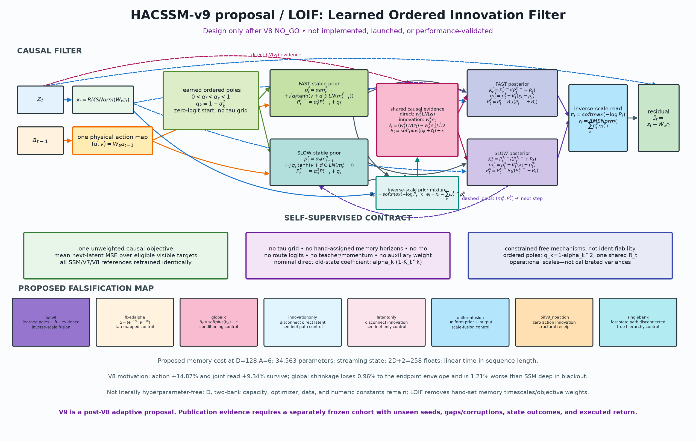
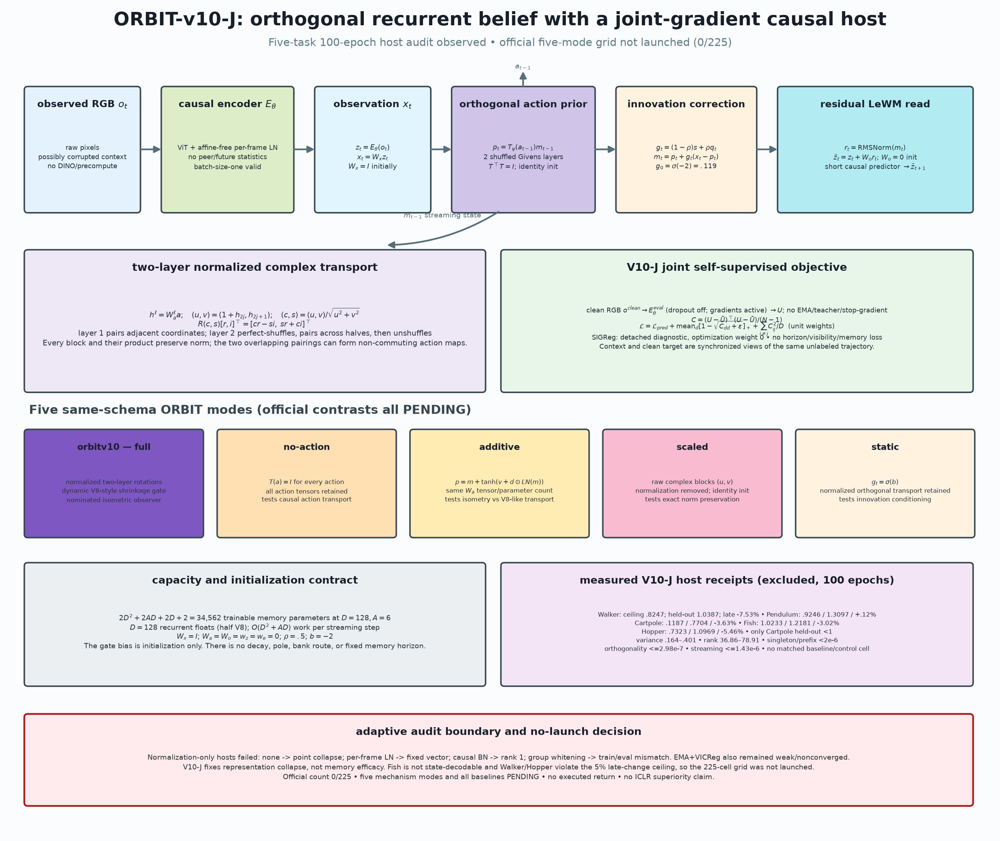
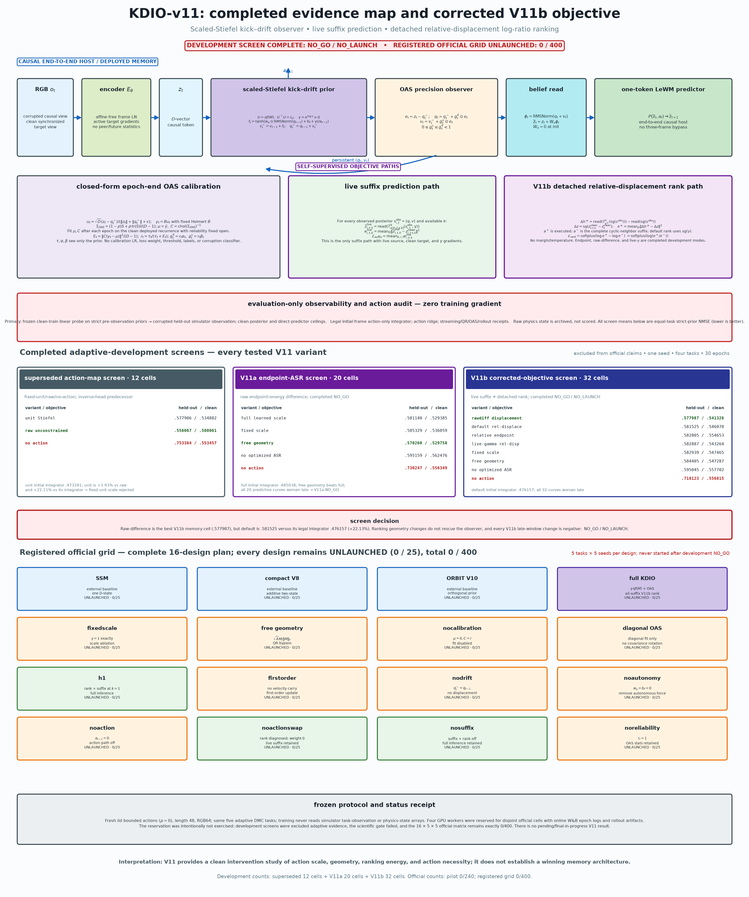
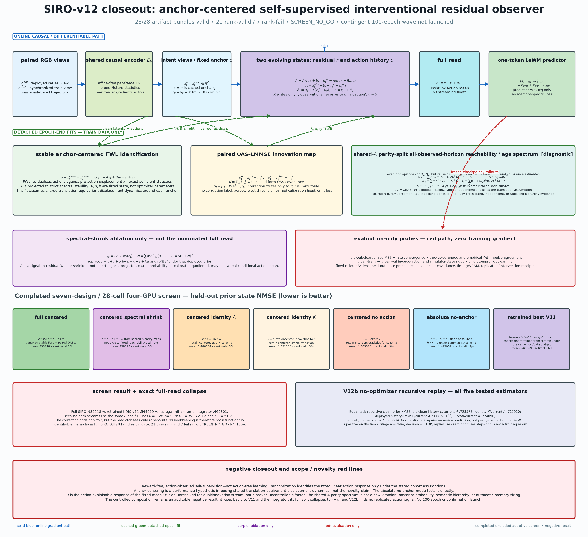
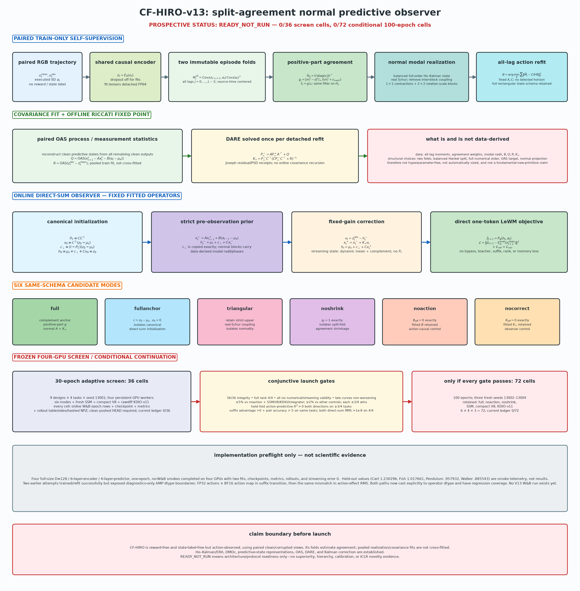
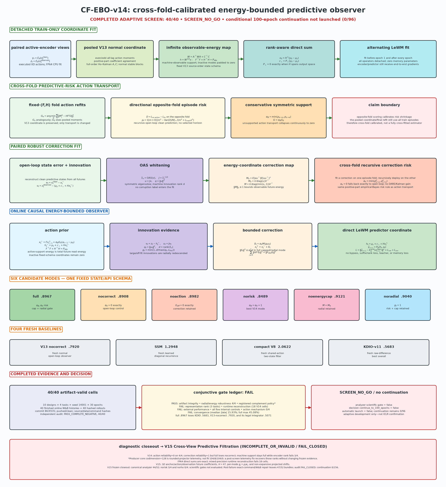
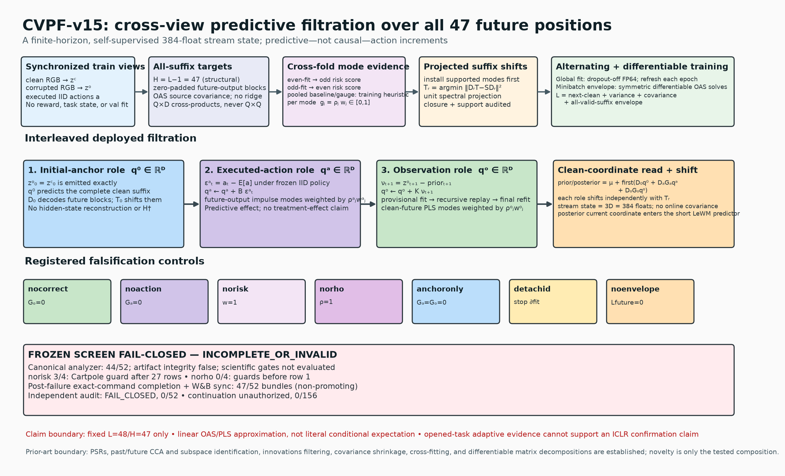

# Learnable memory for LeWorldModel: V1–V15 architecture and evidence record

*Design and experiment record. Branch: `learnable-memory`. V1–V11 live in `lewm/models/memory.py`; SIRO-v12, CF-HIRO-v13, CF-EBO-v14, and CVPF-v15 are isolated in `lewm/models/siro.py`, `lewm/models/cf_hiro.py`, `lewm/models/cf_ebo.py`, and `lewm/models/cvpf.py` and integrated through the common LeWM host. Status as of 2026-06-30: V1–V9 are complete with their recorded negative pilot/final labels; V10-J has no official launch; V11's excluded screen is negative and its official grid remains 0/240 pilot and 0/400 final; V12–V14 are complete `SCREEN_NO_GO` studies. CVPF-v15 is implemented with 49 passing core/integration/protocol tests and two excluded smokes. All 52 frozen seed-`15001` commands were attempted and exactly 52 W&B runs exist, but Cartpole `norisk` became nonfinite after 27 epoch rows and `norho` became nonfinite before a completed epoch on all four tasks. The write-once analyzer therefore closed at `44/52, INCOMPLETE_OR_INVALID`; the independent audit is `FAIL_CLOSED`, not `SCREEN_NO_GO`. Exact-command completion and three sync-only W&B repairs leave 47 finished 30-epoch W&B/rollout bundles plus five failed runs, but do not promote the frozen result. Full V15's available descriptive mean is `1.185242`; KDIO is `.556936`, V15-`nocorrect` is `.770936`, and the full checkpoint's legal integrator is `.480505`. Continuation remains unauthorized and unlaunched at 0/156 (§2.14/§7.17).***

## 1. Motivation — what our study tells us to do next

The companion paper (`docs/ICLR.md`) establishes two empirical facts that, together, point directly at this design:

1. **In the companion synthetic study, a fixed log-spaced bank of EMA horizons was the best memory tested** — it beat a learned GRU, a learned diagonal-SSM/RetNet-lite, and episodic retrieval on the long-gap tasks, *without any per-task tuning* (§5.11). Later common-target cohorts in this document do not preserve that global ranking (§7.2, §7.5–7.6). *Spanning* horizons nevertheless motivated the first design.
2. **A learnable scalar decay does not self-tune in this setup** — making the one global EMA rate `α` learnable leaves the horizon near its initialization regardless of the task gap (§5.4). This observation does not by itself diagnose whether gradient magnitude, parameterization, optimization, or another cause is responsible.

The naive reading is "memory should be fixed." But this repository's ungated fixed-bank baseline cannot allocate capacity or vary its bank mixture with the input, and it does not obviously scale (it reads the same spectrum of horizons at every step). Other fixed-decay architectures can still have content-dependent reads, as RetNet illustrates (§4). The research question is therefore:

> **How do we make short/long memory learnable and scalable without relying on the global learned scalar decay that failed in this setup?**

**Original hypothesis (SMT):** keep the decays **fixed** (the reliable prior) and move **all** learnability to *input-conditioned gating* — a learned **write gate** (what to store) and a learned **read router** (which horizon to use, per step). Learning *selection over* a fixed timescale basis should have a better-conditioned gradient than learning the decay itself.

**Empirical verdict.** SMT-v2 does not support the selection hypothesis: its gates are almost static and can be replaced by calibration means without hurting the saved models (§5). L0 routing finds either a dense model or a quality-destroying closed/static subset, and the strongest OC-SMT result uses all 28 banks (§9). SMT-v3 fixes the erasing write rule and learns a causally important black-sentinel gate (§7.5). HACSM-v4 then fixes action blindness: swapping only memory-path blackout actions raises first-post MSE by 12.46%, and V4 beats V3 by 12.49% across paired cells (§7.6). V5's learned channel spectrum and boundary auxiliary regress (§7.7); V6's dense consistency adds only .39% and loses to static correction (§7.8); V7's recovery objective adds only .30% and loses its shared-action/no-recovery controls (§7.9). V8 cleanly removes those special objectives and confirms durable action/joint-read mechanisms but not its compact/shared-action novelty (§7.10). V9's evidence and action paths are active, yet fixed poles and one bank beat its intended learned hierarchy (§7.11). V10–V14 then repair the host and observer mechanics without producing a competitive positive method (§7.12–§7.16). V15 finally shows three narrower facts: normalized mode strength and cross-fold weighting are necessary for numerical safety; gradients through the suffix identification envelope materially change representation learning; and the observation correction is active but harmful. Those facts do not rescue the method. The frozen screen is artifact-incomplete, all four `norho` cells fail numerically, full loses `nocorrect` 4/4, KDIO 4/4, and its legal integrator 4/4, representation rank fails on two tasks, the deployed action mechanism misses its gate, and convergence fails. V15 is therefore `INCOMPLETE_OR_INVALID / FAIL_CLOSED / NO_100E_LAUNCH`, not performance evidence or an ICLR-ready method (§7.17).

## 2. The architecture


*Figure 1. Consolidated architecture/evidence map through V15. V14 is a complete `SCREEN_NO_GO`; V15 is a different terminal condition: the canonical analyzer accepted 44/52 cells, independent audit failed closed, and post-failure non-promoting repair leaves 47/52 bundles. The dedicated CVPF architecture, controls, and failure receipts are in Figure 5k/§2.14/§7.17.*

### 2.1 SMT-v1/v2: gated-value write + input-conditioned read


*Figure 2. SMT-v1/v2 data flow. The latent `z_t` is gated by a learned **write gate** `i_t` and written into `K` **fixed** log-spaced EMA banks (`τ=2…64`); a learned **read router** `r_t` weights the banks; the weighted read-out is projected by learned `W_o` and added back residually. V1 uses a softmax router and V2 independent sigmoid read gates. Blue = learned (`W_i,W_r,W_o`); gray = fixed decays.*

Compact data flow:

```
                 ┌─ write gate  i_t = σ(W_i z_t) ─┐                    fixed banks
   z_t ──┬──────►│            (LEARNED)           │── i_t⊙z_t ──► [ τ=2 ][ τ=4 ]…[ τ=64 ]
         │       └───────────────────────────────┘                       │  │      │
         │                                                                ▼  ▼      ▼
         │        read router  r_t = g(W_r z_t)  (LEARNED) ───► weights r_{t,1..K}
         │                                                                │
         │                                          o_t = W_o( Σ_k r_{t,k} m^k_t )  (LEARNED)
         └──────────────────────────────── + ◄─────────────────────────────┘
                                            │
                                      z̃_t = z_t + o_t   ──►  predictor
```

Let `z_t ∈ R^D` be the encoder latent. SMT maintains `K` EMA banks at **fixed** log-spaced horizons `τ_1<…<τ_K` (default `τ ∈ {2,4,8,16,32,64}`), `a_k = 1 − e^{−1/τ_k}`:

```
write / input gate     i_t   = σ(W_i z_t)                       ∈ (0,1)^D     (what to store)
bank-k recurrence      m^k_t = (1 − a_k) m^k_{t−1} + a_k (i_t ⊙ z_t)         (a_k FIXED)
read router            r_t   = g(W_r z_t / T), g=softmax or sigmoid           (which horizon)
memory read-out        o_t   = W_o ( Σ_k r_{t,k} · m^k_t )
injected latent        z̃_t   = z_t + o_t
```

Only `W_i` (D×D), `W_r` (D×K), `W_o` (D×D), and the write/router biases (D+K) are learned — `2D² + DK + D + K` parameters (33,670 at D=128, K=6; about 1.5–1.6% of the original full-ViT synthetic model, not of every configuration). The decays `a_k` are buffers. Three design choices matter:

- **Fixed basis, learned selection.** The model never learns a timescale; it parameterizes *which* known timescales to read and *what* to write into them. This avoids relying on the global learned scalar `α` that stayed near initialization in §5.4 while keeping the spanning-horizons prior of §5.11.
- **Input-conditioned write gate** `i_t`. Mamba-style selectivity, but on *what to store* rather than *how fast to forget*: in principle the model can ignore distractors and write only decision-relevant content into the (fixed-horizon) banks. Section 5 shows that this behavior did not emerge in the saved models.
- **Small (not zero) read-out init.** The EMA/`multi` designs zero-init their read-outs to start exactly at the memoryless baseline. SMT cannot: the router and write gate sit *upstream* of the multiplicative read-out, so a zero read-out gives them *exactly zero gradient at step 0*. We instead use a small read-out init (≈5% deviation from baseline) so every learned part trains from the first step. *(Verified: with zero-init the router/gate gradients are 0; with small init they are non-zero.)*

### 2.2 SMT-v3-W: whole-update gating + global normalized read


*Figure 3. SMT-v3-W (“whole-update”) data flow. A learned scalar `g_t` changes the complete update rate of every EMA state with a fixed decay, so `g_t=0` freezes old state exactly. A learned but time-independent simplex `π` mixes the six banks, the read is RMS-normalized, and one shared `W_o` injects it residually. Actions enter only the short-context predictor; they do not propagate the recurrent state. The controls isolate conditioning, recurrence semantics, and known visibility; dynamic/static is the clean active-parameter match, while the hard-visibility control is only nominally parameter-matched.*

V3 is not merely a new router setting. It changes where selection acts:

```text
conditioned update gate  g_t = sigmoid(w_g^T [LayerNorm(z_t) + e] + b_g)       scalar
true bank update         m_t^k = (1-a_k g_t)m_{t-1}^k + a_k g_t z_t            a_k fixed
global horizon mixture   pi = softmax(r)                                        time-independent
normalized read          q_t = RMSNorm(sum_k pi_k m_t^k)
residual injection       z_tilde_t = z_t + W_o q_t
```

The architectural distinction is easiest to see side by side:

| version | write/update semantics | horizon read | memory parameters (`D=128,K=6`) | observed behavior |
|---|---|---|---:|---|
| **SMT-v1** | vector gate scales the new value; old state still decays | per-step softmax, total mass 1 | 33,670 | weak initial result; unit-mass amplitude confound |
| **SMT-v2** | same gated-value write | per-step independent sigmoids, initial mass ≈`K/2` | 33,670 | stronger usage, but learned read/write gates are nearly static |
| **SMT-v3-W** | scalar gate multiplies the whole EMA update; `g_t=0` is exact freeze | one global simplex + RMS-normalized read | 16,647 | gate is causal and dynamic, but specializes to the exact black sentinel and returns `NO_GO` |
| **HACSM-v4** | action prior advances three belief states, then a per-level gate corrects from the observation | one global simplex over `τ={2,8,32}` + RMS-normalized read | 34,566 | actions are causally necessary and V4 beats V3, but SSM wins 4/5 means and the fixed auxiliary fails |
| **HACSSM-v5** | action prior + correction use hard-monotone learned per-channel gains over two states | one global simplex over fast/medium states + RMS-normalized read | 34,820 | complete: action/joint read matter, but wide channel spectra and boundary shaping regress; full V5 loses to SSM |
| **HACSSM-v6** | exact V4-two fixed scalar `τ={2,8}` predict/correct recurrence; dense same-level consistency is training-only | one global simplex over fast/medium states + RMS-normalized read | 34,564 | complete: beats SSM, but the objective adds only .39% over no-aux and full V6 loses to static correction |
| **HACSSM-v7 / HCRD** | fixed `τ={2,8}`, level-specific action heads, learned static/dynamic gate shrinkage; EMA counterfactual recovery is training-only | one global simplex over fast/medium states + RMS-normalized read | 36,102 | complete: shrinkage, action, and joint read help, but the objective effect is .30%; shared action and no-recovery controls slightly outperform full V7 |
| **HACSSM-v8 / SAS-PC** | fixed `τ={2,8}`, one physical shared action head, per-level learned gate shrinkage; no internal auxiliary or teacher | one global simplex over fast/medium states + RMS-normalized read | 34,566 | complete: second by paired average, strong action/joint-read effects, but locked `NO_GO`; compaction/tying/shrinkage-envelope claims fail |
| **HACSSM-v9 / LOIF** | learned ordered stable poles + evidence-conditioned observation gains; no horizon auxiliary | inverse-scale fusion of two posterior states | 34,563 | complete: +2.55% vs SSM, rank 7/13, locked `NO_GO`; learned poles and two-bank hierarchy lose to fixed/single controls |
| **ORBIT-v10-J** | one no-decay belief; two exact action-conditioned shuffled Givens layers; V8-style innovation shrinkage; affine-free per-frame LN host with joint prediction/VICReg gradients | RMS-normalized one-state residual read | 34,562 at `D=128,A=6` | **adaptive audit only**: five 100-epoch full-ORBIT cells are noncollapsed but fail state-quality/convergence screening; official controls remain 0/225 and `PENDING` |
| **KDIO-v11** | learned positive action scale × canonical thin-Stiefel direction; reversible kick–drift; reliability-open clean OAS; ordered corrections; live suffix prediction + detached displacement ranking | `RMSNorm(q+v)` through a zero-initialized residual projection | 17,796 nominal optimizer scalars + 8,255 fitted OAS scalars = 26,051 at `D=128,A=6`; `2D` stream state | **`SCREEN_NO_GO / OFFICIAL_NO_LAUNCH`**: V11b completed 32/32 excluded cells, but the nominated `.581525` trails its `.476157` legal integrator and every curve worsens late; official ledger 0/240 pilot, 0/400 final |
| **SIRO-v12** | conserved episode anchor + separately identified autonomous residual/action response; stable FP64 FWL dynamics; paired-view OAS-LMMSE correction; all-lag reachability/age audit; no memory-specific objective | the fitted posterior `c+r+Ru` is the predictor input directly; no observation bypass or learned memory readout | 0 gradient-trained memory scalars; 50,304 common fitted scalars and `3D=384` stream state at `D=128,A=6` | **`SCREEN_NO_GO / NO_100E_LAUNCH`**: all 28 adaptive cells and W&B/rollout bundles completed, but full SIRO `.935218` loses to retrained KDIO `.564069` and the legal integrator `.469803`; 7 rank failures and exact `r+u` collapse reject the claimed separation |
| **CF-HIRO-v13** | all-lag split-fold action moments; positive-part agreement shrink; full-order Ho–Kalman realization; real-normal contraction blocks; all-lag `B` refit; paired OAS + offline DARE | direct-sum read `mu_z+c_perp+Cx`; fixed-gain posterior enters the one-token predictor directly | 0 gradient-trained memory scalars; task-dependent full rectangular state `n=min(23D,24A)` at `L=48`, plus `D` complement floats; no online covariance | **`SCREEN_NO_GO / NO_100E_LAUNCH`**: all 36 screen cells and W&B/rollout bundles validate, but full `3.965301` loses `nocorrect` `.816999`, KDIO `.564411`, and the legal integrator `.502502`; continuation 0/72 |
| **CF-EBO-v14** | pooled V13 real-normal coordinate; observable-energy support selected only at the dtype/shape-derived machine cutoff and exact-zero padded in the fixed schema; cross-fold positive-part empirical-Bayes action/correction reliability; OAS innovation whitening; unit spectral correction cap and radial gate | rank-aware direct sum `mu_z+c_perp+Hx`; corrected posterior is the predictor coordinate with no observation bypass or learned read head | 0 gradient-trained memory scalars; fixed serialized schema `n=min(23D,24A)` plus `D` complement floats, machine-active support rank `r≤n`; no online covariance | **`SCREEN_NO_GO / NO_100E_LAUNCH`**: 40/40 W&B/rollout cells validate, but full `.896667` loses `norisk` `.848872`, V13-`nocorrect` `.791981`, KDIO `.568321`, and its legal integrator `.507053`; continuation 0/96 |
| **CVPF-v15** | fixed-schema anchor/action/observation future-output roles; all 47 future positions; OAS/PLS source modes; per-mode cross-fold-calibrated `g_j=rho_j w_j`; two-stage deployed-history observation refit; non-expansive projected suffix shifts; differentiable minibatch filtration envelope | posterior current clean-coordinate enters the short LeWM predictor directly; no reconstructed hidden state, dense complement projector, or hidden-state pseudoinverse | 0 gradient-trained memory scalars; `3D=384` streaming floats, no online covariance; fitted-and-installed `H×D×D` decoders and `D×D` shifts | **`INCOMPLETE_OR_INVALID / FAIL_CLOSED / NO_100E_LAUNCH`**: all 52 commands attempted; canonical 44/52 and current 47/52 bundles; `norho` fails 4/4, `norisk` 3/4; no official performance aggregate; continuation 0/156 |

V3's simplification is deliberate: it removes content-dependent horizon routing so its experiment asks one clean question—**does input-conditioned update timing help beyond an equally parameterized static gate?** HACSM-v4 retains the global read but adds action prediction, a three-level hierarchy, and self-supervision. Sections 7.5–7.6 give the matched controls and results.

### 2.3 HACSM-v4: hierarchical action predict/correct memory


*Figure 4. HACSM-v4 replaces V3's action-blind EMA with three full-width belief states at fixed structural horizons `τ={2,8,32}`. The previous action first predicts each state forward; a learned reliability gate then controls the observation correction. Training-only action rollouts supervise the fast, medium, and slow states at horizons `{1,2}`, `{4,8}`, and `{16}` without consuming intervening observations or hidden clean blackout targets.*

For level `k`, let `β_k=1-exp(-1/τ_k)`, `x_t=W_x z_t`, and split the shared action projection as `(d_{t-1},v_{t-1})=W_a a_{t-1}`. The strictly causal update is

```text
action prior       p_t^k = m_{t-1}^k + β_k tanh(v_{t-1} + d_{t-1} ⊙ LayerNorm(m_{t-1}^k))
correction gate    g_t^k = sigmoid((w_z^T LN(z_t) + w_e^T LN(x_t-p_t^k))/sqrt(D) + b_k)
posterior          m_t^k = p_t^k + β_k g_t^k (x_t-p_t^k)
global read        q_t   = RMSNorm(sum_k softmax(r)_k m_t^k)
residual input     z_tilde_t = z_t + W_o q_t
```

The timing convention is explicit: `a_t` maps `z_t → z_{t+1}`. When a correction closes, the action prior still evolves the belief through missing observations—the capability V3 lacks. The global route intentionally remains time-independent, so any dynamic mechanism claim belongs to action evolution or correction timing rather than a confounded per-token horizon router.

The hierarchical self-supervised target is an observation-free rollout from the online posterior:

```text
r^k_{t,0}   = m^k_t
r^k_{t,j+1} = T_k(r^k_{t,j}, a_{t+j})
target      = stopgrad(z_clean_{t+h})
```

Fast uses `h={1,2}`, medium `h={4,8}`, and slow `h=16`. For each horizon, the loss is `0.5*mean(all valid endpoints)+0.5*mean(first-post endpoints)`; the three level losses are averaged and enter the total objective with the prospectively fixed weight `0.1`. Endpoint validity alone controls inclusion, so a source may lie inside the blackout while no hidden target at `t=10…15` is ever used. At `L=32` with blackout `[10,16)`, the eligible endpoint counts per episode are respectively `25,24,22,18,16`, and every first-post target is exactly time 16 with source times `15,14,12,8,0`.

At `D=128,A=6,K=3`, HACSM-v4 has `2D²+2AD+2D+2K = 34,566` memory parameters, versus 33,024 for the diagonal SSM (+4.67%). It carries three recurrent `D`-states rather than one, but does not add prediction heads: states live directly in the shared target coordinates. `W_x=I`, `W_a=0`, `W_o=0`, `b_k=2`, and a uniform route make the fused predictor exactly memoryless at initialization while the auxiliary objective immediately supplies gradients to the action dynamics.

The matched controls retain the same nominal parameters: `hacsmv4_static` removes input conditioning from correction gates, `hacsmv4_noaction` zeros only the recurrent action path, `hacsmv4_noaux` sets the auxiliary weight to zero, and `hacsmv4_single` fixes the read to the middle `τ=8` state. Full experiment protocol and results are in §7.6.

### 2.4 HACSSM-v5: learned-rate two-level action hierarchy


*Figure 5. Prospective HACSSM-v5 architecture. V5 retains V4's causally useful action predict/correct path, removes the slow `τ=32` level, and replaces the two remaining scalar rates with hard-monotone learned per-channel gains initialized from fast and medium SSM-like spectra. Training-only action rollouts shape the already-weighted first-visible boundary early in optimization and decay to exactly zero; this is boundary shaping, not evidence of general hierarchical self-supervision.*

For every channel, V5 parameterizes medium gain and the non-negative fast/medium gap as

```text
beta_medium = sigmoid(theta_medium)
beta_fast   = beta_medium + (1-beta_medium) sigmoid(theta_gap)
```

Thus `0<β_medium≤β_fast<1` throughout training. Fast gains initialize from log-spaced `τ=1.5…8`, medium gains from `τ=8…64`, using `β=1-exp(-1/τ)`. These bands are **initialization priors only**, not post-training bounds. Because the actual observation rate is `β⊙g`, `τ(β)` is a gain diagnostic rather than an identifiable effective memory horizon.

With `(d_{t-1},v_{t-1})=W_a a_{t-1}` and `x_t=W_xz_t`, both action advance and observation correction use the same channel gain:

```text
action prior       p_t^k = m_{t-1}^k + β_k ⊙ tanh(v_{t-1}+d_{t-1}⊙LN(m_{t-1}^k))
correction gate    g_t^k = sigmoid((w_z^T LN(z_t)+w_e^T LN(x_t-p_t^k))/sqrt(D)+b_k)
posterior          m_t^k = p_t^k + β_k ⊙ g_t^k (x_t-p_t^k),       k∈{fast,medium}
global read        q_t   = RMSNorm(softmax(r)_f m_t^f + softmax(r)_m m_t^m)
residual input     z_tilde_t = z_t + W_o q_t
```

Initialization is again exactly memoryless at the predictor: `W_x=I`, `W_a=W_o=0`, `b_f=b_m=2`, and the route is uniform. At `D=128,A=6`, V5 has `2D²+2AD+4D+4=34,820` memory parameters: +0.73% versus V4 and +5.44% versus SSM. Its recurrent state is `2D`, versus V4's `3D` and SSM's `D`; parameter proximity is therefore not state matching.

The auxiliary uses four action-only rollouts whose endpoints are the canonical first visible target at time 16: fast sources `t={15,14}` at horizons `{1,2}`, and medium sources `t={12,8}` at `{4,8}`. Hidden targets remain excluded and endpoints are stop-gradient. Its locked schedule is `.05` for epochs 1–20, cosine decay over epochs 21–120 to exactly zero, then zero for epochs 121–200. The auxiliary duplicates a target already emphasized by the `.5` primary first-post weight, so a gain by full V5 alone is an objective/system gain; the inference architecture is stronger only if `hacssmv5_noaux` also beats SSM.

The parameter-matched V5 controls are `static`, `noaction`, `fixedbeta_noaux`, `noaux`, `single` (medium read only), and `ssmcontrol` (`g=1`, no action, same learned two-state rate spectrum). `hacsmv4_two_noaux` provides the sequential bridge with two fixed scalar levels `τ={2,8}`. Section 7.7 freezes the complete 12-design all-environment ladder before launch.

### 2.5 HACSSM-v6: dense hierarchical action consistency on the fixed-rate anchor


*Figure 5b. Frozen prelaunch HACSSM-v6 architecture and complete variant map. Online inference is exactly the strongest V1–V5 development-grid design: two fixed scalar levels `τ={2,8}`, causal action predict/correct updates, and a joint global read. V6 changes the training signal, not the default inference transition. Dense action-only rollouts match same-level online posterior states at originally visible endpoints; source and target are stop-gradient by default, the loss is scale-normalized, and hidden clean blackout targets never enter the objective. The completed result and mechanism audit are in §7.8.*

V5 supplies two unusually direct constraints on the next design. Replacing action transport or the joint fast/medium read loses about 11% in every paired cell, so V6 keeps both. Conversely, even frozen V5 channel spectra lose 7.30% to two fixed scalar rates, and V5's boundary-only auxiliary hurts all five environment means, so V6 restores the exact `hacsmv4_two_noaux` inference equations with `β_k=1-exp(-1/τ_k)` and `τ_f=2,τ_m=8`:

```text
action prior       p_t^k = m_{t-1}^k + β_k tanh(v_{t-1}+d_{t-1}⊙LN(m_{t-1}^k))
correction gate    g_t^k = sigmoid((w_z^T LN(z_t)+w_e^T LN(x_t-p_t^k))/sqrt(D)+b_k)
posterior          m_t^k = p_t^k + β_k g_t^k (x_t-p_t^k),      k∈{fast,medium}
global read        q_t   = RMSNorm(softmax(r)_f m_t^f + softmax(r)_m m_t^m)
residual input     z_tilde_t = z_t + W_o q_t
```

The training-only objective uses the online posterior itself as a causal self-distillation target. For every level/horizon pair and every endpoint `t+h` whose **original** `target_valid_mask` is true,

```text
source             r^k_{t,0}   = stopgrad(m^k_t)
action rollout     r^k_{t,j+1} = T_k(r^k_{t,j}, a_{t+j})
target             y^k_{t,h}   = stopgrad(m^k_{t+h})
consistency        L_{k,h}     = SmoothL1(LayerNorm(r^k_{t,h}), LayerNorm(y^k_{t,h}))
hierarchy          fast: h={1,2}; medium: h={4,8}
```

The rollout receives actions only: neither endpoint observations nor intervening observations are consumed. A source may precede an originally visible endpoint across a masked interval, but a hidden clean blackout state is never an endpoint target. Layer normalization removes state scale as a shortcut. Detaching both online source and target while keeping fixed `β_k` means the default auxiliary gradient updates only the shared action map `W_a`; it cannot directly pull the correction/read states away from the primary objective. The locked bootstrap weight is `.02` for epochs 1–40, cosine-decays to exactly zero at epoch 100, and remains zero for epochs 101–200.

Every V6 variant is parameter-matched at `D=128,A=6` (34,564 memory parameters and `2D` recurrent floats); auxiliary-only variants are exactly inference-identical when their parameters are equal:

| design | exact change from full V6 |
|---|---|
| `hacssmv6` | detached source and target; fast horizons `{1,2}`, medium `{4,8}` |
| `hacssmv6_noaux` | identical inference and computed diagnostics; effective auxiliary weight forced to zero |
| `hacssmv6_aux_noaction` | actions are zeroed only inside auxiliary rollouts; online inference is unchanged |
| `hacssmv6_uniform` | both levels receive every horizon `{1,2,4,8}`, testing whether the hierarchy assignment matters |
| `hacssmv6_sourcegrad` | source posterior is not detached; target remains stop-gradient |
| `hacssmv6_fastonly` | auxiliary supervises only the fast level at `{1,2}` |
| `hacssmv6_mediumonly` | auxiliary supervises only the medium level at `{4,8}` |
| `hacssmv6_noaction` | action features are zeroed in both inference and auxiliary rollouts |
| `hacssmv6_static` | the correction gate is input-independent; auxiliary definition is unchanged |
| `hacssmv6_single` | inference read is fixed to medium only; both states and both-level auxiliary remain instantiated |

This is self-supervised in the narrow, auditable sense that targets come from the model's own causal online posterior and require no labels, simulator state, or hidden clean observations. It is not evidence for general semantic hierarchy: V6's dense objective adds only .39% over no-aux and V7's visible-only recovery objective adds only .30%, while both reuse the same exact black-sentinel development regime. Untouched corruptions and task-level outcomes remain necessary for a stronger claim.

### 2.6 HACSSM-v7 / HCRD: hierarchical counterfactual recovery distillation


*Figure 5c. Frozen-before-launch HACSSM-v7 architecture and complete variant map for the completed 325-cell study. V7 keeps the fixed `τ={2,8}` two-state hierarchy and joint read, gives each level its own action head, and learns a per-level convex shrinkage between V6's exact static and dynamic correction experts. Its training-only EMA teacher sees only the original occluded trajectory. The student synthesizes black spans wholly inside originally visible runs and matches both the bridge state and the posterior after one restored visible frame. Every tested V7 variant is shown; the locked negative result is reported in §7.9.*

V6 supplies a specific failure diagnosis rather than a license for an unconstrained redesign. Actions and the two-level read are essential, but the action-only posterior target is mismatched: full V6 gains only .39% over its inference-identical no-auxiliary anchor, and using real actions makes the held-out consistency objective worse than zero actions. Static correction is the strongest V1–V6 development-grid design, while dynamic correction remains better on two task means. V7 therefore preserves the fixed rates and read, separates the fast/medium action maps, and makes the static-versus-dynamic choice a learned **shrinkage** rather than a single global architectural decision.

For level `k∈{fast,medium}`, the online student uses

```text
level action       (d^k_{t-1},v^k_{t-1}) = W_a^k a_{t-1}
action prior       p_t^k = m_{t-1}^k + β_k tanh(v^k_{t-1}+d^k_{t-1}⊙LN(m_{t-1}^k))
static expert      s_k = sigmoid(b_k)
dynamic expert     d_t^k = sigmoid(b_k + (w_z^T LN(z_t)+w_e^T LN(x_t-p_t^k))/sqrt(D))
shrinkage          ρ_k = sigmoid(c_k)
correction gate    g_t^k = (1-ρ_k)s_k + ρ_k d_t^k
posterior          m_t^k = p_t^k + β_k g_t^k (x_t-p_t^k)
```

The two scalar `ρ_k` values initialize at `.5`. Thus `ρ_k→0` exactly recovers static correction and `ρ_k→1` recovers the dynamic V6 gate, while intermediate values regularize the input-conditioned innovation toward the stable expert. The `noshrink` control fixes both values to one. Level-specific `W_a^k` heads allow fast and medium dynamics to specialize; the `sharedaction` control averages their projected features before either transition. The rates remain fixed at `β_k=1-exp(-1/τ_k)` for `τ={2,8}`, and the read remains the joint global simplex used by V4-two and V6.

The training-only objective creates deterministic counterfactual gaps without touching a hidden clean target. Let `M_t` be the original target-valid mask. For **every** source/horizon window `[t,t+h+1]` with `M_{t:t+h+2}=True`, the student starts from `stopgrad(m_t)`, applies the observed actions, replaces the next `h` visible latents by the canonical black latent already present in the corrupted input, and then consumes the actual visible latent at `t+h+1`. A momentum-`.99` EMA copy of the memory module processes only the original occluded input and supplies stop-gradient same-level posterior targets:

```text
student source     r_0 = stopgrad(m_t)
counterfactual     r_j = Correct(T(r_{j-1},a_{t+j-1}), z_black),     j=1...h
bridge loss        L_bridge = SmoothL1(LN(r_h^k), LN(stopgrad(m^k_teacher,t+h)))
visible recovery   u = Correct(T(r_h,a_{t+h}), z_{t+h+1})
recovery loss      L_recovery = SmoothL1(LN(u^k), LN(stopgrad(m^k_teacher,t+h+1)))
hierarchy          fast: h={1,2}; medium: h={4,8}
```

Eligibility is computed from the **original** mask before synthetic corruption, so these windows have zero overlap with the real blackout. The black latent is the mean of the actually observed corrupted blackout inputs, not a clean frame. The teacher never receives the counterfactual student sequence, is frozen with respect to backpropagation, and never enters online inference. `W_x` outputs are detached inside the auxiliary, so its gradients are restricted to the action, correction-gate, and shrinkage parameters; `W_x`, `W_o`, and the route remain primary-objective only. The weight reuses V6's locked `.02` schedule through epoch 40, cosine decay to zero at epoch 100, and zero thereafter. This is self-supervised occlusion/recovery distillation, but it remains a synthetic missingness objective rather than evidence of semantic hierarchy or control performance.

All nine V7 modes instantiate the same student tensors and have 36,102 trainable memory parameters at `D=128,A=6`; the frozen EMA teacher is checkpointed but excluded from that count and from inference:

| design | exact change from full V7 |
|---|---|
| `hacssmv7` | level-specific action heads, learned static/dynamic shrinkage, hierarchical bridge and restored-frame recovery |
| `hacssmv7_noaux` | identical online inference and computed diagnostics; effective auxiliary weight forced to zero |
| `hacssmv7_sharedaction` | average the two projected action heads before applying either level transition |
| `hacssmv7_noshrink` | fix `ρ_f=ρ_m=1`, recovering dynamic-only correction |
| `hacssmv7_actiononly` | replace counterfactual correction/recovery with the V6-style action-only bridge target |
| `hacssmv7_uniform` | assign every horizon `{1,2,4,8}` to both levels |
| `hacssmv7_norecovery` | retain the counterfactual bridge loss but remove the restored-frame recovery term |
| `hacssmv7_noaction` | zero recurrent action features in online inference and the auxiliary |
| `hacssmv7_single` | fix the inference read to medium only while retaining both states and both-level objectives |

The frozen comparison ladder uses four anchors—SSM, V4-two/no-aux, full V6, and static V6—plus these nine V7 designs, for `5 environments × 13 designs × 5 seeds = 325` required cells. All 325 cells completed with 200 online W&B epoch records and a fixed evaluation-rollout table, paired video, and hashed artifact. The architecture and protocol were frozen before launch; the verified result and receipts are in §7.9.

### 2.7 HACSSM-v8 / SAS-PC: compact shared-action shrinkage


*Figure 5d. Frozen prelaunch SAS-PC architecture and complete seven-mode V8 map. V8 keeps V7's fixed `τ={2,8}`, per-level correction shrinkage, and joint read, but replaces the two projected action heads by one physical shared tensor and removes the EMA teacher, posterior matching, and counterfactual recovery objective. Ordinary next-latent prediction remains self-supervised. The expanded controls distinguish action tying from parameter compaction; no V8 result is implied by the diagram.*

V7 gives unusually direct design constraints. Removing actions or the joint read loses 14.93% and 9.39%, and learned shrinkage beats forced-dynamic correction by 1.10%; those mechanisms stay. In contrast, level-specific heads lose to their shared-action control, the special objective adds only .30% over no-aux, and removing recovery is slightly better. V8 is therefore a simplification, not another objective bundle.

For both levels `k∈{fast,medium}`, with fixed `β_k=1-exp(-1/τ_k)` and one shared action projection,

```text
shared action      (d_{t-1},v_{t-1}) = W_a a_{t-1}
action prior       p_t^k = m_{t-1}^k + β_k tanh(v_{t-1}+d_{t-1}⊙LN(m_{t-1}^k))
observation        x_t = W_x z_t
static expert      s_k = sigmoid(b_k)
dynamic expert     q_t^k = sigmoid(b_k+(w_z^T LN(z_t)+w_e^T LN(x_t-p_t^k))/sqrt(D))
shrinkage          ρ_k = sigmoid(c_k)
correction gate    g_t^k = (1-ρ_k)s_k + ρ_k q_t^k
posterior          m_t^k = p_t^k + β_k g_t^k(x_t-p_t^k)
joint read         r_t = RMSNorm(π_f m_t^f + π_m m_t^m),  π=softmax(route)
residual           z_tilde_t = z_t + W_o r_t
```

V8 trains only with the existing prediction and SIGReg losses. It has no private clean-target API, memory teacher, synthetic window, or hierarchical weight; both configured and effective auxiliary weights are exactly zero. Initialization remains `W_x=I`, `W_o=W_a=0`, `b_f=b_m=2`, `c_f=c_m=0` (`ρ=.5`), and a uniform route. The post-open V7 means `ρ=(.614,.546)` are not baked into initialization.

The compact modes have `2D²+2AD+2D+3K=34,566` trainable memory parameters at `D=128,A=6,K=2`, versus V7's 36,102, and retain `2D` recurrent floats. `levelaction` and `redundant` intentionally retain 36,102 parameters:

| design | exact V8 change / role |
|---|---|
| `hacssmv8` | nominated compact shared head, learned shrinkage, joint read |
| `hacssmv8_dynamic` | compact retrained endpoint with `ρ_f=ρ_m=1` |
| `hacssmv8_static` | compact retrained endpoint with `ρ_f=ρ_m=0` |
| `hacssmv8_levelaction` | separate fast/medium heads; primary action-tying reference |
| `hacssmv8_redundant` | two equal averaged heads; physical-compaction equivalence reference |
| `hacssmv8_noaction` | zero shared action contribution |
| `hacssmv8_single` | medium-only read while both states remain instantiated |

The clean attribution chain is `redundant↔levelaction` for action tying, compact↔redundant for physical compaction, compact↔retrained `ρ={0,1}` for shrinkage, and compact↔no-action/single for structural use. Compact↔level-action is only a bundle contrast because tensor count also changes. V8 checkpoints train from scratch and intentionally contain no V7 teacher keys.

### 2.8 HACSSM-v9 / LOIF: learned ordered innovation filter


*Figure 5e. Completed post-V8 architecture and falsification map. LOIF retains one shared action transition and a joint two-state read, but replaces fixed `τ={2,8}`, global shrinkage coefficients, and route logits by learned ordered stable poles, one causal evidence scale, Kalman-inspired gains, and inverse-scale fusion. Every card reports the five-seed paired effect of full LOIF relative to that control: positive favors full LOIF. Section 7.11 records the frozen contract, all 325 cells, and the locked negative result.*

V8's failure is not simply “too few parameters.” It is already second by paired reduction and converged cleanly, while the expanded redundant control does not improve reliably. The problem is that one global static/dynamic compromise is wrong for different tasks and phases: static correction wins Ball-in-Cup/Cheetah and deep-blackout phases, dynamic correction wins Finger and other phases, and compact V8 loses .96% to the per-cell endpoint envelope. The frozen V9 hypothesis was therefore to adapt **evidence trust and the direct old-state coefficient**, not add another fixed auxiliary.

Three candidate ideas were considered:

| idea | attraction | reason not selected |
|---|---|---|
| ordered selective-`Δ` V8 | smallest edit: learn input-dependent rates | rate, correction gate, and shrinkage remain mutually non-identifiable; it risks repeating V3/V5 gate/rate behavior |
| **LOIF-v9** | stable learned poles plus an explicit causal positive-scale recursion; observation trust and read weights follow from one quantity | selected; directly targets V8's phase-dependent endpoint failure with no horizon loss |
| continuous-query JEPA | train one action rollout at arbitrary future time | requires a chosen horizon/query distribution and recreates the internal-target mismatch that failed in V6/V7 |

LOIF parameterizes retention rather than fixing it after initialization. To isolate learning in the `fixedalpha` contrast, every mode starts from the same `τ`-mapped retentions `α=(exp(-1/2),exp(-1/8))`; the nominated mode then learns both ordered logits while `fixedalpha` disconnects them. This is an explicit fixed **initialization prior**, not a claim of initialization-free learning. `W_x` starts as identity; `W_a,W_o,w_z,w_e,b_R` start at zero. These rules are frozen and not swept. With numerical `ε` only,

```text
ordered retention      α_f = (1-ε) sigmoid(u_f)
                       α_s = α_f + (1-ε-α_f) sigmoid(u_Δ)      so 0 < α_f < α_s < 1
coupled process scale  q_k = (1-α_k)(1+α_k)
shared action          (d,v) = W_a a_{t-1}
action innovation      h_t^k = tanh(v + d ⊙ LN(m_{t-1}^k))
stable prior           p_t^k = α_k m_{t-1}^k + sqrt(q_k) h_t^k
state-error scale      P_t^{k,-} = α_k² P_{t-1}^k + q_k
```

The state starts from `m_0^k=x_0` and `P_0^k=1`. The latter is the fixed point of the **nominal prior-scale recursion** when no posterior correction occurs; it is not a claim that the nonlinear neural state has calibrated unit variance. One shared observation-resistance scale is inferred causally from the current latent and the inverse-scale prior mixture:

```text
observation            x_t = RMSNorm(W_x z_t)                 (affine-free normalization)
prior mixture          ω_t^- = softmax_k(-log P_t^{k,-}),   pbar_t = Σ_k ω_t^{k,-} p_t^k
evidence score         ℓ_t = (w_zᵀ LN(z_t) + w_eᵀ (x_t-pbar_t)) / sqrt(D)
resistance scale       R_t = softplus(b_R+ℓ_t) + ε
gain                   K_t^k = P_t^{k,-} / (P_t^{k,-}+R_t)
posterior              m_t^k = p_t^k + K_t^k (x_t-p_t^k)
stable scale update    log P_t^k = log P_t^{k,-} + log R_t
                                   - logaddexp(log P_t^{k,-},log R_t)
inverse-scale read     π_t = softmax_k(-log P_t^k)
                       r_t = RMSNorm(Σ_k π_t^k m_t^k),   ztilde_t = z_t + W_o r_t
```

The direct linear coefficient from the old state is nominally `α_k(1-K_t^k)`; it is not the full effective retention because the nonlinear action term, evidence score, and gain also depend on the previous state. Pole ordering removes level permutation; tying `q_k` to `α_k` removes one free process-scale parameter; affine-free normalized filter coordinates anchor the vector scale; a single `R_t` prevents each level from silently rebuilding an arbitrary gate; and inverse-scale fusion removes independent route logits. These constraints reduce redundancy but do **not** make the model identifiable: `α`, `W_a`, the latent maps, and the shared scale can still compensate, while the two banks' errors are correlated. Pole collapse or boundary saturation counts as a negative result—no diversity penalty should force the desired answer.

The nominated **effective trainable** objective is one unweighted causal next-latent MSE averaged over the eligible visible targets of each episode (`first_post_loss_weight=0` in the legacy configuration). The shared loss still logs the existing `.1×SIGReg` term, but with fixed precomputed features and an identity/frozen encoder it is constant and has zero gradient to every trained model parameter. Every SSM/V7/V8 reference in the V9 grid is retrained under that same effective objective; sealed historical checkpoints are evidence and provenance anchors, not objective-mismatched competitors. LOIF itself has no memory teacher, target horizon set, counterfactual window, hidden-clean target, teacher momentum, auxiliary schedule, or memory-loss coefficient. The retrained V7 shared-action reference necessarily retains its architecture's EMA teacher and `hier_*` diagnostic receipts, but its configured and effective hierarchical weight is exactly zero throughout, so no teacher-derived target contributes a loss or gradient. Under MSE, `P/R` are operational positive scales—not calibrated posterior variances or probabilities—and “Kalman-inspired” describes the algebra only. A likelihood-calibrated model would be a different, separately frozen study and is outside the V9 grid.

This is not literally “hyperparameter-free”: `D`, the two-bank ceiling, one-step prediction, optimizer, data, sequence/gap distribution, numerical `ε`, and the matched `τ`-mapped initialization remain design choices. The narrower and testable claim is that V9 has **no fixed retention after initialization and no memory-specific objective weight**. At `D=128,A=6`, with affine-free LN/RMSNorm, the memory has `2D²+2AD+2D+3=34,563` trainable parameters—three fewer than compact V8—and streaming state `2D+2=258` floats. It remains sequential linear-time in sequence length. Tracking `log P` and using `logaddexp`/softmax avoids explicit inverse-`P` operations; `q=(1-α)(1+α)` avoids cancellation near one.

### 2.9 ORBIT-v10-J: orthogonal recurrent belief with a joint-gradient causal host


*Figure 5f. Final implemented ORBIT-v10-J architecture and complete five-mode map. One persistent `D`-state is transported by two exact action-conditioned shuffled Givens layers, corrected by the current encoder innovation, normalized, and injected residually into the short-context LeWM predictor. The causal raw-RGB host uses affine-free per-frame LayerNorm and a deterministic dropout-off clean pass with active target gradients. Prediction, VICReg variance, and covariance terms have equal unit weight; SIGReg is diagnostic only. The five-task 100-epoch host audit is observed, but the five-mode mechanism grid remains 0/225 and its contrasts remain `PENDING`.*

V10 is constrained by the completed evidence rather than by another search on the same five tasks. V8 repeatedly finds that actions and recurrent-state access matter, but its decayed two-state model is 1.21% worse than SSM in deep blackout. V9 then finds that a single bank beats two banks by 2.22%, fixed poles beat learned poles, and its contracting prior is a plausible cause of the Ball-in-Cup failure. ORBIT therefore makes three deliberate changes together: **one state, no decay, and an exactly norm-preserving action transition**. It does not reuse the opened V8/V9 task grid for selection.

Let `D` be positive and even. V10 maps the observed frame to `z_t=E_θ(o_t)` and `x_t=W_xz_t`. Its shared action tensor has shape `A→2D`; it is viewed as two layers of `D/2` complex/Givens pairs. For pair `j` in layer `ℓ`,

```text
action pair       (δu_t^{ℓ,j}, δv_t^{ℓ,j}) = reshape(W_a a_{t-1})
identity offset   u_t^{ℓ,j} = 1 + δu_t^{ℓ,j},       v_t^{ℓ,j} = δv_t^{ℓ,j}
unit components   (c_t^{ℓ,j},s_t^{ℓ,j}) = (u,v) / sqrt(u²+v²)
Givens block      [r'; i'] = [ c  -s ; s  c ] [r; i]
```

An exactly zero pair is assigned `(c,s)=(1,0)` rather than a zero matrix. Layer 1 rotates adjacent coordinates. Layer 2 applies the fixed perfect shuffle `[0,D/2,1,D/2+1,…]`, rotates the resulting adjacent pairs, and applies the inverse shuffle. Each block is orthogonal; their product `T_ψ(a)` is therefore orthogonal and norm preserving. Because the two pairings overlap, products for different actions need not commute. `W_a=0` gives identity transport for every action at initialization, and a numerically zero action remains identity because the projection is bias-free:

```text
action prior      p_t = T_ψ(a_{t-1}) m_{t-1},       T_ψ(a)^T T_ψ(a) = I
```

The current observation corrects this prior using the single-state analogue of V8's learned static/dynamic shrinkage:

```text
static expert     s = sigmoid(b)
dynamic expert    q_t = sigmoid(b + (w_z^T LN(z_t) + w_e^T LN(x_t-p_t))/sqrt(D))
shrinkage         ρ = sigmoid(c)
correction gate   g_t = (1-ρ)s + ρq_t
posterior         m_t = p_t + g_t(x_t-p_t)
read / residual   r_t = RMSNorm(m_t),       ztilde_t = z_t + W_o r_t
```

`W_x=I`, `W_a=W_o=w_z=w_e=0`, and `c=0` (`ρ=.5`). The gate bias initializes at `b=-2`, so `g=.119` before input conditioning. This is an initialization only: V10 has no V8 `β` multiplier, and `.119` is close to V8's medium-bank initial effective correction `β_{τ=8} sigmoid(2)≈.103`. Initializing at V8's raw `sigmoid(2)=.881` would overwrite most of a no-decay state every visible step and defeat the intended persistence test. The gate remains learned and unconstrained after initialization.

The five modes instantiate exactly the same trainable tensors and buffers:

| V10 design | exact intervention | falsified claim |
|---|---|---|
| `orbitv10` | normalized two-layer action rotations plus learned innovation shrinkage | nominated isometric observer |
| `orbitv10_noaction` | force every action transform to identity; retain `W_a` physically | action transport is causally useful |
| `orbitv10_additive` | replace rotations by `p=m+tanh(v+d⊙LN(m))` using the same `W_a` outputs | exact isometry helps beyond a V8-like identity-centered additive prior |
| `orbitv10_scaled` | use raw complex blocks `(u,v)` without unit normalization; identity initialization is unchanged | norm preservation, rather than complex parameterization alone, matters |
| `orbitv10_static` | replace `g_t` by `sigmoid(b)` while retaining normalized rotations | input-conditioned innovation evidence matters |

The additive mode serializes identity-shaped rotation tensors only to preserve a common diagnostic schema. Its `orthogonality_applicable` mask is false, so those placeholders are forbidden from counting as an isometry receipt. The scaled mode's receipt is applicable and is expected to expose deviations; full ORBIT must satisfy the frozen numerical bound in §7.12.

Every mode has

```text
2D² + 2AD + 2D + 2
```

trainable memory parameters: `34,562` at the reporting convention `D=128,A=6`, four fewer than compact V8. The actual count varies with a task's continuous action dimension, but all V10 modes and their within-task controls remain exactly matched. Streaming state is one `D`-vector (`128` floats at `D=128`), half V8's state and less than V9's `2D+2`. Work per step is `O(D²+AD)` because the dense input/output maps dominate the `O(D)` rotations.

V10-J trains the encoder, memory, and predictor jointly from raw RGB. Its encoder output is an affine-free `LayerNorm(D)` applied independently to every frame, so a singleton call cannot depend on batch peers or future frames. The synchronized clean view is encoded by the **same** online encoder with dropout temporarily disabled but gradients retained; there is no EMA copy, stop-gradient target, target encoder, or train/deployment normalization mismatch. Let `U∈R^{N×D}` be all `N=B·L` clean embeddings in a minibatch, `U_c=U-mean(U,dim=0)`, and `C=U_c^T U_c/(N-1)`. In FP32 under AMP,

```text
L_pred = mean ||zhat_{t+1} - E_θ^eval(o^{clean}_{t+1})||²
L_var  = mean_d relu(1 - sqrt(C_dd + eps_FP32))
L_cov  = sum_{i != j} C_ij² / D
L      = L_pred + L_var + L_cov
```

All optimized terms have exactly unit weight. SIGReg is still evaluated on detached clean embeddings for continuity with LeWM diagnostics, but it runs under `no_grad` with optimization weight zero. The clean target receives the prediction and diversity gradients. There is no memory teacher, simulator-state supervision, horizon loss, visibility oracle, or memory-specific coefficient. Synthetic corruption supplies a context view and the synchronized clean RGB supplies a self-supervised target view from the same unlabeled trajectory. The online encoder is also the deployment encoder; V10-J has no training-only network or recurrent state beyond ORBIT.

This host is an **adaptive validity repair**, not an additional ORBIT novelty claim. `encoder_norm=none`, per-frame LN alone, causal channel normalization, group whitening, and an EMA-target VICReg host were all inspected before V10-J was selected (§7.12). The five completed V10-J audits show that the repair prevents variance/rank collapse and preserves singleton/prefix and ORBIT numerical receipts, but they do not show that ORBIT beats any baseline. The defensible architectural hypothesis remains narrow: exact action-indexed isometric belief transport plus causal innovation correction and horizon-free persistence inside an end-to-end JEPA observer. Orthogonal/unitary RNNs and learned group representations already establish norm-preserving recurrent maps; seq-JEPA already aggregates action-conditioned observations; FloWM already studies structured equivariance under partial observation. The additive, scaled, static, no-action, V8, SSM, and GRU comparisons are still unrun; ORBIT therefore remains unsupported as an ICLR contribution.

### 2.10 KDIO-v11: a self-supervised kick–drift predictive-state observer


*Figure 5g. Final KDIO-v11 separates its learned-scale thin-Stiefel kick–drift observer and closed-form clean calibration (top), positive/deranged all-suffix ASR self-supervision (middle), evaluation-only probes (red), and all 16 registered designs (bottom). Optimized targets are synchronized clean encoder coordinates; executed actions define the positive suffix and cyclic batch-deranged actions define the negative. Gaussian NLL and three-frame inverse-action ridge are evaluation diagnostics, not optimized losses.*

V10's post-hoc audit isolates a structural failure that its host repair cannot solve. An orthogonal map can rotate a nonzero belief but cannot move the zero state or accumulate action-conditioned displacement. On the five opened tasks, a linear causal feature made from the last three actions, cumulative action, and time beats the final V10-J result in every environment; adding only the initial encoded frame makes the gap larger (§7.12.6). KDIO therefore replaces V10's one-state rotation with a configuration/velocity state. It is a **mechanics-shaped predictive state**, not another bank of fixed fast/slow decays.

Let `q_t,v_t∈R^D` be the posterior configuration and velocity coordinates. The learned `D×A` tensor `M` is mapped to a canonical thin-Stiefel direction `U=qf(M)` by an FP32 reduced QR decomposition with column signs chosen so the corresponding diagonal of `R` is nonnegative. A separate learned positive scale is `gamma=exp(log_gamma)`, computed without clipping in FP32. One diagonal state force and the effective map `G=gamma U` produce a kick, after which velocity drifts configuration:

```text
direction          U = canonical_thin_QR_FP32(M),   U^T U = I_A
scale / map        gamma = exp(log_gamma) > 0,      G = gamma U
force / kick       f_t = tanh(w_q ⊙ RMSNorm(q_{t-1}) + G a_{t-1} + b_f)
velocity prior     v_t^- = v_{t-1} + f_t
position prior     q_t^- = q_{t-1} + v_t^-
```

At fixed `gamma`, `||Ga||_2=gamma||a||_2`; direction and amplitude therefore cannot compensate through the Stiefel columns. There is deliberately no `sqrt(D/A)` multiplier. The `fixedscale` control sets `gamma=1` exactly while retaining `log_gamma`. The free-geometry `unconstrained` control uses

```text
G_free = gamma sqrt(A) M / ||M||_F
```

so its direction has Frobenius norm `sqrt(A)` and `gamma` has the same RMS-singular-value meaning as in the Stiefel model. This normalization removes the radial scale gauge without imposing orthogonal columns. Candidate, fixed-scale, and free-geometry modes retain the same `D×A` tensor, scalar scale tensor, deterministic full-rank initialization, and optimizer schema; the controls isolate learned amplitude and Stiefel geometry rather than stored capacity.

The diagonal `w_q` permits state-dependent autonomous acceleration without a dense `D×D` multiplication at every suffix step. There is no fixed decay, selected timescale, rollout-horizon set, or learned pole. For a known action, the full transition has an exact constructive inverse using the **same effective map `G`** as the forward transition:

```text
q_{t-1} = q_t^- - v_t^-
f_t     = tanh(w_q ⊙ RMSNorm(q_{t-1}) + G a_{t-1} + b_f)
v_{t-1} = v_t^- - f_t
```

Thus the prior is an additive kick–drift shear with unit determinant. Unlike V10's rotation it can move zero, retain momentum, and accumulate non-periodic change. Exact reversibility is a numerical/structural receipt, not a claim that the learned image dynamics are Hamiltonian or that real DMC dynamics conserve volume.

The observation correction is a continuous clean-innovation likelihood ratio, not a learned classifier for a selected corruption. Define a scale-normalized innovation and remove the structurally null all-ones direction of the affine-free encoder with a fixed orthonormal Helmert contrast:

```text
u_t                = sqrt(D) (z_t-q_t^-) / (||z_t||_2+||q_t^-||_2+eps)
y_t                = B u_t,   B ∈ R^((D-1)×D),   B 1 = 0,   B B^T = I
E_t                = ||C(y_t-mu)||_2^2 / (D-1),  precision Lambda = C^T C
h_t                = RMSNorm(q_t^-)
tau_t              = softplus(b_tau + <h_t,u_tau>/sqrt(D))
reliability        r_t = tau_t / (tau_t+E_t)
position base      alpha_t = sigmoid(b_q + <h_t,u_q>/sqrt(D))
velocity base      beta_t  = alpha_t sigmoid(b_v + <h_t,u_v>/sqrt(D))
ordered gates      g_t^q = r_t alpha_t,   g_t^v = r_t beta_t
posterior          q_t = q_t^- + g_t^q (z_t-q_t^-)
                   v_t = v_t^- + g_t^v (z_t-q_t^-)
belief read        m_t = RMSNorm(q_t+v_t),   ztilde_t = z_t + W_o m_t
```

All likelihood and dot-product arithmetic is FP32 even under BF16 training. `tau_t` is a learned prior-conditioned process tolerance and `alpha_t,beta_t` depend only on the strict prior, never on the current observation. Consequently current evidence affects only `E_t`, reliability is monotone decreasing in that energy for a fixed prior, and the construction enforces `0≤g_t^v≤g_t^q<1`: velocity cannot absorb an innovation that configuration rejects.

The clean innovation mean `mu` and lower whitening factor `C` are **fitted, non-gradient state**. After every training epoch, a detached clean-data pass reruns the deployed streaming recurrence while forcing only reliability `r=1`; learned kick/drift dynamics and ordered base gains remain active. This makes its clean priors independent of the old `C,mu` without replacing the actual observer trajectory with a separate teacher. Exact sufficient statistics over the epoch fit the `(D-1)`-dimensional mean and Oracle Approximating Shrinkage (OAS) covariance in closed form. If `Sigma_OAS=LL^T`, the stored factor is `C=L^-1`, hence `Lambda=C^T C`. OAS derives its shrinkage from the samples; the only diagonal floor is machine precision needed to make Cholesky total. There is no learned calibration branch, calibration optimizer or loss weight, tuned ridge, fixed accept/reject threshold, corruption label, visibility mask, or selected corruption family. `C` and `mu` are detached in deployed gates. The clean Gaussian NLL is logged solely as a calibration diagnostic and is **not** part of the optimized loss.

Initialization is `q_0=z_0`, `v_0=0`, `log_gamma=0` (`gamma=1`), `w_q=b_f=W_o=u_q=u_v=u_tau=0`, `b_q=b_v=-2`, `b_tau=0`, `mu=0`, and `C=I`. A private CPU generator with seed `11011` draws a full-rank Gaussian `D×A` matrix, canonicalizes its reduced QR factor, and copies that frame into `M` for a deterministic, bit-identical start across every KDIO mode. The direction is therefore full-rank from the first step, while zero `W_o` still makes the initial memory residual exactly zero. Every mode retains the same serialized tensors. The module contains

```text
nominal optimizer:    D² + AD + 5D + 4
closed-form fitted:   (D-1)D/2 + (D-1)
```

At `D=128,A=6`, this is `17,796` nominal optimizer scalars plus `8,255` fitted OAS scalars, or `26,051` total fitted memory scalars. `fixedscale` retains the common scalar tensor but disconnects it, so it has `17,795` gradient-active stored scalars. These are tensor-budget counts, not identifiable functional dimensions: canonical QR has an `A(A+1)/2`-dimensional fiber (`21` at `A=6`), free-geometry normalization removes one radial degree, and exact controls retain inactive tensors. Those gauges are reported rather than hidden; every within-KDIO comparison remains optimizer-schema matched. Deployment retains exactly `2D` streaming floats. One reduced FP32 QR costs `O(DA²)` per parameter version/sequence, and `G` is reused by forward, inverse, and suffix transitions. The online recurrence remains `O(D²+AD)` per step; all-suffix training retains its `O(L²D)` activation graph.

The causal LeWM host predicts one token at a time from each fused belief/action pair:

```text
context prediction       zhat_{t+1} = P(ztilde_t, a_t)
L_context                = mean_t ||zhat_{t+1}-z^clean_{t+1}||²
```

The synchronized clean view uses the same affine-free per-frame-LN encoder with dropout disabled. There is no teacher, EMA target, future/peer normalization, or simulator label. V11b separates two paths that must not be conflated. The **live suffix path** starts from every deployed observed posterior—including anchors that have consumed a training corruption—and keeps gradients through its observed source, synchronized clean target, learned action scale, transition, and encoder. It supplies the actual long-horizon prediction loss:

```text
s^live_{b,t,0} = s^obs_{b,t}
s^live_{b,t,k} = T_{gamma U a_{b,t+k-1}}(s^live_{b,t,k-1})
e^live_{b,t,k} = mean_d (read(s^live_{b,t,k})-z^clean_{b,t+k})²
L_suffix(k) = mean_{b,t} e^live_{b,t,k}
L_suffix    = mean_{k=1}^{L-1} L_suffix(k)
L_predictive = (L_context+L_suffix)/2
```

The separate **rank path** begins from `sg(s^obs_{b,t})`; both clean source and target are detached, and the default also uses `sg(gamma)`. Positive and negative branches therefore share an identical detached source and target while gradients still reach the action direction and shared transition/read mechanisms. The negative suffix is a deterministic one-row cyclic batch roll, `pi(b)=(b-1) mod B` (`torch.roll(..., shifts=1, dims=0)`). The default V11b geometry compares predicted and clean **displacements**, not absolute endpoints, and ranks their log energies:

```text
bar_s_{b,t}       = sg(s^obs_{b,t}),              bar_gamma = sg(gamma)
s^+_{b,t,k}       = T_{bar_gamma U a_{b,t:t+k-1}}(bar_s_{b,t})
s^-_{b,t,k}       = T_{bar_gamma U a_{pi(b),t:t+k-1}}(bar_s_{b,t})
Delta h^+/-       = read(s^+/-_{b,t,k}) - read(bar_s_{b,t})
Delta z           = sg(z^clean_{b,t+k}-z^clean_{b,t})
epsilon^+/-       = mean_d (Delta h^+/- - Delta z)^2
L_ASR(k)          = mean_{b,t} softplus(log epsilon^+ - log epsilon^-)
L_ASR       = mean_{k=1}^{L-1} L_ASR(k)
```

The implementation clamps each energy only at the floating-point tiny value before the logarithm. ASR has no margin, temperature, tuned negative sampler, or tunable coefficient; it enters at unit weight, and the outer mean weights horizons equally. The three development endpoints change one item each: `rawdiff_displacement_detached` keeps detached displacement geometry but uses `softplus(epsilon^+-epsilon^-)`; `relative_endpoint_detached` keeps detached log-energy ranking but scores absolute endpoints; and `relative_displacement_livegamma` lets the rank branch update `gamma`. `noactionswap` computes the same energies and diagnostics but sets its optimized ASR contribution to exact zero. Under `noaction`, positive and deranged graphs share the same energy node, making ASR `log(2)`, relative advantage zero, every inspected horizon advantage zero, action-effect RMS zero, and pair accuracy `.5` up to the reported aggregation roundoff.

There is **no trainable inverse head** and no inverse loss. After training only, a `lambda=10^-3` ridge is fit from clean-train `[z_{t-1},z_t,z_{t+1}]` to executed `a_t` and evaluated without refitting on clean validation. This diagnostic asks whether the learned encoder retains locally decodable action information; it has zero training parameters and sends no gradient to the encoder. FP32 VICReg variance/covariance retain anti-collapse pressure. The optimized full objective is exactly

```text
L = L_predictive + L_ASR + L_variance + L_covariance
```

with unit coefficients and final-epoch evaluation only. Gaussian calibration NLL and inverse-ridge error are excluded. For SSM, compact V8, ORBIT, and `nosuffix`, suffix prediction reduces exactly to context prediction and ASR is zero. Thus candidate-versus-reference remains a system contrast; the within-KDIO controls separate learned scale, action geometry, ASR, suffix horizon, calibration, dynamics, and reliability.

| registered V11 design | exact intervention | question |
|---|---|---|
| `ssm` | learned diagonal one-state SSM under the common causal host | does V11 beat the main external recurrence? |
| `hacssmv8` | compact V8 retrained end-to-end under the common host | does V11 beat the strongest fresh V9-grid design? |
| `orbitv10` | full ORBIT retrained on the corrected IID-action cohort | does kick–drift resolve the V10 prior failure? |
| `kdiov11` | learned `gamma`, Stiefel direction, kick/drift, full clean OAS, ordered reliability, all suffixes, and ASR | nominated system |
| `kdiov11_unconstrained` | replace `U` by `sqrt(A)M/||M||F`, retaining learned `gamma` and all tensors | do orthogonal action directions help beyond normalized free geometry? |
| `kdiov11_fixedscale` | set `gamma=1` while retaining `log_gamma` and Stiefel `U` | is learned action amplitude necessary? |
| `kdiov11_nocalibration` | keep `mu=0,C=I`; skip every epoch-end fit | does data-derived innovation geometry help? |
| `kdiov11_diagonal` | fit only diagonal clean covariance before OAS shrinkage | does cross-coordinate precision help? |
| `kdiov11_h1` | full online architecture; suffix objective only at `k=1` | is long-horizon suffix training useful? |
| `kdiov11_firstorder` | overwrite `v_t^-=f_t` rather than carry velocity | is the second-order state useful? |
| `kdiov11_nodrift` | retain kicked velocity but set `q_t^-=q_{t-1}` | must velocity displace configuration? |
| `kdiov11_noautonomy` | set both `w_q` and `b_f` contributions to zero | is state-dependent autonomous force useful? |
| `kdiov11_noaction` | use zero action while retaining `M,log_gamma` and their map | is executed action causally used? |
| `kdiov11_noactionswap` | retain positive suffix prediction and ASR diagnostics, but optimize ASR with exact zero weight | does executed-versus-deranged ranking help? |
| `kdiov11_nosuffix` | full deployed observer; replace suffix loss by the identical context loss | does suffix supervision help at all? |
| `kdiov11_noreliability` | set `r=1` while retaining `tau,C,mu` and every tensor | does calibrated innovation reliability help? |

The final action design is a response to two observed failures, not an aesthetic mechanics prior. In the excluded free-action 100-epoch screen (§7.13.3), the learned action-map norm fell to `.009–.128` and inverse-action `R²` was nonpositive on three tasks. Canonical unit Stiefel then prevents rank/norm collapse, but its excluded 30-epoch full model has equal-task held-out NMSE `.577906`, worse than normalized free geometry (`.556067`) and the initial-frame integrator (`.473281`); it loses to free geometry on three of four tasks, loses to `noaction` on two, has mean inverse `R²=-.00068`, and worsens late on three. Its fixed unit scale is therefore rejected, while its inconsistent true-versus-deranged suffix advantages motivate ASR.

Yet action information is present in the trajectories. A read-only audit forms `[s_{t-1},s_t,s_{t+1}]→a_t` for `t=1,…,46`, standardizes every feature and action coordinate with the 1,200-episode train-cache mean/standard deviation, fits `λ=10^-3` ridge in standardized space with an unpenalized intercept, maps predictions back to native action coordinates, and computes aggregate residual/total-variance `R²` on the disjoint 240-episode validation cache. It obtains Cartpole `.99999993`, Fish `.99686444`, Pendulum `.99999995`, Hopper `.41010974`, and Walker `.32808296`. Task-observation arrays remain evaluation-only: this audit diagnoses available transition signal and motivates preventing a degenerate action path; it supplies no training target or simulator supervision.

The unlaunched official contract would have recorded `gamma/log_gamma`; raw, normalized-direction, and effective-map norms/Gram/singular diagnostics; phase-resolved action-effect and `tanh` saturation; exact inverse error using the same `G`; ASR positive/negative energies, advantage, pair accuracy, and per-horizon receipts; and true/deranged rollout divergence. The completed development screen records the corresponding diagnostics for its 32 cells. Full versus `fixedscale`, `unconstrained`, `noactionswap`, and `noaction` separates amplitude, geometry, ranking, and causal action use within that excluded screen. Neither full-rank `U` nor positive `gamma` proves semantic use.

V11 uses fresh `L=48`, RGB64 DMC trajectories: 1,200 train and 240 validation episodes per task, train/validation simulator seeds `37100/103710`, deterministic corruption seed `11012`, and independent bounded tanh-Gaussian native actions (`rho=0`) rather than V10's AR(1) controls. Each episode's training view independently chooses either a 55%-height/width cutout filled by the global channel mean or a full mean frame over a deterministic 6–12-step interval. Held-out views are freeze, Gaussian noise, 8-pixel checkerboard replacement, and a 16–24-step long freeze. The cache schema stores ordered, non-object metadata for flattened native `timestep.observation` vectors. Those task observations are the registered post-training probe target because they retain task-visible periodic coordinates and Fish's randomized visual target. Raw `physics.get_state()`, rewards, masks, and visibility are never optimization inputs; raw state and rewards are archived only for audit.

The primary representation is the strict pre-observation prior at target time `t`. A ridge probe is fit only on clean-train priors and then applied without refitting to corrupt held-out priors. The headline is the equal mean over freeze, Gaussian noise, checkerboard, and long-freeze NMSE on deep-gap plus first-restored-frame times. Clean prior, clean posterior, encoder, and direct-predictor probes are diagnostics. Two model-independent legal controls are fit/scored on identical clean-train targets and held-out masks: action history + cumulative action + normalized time, and the stronger version that also includes the checkpoint's causal initial-frame encoder coordinate. No evaluation target, reward, corruption mask, or visibility flag enters training.

The registered comparison would have been `16 designs × 5 tasks × 5 optimizer seeds = 400` independently trained cells. Seeds `0–2` defined a 240-cell pilot and seeds `3–4` a mandatory 160-cell completion; four persistent workers were specified for GPU IDs `0,1,2,3`. Each cell would have required 100 online W&B epoch rows plus a held-out rollout table, paired observed/clean video, hashed NPZ artifact, model checkpoint, metrics, and run receipt. It was **not launched** because the mandatory V11b development screen failed. Section 7.13 therefore keeps the official ledger at 0/240 and 0/400 and reports only excluded development evidence.

### 2.11 SIRO-v12: a self-identified anchor/residual/action observer


*Figure 5h. SIRO-v12 conserves the episode's first encoded frame `c`, evolves an autonomous residual `r` and an action-only response `u` separately, and writes paired-view innovation correction only into `r`. Blue paths are end-to-end prediction/VICReg gradients; green operators are detached FP64 train-split fits; red quantities are diagnostics or evaluation only. The lower panel shows all six same-schema SIRO interventions and the freshly retrained raw-difference KDIO-v11 comparator in the completed `4 tasks × 7 designs = 28` adaptive screen. The figure specifies the tested architecture and protocol; the result is the negative `SCREEN_NO_GO / NO_100E_LAUNCH` in §7.14.*

V11b fails in a diagnostically useful way. A separately replayed factual first-frame feature helps Pendulum and Walker, yet KDIO has no immutable initial-condition state. Its learned action amplitude and Stiefel geometry miss their direct gates, executed-versus-deranged ordering is reliable only on Cartpole, the recurrent prior loses the legal first-frame integrator, and all 32 development curves worsen late. SIRO changes the factorization rather than adding another weighted auxiliary:

| measured V11 failure | SIRO-v12 intervention | direct V12 control or receipt |
|---|---|---|
| initial-condition information is useful but can be overwritten | copy `z_0` into an immutable anchor `c` | absolute-coordinate `noanchor`; anchor-invariance and paired-`t=0` receipts |
| learned action scale/geometry does not identify robust semantic response | fit `B` from executed train actions after partialling out state and intercept; isolate its response in `u` | exact `noaction`; action-effect and true/deranged suffix diagnostics |
| V11 loses the legal first-frame integrator | test stable identified `A` against an exact identity-`A` recurrent analogue and the external legal integrator | `identityA` and checkpoint-specific initial-frame integrator |
| ASR/suffix objectives do not produce stable learning | remove both; optimize only one-token next-clean prediction and VICReg diversity | memory-specific loss weight is exactly zero |
| clean-OAS reliability plus learned correction remains entangled | fit a paired observed-to-clean innovation map from a clean-source causal prior | `identityK` raw-innovation control; held-out rollout exposes the clean-history/deployed-history mismatch |
| prescribed fast/slow hierarchies repeatedly fail their controls | do not allocate fixed timescale banks; estimate an all-observed-lag reachability/age spectrum | logged spectrum; `spectralshrink` is a read intervention, not the nominated model |

Let `z_t∈R^D` be the causal encoder coordinate and `a_t∈R^A` the executed native action taking `t→t+1`. The streaming state is `s_t=[c_t,r_t,u_t]∈R^(3D)`. Full SIRO initializes and updates

```text
anchor-centered init       c_0 = z_0,       r_0 = 0,                  u_0 = 0
autonomous prior           r_t^- = A_eff r_{t-1} + b
action-only prior          u_t^- = A_eff u_{t-1} + B_eff a_{t-1}
conserved anchor           c_t^- = c_{t-1} = c_0
strict pre-observation     h_t^- = c_t^- + r_t^- + R_eff u_t^-
observed innovation        e_t^o = z_t^observed - h_t^-
paired correction          delta_t = mu_c + K(e_t^o-mu_o)
posterior                  r_t = r_t^- + delta_t,   u_t = u_t^-,   c_t = c_0
predictor input            h_t = c_t + r_t + R_eff u_t
```

Observations never write `u`, actions never write `c`, and correction never changes the anchor. In the nominated model `A_eff=A`, `B_eff=B`, and `R_eff=I`; the fitted spectral read `R` is deployed only by `spectralshrink`. `identityA` sets only `A_eff=I` and refits `B,b`; `identityK` sets `delta_t=e_t^o`, making the posterior read exactly the current encoded observation; `noaction` sets `B_eff=0`; and `noanchor` fits absolute rather than anchor-centered coordinates and initializes `c_0=0,r_0=z_0`. All modes keep the identical three-stream API and serialized fitted-tensor schema. The posterior `h_t` enters the one-token predictor directly: there is no learned `W_o`, residual observation bypass, fixed bank, selected horizon, or gradient-trained memory tensor.

The operators are re-identified from a dropout-off, detached pass over the 1,200 train episodes before epoch 1 and after every optimizer epoch. No validation sample enters a fit. For full SIRO, define the clean anchor-relative coordinate `x_{e,t}=z^clean_{e,t}-z^clean_{e,0}`. In FP64, Frisch–Waugh–Lovell sufficient statistics solve

```text
(A_raw,B_raw,b_raw) = argmin sum_{e,t} ||x_{e,t+1}-A_raw x_{e,t}-B_raw a_{e,t}-b_raw||^2
A = U min(Sigma,nextafter_float32(1,0)) V^T,   where A_raw=U Sigma V^T
(B,b) = least_squares residual after fixing A
```

Actions are standardized only inside the solve and `B,b` are mapped back to native coordinates. Moore–Penrose tolerances are determined from matrix shape and FP64 machine precision; covariance floors are machine-scale. There is no task-specific ridge, chosen stability coefficient, learned pole, or optimized identification loss. `identityA` replaces the capped transition by exact identity before refitting action and drift. Native-action and final-residual covariances use closed-form Oracle Approximating Shrinkage (OAS). Even/odd episode splits separately fit `B_0,B_1` while sharing the full-data `A`, action standardization, and covariance estimates. Their agreement is therefore a **parity-split action-map stability diagnostic**, not a fully cross-fitted, independent, or unbiased reachability estimator.

SIRO also computes an all-observed-lag reachability audit without selecting a horizon set. With `H=L-1=47`, survival weights `w_j=(H-j)/H`, OAS action covariance `Q_a`, residual covariance `Q_epsilon`, and `C_01=sym(B_0 Q_a B_1^T)`,

```text
S = positive_part( sum_{j=0}^{H-1} w_j A^j C_01 (A^j)^T )
N =                  sum_{j=0}^{H-1} w_j A^j Q_epsilon (A^j)^T
W =                  sum_{j=0}^{H-1} w_j A^j B Q_a B^T (A^j)^T
J =                  sum_{j=0}^{H-1} (j+1)w_j A^j B Q_a B^T (A^j)^T
R = S(S+N)^dagger
tau_i = (v_i^T J v_i)/(v_i^T W v_i),   S v_i = kappa_i v_i
```

`(kappa_i,tau_i)` is a data-derived reachability/age spectrum over every available lag. It is evidence about possible temporal organization, not an automatically selected number of memories and not a claim that its modes are independently controllable. Full SIRO deliberately reads `u` with identity; only `spectralshrink` deploys `R`, so the screen can reject the spectral read without changing the separated state architecture.

The correction is fitted from a causal **clean-source** prior, not from independent frame noise. A SIRO scan corrected back to the clean embedding after every step and its synchronized corrupted frame at that same step produce paired innovations `(e_t^c,e_t^o)` for every train transition. One joint OAS fit gives

```text
K = Cov_OAS(e^c,e^o) Cov_OAS(e^o,e^o)^dagger
delta_t = mu_c + K(e_t^o-mu_o).
```

The initial observed and clean embeddings must agree within numerical tolerance, every registered corruption starts at `t>=5`, and the clean-source posterior is checked against the clean embedding after every correction. This creates an explicit exposure mismatch: deployed SIRO recursively conditions on corrections made from a corrupted observation history, whereas the fitted `K` sees priors whose preceding corrections were clean. The held-out corruptions test whether the one-step paired map survives that mismatch; V12 does not claim to fit the stationary deployed-innovation distribution. Rewards, task observations, raw simulator state, corruption identities, masks, visibility, and held-out conditions do not enter `A,B,b,R,K` or any optimized loss. This is therefore **reward-free, action-observed self-supervision** from paired augmentations of the same RGB trajectory; it is not action-free learning and should not be described as such.

Encoder and predictor remain the V11 causal affine-free LeWM host. The only optimized objective is

```text
zhat_{t+1} = P(h_t,a_t)
L = mean ||zhat_{t+1}-E_theta^eval(o^clean_{t+1})||^2 + L_variance + L_covariance,
```

with unit coefficients. The synchronized clean target uses the same active encoder with dropout disabled; prediction and VICReg gradients remain end to end through that encoder and the predictor, while every SIRO fit is detached. There is no teacher/EMA network, suffix loss, ASR, inverse loss, memory reconstruction loss, horizon weight, memory-specific coefficient, simulator label, or trainable correction/read head. At `D=128,A=6`, the common fitted checkpoint schema stores `3D^2+AD+3D=50,304` scalars (`A,R,K,B,b,mu_c,mu_o`), of which full SIRO functionally uses `2D^2+AD+3D=33,920`; the online state is `3D=384` floats and the memory has exactly zero optimizer parameters. Fit-only covariance, parity-map, reachability, spectrum, and drift receipts are serialized separately.

The candidate architectural contribution was the **composition** of (i) an immutable episode anchor, (ii) a semantic three-stream decomposition into autonomous residual and action-only causal response, (iii) closed-form stable identification inside an end-to-end JEPA training loop, (iv) paired-view innovation correction fitted from clean-source causal priors, and (v) an all-lag reachability-age diagnostic. Linear system identification, controllability/reachability analysis, OAS, LMMSE/Kalman correction, predictive-state representations, and anchor-relative coordinates are individually established ideas. Full SIRO has no functional temporal hierarchy: `R_eff=I`, and `W,J,kappa,tau` are diagnostics. More strongly, because both dynamic streams use the same `A` and the read uses identity, define `x_t=r_t+u_t`. Then full SIRO is exactly

```text
x_t^- = A x_{t-1} + B a_{t-1} + b
x_t   = x_t^- + mu_c + K(z_t^observed-c-x_t^- - mu_o)
h_t   = c + x_t.
```

The location of the correction in `r` rather than `u` is invisible to every future transition and read: the nominal `3D` state collapses algebraically to an immutable `D` anchor plus one `D` dynamic state. The synthetic exactness test and the deployed equations establish this independently of performance. Thus the autonomous/action stream split is bookkeeping, not an identifiable architectural hierarchy, and cannot carry a fundamental novelty claim. The completed screen also fails the performance controls (§7.14). SIRO-v12 remains a useful negative identified-observer experiment, not a claimed first method or a positive ICLR result.

| V12 screen design | exact intervention | question |
|---|---|---|
| `sirov12` | anchor-centered fit; stable identified `A,B,b`; paired OAS-LMMSE `K`; identity action read | nominated separated observer |
| `sirov12_spectralshrink` | deploy fitted `R=S(S+N)^dagger` on `u`; otherwise identical | does the parity-split reachability diagnostic improve the action read? |
| `sirov12_identityA` | use exact `A=I`, then refit `B,b` | is identified autonomous dynamics better than cumulative action plus linear drift? |
| `sirov12_identityK` | replace fitted correction by the raw innovation `delta=e^o` | does paired-view denoising help beyond observation overwrite? |
| `sirov12_noaction` | set only deployed `B_eff=0`; retain the common fitted schema | is the isolated action stream causally useful? |
| `sirov12_noanchor` | fit absolute coordinates and initialize `c=0,r=z_0` | does conserving a distinct initial-condition state matter? |
| `kdiov11` | freshly retrain V11 with its screen-best `rawdiff_displacement_detached` objective | does the new factorization improve on its immediate learned-mechanics predecessor? |

Section 7.14 records the four-GPU screen, integrity contract, exact 28-cell ledger, corrected independent audit, and V12b recursive replay. Its final status is **`SCREEN_NO_GO / NO_100E_LAUNCH`**. The six interventions are descriptive adaptive-development results only; none is an official confirmation result.

### 2.12 CF-HIRO-v13: split-agreement normal predictive-state observer (`SCREEN_NO_GO`)


*Figure 5i. Frozen CF-HIRO-v13 contract. Even/odd train episodes independently estimate every randomized-action-to-future moment; their pooled all-lag Hankel realization is continuously shrunk by positive-part fold agreement, projected to independent real-normal contraction blocks, and refit to all action lags. Paired train views determine OAS process/measurement covariance and one offline DARE gain. Online state is only a dynamic mean plus an immutable output-complement anchor; the posterior read enters the one-token LeWM predictor directly. The lower panels freeze all six modes, the 36-cell screen, conjunctive gates, and conditional 72-cell continuation. The screen is now complete at 36/36 and `SCREEN_NO_GO`; the continuation remains 0/72 and was not launched.*

V12b isolates three failures that V13 addresses structurally: the deployed correction is exposed to histories unlike its clean-history regression fit; the fitted transition is strongly nonnormal; and held-fold one-step action coefficients have negative partial `R²` on every task. CF-HIRO removes the arbitrary `r/u` labels and identifies one predictive state directly from randomized-action-to-future moments. The completed screen shows that these structural repairs are insufficient: the normal operator is numerically valid, but its OAS/DARE correction destabilizes Gaussian-noise evaluation, fold agreement does not imply held-fold action predictivity, and the direct-sum complement vanishes on Walker.

Let `y_t=z_t^clean∈R^D` and let executed native `a_t∈R^A` take `t→t+1`. The V11/V12 caches have independent bounded tanh-Gaussian actions with `smooth_rho=0`; CF-HIRO refuses a correlated-action cache because full-rank covariance alone does not justify its impulse-moment identity. Episodes are assigned immutably by parity. For fold `f∈{even,odd}` and every available lag `j=0,…,L-2`, source-time-specific centering gives

```text
G_j^(f) = sum_{e in f,t} (a_e,t-mean_f,t[a]) (a_e,t-mean_f,t[a])^T
Y_j^(f) = sum_{e in f,t} (y_e,t+j+1-mean_f,t,j[y]) (a_e,t-mean_f,t[a])^T
M_j^(f) = Y_j^(f) (G_j^(f))^dagger.
```

Each `G_j^(f)` must have machine rank `A`. Under the registered IID action intervention, the population moment is `C A^j B`; the code cannot infer action randomization from observations and makes no claim for arbitrary behavior-policy data. The two fold estimates are never called cross-fitted. They are pooled to learn one shared basis, and later covariance fits use all train episodes.

For `q=L-1`, the unique left-balanced split uses `r=floor(q/2)` block rows and `c=q-r` block columns. At `L=48`, `(r,c)=(23,24)`. Form fold-specific `H_0,H_1` from all `47` Markov lags and decompose `Hbar_0=(H_0^even+H_0^odd)/2=U diag(s_i)V^T`. In this shared basis,

```text
m_i = (u_i^T H_0^even v_i + u_i^T H_0^odd v_i)/2
d_i = (u_i^T H_0^even v_i - u_i^T H_0^odd v_i)/2
g_i = positive_part(m_i^2-d_i^2)/(m_i^2+epsilon_machine)
s_i_tilde = g_i s_i.
```

The identical `sqrt(g)` filter is applied on the left and right state axes of `H_1`, avoiding V13's discarded prototype mismatch in which a shrunk `H_0` was inverted against an unshrunk `H_1`. `noshrink` sets every `g_i=1`. No direction is removed by a selected model-order threshold: the common schema retains the full rectangular order

```text
n = min(rD,cA) = min(23D,24A) at L=48.
```

Thus state width is task-dependent (`24` for one-dimensional action, `24A` while `24A<23D`) and is not learned physical memory size. Zero or machine-null agreement directions remain represented in the fixed schema; V13 must not be advertised as automatic memory sizing.

Balanced factors from the filtered Hankels give raw `A_raw,C`. A real Schur decomposition supplies one orthogonal coordinate system. Full V13 deletes every strict-upper coupling between Schur diagonal blocks. Each real `1×1` block is clipped to the float32-roundoff stability boundary; each complex `2×2` block is replaced by the nearest canonical rotation-scale block

```text
[[a,b],[c,d]] -> [[alpha,-beta],[beta,alpha]],
alpha=(a+d)/2,  beta=(c-b)/2,
radius <= 1-sqrt(epsilon_float32).
```

The resulting block diagonal `A` is real-normal, so `A^T A=A A^T` and its Euclidean transient norm is bounded by its largest modal radius. `triangular` retains the radially stabilized quasi-upper-triangular Schur coupling as the direct normality control. After fixing `A,C`, all filtered lags jointly refit the native-action operator:

```text
B = argmin_B sum_j ||M_j_tilde - C A^j B||_F^2.
```

This all-lag solve has no chosen forecast horizon, but the balanced Hankel split, two folds, full numerical order, positive-part rule, stability projection, and Moore–Penrose convention remain structural choices.

Clean predictive states are reconstructed using every remaining clean output and known action. Process residuals and paired observation differences determine

```text
Q = OAS(x_t+1^clean - A x_t^clean - B(a_t-mu_a))
R = OAS(z_t^observed-z_t^clean).
```

One discrete algebraic Riccati solve returns steady prior/posterior covariance and

```text
K_inf = P_inf^- C^T (C P_inf^- C^T + R)^-1.
```

The Joseph-form fixed-point residual and covariance PSD are audited offline. Because the fitted gain is already steady, deployment stores only `K_inf`; it does not repeat a batch-specific `n×n` covariance recursion. This removes V12's regression from clean-history innovations to a correction target. It does not prove that the linear-Gaussian/OAS covariance model transfers to held-out corruption histories, so recursive held-out evaluation remains mandatory.

The read and initialization use a canonical direct sum rather than freezing every coordinate of `z_0`. With `P_C=C C^dagger`,

```text
x_0       = C^dagger (z_0-mu_z)
c_perp    = (I-P_C)(z_0-mu_z)
h_0       = mu_z+c_perp+C x_0 = z_0

x_t^-     = A x_t-1^+ + B_eff(a_t-1-mu_a)
h_t^-     = mu_z+c_perp+C x_t^-
nu_t      = z_t^observed-h_t^-
x_t^+     = x_t^- + K_eff nu_t
h_t       = mu_z+c_perp+C x_t^+.
```

`c_perp` lies in the output-space orthogonal complement of `range(C)` and is copied exactly; every dynamic read lies in `range(C)`. The decomposition therefore cannot cancel by reallocating the same output direction between nominal streams as V12 did. If `C` has full row rank, `c_perp=0`; in that case the conserved anchor disappears and no anchor hierarchy may be claimed. `fullanchor` instead sets `c=z_0-mu_z,x_0=0`, directly testing the old strategy of freezing the complete first frame.

The posterior `h_t` is the predictor coordinate with no residual observation bypass or learned read head. The synchronized clean target comes from the same active encoder with dropout disabled. Every fitted operator is detached, and the only optimized objective is

```text
z_hat_t+1 = P_phi(h_t,a_t)
L = mean ||z_hat_t+1-E_theta^eval(o_t+1^clean)||^2 + L_variance + L_covariance,
```

with unit coefficients. There is no memory-specific loss, suffix objective, action-ranking loss, inverse loss, target/EMA network, learned memory parameter, chosen horizon weight, reward, task observation, raw simulator state, visibility flag, or corruption identity in optimization. This is **reward-free and state-label-free, action-observed paired-view self-supervision**. It is neither action-free nor target-free.

| V13 screen design | exact intervention | question |
|---|---|---|
| `cfhirov13` | complement anchor; positive-part agreement; normal blocks; identified `B`; steady `K_inf` | nominated system |
| `cfhirov13_fullanchor` | set `c=z_0-mu_z,x_0=0`; retain the same fitted operators/schema | does the identifiable complement initialization beat freezing the full initial frame? |
| `cfhirov13_triangular` | retain stabilized real-Schur inter-block upper coupling | does exact normality help beyond eigenvalue stability? |
| `cfhirov13_noshrink` | set every agreement weight `g_i=1` | does split-fold reproducibility suppress harmful action modes? |
| `cfhirov13_noaction` | set only deployed `B_eff=0`; fitted `B` remains serialized | is executed action causally useful? |
| `cfhirov13_nocorrect` | set only deployed `K_eff=0`; fitted DARE gain remains serialized | does paired-view observer correction help? |
| `ssm` | freshly retrained V11-host diagonal SSM | external recurrent baseline |
| `hacssmv8` | freshly retrained compact V8 | strongest fresh recent-grid baseline |
| `kdiov11` | freshly retrained V11 with `rawdiff_displacement_detached` | immediate predecessor baseline |

The frozen screen is `9 designs × 4 tasks × seed 13001 × 30 epochs = 36` cells on four persistent GPU workers. The evidence runner refuses launch unless the worktree is clean and `HEAD` exactly matches its local upstream; branch, commit, upstream, clean, and pushed receipts are frozen into the protocol. Each cell must finish online W&B logging, all epoch rows, model/metrics, fit history and full operator payload, held-out rollout table, paired video, hashed NPZ artifact, and run receipt. The legal initial-frame action integrator is recomputed on each checkpoint. Launch to 100 epochs is conjunctive: all 36 bundles must validate; full V13 must pass the representation gate on 4/4 tasks and all six V13 modes must pass their numerical/streaming/exact-intervention gates; full must reduce equal-task held-out prior NMSE by at least 5% versus `noaction`, each of SSM/compact-V8/KDIO, and the legal integrator, and by at least 2% versus each of `fullanchor`, `triangular`, `noshrink`, and `nocorrect`, with at least 3/4 task wins for every comparison; held-fold action-predictive `R²` must be positive for both even-to-odd and odd-to-even maps on at least 3/4 tasks; executed actions must have positive open-loop suffix advantage and pair accuracy above `.5` on those same tasks; complement-anchor and dynamic-initial RMS must each exceed `1e-8` on all four full-V13 tasks; and the frozen convergence gate requires nonnegative signed late change on every full task, full-task maximum absolute change below 5%, and the median absolute change across all 36 cells below 3%. A failed conjunct means no continuation.

Only if every screen gate passes, retain `{full,noaction,noshrink,SSM,compact V8,KDIO-v11}` and run `6 designs × 4 tasks × fresh seeds {13002,13003,13004} × 100 epochs = 72` cells. `fullanchor`, `triangular`, and `nocorrect` are screen-only diagnostic controls. The completed ledger is **36/36 screen and 0/72 continuation**: the conjunction failed and no continuation cell was launched.

The nearest primitives are established: Ho–Kalman/eigensystem realization and subspace identification define predictive coordinates from impulse moments; DMD with control estimates action-conditioned linear dynamics; predictive-state representations use observable future statistics; and OAS, DARE, and Kalman correction are classical. CF-HIRO's distinction is the composition of positive-part split agreement, a normal all-lag realization, canonical output-complement anchoring, and fixed-gain correction inside an end-to-end LeWM loop. The completed negative screen supports neither a fundamental-new-primitive claim nor an empirical-performance contribution. It is also not hyperparameter-free: removing tuned loss weights and selected horizons does not remove the structural choices listed above.

Implementation preflight is complete but is not a scientific result. In `/tmp/cfhirov13_full_smoke_v3`, seed `13000`, four full-size `D=128`, six-encoder-layer/four-predictor-layer, one-epoch, no-W&B jobs completed on the four tasks/GPUs. Each exited zero with fit 0 plus one epoch-end refit, checkpoint, metrics, rollout, and zero streaming discrepancy. Their held-out prior NMSE telemetry—Cartpole `1.230296`, Fish `1.017661`, Pendulum `.957932`, Walker `.885543`—is explicitly smoke-only and must not enter a V13 comparison. Two earlier attempts completed optimization/refitting but failed during post-training diagnostics: first an FP32 true/deranged action tensor multiplied a BF16 action map in the open-loop suffix transition, then the same FP32×BF16 boundary remained in action-effect RMS. Both diagnostics now cast explicitly to the fitted operator dtype and have regression coverage. These were AMP diagnostics bugs, not model results. Projector receipts were subsequently promoted to FP64 and held-fold even-to-odd/odd-to-even action-predictive `R²` was added, so even the v3 algebra telemetry is not final protocol evidence.

Section 7.15 records all 36 W&B runs, primary and clean metrics, frozen-gate outputs, provenance, and the independent read-only audit. The only correct V13 label is **`SCREEN_NO_GO / NO_100E_LAUNCH`**.

### 2.13 CF-EBO-v14: cross-fold-calibrated energy-bounded observer (`SCREEN_NO_GO`)


*Figure 5j. Completed CF-EBO-v14 architecture and evidence. V14's 40/40 result is `SCREEN_NO_GO`: full `.896667`, best V14 `norisk` `.848872`, V13-`nocorrect` `.791981`, and best-overall KDIO `.568321`; continuation remains 0/96. The updated bottom panel records the implemented V15 successor and its different closeout—`INCOMPLETE_OR_INVALID / FAIL_CLOSED`, canonical 44/52, current non-promoting 47/52 bundles, and continuation 0/156. Figure 5k contains the full V15 architecture and intervention failures.*

V14 was a targeted adaptive response to the completed V13 failure. It retained V13's useful numerical property—stable normal dynamics—while changing two unsupported deployed mechanisms: action and correction confidence are scored on the opposite episode fold, and the unconditional Riccati gain is replaced by a correction whose future-read energy is bounded and whose response decreases for large whitened innovations. It also makes output complement and state support explicitly rank-aware. The completed screen now rejects the resulting composition. The energy/radial safety receipts pass, but predictive utility, representation rank, mixed-precision direct-sum reconstruction, action semantics, direct controls, and convergence do not (§7.16).

#### 2.13.1 Fixed-schema observable-energy coordinate

Let the pooled V13 all-lag realization supply a strictly stable real-normal transition `A` and output map `C`. At sequence length `L=48`, its serialized source order remains

```text
n = min(23D, 24A_dim).
```

V14 solves the infinite-horizon observability Lyapunov equation in FP64,

```text
W = A^T W A + C^T C.
```

Only eigenvalues above the dtype/shape-derived machine cutoff

```text
tau_machine = n * eps_float64 * max(1, max_i |lambda_i(W)|)
```

are active. If their count is `r`, the square-root transform produces padded operators `F in R^(n×n)` and `H in R^(D×n)` and the support projector `P_obs=diag(I_r,0)` such that

```text
F^T F + H^T H = P_obs,
sum_{j>=0} ||H F^j delta||_2^2 = ||P_obs delta||_2^2.
```

The last `n-r` rows/columns of every state-side map are exact zero. Thus the host and checkpoint shapes never change even when the machine-active rank changes after an encoder refit. This is not a tuned rank selector or learned memory size: the fixed schema is retained, and the only truncation is the numerical-rank convention implied by dtype and shape.

The initial observation uses the rank-aware direct sum

```text
P_H       = H H^dagger
P_perp    = I - P_H
x_0       = H^dagger (z_0 - mu_z)
c_perp    = P_perp (z_0 - mu_z)
h_0       = mu_z + c_perp + H x_0 = z_0.
```

`c_perp` is immutable and orthogonal to every dynamic read. A zero complement codimension is valid: if `H` spans output space, `P_perp=0` and V14 makes no anchor-hierarchy claim. Action, correction, and initialization maps are projected into `P_obs`, so inactive serialized coordinates remain zero under both batch and streaming execution.

#### 2.13.2 Cross-fold action certificate

Even and odd train episodes refit separate action maps `G_e,G_o` with the fixed pooled `(F,H)` coordinate; `G_0` is the corresponding pooled all-lag refit. Each fold-specific map is evaluated recursively on the other fold against the exact zero-action baseline. For paired per-episode losses, define

```text
D_i        = L_base,i - L_candidate,i
m          = mean_i D_i
v          = Var_i(D_i) / N
s^2        = max(L_base_mean^2, m^2, v, tiny_float64)
rho        = 1[m>0] * max(m^2-v, 0) / (m^2 + eps_float64*s^2)
alpha_B    = min(rho_even_to_odd, rho_odd_to_even)
G          = alpha_B G_0.
```

The conservative directional minimum is intentional: one strong direction cannot hide one failed direction. It is the positive-part empirical-Bayes shrinkage rule defined above, not a concentration-bound claim. No validation trajectory selects `alpha_B`, and there is no hand-set action threshold.

#### 2.13.3 Paired correction certificate and online bound

Train-only synchronized clean/observed views provide open-loop state errors `e_t` and innovations `nu_t`. For each fold and for the pooled refit, V14 estimates an OAS covariance `Sigma`, forms its symmetric machine-rank whitener `J`, and regresses state error on the normalized innovation `u_t=J nu_t`:

```text
M_raw = argmin_M sum_t ||e_t - M u_t||_2^2
M     = U diag(min(sigma_i(M_raw),1)) V^T.
```

Fold-specific corrections are recursively scored on the opposite fold against no correction. The same directional positive-part empirical-Bayes rule gives `alpha_K=min(rho_e_to_o,rho_o_to_e)`, while the pooled capped `M` is deployed. There is no DARE/Riccati solve. At runtime,

```text
x_t^-   = F x_(t-1)^+ + alpha_B G_0 (a_(t-1)-mu_a)
h_t^-   = mu_z + c_perp + H x_t^-
nu_t    = z_t^observed - h_t^-
u_t     = J nu_t
q_t     = ||u_t||_2^2,        d = rank(Sigma)
g_t     = min(1, d / max(q_t,tiny_float64))
Delta_t = alpha_K M (g_t u_t)
x_t^+   = x_t^- + Delta_t
h_t     = mu_z + c_perp + H x_t^+.
```

Because `||M||_2<=1`, `alpha_K in [0,1]`, and `||g_tu_t||_2^2<=d`, the full capped/radial mode satisfies `||Delta_t||_2^2<=alpha_K^2 d`; the energy identity then bounds the total future-read energy attributable to the correction by the same quantity. The rank-based radial boundary is self-normalized rather than task-tuned. The `noenergycap` and `noradial` modes deliberately remove the two pieces of this certificate.

The name is deliberately **cross-fold-calibrated**, not cross-fitted. Fold-specific maps supply out-of-fold risk receipts, but the coordinate `(F,H)` and final deployed `G_0,M,Sigma,J` are pooled fits over all train episodes. Calling the deployed observer fully cross-fitted would overstate the construction.

#### 2.13.4 Self-supervision and LeWM integration

Before epoch 1 and after every optimizer epoch, the code encodes exactly aligned train-split clean/observed RGB with dropout disabled, detaches those embeddings, and refits every V14 buffer in FP64. Validation data, reward, simulator state, visibility flags, corruption identity, and task labels never enter the fit. Deployment consumes only the observation embedding and executed action. The posterior `h_t` replaces the predictor input directly; there is no raw-observation bypass, learned memory read head, teacher, suffix loss, action-ranking loss, inverse loss, or memory-specific auxiliary.

The RGB encoder and one-token predictor still train end to end under

```text
z_hat_(t+1) = P_phi(h_t, a_t)
L = MSE(z_hat_(t+1), E_theta(o_(t+1)^clean))
    + L_variance + L_covariance,
```

with unit weights on the three optimized terms. Gradients pass through the installed fixed-buffer recurrence to the current observation embeddings, but not through the detached identification/refit operation. V14 is therefore an alternating end-to-end LeWM system, not differentiable predictive-state identification. It removes tuned memory losses, ridge choices, horizon weights, and task thresholds; it is **not hyperparameter-free**, because the pooled V13 coordinate, two deterministic folds, OAS estimator, unit spectral cap, radial form, and alternating-refit schedule remain structural choices.

#### 2.13.5 Exact modes, baselines, and frozen screen

| V14 screen design | exact intervention | question |
|---|---|---|
| `cfebov14` | cross-fold-calibrated action and correction; unit cap; radial gate | nominated composition |
| `cfebov14_nocorrect` | set deployed correction reliability to exact zero | does any paired correction help beyond the open-loop observer? |
| `cfebov14_noaction` | set deployed action map to exact zero | does executed action improve recursive prediction? |
| `cfebov14_norisk` | set both deployed reliabilities to exactly one | does opposite-fold empirical-Bayes shrinkage help? |
| `cfebov14_noenergycap` | retain uncapped singular values of `M_raw` | does the unit future-energy cap help? |
| `cfebov14_noradial` | set `g_t=1` | does self-normalized outlier suppression help? |
| `cfhirov13_nocorrect` | freshly retrained strongest V13 mode | immediate identified-observer baseline |
| `ssm` | freshly retrained diagonal SSM | external recurrent baseline |
| `hacssmv8` | freshly retrained compact V8 | strongest recent common-objective baseline |
| `kdiov11` | freshly retrained raw-difference KDIO-v11 | strongest V13-screen baseline |

The frozen screen is

```text
10 designs x 4 tasks x seed 14001 x 30 epochs = 40 cells.
```

Cartpole/Fish/Pendulum/Walker are pinned to GPUs `0/1/2/3`; BLAS threads are fixed at four per worker. Every cell requires online W&B logging in `crlc112358/lewm-memory-popgym`, study `hacssm-v14-screen-cfebo30`, plus complete epoch history, `model.pt`, `metrics.json`, held-out rollout NPZ/table/video, W&B receipt, and artifact hashes under `outputs/hacssm_v14_screen_cfebo30`. The launcher refuses a dirty or unpushed commit, hashes source/data/commands, refuses overwrite, and never starts a continuation.

Continuation authorization is conjunctive. The independent analyzer and read-only auditor must reproduce artifact/provenance, representation, numerical/streaming/exact-mode, support-rank, and energy identities. Full V14 must improve equal-task held-out prior NMSE by at least 5% with at least 3/4 task wins against V13-`nocorrect`, SSM, compact V8, KDIO-v11, the checkpoint-matched legal initial-frame integrator, and `noaction`; it must improve at least 2% with at least 3/4 wins against each of `nocorrect`, `norisk`, `noenergycap`, and `noradial`. Both action directions, both correction directions, positive deployed reliabilities, positive executed-action suffix advantage, and above-chance action-pair accuracy must all hold on at least 3/4 tasks. Gaussian-noise innovation score must exceed the validation-cache `val_train_view` score and its radial gate must be smaller on at least 3/4 tasks; the registered correction-energy bound must hold for clean, `val_train_view`, freeze, Gaussian-noise, checkerboard, and long-freeze conditions on all four tasks. Zero complement codimension remains a valid outcome. Finally, every full-task signed late change must be nonnegative, full-task maximum absolute late change must be below 5%, and the 40-cell median absolute late change must be below 3%. Any failed conjunct is `SCREEN_NO_GO` and leaves continuation unauthorized.

The prewritten continuation is only

```text
{full,nocorrect,noaction,norisk,V13-nocorrect,SSM,compact-V8,KDIO-v11}
x 4 tasks x fresh seeds {14002,14003,14004} x 100 epochs = 96 cells.
```

Its file is emitted as `CONDITIONAL_NOT_AUTHORIZED`, `launch_performed=false`; even complete screen passage causes the analyzer only to write a separate authorization manifest. No V14 process automatically launches those 96 commands.

#### 2.13.6 Support-rank repair, excluded smoke, and claim boundary

An excluded implementation smoke exposed that the active observability rank need not remain equal to the source order after the encoder changes: a Pendulum support-check run ended with 23 active coordinates inside the fixed 24-coordinate schema. The earlier full-rank invariant was therefore rejected. The implementation now pads inactive directions with exact zeros, serializes `P_obs`, projects every state-side map into its support, and audits `F^TF+H^TH=P_obs` rather than `I`. This is an implementation repair, not a selected scientific result. The support-check and every earlier short smoke run used seed `14000`, no official W&B evidence namespace, and incomplete design/task coverage; all of their loss, NMSE, reliability, gate, and rank values are excluded from V14 comparisons and launch decisions. A separate pre-freeze 30-epoch Pendulum full/`nocorrect` diagnostic and rejected read-only Chernoff-gate replay are recorded transparently in §7.16.5, but are likewise opened-task adaptive evidence excluded from the 40-cell screen.

CF-EBO composes established ingredients: Ho–Kalman/ERA-style realization, normal stable projection, observability Gramians, OAS whitening, spectral clipping, robust radial influence, cross-validation, and empirical-Bayes shrinkage. The potentially useful distinction is their particular self-supervised, energy-auditable composition inside LeWM, not a fundamentally new primitive. Because the coordinate/final refits are pooled and identification is detached, V14 does not fix the weak end-to-end-identification or architectural-novelty case identified after V13. The completed negative screen closes the registered continuation at 0/96. It does not support a V14 ICLR method claim; any successor still requires unopened tasks/trajectories, compute-matched modern baselines, executed-return/success evaluation, and a separately frozen protocol.

### 2.14 CVPF-v15: Cross-View Predictive Filtration (`INCOMPLETE_OR_INVALID / FAIL_CLOSED`)


*Figure 5k. CVPF-v15 is a finite-horizon future-output filtration, not another reconstructed hidden observer. Its fixed stream state contains `D` anchor, `D` executed-action, and `D` observation-predictive coefficients (`3D=384` floats at `D=128`). OAS/PLS source modes predict all 47 available future positions; opposite episode folds assign per-mode `g_j=rho_j w_j`; and each supported role receives an explicitly fitted projected suffix shift. The lower rows freeze seven interventions and record the screen failure: canonical analyzer 44/52, `norisk` 3/4, `norho` 0/4, current non-promoting 47/52 bundles, independent `FAIL_CLOSED`, and continuation 0/156.*

V15 is the implementation response to V14's completed failures. V14 certifies a hidden coordinate whose action path closes and whose nearly unit correction confidence is not useful. CVPF instead asks whether a hierarchy can be defined by *incremental future-output prediction*. The implementation lives in `lewm/models/cvpf.py`, its LeWM host/trainer in `lewm/models/memory_model.py` and `scripts/train_cvpf_v15.py`, and its closed-world runner/analyzer/auditor in the three `scripts/*cvpf_v15_screen.py` programs. The screen is an excluded adaptive study on the already opened caches; it cannot serve as confirmation evidence even if positive.

#### 2.14.1 Finite interleaved filtration and fixed schema

The population motivation uses the online ordering

```text
G_t  ⊂  G_t^a = G_t ∨ sigma(a_t)  ⊂  G_{t+1} = G_t^a ∨ sigma(z^observed_{t+1}).
```

For a clean future block `F_t`, the ideal action and observation increments are

```text
delta^a_t   = E[F_t     | G_t^a]   - E[F_t     | G_t]
delta^o_t+1 = E[F_{t+1} | G_{t+1}] - E[F_{t+1} | G_t^a].
```

The code makes a narrower finite-sample claim. Cache shape fixes `L=48` and therefore `H=L-1=47`; `H` is never selected by task performance. It builds zero-padded clean suffix blocks and estimates **linear OAS/PLS projections**, not arbitrary conditional expectations. Every role has exactly `D` serialized columns. Unsupported action/observation modes, and their shift rows/columns, are exact zero; the physical stream state remains `3D` regardless of effective support. There is no hidden-state pseudoinverse, output-complement projector, online covariance, chosen state order, ridge coefficient, learned pole, or selected horizon subset.

The three roles are operational:

```text
anchor q0 : z0 predicts the complete clean future block;
action qa : centered executed action predicts an incremental clean-future impulse;
observ qo : observed innovation predicts the remaining clean-future residual.
```

The initial clean/observed frame is contractually identical and is emitted exactly. At later times the previous executed action contributes to the current prior, the current observation innovation contributes to the posterior, and then each role is shifted. The posterior current clean-coordinate enters the established short LeWM predictor. Thus the memory path consumes `a_{t-1}` while the one-token head consumes `a_t`; the same action is not counted twice at one prediction boundary.

#### 2.14.2 Per-mode evidence and projected shifts

For each action or observation source, the implementation forms only a `Q x D` or `Q x A` future/source cross-product (`Q=47D`), never a dense `Q x Q` future covariance. OAS supplies the source covariance without a tuned ridge. PLS source directions and decoded future directions yield a normalized predictive strength `rho_j in [0,1]`; despite the historical `rho` notation, this is **not a canonical correlation**. A mode fitted on even episodes is scored on odd episodes and vice versa using episode-averaged all-valid-suffix squared-error improvement. Its directional positive-part empirical-Bayes weight is combined conservatively:

```text
w_j = min(w_even->odd,j, w_odd->even,j),       g_j = rho_j w_j.
```

Fold modes are aligned to the pooled deployment gauge before weights are transferred; machine-degenerate blocks share a common conservative weight. The anchor residualization and deployment gauge are themselves pooled across train episodes, so `w_j` is a **cross-fold-calibrated training heuristic**, not a leakage-free opposite-fold certificate or untouched validation result. Under the frozen IID behavior policy, centered action variation is useful for a predictive signal, but `delta^a` is not a causal treatment contrast without consistency, sequential randomization, overlap, and an explicit intervention estimand.

Observation identification is explicitly two-stage. A provisional map is fitted against the anchor+action base, replayed recursively with accumulated observation state, and then refitted once against those deployed-history innovations. This removes the largest fit/deployment mismatch without introducing a selected fixed-point iteration. The final fit records fit-innovation RMS, deployed-innovation RMS, and their ratio. It is still a finite one-refit approximation rather than an exact orthogonal conditional increment.

Compression is not assumed to preserve the suffix shift. After gain support is installed, each role solves

```text
T_r = argmin_T ||D_r T - S D_r||_F^2,
```

where `S` is the raw one-position suffix shift and `D_r` decodes role `r`. Near-null decoded directions can make the unconstrained solution explosive, so the deployed shift receives a unit-spectral projection and falls back to zero only if that projection is worse than the zero-shift predictor. Batch/step equality, prefix causality, relative projection closure, spectral norm/radius, and zero padding are receipts rather than assumed theorems. Mode weights score the raw all-suffix decoder before this projected recurrence; they are not claimed to certify the deployed recursive filter. A separate observation-free all-source rollout compares true and episode-deranged actions at every horizon during evaluation.

#### 2.14.3 What is—and is not—end to end

The deployment fit is recomputed before epoch 1 and after every epoch from dropout-off, detached, train-only FP64 embeddings. It remains an alternating global fit. V15 adds a separate unit-weight, symmetric within-minibatch filtration envelope: one episode half fits nested anchor/action/correction maps with differentiable OAS solves, the other half scores all valid recursive suffixes, and the direction is reversed. Gradients pass through those OAS solves in full V15. `detachid` keeps the numerical envelope but stops gradients through its fitted operators; `noenvelope` removes the term exactly. The complete objective is

```text
L = L_one-token-next-clean + L_variance + L_covariance + L_filtration,
```

with unit weights. This is a real identification-gradient experiment, but it is **not** implicit differentiation through the complete-cache PLS/gain/shift fit, and hard cross-fold weights remain calibration. The documentation therefore does not claim that the whole deployed estimator is end-to-end differentiable.

#### 2.14.4 Frozen interventions and launch contract

| V15 design | exact intervention | falsification question |
|---|---|---|
| `cvpfv15` | `g_j=rho_j w_j`; live differentiable filtration envelope | nominated composition |
| `cvpfv15_nocorrect` | observation gain is exact zero | do later observations add future-predictive information? |
| `cvpfv15_noaction` | action gain is exact zero | do executed actions add future-predictive information? |
| `cvpfv15_norisk` | replace every `w_j` by one | does cross-fold risk weighting help? |
| `cvpfv15_norho` | replace every `rho_j` by one while retaining `w_j` | does normalized PLS strength help beyond support? |
| `cvpfv15_anchoronly` | both action and observation gains are exact zero | is the hierarchy better than its initial-condition forecast? |
| `cvpfv15_detachid` | same envelope value; fitted minibatch operators stop gradient | does differentiating identification matter? |
| `cvpfv15_noenvelope` | filtration loss is exact zero | does the all-suffix objective matter? |

The frozen screen is `8` V15 designs plus fresh V14-`norisk`, V13-`nocorrect`, SSM, compact V8, and KDIO (`13 x 4 = 52` cells), seed `15001`, 30 epochs, task-pinned GPUs `0/1/2/3`, online W&B study `hacssm-v15-screen-cvpf30`, and one hashed rollout bundle per completed cell. Producer commit/upstream is `55ccf32abf66616c8a62506dff4f5ca3852d9042`; command-grid SHA-256 is `40220c07cc473721fb739fa59080408bdf6644f179fdf8d407f81029a14a4436`. All 52 exact commands were attempted and exactly 52 matching remote W&B runs exist. Forty-seven finish with epochs `1..30` (1,410 rows), table, video, and rollout artifact whose remote digest matches the local NPZ; five fail numerically. The three-seed, 100-epoch continuation remains `CONDITIONAL_NOT_AUTHORIZED`, with 0/156 commands launched.

Full V15 was required to improve at least 5% with at least 3/4 task wins against each fresh baseline and its checkpoint-matched legal initial-frame integrator; improve at least 2% with at least 3/4 wins against every direct control; preserve representation/streaming/prefix/shift receipts; show positive action gain, observation gain, action advantage, and above-chance pair accuracy on at least 3/4 tasks; and satisfy the registered convergence ceilings. Those scientific gates were never officially reached because artifact completeness failed first. The immutable analyzer status is `INCOMPLETE_OR_INVALID`, not `SCREEN_NO_GO`; §7.17 reports the failure-aware descriptive ledger without promoting it to a registered result.

Two pre-freeze seed-`15000` Pendulum one-epoch implementation smokes ran without W&B and are excluded from every screen comparison. The first preceded the deployed-history observation refit and true suffix diagnostic: it completed the artifact path in `15.4 s` (`7.1 s` final fit), scored `1.139321` held-out prior NMSE, and exposed zero action gain. The final-code smoke completed in `18.3 s` (`9.9 s` final fit), with exact batch/stream, prefix, and initial reconstruction errors of zero; maximum relative projected-shift closure `.598785`; deployed/fit innovation-RMS ratio `1.136820`; held-out/clean prior NMSE `1.220914/.843668`; zero action gain and observation-free suffix advantage; chance `.500000` suffix pair accuracy; and mean observation gain `.177576`. These values validate plumbing and warned correctly that V15 could repeat V14's closed-action failure. They are neither a performance estimate nor a basis for changing the frozen contract.

#### 2.14.5 Novelty and ICLR boundary

[Predictive-state representations](https://papers.nips.cc/paper_files/paper/2001/hash/1e4d36177d71bbb3558e43af9577d70e-Abstract.html), [past/future CCA with exogenous inputs](https://doi.org/10.1016/S0005-1098(99)00072-2), innovations filtering, [OAS covariance shrinkage](https://arxiv.org/abs/0907.4698), cross-fitting, and [backpropagation through spectral matrix layers](https://www.cv-foundation.org/openaccess/content_iccv_2015/papers/Ionescu_Matrix_Backpropagation_for_ICCV_2015_paper.pdf) are established. V15 cannot claim any primitive individually. The only plausible novelty is the implemented/registered composition: a fixed-schema, three-information-role future filtration with decoded-direction assignment/sign-permutation-aligned per-mode cross-fold retention, audited projected shifts, and a differentiable paired-view suffix envelope. The incomplete screen establishes neither that composition's utility nor a theorem about population increment orthogonality or gauge invariance.

The current four tasks were repeatedly opened while designing V10–V15. V15's correct status is **`INCOMPLETE_OR_INVALID / FAIL_CLOSED / NO_100E_LAUNCH`**. Even a complete positive development screen would still need untouched tasks/trajectories, a compute-matched modern sequence baseline, separately frozen executed-return/success evaluation, and a stronger theory/novelty argument before an ICLR main-track claim. A rerun repaired after these failures would remain adaptive development, not confirmation.

## 3. Why it is scalable

- **Linear-time online recurrence / bounded streaming memory.** Each V1–V9 bank/state is a recurrence with cost linear in sequence length. V10 uses `O(D)` shuffled Givens layers plus dense `W_x/W_o` maps and one `D` state. V11 uses elementwise kick–drift dynamics plus a dense `W_o` read and two `D` states, hence `O(L(D²+AD))` online work and `2D` streaming floats. V12 uses dense fitted `A,K` (and `R` only in its spectral control), so its ordinary scan is `O(L(D²+AD))` with `3D` streaming floats. V13's online state has `n+D` floats (dynamic mean plus complement anchor), dense `A,C,K_inf`, no online covariance, and `O(L(n²+nD+nA))` ordinary-scan work. V14 preserves the same fixed `n+D` streaming schema, replaces the online gain by fixed `F,G,H,M,J` buffers and scalar/radial arithmetic, and has the same dense ordinary-scan order with no online covariance. None uses temporal self-attention at deployment.
- **V11's training objective is deliberately quadratic in the short sequence length.** Its all-anchor positive and batch-deranged suffix scans retain an `O(L²D)` activation graph; ASR adds a second rollout branch but not a new asymptotic order. `L=48` is measured, not extrapolated. `h1`, `nosuffix`, and `noactionswap` separate horizon, positive-suffix, and ranking effects. No long-sequence training-scaling claim is made.
- **V12 moves extra work from gradient training to identification.** Its optimized graph has only the linear online scan and one-token prediction; it removes V11's quadratic suffix triangle. Before epoch 1 and after every epoch, however, it performs a dropout-off pass over all train episodes and FP64 dense solves/eigendecompositions. That refit cost and its serialized fit-only matrices must be reported; zero optimizer parameters does not mean zero fitting or compute cost.
- **V13–V14 increase detached dense identification work.** V13 refits all-lag fold moments, a block-Hankel realization, normal projection, all-lag `B`, OAS covariances, and a DARE. V14 retains the pooled realization, adds a Lyapunov solve/eigendecomposition, three all-lag action refits, all-future state reconstruction, fold/pooled OAS whitening and correction SVDs, and recursive opposite-fold risk scoring; it removes the DARE. Zero optimizer parameters and covariance-free online state do not imply cheap fitting. Across the 24 completed V14-mode cells, mean recorded epoch time is `14.94 s`, mean detached-fit time per refit is `7.69 s`, and maximum recorded peak VRAM is `17.08 GiB`. These are one-protocol measurements, not a hardware-normalized efficiency comparison.
- **Parallelization is architecture-dependent.** A fixed or externally known affine recurrence can admit an associative scan. LOIF, ORBIT, and KDIO do **not** inherit that claim because their current-observation correction depends on the transported prior; KDIO's state-dependent force also makes its transition nonlinear. SIRO's affine prior can be scanned in principle after fitting, but its innovation correction still depends on the current transported prior and observation. The implementation therefore uses an ordinary streaming scan rather than claiming a parallel deployment kernel.
- **A hierarchy is a falsified-or-supported mechanism, not an assumption.** SMT-v1–v3 can be stacked by depth; V4 carries three belief levels; V5–V8 carry two; and V9 carries two learned poles, but V9's one-bank control wins. V10 therefore uses one state. V11 reintroduces exactly two coupled roles—configuration and velocity—and its development controls reject the full composition. V12 nominally stores three causal roles, but full SIRO's identity read and shared `A` make `r+u` an exact sufficient dynamic state. V13's normal blocks have data-derived radii/phases and its complement is algebraically orthogonal to the dynamic read, but the completed screen does not support a useful modal hierarchy. V14 also fails to establish one. V15's three information roles are likewise unsupported: the artifact gate fails; among available descriptive cells, `nocorrect` beats full 4/4, while action gain/suffix/pair receipts pass only 2/4, 2/4, and 1/4 tasks.
- **Streaming counts are not training peaks.** V1–V9 need `K·D` state (plus V9's two scales), V10 needs `D`, V11 needs `2D`, and the implemented V12 API stores `3D`; full V12 is algebraically reducible to `2D` (`c` plus `r+u`). V13 and V14 store a fixed `n+D` streaming schema and no covariance. V15 stores exactly `3D=384` floats and no online covariance, but its fitted-and-installed decoders occupy `3H D²` entries and its differentiable suffix envelope is quadratic in `L`; it is explicitly evaluated only at `L=48`. Training implementations retain encoder activations and dense FP64 fit tensors, so zero memory optimizer parameters never means zero fitting cost or peak memory.

## 4. Relation to prior work and revised positioning

| Method | Decay/timescale | Input-dependent? | Our difference |
|---|---|---|---|
| **Mamba / S6** (Gu & Dao 2023) | learned input-dependent `Δ` | yes (learns timescale) | V1–V4 and V6–V8 fix rate bases; V5 learns global channel gains; implemented V9 learns ordered global poles plus input-dependent evidence, still not token-dependent `Δ` |
| **Mega** (arXiv:2209.10655) | learned multi-dim EMA coefficients | no (static EMA) | V5 is closest in learned channel gains, but adds action prediction, correction gates, hard fast/medium ordering, and explicit causal interventions |
| **HGRN2** (arXiv:2404.07904) | learned data-dependent decay, monotone by depth | yes | V5 enforces monotonicity between two within-layer states, while its gains are global parameters rather than token-dependent depth bounds |
| **RetNet** (Sun et al. 2023) | fixed multi-scale decay per head | yes, through content-dependent Q/K/V (decay fixed) | V1–V8 expose action/gate/rate counterfactuals but use global routes; implemented V9 replaces the route with causal inverse-scale weights |
| **[Recurrent Kalman Networks](https://proceedings.mlr.press/v97/becker19a.html)** (Becker et al. 2019) | learned locally linear dynamics with factorized latent uncertainty | yes, through uncertainty update | filtering and recurrent latent correction are established; V12 fits a full paired-view innovation map, but its nominal residual/action split collapses to one dynamic state and is not a new Kalman update |
| **[Action-Conditional Recurrent Kalman Networks](https://proceedings.mlr.press/v155/shaj21a.html)** (Shaj et al. 2021) | action-conditioned latent transition and Kalman-inspired recurrent update | yes | establishes action-conditioned recurrent filtering for forward/inverse dynamics; V13/V14's action-observed predictor loop is therefore not novel merely because the action enters an observer state |
| **[Outlier-robust Kalman Filtering through Generalised Bayes](https://proceedings.mlr.press/v235/duran-martin24a.html)** (Duran-Martin et al. 2024) | robust observation weighting under outliers and likelihood misspecification | yes, through measurement evidence | directly limits any first-robust-filter claim: V14's OAS-whitened radial influence is a simpler energy-audited composition, not a new robust-Bayes update or demonstrated robustness theorem |
| **[Sample Complexity of Kalman Filtering for Unknown Systems](https://proceedings.mlr.press/v120/tsiamis20a.html)** (Tsiamis et al. 2020) | subspace identification followed by certainty-equivalent or robustness-constrained filtering | action-free autonomous setting | establishes the identification-then-robust-filter template and finite-data motivation; V14 does not inherit its guarantees, and its completed adaptive screen is negative |
| **[Recurrent Predictive State Policy Networks](https://proceedings.mlr.press/v80/hefny18a.html)** (Hefny et al. 2018) | predictive-state filtering with two-stage regression and end-to-end policy learning | yes | important moment-based predictive-state precedent; V12 tests an RGB paired-view anchor/action composition and reachability-age audit inside a JEPA host, but its completed screen does not establish a distinction strong enough for a method claim |
| **Ho–Kalman / ERA / DMDc / subspace identification** | impulse-response Hankel realization and action-conditioned linear dynamics | action-observed | establishes V13's all-lag realization, modal state, and control-input fit as known primitives; its tested distinction is only their split-agreement/normal/direct-sum composition inside LeWM, not predictive realization itself, and the screen is negative |
| **[Adaptive Memory Decay](https://arxiv.org/abs/2605.06946)** (Amin et al. 2026 preprint) | per-token, per-level input-conditioned decay in a Fenwick hierarchy | yes | stronger adaptive-decay precedent; V9 instead proposes ordered global poles plus input-conditioned observation reliability and must not claim the first adaptive hierarchy |
| **[Full-Capacity Unitary RNN](https://arxiv.org/abs/1611.00035)** (Wisdom et al. 2016) | unitary recurrent transition | recurrent input, not action-indexed observer correction | norm-preserving recurrence is established; V10's possible distinction is the action-indexed two-layer Givens observer inside end-to-end LeWM, not orthogonality itself |
| **[Homomorphism Autoencoder](https://openreview.net/forum?id=Z1mlSfNrbnj)** (Keurti et al. 2022) | learned group representation acts linearly on latent state | transition-conditioned | close group-action precedent; V10 adds persistent partial-observation belief correction and the LeWM objective, but makes no first-group-representation claim |
| **[seq-JEPA](https://openreview.net/forum?id=GKt3VRaCU1)** (Ghaemi et al. 2025) | Transformer aggregation of action-conditioned observation sequences | yes | already establishes sequential/action-conditioned JEPA memory; V10 tests a constant-state exact-isometry observer rather than claiming JEPA memory is absent |
| **[FloWM](https://openreview.net/forum?id=W7WUJTGByR)** (Lillemark et al. 2025) | structured flow equivariance under partial observation | yes | closest partially observed structured-dynamics comparison; V10 still needs direct outcome evidence before its architectural structure is a contribution |
| **Titans** (arXiv:2501.00663) | deep memory meta-learned at test time | yes (test-time) | orthogonal axis; SMT is a cheap, interpretable train-time module (composable with it) |
| **Instance-conditional timescales of decay** (arXiv:2212.05908) | mixture over fixed decay rates via a learned scorer | yes | closest idea, but for *non-stationary supervised instance weighting* — we bring it to *sequence/world-model memory* with per-step routing, a learned write gate, and the short/long interpretability protocol |

**Net positioning, revised after the experiments.** SMT occupies the fixed-decay-basis + learned-gating quadrant. SMT-v2 is functionally static; V3 mainly detects the explicit black token (§7.5). V4 establishes a genuine action-conditioned predict/correct path (§7.6). V5's learned spectrum, V6's dense consistency, and V7's counterfactual recovery fail their direct controls (§7.7–§7.9). V8/V9 add active action/evidence paths without validating their compact hierarchy or learned timescales (§7.10–§7.11). V10–V14 progressively repair causal encoding, dynamics, identification, and bounded correction, but every nominated method remains negative or unlaunched (§7.12–§7.16). V15's finite future-output filtration and differentiable minibatch identification are architecturally coherent, yet its screen fails artifact integrity: five exact interventions become nonfinite, full loses `nocorrect`, KDIO, and the legal integrator on every available paired task, and its rank/mechanism/convergence diagnostics fail. Its narrow positive evidence is limited to structural closure and a real envelope-gradient training effect. That is not an empirical or novelty result (§7.17).

## 5. Interpretability — little observed switching in the synthetic tasks

Because the horizons are fixed and known, the router output `r_t` is directly plottable as a **read preference over known horizons** (`route_weights()`). The diagnostic below uses the seed-0 `smt` sigmoid/v2 checkpoints; it normalizes the six independent gates to sum to one before plotting them:


*Figure 6. Normalized read preferences for three seed-0 SMT-v2 checkpoints. Mean preferences are close to uniform, and the temporal standard deviation of the episode-averaged weights is ≈10⁻⁵. This diagnostic shows little shared time-dependent switching; averaging episodes can hide episode-specific variation.*

**Honest finding: useful switching did not emerge.** An all-seed audit still finds extremely small normalized within-episode router variation (≈10⁻⁵–5×10⁻⁵) and write-gate variation (≈3×10⁻⁵–10⁻⁴) on these synthetic tasks. This is an output-level result, not evidence that `W_r≈0`: the final router-weight norms remain near ordinary initialization. The supported conclusion is that neither learned gate developed meaningful input/time dependence under this evaluation.

Even exactly constant SMT gates would not make SMT equivalent to `multi`. SMT keeps an input write gate and applies one shared projection after the weighted bank sum, `W_o Σ_k r_k m_t^k`; `multi` instead has a separate `D×D` readout for every bank. Static routing therefore gives a weakly varying shared-projection mixture, not `multi`'s parameterization.

This sharpens the central question: can a task or intervention elicit content dependence that improves predictions over a static-gate control? Harder interference (§7.3) does not, and the direct interventions below now answer the question negatively for the saved checkpoints.

### Direct gate interventions: dynamic conditioning is dispensable in the saved models

We evaluated all 12 sigmoid-SMT checkpoints under eight no-retraining conditions: original gates; read, write, or both gates replaced by their means from 256 disjoint calibration episodes; read/write gates resampled from strictly earlier times in the same episode; and gates shuffled across episodes at the same time index. Evaluation uses the canonical 256 episodes and matched usage probe. Mean replacement preserves learned static per-bank/per-channel amplitudes while removing dynamic input/time conditioning.

| task | original usage | both gates replaced by means | paired Δ usage | paired Δ validation MSE |
|---|---:|---:|---:|---:|
| T-Maze | 0.9610 | 0.9610 | +0.0000 | +1.57×10⁻⁶ |
| Distractor | 0.9740 | 0.9740 | +0.0000 | −1.38×10⁻⁶ |
| Recall | 0.4242 | 0.4199 | −0.0043 | −0.72×10⁻⁶ |
| Occlusion | 0.6147 | 0.6364 | +0.0216 | −2.92×10⁻⁶ |

Across every individual intervention and checkpoint, the largest absolute validation-MSE change is **1.09×10⁻⁵**. Read/write mean replacement changes the gate outputs by only ≈6.2×10⁻⁵ / 4.2×10⁻⁵ on average; past-only time resampling and episode shuffles are similarly tiny and do not systematically hurt usage. An earlier full-sequence time-shuffle diagnostic was discarded because it could move a future/post-reveal gate backward; the reported CSV was regenerated with strictly causal time donors and retains the same conclusion. Two complete runs of the corrected protocol produced byte-identical per-run and grouped CSVs. A backend diagnostic changed one T-Maze probe label out of 77 when cuDNN TF32 was disabled, so the manifest preserves the canonical analysis backend.

**Conclusion.** These checkpoints do not use meaningful dynamic read routing or write selection. SMT-v2 is empirically a fixed timescale basis with learned, nearly static additive amplitudes. This does not prove that all static gates can be removed without retraining, but it rules out attributing the reported gains to input- or time-selective gating.

## 6. Original experiment plan and completion status

1. **Headline comparison — complete.** `none` vs fixed `multi` vs SMT was run on the four synthetic memory environments, including harder interference variants. SMT does not consistently beat `multi` (§7).
2. **Scalability — not established.** The current scan is sequential and was not benchmarked at `L∈{64,128}`. The dense basis-size factorial is complete, but it is a quality—not wall-clock or memory-scaling—study (§9.4).
3. **Selectivity and mechanism ablations — complete through V9.** Router mass matching, causal gate replacement, static/dynamic and old/new-recurrence controls, hard visibility, shifted masks, L0 cardinality, action/no-aux/single-level controls, memory-only action interventions, V5 rate/boundary controls, V6 objective controls, V7 action/shrinkage/recovery controls, V8 action-tying/compaction/retrained-endpoint controls, and all eight V9 modes (full plus seven interventions) are complete (§7.5–7.11). A competitive Mamba-style learned-`Δ` baseline remains undone.
4. **Router/update/action diagnostics — complete through V9.** SMT-v2 gates are nearly static (§5); V3 gates are black-sentinel selective (§7.5). V4–V9 repeatedly establish a causally used action path. V8 supplies the cleanest joint-read estimates (+14.87% and +9.34%), while V9 finds +8.29% for action but −2.22% for two banks relative to one. V9's dynamic evidence is necessary against global/innovation-only controls, but same-phase donor interventions change first-post MSE by only .36%/.13%, and three batch-size-one streaming receipts fail (§7.11).
5. **Simulator/robotic diagnostic — complete, with a narrower outcome.** The old self-latent comparison was integrity-corrected but remains invalid across independently learned coordinate systems (§7.1). A new fixed-DINO, paired-clean-target factorial removes that flaw and evaluates shifted masks (§7.2); it is an offline latent-prediction diagnostic, not robot-control performance.
6. **Optimization-budget and V3 factorial — complete.** The 125-cell 100-epoch audit shows the old 30-epoch ranking was undertrained and still not converged. The subsequent matched 225-cell, 200-epoch V3 grid, 900 mask evaluations, and 100 gate audits are complete and return `NO_GO` (§7.2, §7.5).
7. **Causal-predictor V4 pilot — complete and stopped prospectively.** A four-run normalization calibration selected batch-independent `predictor_norm=none`; the 135-cell V4 pilot and post-decision mask/gate/action/level diagnostics are complete. V4 beats V3 but not SSM, and the auxiliary ablation is negative, so the locked protocol did not launch its 165-run expansion (§7.6).
8. **Learned-rate V5 all-environment study — complete.** All 300 cells, 60,000 epoch records, and 300 fixed evaluation-rollout packages completed with online W&B receipts. The immutable pilot and final descriptive label are negative; the fixed-rate V4-two/no-aux bridge remains strongest (§2.4/§7.7).
9. **Dense self-supervised V6 study — complete.** All 325 cells, 65,000 online W&B epoch records, fixed-rollout packages, and the provenance/identity audits completed. The pilot and final labels are negative; full V6 beats SSM but not static V6, and the dense auxiliary adds only .39% over no-aux (§2.5/§7.8).
10. **Counterfactual-recovery V7 study — complete.** All 325 cells, 65,000 W&B epoch records, and 325 rollout artifact/table/video bundles passed cloud verification. The immutable 195-cell pilot is `NO_GO`; the mandatory completion leaves the locked final label `PILOT_NO_GO_FINAL_DESCRIPTIVE`. The visible-only teacher/student contract, four anchors, nine V7 designs, and every threshold were frozen before launch (§2.6/§7.9); excluded engineering smokes never enter a result or decision.
11. **Compact shared-action V8 study — complete.** All 325 cells, 65,000 W&B epoch rows, 325 rollout artifact/table/video bundles, and exact anchor/identity receipts passed. The pilot is `NO_GO`; final is `PILOT_NO_GO_FINAL_DESCRIPTIVE`. V8 ranks second (+6.20% versus SSM), but is neither focused-best nor compact-noninferior and wins no task envelope (§2.7/§7.10).
12. **Learned ordered innovation V9 — complete, locked negative.** All 325 cells, 65,000 W&B epochs, and 325 rollout artifact/table/video bundles validate. Full LOIF is +2.55% versus SSM but rank 7/13; it loses to V7/V8, fixed poles, and one slow bank, and its immutable pilot/final labels are `NO_GO`/`PILOT_NO_GO_FINAL_DESCRIPTIVE`. Evidence conditioning and action are active, but the hierarchy and overall-best claims fail (§2.8/§7.11).
13. **End-to-end orthogonal-belief V10-J — host audit complete, official grid not launched.** Five excluded 100-epoch ORBIT cells establish noncollapsed, singleton-causal representations under the final joint prediction/variance/covariance objective. They also expose the stop conditions: Fish's probe ceiling is `1.0233`, Walker/Hopper late-window changes are `-7.53%/-5.46%`, and only Cartpole has clearly sub-one held-out state NMSE. The five mode controls, baselines, pilot/final labels, 22,500 W&B rows, and all paired performance claims remain **0/225 and `PENDING`**.
14. **Learned-scale Stiefel + ASR KDIO-v11 — development complete, `SCREEN_NO_GO / OFFICIAL_NO_LAUNCH`.** V11a's 20 cells and V11b's 32 cells are complete excluded adaptive screens with online W&B and rollout receipts. V11b correctly separates a live suffix loss from detached relative-displacement ranking, but the nominated model scores `.581525` held-out versus `.476157` for its legal integrator; raw-difference ranking is screen-best at `.577987` yet also trails its own integrator. The amplitude and geometry reductions are below 2%; ranking and causal reductions have only 2/4 wins; only Cartpole clears both rank-semantic signs; and all 32 predictive curves worsen late. The official four-GPU study was therefore never launched: **0/240 pilot and 0/400 final** (§2.10/§7.13.3–7.13.4).
15. **Self-identified residual observer SIRO-v12 — `SCREEN_NO_GO / NO_100E_LAUNCH`.** All 28 excluded adaptive cells completed with W&B and rollout receipts. Full SIRO's held-out mean `.935218` loses to freshly retrained raw-difference KDIO-v11 `.564069` and its legal integrator `.469803`; seven anchor-rank checks fail, convergence is poor, and full `r+u` collapses exactly to one dynamic state. The corrected V12b train-only replay returns `STOP` because deployed-history correction explodes and action partial `R²` is negative on all four tasks. No 100-epoch or official confirmation cohort was launched (§2.11/§7.14).
16. **Split-agreement normal predictive observer CF-HIRO-v13 — `SCREEN_NO_GO / NO_100E_LAUNCH`.** The frozen seed-`13001` screen completed 36/36 cells with online W&B and rollout bundles; protocol, artifact, and numerical checks pass independently. Full V13 scores `3.965301` held-out prior NMSE, loses to `nocorrect` `.816999`, retrained KDIO `.564411`, and the legal integrator `.502502`, and fails representation, mechanism, action, direct-sum, and convergence gates. The conditional fresh-seed 100-epoch continuation was not launched and remains 0/72 (§2.12/§7.15).
17. **Cross-fold-calibrated energy-bounded observer CF-EBO-v14 — `SCREEN_NO_GO / NO_100E_LAUNCH`.** The seed-`14001` adaptive screen completed 40/40 cells, 1,200 online W&B epoch rows, and 40 hashed rollout bundles; the independent read-only audit validates all artifacts and reproduces the negative decision. Full V14 scores `.896667`, `norisk` is best V14 at `.848872`, fresh V13-`nocorrect` scores `.791981`, fresh KDIO is best overall at `.568321`, and the full checkpoint's legal integrator scores `.507053`. Robustness and energy-bound receipts pass, but representation, runtime reconstruction, external/internal performance, action mechanism, and convergence gates fail. The conditional continuation remains unlaunched at 0/96. Seed-`14000` implementation smokes remain excluded (§2.13/§7.16).
18. **Cross-View Predictive Filtration CVPF-v15 — `INCOMPLETE_OR_INVALID / FAIL_CLOSED / NO_100E_LAUNCH`.** The fixed `3D` hierarchy, all 47 future positions, OAS/PLS modes, two-stage observation refit, projected shifts, and live/detached/no-envelope controls are implemented. All 52 commands were attempted, but `norho` fails 4/4 before an epoch receipt and Cartpole `norisk` fails after 27 rows. Canonical closeout is 44/52; post-failure non-promoting repair leaves 47/52 bundles. Scientific gates were not officially evaluated and continuation is 0/156 (§2.14/§7.17).

## 7. Initial validation results

**v1 (softmax mixture router), 4 envs × 3 seeds, 30 epochs (usage = cue decodable from the prediction; mean±std).**

| env | none | **multi (fixed)** | **smt (learnable)** | chance |
|---|---:|---:|---:|---:|
| T-Maze (Δ21) | 0.49 ±.02 | **0.99 ±.00** | 0.80 ±.06 | 0.50 |
| Distractor (Δ23) | 0.55 ±.03 | **1.00 ±.00** | 0.79 ±.04 | 0.50 |
| Recall (Δ15) | 0.32 ±.03 | **0.47 ±.01** | 0.40 ±.03 | 0.33 |
| Occlusion (Δ5) | 0.48 ±.06 | **0.71 ±.02** | 0.59 ±.02 | 0.50 |

Two honest takeaways:
1. **In this initial K=6 comparison, SMT is the strongest learned memory on T-Maze.** It reaches 0.80, above GRU 0.54, learned SSM 0.58, and retrieval 0.72. The later dense M=28 OC-SMT sweep is stronger (§9), so this is not a global ranking across the completed study. The result supports retaining a fixed timescale basis while learning around it; it does not by itself show content-dependent selection.
2. **It does not beat the fixed K-bank** (0.80 vs 0.99; 0.79 vs 1.00). The fixed basis with per-bank readouts remains a strong baseline.

**Initial diagnosis.** A unit-mass softmax may attenuate the bank signals relative to independent additive gates. This motivated replacing it with sigmoid gates, but that change also raises total read mass from exactly 1 to roughly `K/2=3` at initialization. Softmax-vs-sigmoid therefore confounds routing geometry with amplitude; the mass-matched control below resolves that confound.

**v2 (additive sigmoid gates, `--smt-router sigmoid`).** Independent sigmoid gates close much of the usage gap to the fixed K-bank, 4 envs × 3 seeds:

| env | none | **multi (fixed)** | smt-v1 (softmax) | **smt-v2 (sigmoid)** | chance |
|---|---:|---:|---:|---:|---:|
| T-Maze (Δ21) | 0.49 | 0.99 | 0.80 | **0.96 ±.02** | 0.50 |
| Distractor (Δ23) | 0.55 | 1.00 | 0.79 | **0.97 ±.03** | 0.50 |
| Recall (Δ15) | 0.32 | 0.47 | 0.40 | 0.42 ±.03 | 0.33 |
| Occlusion (Δ5) | 0.48 | 0.71 | 0.59 | 0.61 ±.04 | 0.50 |

The mean change is large on T-Maze (+0.16) and Distractor (+0.18), bringing SMT-v2 within 0.03 of `multi` on both. These are differences in means, not an equivalence test, and “input-conditioned” describes the mechanism rather than the nearly static learned behavior (§5). Recall and Occlusion still trail.

### Mass-matched router control

`--smt-router scaled_softmax` preserves softmax's relative horizon weights but multiplies them by `K/2`, matching sigmoid's initial total mass. This isolates read amplitude from independent gating (4 environments × 3 seeds; population mean±std; `outputs/smt_scaled_softmax/master_metrics.csv`):

| env | unit-mass softmax | mass-matched softmax | sigmoid |
|---|---:|---:|---:|
| T-Maze | 0.797±.058 | 0.879±.052 | **0.961±.021** |
| Distractor | 0.792±.038 | 0.961±.028 | **0.974±.028** |
| Recall | 0.398±.034 | **0.502±.016** | 0.424±.034 |
| Occlusion | 0.593±.016 | **0.723±.054** | 0.615±.043 |

**Revised diagnosis.** Read amplitude explains much of the original v1→v2 improvement: scaled softmax nearly reaches sigmoid on Distractor and exceeds it on Recall and Occlusion. T-Maze retains a sigmoid advantage (+0.082 over scaled softmax), so independent gates can still matter there, but the old claim that convex mixing alone was the bottleneck is not supported. None of these aggregate results demonstrates content-dependent routing; the gates remain nearly static (§5).

### Synthetic encoder normalization audit

The synthetic checkpoints use `BatchNorm1d(track_running_stats=False)` after the ViT projector. The canonical encoder flattens the episode and time axes, so each frame's normalization statistics include future frames and other evaluation episodes. We audited 36 saved checkpoints without retraining: seeds 0–2 from `outputs/smt` for `none`/`multi` and from `outputs/smt_v2` for sigmoid SMT. All use the same 4,000-episode, 30-epoch budget as the comparison immediately above. Within this matched cohort, we first exactly reproduced every source-master usage and validation-MSE value, then encoded one time slice at a time so that time `t` could not affect any earlier latent. Each slice still contains all 256 evaluation episodes, so this is a causal-in-time sensitivity analysis—not a deployable streaming fix.

An earlier exploratory audit used 5,000-episode `outputs/4ens` `none`/`multi` checkpoints with the 4,000-episode SMT checkpoints. Its within-checkpoint normalization sensitivity agrees with the matched audit, but its cross-design gaps are not controlled and are not used below. Those original records are retained in `outputs/causal_encoder_audit`; the matched primary records are in `outputs/causal_encoder_audit_matched`.

Population-mean usage over three seeds per environment was:

| environment | none: canonical → time-slice | multi: canonical → time-slice | SMT: canonical → time-slice |
|---|---:|---:|---:|
| T-Maze | .489 → .498 | .987 → .987 | .961 → .948 |
| Distractor | .554 → .554 | 1.000 → 1.000 | .974 → .978 |
| Recall | .325 → .329 | .472 → .459 | .424 → .424 |
| Occlusion | .481 → .489 | .710 → .732 | .615 → .636 |
| **overall (12 runs/design)** | **.462 → .468** | **.792 → .794** | **.744 → .747** |

The overall paired advantage over `none` changes only from +.330 to +.327 for `multi` and from +.281 to +.279 for SMT. Every per-environment memory advantage stays positive; the largest absolute per-environment gap change is .022, and the largest per-run usage change is .052 (4 of 77 probe episodes). Canonical versus time-slice latents have mean MSE `2.54e-7` and cosine similarity .999955; reveal-history latent MSE is `7.51e-8`, and the resulting reveal prediction has MSE `1.39e-5` and cosine .999992 between protocols. The largest absolute self-consistent validation-MSE change is `1.34e-3`. Future-time normalization leakage is therefore structurally present, but it does not materially explain the saved synthetic usage advantages.

The audit exposes a separate representation/deployment problem. Mean pre-BN channel variance is only `5.78e-12`, far below BN's `1e-5` epsilon, and the median entropy effective rank is 5.86/128 (per-run range 1.50–15.90). A single-frame, single-episode call fails because stateless BatchNorm has only one sample; time-slice evaluation remains transductive across 256 episodes. Before making an online or causal-world-model claim, the synthetic encoder should be retrained with a fixed-statistics or per-sample normalization and evaluated at batch size one. The complete analysis is reproducible with `scripts/analyze_causal_encoder_normalization.py`; full run-, time-, contrast-, representation-, hash-, and environment-level records are in `outputs/causal_encoder_audit_matched`.

### 7.1 Simulator/OGBench integrity audit and corrected descriptive re-evaluation

The original dm_control/OGBench evaluation had a data-integrity bug: the rollout seed also generated the continuous-action prototypes, so action index `k` meant one continuous action in training (seed 0) and a different action in validation (seed 7777). We separated `prototype_seed=0` from the rollout seed, use independent RNGs, persist the prototypes and provenance, and version the cache as schema v3. Every `.occ` trajectory is now an exact masked copy of one clean cached rollout; this is necessary because independently resetting OGBench did not reproduce pixel-identical trajectories.

Training used the correct seed-0 prototypes and saved the final epoch without validation selection, so the existing weights did not need retraining. We regenerated validation data and re-evaluated all 75 checkpoints (60 dm_control, 15 OGBench). Corrected all-window **self-latent** MSE means are:

| env (occluded) | none | multi | SMT |
|---|---:|---:|---:|
| Reacher | .328 | .175 | .182 |
| Ball-in-Cup | .331 | .173 | .136 |
| Finger-spin | .333 | .175 | .175 |
| Cheetah | .122 | .155 | **.108** |
| OGBench-Cube | .329 | .177 | .177 |

The first, second, third, and fifth rows barely move, but Cheetah changes materially from the superseded `.240/.201/.227` table: `multi` is now worse than `none`, and SMT is lowest. Full per-phase values and paired deltas are in `outputs/action_semantics_fix`.

This is a fresh corrected held-out set, not a one-variable causal intervention on the old validation set. Historically one RNG drew the prototypes and then the action indices; separating those streams changes the seed-7777 action-index sequence and resulting state trajectory as well as fixing prototype semantics. Differences from the superseded table therefore cannot be attributed solely to the prototype correction. The revised evaluator now binds both checkpoints and evaluation caches by SHA-256.

**These corrected numbers are still not a valid cross-model performance comparison.** Each checkpoint predicts in its independently learned encoder coordinates, and the middle-window target is the latent of the black frame—not the hidden clean scene. The existing influence metric is measured only at the final frame, long after the blackout, so it cannot show that memory was recruited during occlusion. The table is retained only as an integrity-corrected description of the old checkpoints; no percentage-improvement or robotic-tracking claim should be based on it. Section 7.2 reports the completed fixed-feature, paired-clean-target replacement.

### 7.2 Fixed-feature, paired-clean-target occlusion study

We completed the required replacement experiment. Its purpose is narrow: compare memory designs in **one immutable target coordinate system per environment**, using the clean scene as the target while the model input is blacked out. It is an offline next-feature-prediction test under uniformly random indices over six fixed continuous-action prototypes shared across training and validation—not native continuous random control, robot return, or a control benchmark.

#### Target audit and protocol

The first candidate target—each environment's seed-0 learned LeWM encoder—failed a predeclared quality audit on all five environments. The source projector uses `BatchNorm1d(track_running_stats=False)`, so even `eval()` latents depend on the other frames in the evaluation batch. We estimated fixed clean-train moments from all 19,200 training frames and then measured the pre-BN representation. The quality gate required mean channel variance ≥`1e-5` and covariance effective rank ≥2:

| clean environment | pre-BN mean channel variance | variance after fixed BN | covariance effective rank | failure |
|---|---:|---:|---:|---|
| Reacher | 6.95×10⁻¹¹ | 6.72×10⁻⁶ | 12.21 | variance collapse |
| Ball-in-Cup | 1.31×10⁻¹⁰ | 1.27×10⁻⁵ | 14.03 | variance collapse |
| Finger-spin | 2.96×10⁻¹⁰ | 2.86×10⁻⁵ | 3.06 | variance collapse |
| Cheetah | .1159 | .9749 | 1.03 | rank collapse |
| OGBench-Cube | .2826 | .9745 | 1.34 | rank collapse |

The ranks in the first three rows do not rescue representations whose total variance is numerically negligible. The complete records are in `outputs/shared_encoder_audit`. This also makes the original private-latent MSE tables weaker than a coordinate mismatch alone would suggest: some learned targets are batch-dependent or collapsed.

We therefore froze the exact cached `vit_small_patch14_dinov2.lvd142m` DINOv2 ViT-S/14 weights and preprocessing, extracted the 384-D CLS feature from **clean pixels only**, and fit one deterministic, non-whitened PCA per environment using only visible positions from the 600 clean training trajectories. Validation data and blackout positions were excluded from the PCA fit. The occluded input stream was derived afterward by replacing `[10,16)` with the exact DINO feature of an all-black frame; targets remained the paired clean features. Model, preprocessing, pixel-cache, PCA, and semantic-content hashes are recorded in each manifest.

The predeclared 64-D target gate required ≥95% retained variance and failed on four of five environments, so no 64-D predictor was trained. We moved to 128 dimensions before model training:

| environment | raw mean channel variance | raw effective rank | variance retained at 64-D | retained at 128-D | 128-D clean-val rank |
|---|---:|---:|---:|---:|---:|
| Reacher | .404 | 41.24 | 92.32% | 97.26% | 32.01 |
| Ball-in-Cup | .455 | 21.06 | 94.63% | 97.99% | 17.97 |
| Finger-spin | .615 | 28.76 | 94.86% | 98.21% | 24.54 |
| Cheetah | .225 | 18.15 | 96.72% | 98.91% | 16.40 |
| OGBench-Cube | .771 | 39.39 | 90.86% | 96.34% | 30.49 |

These checks establish non-collapsed, shared targets; they do not prove that DINO CLS preserves every simulator state variable. A simulator-state or pose-decoding audit is still needed before calling the metric physical state tracking.

The exact black-frame feature is also a conspicuous synthetic missingness sentinel rather than a natural occlusion. Across environments its projected norm is 39.5–44.4, versus a mean clean-feature norm of 9.0–16.7, and its MSE to the paired clean blackout features is 13.86–16.44. It is produced through the exact declared DINO preprocessing—not hand-constructed corruption—but the resulting distribution shift helps explain severe blackout-transition errors (up to MSE 13.09 and `R²=−18.15`). Conclusions from this experiment apply to explicit black-token missingness.

We then trained `none`, GRU, diagonal SSM, fixed six-bank `multi`, and sigmoid SMT for five optimizer seeds on each of the five environments: **5×5×5 = 125 runs**, 30 epochs each. One DINO-PCA artifact is shared by all 25 runs in an environment. Hidden clean targets inside the blackout are masked out of the training loss; first-post-blackout prediction is the predeclared primary outcome, while deep-blackout clean-target error is explicitly zero-shot/off-objective. Raw MSE is compared only within an environment because PCA scales differ.

#### Primary result: memory helps the learned predictor at reappearance, but not every simple control

The table reports clean-target first-post-blackout MSE, population mean±std over five training seeds; lower is better. `constant` and `last-visible` are deterministic feature-space controls rather than trained models.

| environment | constant | last-visible hold | none | GRU | SSM | multi | SMT |
|---|---:|---:|---:|---:|---:|---:|---:|
| Reacher | 1.162 | **.717** | 2.118±.556 | 1.673±.455 | 1.156±.003 | 1.054±.012 | 1.046±.029 |
| Ball-in-Cup | 1.264 | 2.290 | 1.253±.006 | 1.229±.008 | 1.201±.004 | 1.079±.022 | **1.073±.036** |
| Finger-spin | 1.799 | **1.254** | 3.268±.312 | 2.511±.234 | 1.784±.003 | 1.638±.038 | 1.549±.098 |
| Cheetah | 0.689 | 1.014 | .689±.004 | .679±.005 | .661±.004 | **.645±.004** | .649±.004 |
| OGBench-Cube | 2.174 | **1.778** | 3.994±.373 | 3.767±.354 | 2.138±.004 | 1.889±.041 | 1.804±.049 |

Paired by optimizer seed, `multi` and SMT beat the independently trained `none` model in all 25/25 environment-seed pairs. SSM also wins 25/25, while GRU improves every environment mean and 24/25 pairs. `multi`/SMT have the largest descriptive first-post reductions under this budget (6–55% by environment), and their within-environment paired bootstrap intervals in `outputs/shared_clean_occlusion/paired_grouped.csv` exclude zero; SSM's do as well. Both `multi` and SMT also achieve positive constant-normalized first-post `R²` on every environment (SMT .058–.170). This supports recurrent memory generally—not fixed EMA uniquely—as a useful path for the first visible target after a blackout.

Those intervals are descriptive, not definitive significance tests: each environment has only five optimization seeds, for which even 5/5 wins have a minimum two-sided exact sign-test `p=0.0625`. Validation trajectories are shared across seeds, per-trajectory errors were not retained for a trajectory bootstrap, and no multiplicity correction was applied across methods, phases, environments, and masks.

It is **not** evidence that SMT's learned gates are selective, nor that learned memory universally tracks hidden state. SMT and `multi` are very close: SMT wins 17/25 original-mask seed pairs and four of five environment means, but the within-environment SMT−`multi` mean differences are only −.008 (Reacher), −.006 (Ball), −.089 (Finger), +.004 (Cheetah), and −.086 (Cube). These small, mixed five-seed differences do not establish SMT superiority. SMT uses fewer trainable parameters than `multi` (850,438 vs 915,072), which is a parameter-count advantage only; runtime, recurrent state, and memory use were not benchmarked. More importantly, last-visible hold is better than both learned models on Reacher and Finger and slightly better on the original OGBench-Cube mask—three of five environments. On the 25 original-mask seed cells, SMT beats hold in only 12, while GRU, SSM, and `multi` each do so in 10. The learned models beat that control reliably only on Ball-in-Cup and Cheetah.

The auxiliary phases sharpen the limitation:

- Test-time removal of the memory injection raises `multi`/SMT first-post MSE to 4.23–5.45, so those predictors genuinely rely on the recurrent path. Reliance is not the same as superiority to a simple control.
- That reliance is phase-localized: across all 100 GRU/SSM/`multi`/SMT runs, ablation *improves* blackout-transition error in 90 and makes whole-sequence error worse in only 56. Ablation is itself a distribution shift; the independently trained `none` model remains the performance counterfactual.
- Deep-blackout targets were excluded from training. In that off-objective phase, 9 of the 10 `multi`/SMT environment cells are worse than the corresponding `none` model; Finger, Reacher, and Cube degrade strongly. Recovery errors differ little and have no consistent winner.
- Supplying clean rather than blacked-out inputs makes `multi` and SMT worse than `none` in all five environments. This out-of-distribution control warns that the learned behavior is mask/training-regime specific rather than a generic next-feature improvement.
- All five downstream seeds share one fixed target artifact per environment. Their spread estimates optimization variability only, not uncertainty from choosing the visual representation.
- Training had not visibly converged at the fixed 30-epoch budget: every run's validation loss at epoch 30 is lower than at epoch 25, and 120/125 improve from epoch 29 to 30. Some between-design differences may therefore reflect optimization speed.

#### Shifted and longer blackout masks

Without retraining, all 125 checkpoints were evaluated on the original mask, two shifted six-frame masks, and a longer nine-frame mask (**500 evaluations**). Original-mask values reproduce the training analyzer within tolerance. The cells below are paired mean first-post MSE changes relative to `none`; negative is better:

| environment | original `[10,16)` | early `[6,12)` | late `[14,20)` | longer `[10,19)` |
|---|---:|---:|---:|---:|
| Reacher | −1.065 / −1.072 | −1.067 / −1.075 | −1.061 / −1.066 | −.712 / −.689 |
| Ball-in-Cup | −.174 / −.179 | −.048 / −.057 | −.145 / −.158 | −.129 / −.194 |
| Finger-spin | −1.630 / −1.719 | −1.631 / −1.718 | −1.626 / −1.719 | −1.069 / −1.112 |
| Cheetah | −.044 / −.040 | −.041 / −.037 | −.041 / −.040 | −.019 / −.035 |
| OGBench-Cube | −2.104 / −2.190 | −2.108 / −2.196 | −2.104 / −2.188 | −1.401 / −1.437 |

*Each cell is `multi / SMT`. Full GRU, SSM, ablation, deep-blackout, recovery, constant, and last-visible results are in `outputs/shared_clean_occlusion/mask_generalization_per_run.csv` and `mask_generalization_grouped.csv`.*

For completeness, averaging the paired **within-environment relative improvement over `none`** across the 25 environment-seed cells gives:

| mask condition | GRU | SSM | multi | SMT |
|---|---:|---:|---:|---:|
| original `[10,16)` | 10.6% | 28.3% | 33.8% | 34.9% |
| early `[6,12)` | 10.1% | 26.7% | 31.6% | 32.8% |
| late `[14,20)` | 10.9% | 28.8% | 33.0% | 34.3% |
| longer `[10,19)` | 8.9% | 21.3% | 26.3% | 28.0% |

These are descriptive averages of relative paired effects; raw MSE is not pooled across environments.

The mean advantage over the trained `none` predictor survives all 20 environment×mask combinations, so the first-post effect is not tied only to the training blackout's absolute position. It still does not overcome last-visible hold on Reacher or Finger under any tested mask; OGBench-Cube crosses that baseline only for the longer mask. This is a limited robustness test: early/late masks overlap the training interval, the longer mask contains it, all conditions reuse the same 150 validation trajectories, and every mask uses the same extreme black token. The robust statement is therefore **first-post improvement over a learned memoryless predictor under several deterministic black-token masks**, not universal hidden-state reconstruction, natural-occlusion robustness, or control.

#### Artifact integrity and known packaging caveats

The audit found all 125 factorial cells and all 500 mask-evaluation rows complete. Checkpoints agree exactly with their `metrics.json`; source-cache and feature hashes, schemas, manifests, and within-environment shared-feature invariants validate; and original-mask re-evaluation parity is better than `9.2e-7` for every checked metric. The three files under `dino_features/` are the Cheetah-only 64-D feature pilot—the sole environment that passed the 95% gate—not a trained model sensitivity study; no 64-D predictor was trained, and the complete factorial uses `dino_features_d128/` only.

Two packaging issues remain. Fifty GRU/SSM `metrics.json` files contain non-RFC `NaN` literals only in inapplicable tau/alpha fields (all core outcomes are finite; future saves emit `null`). The aggregate CSVs do not yet carry their own checksum/provenance manifest, and mask rows do not repeat checkpoint/feature hashes even though the evaluator validates those inputs. Also, `grouped.csv` reports population standard deviations while paired tables report sample standard deviations; every table above states which convention it uses.

#### 100-epoch optimization-budget audit

We repeated the complete five-environment × five-design × five-seed fixed-DINO grid for 100 epochs (`outputs/shared_clean_occlusion_100`; 125 checkpoints and 500 shifted-mask evaluations). This audit retains the legacy `first_post_loss_weight=0`: it trains the mean over all visible targets rather than the balanced SMT-v3 objective below. It therefore diagnoses the earlier 30-epoch budget, but its absolute values should not be compared with a differently weighted cohort except through baselines retrained inside that cohort. The DINO/PCA output-content and PCA-component hashes match the 30-epoch artifacts for all five environments.

Clean-target first-post MSE, population mean±std over five optimizer seeds (lower is better):

| environment | constant | last-visible | none | GRU | SSM | multi | SMT |
|---|---:|---:|---:|---:|---:|---:|---:|
| Reacher | 1.162 | **.717** | 1.174±.001 | .993±.082 | .896±.025 | **.750±.006** | .761±.004 |
| Ball-in-Cup | 1.264 | 2.290 | 1.236±.001 | 1.150±.087 | **.941±.010** | .958±.005 | .953±.008 |
| Finger-spin | 1.799 | 1.254 | 1.807±.000 | 1.537±.148 | **1.238±.021** | 1.247±.010 | 1.261±.022 |
| Cheetah | .689 | 1.014 | .670±.001 | .657±.005 | .641±.002 | **.608±.007** | .611±.008 |
| OGBench-Cube | 2.174 | 1.778 | 2.182±.002 | 1.977±.045 | **1.496±.040** | 1.638±.033 | 1.641±.011 |

All four recurrent designs beat the same-seed `none` predictor in 25/25 environment-seed cells. SSM and `multi` each beat last-visible hold in four of five environment means; SMT does so in three and GRU in two. Reacher hold remains best. SSM is the best learned design on Ball, Finger, and Cube, while `multi` is best on Reacher and Cheetah. Thus longer training strengthens the recurrent-memory result but weakens any fixed-bank-specific story: no one architecture dominates, and the simple hold control still wins one task.

Relative to the 30-epoch artifacts, all 125 matched environment/design/seed first-post errors are lower; the 25 environment×design means fall by 1.36%–47.51%. More importantly, 100 epochs still fail a convergence audit. Validation prediction loss falls from epoch 90 to 100 in 117/125 cells; the median relative fall is 1.546%, the maximum is 3.406%, and three cells exceed 3%. Median falls by design are GRU 1.346%, `multi` 1.480%, `none` 1.513%, SMT 1.563%, and SSM 1.977%. Every checkpoint's best validation epoch lies in 91–100, and 79/125 attain it at epoch 100. The 30-epoch ranking was therefore optimization-budget dependent, and even 100 epochs is not a credible convergence endpoint; this motivated the fixed 200-epoch SMT-v3 protocol rather than validating a final ranking.

The four-mask re-evaluation tells the same bounded story. Mean paired relative first-post gains over `none` for GRU / SSM / `multi` / SMT are 9.76 / 22.93 / 24.76 / 24.36% on the original mask, 8.90 / 16.50 / 21.85 / 21.00% early, 9.76 / 21.77 / 21.79 / 21.37% late, and 6.12 / 13.61 / 18.37 / 17.10% on the longer mask. These reuse the same 150 validation trajectories and extreme black token and do not repair the convergence failure. Five seeds quantify optimizer variability only; they do not cover the target representation, trajectory sample, or environment. Deep-blackout targets remain off-objective, and the experiment remains feature prediction rather than state decoding or control. This 100-epoch cohort also lacks a cohort-level source/output manifest; its checkpoint histories, metrics, and feature hashes pass semantic checks, but its producer provenance is weaker than the V3 cohort's.

### 7.3 Selectivity under harder interference (exp #1, harder variants)

The decisive test set up by §5: does the learnable gating *beat* the fixed K-bank once a static mixture is no longer sufficient? Harder Distractor (more interference flashes) and Recall (longer sequence), usage (population means over three seeds; chance Distractor 0.50, Recall 0.33):

| task (hardness) | none | **multi (fixed)** | **smt (learnable)** | smt − multi |
|---|---:|---:|---:|---:|
| Distractor n=10 | 0.44 | **0.98** | 0.96 | −0.02 |
| Distractor n=16 (harder) | 0.52 | **0.99** | 0.91 | **−0.08** |
| Recall seq=5 | 0.39 | **0.40** | 0.38 | −0.03 |
| Recall seq=7 (harder) | 0.35 | 0.36 | **0.42** | **+0.06** |

*(3 seeds each, full 36-run sweep.)*

**The selectivity hypothesis is largely not confirmed.** Under *heavier* distractor interference SMT does **not** beat `multi`; the gap actually *widens against* SMT at n=16 (−0.08) — the opposite of the predicted "write gate suppresses distractors" effect. The lone positive is harder Recall (seq=7, +0.06), but in a regime where every method sits near 3-way chance. This is consistent with the nearly static gate outputs (§5): the extra machinery does not reliably beat `multi` and underperforms it under heavy interference, without a demonstrated selectivity payoff.

### 7.4 Conclusion (honest)

Under the controlled usage metric, learned gating over a fixed decay basis is competitive with—but does not consistently outperform—the K=6 `multi` prior. SMT-v2 approaches `multi` on T-Maze and Distractor, remains lower on Recall and Occlusion, and trails under heavier distractor interference. The mass-matched control shows that read amplitude, not demonstrated selectivity, explains most of the softmax→sigmoid gain. The original simulator MSE table is descriptive and is not evidence of cross-model equivalence.

The causal-in-time encoder audit shows that future-frame BatchNorm statistics do not materially explain the saved synthetic usage gaps, but it does not validate online inference: the current encoder is severely low-variance/low-rank, depends on other evaluation episodes, and fails on a singleton frame. This is a robustness result for the archived checkpoints, not a substitute for retraining a deployable causal encoder.

The shared-DINO study (§7.2) removes that coordinate flaw and supplies a real positive result: across five environments, recurrent designs improve first-post means over an independently trained memoryless predictor and the effect survives shifted masks. The 100-epoch rerun changes the ranking materially—SSM is best on three environments and `multi` on two—and is still improving in 117/125 cells over epochs 90→100. This supports recurrent memory generally, not a fixed-bank winner. It also bounds the claim: last-visible hold remains best on Reacher, deep-blackout zero-shot tracking usually degrades, clean-input behavior is worse, and equal-budget training is not competitive baseline tuning.

Before V3, the evidence therefore supported only a fixed exponential feature path for short-horizon post-occlusion prediction, with no useful content-dependent selection, automatic sizing, general hidden-state tracking, or downstream control. Dense OC-SMT (§9) adds one lead—an over-complete M=28 configuration improves synthetic Occlusion usage—but M also changes parameter count and readout initialization and interacts with horizon range and stochastic hard-concrete training. V3 (§7.5) narrows the negative statement: dynamic gating can help when missingness is an explicit sentinel. V4 (§7.6) narrows it again: an action-conditioned hierarchical state really uses controls outside the short predictor window and helps on longer gaps, but its fixed auxiliary does not help overall and SSM remains stronger on four of five canonical environment means. Neither result establishes semantic selection, general hidden-state tracking, or downstream control.

### 7.5 SMT-v3-W: true selective update

The earlier SMT write rule, `m_t^k=(1-a_k)m_{t-1}^k+a_k(g_t z_t)`, does not preserve memory when its write gate closes: `g_t=0` still decays the old state. SMT-v3-W (“whole-update”; `SelectiveUpdateMemoryV3`; `--memory-mode smtv3`) instead gates the complete EMA update:

```text
g_t       = sigmoid(w_g^T [LayerNorm(z_t) + e] + b_g)
m_t^k     = (1 - a_k g_t) m_{t-1}^k + a_k g_t z_t
a_k       = 1 - exp(-1/tau_k),  tau = {2,4,8,16,32,64} fixed
pi        = softmax(r)                                      (global bank mixture)
m_bar_t   = sum_k pi_k m_t^k
z_tilde_t = z_t + W_o [m_bar_t / sqrt(mean(m_bar_t^2)+eps)]
```

Thus `g_t=0` exactly freezes every bank and `g_t=1` recovers the ordinary fixed EMA. The gate is one scalar per time step, shared by channels and banks. All banks warm-start from `z_0`, so `g_0` is deliberately unused. The global simplex and parameter-free RMS normalization remove the read-mass/amplitude confound exposed by the scaled-softmax ablation; `W_o` is shared and zero-initialized.

Four separately trained, nominally parameter-matched variants isolate the mechanism:

- `smtv3`: content-conditioned gate with the true freeze recurrence above.
- `smtv3_static`: the same gate parameters evaluated only at learned offset `e`, producing a learned constant across examples and time; this removes input conditioning.
- `smtv3_old`: the same dynamic conditioner with the old erasing recurrence, isolating complete-update gating from gated-value writing.
- `smtv3_oracle`: an explicit visibility mask forces update on visible tokens and freeze on black tokens; the implementation fails if the mask is omitted. This is a visibility control, not a capability upper bound.

At `D=128,K=6`, every variant instantiates `D^2+2D+K+1=16,647` memory parameters: `D` for `e`, `D+1` for the scalar gate, `K` route logits, and `D^2` for the bias-free output projection. The oracle does not execute the 257 conditioner/gate parameters, so nominal parameter equality is not equality of active gradients; dynamic versus static is the clean matched comparison. Sigmoid SMT-v2 has 33,670 memory parameters and six-bank `multi` has 98,304. In this fixed-feature setup, the effective predictor-only count is 816,768 and V3 has 833,415 active trainable parameters. The legacy `none` object reports 849,536 only because it instantiates two inactive `128×128` fusion projections, so that raw count is not a fairness advantage.

The V3 factorial uses the literal objective `0.5*mean(MSE over all valid targets) + 0.5*mean(first-post MSE)`. First-post is itself one of the 23 valid targets, giving it an effective coefficient of `0.5+0.5/23=52.17%`, not an exclusive 50/50 split. Hidden blackout targets remain excluded. With precomputed identity features, SIGReg is constant with respect to model parameters, so this cohort optimizes prediction loss only.

The exact factorial is five environments × nine designs (`none`, GRU, SSM, `multi`, SMT-v2, and the four V3 variants) × five optimizer seeds = **225 independently trained checkpoints**, each for 200 epochs, followed by four-mask evaluation and gate counterfactuals (`scripts/run_smt_v3.sh`, `scripts/analyze_smt_v3.py`, `outputs/smt_v3_shared`). The numeric thresholds were recorded internally before launch and left unchanged, but were neither externally preregistered nor cryptographically timestamped; causal-window and provenance fixes to the analyzer were finalized while training ran. The primary matched test is dynamic versus static first-post MSE; supporting checks include dynamic versus old recurrence, the visibility control, a calibration-mean gate intervention restricted to the causal prefix `t=1…15`, shifted masks, last-visible hold, clean-input behavior, and convergence. Gate AUROC/gap used for the decision likewise excludes unused `t=0` and post-target gates; full-sequence values are descriptive only.

The scope is intentionally narrow. The recurrence sees observations but not actions; actions enter only the length-three predictor, so it cannot integrate controls throughout the six-step blackout. A positive result would show selective retention and/or recognition of the conspicuous all-black DINO token, not controlled hidden dynamics. Gate AUROC would measure missingness-sentinel detection rather than semantic/task relevance, the route is global, the gate is scalar, and all six horizons remain hand-set. All epochs also monitor the same 150 validation trajectories used by the analyses. Any promising result therefore remains exploratory until confirmed on untouched rollout seeds and, ultimately, task return/control.

#### Completed 225-run result: real black-token gating, but `NO_GO`

The full grid completed and passed exact validation: 225/225 checkpoints, 900 checkpoint×mask evaluations, 100 V3 gate audits, and 15,000 per-episode gate/intervention rows. The two tables report clean-target first-post MSE, population mean±std over five optimizer seeds (lower is better). They are all from the same 200-epoch, first-post-weighted cohort; `hold` is deterministic.

| environment | hold | none | GRU | SSM | multi | SMT-v2 |
|---|---:|---:|---:|---:|---:|---:|
| Reacher | **.717** | 1.182±.003 | .818±.042 | .774±.009 | .856±.020 | .915±.011 |
| Ball-in-Cup | 2.290 | 1.164±.003 | 1.173±.030 | **.930±.024** | 1.128±.038 | 1.198±.050 |
| Finger-spin | 1.254 | 1.816±.001 | 1.274±.016 | **1.207±.019** | 1.474±.010 | 1.561±.027 |
| Cheetah | 1.014 | .632±.001 | .861±.039 | **.599±.012** | .623±.023 | .640±.017 |
| OGBench-Cube | 1.778 | 2.185±.002 | 1.751±.027 | **1.540±.053** | 1.870±.021 | 1.958±.019 |

| environment | V3 static | V3 old-erasing | **V3 dynamic** | hard visibility |
|---|---:|---:|---:|---:|
| Reacher | .888±.030 | .839±.032 | .778±.033 | **.774±.011** |
| Ball-in-Cup | 1.124±.041 | 1.070±.029 | **1.048±.018** | 1.091±.025 |
| Finger-spin | 1.619±.031 | 1.465±.029 | 1.356±.037 | **1.341±.012** |
| Cheetah | .629±.009 | **.615±.011** | .624±.022 | .657±.019 |
| OGBench-Cube | 1.977±.009 | 1.812±.016 | **1.706±.020** | 1.764±.016 |

V3 does produce the first convincing dynamic-gate effect in this repository. Relative improvement of the dynamic environment mean over its static control, paired-win count, and the descriptive dynamic-versus-old recurrence effect are:

| environment | dynamic vs static | paired wins | dynamic vs old-erasing | paired wins |
|---|---:|---:|---:|---:|
| Reacher | 12.38% | 5/5 | 7.27% | 5/5 |
| Ball-in-Cup | 6.69% | 5/5 | 2.05% | 3/5 |
| Finger-spin | 16.27% | 5/5 | 7.47% | 5/5 |
| Cheetah | .75% | 3/5 | −1.51% | 2/5 |
| OGBench-Cube | 13.68% | 5/5 | 5.84% | 5/5 |

Across the 25 paired cells, the mean within-pair dynamic-versus-static reduction is **9.91% with 23/25 wins**; dynamic versus old-erasing is 4.19% with 20/25 wins. The latter was not part of the locked decision criteria and is supporting evidence, not a confirmatory test. Dynamic also beats `none` in every environment mean and 22/25 pairs. This establishes that the learned timing matters in this training/evaluation setup; unlike SMT-v2, the gate is not functionally static.

The intervention and gate traces agree, but identify a very specific mechanism. On the causal prefix `t=1…15`, dynamic gates average `.932` on visible tokens and `.075` on the exact black token: gap `.857`, AUROC **1.000** in all 25 runs. Replacing every dynamic gate in a checkpoint by one checkpoint-specific scalar—its arithmetic mean over all 600 training episodes and `t=1…15`—raises first-post MSE by a mean 86.6% across paired cells and erases 7.70× the dynamic-static gain. This is a strong causal intervention, although the arithmetic mean is not matched for nonlinear recurrent retention mass. The result is best described as **learning to freeze on a conspicuous black sentinel**, not semantic content selection.

Temporal mask shifts do not remove the pooled effect: mean paired dynamic-versus-static reductions are 9.91% on `[10,16)`, 7.38% on early `[6,12)`, 11.47% on late `[14,20)`, and 7.98% on longer `[10,19)`. They are not uniformly robust: Cheetah changes by +.76%, −1.70%, −7.04%, and −3.64% respectively, and all masks reuse the same sentinel and validation trajectories. The hard visibility control beats static on four environment means but beats hold on only three; it is a separately optimized mechanism control, not an upper bound.

The broader performance test fails. SSM has lower environment-mean MSE than dynamic V3 on **all five** tasks and wins 22/25 paired cells. V3 beats last-visible hold only on Ball, Cheetah, and Cube; it loses on Reacher and Finger. Only three environments, rather than the required four, clear a 10% dynamic-static gain. Clean-input MSE is 10.6% better than static on average, so clean-input regression is not the reason for failure.

The locked convergence rule also fails: median epoch-190→200 validation-prediction improvement is only `.034%`, but 14/225 cells exceed the 3% point-to-point threshold and the maximum, a Reacher/old-erasing cell, is 8.67%. More robust descriptive windows indicate a near plateau: comparing means over epochs 181–190 and 191–200 gives median −.155%, p95 +.913%, and maximum +1.397% improvement. The brittle single-epoch maximum is retained as the internally fixed screen, not treated as evidence that every cell needs extension. Because the scientific screen already fails and the robust summaries are close to flat, we did not spend another full grid on longer training.

The analyzer's locked output is therefore **`NO_GO`**. It fails the ≥4/5 large-gain criterion, the ≥4/5 hold criterion, and the pointwise convergence rule; its terminal oracle heuristic also fires. Oracle failure alone should not reject an architecture, and the thresholds are deterministic screens on reused validation data rather than hypothesis tests. The independent substantive conclusion is nevertheless the same: V3 learns useful black-sentinel timing, but does not beat the matched-budget diagonal SSM, does not consistently beat a trivial hold, cannot propagate actions through the gap, and has no natural-occlusion or return evidence. The protocol therefore did not trigger an untouched-test or control-return expansion.

#### V3 insights

1. **Whole-update gating fixes a mismatch with the intended freeze semantics of V1/V2.** Scaling only the incoming value does not mean “do not write”; it writes zero while old state decays. V1/V2 implement their stated equation correctly, but that equation cannot freeze memory. V3's rate-gated recurrence can and beats the matched old-erasing control by 4.19% on average, although Cheetah is a counterexample.
2. **A causal dynamic gate is not automatically semantic selectivity.** Static retraining and mean-gate intervention show that timing genuinely matters, but AUROC 1.0 reveals what was learned: detect one extreme missingness token. General selectivity requires training/testing across unseen corruptions and task-relevant distractors.
3. **The simpler read is sufficient for the mechanism test, not for winning the benchmark.** V3 removes the per-token horizon router, uses half the memory parameters of SMT-v2, and still produces the strongest gating evidence. Yet SSM wins 22/25 paired cells, so gate interpretability is not a substitute for predictive quality.
4. **Actions were the architectural ceiling.** V3 can retain the pre-gap appearance and the predictor can use only its last three actions, but the recurrent state cannot evolve through the full blackout. This finding directly motivated HACSM-v4's action-conditioned predict/correct belief state rather than another black-token gate sweep.
5. **Training budget changes the apparent winner.** The 30→100 epoch rerun changes design rankings, while the 200-epoch endpoint remains noisy under a brittle cellwise rule. Future comparisons need per-baseline tuning, stable window-based convergence criteria, and an untouched test split selected before architecture iteration.
6. **Publication value is diagnostic.** The useful story is why V2 appears selective but is static, why true-update V3 becomes dynamic on explicit missingness, and why that still fails against SSM/hold. It is not evidence for general learned memory, automatic sizing, or control.

All primary artifacts are in `outputs/smt_v3_shared`: `grouped.csv`, `v3_contrasts.csv`, `v3_gate_grouped.csv`, `convergence.csv`, `mask_generalization_per_run.csv`, `decision.json`, and the hash-complete `v3_manifest.json`. The operator log records a 0/225 clear start, and launch/final SHA-256 snapshots match for the producer sources. The final manifest attests all 225 checkpoint pairs, five environment feature bundles (15 files), 12 outputs, analysis code, and producer sources. Checkpoints do not embed their producer-code hashes, so the clear start and unchanged-during-training claim remain an operator-record attestation rather than cryptographic source binding.

### 7.6 HACSM-v4: action-conditioned hierarchy fixes V3's ceiling, but is not the overall winner

HACSM-v4 (§2.3) was the direct follow-up to V3 insight 4: let every recurrent state evolve under the complete action stream, then selectively correct it from observations. The experiment also tests the stronger idea in the question motivating this version—whether memory can become **self-supervised and hierarchical**, rather than receiving only the one-step predictor gradient.

#### Causal predictor repair and prospective normalization choice

Before launch, an implementation audit found a new leakage path independent of the memory recurrence. `MemoryLeWorldModel.compute_loss` flattens all sliding windows into a `B×W` batch, while the legacy predictor ends in `BatchNorm1d(track_running_stats=False)`. Consequently, every prediction uses statistics from later windows even in evaluation. Archived V1–V3 numbers remain valid descriptions of their implemented protocols, but they are not numerically pooled with the new cohort.

Both per-token LayerNorm and no output normalization remove this coupling. A four-run, explicitly exploratory Reacher calibration (`seed=98`, 30 epochs; not part of the decision grid) found that LayerNorm's per-token scale constraint hurt both architectures:

| design | final LayerNorm first-post MSE | no output norm first-post MSE | relative change |
|---|---:|---:|---:|
| SSM | .8573 | **.7738** | −9.75% |
| HACSM-v4 | .7829 | **.7035** | −10.14% |

We therefore locked `predictor_norm=none` for **every** main-cohort design before creating any main checkpoint. Focused tests verify that an anchor window is unchanged when unrelated/later windows are appended, while the legacy BatchNorm test changes as expected. The causal mode also preserves target magnitude, which varies substantially across the non-whitened DINO-PCA vectors.

#### Locked staged protocol

Stage A was five environments × nine designs × seeds `{0,1,2}` = **135 independent 200-epoch runs**. Designs were `none`, fixed `multi`, SSM, causally retrained V3, and full/static/no-action/no-aux/single-level HACSM-v4. All use the exact V3 DINO-PCA artifacts, 600/150 train/validation episodes, `L=32`, `D=128`, history 3, batch 64, the balanced first-post weight `.5`, final-epoch checkpoints, and no best-validation selection. HACSM-v4 uses auxiliary weight `.1` and the fixed horizons in §2.3.

The permissive expansion screen was fixed in code and source-hashed before launch. Expansion to seeds 3–4 plus GRU and causally retrained V1/V2 required, among other checks, V4 to beat SSM by at least 1% over paired cells, win at least 9/15 pairs and 3/5 environment means, and show positive action and auxiliary ablations. A failed Stage A stops rather than spending another 165 runs. This is an internal deterministic screen on reused validation trajectories, not a hypothesis test or external preregistration.

#### Completed 135-run result

All 135 checkpoints completed, strictly reloaded, matched their JSON metrics, contained 200 finite epochs, and passed source/feature hash revalidation. The tables report clean-target first-post MSE, population mean±std over three optimizer seeds (lower is better); hold is deterministic. Every value is from the same causal-predictor cohort.

| environment | hold | none | fixed multi | SSM | V3 dynamic | **V4 full** |
|---|---:|---:|---:|---:|---:|---:|
| Reacher | **.717** | 1.177±.001 | .848±.008 | .819±.015 | .871±.010 | .872±.008 |
| Ball-in-Cup | 2.290 | 1.158±.002 | 1.213±.023 | **.978±.031** | 1.171±.028 | 1.028±.014 |
| Finger-spin | 1.254 | 1.815±.001 | 1.475±.001 | **1.202±.015** | 1.429±.024 | 1.282±.018 |
| Cheetah | 1.014 | .635±.005 | .782±.013 | .656±.004 | .835±.019 | **.607±.011** |
| OGBench-Cube | 1.778 | 2.224±.008 | 1.889±.015 | **1.483±.008** | 1.807±.019 | 1.577±.018 |

| environment | static correction | no action | no auxiliary | single `τ=8` read | **V4 full** |
|---|---:|---:|---:|---:|---:|
| Reacher | .898±.018 | **.867±.007** | .870±.009 | .891±.006 | .872±.008 |
| Ball-in-Cup | **.980±.013** | 1.120±.022 | 1.049±.011 | .984±.004 | 1.028±.014 |
| Finger-spin | 1.424±.040 | 1.452±.014 | 1.288±.017 | 1.314±.022 | **1.282±.018** |
| Cheetah | .605±.026 | .794±.011 | **.588±.012** | .609±.012 | .607±.011 |
| OGBench-Cube | 1.691±.015 | 1.829±.019 | **1.544±.017** | 1.627±.015 | 1.577±.018 |

V4 is a real improvement over V3, but not over the strongest baseline. Across the 15 paired environment/seed cells, full V4 reduces first-post MSE versus causally retrained V3 by **12.49% with 13/15 wins**. The per-environment reductions are 12.15% Ball, 27.39% Cheetah, 10.26% Finger, −.06% Reacher, and 12.72% Cube. This directly validates the diagnosis that V3's action-blind recurrence is a ceiling.

Against SSM, however, V4 is **3.43% worse on mean paired relative change**, wins only **3/15** cells, and has the lower environment mean only on Cheetah. It beats last-visible hold on Ball, Cheetah, and Cube—again 3/5, not a general win. Clean-input first-post MSE is 4.76% better than SSM on paired relative average, so an across-the-board clean-input regression does not explain the failure.

The component ablations are informative:

- **Actions work.** Full V4 improves over `noaction` by 11.34% over paired cells with 12/15 wins. The largest environment-level effects occur on Finger, Cheetah, Ball, and Cube; Reacher is effectively action-insensitive under this target.
- **Dynamic correction is useful on average but not universal.** Full improves over static by 2.81% with 11/15 wins, yet static is substantially better on Ball and marginally better on Cheetah.
- **The hierarchy is modestly useful.** Full improves over the single-middle-level read by .73% with 12/15 paired wins, but Ball again reverses the effect.
- **The fixed auxiliary objective does not earn its cost.** Full is .65% worse than `noaux` on mean paired relative change and wins only 6/15 cells. It helps Ball and some Finger cells, is nearly neutral on Reacher, and hurts Cheetah/Cube. Thus the states can be trained self-supervised and do learn action dynamics, but the equal-level `{1,2}/{4,8}/{16}` raw-feature MSE is not a generally beneficial regularizer.

Late training is stable enough that extension is not the explanation: the absolute change between mean validation prediction loss over epochs 181–190 and 191–200 has median .441%, p95 1.976%, and maximum 2.212%. Only 50/135 signed changes are improvements; many cells mildly deteriorate, consistent with generalization rather than unfinished optimization.

The locked analyzer returns **`NO_GO`** and `expand=false`. It fails all three SSM-performance conditions and the auxiliary-mechanism condition; it passes the action condition, the 3/5 hold condition, and the clean-input condition. The 165-run expansion was therefore not launched. This prevents an adaptive five-seed search from turning one Cheetah success into an “overall best” claim.

#### Post-decision causal diagnostics

After the decision was frozen, we replayed all 135 checkpoints under shifted masks and ran gate/action/level interventions on the V4 family. These diagnostics are explicitly descriptive and cannot change `expand=false`. Original-mask replay matches every saved primary metric within the evaluator tolerance.

| mask condition | V4 paired relative reduction vs SSM | interpretation |
|---|---:|---|
| original `[10,16)` | −3.43% | V4 worse |
| early `[6,12)` | −2.25% | V4 worse |
| late `[14,20)` | −5.53% | V4 worse |
| longer `[10,19)` | **+5.08%** | V4 better |

The longer blackout is the one robustness condition where action-evolving hierarchy overtakes SSM on pooled paired relative change. This is consistent with the intended mechanism, but it was inspected after the pilot stopped and still uses the same black sentinel and trajectories.

The learned correction gates also remain sentinel detectors. On the causal prefix `t=1…15`, visible/black means are `.845/.159` for `τ=2`, `.890/.204` for `τ=8`, and `.905/.237` for `τ=32`; all three have visible-token AUROC 1.000. Replacing all three gate trajectories by per-level causal-prefix means calibrated on 600 training episodes raises full-V4 first-post MSE by **41.27%** on average. Dynamic correction is therefore causally important, but—as in V3—the classifier is still distinguishing the exact projected black image from visible features.

The action intervention is stronger evidence for the new capability. Predictor actions are held correct while only the memory path's early-blackout actions `a_10:a_12` are replaced by same-time actions from deterministically paired other episodes. This in-distribution swap changes 8.47% of complete-sequence action tokens and raises V4 first-post MSE by **12.46%**. Zeroing the same early actions raises it 7.17%; zeroing the full memory-path gap raises it 10.72%. `hacsmv4_noaction` and SSM change by exactly zero under every memory-only action override. Thus V4 genuinely transports control information outside the predictor's three-action window; the gain is not merely a different observation gate.

Level-read ablations show an asymmetric hierarchy. Dropping fast memory worsens first-post MSE by 10.93%, dropping medium by .56%, and dropping slow *improves* it by .12% on average. Fast-only, medium-only, and slow-only reads worsen by 22.05%, 2.96%, and 24.49%. Multiple levels are useful jointly, but the slow level has no positive marginal read contribution under this metric; the equal slow auxiliary is therefore a plausible source of the negative `noaux` contrast.

#### V4 insights and next architecture

1. **Hierarchical self-supervised memory is technically and causally possible.** The action-only rollouts are leak-free, targets are stop-gradient, hidden blackout targets never enter, and action-transition parameters receive immediate gradients. The action ablation confirms that the online model uses the path.
2. **Self-supervision must be scheduled or uncertainty-weighted.** A fixed `.1` weight and equal averaging give the difficult `h=16` slow objective one third of auxiliary mass. The results favor auxiliary pretraining/annealing, learned uncertainty weights, or a separate target head over forcing every state directly into raw DINO-PCA coordinates throughout training.
3. **The publication bar remains unmet.** V4 repairs action blindness and substantially beats V3, which is a useful architectural result. It still loses the primary SSM direction, the auxiliary ablation is negative, all corruptions use one black sentinel, and no result measures simulator state or executed return.

Primary artifacts are in `outputs/hacsm_v4_shared`: `protocol.json`, `pilot_per_run.csv`, `pilot_grouped.csv`, `pilot_paired_contrasts.csv`, `pilot_convergence.csv`, `pilot_decision.json`, and the hash-complete `hacsm_v4_manifest.json`. The manifest attests 135 checkpoint/metric pairs, all fixed feature inputs, producer sources, analysis outputs, and logs. Post-decision outputs are `pilot_mask_generalization_per_run.csv`, `pilot_v4_gate_per_run.csv`, `pilot_v4_action_interventions.csv`, `pilot_v4_level_ablations.csv`, `pilot_diagnostics.json`, and `pilot_diagnostics_manifest.json`; they cannot change the locked `NO_GO`. These compact protocol/result/manifest files are versioned with the study despite the general `outputs/` ignore rule. The 135 checkpoints and execution logs remain uncommitted because of size; the primary manifest retains their exact hashes, so a durable external checkpoint bundle is still required for independent replay.

### 7.7 HACSSM-v5: completed all-environment study

**Frozen pre-launch record.** No V5 **decision-grid** metric had been inspected when the following protocol was committed. After freezing the original choices, one excluded seed-99 engineering smoke run used batch 600 and 120 epochs solely to validate end-to-end execution. A first official attempt from commit `a5ed62b` was then interrupted immediately after the user added mandatory W&B rollout logging: 53/300 cells had finished, no pilot analysis had occurred, none of their metrics were inspected, and the entire namespace was invalidated rather than mixed with the revised protocol. One subsequent seed-99, one-epoch/batch-600 W&B engineering smoke verified online synchronization, trace/video media, and artifact upload; it is tagged `engineering-smoke,excluded` and cannot enter any table or decision. The architecture, initialization, boundary schedule, control ladder, seeds, training budget, logging contract, and thresholds were committed before recreating the official namespace. V4 results motivated the design but could not count as V5 evidence.

Stage A is five environments × 12 designs × seeds `{0,1,2}` = **180 independent 200-epoch runs**:

| role | design | isolated question |
|---|---|---|
| basic controls | `none`, SSM | does any recurrent path help; does V5 beat the strongest prior baseline? |
| V4 anchors | full V4, V4-noaux | does V5 improve the prior action architecture and its stronger objective ablation? |
| slow-removal bridge | `hacsmv4_two_noaux` | what changes from removing `τ=32` alone? |
| state/spectrum control | `hacssmv5_ssmcontrol` | do two learned-rate states help with `g=1` and no recurrent action? |
| frozen spectral control | `hacssmv5_fixedbeta_noaux` | does the initialized two-band spectrum help before learning gains? |
| inference candidate | `hacssmv5_noaux` | do learned gains + action + dynamic correction beat SSM without boundary shaping? |
| mechanism controls | `hacssmv5_noaction`, `hacssmv5_static`, `hacssmv5_single` | are action transport, dynamic correction, and the joint two-state read useful? |
| complete system | `hacssmv5` | does the front-loaded boundary objective improve the inference candidate? |

Every cell uses the exact V4 fixed DINO-PCA artifacts, 600/150 episodes, `L=32`, `D=128`, predictor history 3, batch 64, AdamW `3e-4/1e-5`, `predictor_norm=none`, first-post weight `.5`, hidden-target exclusion, and the final epoch without best-checkpoint selection. V4 full retains its original fixed auxiliary `.1`; V4-noaux/two-level-noaux use zero. V5 full/mechanism controls use the §2.4 `.05→0` schedule; V5-noaux, frozen-beta-noaux, and state/spectrum control use zero.

**Required online logging and rollout record.** All 300 cells log every train/validation epoch and final metric to the `crlc112358/lewm-memory-popgym` W&B project under study `hacssm-v5`; online authentication is a launch precondition rather than an offline fallback. Every completed cell also uploads (i) a per-target-time table comparing full memory, no-memory, and last-visible errors on fixed validation episode 0, (ii) a paired video with the occluded input on the left and synchronized clean target on the right, and (iii) a SHA-256-attested `eval_rollout.npz` artifact containing predictions, targets, actions, visibility, and error traces. This is the primary **closed-loop-on-observations latent evaluation trajectory**, not an open-loop control-return claim. The local `wandb_run.json`, W&B transaction file, rollout archive, checkpoint, and metrics must all validate before a cell counts as complete. Before final publication, the runner also queries W&B and requires every run to be cloud-visible as `finished`, with the exact rollout artifact metadata/SHA and nonempty table/video; all run IDs/URLs and the cloud-verification receipt are retained in the final manifest.

After the first 180 cells, the analyzer records an immutable prospective screen using every condition below. Per the explicit all-experiment instruction, seeds `{3,4}` then run regardless—another 120 cells, **300 total**—but cannot reverse a failed pilot:

1. Full V5 improves over SSM by at least 1% over paired cells, wins at least 9/15 pairs and 3/5 environment means.
2. Full V5 clears the same 1%, 9/15, and 3/5 bar versus V4-noaux.
3. Full V5 beats last-visible hold in at least 3/5 environment means, and its clean-input first-post MSE is no more than 5% worse than SSM.
4. Full V5 has positive paired improvement with at least 8/15 wins versus V5-noaux, no-action, static, and single-medium controls.
5. V5-noaux has positive paired improvement with at least 8/15 wins versus both frozen-beta-noaux and SSM. This prevents boundary shaping alone from being called a better memory architecture.
6. Absolute epoch-window change from 181–190 to 191–200 is below 1% median, 3% p95, and 5% maximum.

Any pilot failure produces immutable prospective `NO_GO`. The requested seeds 3–4 are then descriptive precision runs, not a second chance to pass the screen. A pilot pass allows the five-seed final labels below, but even “best in this locked grid” is not ICLR-quality confirmation: seed-7777 trajectories are now adaptive development data. An overall-best publication claim additionally requires frozen evaluation on new rollout seeds and an unseen mask/corruption family, plus state/return outcomes.

If the pilot passes, the analyzer emits `OVERALL_BEST_IN_LOCKED_GRID` only if full V5 improves over SSM by at least 5% with 18/25 paired wins and 4/5 environment-mean wins; improves over V4-noaux by at least 3% with 17/25 wins and 4/5 means; is the all-design locked-grid environment-mean envelope winner (including `none`) on at least 4/5 tasks; beats hold on 4/5; clears a 3%, 17/25, 3/5 bar against noaux/no-action/static/single; and retains the convergence bounds above. Positive paired directions against SSM and V4-noaux without all bars yield `PROMISING_NOT_OVERALL_BEST`; otherwise the final label is `NO_GO`. A failed pilot forces `PILOT_NO_GO_FINAL_DESCRIPTIVE` regardless of the five-seed estimate. Even the strongest label remains development-grid language until the untouched tests above pass.

#### Completion, W&B evidence, and locked decision

The recreated study completed **300/300** cells from clean producer commit `14b5d370dd154c24233b364532801983dfb51da6`. All cells trained for 200 epochs. The final manifest's cloud receipt independently found **300 finished W&B runs, 300 rollout artifacts, 300 rollout tables, and 300 rollout videos** in `crlc112358/lewm-memory-popgym` under study `hacssm-v5`. The manifest SHA-256 is `99d25180d63d5b0ebaaf85d44ee1744b0d34df4ba4fb0c0567853e5f49ab7950`. Its publication required a narrowly scoped recovery because W&B's local `debug-core.log` symlinks resolve into a user cache: regular files retain SHA-256 and byte counts, while symlinks record their lexical targets without following external paths. The recovery attests that tracked producer sources were unchanged and the worktree was clean; it did not rerun, replace, or inspect a different model grid.

The immutable three-seed screen returned **`NO_GO`**. Full V5 was 3.07% worse than SSM over its 15 paired cells (4/15 wins; one of five environment means), and it failed the principal architecture/objective bars. Seeds `{3,4}` were then completed exactly as required and independently retained the direction: V5 was 3.57% worse than SSM over those ten pairs (4/10 wins). The locked five-seed label is therefore **`PILOT_NO_GO_FINAL_DESCRIPTIVE`**; later precision did not and cannot rewrite the pilot.

#### Five-seed primary result

The sign convention below is paired relative MSE reduction `(reference−candidate)/reference`, so positive favors the candidate. These are descriptive development-grid comparisons, not hypothesis tests.

| candidate | reference | paired reduction | wins | environment-mean wins | interpretation |
|---|---|---:|---:|---:|---|
| full V5 | SSM | **−3.27%** | 8/25 | 1/5 | fails the main baseline direction |
| full V5 | V4-noaux | **−0.56%** | 12/25 | 2/5 | no improvement over the stronger V4 objective ablation |
| full V5 | V4-two-noaux | **−8.67%** | 4/25 | 1/5 | learned-spectrum V5 loses decisively to two scalar rates |
| full V5 | V5-noaux | **−1.12%** | 6/25 | 0/5 | front-loaded boundary shaping hurts every environment mean |
| V5-noaux | frozen-beta V5 | **−0.16%** | 13/25 | 1/5 | learning the initialized gains is effectively neutral/slightly harmful |
| frozen-beta V5 | V4-two-noaux | **−7.30%** | 4/25 | 1/5 | the wide per-channel spectral parameterization is already the larger regression |
| full V5 | V5-no-action | **+11.10%** | 25/25 | 5/5 | recurrent action transport is essential |
| full V5 | V5-single-medium | **+10.99%** | 25/25 | 5/5 | the joint two-state read is essential |
| full V5 | V5-static | **+2.13%** | 17/25 | 3/5 | dynamic correction helps modestly and non-uniformly |
| V4-two-noaux | SSM | **+4.78%** | 19/25 | 3/5 | strongest design in this locked development grid |

Full V5 versus SSM is heterogeneous rather than a near tie everywhere:

| environment | full V5 MSE | SSM MSE | paired reduction | wins |
|---|---:|---:|---:|---:|
| Ball-in-Cup | 1.057538 | **0.964454** | −9.72% | 0/5 |
| Cheetah | **0.606067** | 0.652896 | +7.16% | 5/5 |
| Finger | 1.274393 | **1.211203** | −5.25% | 1/5 |
| Reacher | 0.820131 | **0.817231** | −0.38% | 2/5 |
| OGBench cube | 1.587447 | **1.467705** | −8.16% | 0/5 |

Ranking all 12 designs separately within each environment avoids averaging incompatible PCA scales. `hacsmv4_two_noaux` is rank 1 on Cheetah (`.563934`), Finger (`1.128896`), and OGBench (`1.368990`); SSM is rank 1 on Ball-in-Cup (`.964454`); V5-noaux is rank 1 on Reacher (`.815383`). Full V5 ranks 8th, 6th, 5th, 4th, and 7th on Ball-in-Cup, Cheetah, Finger, Reacher, and OGBench respectively. Thus the best tested V1–V5 development-grid performer is the **V4 two-level no-auxiliary bridge**, not full V5. It improves over SSM by 4.78% with 19/25 paired wins, but only three of five environment means, so it does not establish a universal or untouched-test winner.

#### Where V5 helps and fails

The trajectory-phase comparison sharpens the failure. Relative to SSM, full V5 improves the blackout-transition metric by **8.54%** (18/25; four environment means), pre-blackout by 2.16%, recovery by .59%, and late post-blackout by 3.16%. It degrades **deep blackout by 7.11%** (4/25; one environment mean) and the primary first-visible boundary by 3.27%. In other words, the action hierarchy reacts well at entry but does not retain the right latent state through the gap; the boundary auxiliary does not repair that failure and instead worsens full V5 relative to V5-noaux in all five environment means.

The rate diagnostics support a more precise architectural diagnosis. Full V5's learned aggregate fast/medium horizons average `3.60/22.77`, while its channel extremes span roughly `1.25–9.16` and `6.33–74.47` across runs. Yet freezing that initialized spectrum still loses to scalar `τ={2,8}` V4-two by 7.30%, and allowing gain learning changes V5-noaux versus frozen-beta by only −.16%. The evidence therefore points primarily to the **wide per-channel spectral parameterization**, not merely a bad optimizer trajectory for the gain parameters. This comparison changes the bundled rate parameterization rather than one isolated scalar, so it does not rule out every learned or input-dependent decay design.

The final-window convergence audit passes exactly as frozen: absolute epoch-window change has median **.402%**, p95 **1.698%**, and maximum **3.613%**, below the 1%/3%/5% bounds. Non-convergence under that declared check is not a viable explanation for the negative result.

The most defensible V5 conclusions are therefore narrow:

1. The action predict/correct path and a joint fast/medium read are reproducibly useful; deleting either loses about 11% and all 25 pairs.
2. Removing V4's dispensable `τ=32` state is the largest positive tested structural change: V4-two beats full V4 and V4-noaux in all 25 paired cells by 8.02% and 7.30% respectively.
3. V5's boundary-only self-supervision is not the route to a stronger memory. It duplicates the weighted first-visible target, hurts all five environment means, and provides no evidence of broad hierarchical consistency.
4. V5 does not support an “overall best” or ICLR performance claim. The same development trajectories and exact black sentinel are reused, and no control return, simulator-state metric, or untouched corruption family is present.

The locked primary files remain `protocol.json`, `pilot_{per_run,grouped,paired_contrasts,convergence,decision}.*`, `{per_run,grouped,paired_contrasts,convergence,decision}.*`, and `hacssm_v5_manifest.json` under `outputs/hacssm_v5_shared`. The separate read-only post-hoc package is `v5_posthoc_diagnostics.json`, `v5_posthoc_{contrasts,env_ranks,phase_contrasts,seed_stage,rate_ranges,convergence}.csv`, and `v5_posthoc_diagnostics_manifest.json`. It re-verifies primary hashes before and after writing and cannot alter the locked decision or primary manifest.

### 7.8 HACSSM-v6: completed dense self-supervision study

**Frozen prelaunch record (preserved).** At clean producer commit `5ae7de8e31780a3892ebc08f250532fa5661e313`, no V6 decision-grid metric had been inspected. V5's completed failure analysis was legitimate design input: it identified fixed `τ={2,8}`, action transport, and a joint read as the strongest tested anchor, while ruling out the V5 spectrum/boundary bundle as the next candidate. Section 2.5, the implementation, the 13-design ladder, every seed, the W&B rollout contract, and the pilot/final/V7 thresholds below were frozen together before any official V6 cell was launched. The default candidate was `hacssmv6`; positive full-versus-no-aux evidence was required because its online architecture is intentionally not new. Figure 5b remains the frozen architecture and complete variant map; no architecture or threshold below was revised after seeing a V6 result.

One excluded W&B engineering smoke run validated the revised producer before launch: run `8rwtvfir`, study `hacssm-v6-wandb-smoke`, seed 99, batch 600, and 100 epochs. The cloud run finished with exactly 100 epoch rows, the rollout table/video were present, and its rollout artifact SHA-256 was `4fb89a2deb192ad1ea5fdb5b0169dd2701f2de8cde9aa01160daed0ecdf07982`. It is tagged `engineering-smoke,excluded`; its training or evaluation values cannot enter a pilot, final table, design decision, or performance claim.

The grid uses five occluded/clean pairs—Ball-in-Cup, Cheetah, Finger, Reacher, and OGBench cube—and these **13 designs**:

| family | designs | question |
|---|---|---|
| baselines/anchors | SSM, `hacsmv4_two_noaux`, `hacssmv5_noaux` | compare against the strongest baseline, best fixed-rate bridge, and V5 learned-rate no-aux design |
| objective anchor | `hacssmv6_noaux` | does dense self-supervision improve exactly identical inference? |
| auxiliary mechanism | `hacssmv6_aux_noaction`, `hacssmv6_uniform`, `hacssmv6_sourcegrad`, `hacssmv6_fastonly`, `hacssmv6_mediumonly` | are actions, level/horizon assignment, detach, and both levels necessary? |
| inference mechanism | `hacssmv6_noaction`, `hacssmv6_static`, `hacssmv6_single` | do action transport, dynamic correction, and the joint read remain necessary? |
| candidate | `hacssmv6` | detached dense hierarchical action consistency on the fixed two-rate anchor |

Every cell reuses the exact V5 fixed DINO-PCA artifacts and leakage-safe common-target contract: 600/150 episodes, `L=32`, `D=128`, predictor history 3, batch 64, AdamW `3e-4/1e-5`, `predictor_norm=none`, first-post weight `.5`, hidden-target exclusion, and final-epoch evaluation without best-checkpoint selection. V6 variants use the §2.5 `.02→0` bootstrap schedule; `hacssmv6_noaux` has zero effective weight. The V4-two and V5-no-aux anchors retain zero effective auxiliary gradients. Cross-environment summaries use paired relative reduction `(reference−V6)/reference`; raw latent MSE is never pooled across environments.

The required execution is **325 independent 200-epoch cells**:

1. Immutable pilot: five environments × 13 designs × seeds `{0,1,2}` = **195** cells.
2. Required completion: the same grid for seeds `{3,4}` = **130** more cells, run regardless of pilot outcome.

Each cell must synchronize online to W&B entity/project `crlc112358/lewm-memory-popgym`, study `hacssm-v6`. The local/cloud receipt must contain exactly 200 epoch-indexed train/validation records plus the fixed validation episode-0 evaluation rollout: phase/target/action trace table, paired occluded/clean video, and hash-addressed rollout artifact. The runner rejects missing/unfinished cloud runs, mismatched metadata, malformed media dimensions, rollout hashes, dirty producer sources, mixed protocols, partial transactions, or duplicate run identities. Final publication requires all 325 local cells, all 325 finished W&B runs, all rollout media/artifacts, analyzer outputs, and a hash-complete manifest.

**Immutable pilot screen.** Full V6 must simultaneously:

1. beat SSM by at least 3% with at least 9/15 paired wins and 3/5 environment-mean wins;
2. beat `hacsmv4_two_noaux` by at least 1% with at least 9/15 wins and 3/5 environment means;
3. beat inference-identical `hacssmv6_noaux` by at least 1% with at least 9/15 wins and 3/5 environment means;
4. have positive paired reduction and at least 8/15 wins against each of `hacssmv6_aux_noaction`, `hacssmv6_uniform`, `hacssmv6_sourcegrad`, `hacssmv6_fastonly`, `hacssmv6_mediumonly`, `hacssmv6_noaction`, `hacssmv6_static`, and `hacssmv6_single`; and
5. pass final-window convergence: median absolute relative change `<1%`, p95 `<3%`, and maximum `<5%`.

Any failed pilot clause emits immutable `NO_GO`; seeds `{3,4}` remain descriptive precision and cannot rescue the screen.

**Frozen final “good enough” bar.** `OVERALL_BEST_IN_LOCKED_GRID`—the only result that stops automatic V7—requires a passed pilot and every following five-seed condition:

1. versus SSM: reduction at least 5%, at least 18/25 paired wins, and 4/5 environment means;
2. versus `hacsmv4_two_noaux`: reduction at least 1%, at least 15/25 wins, and 3/5 environment means;
3. versus `hacssmv6_noaux`: reduction at least 1%, at least 15/25 wins, and 3/5 environment means;
4. candidate is the 13-design environment-mean envelope winner on at least 4/5 tasks and beats last-visible hold on at least 4/5;
5. versus each diagnostic control `hacssmv6_aux_noaction`, `hacssmv6_uniform`, `hacssmv6_sourcegrad`, `hacssmv6_fastonly`, `hacssmv6_mediumonly`, and `hacssmv6_static`: positive reduction, at least 13/25 wins, and 3/5 environment means;
6. versus each principal inference deletion (`hacssmv6_noaction`, `hacssmv6_single`): reduction at least 3%, at least 17/25 wins, and 3/5 environment means; and
7. the same `<1%/<3%/<5%` convergence bounds.

If the pilot passes and the three primary directions—SSM, V4-two, and V6-no-aux—are positive but any stronger clause fails, the analyzer emits `PROMISING_NOT_OVERALL_BEST`; otherwise it emits `NO_GO`. A failed pilot forces `PILOT_NO_GO_FINAL_DESCRIPTIVE` regardless of final estimates. Every label except `OVERALL_BEST_IN_LOCKED_GRID` sets `trigger_v7=true`, so V7 must diagnose the observed V6 failure rather than retune this locked grid post hoc.

Even `OVERALL_BEST_IN_LOCKED_GRID` is only a deterministic development-grid label. The seed-7777 trajectories and exact black corruption are adaptive data, and V6 measures neither simulator state nor executed-control return. It cannot by itself change the ICLR recommendation without untouched rollout seeds/corruptions, task outcomes, tuned contemporary baselines, and uncertainty reporting.

#### Completed execution and locked decision

All **325/325** required cells finished: 195 immutable-pilot cells and 130 mandatory completion cells. W&B project [`crlc112358/lewm-memory-popgym`](https://wandb.ai/crlc112358/lewm-memory-popgym), study `hacssm-v6`, verifies **325 finished runs**, **325 complete 200-epoch histories**, **325 rollout artifacts**, **325 rollout tables**, and **325 paired occluded/clean rollout videos**. The primary manifest contains 5,861 output artifacts and has SHA-256 `915484f69ec78b4dead79a25e5fa096667a4c76034e88338bd46476f6fbc495c`.

The immutable pilot returned **`NO_GO`**. Completion could not rescue that decision, so the locked final label is **`PILOT_NO_GO_FINAL_DESCRIPTIVE`**, `good_enough_for_v6_stop=false`, and `trigger_v7=true`. Full V6 cleared every SSM clause, but failed eight final clauses: the ≥1% effects versus V4-two and V6-noaux, the fast-only win count, all three static-control clauses, uniform's environment-win clause, and the 4/5 locked-grid envelope.

| full V6 reference | paired reduction | wins | environment means |
|---|---:|---:|---:|
| SSM | **+5.187%** | 19/25 | 4/5 |
| V4-two/noaux | +0.394% | 15/25 | 5/5 |
| V5-noaux | **+7.020%** | 20/25 | 4/5 |
| inference-identical V6-noaux | +0.394% | 15/25 | 5/5 |
| auxiliary-no-action | +0.394% | 15/25 | 5/5 |
| uniform horizons | +0.069% | 13/25 | 2/5 |
| source-gradient | +0.370% | 13/25 | 3/5 |
| fast-only | +0.300% | 12/25 | 3/5 |
| medium-only | +0.093% | 15/25 | 3/5 |
| no-action inference | **+15.703%** | 21/25 | 4/5 |
| static correction | **−1.249%** | 12/25 | 2/5 |
| single-level read | **+8.951%** | 24/25 | 5/5 |

The pilot and completion estimates agree rather than showing a seed-stage reversal:

| seed stage | cells | V6 vs SSM | V6 vs V4-two/V6-noaux |
|---|---:|---:|---:|
| pilot, seeds 0–2 | 195 | +5.131%, 12/15, 4/5 env | +0.317%, 8/15, 4/5 env |
| completion, seeds 3–4 | 130 | +5.271%, 7/10, 3/5 env | +0.511%, 7/10, 4/5 env |
| all seeds | 325 | +5.187%, 19/25, 4/5 env | +0.394%, 15/25, 5/5 env |

The primary metric gain over V6-noaux is positive in every environment mean but practically concentrated in Ball-in-Cup: Reacher `+.019%`, Ball-in-Cup `+1.418%`, Finger `+.004%`, Cheetah `+.468%`, and OGBench `+.063%`. A 15/25 sign count therefore overstates how broadly meaningful the magnitude is.

#### Full locked-grid ranking

The table below evaluates every predeclared design against the two principal references. Cross-environment entries are means of matched relative reductions; raw PCA MSE is not pooled.

| design | vs SSM | vs V4-two/noaux |
|---|---:|---:|
| SSM | 0 | −5.508%, 6/25, 2/5 env |
| V4-two/noaux | +4.784%, 19/25, 3/5 env | 0 |
| V5-noaux | −2.180%, 9/25, 2/5 env | −7.476%, 5/25, 1/5 env |
| V6-noaux | +4.784%, 19/25, 3/5 env | **exact tie** |
| V6 auxiliary-no-action | +4.784%, 19/25, 3/5 env | **exact tie** |
| V6 uniform | +5.100%, 19/25, 3/5 env | +.324%, 16/25, 5/5 env |
| V6 source-gradient | +4.827%, 18/25, 3/5 env | +.008%, 15/25, 2/5 env |
| V6 fast-only | +4.869%, 18/25, 3/5 env | +.092%, 12/25, 3/5 env |
| V6 medium-only | +5.077%, 18/25, 3/5 env | +.298%, 15/25, 3/5 env |
| V6 no-action | −13.447%, 2/25, 0/5 env | −19.982%, 4/25, 1/5 env |
| **V6 static** | **+6.067%, 19/25, 4/5 env** | **+1.316%, 13/25, 3/5 env** |
| V6 single | −4.352%, 6/25, 1/5 env | −9.743%, 1/25, 0/5 env |
| **full V6** | **+5.187%, 19/25, 4/5 env** | +.394%, 15/25, 5/5 env |

No design wins every task. The environment winners are V5-noaux on Reacher (`.815383`), static V6 on Ball-in-Cup (`.893515`), source-gradient V6 on Finger (`1.127008`), static V6 on Cheetah (`.529781`), and static V6 on OGBench (`1.364510`). Full V6 ranks 7th, 2nd, 3rd, 5th, and 3rd respectively and is the envelope winner on **0/5** tasks. By the same environment-win-first descriptive rule used in §7.7, **`hacssmv6_static` is the strongest observed V1–V6 development-grid variant**: it wins three task envelopes, improves over SSM by 6.07%, and improves over V4-two by 1.32%. This is a post-open descriptive selection, not the prospectively nominated candidate or an untouched-test winner; its Finger/Reacher regressions also rule out a universal claim.

#### Phase and mechanism diagnosis

Against SSM, full V6 improves pre-blackout by 3.41%, the blackout transition by **9.37%**, first-post by **5.19%**, recovery by 2.10%, late post-blackout by 4.28%, and all targets by 3.35%, but degrades deep-blackout prediction by **3.14%**. Against the exact no-auxiliary anchor, the differences are much smaller: `+.02%`, `−.29%`, `+.29%`, `+.39%`, `+.10%`, `−.02%`, and `−.02%` over those same phases. Dense consistency therefore moves the boundary metric slightly without improving the trajectory as a whole.

The exact-identity audit makes the causal interpretation unusually clean. For every one of 25 matched environment/seed cells:

- V4-two/noaux and V6-noaux have identical values for all 13 predictive metrics, identical canonical checkpoint tensors after only renaming the memory namespace, and identical arrays in the fixed evaluation rollout.
- V6-noaux and V6 auxiliary-no-action are also tensor-, metric-, and rollout-identical. With detached source/target states and zero auxiliary actions, the auxiliary gradient to `W_a` is exactly zero.

Full V6 changes the final action map by `||ΔW_a||F = .3524 ± .2625` relative to matched noaux, or `8.90% ± 6.22%` of the noaux norm; the fast/medium block deltas are `.2965/.1888`. It lowers its own held-out consistency loss versus noaux by **1.30% in all 25 cells**, so optimization is not completely inert. The stronger diagnostic is the tensor-identical noaux/aux-no-action comparison: using real actions makes the action-only posterior-state objective **5.49% worse** than zero actions (0/25 wins), with fast/medium changes of `−5.28%/−5.64%`. At the same time, removing actions from online inference costs 15.70%, and a medium-only read costs 8.95%. Actions and the joint read are thus genuine mechanisms, but **action-only prediction of a future posterior state is a mismatched/noisy self-supervised target**.

The frozen convergence test passes. Across all 325 cells, absolute epoch-window change has median `.435%`, p95 `1.442%`, and maximum `2.754%`; full V6 alone has median `.293%`, p95 `.707%`, and maximum `1.309%`. The negative decision is not attributable to the declared final-window check.

#### Post-hoc package and ICLR implication

The locked primary files remain `protocol.json`, `pilot_{per_run,grouped,paired_contrasts,convergence,decision}.*`, `{per_run,grouped,paired_contrasts,convergence,decision}.*`, and `hacssm_v6_manifest.json` under `outputs/hacssm_v6_shared`. The separate read-only package is `v6_posthoc_diagnostics.json`, `v6_posthoc_{contrasts,env_ranks,phase_contrasts,seed_stage,identity_controls,aux_action,convergence}.csv`, and `v6_posthoc_diagnostics_manifest.json` (SHA-256 `7d1b93e7e0a88b4dff1a7f4d480f9f96009416db852ed8ccf5bb1231626b1f7a`). It re-verifies all primary hashes plus every checkpoint/rollout input it reads before and after writing; it cannot alter the pilot, final decision, or primary manifest.

For ICLR, V6 improves the empirical story but not the submission verdict. It supplies credible replicated evidence that action transport and a joint two-rate read matter, and it beats SSM on this fixed development grid. It does **not** establish the proposed self-supervised hierarchy: the objective effect is only .39% on the primary metric, the candidate loses to its static control, deep-blackout/all-target behavior does not improve, and all data still use the adaptive seed-7777 black-sentinel regime. A main-track performance claim remains premature without a separately frozen untouched corruption/trajectory test, simulator-state and executed-return outcomes, and tuned contemporary baselines. The defensible current paper angle is a controlled failure/mechanism study; the locked result itself prospectively requires a new version rather than retrospective V6 retuning.

### 7.9 HACSSM-v7 / HCRD: completed counterfactual-recovery study

**Frozen prelaunch record (preserved).** At clean producer commit `56a294a67b0d8bf8d04a75f31f275b6063c4c8f6`, no official V7 decision-grid metric had been inspected. V7 was the predeclared response to V6's locked failure, not a post-hoc reinterpretation of the V6 grid. The architecture, nine V7 modes, four anchors, self-supervision/leakage contract, all five seeds, 200-epoch budget, W&B rollout requirements, and every pilot/final threshold below were fixed together before the official namespace launched. Figure 5c and §2.6 give the equations and the exact change made by every variant; none was revised after seeing a V7 result.

The final excluded engineering run validated the audited source's end-to-end online logging path before launch: W&B run [`6nngk9pp`](https://wandb.ai/crlc112358/lewm-memory-popgym/runs/6nngk9pp), study `hacssm-v7-wandb-smoke`, seed 992, 100 epochs. The cloud audit found exactly 100 epoch rows, one rollout table, one paired rollout video, and one rollout artifact with SHA-256 `bf78bcc55af34a5aca0b8ca9d545bb853bbc31be1e86427373c86379d92242fc`; the artifact also carries the complete teacher/student, action-kind, horizon, shrinkage, and no-hidden-target contract. The local checkpoint and metrics were persisted before the W&B run was marked finished. Its engineering diagnostics include a validation hidden-overlap count of zero and the new unambiguous total/per-level influence schema. It is tagged `excluded-smoke,current-source-final`: none of its training/evaluation values may tune the design, enter a result table, or support a performance claim. An earlier superseded plumbing smoke (`v6igyy41`) is likewise excluded.

The official ladder is five environments × thirteen designs × five optimizer seeds = **325 independent cells**:

| group | designs | question |
|---|---|---|
| external/prior anchors | `ssm`, `hacsmv4_two_noaux` | does V7 beat the learned diagonal SSM and the exact fixed-rate no-auxiliary anchor? |
| completed V6 anchors | `hacssmv6`, `hacssmv6_static` | does V7 improve both the nominated V6 candidate and the strongest observed V1–V6 design? |
| V7 objective anchor | `hacssmv7_noaux` | does counterfactual recovery add value beyond the same V7 online architecture? |
| V7 mechanism controls | `sharedaction`, `noshrink`, `actiononly`, `uniform`, `norecovery` | are level-specific action, learned static/dynamic shrinkage, corrected counterfactual bridges, hierarchical horizon assignment, and visible recovery each useful? |
| V7 structural controls | `noaction`, `single` | are action transport and the joint fast/medium read still necessary? |
| candidate | `hacssmv7` | level-specific action + learned shrinkage + hierarchical counterfactual bridge and recovery |

Every cell reuses the exact fixed DINO-PCA feature artifacts and paired clean targets of V5/V6: 600/150 episodes, `L=32`, `D=128`, predictor history 3, batch 64, AdamW `3e-4/1e-5`, `predictor_norm=none`, hidden-target exclusion, first-post weight `.5`, and final-epoch evaluation without best-checkpoint selection. V7 and both V6 anchors use the `.02→0` bootstrap schedule; V7-noaux has zero effective auxiliary gradients, V4-two/noaux has no active auxiliary, and SSM has none. Raw PCA MSE is never pooled across environments; cross-environment summaries are paired relative reductions on `clean_mse_first_post`.

The self-supervision contract is fail-closed. All V7 spans are selected from windows wholly inside the **originally visible** mask; required overlap with the real hidden interval is exactly zero. The EMA teacher consumes only the original occluded trajectory and never a synthetic clean blackout. Student source state, teacher targets, and auxiliary `W_x` outputs are detached; hidden clean frames cannot enter the objective. Full V7 auxiliary gradients are restricted to the level-specific action heads, correction parameters, and shrinkage. V7 modes are parameter-matched at 36,102 trainable memory parameters and `2D` recurrent floats. The frozen teacher copy is stored in checkpoints but is non-trainable and absent from online inference.

All cells must log online to W&B project [`crlc112358/lewm-memory-popgym`](https://wandb.ai/crlc112358/lewm-memory-popgym), study `hacssm-v7`. A valid cell has exactly 200 cloud epoch indices and the fixed evaluation-rollout NPZ, table, paired occluded/clean video, and hash-bound artifact. Local JSON/NPZ files alone are insufficient. Seeds `{0,1,2}` form the immutable **195-cell pilot**; seeds `{3,4}` form a mandatory **130-cell completion** and run regardless of the pilot decision.

**Immutable pilot screen.** Full V7 must simultaneously satisfy:

1. versus SSM: at least 5% paired reduction, 10/15 wins, and 3/5 environment-mean wins;
2. versus V4-two/noaux: at least 1% reduction, 9/15 wins, and 3/5 environment wins;
3. versus full V6: at least .5% reduction, 9/15 wins, and 3/5 environment wins;
4. versus static V6: positive reduction and at least 8/15 wins;
5. versus V7-noaux: at least 1% reduction, 9/15 wins, and 3/5 environment wins;
6. versus each of shared-action, no-shrink, action-only, uniform, no-recovery, no-action, and single: positive reduction and at least 8/15 wins; and
7. absolute final-window change across pilot cells: median `<1%`, p95 `<3%`, and maximum `<5%`.

The pilot result is `PILOT_PASS` only if every clause passes; otherwise it is immutable `NO_GO`. Completion cannot rewrite a failed pilot.

**Frozen final “overall best” bar.** `OVERALL_BEST_IN_LOCKED_GRID` requires a passed pilot and every following five-seed condition:

1. versus SSM: at least 6% reduction, 20/25 wins, and 4/5 environment wins;
2. versus V4-two/noaux: at least 1.5% reduction, 17/25 wins, and 4/5 environment wins;
3. versus full V6: at least 1% reduction, 15/25 wins, and 3/5 environment wins;
4. versus static V6: positive reduction, 13/25 wins, and 3/5 environment wins;
5. versus V7-noaux: at least 1% reduction, 15/25 wins, and 3/5 environment wins;
6. versus each of shared-action, no-shrink, action-only, uniform, and no-recovery: positive reduction, 13/25 wins, and 3/5 environment wins;
7. versus no-action and single separately: at least 3% reduction, 17/25 wins, and 3/5 environment wins;
8. full V7 wins the thirteen-design task envelope on at least 3/5 environments and beats last-visible hold on at least 4/5; and
9. absolute final-window change across all cells retains median `<1%`, p95 `<3%`, and maximum `<5%`.

A failed pilot forces `PILOT_NO_GO_FINAL_DESCRIPTIVE`. With a passed pilot, positive directions against SSM, V4-two, both V6 anchors, and V7-noaux but a missed stronger clause yield `PROMISING_NOT_OVERALL_BEST`; other failures yield `NO_GO`. Even `OVERALL_BEST_IN_LOCKED_GRID` is only a deterministic development-grid label. The corruption, seed-7777 validation trajectories, DINO-PCA targets, and metric remain adaptive; untouched corruption/rollout seeds, simulator-state or task-return outcomes, competitive tuned baselines, and uncertainty analysis are still required for an ICLR performance claim.

#### Completed execution and locked decisions

All **325/325** cells completed: 65,000 online epoch records, 325 finished W&B runs, and 325 independently verified rollout artifacts, rollout tables, and paired videos in project [`crlc112358/lewm-memory-popgym`](https://wandb.ai/crlc112358/lewm-memory-popgym), study `hacssm-v7`. The runner validated every local checkpoint/history/metric/rollout contract before querying the cloud. The sealed primary manifest contains 5,861 output-artifact records and has SHA-256 `98eda8abec229753381bed5f22c70317428242470cc6f40b6a3f9c16d0f55c11`; its sidecar binds that exact digest. All 200 validation epochs report zero counterfactual overlap with the original hidden interval for every V7 cell.

The immutable seed-0–2 pilot is **`NO_GO`**. Mandatory seeds 3–4 therefore increase descriptive precision but cannot reopen the screen. The final label is consequently **`PILOT_NO_GO_FINAL_DESCRIPTIVE`**, with `good_enough_for_overall_best_claim=false`. This is a protocol result, not a judgment chosen from the five-seed point estimates.

The immutable pilot observations were:

| full V7 versus | paired reduction | wins | environment means |
|---|---:|---:|---:|
| SSM | +6.114% | 13/15 | 4/5 |
| V4-two/no-aux | +1.318% | 11/15 | 4/5 |
| full V6 | +1.011% | 10/15 | 4/5 |
| static V6 | **−0.498%** | 8/15 | 3/5 |
| V7-no-aux | +0.310% | 10/15 | 4/5 |
| V7-shared-action | **−0.273%** | 9/15 | 3/5 |
| V7-no-shrink | +1.118% | 11/15 | 4/5 |
| V7-action-only objective | +0.644% | 12/15 | 4/5 |
| V7-uniform horizons | +0.686% | 11/15 | 5/5 |
| V7-no-recovery | **−0.065%** | 7/15 | 2/5 |
| V7-no-action | +14.813% | 14/15 | 5/5 |
| V7-single-read | +8.872% | 15/15 | 5/5 |

Pilot convergence was well inside the frozen bound: absolute final-window change had median `.435%`, p95 `1.623%`, and maximum `2.212%`. The screen failed exactly because the gain over no-aux was below 1%, full V7 lost to static V6 and shared-action, and it neither improved nor won enough pairs against no-recovery. These are mechanism failures, not optimization-window failures.

The complete five-seed primary contrasts are:

| full V7 versus | paired reduction | wins | environment means | frozen final direction/bar |
|---|---:|---:|---:|---|
| SSM | **+6.074%** | 22/25 | 4/5 | passes |
| V4-two/no-aux | +1.298% | 17/25 | 4/5 | fails 1.5% magnitude |
| full V6 | +0.914% | 15/25 | 4/5 | fails 1% magnitude |
| static V6 | **−0.260%** | 14/25 | 3/5 | fails direction |
| V7-no-aux | **+0.303%** | 16/25 | 5/5 | fails 1% magnitude |
| V7-shared-action | **−0.372%** | 13/25 | 2/5 | fails direction and environments |
| V7-no-shrink | **+1.100%** | 17/25 | 4/5 | passes |
| V7-action-only objective | +0.190% | 18/25 | 3/5 | passes |
| V7-uniform horizons | +0.324% | 18/25 | 4/5 | passes |
| V7-no-recovery | **−0.060%** | 12/25 | 2/5 | fails all three clauses |
| V7-no-action | **+14.931%** | 23/25 | 5/5 | passes |
| V7-single-read | **+9.388%** | 25/25 | 5/5 | passes |

Full-grid convergence also passes: across 325 cells, absolute change has median `.429%`, p95 `1.666%`, and maximum `2.754%`; the 25 full-V7 cells have median `.292%`, p95 `1.198%`, and maximum `1.547%`. In addition to the inherited pilot failure, the final bar fails the V4 and full-V6 magnitude clauses and the requirement that full V7 win at least three task envelopes: it wins **0/5**. Completion is directionally consistent for the decisive comparisons: pilot/completion effects are +.310%/+.292% against no-aux, −.273%/−.520% against shared-action, +1.118%/+1.073% against no-shrink, and −.065%/−.052% against no-recovery. The small action-only and uniform advantages reverse sign on completion seeds, reinforcing that those effects are not robust mechanism evidence.

#### Locked-grid ranking and task envelopes

Using only paired relative reductions against the common SSM target—never pooled raw PCA MSE—the descriptive full-grid ordering is:

| design | reduction versus SSM | wins | environment means |
|---|---:|---:|---:|
| **V7-shared-action** | **+6.426%** | 22/25 | 4/5 |
| V7-no-recovery | +6.143% | 22/25 | 4/5 |
| full V7 | +6.074% | 22/25 | 4/5 |
| static V6 | +6.067% | 19/25 | 4/5 |
| V7-action-only objective | +5.862% | 20/25 | 4/5 |
| V7-no-aux | +5.785% | 20/25 | 4/5 |
| V7-uniform horizons | +5.777% | 21/25 | 4/5 |
| full V6 | +5.187% | 19/25 | 4/5 |
| V7-no-shrink | +4.974% | 19/25 | 3/5 |
| V4-two/no-aux | +4.784% | 19/25 | 3/5 |
| SSM | 0 | — | — |
| V7-single-read | −3.869% | 7/25 | 1/5 |
| V7-no-action | −11.048% | 2/25 | 0/5 |

Thus **V7-shared-action is the strongest observed V1–V7 design by this cross-environment development-grid summary**, not the prospectively nominated full V7. That is a post-open descriptive selection. It does not satisfy full V7's frozen decision and has no untouched confirmation. Task envelopes also disagree with a universal winner: static V6 wins Ball-in-Cup and Cheetah, full V6 wins Finger, SSM wins Reacher, and V7-no-recovery wins OGBench. Full V7 ranks 4th, 3rd, 6th, 2nd, and 5th on those five task means, respectively.

#### Mechanism and phase diagnosis

The strong structural result survives another independent grid: action transport improves full V7 by 14.93% (23/25), and reading both fast and medium states improves it by 9.39% (25/25). Learned shrinkage also has a real boundary benefit: full V7 beats forced-dynamic `noshrink` by 1.10% at first-post and 1.45% in deep blackout. The learned final coefficients average `ρ_fast=.614` and `ρ_medium=.546`, rather than either endpoint; the static gates average `.840/.880`, and the fast/medium route averages `.551/.449`. The EMA memory teacher remains close but non-identical to the student (mean total parameter L2 `.278`). The auxiliary is active for exactly epochs 1–99 in every enabled run and zero thereafter. That shrinkage gain is localized: relative to no-shrink, full V7 is 1.12% worse before the gap, 1.17% worse late after it, and .18% worse over all frames.

The self-supervised claim is not supported. Against inference-identical no-aux, the objective changes first-post by only +.303%, deep blackout by +.126%, and all-frame MSE by +.038%; it is slightly worse before (−.077%), during recovery (−.072%), and late after (−.082%). Every environment mean improves at first-post, but four effects are below .28%; Cheetah supplies the only effect above 1% (+1.02%). The direct components also fail attribution: shared action heads are .372% better than level-specific heads, and removing restored-frame recovery is .060% better. The full model's two action heads remain highly aligned (mean cosine `.737`), consistent with weak specialization. Uniform horizons and the V6-style action-only objective trail by only .32% and .19%, respectively.

Full V7's +6.07% over SSM is boundary-specific rather than a uniformly better latent predictor: it improves blackout transition by 10.71%, first-post by 6.07%, and all frames by 3.45%, but is **1.13% worse in deep blackout**. Likewise, the no-aux V7 architecture itself is +.99% over V4-two and +.60% over full V6 but −.59% versus static V6. These retrained controls are nonlinear contrasts and are not additive decompositions.

#### Post-hoc shrinkage endpoint replay

A separate, hash-bound replay asks whether the learned intermediate shrinkage coefficients are functionally useful inside the 25 trained full-V7 checkpoints. It evaluates all 150 fixed validation episodes per cell in deterministic CPU float32 under learned `ρ`, joint-static `(0,0)`, joint-dynamic `(1,1)`, fast-static/medium-dynamic `(0,1)`, and fast-dynamic/medium-static `(1,0)`. The recurrence and resulting states are recomputed recursively for each condition; `gate_override` is not used. Predictions consume only occluded inputs and actions, and the clean target is opened only after every prediction is formed. The local learned-`ρ` recurrence matches native inference with maximum absolute error exactly zero.

On first-post MSE, using paired relative reductions rather than pooling raw MSE across environments, the learned coefficients beat:

| acute endpoint | learned advantage | learned wins |
|---|---:|---:|
| joint static `ρ=(0,0)` | **+26.184%** | 25/25 |
| joint dynamic `ρ=(1,1)` | **+17.202%** | 25/25 |
| fast static / medium dynamic `(0,1)` | +7.207% | 24/25 |
| fast dynamic / medium static `(1,0)` | +6.780% | 25/25 |
| better of the two joint endpoints per cell | **+15.444%** | 25/25 |

This strongly supports *intermediate per-level shrinkage in the trained model*. It is an acute within-checkpoint sensitivity analysis, not a retrained architecture comparison or a retrospectively added success threshold. In particular, V7 at `ρ=(0,0)` is not the trained static-V6 control; the latter can adapt all parameters during training. The replay also reveals phase dependence: learned `ρ` beats the better joint endpoint by 3.90% in deep blackout and 15.44% at first-post, but loses 4.70% at blackout transition and is essentially tied before the gap. The endpoint package is `outputs/hacssm_v7_endpoints_98eda8abec22`; its manifest SHA-256 is `406f65ed3ebd13d7c42401333b4cff19974738928c12f5635c2e62ac8a7edd22`, and its summary SHA-256 is `dd3c9ee42676656c02830936770f22c5f004951b2b9c22b07b2698dfe54c8dbd`. The endpoint manifest rehashes 135 consumed inputs before publication, and its summary contains no raw-MSE aggregate across PCA environments.

#### Reproducibility and result receipts

The independent post-hoc analyzer revalidated the sealed manifest, exact pilot/final decisions, all 325 runner contracts, every input hash before and after analysis, and all 13×12 ordered contrasts. The 100 duplicated anchor cells—SSM, V4-two/no-aux, full V6, and static V6 across five environments and five seeds—are **bit-exact** to the completed V6 study in model tensors, optimization histories, predictive metrics, and every rollout array. This rules out study-to-study drift in the anchors used for V7 attribution.

Primary locked files under `outputs/hacssm_v7_shared` are `protocol.json`, `pilot_{per_run,grouped,paired_contrasts,convergence,decision}.*`, `{per_run,grouped,paired_contrasts,convergence,decision}.*`, `hacssm_v7_manifest.json`, and `hacssm_v7_manifest.sha256`. The sibling package `outputs/hacssm_v7_posthoc_98eda8abec22` contains the complete ordered contrasts, environment/cell ranks, phase and seed-stage contrasts, convergence, mechanism attribution, learned-parameter and objective summaries, anchor reproducibility, `summary.json`, and its own manifest. The post-hoc manifest SHA-256 is `023c51be081c3e288a726e1bd7ebaff207f820a64a3940a1d0521296fceacf0a`; the summary SHA-256 is `98f8a4f37925c6fc26abc67fedcfdbfd96573a90bf9b246ae79bd5668109687a`.

For ICLR, V7 improves mechanism resolution, not the submission verdict. It demonstrates that intermediate correction shrinkage can matter acutely and gives the strongest replicated action/joint-read evidence in this line, while the prospectively tested hierarchical recovery objective and level-specific heads fail their direct controls. A failed pilot prohibits an overall-best label even though several five-seed estimates are favorable. The remaining requirements are unchanged: freeze a survivor before unseen corruption families and rollout seeds, measure simulator state and executed task return, tune contemporary baselines, report uncertainty, and stop adapting architectures on this development set.

### 7.10 HACSSM-v8 / SAS-PC: completed compact adaptive-development study

**Frozen prelaunch record.** No V8 performance metric had been inspected when this section, the source, Figure 5d, and the machine-readable protocol were frozen together. V8 was selected after observing V1–V7 on these same five black-sentinel tasks, fixed DINO-PCA targets, corruption pattern, and seed-7777 validation trajectories. The study is therefore explicitly **adaptive development**, not untouched confirmation. Its primary metric is paired `clean_mse_first_post`; raw PCA MSE is never pooled across environments.

The exact ladder has six historical anchors and seven V8 designs:

| group | exact designs | role |
|---|---|---|
| historical anchors | `ssm`, `hacssmv6`, `hacssmv6_static` | learned diagonal SSM, full V6, and the strongest V6 static-correction control |
| V7 anchors | `hacssmv7_noaux`, `hacssmv7_sharedaction`, `hacssmv7_norecovery` | inference-identical no-objective architecture, observed V1–V7 leader, and strongest direct recovery control |
| compact candidate/endpoints | `hacssmv8`, `hacssmv8_dynamic`, `hacssmv8_static` | learned shrinkage with one physical shared head and its separately retrained `ρ=1/0` endpoints |
| action-parameterization receipts | `hacssmv8_levelaction`, `hacssmv8_redundant` | parameter-matched test of action tying, then statistical compact-versus-wide equivalence |
| structural receipts | `hacssmv8_noaction`, `hacssmv8_single` | action transport and joint-read necessity |

This is `5 environments × 13 designs × 5 optimizer seeds = 325` required cells. Seeds `{0,1,2}` are an immutable **195-cell pilot**; seeds `{3,4}` are a mandatory **130-cell completion** and launch regardless of the pilot. Every checkpoint trains from scratch. The common protocol remains 600/150 fixed train/validation episodes, `L=32`, `D=128`, predictor history 3, batch 64, AdamW `3e-4/1e-5`, `predictor_norm=none`, first-post loss weight `.5`, and final-epoch evaluation without best-checkpoint selection. The sealed feature and rollout inputs are read-only.

All 325 cells must log online to W&B project [`crlc112358/lewm-memory-popgym`](https://wandb.ai/crlc112358/lewm-memory-popgym), study `hacssm-v8`. A valid cell has exactly 200 cloud epoch indices plus the fixed evaluation-rollout NPZ, W&B table, paired occluded/clean video, and hash-bound artifact. V8's configured and effective hierarchical weights are exactly zero with schedule `fixed`; it has no teacher, internal auxiliary, synthetic recovery target, or hidden-clean-target path, and its histories must contain **no** `hier_*` field. Historical V6/V7 anchors retain their original frozen objective contracts. Ordinary visible-target next-latent prediction plus SIGReg is the only V8 training signal.

The attribution order is predeclared. `redundant` versus `levelaction` isolates action tying at 36,102 parameters; compact versus `redundant` tests physical compaction statistically; compact versus separately retrained dynamic/static endpoints tests shrinkage; compact versus no-action/single tests the two structural mechanisms. Compact versus `levelaction` is a bundled contrast and cannot by itself identify action tying. For the endpoint envelope, pairwise reduction and wins select `min(dynamic, static)` independently in each environment-seed cell; an environment win compares the compact candidate mean with the smaller of the two endpoint environment means.

**Immutable strict pilot screen.** Every clause below is required for `PILOT_OVERALL_BEST_PASS`; any miss gives immutable `NO_GO`:

| compact candidate versus / receipt | paired reduction | cell wins | environment wins |
|---|---:|---:|---:|
| SSM | ≥6% | ≥10/15 | ≥4/5 |
| V7 shared-action leader | ≥.5% | ≥9/15 | ≥3/5 |
| static V6 | strictly positive | ≥8/15 | ≥3/5 |
| full V6 | ≥1% | ≥9/15 | ≥3/5 |
| V7 no-recovery | strictly positive | ≥8/15 | ≥3/5 |
| `redundant` versus `levelaction` | ≥.5% | ≥9/15 | ≥3/5 |
| each of dynamic and static endpoints | strictly positive | ≥8/15 | ≥3/5 |
| per-cell better endpoint envelope | ≥.5% | ≥9/15 | ≥3/5 |
| each of no-action and single-read | ≥3% | ≥11/15 | ≥3/5 |

The compact/redundant equivalence receipt must also have absolute overall mean ≤.25%, every environment effect within ±1%, and its deterministic crossed-bootstrap 90% interval wholly inside ±1%. Absolute final-window change across all pilot cells must have median `<1%`, p95 `<3%`, and maximum `<5%`.

**Frozen strict final bar.** `OVERALL_BEST_ADAPTIVE_DEV` requires a strict pilot pass and every five-seed clause below:

| compact candidate versus / receipt | paired reduction | cell wins | environment wins |
|---|---:|---:|---:|
| SSM | ≥7% | ≥20/25 | ≥4/5 |
| V7 shared-action leader | ≥1% | ≥15/25 | ≥3/5 |
| static V6 | ≥1% | ≥15/25 | ≥3/5 |
| full V6 | ≥1% | ≥15/25 | ≥3/5 |
| V7 no-recovery | strictly positive | ≥13/25 | ≥3/5 |
| `redundant` versus `levelaction` | ≥.5% | ≥15/25 | ≥3/5 |
| each of dynamic and static endpoints | strictly positive | ≥13/25 | ≥3/5 |
| per-cell better endpoint envelope | ≥1% | ≥15/25 | ≥3/5 |
| each of no-action and single-read | ≥3% | ≥17/25 | ≥3/5 |

The same compact/redundant equivalence and convergence bounds must hold. Compact V8 must also win at least 3/5 environment task envelopes and beat last-visible hold on at least 4/5. The frozen performance envelope contains every design above except the compact candidate itself and `hacssmv8_redundant`; the latter is excluded because it is an equivalence/optimization receipt rather than a distinct deployable design. This exclusion prevents exact equivalence and an envelope win from becoming logically incompatible.

**Compact noninferiority fallback.** This label cannot reopen a failed strict pilot. After a strict pilot pass, `COMPACT_NONINFERIOR_ADAPTIVE_DEV` is available only if the strict overall-best bar fails but compact V8 is noninferior to the V7 shared-action leader: point reduction `>−.5%`, at least 4/5 environment effects `>−1%`, and the deterministic crossed-bootstrap 95% lower bound `>−1%`. It must still achieve ≥6% versus SSM, pass compact/redundant equivalence and convergence, and pass the stage's action-tying and better-endpoint-envelope gates (pilot: ≥.5%, 9/15, 3/5; final action tying: ≥.5%, 15/25, 3/5; final endpoint envelope: ≥1%, 15/25, 3/5). The pilot noninferiority calculation is only a diagnostic receipt. Final labels are exactly `OVERALL_BEST_ADAPTIVE_DEV`, `COMPACT_NONINFERIOR_ADAPTIVE_DEV`, `NO_GO`, or, after a failed pilot, `PILOT_NO_GO_FINAL_DESCRIPTIVE`.

All uncertainty gates use a frozen crossed environment×seed percentile bootstrap: independently resample environment and optimizer-seed indices with replacement, evaluate their Cartesian product, and equally average the paired relative reductions. It uses 100,000 draws, `numpy.random.Generator(PCG64)`, seed 8008, and linear quantiles. The canonical bootstrap-contract SHA-256 is `b387010d207f96e9e6777c272ec51629764bfc190cbfd3f323fe6196c38f969e`.

The identity and provenance checks are also prospective. The sealed V7 manifest SHA-256 is `98eda8abec229753381bed5f22c70317428242470cc6f40b6a3f9c16d0f55c11`. All 150 historical-anchor cells must be bit-exact to their sealed V7 tensors, histories, primary metrics, and rollout arrays. After namespace mapping and removal of the non-inference teacher copy, all 25 V8 level-action student cells must be bit-exact to V7-noaux. The two redundant action-head blocks must remain bit-exact to each other. Compact versus redundant is deliberately **not** required to be tensor-bit-exact; it is the retrained statistical equivalence test above. Official launch requires a clean committed source tree, an immutable protocol lock, post-run cloud verification, `equivalence_receipts.json`, and a hash-bound final manifest. No V8 point estimate or decision may be inserted above this frozen record after launch.

#### Completed execution and locked decisions

All **325/325** cells completed under producer commit `c75d628b635d6e6ad158753aa9bbe34a0534bac6`, recorded clean. The cloud audit verified 325 finished W&B runs, 325 complete 200-epoch histories, and 325 rollout artifacts, tables, and paired videos. The primary manifest SHA-256 is `e92b9c0f5435ae8252f1f6f0a7e5995ac3647de136c889ff79b9b3aa5adb841c`; its sidecar matches exactly. The manifest binds the final decision and the 70,204-byte equivalence receipt with SHA-256 `28e4c6dceef671196fe992cbf0b84df273ec1e0fc61ad86b90f363a3b5603b7c`.

The immutable pilot is **`NO_GO`** and its compact-noninferiority diagnostic also fails. Mandatory completion cannot reopen that screen, so the final label is **`PILOT_NO_GO_FINAL_DESCRIPTIVE`**. Both `best_in_focused_locked_grid` and `compact_noninferior_to_v7_leader` are false. This is the locked protocol outcome even though compact V8 is descriptively second in the final paired ranking.

The decisive pilot observations were:

| candidate / receipt versus | reduction | wins | environment means | pilot outcome |
|---|---:|---:|---:|---|
| SSM | +5.995% | 13/15 | 4/5 | misses 6% by .005 percentage points |
| full V6 | +.875% | 10/15 | 4/5 | misses 1% |
| static V6 | −.636% | 7/15 | 2/5 | fails all |
| V7 shared-action | −.406% | 7/15 | 2/5 | fails all |
| V7 no-recovery | −.206% | 4/15 | 2/5 | fails all |
| dynamic endpoint | +1.270% | 11/15 | 4/5 | passes |
| static endpoint | −.235% | 7/15 | 2/5 | fails all |
| better endpoint envelope | −1.637% | 4/15 | 1/5 | fails all |
| `redundant` versus `levelaction` | −.383% | 6/15 | 2/5 | fails all |
| no-action | +14.765% | 14/15 | 5/5 | passes |
| single-read | +9.045% | 15/15 | 5/5 | passes |

Pilot compact-versus-redundant is +.535% with a 90% crossed-bootstrap interval `[−.592%,+1.785%]`; all three equivalence clauses fail. Against the V7 leader, the pilot point estimate is inside the −.5% noninferiority margin at −.406%, but only 3/5 environment effects exceed −1% and the 95% interval is `[−1.299%,+.445%]`. Pilot convergence is not the cause: absolute final-window change has median `.408%`, p95 `1.578%`, and maximum `2.212%`.

The complete five-seed contrasts are:

| compact V8 versus | reduction | wins | environment means | frozen final bar |
|---|---:|---:|---:|---|
| SSM | **+6.204%** | 22/25 | 4/5 | fails 7% magnitude only |
| full V6 | +1.052% | 18/25 | 4/5 | passes |
| static V6 | −.104% | 13/25 | 3/5 | fails magnitude/wins |
| V7 no-aux / V8 level-action | +.444% | 12/25 | 3/5 | descriptive bundle only |
| V7 shared-action leader | **−.228%** | 11/25 | 3/5 | fails magnitude/wins |
| V7 no-recovery | +.075% | 9/25 | 2/5 | fails wins/environments |
| dynamic endpoint | **+1.488%** | 19/25 | 4/5 | passes |
| static endpoint | +.538% | 14/25 | 2/5 | fails environments |
| better dynamic/static endpoint per cell | **−.960%** | 9/25 | 1/5 | fails all |
| redundant wide control | +.274% | 12/25 | 3/5 | equivalence fails |
| no-action | **+14.869%** | 22/25 | 4/5 | passes |
| single-read | **+9.337%** | 25/25 | 5/5 | passes |

The parameter-matched action-tying contrast, redundant shared heads versus level-specific heads, is only +.155% with 12/25 wins and 3/5 environment wins; it fails the .5% and 15-win bars. Compact versus redundant misses the `.25%` equivalence point margin at +.274%; its environment effects range from −.853% on OGBench to +1.795% on Cheetah, and its 90% interval `[−.515%,+1.270%]` is not inside ±1%. Compact V8 is close to the V7 leader in point estimate, but the 95% interval `[−1.260%,+.862%]` crosses the frozen −1% noninferiority margin. Full-grid convergence again passes: median `.397%`, p95 `1.666%`, maximum `2.754%`.

#### Locked-grid ranking and task envelopes

Using equal-weight paired reductions against the common SSM target, never pooled raw PCA MSE, the descriptive ordering is:

| rank | design | reduction versus SSM | wins | environment means |
|---:|---|---:|---:|---:|
| 1 | **V7 shared-action** | **+6.426%** | 22/25 | 4/5 |
| 2 | **compact V8** | **+6.204%** | 22/25 | 4/5 |
| 3 | V7 no-recovery | +6.143% | 22/25 | 4/5 |
| 4 | static V6 | +6.067% | 19/25 | 4/5 |
| 5 | V8 redundant | +5.957% | 21/25 | 4/5 |
| 6= | V8 level-action / V7 no-aux | +5.785% | 20/25 | 4/5 |
| 8 | V8 static | +5.516% | 17/25 | 4/5 |
| 9 | full V6 | +5.187% | 19/25 | 4/5 |
| 10 | V8 dynamic | +4.731% | 19/25 | 3/5 |
| 11 | SSM | 0 | — | — |
| 12 | V8 single-read | −3.642% | 7/25 | 1/5 |
| 13 | V8 no-action | −10.964% | 2/25 | 0/5 |

Compact V8 wins **0/5** frozen task envelopes. Static V6 wins Ball-in-Cup and Cheetah, retrained dynamic V8 wins Finger, SSM wins Reacher, and V7 no-recovery wins OGBench. Compact V8 ranks 5th, 3rd, 3rd, 7th, and 7th on those task means; its gaps to the winners are 4.28%, 3.88%, .80%, 1.46%, and 1.10%, respectively. It beats last-visible hold on 4/5 environments, failing only Reacher.

#### Mechanism, phase, and learned-parameter diagnosis

The strong structural result survives intact: action transport improves first-post prediction by **14.87%**, and reading both recurrent states improves it by **9.34%** with 25/25 cell wins. Those are the most stable V8 effects: pilot/completion estimates are 14.76%/15.02% and 9.05%/9.78%. In contrast, sub-percent comparisons change sign between the pilot and completion—for example compact versus redundant is +.535%/−.116%, and compact versus the endpoint envelope is −1.637%/+.056%—so they are not robust mechanism wins.

Across the 25 compact checkpoints, learned shrinkage remains genuinely interior: `ρ_fast=.6199±.0121` and `ρ_medium=.5418±.0177` (population SD). The static gate baselines are `.8398±.0032` and `.8824±.0126`; the learned fast/medium route is `.5564/.4436`; and the shared action-head norm is `3.8915±.4035`. The candidate therefore learned a stable intermediate filter rather than collapsing to an endpoint. That compromise is not task/cell optimal: it beats dynamic by 1.49% and static by .54% separately, yet loses .96% to choosing the better retrained endpoint per cell and wins only one environment against the endpoint envelope. Ball-in-Cup and Cheetah prefer static correction, Finger prefers dynamic correction, and only Reacher favors the learned compromise over both endpoint means.

Phase effects further localize the result:

| compact V8 versus | pre | blackout transition | deep blackout | first post | recovery | late post | all |
|---|---:|---:|---:|---:|---:|---:|---:|
| SSM | +2.28% | **+10.66%** | **−1.21%** | **+6.20%** | +1.91% | +3.20% | +3.48% |
| static V6 | +2.36% | −4.06% | −2.76% | −.10% | +1.05% | +2.56% | +.20% |
| V7 shared-action | +.06% | −.32% | −.62% | −.23% | −.11% | +.10% | −.09% |
| V8 dynamic | −1.17% | +1.00% | +2.16% | +1.49% | −.08% | −1.16% | +.13% |
| V8 static | +2.46% | −3.73% | −2.54% | +.54% | +1.14% | +2.54% | +.31% |

Thus V8's advantage over SSM is concentrated at blackout entry and reappearance; it is worse in blind deep-blackout transport. Static correction is better at transition/deep blackout, dynamic correction is better before/late after the gap, and the learned global compromise is best at neither task nor phase universally. This—not optimization length—is the central V8 shortcoming.

#### Reproducibility receipts and V8 conclusion

All 150 historical anchors are bit-exact to the sealed V7 manifest in tensors, histories, primary metrics, and rollout arrays. All 25 V8 level-action cells are bit-exact to V7 no-aux after the predeclared student namespace mapping, and all 25 redundant controls retain equal action-head blocks. Compact V8 uses 34,566 trainable memory parameters versus 36,102 for V7/expanded controls, a reduction of 1,536 parameters (4.25% of memory parameters; .18% of the complete predictor). Every V8 checkpoint has no teacher key, every configured/effective hierarchical weight is zero, and every V8 history contains no `hier_*` metric.

The independent post-hoc package `outputs/hacssm_v8_posthoc_e92b9c0f5435` rehashes the complete sealed study before and after analysis and contains the 13-design ranking, environment ranks/envelopes, phase contrasts, pilot/completion stability, learned parameters, per-design convergence, frozen-bootstrap intervals, and receipt summary. Its manifest SHA-256 is `ba68f5822a39930d2aba4eea0dd864a25cea386f2e943215e1545b9ccd6feec1`; `summary.json` has SHA-256 `14f27bcb6ff8f4714e0dba71859bad988d8d07021c83ce8d75f45506e2fff9f7`. The analyzer refuses overwrite, never writes into the primary V8 directory, and emits raw MSE only within an environment.

The defensible V8 finding is therefore narrower than “overall best”: a compact, ordinary-self-supervised predictive filter ranks second by paired reduction, preserves strong action and joint-read use, and converges cleanly. Physical compaction is not equivalent under the frozen margin, parameter-matched action tying has no reliable advantage, global learned shrinkage loses its task/cell endpoint envelope, and the model wins no task envelope. V8 improves the controlled mechanism story but does not repair the ICLR blockers or validate a generally superior self-supervised hierarchy.

### 7.11 HACSSM-v9 / LOIF: post-V8 architecture and frozen falsification study

**Frozen prelaunch record (preserved).** The LOIF class, eight modes, trainer diagnostics, runner, analyzer, and tests were complete before the official grid opened. One excluded two-epoch Reacher engineering smoke verified finite training, donor interventions, rollout serialization, and batch-size-one streaming; it is not a study cell and its metric is not evidence. A first invocation at producer `0c8d6dd` stopped before launching any cell or W&B run because the freshly written protocol converted one donor-strata tuple to a JSON list and failed its immediate in-memory equality check. The invalid namespace was archived with protocol SHA-256 `df7ae236820becb1c7331a87d43c911ed1749f244877a9a6a9963b9c80f73cad`; the contract was changed to a native list, an explicit JSON-round-trip regression test was added, and the corrected official producer was frozen at `2104efe6fbc805dab82d6a877c669e6289d4c4de`. At that point `outputs/hacssm_v9_shared` was clear. Because V9 was selected after opening V8, its score on these same five tasks is adaptive development and cannot be the paper's untouched confirmation.

The implemented modes isolate the hierarchy, adaptive evidence, evidence source, and fusion rather than treating every lower-scoring variant as support:

| V9 design | exact intervention | question |
|---|---|---|
| `loifv9` | learned ordered poles, full dynamic evidence scale, inverse-scale prior/output fusion | nominated evidence-conditioned filter |
| `loifv9_fixedalpha` | set `α_f=exp(-1/2)=0.606531`, `α_s=exp(-1/8)=0.882497`, and derive `q`; retain pole logits disconnected | do learned retentions help? This is a `τ`-mapped fixed-`α` control, **not** a reproduction of V8's `m+βh` recurrence |
| `loifv9_globalR` | set `R_t=softplus(b_R)+ε`; retain `w_z,w_e` disconnected | does token-conditioned evidence help beyond a learned global scale? |
| `loifv9_innovationonly` | disconnect `w_zᵀLN(z_t)` while retaining the innovation branch | is prior mismatch sufficient without a direct sentinel detector? |
| `loifv9_latentonly` | disconnect `w_eᵀ(x_t-pbar_t)` while retaining the latent branch | is any gain merely another black-token gate? |
| `loifv9_uniformfusion` | set both prior weights `ω^-` and posterior read weights `π` to `.5/.5`; retain scale recurrences/gains | does inverse-scale fusion help, not just the gain? |
| `loifv9_noaction` | zero only the shared action innovation and retain its tensors | does action transport remain necessary? |
| `loifv9_singlebank` | only the slow state enters the prior mixture, evidence, gain, and output; disconnect the fast state path, while both pole logits remain because together they parameterize `α_s` | does a two-bank hierarchy help at all? |

The complete adaptive-development grid is therefore eight V9 modes plus **newly trained** SSM, V7 shared-action, compact V8, V8-dynamic, and V8-static references: `5 environments × 13 designs × 5 seeds = 325` cells. Seeds 0–2 form an immutable 195-cell pilot; seeds 3–4 are a mandatory 130-cell completion and cannot rescue a failed pilot. Every design uses the same effective unweighted visible-target MSE; the retained SIGReg log term is constant/no-gradient with fixed features, so no sealed checkpoint is reused as an objective-mismatched competitor. A learned-variance NLL is deliberately outside this V9 protocol; adding it after opening MSE results would define another study. Reusing the feature/rollout inputs still requires V8's online W&B, fixed-rollout, clean-git, manifest, paired-relative, and no-pooled-raw-MSE contracts.

The pilot/final screen was frozen before official launch. A row applies separately to every reference named in that row; reductions are paired on `clean_mse_first_post` and lower is better.

| candidate versus / receipt | seed-0–2 pilot | five-seed final |
|---|---|---|
| SSM | ≥6%, ≥10/15 cells, ≥4/5 envs | ≥7%, ≥20/25 cells, ≥4/5 envs |
| each of retrained V7 shared-action and compact V8 | ≥.5%, ≥9/15, ≥3/5 | ≥1%, ≥15/25, ≥3/5 |
| each of fixed-`α`, global-`R`, innovation-only, and latent-only | ≥.25%, ≥9/15, ≥3/5 | ≥.5%, ≥14/25, ≥3/5 |
| per-cell better retrained V8 dynamic/static endpoint | >0%, ≥9/15, ≥3/5 | ≥.5%, ≥14/25, ≥3/5 |
| uniform fusion | >0%, ≥8/15, ≥3/5 | ≥.5%, ≥14/25, ≥3/5 |
| each of no-action and single-bank | ≥3%, ≥11/15, ≥3/5 | ≥3%, ≥17/25, ≥3/5 |

Any pilot miss fixes `NO_GO`; completion is then descriptive. A final positive label additionally requires the crossed environment×seed 90% bootstrap lower bound to exceed zero for both headline references, every adaptive-evidence control, and the endpoint envelope; at least 3/5 full-grid environment envelopes; and a win over last-visible hold on at least 4/5 environments. Absolute final-window change retains the V8 bounds: median `<1%`, p95 `<3%`, maximum `<5%`.

Two phase and intervention checks prevent a boundary-only or sentinel-only victory. Relative to the newly trained V7 shared-action reference, both deep-blackout and all-frame paired reductions must be greater than `−1%`, with at least 3/5 environment effects greater than `−1%`. For each checkpoint/environment, the scale donor set is the training trajectories only. The primary intervention replaces each evaluation `R_t` by a deterministic (`PCG64`, seed 9009) value from a **different training episode in the same phase at index `t'≤t`**; the secondary intervention uses that checkpoint's arithmetic mean over the same training-only phase/prefix donor set. Neither donor may use the evaluation episode or a future index. The unmodified model must beat each intervention by ≥.25%, 9/15 cells, and 3/5 environments at pilot and by ≥.5%, 14/25, and 3/5 at final. A tie means that sample-conditioned evidence was not causally used.

The diagnostic log includes `α_f,α_s,q_f,q_s,log R_t,K_t^f,K_t^s,log P_t^f,log P_t^s,ω_t^f,ω_t^s,π_t^f,π_t^s`, innovation norm, action-state/output influence, and the **nominal direct coefficient** `α_k(1-K_t^k)` by visible/transition/deep-blackout/recovery phase. Training-only phase/prefix donor overrides use `PCG64(9009)`. The finite numerical stop contract is frozen: pole separation or either boundary margin `≤10⁻⁴`, any gain within `10⁻⁴` of `{0,1}`, any `|log R|` or `|log P|≥20`, or batch-size-one streaming error above `10⁻⁵` forces `NO_GO` while preserving the completed cell. A non-finite tensor is instead an invalid run artifact: it fails closed, must be diagnosed/resumed, and cannot enter a decision. No diversity loss forces a favorable pole separation. Hidden clean blackout latents remain evaluation-only. A direct control win/tie, noncausal resistance effect, collapsed/saturated filter, or another deep-blackout regression is a scientific stop condition—not motivation for an unplanned V10 on the same grid.

The completed screen rejects full LOIF's learned-retention and two-bank claims. Any ICLR-oriented follow-up should prospectively freeze a simpler fixed/single-bank filter and evaluate a separately held-out cohort: new rollout seeds; randomized gap positions and lengths; at least one unseen corruption family rather than the exact black sentinel; simulator-state prediction or a state probe; and executed task return/success with tuned recurrent/SSM/Transformer controls. Another architecture revision on these five opened tasks would remain adaptive search, not confirmation.

#### 7.11.1 Completion, tracking, and immutable decision

The corrected official run completed **325/325 separately trained cells**, **65,000 W&B epoch records**, and **325 evaluation-rollout NPZ/artifact/table/video bundles** in study `hacssm-v9` under [`crlc112358/lewm-memory-popgym`](https://wandb.ai/crlc112358/lewm-memory-popgym). Every run is cloud-finished with exactly 200 epoch indices. The local closure contains 4,565 files and 1,300 symlinks across 5,865 output entries plus 327 logs; every model, metric, history, rollout hash, W&B receipt, source snapshot, feature snapshot, and fixed rollout input revalidates. No temporary artifact or error-signature log remains.

The seed-0–2 pilot passed 39/52 individual criteria but missed a required conjunction, so its immutable decision is `NO_GO`. Seeds 3–4 completed descriptively as predeclared; the five-seed result passes 38/61 criteria but cannot rescue the pilot. The final deterministic label is therefore **`PILOT_NO_GO_FINAL_DESCRIPTIVE`** with `best_in_locked_grid=false` and `good_enough_for_overall_best_claim=false`.

| sealed V9 artifact | SHA-256 |
|---|---|
| protocol | `0827a645d59f0de8b15b7046f6d9d8df39951e7ff76bc4aa3be7b3eb8c5fef3c` |
| immutable pilot decision | `ad66cc8ccbf13d9040c832f593e0ae91d62d79258bf4af944f2125533becb414` |
| final decision | `56c35389c298fccfb05377faf549544700552011ff8f9e670b2bbdea10fe033c` |
| final manifest | `e87b560aafe0c7a7b4b88727dd06239b074dd3ae5ebd567c6662bb90a585c628` |

The manifest sidecar matches exactly. Its declared output/log closure and all sizes, hashes, and symlink targets match the live filesystem. The pilot object embedded in the final manifest is JSON-semantically identical to the published pilot decision, so completion did not revise the lock.

#### 7.11.2 Primary result and all direct controls

The table uses the frozen paired reduction `(reference − full LOIF) / reference` on `clean_mse_first_post`; positive favors full LOIF. Cell wins count positive environment×seed relative reductions. Environment wins compare the five-seed mean full-LOIF MSE with the five-seed mean reference MSE inside each environment; for the endpoint envelope, cell wins choose the better dynamic/static endpoint per cell, while environment wins choose the better of the two separate five-seed endpoint means. This is equal-cell relative analysis—raw MSE is never pooled across environments.

| full `loifv9` versus | paired reduction | cell wins | environment wins | frozen final reading |
|---|---:|---:|---:|---|
| freshly trained SSM | **+2.551%** | 16/25 | 3/5 | fails +7%, 20/25, and 4/5 headline gates |
| V7 shared-action | **−4.066%** | 15/25 | 3/5 | loses magnitude gate and bootstrap lower bound |
| compact V8 | **−4.149%** | 15/25 | 3/5 | loses magnitude gate and bootstrap lower bound |
| per-cell V8 dynamic/static endpoint | **−4.994%** | 15/25 | 3/5 | endpoint-envelope claim fails |
| fixed-`α` V9 | **−0.671%** | 2/25 | 0/5 | learned poles fail all direct gates |
| global-`R` V9 | **+30.556%** | 25/25 | 5/5 | dynamic evidence is necessary |
| innovation-only V9 | **+19.189%** | 24/25 | 5/5 | direct latent evidence is necessary |
| latent-only V9 | **+0.475%** | 17/25 | 4/5 | misses the .5% magnitude/CI gates |
| uniform-fusion V9 | **+0.340%** | 23/25 | 5/5 | inverse-scale fusion is active but below .5% |
| no-action V9 | **+8.293%** | 20/25 | 4/5 | action path passes all direct gates |
| single-bank V9 | **−2.220%** | 2/25 | 0/5 | two-bank hierarchy fails all direct gates |

The crossed environment×seed 90% intervals reinforce the direct conclusions: V7 `[−19.072%,+6.673%]`, compact V8 `[−19.035%,+6.615%]`, and endpoint envelope `[−19.528%,+6.031%]` cross zero; fixed-`α` is entirely negative for full LOIF at **`[−1.063%,−.337%]`**; global-`R` is `[+16.206%,+44.309%]`; innovation-only is `[+3.429%,+35.244%]`; and latent-only `[−.415%,+1.653%]` crosses zero. Learned retention is therefore robustly worse than its matched fixed initialization, whereas dynamic evidence—especially the direct latent branch—is necessary.

#### 7.11.3 Descriptive locked-grid ranking

This ranking is a post-decision description of the already complete grid, not a selection rule. It computes each design's equal-cell paired reduction against the same freshly trained SSM in each environment×seed cell; it does not average raw target-space MSE.

| rank | design | paired reduction vs SSM | cell wins | environment wins |
|---:|---|---:|---:|---:|
| 1 | compact V8 | **+6.377%** | 19/25 | 4/5 |
| 2 | V8 dynamic | +6.365% | 20/25 | 4/5 |
| 3 | V7 shared-action | +6.307% | 19/25 | 4/5 |
| 4 | V9 single-bank | +4.507% | 17/25 | 3/5 |
| 5 | V8 static | +4.148% | 15/25 | 3/5 |
| 6 | V9 fixed-`α` | +3.172% | 16/25 | 3/5 |
| 7 | full V9 | **+2.551%** | 16/25 | 3/5 |
| 8 | V9 uniform fusion | +2.253% | 16/25 | 3/5 |
| 9 | V9 latent-only | +2.040% | 15/25 | 3/5 |
| 10 | SSM | 0% | — | — |
| 11 | V9 no-action | −6.318% | 6/25 | 1/5 |
| 12 | V9 innovation-only | −28.074% | 10/25 | 2/5 |
| 13 | V9 global-`R` | −45.897% | 5/25 | 1/5 |

No design is universal. On the five-seed mean MSE inside each environment, V7 shared-action wins Ball-in-Cup, V8 static wins Cheetah, V9 single-bank wins Finger and Cube, and V9 no-action wins Reacher. Full LOIF wins **0/5** task envelopes and ranks `8th/8th/3rd/5th/3rd` on those same Ball/Cheetah/Finger/Reacher/Cube environment means. Compact V8 is the strongest model only within this freshly retrained V9 grid. The separately sealed V8 study ranked historical V7 shared-action first and compact V8 second; those objective/cohort-specific rankings must not be pooled.

#### 7.11.4 What learned, what failed, and why it matters

**Learned poles and hierarchy fail their clean controls.** From the common start `α=(.606531,.882497)` (`τ=(2,8)`), all 25 full-LOIF cells shorten both poles. Mean ± population SD across those cells is `α_f=.55009±.03811`, `α_s=.85309±.02502`, corresponding to effective horizons `τ_f=1.688±.187`, `τ_s=6.478±1.096`. Pole separation remains healthy (mean `.302999`, minimum `.281804`), so collapse is not the explanation. Fixed poles beat learned poles in 23/25 first-post cells and all environments; they also win all 25 deep-blackout cells. Inverse-scale fusion beats uniform by only .340%, while the fast bank still receives roughly 40.8–44.8% of output mass by phase. Removing it is better: the single slow bank beats full LOIF in 23/25 cells and all environments. Visible-target MSE therefore learns shorter retention but not a useful two-state hierarchy.

**Evidence is a coarse missingness/phase mechanism, not demonstrated calibrated uncertainty.** Full LOIF strongly beats global-`R` and innovation-only, but only weakly beats latent-only. `exp(mean log R)` moves from about `.763` on visible frames to `4.984/4.811` at blackout transition/deep blackout, then `.672` in recovery; the correction gains fall accordingly. Same-phase, prefix-causal training-donor permutation changes first-post error by only **+.361%** (20/25, 4/5), and donor-mean replacement by **+.130%** (17/25, 3/5); both miss the frozen +.5% final magnitude. The scales are operational MSE-trained controls, not calibrated probabilities or variances.

**Action survives, but not universally.** Full LOIF beats no-action by 8.293% overall and its action-output influence grows from about `.083` on visible frames to `.508` deep in blackout. Reacher reverses the sign—no-action is 13.07% better there and wins that task envelope—so a single action transition is still task-dependent.

**Phase behavior is mixed and Ball-in-Cup is the decisive counterexample.** Relative to V7 shared-action, full LOIF improves deep-blackout MSE by 2.213% (19/25 positive cells, 4/5 environment-mean wins) and all-frame MSE by .101% (18/25 positive cells, 3/5 environment-mean wins). Both frozen guards pass because 4/5 environment effects are greater than −1% for each metric. Yet Ball-in-Cup is 26.41% worse in deep blackout and 36.97% worse at first-post; every LOIF control is poor there. The common contracting prior `αm+sqrt(q)h`, unlike V7/V8's identity-centered action prior, is a plausible shared cause when blackout resistance is weak, but the grid has no direct identity-prior control, so this remains an inference rather than an established mechanism.

**Optimization and ordinary saturation do not excuse the result.** Across all 325 grid cells, absolute late-window change is `.319%` median, `1.025%` p95, and `1.271%` maximum. Across the 25 full-LOIF cells, there are zero pole-collapse, boundary, gain, extreme-log-scale, or nonfinite failures. Batch-size-one streaming equivalence nevertheless fails 3/25 full-LOIF cells at the frozen `10⁻⁵` tolerance: Ball seeds 2/3 have mixed-read errors `.005265/.002716`, and Cheetah seed 0 has `1.478×10⁻⁵`; recurrent-state errors remain at most `6.85×10⁻⁶` and `log P` is exact. This is consistent with numerical amplification at the RMS-normalized read, not recurrent-state divergence, and it remains a scientific stop under the frozen rule.

The completed result supports a simpler engineering core—compact V8 within the freshly retrained V9 grid, or fixed/single-bank filtering within LOIF—not learned self-supervised hierarchical retention. V10 began as the prospective one-state comparison suggested here, but its raw-pixel host failed before any cell completed. Repairing that host required inspecting Walker, Pendulum, Cartpole, and Fish, so the final V10-J audit is adaptive development rather than untouched confirmation. It does **not** add executed return.

### 7.12 ORBIT-v10-J: adaptive end-to-end validity audit (`NO LAUNCH`)

**Status boundary.** ORBIT and its five same-schema modes remain implemented exactly as specified in §2.9. The original official runner was stopped with **0/225 completed cells**; no pilot decision or baseline/control contrast exists. Subsequent normalization and objective experiments are explicitly excluded, mostly local/no-W&B engineering audits. They opened all five proposed confirmation tasks and selected V10-J adaptively. The final five-task 100-epoch audit shows a noncollapsed, batch-one-causal encoder but fails the prerequisite state-quality/convergence screen. The 225-cell W&B grid was therefore **not launched**. All ORBIT-versus-SSM/V8/additive/scaled/no-action/static claims remain `PENDING`.

#### 7.12.0 Failed host lineage and preserved receipts

The first clean producer used `encoder_norm=none`. Four partial Walker/seed-0 jobs were interrupted before any checkpoint, rollout, or accepted metrics file. Their curves converge to the implemented point-mass SIGReg value `0.649552155249`, whose `.1`-weighted loss floor is `.064955215525`:

| invalid partial job | epochs | train / validation prediction-loss drop | final validation SIGReg | W&B |
|---|---:|---:|---:|---|
| no memory | 16 | `98.92% / 99.54%` | .650074 | [`jqf47nm9`](https://wandb.ai/crlc112358/lewm-memory-popgym/runs/jqf47nm9) |
| GRU | 16 | `98.93% / 99.54%` | .649876 | [`zlk8974u`](https://wandb.ai/crlc112358/lewm-memory-popgym/runs/zlk8974u) |
| SSM | 16 | `98.94% / 99.65%` | .649778 | [`kbn9rxpt`](https://wandb.ai/crlc112358/lewm-memory-popgym/runs/kbn9rxpt) |
| compact V8 | 13 | `98.65% / 99.70%` | .649608 | [`69sb8eod`](https://wandb.ai/crlc112358/lewm-memory-popgym/runs/69sb8eod) |

The complete partial receipts are preserved under `outputs/hacssm_v10_invalid_none_norm_20260629T1707/` and `logs/hacssm_v10_invalid_none_norm_20260629T1707/`. A constant encoder is a stationary point of this SIGReg implementation: at zero the cosine derivative and sine residual both vanish. Identical trajectories across four memory families diagnose an upstream representation failure, not an ORBIT result.

Three forward-normalization repairs also fail and are excluded:

| repair | observed diagnostic | failure |
|---|---|---|
| affine-free per-frame LN alone | Walker epoch 10: cross-frame variance `1.14e-5`, rank `3.82`, validation prediction loss `≈7e-5` | nearly fixed normalized vector |
| causal channel BN | epoch `1/4/8/10` variance `.250743/.740787/1.069827/.956897`, rank `1.44349/1.02918/1.01723/1.02060`; singleton/prefix `≤1.14e-6` | nonzero but rank-one representation |
| two-pass shuffled group whitening | Walker variance/rank `.031799/1.09492`, probe-ceiling NMSE `1.00088`; Pendulum `9.34e-9/12.9048`, ceiling `1.01584` | train/evaluation statistics disagree and probes are useless |

V10-R then combined the final per-frame LN with a detached cumulative-EMA clean target and the same variance/covariance losses later used by V10-J. It prevents algebraic collapse, but four excluded 100-epoch cells remain weak and nonconverged:

| excluded V10-R task | held-out / clean state NMSE | teacher probe ceiling NMSE | teacher variance / rank | late prediction change |
|---|---:|---:|---:|---:|
| Walker, seed 9922 | `1.01964 / .98577` | .96269 | `.88729 / 111.46` | `-3.09%` |
| Pendulum, seed 9998 | `1.57410 / 1.26111` | .92511 | `.52823 / 78.32` | `-10.22%` |
| Cartpole, seed 9998 | `1.92850 / 2.44836` | .14761 | `.22474 / 43.73` | `-16.73%` |
| Fish, seed 9998 | `1.15443 / 1.15324` | 1.01451 | `.41685 / 74.23` | `-19.23%` |

Negative late change means epochs `91–100` are worse than `81–90`. V10-R is neither a stable target solution nor an official comparison. V10-J removes the teacher entirely and restores the active same-encoder target gradient while retaining train-time variance/covariance pressure.

The cached development tasks are:

```text
dmc:walker.walk
dmc:hopper.hop
dmc:cartpole.swingup
dmc:pendulum.swingup
dmc:fish.swim
```

#### 7.12.1 Raw trajectories and corruption split

Each task has one content-hashed clean training cache of 1,200 trajectories and one clean validation cache of 240 trajectories. Every trajectory has `L=48` RGB frames at `64×64`, the environment's native bounded continuous actions, and evaluation-only `physics.get_state()` vectors. Actions are generated by a bounded `tanh` AR(1) process with correlation `.85`; there are no discrete random-action prototypes. Cache identity, content identity, split, action bounds, task, and state schema must agree before any cell can start.

The train view is generated deterministically per episode from the clean cache. Its gap length is sampled uniformly from `[6,12]`, its start uniformly from `[h+2,L-gap-2]` with predictor history `h=3`, and its corruption is chosen with equal probability between a spatial cutout covering 55% of the frame height and width and replacement by the dataset-global mean frame. The target view remains the synchronized clean RGB trajectory. This supplies self-supervised clean next-frame embeddings during corruptions; `physics.get_state()` is never read by training.

The development audit evaluates four observation conditions that were originally reserved by corruption family. They are no longer untouched after the host repairs:

| held-out condition | corruption | gap contract |
|---|---|---|
| `freeze` | repeat/freeze visual evidence rather than use the train corruption | uniform length `[6,12]` |
| `gaussian_noise` | replace the gap by the sealed Gaussian sensor-noise transform | uniform length `[6,12]` |
| `checkerboard` | replace the gap by the sealed checkerboard transform | uniform length `[6,12]` |
| `long_freeze` | frame-freeze length extrapolation | uniform length `[16,24]` |

The first three reuse the train gap-length distribution but not its corruption family; `long_freeze` changes both family usage and duration. None uses the exact zero-black sentinel from V3–V9. Validation trajectories, corruption RNG streams, and rollout seeds are common across designs and immutable. Ordinary clean validation is retained as a non-degradation guard.

#### 7.12.2 Final V10-J host and unlaunched grid

Every V10-J cell trains a raw-pixel `D=128` LeWM from scratch: patch size 8; six-layer/four-head ViT encoder; four-layer/eight-head predictor; history 3; dropout `.1`; affine-free per-frame `encoder_norm=causal`; and `predictor_norm=none`. Both forward paths are batch independent. The same online encoder processes observed frames normally and the synchronized clean trajectory with dropout disabled; both paths retain gradients. There is no target/EMA encoder. The task's native continuous action dimension is used, so the absolute parameter count varies across tasks, while every within-task mode comparison remains matched.

The nine locked designs are:

| family | design | role |
|---|---|---|
| baseline | `none` | short-context LeWM without a long-range recurrent channel |
| baseline | `gru` | learned recurrent-state reference under the same RGB objective/budget |
| baseline | `ssm` | learned diagonal-SSM reference; headline baseline |
| prior leader | `hacssmv8` | compact V8 retrained end-to-end on this new cohort; headline reference |
| V10 | `orbitv10` | nominated normalized two-layer action-isometry observer |
| V10 | `orbitv10_noaction` | identity action transport |
| V10 | `orbitv10_additive` | same-tensor V8-like additive transport |
| V10 | `orbitv10_scaled` | unnormalized complex transport |
| V10 | `orbitv10_static` | input-independent observation correction |

The proposed official grid remains `5 tasks × 9 designs × 5 optimizer seeds = 225` separately trained cells. Its original seed partition and decision thresholds are retained below only to make clear what was **not** executed. Each cell would train for exactly 100 epochs with AdamW (`lr=3×10⁻⁴`, weight decay `10⁻⁵`, batch 64). The implemented V10-J objective is the equal unit-weight sum of active next-clean-latent MSE, VICReg marginal-variance hinge, and standard off-diagonal covariance square sum divided by `D`, as defined in §2.9. SIGReg uses 512 projections but is detached, diagnostic-only, and has optimization weight zero. There is no first-post weight, masked-target exclusion, memory-specific objective, teacher, simulator-state loss, checkpoint selection, or result-dependent early stopping.

An official R1 launch would require online tracking at W&B entity `crlc112358`, project `lewm-memory-popgym`, study `hacssm-v10-r1`, totaling 22,500 epoch rows and 225 final rollout artifact/table/video bundles plus local receipts. None exists for V10-J: the completed audits are excluded local runs and the official count is 0/225. The four invalid predecessor histories remain isolated under the original `hacssm-v10` study.

#### 7.12.3 Primary outcome and diagnostic boundary

The primary outcome is physical-state prediction, not private latent scale. For each checkpoint, a fixed ridge probe (`λ_ridge=10⁻³`) is fit from **clean training encoder latents** to the task's standardized `physics.get_state()` vector. The trained probe is then applied to predictions under each validation condition. Simulator state is post-hoc evaluation data only; it cannot update the encoder, memory, predictor, optimizer, or model selection.

For a held-out condition, state NMSE is computed over the union of deep-gap and first-post target times. `heldout_state_nmse` is the equal mean of the four condition NMSEs. Lower is better. The primary paired effect for reference `R` is

```text
Δ_R = (heldout_state_nmse_R - heldout_state_nmse_orbitv10)
      / heldout_state_nmse_R
```

so positive values favor full ORBIT. Cell effects receive equal weight over task×seed; an environment win compares the within-task seed-mean effect. Clean state NMSE is the non-degradation metric. Per-condition/per-phase state NMSE and `R²`, probe-ceiling NMSE/`R²`, and final private-coordinate validation prediction loss are diagnostics. Raw latent MSE is never pooled or used to compare separately learned encoder coordinate systems.

The required mechanism/validity receipts are maximum ORBIT orthogonality error, full-scan versus streaming maximum absolute error, encoder mean channel variance, covariance effective rank, singleton batch invariance, and prefix invariance. `orbitv10_additive` carries rotation-shaped placeholders solely for common serialization; its `orthogonality_applicable` mask is false and it cannot contribute an isometry receipt. This study measures no executed policy return or task success. Even a positive outcome would establish representation/state tracking on the frozen corruption cohort, not closed-loop control.

#### 7.12.4 Unexecuted pilot and final gates

Had the official grid launched, its pilot would have used seeds `0–2` and no bootstrap and returned exactly `PILOT_CONFIRMATION_PASS` or `NO_GO`. These clauses remain useful preregistered references, but V10-J never reached them:

| full ORBIT versus / receipt | pilot reduction | paired wins | task means |
|---|---:|---:|---:|
| SSM | ≥5% | ≥9/15 | ≥4/5 |
| end-to-end compact V8 | ≥5% | ≥9/15 | ≥4/5 |
| additive transport | ≥2% | ≥9/15 | ≥3/5 |
| scaled transport | ≥2% | ≥9/15 | ≥3/5 |
| no-action | ≥5% | ≥11/15 | ≥3/5 |
| static correction | ≥1% | ≥9/15 | ≥3/5 |

In addition, mean clean-state harm must be at most 2% relative to each of SSM and V8. Across all pilot grid cells, absolute relative change between epochs `81–90` and `91–100` must have median `<1%`, p95 `<3%`, and maximum `<5%`. Across full-ORBIT pilot cells, maximum orthogonality and streaming errors must each be `≤10⁻⁵`; minimum encoder mean-channel variance must be `≥10⁻⁵`; minimum covariance effective rank must be `≥16`; and maximum singleton/prefix discrepancies must each be `≤10⁻⁵`.

Final analysis uses all five seeds, but `END_TO_END_CONFIRMATION_PASS` is available only after `PILOT_CONFIRMATION_PASS`. Its gates are:

| full ORBIT versus / receipt | final reduction | paired wins | task means | uncertainty |
|---|---:|---:|---:|---:|
| SSM | ≥5% | ≥15/25 | ≥4/5 | crossed-bootstrap 90% lower bound `>0` |
| end-to-end compact V8 | ≥5% | ≥15/25 | ≥4/5 | crossed-bootstrap 90% lower bound `>0` |
| additive transport | ≥2% | ≥14/25 | ≥3/5 | no bootstrap required |
| scaled transport | ≥2% | ≥14/25 | ≥3/5 | no bootstrap required |
| no-action | ≥5% | ≥17/25 | ≥3/5 | no bootstrap required |
| static correction | ≥1% | ≥14/25 | ≥3/5 | no bootstrap required |

The same clean-harm, convergence, orthogonality, streaming, variance, effective-rank, singleton, and prefix clauses apply to the full grid. The headline uncertainty contract uses 100,000 crossed task×seed percentile-bootstrap draws, `numpy.random.Generator(PCG64)`, seed `10010`, independent task and seed resampling with Cartesian-product averaging, and linear 5th/95th percentiles. It applies only to SSM and V8 headline contrasts, not the direct mechanism controls.

If a future resealed grid used these gates, a failed pilot would force `PILOT_NO_GO_FINAL_DESCRIPTIVE`, and only a pilot pass plus every final clause could yield `END_TO_END_CONFIRMATION_PASS`. No such label exists here. The analyzer also hard-codes `iclr_submission_ready=false`: this protocol has no executed return and cannot establish universal architectural superiority.

#### 7.12.5 Final V10-J 100-epoch audit and no-launch decision

Five native-size full-ORBIT cells use the final V10-J implementation. They are excluded adaptive host diagnostics, not samples from the seed-0–4 official grid:

| task / seed | probe ceiling NMSE / `R²` | encoder variance / rank | clean / held-out state NMSE | held-out conditions: freeze / noise / checker / long | late prediction change | orthogonality / streaming |
|---|---:|---:|---:|---:|---:|---:|
| Walker / 9930 | `.82467 / .00870` | `.40065 / 78.91` | `.90591 / 1.03872` | `1.04071 / 1.02885 / .90064 / 1.18468` | `-7.5336%` | `2.38e-7 / 1.43e-6` |
| Pendulum / 9931 | `.92463 / .08230` | `.28046 / 57.51` | `1.10500 / 1.30974` | `1.22157 / 1.46354 / 1.16161 / 1.39225` | `+.1189%` | `2.98e-7 / 1.19e-6` |
| Cartpole / 9931 | `.11874 / .79287` | `.25782 / 51.38` | `.30574 / .77041` | `.49604 / 1.28490 / .45779 / .84292` | `-3.6300%` | `2.38e-7 / 7.15e-7` |
| Fish / 9931 | `1.02332 / -.00652` | `.16366 / 36.86` | `1.18550 / 1.21812` | `1.18060 / 1.33406 / 1.19287 / 1.16492` | `-3.0204%` | `2.38e-7 / 9.54e-7` |
| Hopper / 9931 | `.7323425 / .0569026` | `.339915 / 78.0425` | `.8813503 / 1.0968812` | `1.0214459 / 1.2672177 / .9272714 / 1.1715896` | `-5.4575489%` | `2.384e-7 / 9.537e-7` |

All five V10-J cells clear the implemented variance/rank, orthogonality, streaming, singleton, and prefix checks; the maximum singleton and prefix discrepancies remain `1.43e-6` and `1.97e-6`. This is positive evidence that the final joint-gradient host fixes the collapse/deployment failure. It is **not** a positive memory result. Fish's clean state probe is worse than the constant predictor (`NMSE=1.02332`, `R²=-.00652`), only Cartpole has clearly sub-one held-out NMSE, and both Walker and Hopper violate the preregistered `<5%` maximum absolute late-change condition at `7.5336%` and `5.4575%`. Four of five late changes are negative, meaning the final ten epochs worsen prediction loss. The task heterogeneity and nonconvergence make a 225-cell comparison uninterpretable, so the correct decision is `NO LAUNCH`, not a pilot `NO_GO` and not an ORBIT failure.

| official V10-J receipt | pilot | final |
|---|---:|---:|
| completed official cells | `0/135` | `0/225` |
| full versus SSM / compact V8 | `PENDING` | `PENDING` |
| full versus additive / scaled | `PENDING` | `PENDING` |
| full versus no-action / static | `PENDING` | `PENDING` |
| clean-state guard and paired uncertainty | `PENDING` | `PENDING` |
| official immutable label | `NOT ISSUED` | `NOT ISSUED` |
| launch decision | `NO LAUNCH` | `NO LAUNCH` |

The five audits cannot populate any paired contrast because they have no matched baseline or mechanism control. Hopper reinforces rather than reverses the no-launch decision by adding a second late-change violation.

#### 7.12.6 Post-hoc V10 failure localization: action integration and probe coordinates

After locking the V10-J no-launch decision, we ran a read-only linear audit over its five saved checkpoints. This does not create an ORBIT comparison or revise the 0/225 ledger. It asks whether the poor reported state score is attributable to the learned transition, the evaluation coordinate, or an easier causal explanation already present in the trajectories.

The primary V10 score fit one ridge map from clean encoder coordinates and applied it to separately learned predictor/prior coordinates. Direct coordinate-specific probes improve several tasks substantially; for example, Cartpole's clean predictor NMSE changes from `.30574` through the encoder-fitted map to `.063` through a predictor-fitted map, and Pendulum changes from `1.105` to `.721`. This is an evaluation-coordinate bug in the original diagnostic, not evidence that its predictions are good. V11 therefore fits a separate train-split probe for every reported coordinate and makes the strict pre-observation prior the primary representation.

More importantly, a causal linear action integrator beats V10-J in every environment. The action-only feature contains the previous three actions, cumulative action from reset, and normalized time. The stronger legal feature adds the initial encoded frame, which is observed before every gap. Values below are the equal four-corruption held-out primary NMSE (lower is better):

| V10-J checkpoint | original reported score | direct ORBIT-prior probe | action-only integrator | initial frame + action integrator |
|---|---:|---:|---:|---:|
| Walker | 1.039 | .923 | .713 | .675 |
| Hopper | 1.097 | .905 | .730 | .648 |
| Cartpole | .771 | .198 | .069 | .068 |
| Pendulum | 1.310 | .987 | 1.202 | .167 |
| Fish | 1.218 | 1.164 | .492 | .513 |
| equal task mean | 1.087 | .835 | .641 | .415 |

The action-only mean is 41.0% below the original V10 score and the initial-frame integrator is 61.8% below it. Pendulum localizes the distinction: actions alone do not identify the randomized initial phase, while the initial frame plus integrated controls does. V10's norm-preserving `T(a)m` prior cannot express this simple affine accumulation because it maps zero to zero and preserves the old-state norm. That is the direct architectural reason for V11's configuration/velocity kick–drift state. Both simple integrators are now emitted on V11's IID-action data and the stronger initial-frame version is a hard success gate; beating only the weaker action-only control is insufficient.

The audit also finds that raw `physics.get_state()` is not a uniformly valid visual target. It can include globally translated coordinates omitted by the camera, represent periodic variables as raw angles/quaternions, and—for Fish—omit the randomized target that is visibly present. V11's primary target is therefore the flattened native DMC task observation, whose schema is cached and hashed; raw physics state is retained only as a secondary evaluation artifact. None of these arrays enters optimization. These repairs make the V11 score better defined, but the five tasks are already opened and remain adaptive development rather than untouched confirmation.

### 7.13 KDIO-v11: registered four-GPU adaptive study

#### 7.13.0 Status boundary and immutable data

V11 is an adaptive response to the V10-J diagnostics in §7.12.6 and to the excluded screens in §7.13.3. It is not an untouched confirmation cohort and cannot retroactively validate V10. Those development runs are quarantined by seed, output root, and W&B study and cannot become official cells. Before the first official cell, the producer commit, architecture, 16-design grid, objective, metrics, thresholds, cache contents, W&B contract, and mandatory completion stage are frozen together. The official runner refuses a dirty tree, hashes every consumed source/cache, pins exactly four persistent workers to four distinct GPUs, and requires completion even if the pilot returns `NO_GO`.

The fresh schema-v2 cache is complete. Its manifest SHA-256 is `ceeb279471e72a4108a7eef60add340b27a2ec25d10d57f6e7e577a78700c19c`; all ten train/validation cache hashes and content hashes are recorded by `outputs/hacssm_v11_data/manifest.json` and will be copied into the immutable run protocol. Empirical lag-one action correlations are between `-.0053` and `+.0106`, consistent with the registered IID generator rather than V10's `.85` AR(1) process.

| task | action dim | native task-observation schema (flattened dim) | archived raw-state dim |
|---|---:|---|---:|
| Walker Walk | 6 | `orientations,height,velocity` (24) | 18 |
| Hopper Hop | 4 | `position,velocity,touch` (15) | 14 |
| Cartpole Swingup | 1 | `position,velocity` (5) | 4 |
| Pendulum Swingup | 1 | `orientation,velocity` (3) | 2 |
| Fish Swim | 5 | `joint_angles,upright,target,velocity` (24) | 27 |

Each task has 1,200 train and 240 validation episodes of 48 RGB64 frames, generated with simulator seeds `37100/103710`. Every native bounded action is an independent tanh-Gaussian draw (`smooth_rho=0`); the deterministic corruption seed is `11012`. The training view chooses cutout or mean-frame corruption per episode over a 6–12-step interval. The held-out views are freeze, Gaussian noise, checkerboard, and 16–24-step long freeze. The Fish schema explicitly places its randomized target in task-observation columns `8:11`; this is the visual variable missing from raw `physics.get_state()`. Cache tests reject object arrays, non-finite values, out-of-bound actions, noncontiguous observation schemas, nonzero smoothing, hash mismatches, or train/validation schema drift. Task observation, physics state, reward, and corruption masks are evaluation/audit fields and never optimization targets.

#### 7.13.1 Frozen training, evaluation, and artifact contract

Every cell trains from scratch for exactly 100 epochs with AdamW (`lr=3×10^-4`, weight decay `10^-5`, batch 64), the `D=128` six-layer/four-head affine-free causal ViT, a four-layer/eight-head one-token predictor, and BF16 autocast. There is no best-checkpoint selection, scheduler, early stopping, task-specific coefficient, or post-pilot redesign. Full KDIO's triangular objective uses every `k=1,…,47` from each deployed observed/corrupted posterior, with equal horizon weighting for both positive suffix MSE and ASR; `h1` uses only `k=1`; `nosuffix` reduces predictive loss exactly to context and has no ASR. `noactionswap` preserves positive suffix prediction and all ASR diagnostics while its optimized ASR term is exact zero. No design has a trainable inverse head. A clean-train three-frame ridge is fit and serialized only after training for clean-validation action-decoding evaluation.

The nominated action map is `G=gamma qf(M)`, with canonical-sign FP32 thin QR, `gamma=exp(log_gamma)>0` in unclipped FP32, and one deterministic seed-11011 full-rank initialization shared by all KDIO modes. The same effective `G` is reused in the forward kick, exact inverse, streaming scan, and complete suffix triangle. `fixedscale` sets `gamma=1`; `unconstrained` uses `gamma sqrt(A)M/||M||F`. All retain `M,log_gamma` and the identical optimizer schema. Nominal counts are 17,796 optimizer scalars, 8,255 full-OAS fitted scalars, and 26,051 total at `D=128,A=6`; fixed-scale has 17,795 gradient-active stored scalars. QR fibers, free-geometry radial normalization, and exact interventions are reported as functional gauges rather than misrepresented as active degrees of freedom.

For every calibrated KDIO design, each completed training epoch is followed by a detached clean pass through the same streaming recurrence with reliability forced to one. Exact sufficient statistics then update `mu,C` by closed-form OAS; `diagonal` removes cross-coordinate covariance before the same fit and `nocalibration` leaves `mu=0,C=I`. The fitted factor convention is `Lambda=C^T C`. Neither `C` nor `mu` receives gradients, and the logged Gaussian calibration NLL is diagnostic-only. The optimized objective is exactly predictive + ASR + variance + covariance, all with unit coefficients.

The primary target is standardized native task observation. Four coordinate-specific ridge probes (`λ=10^-3`) are fit on clean training data for strict prior, posterior, encoder, and direct predictor coordinates. The registered headline is `heldout_prior_state_nmse`: the equal condition mean across freeze, Gaussian noise, checkerboard, and long freeze, using the union of deep-gap and first-restored-frame targets. Lower is better. All comparisons are paired by task and optimizer seed.

Two non-neural controls are fit on the identical clean-train targets and scored on identical held-out masks: (1) action history + cumulative action + time, and (2) the stronger legal control that adds the checkpoint's causal initial-frame encoder coordinate. A V11 success must beat the second control; beating only action-only integration does not resolve V10.

The W&B namespace is entity `crlc112358`, project `lewm-memory-popgym`, study `hacssm-v11`. A valid final grid contains 40,000 online epoch rows and 400 independently hashed rollout NPZ artifacts, tables, and paired observed/clean videos. Local receipts additionally contain the model, complete history, four state probes, evaluation-only inverse ridge, OAS/action/ASR diagnostics, metrics, W&B run identity, mean epoch time, and peak allocated GPU memory. Cloud state, epoch coverage, artifact metadata/hash, table, and video are re-read through the W&B API before the final manifest can be written.

#### 7.13.2 Frozen pilot and final gates

Pilot analysis uses seeds `0–2` (`16×5×3=240` cells) without bootstrap. Completion seeds `3–4` add 160 cells regardless of the pilot outcome, producing all `400`. Positive relative reduction means lower full-KDIO NMSE. Full KDIO must satisfy every row:

| full KDIO versus reference | required mean reduction | pilot paired wins | final paired wins | task-mean wins | final uncertainty |
|---|---:|---:|---:|---:|---|
| diagonal SSM | ≥5% | ≥9/15 | ≥15/25 | ≥4/5 | crossed-bootstrap 90% lower bound `>0` |
| compact V8 | ≥5% | ≥9/15 | ≥15/25 | ≥4/5 | crossed-bootstrap 90% lower bound `>0` |
| ORBIT V10 | ≥5% | ≥9/15 | ≥15/25 | ≥4/5 | crossed-bootstrap 90% lower bound `>0` |
| action-only causal integrator | ≥5% | ≥9/15 | ≥15/25 | ≥3/5 | descriptive; no bootstrap gate |
| initial-frame + action integrator | ≥5% | ≥9/15 | ≥15/25 | ≥3/5 | descriptive; no bootstrap gate |

The within-KDIO mechanism gates are:

| full KDIO versus control | required mean reduction | pilot / final paired wins | task-mean wins | interpretation if passed |
|---|---:|---:|---:|---|
| `unconstrained` | ≥2% | ≥9/15 / ≥14/25 | ≥3/5 | Stiefel direction helps beyond normalized free geometry |
| `fixedscale` | ≥2% | ≥9/15 / ≥14/25 | ≥3/5 | learned positive action amplitude helps |
| `noactionswap` | ≥2% | ≥9/15 / ≥14/25 | ≥3/5 | executed-versus-deranged suffix ranking helps |
| `nocalibration` | ≥2% | ≥9/15 / ≥14/25 | ≥3/5 | data-derived clean innovation geometry helps |
| `diagonal` | ≥2% | ≥9/15 / ≥14/25 | ≥3/5 | cross-coordinate precision helps |
| `h1` | ≥2% | ≥9/15 / ≥14/25 | ≥3/5 | all-suffix supervision helps |
| `firstorder` | ≥2% | ≥9/15 / ≥14/25 | ≥3/5 | velocity carry helps |
| `nodrift` | ≥5% | ≥9/15 / ≥14/25 | ≥3/5 | velocity-to-configuration drift helps |
| `noautonomy` | ≥2% | ≥9/15 / ≥14/25 | ≥3/5 | state-dependent autonomous force helps |
| `noaction` | ≥5% | ≥9/15 / ≥14/25 | ≥3/5 | the action force helps |
| `nosuffix` | ≥2% | ≥9/15 / ≥14/25 | ≥3/5 | any suffix supervision helps |
| `noreliability` | ≥2% | ≥9/15 / ≥14/25 | ≥3/5 | calibrated reliability helps |

Mean clean-prior harm must be at most 2% relative to each of SSM, compact V8, and ORBIT. Across all compared cells, absolute relative change between validation predictive-loss means from epochs `81–90` and `91–100` must have median `<1%`, p95 `<3%`, and maximum `<5%`. Full KDIO additionally requires maximum transition-inverse and streaming error `≤1e-5`, analytic volume error `≤1e-7`, minimum encoder mean-channel variance `≥1e-5`, minimum covariance effective rank `≥16`, singleton/prefix discrepancies `≤1e-5`, every clean-prior probe ceiling `<1`, and positive evaluation-only inverse-ridge `R²`. `gamma` must be finite/positive; full ASR pair accuracy and true-action advantages at horizons `1,4,8,16,47` must exceed chance/zero; `noaction` must give exact `.5`/zero. Scale, raw/direction/effective-map Gram/singular receipts and phase-resolved action saturation are mandatory. Full-versus-`noaction` is the causal performance gate; `fixedscale`, `unconstrained`, and `noactionswap` attribute amplitude, geometry, and ranking.

Final headline uncertainty uses 100,000 crossed task×seed percentile-bootstrap draws with `numpy.random.Generator(PCG64(11011))`, independently resampled task and seed indices, Cartesian-product averaging, and linear 5th/95th percentiles. A failed pilot fixes the final label to `PILOT_NO_GO_FINAL_DESCRIPTIVE` even if later aggregate estimates improve. Only a pilot pass plus every final gate can produce `END_TO_END_CONFIRMATION_PASS`; the analyzer always leaves `iclr_submission_ready=false` because this adaptive study has no executed-return evaluation or untouched external cohort.

#### 7.13.3 Excluded action/calibration-screen ledger

Every result in this subsection is adaptive development evidence. The screens use one nonofficial seed and at most four of five tasks (Hopper is absent except from the read-only cache audit), a superseded architecture, shortened training, or post-hoc checkpoint edits; all use distinct output roots/studies and no registered comparator grid. They cannot enter pilot/final estimates.

**Free-action 100-epoch collapse screen.** Four seed-11104 jobs in `hacssm_v11_screen_prior100` trained the superseded raw, zero-initialized action map for the full 100 epochs. This is the direct failure localization that motivates thin-Stiefel `U`, not evidence for the final architecture:

| task | held-out / clean prior NMSE | inverse-action `R²` | final action-map norm | late predictive change | W&B run |
|---|---:|---:|---:|---:|---|
| Cartpole | `.229977 / .142153` | `.005394` | `.127779` | `-10.427%` | [`0vvyef0e`](https://wandb.ai/crlc112358/lewm-memory-popgym/runs/0vvyef0e) |
| Fish | `1.031915 / 1.033280` | `-.070228` | `.015661` | `-7.852%` | [`0nh4vl7i`](https://wandb.ai/crlc112358/lewm-memory-popgym/runs/0nh4vl7i) |
| Pendulum | `.699513 / .083819` | `-.007402` | `.019339` | `-2.905%` | [`soebqt1e`](https://wandb.ai/crlc112358/lewm-memory-popgym/runs/soebqt1e) |
| Walker | `.952691 / .871429` | `-.442649` | `.047269` | `-8.288%` | [`lax0nooa`](https://wandb.ai/crlc112358/lewm-memory-popgym/runs/lax0nooa) |

“Late predictive change” is the relative change from validation predictive-loss epochs `81–90` to `91–100`; negative means the later window is worse. All four cells regress, three learned maps have Frobenius norm below `.05`, and inverse-action decoding is nonpositive on three tasks. This cannot be dismissed as absent transition signal: the disjoint-cache standardized task-observation triplet ridge described in §2.10 gives action `R²=.99999993/.99686444/.99999995/.41010974/.32808296` on Cartpole/Fish/Pendulum/Hopper/Walker. Those task observations are evaluation-only and never repair the encoder during training. Thin QR addresses the map's rank/norm collapse while `unconstrained`, `noaction`, inverse `R²`, saturation, and true-versus-shuffled rollouts test whether semantic action use actually follows.

**Post-hoc OAS refit of old learned-precision checkpoints.** Each seed-11105 30-epoch checkpoint from `hacssm_v11_screen_precision30` was frozen, and OAS was fit after training to all 56,400 clean training innovations. This diagnosed whether a clean Gaussian metric could separate corruptions, but it did not train the final epoch-calibrated observer.

| task | held-out prior NMSE, old → post-hoc OAS | clean prior NMSE, old → post-hoc OAS | OAS clean energy | OAS Gaussian deep energy |
|---|---:|---:|---:|---:|
| Cartpole | `.537210 → .202167` | `.071672 → .177702` | `.9313` | `10.9660` |
| Pendulum | `.369847 → .350073` | `.169305 → .340763` | `1.8002` | `17.4229` |
| Fish | `.995796 → 1.018294` | `.991668 → 1.015966` | `2.0569` | `7.7538` |
| Walker | `.830471 → .855679` | `.817677 → .854436` | `1.2749` | `.7154` |
| equal task mean | `.683331 → .606553` (`-11.24%`) | `.512581 → .597217` (`+16.51%` harm) | — | — |

The metric separates Gaussian corruption on Cartpole, Pendulum, and Fish but not Walker, and the post-hoc gate trades clean quality for held-out quality. It motivated clean likelihood calibration; it is not a final-model score.

**Circular online OAS failure.** Four seed-11106 jobs in `hacssm_v11_screen_oas30` recomputed OAS from clean priors that themselves depended on the previous `C,mu`. Calibration NLL oscillated because the fitted distribution moved with its own gate. The screen was intentionally terminated at epoch 12/30; its W&B jobs are crashed/excluded and there are no final metrics. This failure directly motivated the final reliability-open (`r=1`) calibration recurrence.

**Finite-difference teacher/OAS screen.** Four 30-epoch seed-11107 jobs in `hacssm_v11_screen_teacher_oas30` used a superseded finite-difference calibration teacher and calibration-NLL gradients:

| task | held-out prior NMSE | clean prior NMSE | clean deployed `E / r` | W&B run |
|---|---:|---:|---:|---|
| Cartpole | `.193751` | `.198772` | `798.581 / .04423` | [`skapohqx`](https://wandb.ai/crlc112358/lewm-memory-popgym/runs/skapohqx) |
| Pendulum | `.295611` | `.289975` | `132.865 / .06359` | [`p2lc68kp`](https://wandb.ai/crlc112358/lewm-memory-popgym/runs/p2lc68kp) |
| Fish | `.994194` | `.992749` | `459.454 / .07890` | [`4c8xf5vv`](https://wandb.ai/crlc112358/lewm-memory-popgym/runs/4c8xf5vv) |
| Walker | `.832198` | `.831594` | `29.755 / .07653` | [`u8iz2g7f`](https://wandb.ai/crlc112358/lewm-memory-popgym/runs/u8iz2g7f) |

The apparently low Cartpole/Pendulum NMSE is not a calibrated-observer success: even clean innovations have enormous energy and mean reliability only `.044–.079`, so the observer mostly ignores observations. Gaussian-deep energy/reliability is `853.65/.00483`, `220.66/.00650`, `1008.17/.00218`, and `32.27/.05180` in table order. The final design removes both the finite-difference teacher and every calibration-NLL gradient.

**Reliability-open clean OAS screen.** Four 30-epoch seed-11109 jobs in `hacssm_v11_screen_open_oas30` implement the final non-gradient calibration principle: clean deployed recurrence, `r=1` only during the fit pass, epoch-end full OAS, and diagnostic-only NLL.

| task | held-out prior NMSE | clean prior NMSE | Gaussian prior NMSE | initial-frame integrator NMSE | clean `E / r` | Gaussian-deep `E / r` | W&B run |
|---|---:|---:|---:|---:|---:|---:|---|
| Cartpole | `.351010` | `.049741` | `.580139` | `.301484` | `1.011/.719` | `14.272/.148` | [`pfacztws`](https://wandb.ai/crlc112358/lewm-memory-popgym/runs/pfacztws) |
| Pendulum | `.365463` | `.159366` | `.392613` | `.456928` | `2.832/.600` | `28.761/.0649` | [`b6ht66b5`](https://wandb.ai/crlc112358/lewm-memory-popgym/runs/b6ht66b5) |
| Fish | `.993448` | `.887117` | `1.169184` | `.423047` | `2.942/.565` | `132.311/.0144` | [`29u73n2z`](https://wandb.ai/crlc112358/lewm-memory-popgym/runs/29u73n2z) |
| Walker | `.833513` | `.828368` | `.849311` | `.734911` | `1.276/.580` | `.652/.653` | [`iu0idbiv`](https://wandb.ai/crlc112358/lewm-memory-popgym/runs/iu0idbiv) |

This screen fixes the circularity and avoids the reject-everything solution. It also shows the remaining risk honestly: Walker's Gaussian innovations are not separated, Fish/Walker state NMSE remains poor, and full KDIO loses the initial-frame integrator on Cartpole, Fish, and Walker at 30 epochs. The fitted covariance condition numbers are `99,866`, `52,562`, `8,726`, and `109,947` (Cartpole, Pendulum, Fish, Walker), while the stored whitening-factor conditions are `316`, `229`, `93`, and `332`. These are diagnostics from a one-seed shortened screen, not an official performance claim.

**Reliability-open 100-epoch free-action screen.** The four seed-11110 jobs in `hacssm_v11_screen_open_oas100` extend the reliability-open OAS design to the official epoch budget but still precede the thin-Stiefel revision:

| task | held-out / clean prior NMSE | freeze / Gaussian / checkerboard / long-freeze NMSE | initial-frame integrator | inverse `R²` | `||W_a||_F` | late predictive change | W&B run |
|---|---:|---:|---:|---:|---:|---:|---:|---|
| Cartpole | `.484796 / .060177` | `.152262 / 1.025460 / .414764 / .346697` | `.309717` | `.110801` | `.128351` | `-11.691%` | [`0o6nl4nb`](https://wandb.ai/crlc112358/lewm-memory-popgym/runs/0o6nl4nb) |
| Fish | `.958995 / .850069` | `.862277 / 1.146525 / .961104 / .866073` | `.425397` | `-.010813` | `.009158` | `+2.916%` | [`uzzkptf8`](https://wandb.ai/crlc112358/lewm-memory-popgym/runs/uzzkptf8) |
| Pendulum | `.378833 / .152149` | `.282515 / .476441 / .265440 / .490937` | `.454847` | `-.008911` | `.022208` | `-1.803%` | [`ror0f0ys`](https://wandb.ai/crlc112358/lewm-memory-popgym/runs/ror0f0ys) |
| Walker | `.948911 / .809284` | `.897669 / 1.092879 / .847545 / .957552` | `.744017` | `-.475816` | `.048799` | `-7.131%` | [`e938snur`](https://wandb.ai/crlc112358/lewm-memory-popgym/runs/e938snur) |

The equal-task held-out mean is `.692884`, versus `.483495` for the legal initial-frame integrator: free-action KDIO is **43.31% worse**. It is also 8.97% worse than the `.635859` equal-task mean of the 30-epoch reliability-open screen. Three action maps again finish below `.05`, inverse `R²` is nonpositive on Fish/Pendulum/Walker, and three predictive curves worsen in the final ten-epoch window. More epochs therefore do not repair action collapse or produce an overall competitive observer. These four cells are completed W&B-recorded evidence for the redesign, but remain excluded adaptive runs and say nothing yet about whether thin-Stiefel `U` succeeds.

**Unit-Stiefel 30-epoch factorial.** Seed 11111 in `outputs/hacssm_v11_screen_stiefel30` compares unit canonical Stiefel, the then-current raw unconstrained map, and `noaction` on four tasks. All 12 W&B runs are finished under study `hacssm-v11-screen-stiefel30`. This screen still uses the superseded trainable inverse MLP and has no learned `gamma` or optimized ASR.

| task | design | held-out / clean prior NMSE | freeze / Gaussian / checker / long-freeze | initial integrator | inverse `R²` | late predictive change | W&B |
|---|---|---:|---:|---:|---:|---:|---|
| Cartpole | unit Stiefel | `.287115 / .175809` | `.192144 / .508715 / .205410 / .242192` | `.310236` | `.006577` | `-32.652%` | [`evvfprvo`](https://wandb.ai/crlc112358/lewm-memory-popgym/runs/evvfprvo) |
| Cartpole | raw unconstrained | `.233330 / .131518` | `.149673 / .372604 / .185565 / .225477` | `.311043` | `.005232` | `-19.992%` | [`m22fozq1`](https://wandb.ai/crlc112358/lewm-memory-popgym/runs/m22fozq1) |
| Cartpole | no action | `.883921 / .234148` | `.448296 / 1.608847 / .748245 / .730296` | `.306255` | `.003826` | `-48.632%` | [`18c1lqi0`](https://wandb.ai/crlc112358/lewm-memory-popgym/runs/18c1lqi0) |
| Fish | unit Stiefel | `.878493 / .871562` | `.871116 / .886955 / .874504 / .881397` | `.420419` | `-.000962` | `+.187%` | [`dklq1bc6`](https://wandb.ai/crlc112358/lewm-memory-popgym/runs/dklq1bc6) |
| Fish | raw unconstrained | `.874173 / .865562` | `.864910 / .887647 / .869495 / .874642` | `.429211` | `-.000846` | `-1.436%` | [`pkiuljr6`](https://wandb.ai/crlc112358/lewm-memory-popgym/runs/pkiuljr6) |
| Fish | no action | `1.021982 / 1.015398` | `1.017701 / 1.027132 / 1.016959 / 1.026138` | `.422672` | `-.001275` | `-36.008%` | [`pdwg0899`](https://wandb.ai/crlc112358/lewm-memory-popgym/runs/pdwg0899) |
| Pendulum | unit Stiefel | `.300563 / .249409` | `.273703 / .313935 / .277136 / .337478` | `.444118` | `-.002935` | `-5.148%` | [`7c5jwije`](https://wandb.ai/crlc112358/lewm-memory-popgym/runs/7c5jwije) |
| Pendulum | raw unconstrained | `.268052 / .188977` | `.238473 / .249487 / .228625 / .355622` | `.445381` | `-.002999` | `-8.806%` | [`mv1mier1`](https://wandb.ai/crlc112358/lewm-memory-popgym/runs/mv1mier1) |
| Pendulum | no action | `.275375 / .144364` | `.218162 / .274760 / .236024 / .372554` | `.444979` | `-.002629` | `-16.488%` | [`ke8ou84b`](https://wandb.ai/crlc112358/lewm-memory-popgym/runs/ke8ou84b) |
| Walker | unit Stiefel | `.845452 / .842747` | `.844628 / .847351 / .843432 / .846396` | `.718351` | `-.005385` | `-15.325%` | [`g78xrzsl`](https://wandb.ai/crlc112358/lewm-memory-popgym/runs/g78xrzsl) |
| Walker | raw unconstrained | `.848712 / .846186` | `.847721 / .854776 / .847453 / .844898` | `.722351` | `-.005815` | `-30.179%` | [`706cluv4`](https://wandb.ai/crlc112358/lewm-memory-popgym/runs/706cluv4) |
| Walker | no action | `.832179 / .819918` | `.823372 / .844937 / .826926 / .833480` | `.733287` | `-.008847` | `-31.123%` | [`2g46sm1n`](https://wandb.ai/crlc112358/lewm-memory-popgym/runs/2g46sm1n) |

Equal-task means expose the cross-task result directly:

| design | held-out / clean | freeze / Gaussian / checker / long-freeze | initial integrator | inverse `R²` | late predictive change |
|---|---:|---:|---:|---:|---:|
| unit Stiefel | `.577906 / .534882` | `.545398 / .639239 / .550120 / .576866` | `.473281` | `-.000676` | `-13.234%` |
| raw unconstrained | `.556067 / .508061` | `.525194 / .591129 / .532784 / .575159` | `.476996` | `-.001107` | `-15.103%` |
| no action | `.753364 / .553457` | `.626883 / .938919 / .707038 / .740617` | `.476798` | `-.002231` | `-33.063%` |

The action-path diagnostics show that unit QR fixes rank but not scale or semantics. `scale*` below is the effective RMS singular value: exactly one for unit Stiefel, `||G||F/sqrt(A)` for the legacy raw control, and one-but-unused for `noaction`.

| task | design | scale* | clean action-effect norm | mean `tanh'` | true one-step advantage | true suffix advantage | h47 divergence |
|---|---|---:|---:|---:|---:|---:|---:|
| Cartpole | unit / raw / noaction | `1 / .630610 / 1` | `.557197 / .352109 / 0` | `.992564 / .996138 / .999955` | `.024792 / .019549 / 0` | `.054046 / .052249 / 0` | `.028862 / .030808 / 0` |
| Fish | unit / raw / noaction | `1 / .413406 / 1` | `1.339594 / .563337 / 0` | `.974698 / .990226 / .999982` | `.044248 / .024237 / 0` | `.136720 / .080745 / 0` | `.016367 / .014258 / 0` |
| Pendulum | unit / raw / noaction | `1 / .487752 / 1` | `.555783 / .272088 / 0` | `.990255 / .994620 / .999904` | `.011035 / .003274 / 0` | `.009029 / .005045 / 0` | `.006304 / .005919 / 0` |
| Walker | unit / raw / noaction | `1 / .423049 / 1` | `1.464351 / .629384 / 0` | `.970688 / .987242 / .999858` | `.022181 / .009967 / 0` | `-.080266 / -.035362 / 0` | `.022590 / .015288 / 0` |

The full unit frames are numerically valid: maximum Gram error is `4.77e-7`, singular extrema stay within `2.4e-7` of one, clean action effects are nonzero, and one-step true-action advantage is positive on all four tasks. The failure is therefore not a broken QR implementation. Unit Stiefel is 3.93% worse than raw unconstrained by the ratio of equal-task held-out means and loses that comparison on Cartpole, Fish, and Pendulum. It lowers the equal-task mean relative to `noaction`, but wins only Cartpole and Fish; Pendulum and Walker are worse. It is 22.11% worse than its own legal initial-frame integrator. Full inverse `R²` is nonpositive on three tasks, Walker's true suffix advantage is negative, and three of four full cells worsen late. Within this adaptive screen, that rejects **fixed unit action scale as the final V11 candidate** and shows that structural rank alone does not create semantic action use. The smaller legacy raw-map scales often perform better, motivating a separately learned `gamma`; the inconsistent executed/deranged ordering motivates ASR.

This factorial is excluded because it is one nonofficial seed, omits Hopper, stops at 30 epochs, uses already-opened adaptive tasks, includes only three of the final 16 designs, uses a superseded unnormalized raw control and fixed-unit Stiefel map, optimizes the now-removed inverse MLP, and has no ASR. It motivates the final design but cannot estimate its performance.

**Learned-scale endpoint-ASR screen (V11a).** Seed 11112 in `outputs/hacssm_v11_screen_scaled_asr30` is a completed 20-cell (`4 tasks × 5 designs`) excluded factorial under W&B study `hacssm-v11-screen-scaled-asr30`. This first learned-`gamma` implementation used raw endpoint-energy differences for executed-versus-deranged suffix ranking; it predates V11b's detached relative displacement. Every cell has 30 W&B epochs and a finished rollout artifact. Entries are held-out / clean strict-prior NMSE followed by the W&B run:

| task | full learned-scale Stiefel | fixed scale | normalized free geometry | no optimized ASR | no action | legal initial-frame integrator (full checkpoint) |
|---|---:|---:|---:|---:|---:|---:|
| Cartpole | `.210807 / .092605` ([`ubzrwpw6`](https://wandb.ai/crlc112358/lewm-memory-popgym/runs/ubzrwpw6)) | `.186035 / .085372` ([`k1n2r1jl`](https://wandb.ai/crlc112358/lewm-memory-popgym/runs/k1n2r1jl)) | `.163375 / .091113` ([`qwdvw87q`](https://wandb.ai/crlc112358/lewm-memory-popgym/runs/qwdvw87q)) | `.248404 / .194612` ([`cuw7v55y`](https://wandb.ai/crlc112358/lewm-memory-popgym/runs/cuw7v55y)) | `.752493 / .190587` ([`xtnku3zs`](https://wandb.ai/crlc112358/lewm-memory-popgym/runs/xtnku3zs)) | `.317059` |
| Fish | `.892427 / .885167` ([`y9kn2e52`](https://wandb.ai/crlc112358/lewm-memory-popgym/runs/y9kn2e52)) | `.892793 / .885099` ([`axxf2k37`](https://wandb.ai/crlc112358/lewm-memory-popgym/runs/axxf2k37)) | `.894354 / .886885` ([`elapcey4`](https://wandb.ai/crlc112358/lewm-memory-popgym/runs/elapcey4)) | `.892726 / .884931` ([`dwxjpf99`](https://wandb.ai/crlc112358/lewm-memory-popgym/runs/dwxjpf99)) | `1.023872 / 1.014362` ([`zbpz69h0`](https://wandb.ai/crlc112358/lewm-memory-popgym/runs/zbpz69h0)) | `.435941` |
| Pendulum | `.382008 / .302872` ([`xdysq8lk`](https://wandb.ai/crlc112358/lewm-memory-popgym/runs/xdysq8lk)) | `.405110 / .317774` ([`i6zwx4s5`](https://wandb.ai/crlc112358/lewm-memory-popgym/runs/i6zwx4s5)) | `.383446 / .302850` ([`3u1le5b1`](https://wandb.ai/crlc112358/lewm-memory-popgym/runs/3u1le5b1)) | `.393819 / .325325` ([`mqi8lhmn`](https://wandb.ai/crlc112358/lewm-memory-popgym/runs/mqi8lhmn)) | `.298203 / .186671` ([`z8du6889`](https://wandb.ai/crlc112358/lewm-memory-popgym/runs/z8du6889)) | `.452526` |
| Walker | `.839319 / .836895` ([`lcyuhu48`](https://wandb.ai/crlc112358/lewm-memory-popgym/runs/lcyuhu48)) | `.857378 / .855991` ([`qaatm5m0`](https://wandb.ai/crlc112358/lewm-memory-popgym/runs/qaatm5m0)) | `.839864 / .838184` ([`8fbzzsha`](https://wandb.ai/crlc112358/lewm-memory-popgym/runs/8fbzzsha)) | `.845688 / .845036` ([`il5vtclo`](https://wandb.ai/crlc112358/lewm-memory-popgym/runs/il5vtclo)) | `.846422 / .833775` ([`4k9gww5g`](https://wandb.ai/crlc112358/lewm-memory-popgym/runs/4k9gww5g)) | `.734625` |
| equal-task mean | `.581140 / .529385` | `.585329 / .536059` | `.570260 / .529758` | `.595159 / .562476` | `.730247 / .556349` | `.485038` |

The equal-task paired reduction of full versus `fixedscale` is `-1.37%` (the amplitude claim fails), versus normalized free geometry `-7.09%` (the Stiefel-geometry claim fails), versus no-ASR `+4.73%` with `4/4` task wins, and versus `noaction` `+14.39%` with `3/4` wins. Full is nevertheless `17.47%` worse than its legal integrator and wins only Cartpole/Pendulum. Learned `gamma` ends at `.957/.913/.934/.905` (mean `.927`): mild contraction, not collapse, but it does not solve semantic action identification. Full's final clean-validation ASR accuracy is `.830/.462/.399/.394` on Cartpole/Fish/Pendulum/Walker; the latter three do not order executed actions reliably. Every one of the 20 predictive curves worsens in the final window (median absolute late change `18.52%`, p95 `33.02%`, maximum `33.63%`). This is an unambiguous `NO_GO` for V11a, not a reason to spend 400 official cells.

**Conserved-initial-anchor ceiling audit.** The deterministic read-only audit in `outputs/hacssm_v11_anchor_ceiling_scaled_asr30` refits the train-split probe to `[dynamic strict prior, RMSNorm(z_0)]`; it neither changes a checkpoint nor enters optimization. A cyclically shuffled anchor is the negative control:

| task | dynamic prior | dynamic + factual `z0` | dynamic + shuffled `z0` | legal integrator |
|---|---:|---:|---:|---:|
| Cartpole | `.210807` | `.211177` | `.213624` | `.317059` |
| Fish | `.892427` | `.912068` | `.928086` | `.435941` |
| Pendulum | `.382008` | `.177596` | `.404663` | `.452526` |
| Walker | `.839319` | `.799521` | `.875499` | `.734625` |
| equal-task mean | `.581140` | `.525091` | `.605468` | `.485038` |

The first frame carries real missing information on Pendulum and some on Walker, but hard concatenation hurts Fish and still trails the legal integrator by `8.26%` in the aggregate ratio. The ceiling therefore motivates conserving an initial condition in a successor; it does not rescue V11 or justify a post-hoc probe as the headline.

**V11b relative-displacement factorial — complete `SCREEN_NO_GO`.** All 32/32 excluded cells (`4 tasks × 8 objective/structure variants`, seed 11112, 30 epochs) finished under `outputs/hacssm_v11_screen_relative30` / W&B study `hacssm-v11-screen-relative30`; each has an online finished W&B receipt and hashed rollout bundle. This is the mandatory adaptive launch screen, not an official pilot. Columns below are held-out and clean strict-prior NMSE, the checkpoint-specific legal initial-frame integrator, final `gamma`, rank pair accuracy, relative rank advantage, signed late predictive change, and W&B run:

| variant | task | held-out | clean | integrator | `gamma` | rank acc. | rank adv. | late change | W&B |
|---|---|---:|---:|---:|---:|---:|---:|---:|---|
| raw-diff displacement | Cart | `.201332` | `.123717` | `.305447` | `.931` | `.620` | `+.145` | `-20.050%` | [`ja3zy6n4`](https://wandb.ai/crlc112358/lewm-memory-popgym/runs/ja3zy6n4) |
| raw-diff displacement | Fish | `.892141` | `.884168` | `.429384` | `.910` | `.483` | `-.016` | `-8.089%` | [`i6iu04vf`](https://wandb.ai/crlc112358/lewm-memory-popgym/runs/i6iu04vf) |
| raw-diff displacement | Pendulum | `.375121` | `.315699` | `.453058` | `.932` | `.498` | `+.005` | `-18.099%` | [`icldsxug`](https://wandb.ai/crlc112358/lewm-memory-popgym/runs/icldsxug) |
| raw-diff displacement | Walker | `.843354` | `.841721` | `.732970` | `.906` | `.492` | `-.002` | `-16.722%` | [`kp8y57r1`](https://wandb.ai/crlc112358/lewm-memory-popgym/runs/kp8y57r1) |
| **default relative displacement** | Cart | `.163090` | `.094069` | `.299831` | `.910` | `.643` | `+.190` | `-15.512%` | [`itv8e2gv`](https://wandb.ai/crlc112358/lewm-memory-popgym/runs/itv8e2gv) |
| **default relative displacement** | Fish | `.892456` | `.884766` | `.427751` | `.913` | `.479` | `-.017` | `-8.634%` | [`mmn12e8a`](https://wandb.ai/crlc112358/lewm-memory-popgym/runs/mmn12e8a) |
| **default relative displacement** | Pendulum | `.426974` | `.363422` | `.453384` | `.927` | `.499` | `+.005` | `-10.213%` | [`prx3svr8`](https://wandb.ai/crlc112358/lewm-memory-popgym/runs/prx3svr8) |
| **default relative displacement** | Walker | `.843579` | `.842025` | `.723663` | `.907` | `.496` | `-.002` | `-22.591%` | [`ap01vlih`](https://wandb.ai/crlc112358/lewm-memory-popgym/runs/ap01vlih) |
| relative displacement, live `gamma` | Cart | `.171487` | `.087706` | `.305845` | `.924` | `.640` | `+.178` | `-15.283%` | [`u50gn1ku`](https://wandb.ai/crlc112358/lewm-memory-popgym/runs/u50gn1ku) |
| relative displacement, live `gamma` | Fish | `.891971` | `.884235` | `.431287` | `.895` | `.481` | `-.017` | `-7.942%` | [`fm7ickhu`](https://wandb.ai/crlc112358/lewm-memory-popgym/runs/fm7ickhu) |
| relative displacement, live `gamma` | Pendulum | `.433397` | `.367993` | `.451586` | `.923` | `.498` | `+.005` | `-10.899%` | [`4ga51rn3`](https://wandb.ai/crlc112358/lewm-memory-popgym/runs/4ga51rn3) |
| relative displacement, live `gamma` | Walker | `.834695` | `.833121` | `.742889` | `.901` | `.497` | `-.002` | `-21.009%` | [`ghsdias7`](https://wandb.ai/crlc112358/lewm-memory-popgym/runs/ghsdias7) |
| relative endpoint | Cart | `.230209` | `.183752` | `.303136` | `.937` | `.733` | `+.214` | `-17.187%` | [`4f4mgh7k`](https://wandb.ai/crlc112358/lewm-memory-popgym/runs/4f4mgh7k) |
| relative endpoint | Fish | `.893216` | `.885763` | `.428597` | `.914` | `.496` | `-.001` | `-11.805%` | [`1dgp9ec8`](https://wandb.ai/crlc112358/lewm-memory-popgym/runs/1dgp9ec8) |
| relative endpoint | Pendulum | `.364791` | `.308877` | `.440014` | `.936` | `.510` | `+.005` | `-16.260%` | [`o7o60vcm`](https://wandb.ai/crlc112358/lewm-memory-popgym/runs/o7o60vcm) |
| relative endpoint | Walker | `.843002` | `.840219` | `.751670` | `.910` | `.515` | `+.006` | `-26.957%` | [`3yrqrq8o`](https://wandb.ai/crlc112358/lewm-memory-popgym/runs/3yrqrq8o) |
| fixed scale | Cart | `.171229` | `.097225` | `.303638` | `1` | `.639` | `+.176` | `-9.094%` | [`xjv2wes2`](https://wandb.ai/crlc112358/lewm-memory-popgym/runs/xjv2wes2) |
| fixed scale | Fish | `.891462` | `.883578` | `.426068` | `1` | `.479` | `-.019` | `-6.821%` | [`lr47jdiy`](https://wandb.ai/crlc112358/lewm-memory-popgym/runs/lr47jdiy) |
| fixed scale | Pendulum | `.424406` | `.365636` | `.448820` | `1` | `.498` | `+.005` | `-10.298%` | [`i6g7zye5`](https://wandb.ai/crlc112358/lewm-memory-popgym/runs/i6g7zye5) |
| fixed scale | Walker | `.844660` | `.843421` | `.740162` | `1` | `.496` | `-.001` | `-23.786%` | [`pv8gowqh`](https://wandb.ai/crlc112358/lewm-memory-popgym/runs/pv8gowqh) |
| no action | Cart | `.734850` | `.207733` | `.304476` | `1` | `.500` | `0` | `-45.436%` | [`rnyf72rz`](https://wandb.ai/crlc112358/lewm-memory-popgym/runs/rnyf72rz) |
| no action | Fish | `1.024703` | `1.017009` | `.420609` | `1` | `.500` | `0` | `-33.753%` | [`wi3i10vy`](https://wandb.ai/crlc112358/lewm-memory-popgym/runs/wi3i10vy) |
| no action | Pendulum | `.275295` | `.177230` | `.444474` | `1` | `.500` | `0` | `-13.184%` | [`wi7creht`](https://wandb.ai/crlc112358/lewm-memory-popgym/runs/wi7creht) |
| no action | Walker | `.837643` | `.825289` | `.723576` | `1` | `.500` | `0` | `-22.266%` | [`jago8l01`](https://wandb.ai/crlc112358/lewm-memory-popgym/runs/jago8l01) |
| no optimized ASR | Cart | `.232626` | `.168339` | `.307959` | `.945` | `.622` | `+.110` | `-20.639%` | [`zbaprs8d`](https://wandb.ai/crlc112358/lewm-memory-popgym/runs/zbaprs8d) |
| no optimized ASR | Fish | `.891652` | `.884147` | `.432736` | `.910` | `.482` | `-.015` | `-7.134%` | [`a6xswvax`](https://wandb.ai/crlc112358/lewm-memory-popgym/runs/a6xswvax) |
| no optimized ASR | Pendulum | `.404560` | `.327282` | `.447835` | `.933` | `.498` | `+.004` | `-16.929%` | [`ecx1jo7h`](https://wandb.ai/crlc112358/lewm-memory-popgym/runs/ecx1jo7h) |
| no optimized ASR | Walker | `.851342` | `.851041` | `.741248` | `.906` | `.497` | `-.001` | `-20.379%` | [`g5tiw8rx`](https://wandb.ai/crlc112358/lewm-memory-popgym/runs/g5tiw8rx) |
| normalized free geometry | Cart | `.168795` | `.091787` | `.304122` | `.910` | `.644` | `+.181` | `-12.125%` | [`lg7ld1dd`](https://wandb.ai/crlc112358/lewm-memory-popgym/runs/lg7ld1dd) |
| normalized free geometry | Fish | `.892280` | `.884406` | `.426844` | `.913` | `.479` | `-.019` | `-8.803%` | [`ad314smz`](https://wandb.ai/crlc112358/lewm-memory-popgym/runs/ad314smz) |
| normalized free geometry | Pendulum | `.429613` | `.366871` | `.451361` | `.927` | `.499` | `+.005` | `-10.161%` | [`d9cxwp0l`](https://wandb.ai/crlc112358/lewm-memory-popgym/runs/d9cxwp0l) |
| normalized free geometry | Walker | `.846930` | `.846085` | `.746107` | `.907` | `.500` | `+.000` | `-29.110%` | [`ljkhsr7k`](https://wandb.ai/crlc112358/lewm-memory-popgym/runs/ljkhsr7k) |

Equal-task means summarize both performance and mechanism receipts:

| variant | held-out | clean | integrator | `gamma` | rank acc. | rank adv. | live suffix MSE | late change |
|---|---:|---:|---:|---:|---:|---:|---:|---:|
| **raw-diff displacement (screen best)** | **`.577987`** | `.541326` | `.480215` | `.920` | `.523` | `+.033` | `.074497` | `-15.740%` |
| **default relative displacement** | `.581525` | `.546070` | `.476157` | `.914` | `.529` | `+.044` | `.077722` | `-14.237%` |
| relative displacement, live `gamma` | `.582887` | `.543264` | `.482902` | `.911` | `.529` | `+.041` | `.077628` | `-13.783%` |
| relative endpoint | `.582805` | `.554653` | `.480854` | `.924` | `.563` | `+.056` | `.077013` | `-18.052%` |
| fixed scale | `.582939` | `.547465` | `.479672` | `1` | `.528` | `+.040` | `.079718` | `-12.500%` |
| no action | `.718123` | `.556815` | `.473284` | `1` | `.500` | `0` | `.057388` | `-28.660%` |
| no optimized ASR | `.595045` | `.557702` | `.482444` | `.923` | `.525` | `+.025` | `.076057` | `-16.270%` |
| normalized free geometry | `.584405` | `.547287` | `.482109` | `.914` | `.530` | `+.042` | `.078880` | `-15.050%` |

The launch-gate accounting uses the mean of taskwise paired relative reductions (not the ratio of the displayed raw means). Every required comparison fails at least one component:

| default versus reference | mean paired reduction | wins | required development evidence | outcome |
|---|---:|---:|---|---|
| raw-diff displacement | `+1.277%` | `1/4` | objective-selection diagnostic | raw-diff has the lower raw mean; default not selected |
| relative displacement, live `gamma` | `+1.315%` | `2/4` | objective diagnostic | no consistent advantage |
| relative endpoint | `+3.032%` | `2/4` | objective diagnostic | no consistent advantage |
| fixed scale | `+1.041%` | `2/4` | `≥2%` amplitude effect | **fail reduction and wins** |
| normalized free geometry | `+1.093%` | `3/4` | `≥2%` geometry effect | **fail reduction** |
| no optimized ASR | `+6.293%` | `2/4` | `≥2%` and `≥3/4` wins | **fail wins** |
| no action | `+8.727%` | `2/4` | `≥5%` and `≥3/4` wins | **fail wins** |
| action-only integrator | `-2.269%` | `3/4` | `≥5%` and `≥3/4` wins | **fail reduction** |
| legal initial-frame integrator | `-18.445%` | `2/4` | positive reduction and `≥3/4` wins | **fail both** |

The raw-difference endpoint is the lowest V11b screen row at `.577987`, but is still 17.89% worse than its own integrator by mean taskwise paired reduction and wins only Cartpole/Pendulum. For the nominated default, rank advantage / pair accuracy is `+.190/.643`, `-.017/.479`, `+.005/.499`, and `-.002/.496` on Cartpole/Fish/Pendulum/Walker. Only Cartpole clears both signs and all five inspected horizon-advantage requirements; the screen therefore does not establish robust semantic action ordering. The `noaction` intervention is exact within the registered `1e-7` tolerance: action-effect RMS, relative advantage, every inspected horizon advantage, and every divergence are zero; its rank loss is `0.693147≈log(2)` (maximum error `1.38e-8`), and pair accuracy is `.5` (aggregate error `1.27e-9`, maximum horizon error `2.98e-8`).

The remaining nominated-model receipts also preclude launch. Streaming and analytic-volume errors are zero, encoder variance is at least `.074975`, singleton/prefix discrepancies are at most `9.54e-7/1.43e-6`, and all clean-prior probe ceilings are below one. But maximum inverse error is `1.526e-5` rather than `≤1e-5`, minimum encoder covariance effective rank is `13.154` rather than `≥16`, and inverse-action `R²` is positive only on Cartpole (`.043264/-.008761/-.008079/-.005368` across Cartpole/Fish/Pendulum/Walker). Finally, **all 32/32** validation predictive curves worsen in the final window; absolute late change has median `15.886%`, p95 `31.200%`, and maximum `45.436%`, versus the registered `<1%/<3%/<5%` ceilings. Headline SSM/V8/ORBIT gates were never estimated because the official grid was not started. These failures fix the development label to `SCREEN_NO_GO`.

#### 7.13.4 Official result ledger

Official status is **`OFFICIAL_NO_LAUNCH`**: `0/240` pilot and `0/400` final. No official V11 W&B epoch row, rollout bundle, paired contrast, pilot decision, final decision, uncertainty interval, or timing statistic exists. The completed 32-cell V11b screen is excluded adaptive development evidence and is explicitly **not a pilot result**. Because that mandatory prerequisite returned `SCREEN_NO_GO`, the 400-cell runner was not launched; there is no partial official grid to interpret.

### 7.14 SIRO-v12: completed four-GPU adaptive screen

#### 7.14.0 Status and scientific boundary

Final status is **`SCREEN_NO_GO / NO_100E_LAUNCH`**. All `4 tasks × 7 designs × 1 seed = 28` independent 30-epoch cells completed with finished online W&B receipts and hashed rollout bundles. Full SIRO's arithmetic-mean held-out prior NMSE is `.935218`, versus `.564069` for the freshly retrained KDIO-v11 comparator and `.469803` for SIRO's checkpoint-specific legal initial-frame integrator. The mechanics gate therefore fails and the contingent 100-epoch wave was not launched.

V12 is an adaptive response to the opened V11 tasks and failures in §7.13. It uses the same Cartpole/Fish/Pendulum/Walker development caches, so this screen is **excluded adaptive development**, not a held-out confirmation set, an official pilot, or evidence for an ICLR generalization claim. Its negative label closes this branch under the registered continuation rule. A future confirmation would still require a newly frozen architecture, tasks/trajectories, competitive tuned baselines, multiple optimizer seeds, uncertainty, and executed-return evaluation.

| V12 phase | registered cells | completed | current label | interpretation |
|---|---:|---:|---|---|
| 30-epoch mechanics screen | 28 | 28 | `SCREEN_NO_GO` | complete excluded adaptive feasibility/mechanism test |
| contingent 100-epoch wave | 28 | 0 | `NO_100E_LAUNCH` | correctly withheld because the 30-epoch mechanics gate failed |
| official/confirmation study | not registered | 0 | `NONE` | no official V12 result or ICLR confirmation exists |

#### 7.14.1 Frozen screen matrix and artifact contract

The screen uses seed `11201`, W&B study `hacssm-v12-screen-siro30`, output root `outputs/hacssm_v12_screen_siro30`, and log root `logs/hacssm_v12_screen_siro30`. Four persistent task queues pin Cartpole, Fish, Pendulum, and Walker to distinct GPU identifiers `0,1,2,3`; each queue runs the seven designs in the order listed in §2.11. Every output namespace is create-only. At launch, `screen_protocol.json` records the exact commands, task-to-GPU map, cache paths/hashes, source hashes, data seed, design list, epoch count, and W&B destination; a lock prevents concurrent reuse.

Each cell trains from scratch for 30 epochs with AdamW (`lr=3×10^-4`, weight decay `10^-5`, batch 64), BF16 autocast, a `D=128` six-layer/four-head affine-free causal ViT, and a four-layer/eight-head one-token predictor. Data are the V11 `L=48` RGB64 caches: 1,200 train and 240 validation episodes, train/validation simulator seeds `37100/103710`, corruption seed `11012`, IID bounded native actions, training cutout/mean-frame intervals, and held-out freeze/Gaussian/checkerboard/long-freeze views. SIRO fits only the train split before epoch 1 and after each epoch, so a completed 30-epoch SIRO cell must report exactly 31 fit installations, 56,400 transitions per fit, all 47 observed lags, and first/last survival weights `1` and `1/47`.

The raw-difference `kdiov11` comparator is retrained from scratch through the frozen V11 trainer with `rawdiff_displacement_detached`; it is not copied from V11b and does not share weights with a SIRO cell. This isolates architecture/cohort differences without pretending that the comparator has SIRO's zero-memory-loss objective. The contrast is consequently a complete-system comparison; SIRO's five within-family controls carry the mechanism interpretation.

Every valid cell must contain a final checkpoint, finite metrics, 30 online W&B epoch rows in entity/project `crlc112358/lewm-memory-popgym`, a finished online W&B receipt, and one fixed held-out rollout package: hashed NPZ, artifact/table, and paired observed/clean video. The headline remains the strict pre-observation prior's equal-condition task-observation NMSE on deep-gap plus first-restored-frame targets. Coordinate-specific probes are fit on clean train representations and applied without refitting to held-out views. Clean prior, posterior, encoder, predictor, inverse-action ridge, fit spectra, and action rollouts are diagnostics; task observations, rewards, raw state, and masks never enter training or operator fitting.

#### 7.14.2 Integrity and 30-epoch continuation gate

Analysis is fail-closed: all 28 cells must pass model/metrics/W&B/rollout-hash validation before any aggregate is interpreted. Every SIRO cell must additionally verify finite fitted tensors; full-rank fitted native action map; `3D=384` recurrent floats; zero gradient-active memory parameters; exact fit counts/sample counts/lag weights; stable identified `A`; anchor-centered `x_0=0` except for `noanchor`; invariant `c`; paired clean/observed `t=0` agreement; encoder variance at least `1e-5`; encoder and anchor effective rank at least 16; singleton/prefix and streaming errors at most `1e-5`; and mode-exact receipts for identity `A`, identity `K`, identity `R`, zero action, and the no-anchor fit. `noaction` must have exact zero action effect, true-action advantage, and action-rollout divergence.

Only a complete, valid 30-epoch screen can continue. Let `NMSE(d)` be the arithmetic mean over the four task headline values for design `d`, and let `I` be the same four-checkpoint mean for the legal initial-frame integrator. Every mechanics condition must hold:

1. full SIRO has nonzero action effect on all four tasks;
2. `NMSE(sirov12) <= 1.15 min(NMSE(kdiov11), I)`;
3. full SIRO reduces arithmetic-mean NMSE by at least 2% versus `sirov12_noanchor`;
4. full SIRO has positive true-versus-deranged action-suffix advantage on both Fish and Walker; and
5. every integrity/exactness receipt above passes, including the exact `noaction` intervention.

If any condition fails, the 30-epoch decision is `MECHANICS_GATE_FAIL` and no longer wave launches. If all pass, analysis emits `MECHANICS_GATE_PASS_100E_NOT_LAUNCHED`; the supervising controller then automatically invokes the unchanged runner in a **new output/log/W&B namespace** for 100 epochs. The analyzer itself never overwrites the 30-epoch namespace or silently promotes those checkpoints. Thus automatic continuation is conditional and auditable, not early stopping or post-hoc selection inside one run.

#### 7.14.3 Contingent 100-epoch scientific gate

The 100-epoch wave, if launched, retrains all 28 cells from scratch with unchanged sources, seed, data, optimizer, architecture, design matrix, metrics, and artifact contract. It does not resume or select a 30-epoch checkpoint. Full SIRO must satisfy every condition below on the complete wave:

| full SIRO contrast or receipt | required result |
|---|---|
| freshly retrained raw-difference KDIO-v11 | at least 5% lower arithmetic-mean held-out NMSE and wins at least 3/4 tasks |
| legal initial-frame integrator | at least 5% lower arithmetic-mean held-out NMSE and wins at least 3/4 tasks |
| `sirov12_noaction` | at least 5% lower arithmetic-mean held-out NMSE |
| `sirov12_identityA` | at least 2% lower arithmetic-mean held-out NMSE |
| `sirov12_identityK` | at least 2% lower arithmetic-mean held-out NMSE |
| `sirov12_noanchor` | at least 2% lower arithmetic-mean held-out NMSE |
| `sirov12_spectralshrink` | full SIRO is no worse; a negative result rejects deploying the fitted spectral read, not the stored spectrum audit |
| action semantics | positive true-versus-deranged suffix advantage on Fish and Walker |
| convergence | median absolute late change across all 28 cells `<3%`; maximum absolute late change for the four full-SIRO cells `<3%` |
| integrity | every fit, streaming, causality, W&B, rollout, exact-intervention, rank, and finite-value check passes |

All rows are conjunctive. The analyzer labels `SCIENTIFIC_GATE_PASS` only for a complete `epochs>=100` grid satisfying every row; otherwise it labels `SCIENTIFIC_GATE_FAIL`. Even a pass remains an adaptive development result because tasks and decisions were opened before V12. It would support proceeding to a genuinely frozen confirmation study, not retroactively turn V12 into an official or preregistered ICLR result.

#### 7.14.4 Result ledger

The producer-side frozen analyzer (`screen_analysis.json`, SHA-256 `271baf5d838280f49a40dafb579757aff8e8252cc2b490cc8a73ad89742cdeee`) reports `21/28`, `INCOMPLETE_OR_INVALID`. That count has a narrow semantic bug: it classifies an anchor effective-rank failure as artifact-integrity failure and therefore subtracts the seven scientifically failed cells from the completion count. It does **not** identify seven missing, truncated, non-finite, unhashed, or unfinished bundles.

The independent read-only audit (`outputs/hacssm_v12_screen_siro30_audit/integrity_report.json`, SHA-256 `5aba0fbfd602a1cb4bfbccc8bb1ca4d4309e523333824b918b6c20a0eb9abaa8`) validates all **28/28** checkpoints, metrics files, finished online W&B receipts, and rollout hashes against the frozen protocol. It returns `PASS_COMPLETE_NEGATIVE`: artifact/protocol integrity passes, while the representation gate fails. Exactly 21/28 cells are rank-valid and seven fail the predeclared anchor-rank threshold; the frozen analyzer's seven error strings exactly match those seven recomputed failures. No checkpoint was retrained, repaired, omitted, or promoted. The scientifically correct closeout is therefore complete-negative **`SCREEN_NO_GO / NO_100E_LAUNCH`**, not incomplete-positive and not an analyzer override that erases the rank failures.

For the following tables, `H` is held-out strict-prior state NMSE (the headline), `C` is clean-prior NMSE, `HP` is held-out posterior NMSE, `CP` is clean-posterior NMSE, and `I` is the same checkpoint's legal initial-frame encoder integrator held-out NMSE. Lower is better. Arithmetic means weight each task equally.

| design | mean `H` | mean `C` | mean `HP` | mean `CP` | mean `I` |
|---|---:|---:|---:|---:|---:|
| `kdiov11` | 0.564069 | 0.522019 | 0.567375 | 0.519506 | 0.473900 |
| `sirov12` | 0.935218 | 0.654899 | 1.089706 | 0.646797 | 0.469803 |
| `sirov12_identityA` | 1.486104 | 0.538213 | 1.631684 | 0.525829 | 0.471450 |
| `sirov12_identityK` | 1.351535 | 0.502551 | 1.259934 | 0.575530 | 0.467165 |
| `sirov12_noaction` | 1.003325 | 0.574261 | 1.875556 | 0.597695 | 0.471245 |
| `sirov12_noanchor` | 1.495009 | 0.646537 | 1.585465 | 0.639613 | 0.469934 |
| `sirov12_spectralshrink` | 0.958373 | 0.602450 | 1.486425 | 0.602407 | 0.470857 |

| task | design | `H` | `C` | `HP` | `CP` | `I` |
|---|---|---:|---:|---:|---:|---:|
| cartpole.swingup | `kdiov11` | 0.200484 | 0.093301 | 0.211074 | 0.090994 | 0.308204 |
| cartpole.swingup | `sirov12` | 1.062710 | 0.776998 | 1.328855 | 0.557990 | 0.299455 |
| cartpole.swingup | `sirov12_identityA` | 1.243648 | 0.335666 | 1.233252 | 0.303556 | 0.307564 |
| cartpole.swingup | `sirov12_identityK` | 2.444620 | 0.175891 | 1.965802 | 0.173564 | 0.307454 |
| cartpole.swingup | `sirov12_noaction` | 1.229706 | 0.462536 | 1.710768 | 0.385640 | 0.308007 |
| cartpole.swingup | `sirov12_noanchor` | 1.214528 | 0.834767 | 1.513011 | 0.633522 | 0.303216 |
| cartpole.swingup | `sirov12_spectralshrink` | 1.300544 | 0.557843 | 1.527225 | 0.436843 | 0.309888 |
| fish.swim | `kdiov11` | 0.882842 | 0.876451 | 0.881735 | 0.875168 | 0.435446 |
| fish.swim | `sirov12` | 1.137083 | 1.029197 | 1.132938 | 1.024502 | 0.428174 |
| fish.swim | `sirov12_identityA` | 1.048314 | 1.023754 | 1.049675 | 1.023893 | 0.423570 |
| fish.swim | `sirov12_identityK` | 1.164156 | 1.017000 | 1.110772 | 1.017368 | 0.425331 |
| fish.swim | `sirov12_noaction` | 1.063689 | 1.030037 | 1.080069 | 1.026612 | 0.431707 |
| fish.swim | `sirov12_noanchor` | 0.896629 | 0.761310 | 1.060729 | 1.018433 | 0.426659 |
| fish.swim | `sirov12_spectralshrink` | 1.076298 | 1.026704 | 1.065757 | 1.022549 | 0.424683 |
| pendulum.swingup | `kdiov11` | 0.337783 | 0.283790 | 0.341399 | 0.277955 | 0.454943 |
| pendulum.swingup | `sirov12` | 0.698310 | 0.144205 | 1.012599 | 0.321580 | 0.458564 |
| pendulum.swingup | `sirov12_identityA` | 2.743249 | 0.109838 | 3.353717 | 0.095474 | 0.461871 |
| pendulum.swingup | `sirov12_identityK` | 0.911497 | 0.124182 | 1.065140 | 0.394546 | 0.453869 |
| pendulum.swingup | `sirov12_noaction` | 0.873304 | 0.143511 | 3.832020 | 0.307083 | 0.452773 |
| pendulum.swingup | `sirov12_noanchor` | 3.008814 | 0.311653 | 2.895000 | 0.204103 | 0.472401 |
| pendulum.swingup | `sirov12_spectralshrink` | 0.611469 | 0.161080 | 2.470687 | 0.277611 | 0.454438 |
| walker.walk | `kdiov11` | 0.835167 | 0.834535 | 0.835293 | 0.833906 | 0.697008 |
| walker.walk | `sirov12` | 0.842768 | 0.669196 | 0.884433 | 0.683117 | 0.693020 |
| walker.walk | `sirov12_identityA` | 0.909205 | 0.683596 | 0.890094 | 0.680392 | 0.692794 |
| walker.walk | `sirov12_identityK` | 0.885868 | 0.693129 | 0.898022 | 0.716643 | 0.682004 |
| walker.walk | `sirov12_noaction` | 0.846599 | 0.660959 | 0.879367 | 0.671447 | 0.692493 |
| walker.walk | `sirov12_noanchor` | 0.860066 | 0.678418 | 0.873120 | 0.702394 | 0.677459 |
| walker.walk | `sirov12_spectralshrink` | 0.845181 | 0.664173 | 0.882031 | 0.672626 | 0.694420 |

#### 7.14.5 Contrasts, convergence, action, and fit diagnostics

Full SIRO is **65.80% worse** than freshly retrained KDIO-v11 by arithmetic-mean `H` and wins 0/4 task pairs. It is **99.07% worse** than its own legal integrator mean and wins 0/4. This alone fails mechanics condition 2. Within the SIRO family, full is 37.44% better than `noanchor` (3/4 wins), 37.07% better than `identityA` (3/4), 30.80% better than `identityK` (4/4), 6.79% better than `noaction` (3/4), and 2.42% better than `spectralshrink` by aggregate `H` (2/4). These within-family contrasts say that several components help a weak system; they do not overturn the direct comparator/integrator failure.

Convergence is also unsuitable for escalation. Across all 28 cells, the absolute late predictive-loss change has mean `19.42%`, median `9.33%`, and maximum `98.91%`; 12 signed changes are positive and 16 negative. For the four full-SIRO cells the mean absolute change is `8.14%` and the maximum is `26.24%`, far outside the contingent scientific gate's `<3%` ceiling. The 100-epoch threshold was never evaluated as a final-wave claim because that wave correctly did not launch.

The exactness receipts themselves pass: every SIRO cell has 31 fit installations ending at fit index 30, 56,400 transitions per fit, all 47 lags, zero gradient-active memory parameters, `384` stored recurrent floats, zero streaming discrepancy, and zero anchor-invariance error. Full fitted action-map ranks are `1/1`, `5/5`, `1/1`, and `6/6` for Cartpole/Fish/Pendulum/Walker. Yet the semantic signal is tiny. Full action-effect RMS is `.000394/.001104/.001859/.005529`; true-minus-deranged suffix advantage is `-4.91e-7/2.12e-7/-4.92e-6/2.38e-4`; and pair accuracy is `.49843/.50013/.49563/.52938`. Fish and Walker technically satisfy the sign-only screen condition, but the equal-task mean advantage `5.81e-5` is driven by Walker and does not establish robust action identification.

The seven representation failures are all six SIRO modes on Cartpole, with anchor effective ranks `1.0213/1.0516/1.4885/2.4445/1.3501/1.2900` for full/spectral/identity-`A`/identity-`K`/no-action/no-anchor, plus Pendulum no-anchor at `13.5606`; all are below 16. These remain scientific failures even though their artifact bundles are valid.

The fit receipts explain why mere stability capping was insufficient. For full SIRO, raw `A` maximum singular values are `24479.1/10515.1/652.8/142.6` before capping, while installed spectral radii are `.8373/.9799/.8764/.9657`. Last-refit relative Frobenius drift averages `.4915` for `A`, `.2670` for `B`, `.7104` for `K`, and is `.7471/.9067/.7058/.7263` taskwise for the diagnostic `R`. The refit changes one-step clean-prior MSE by `-.73%/-1.90%/-.70%/+1.61%` (negative means worse), so large operator motion does not buy consistent one-step improvement. Even/odd action-map cosine alignment is `-.9958/.0754/.0664/.4470`, further rejecting a stable action-response interpretation.

Finally, full SIRO's three-state claim has an exact algebraic boundary. Because `r` and `u` share `A` and full uses `R=I`, the future recurrence and read depend only on `x=r+u`; writing correction into `r` rather than `u` cannot be observed downstream. The implemented `3D` state is exactly reducible to `c+x` with `2D` storage. The reachability-age spectrum remains a diagnostic, and the deployed full architecture is neither a learned temporal hierarchy nor an identifiable autonomous/action factorization.

#### 7.14.6 Complete W&B ledger

Every link below is a finished online run in `crlc112358/lewm-memory-popgym`; each receipt binds its rollout artifact/table/video SHA-256.

| task | design | W&B run |
|---|---|---|
| cartpole.swingup | `sirov12` | [r4fe267x](https://wandb.ai/crlc112358/lewm-memory-popgym/runs/r4fe267x) |
| cartpole.swingup | `sirov12_spectralshrink` | [6ochzv9s](https://wandb.ai/crlc112358/lewm-memory-popgym/runs/6ochzv9s) |
| cartpole.swingup | `sirov12_identityA` | [z101iw3b](https://wandb.ai/crlc112358/lewm-memory-popgym/runs/z101iw3b) |
| cartpole.swingup | `sirov12_identityK` | [j137ha1r](https://wandb.ai/crlc112358/lewm-memory-popgym/runs/j137ha1r) |
| cartpole.swingup | `sirov12_noaction` | [tz5s5j1j](https://wandb.ai/crlc112358/lewm-memory-popgym/runs/tz5s5j1j) |
| cartpole.swingup | `sirov12_noanchor` | [08yrzrbs](https://wandb.ai/crlc112358/lewm-memory-popgym/runs/08yrzrbs) |
| cartpole.swingup | `kdiov11` | [pa5x6mdk](https://wandb.ai/crlc112358/lewm-memory-popgym/runs/pa5x6mdk) |
| fish.swim | `sirov12` | [j8w06fhi](https://wandb.ai/crlc112358/lewm-memory-popgym/runs/j8w06fhi) |
| fish.swim | `sirov12_spectralshrink` | [xq7lsb5b](https://wandb.ai/crlc112358/lewm-memory-popgym/runs/xq7lsb5b) |
| fish.swim | `sirov12_identityA` | [ufayvsvu](https://wandb.ai/crlc112358/lewm-memory-popgym/runs/ufayvsvu) |
| fish.swim | `sirov12_identityK` | [iz44djbk](https://wandb.ai/crlc112358/lewm-memory-popgym/runs/iz44djbk) |
| fish.swim | `sirov12_noaction` | [b3z0xc9o](https://wandb.ai/crlc112358/lewm-memory-popgym/runs/b3z0xc9o) |
| fish.swim | `sirov12_noanchor` | [5zi3jbw0](https://wandb.ai/crlc112358/lewm-memory-popgym/runs/5zi3jbw0) |
| fish.swim | `kdiov11` | [ubioyub7](https://wandb.ai/crlc112358/lewm-memory-popgym/runs/ubioyub7) |
| pendulum.swingup | `sirov12` | [gavn64sn](https://wandb.ai/crlc112358/lewm-memory-popgym/runs/gavn64sn) |
| pendulum.swingup | `sirov12_spectralshrink` | [92y1orhq](https://wandb.ai/crlc112358/lewm-memory-popgym/runs/92y1orhq) |
| pendulum.swingup | `sirov12_identityA` | [2l6i3y1b](https://wandb.ai/crlc112358/lewm-memory-popgym/runs/2l6i3y1b) |
| pendulum.swingup | `sirov12_identityK` | [t0uim0aj](https://wandb.ai/crlc112358/lewm-memory-popgym/runs/t0uim0aj) |
| pendulum.swingup | `sirov12_noaction` | [omyubb0b](https://wandb.ai/crlc112358/lewm-memory-popgym/runs/omyubb0b) |
| pendulum.swingup | `sirov12_noanchor` | [tcuxysr6](https://wandb.ai/crlc112358/lewm-memory-popgym/runs/tcuxysr6) |
| pendulum.swingup | `kdiov11` | [jke17775](https://wandb.ai/crlc112358/lewm-memory-popgym/runs/jke17775) |
| walker.walk | `sirov12` | [e292vv8m](https://wandb.ai/crlc112358/lewm-memory-popgym/runs/e292vv8m) |
| walker.walk | `sirov12_spectralshrink` | [a7mejig1](https://wandb.ai/crlc112358/lewm-memory-popgym/runs/a7mejig1) |
| walker.walk | `sirov12_identityA` | [ulchabxb](https://wandb.ai/crlc112358/lewm-memory-popgym/runs/ulchabxb) |
| walker.walk | `sirov12_identityK` | [d8ncopdx](https://wandb.ai/crlc112358/lewm-memory-popgym/runs/d8ncopdx) |
| walker.walk | `sirov12_noaction` | [iq7inly9](https://wandb.ai/crlc112358/lewm-memory-popgym/runs/iq7inly9) |
| walker.walk | `sirov12_noanchor` | [4v9x4rn3](https://wandb.ai/crlc112358/lewm-memory-popgym/runs/4v9x4rn3) |
| walker.walk | `kdiov11` | [hwxzwdcy](https://wandb.ai/crlc112358/lewm-memory-popgym/runs/hwxzwdcy) |

#### 7.14.7 V12b corrected train-only recursive replay

V12b is a read-only diagnosis of the four completed **full-SIRO** train embeddings and checkpoints, not another trained version. It performs zero optimizer steps, uses immutable even/odd episode folds, queries no W&B API, and consumes no validation sample, reward, or task state. The corrected v3 report supersedes the v2 gate-boolean receipt while preserving the numerical replay: `outputs/hacssm_v12b_recursive_replay_v3/recursive_replay_analysis.json`, SHA-256 `c9a6b3bd252368365a2ac733d15540df092a691fb48d47f2b54360a9bc3785a6`; analyzer-source SHA-256 `dc9574e340c44c0e5fdf0110c875c1b8bdff52fa9c8cae0201a3342e43d84c85`. Its immutable decision is **`STOP`**.

| task | old clean-history `K`, current `A` | identity `K`, current `A` | Riccati, current `A` | Riccati, normal stable `A` | deployed-history LMMSE, current `A` | action partial `R²` |
|---|---:|---:|---:|---:|---:|---:|
| cartpole.swingup | 0.801848 | 0.801857 | 0.801857 | 0.249927 | 6.8836e+07 | -0.00005385 |
| fish.swim | 0.957804 | 0.985079 | 0.954646 | 0.845410 | 8.03071e+12 | -0.00023915 |
| pendulum.swingup | 0.864455 | 0.858206 | 0.867742 | 0.230786 | 2.99915 | -0.00002296 |
| walker.walk | 0.270206 | 0.266537 | 0.272115 | 0.180434 | 1.90718 | -0.00005144 |
| **equal-task mean** | **0.723578** | **0.727920** | **0.724090** | **0.376639** | **2.007696e+12** | — |

The old clean-history gain, identity gain, and current-`A` Riccati observer are essentially tied in recursive clean-prior NMSE. Refitting a gain on its own recursively deployed history is catastrophic (`2.01e12` mean), directly demonstrating the exposure/feedback instability that the one-step clean-history fit hid. A post-hoc OAS-whitened normal stable `A` reduces the current-`A` Riccati prior by `47.98%` and the old observer by `47.95%`, with at least 10% improvement on 4/4 tasks. The current fitted operators have mean relative normality commutator `.09858` (range `.05159–.13932`); normal projection drives it to numerical zero, but changes the operator by relative Frobenius distance `.99943–.9999996`. This is evidence that nonnormal/ill-conditioned dynamics are a core V12 failure, not evidence that a small correction repairs SIRO.

The causal gate still fails: action partial `R²` is negative on both held folds for every task (means in the table), so `positive_action_partial_r2_tasks=0`, below the required 3/4. The v3 report also correctly marks Riccati as **not** within 5% of the catastrophically deployed-history LMMSE value; v2's opposite boolean was a comparison-logic defect, not a positive result. Accordingly `stage_a_pass=false` and `decision=STOP`: no V12b training wave, V12 100-epoch wave, or confirmation experiment follows from this replay.

#### 7.14.8 Best-performer and ICLR verdict

Within this directly comparable V12 screen, freshly retrained raw-difference KDIO-v11 is best of the seven trained designs at `.564069`; full SIRO is best of the six SIRO modes and second overall at `.935218`, while the checkpoint-specific legal integrator is stronger still at `.469803`. Across V1–V12 there is no honest single raw-NMSE league table because cohorts, targets, tasks, and representation scales differ. The strongest controlled recent common-objective V9 grid remains compact V8 at +6.38% versus its SSM; the separately sealed V8 cohort ranks V7 shared-action first. V12 does not supersede either conclusion.

SIRO's reward-free, action-observed fitting loop is a useful systems experiment, but its intended architectural novelty does not survive its own algebra: full `r` and `u` collapse exactly to one state, the spectrum is diagnostic rather than deployed hierarchy, and every identification/filtering primitive has established precedent. Together with the comparator, integrator, rank, convergence, recursive-gain, nonnormality, and action-identification failures, this is below the ICLR main-track bar as a new high-performing memory architecture. The defensible use is as negative evidence and as motivation for a genuinely different, prospectively frozen design.

### 7.15 CF-HIRO-v13 completed screen — `SCREEN_NO_GO / NO_100E_LAUNCH`

The frozen adaptive screen completed all `9 designs × 4 tasks × seed 13001 × 30 epochs = 36` cells on four task-pinned GPUs. Every cell has 30 online W&B epoch rows, checkpoint, metrics, detached fit history and operator payload where applicable, rollout table/video/NPZ, artifact hashes, and a finished receipt. The analyzer and a separate read-only auditor agree: artifact integrity passes, but the conjunctive scientific gate fails. No 100-epoch continuation cell was launched.

| ledger | designs | tasks | optimizer seeds | epochs | required cells | completed result cells | status |
|---|---:|---:|---:|---:|---:|---:|---|
| frozen adaptive screen | 9 | 4 | `{13001}` | 30 | 36 | **36** | **`SCREEN_NO_GO`** |
| conditional continuation | 6 | 4 | `{13002,13003,13004}` | 100 | 72 | **0** | **`NO_100E_LAUNCH`** |

#### 7.15.1 Primary and clean results

The registered primary metric is held-out prior state NMSE; clean prior state NMSE is shown after the slash. Lower is better. The mean is an equal-task arithmetic mean, not a pooled-coordinate metric.

| design | Cartpole primary / clean | Fish primary / clean | Pendulum primary / clean | Walker primary / clean | equal-task mean primary / clean |
|---|---:|---:|---:|---:|---:|
| full CF-HIRO | `1.681111 / .714683` | `2.696823 / 1.020951` | `10.530973 / .374304` | `.952296 / .952635` | `3.965301 / .765643` |
| `fullanchor` | `1.878180 / .445507` | `1.071825 / 1.023054` | `27.011791 / .392963` | `.914269 / .852767` | `7.719016 / .678573` |
| `triangular` | `1.201893 / .885630` | `1.058555 / 1.017276` | `66.383948 / .400874` | `.958002 / .961183` | `17.400600 / .816241` |
| `noshrink` | `1.333358 / 1.009326` | `1.612661 / 1.018846` | `82.138812 / .410878` | `.953293 / .952847` | `21.509531 / .847974` |
| `noaction` | `1.680214 / .858739` | `1.156196 / 1.016636` | `17.531798 / .397952` | `.950891 / .955912` | `5.329775 / .807310` |
| **`nocorrect`** | **`.807428 / .828629`** | **`1.011447 / 1.008308`** | **`.495860 / .502944`** | **`.953261 / .955259`** | **`.816999 / .823785`** |
| SSM | `3.411969 / .182576` | `1.030035 / 1.011745` | `5.364839 / .013619` | `.811612 / .673881` | `2.654614 / .470455` |
| compact V8 | `6.948396 / .144049` | `1.059467 / .856135` | `1.032892 / .390490` | `.949391 / .599032` | `2.497537 / .497426` |
| **raw-difference KDIO-v11** | **`.191275 / .139730`** | **`.869604 / .860744`** | **`.386753 / .315039`** | **`.810011 / .809464`** | **`.564411 / .531244`** |

Raw-difference KDIO-v11 is the overall screen winner at `.564411`; `nocorrect` is the strongest V13 mode at `.816999`. Full CF-HIRO is `3.965301`, hence 385.35% worse than `nocorrect` and 602.56% worse than KDIO by the frozen equal-task relative-reduction convention. It wins only 1/4 tasks against `nocorrect`, SSM, compact V8, and `noaction`, 0/4 against KDIO and the legal integrator, and 2/4 against each of `fullanchor`, `triangular`, and `noshrink`. Although full is lower in aggregate than `fullanchor`, `triangular`, `noshrink`, and `noaction`, none clears the required 3/4 wins; aggregate improvements driven by Pendulum do not satisfy the registered mechanism gate.

The decisive failure is correction, not normality. The six V13 modes pass every registered numerical, streaming, projector, reconstruction, Riccati, stability, and exact-intervention check; full's deployed transition has zero reported relative normality residual. Yet full Gaussian-noise prior NMSE is `2.434915/7.720026/40.618581/.957638` across Cartpole/Fish/Pendulum/Walker, versus `.828629/1.008308/.502944/.955259` for `nocorrect`. Full can improve the clean mean relative to `nocorrect` (`.765643` versus `.823785`) while catastrophically amplifying off-fit Gaussian innovations, especially on Pendulum. Its taskwise fitted gain norms are `21728.44/10137.38/1083.93/11314.25`. A normal contraction prevents autonomous transient amplification; it does not make a large misspecified observation gain safe.

The checkpoint-specific legal initial-frame action integrator scores `.312487/.424212/.451556/.821753`, mean `.502502`. Full V13 is 689.11% worse with 0/4 wins. This is stronger than every trained design in mean, including KDIO, and shows that the current learned encoder coordinate remains unusually easy to extrapolate with a simple legal action baseline.

#### 7.15.2 Mechanism, representation, direct-sum, and convergence receipts

Agreement in the pooled Hankel basis is not held-fold predictive generalization. Mean fold-agreement weights are high on every task (`.9379–.9961`), and true actions have a positive suffix advantage plus above-chance pair accuracy on all four. Nevertheless, both held-fold action-predictive `R²` directions are positive only on Cartpole, so the registered joint action gate passes just 1/4 tasks rather than the required 3/4. The shrink score measures coefficient reproducibility in the pooled singular basis, not incremental predictive risk; two folds can agree on a mode that adds no held-fold forecast value.

| task | mean fold agreement | even→odd action `R²` | odd→even action `R²` | true-action suffix advantage | pair accuracy | joint action task pass |
|---|---:|---:|---:|---:|---:|---|
| Cartpole | `.937880` | `.006137` | `.005906` | `.011351` | `.537674` | yes |
| Fish | `.995574` | `-.000295` | `-.000325` | `.000227` | `.519517` | no |
| Pendulum | `.996127` | `-.000069` | `-.000061` | `.000042` | `.501829` | no |
| Walker | `.965383` | `-.000133` | `-.000054` | `.027023` | `.501888` | no |

| task | encoder variance | effective rank | singleton / prefix max abs | complement RMS | dynamic-initial RMS | signed late predictive change |
|---|---:|---:|---:|---:|---:|---:|
| Cartpole | `.031156` | `3.079211` | `3.58e-7 / 4.77e-7` | `.002437` | `.148026` | `+.270276` |
| Fish | `.080726` | `24.786817` | `4.77e-7 / 8.34e-7` | `.001022` | `.286045` | `-.140436` |
| Pendulum | `.108843` | `38.586833` | `3.58e-7 / 7.15e-7` | `.261448` | `.274340` | `-.399307` |
| Walker | `.028341` | `4.372283` | `4.77e-7 / 4.77e-7` | `4.41e-12` | `.144571` | `+.107439` |

Variance and singleton/prefix causality pass everywhere, but Cartpole and Walker miss the registered rank-16 threshold; the representation gate therefore fails. The direct-sum gate also fails because Walker's complement is numerically absent (`4.41e-12 < 1e-8`) even though its dynamic initial state is active. This is the intended rank-aware boundary of the construction, not an algebra bug: with Walker state width `n=144` and output width `D=128`, `range(C)` can fill output space, leaving `(I-CC†)(z_0-mu_z)` essentially zero. The architecture permits a complement hierarchy; it cannot guarantee one.

Convergence independently fails. Full's signed late changes are `+.270276/-.140436/-.399307/+.107439`; two are negative, maximum absolute change is 39.93% rather than below 5%, and the all-36-cell median absolute change is 19.27% rather than below 3%. More epochs cannot be invoked post hoc because continuation required every frozen gate to pass first.

The gate ledger is therefore: artifact integrity **pass**; numerical/exact-intervention **pass**; representation **fail**; external performance **fail**; internal mechanism **fail**; action generalization **fail**; direct-sum energy **fail**; convergence **fail**. The conjunctive result is `SCREEN_NO_GO`.

#### 7.15.3 W&B, provenance, and independent audit ledger

All 36 runs are in W&B project `crlc112358/lewm-memory-popgym`, study `hacssm-v13-screen-cfhiro30`. Each link below is one complete 30-epoch run; together they are the exact screen ledger.

| design | Cartpole | Fish | Pendulum | Walker |
|---|---|---|---|---|
| full CF-HIRO | [`m6koo4gw`](https://wandb.ai/crlc112358/lewm-memory-popgym/runs/m6koo4gw) | [`cboybpht`](https://wandb.ai/crlc112358/lewm-memory-popgym/runs/cboybpht) | [`554ty0r3`](https://wandb.ai/crlc112358/lewm-memory-popgym/runs/554ty0r3) | [`dhojygyl`](https://wandb.ai/crlc112358/lewm-memory-popgym/runs/dhojygyl) |
| `fullanchor` | [`27ongea4`](https://wandb.ai/crlc112358/lewm-memory-popgym/runs/27ongea4) | [`fuhc8rru`](https://wandb.ai/crlc112358/lewm-memory-popgym/runs/fuhc8rru) | [`7k59jbcc`](https://wandb.ai/crlc112358/lewm-memory-popgym/runs/7k59jbcc) | [`0w9lmlmh`](https://wandb.ai/crlc112358/lewm-memory-popgym/runs/0w9lmlmh) |
| `triangular` | [`om4ik0ka`](https://wandb.ai/crlc112358/lewm-memory-popgym/runs/om4ik0ka) | [`mzim9x06`](https://wandb.ai/crlc112358/lewm-memory-popgym/runs/mzim9x06) | [`1y57ezzq`](https://wandb.ai/crlc112358/lewm-memory-popgym/runs/1y57ezzq) | [`x4txi0r0`](https://wandb.ai/crlc112358/lewm-memory-popgym/runs/x4txi0r0) |
| `noshrink` | [`al9s2k9c`](https://wandb.ai/crlc112358/lewm-memory-popgym/runs/al9s2k9c) | [`kfnol9n0`](https://wandb.ai/crlc112358/lewm-memory-popgym/runs/kfnol9n0) | [`bufnlh2e`](https://wandb.ai/crlc112358/lewm-memory-popgym/runs/bufnlh2e) | [`10jgaqsf`](https://wandb.ai/crlc112358/lewm-memory-popgym/runs/10jgaqsf) |
| `noaction` | [`flb62vmg`](https://wandb.ai/crlc112358/lewm-memory-popgym/runs/flb62vmg) | [`eam37y8j`](https://wandb.ai/crlc112358/lewm-memory-popgym/runs/eam37y8j) | [`x39rfzdu`](https://wandb.ai/crlc112358/lewm-memory-popgym/runs/x39rfzdu) | [`l9qjcbq2`](https://wandb.ai/crlc112358/lewm-memory-popgym/runs/l9qjcbq2) |
| `nocorrect` | [`b94rivvg`](https://wandb.ai/crlc112358/lewm-memory-popgym/runs/b94rivvg) | [`x8tz3u70`](https://wandb.ai/crlc112358/lewm-memory-popgym/runs/x8tz3u70) | [`x47c7dt8`](https://wandb.ai/crlc112358/lewm-memory-popgym/runs/x47c7dt8) | [`kdr1effu`](https://wandb.ai/crlc112358/lewm-memory-popgym/runs/kdr1effu) |
| SSM | [`5g0gbu0y`](https://wandb.ai/crlc112358/lewm-memory-popgym/runs/5g0gbu0y) | [`nu6pqutk`](https://wandb.ai/crlc112358/lewm-memory-popgym/runs/nu6pqutk) | [`3jmlcnlc`](https://wandb.ai/crlc112358/lewm-memory-popgym/runs/3jmlcnlc) | [`yhzbf1d9`](https://wandb.ai/crlc112358/lewm-memory-popgym/runs/yhzbf1d9) |
| compact V8 | [`l2gvkpt4`](https://wandb.ai/crlc112358/lewm-memory-popgym/runs/l2gvkpt4) | [`1gip185e`](https://wandb.ai/crlc112358/lewm-memory-popgym/runs/1gip185e) | [`5inshye6`](https://wandb.ai/crlc112358/lewm-memory-popgym/runs/5inshye6) | [`yrtgbhgc`](https://wandb.ai/crlc112358/lewm-memory-popgym/runs/yrtgbhgc) |
| raw-difference KDIO-v11 | [`l55pdyue`](https://wandb.ai/crlc112358/lewm-memory-popgym/runs/l55pdyue) | [`vseaac9p`](https://wandb.ai/crlc112358/lewm-memory-popgym/runs/vseaac9p) | [`031v02dj`](https://wandb.ai/crlc112358/lewm-memory-popgym/runs/031v02dj) | [`72k6safe`](https://wandb.ai/crlc112358/lewm-memory-popgym/runs/72k6safe) |

The write-once protocol records branch `learnable-memory`, commit/upstream `dc8caaaa40a46617d8d59edbfecadd0ac03b6449`, clean worktree `true`, and head-pushed `true`. It freezes SHA-256 for 13 source files and all eight train/validation caches, seed `13001`, 30 epochs, four BLAS threads per process, and the task/GPU mapping Cartpole/Fish/Pendulum/Walker→`0/1/2/3`. The analyzer validates 36/36 artifact hash sets and writes `SCREEN_NO_GO`, `official_result=false`, `iclr_confirmation=false`, `continue_to_100_epochs=false`, and `automatic_100_epoch_launch_performed=false`.

The independent read-only audit validates the protocol and all 36 cells with zero errors, reproduces every gate outcome, finds the analyzer receipt consistent, and returns `PASS_COMPLETE_NEGATIVE`. The closeout receipt hashes are: protocol `54be3c4d6050eab3d0949935b50cc8cabc81c2f2bab927e44fbd336c0b283ab7`, 36-row run ledger `b296238c5c83deb8b2ebe1f2b6c830debd49d03fd44984146deeed38f9147992`, analyzer output `69cf5eeff2b03144ccda85a1180ccbcf8be6f310fae0dfe6e9bd55d76146b606`, decision `a3cebc962039a86ab44e7271e82f72a5f2aff19369f9d4e85ea3b2fec06108c5`, and independent audit `1cc19ae8ca1dcacc79d8ef6d7bb82bd83070bca211da31c9ab9be094ec6621e8`. Thus “pass” in the audit means a complete, authentic negative experiment—not a passed scientific gate.

#### 7.15.4 Full-size implementation preflight (excluded from results)

The final no-W&B smoke namespace is `/tmp/cfhirov13_full_smoke_v3`, seed `13000`. It uses the full `D=128`, six-layer encoder, four-layer predictor, common `L=48` caches, one optimizer epoch, and one GPU per task. All four jobs complete fit 0 and fit 1, save checkpoint/metrics/rollout, exit zero, and have exact batch-versus-streaming read equality.

| task | GPU | fits | streaming max abs | smoke-only held-out prior NMSE |
|---|---:|---:|---:|---:|
| cartpole.swingup | 0 | 2 | `0` | `1.230296` |
| fish.swim | 1 | 2 | `0` | `1.017661` |
| pendulum.swingup | 2 | 2 | `0` | `.957932` |
| walker.walk | 3 | 2 | `0` | `.885543` |

These values are implementation telemetry under one epoch, no W&B, and a pre-screen seed. They are not a V13 result, do not enter any gate, and must not be compared to V8–V12 tables.

Two superseded smoke attempts are also excluded. Both finished training and detached refits, then failed only in post-training AMP diagnostics. The first passed FP32 executed/deranged actions to a BF16 action map during open-loop suffix propagation; `_open_loop_transition` now casts explicitly to the state/operator dtype. The second left the same FP32×BF16 boundary in action-effect RMS; that path now casts to `action_map` dtype. Regression tests cover both boundaries. After the final v3 smoke, projector receipts were moved to FP64 and train-only even-to-odd/odd-to-even action-predictive `R²` receipts were added. Consequently neither the failed attempts nor v3's algebra telemetry is frozen protocol evidence.

#### 7.15.5 Claim boundary

CF-HIRO means split/cross-fold **agreement**, not cross-fitting. Fold moments are estimated separately, but the realization basis is learned from their pooled mean and covariance fitting uses all train episodes. The method is reward-free and state-label-free but action-observed, and paired clean/corrupted embeddings provide its measurement supervision. It is not hyperparameter-free: its balanced block-Hankel split, two-fold partition, full numerical order, positive-part shrink rule, float32 stability boundary, OAS target, and paired-view noise model are fixed structural choices. Ho–Kalman/ERA, DMDc, predictive-state representations, OAS, DARE, and Kalman filtering are established. The completed screen leaves CF-HIRO as a negative test of a particular composition—not fundamental architectural novelty, calibrated uncertainty, learned memory size, a successful hierarchy, or an ICLR-ready result. Numerical normality is a useful safety property, and the exact complement construction is algebraically clean, but neither establishes predictive utility.

#### 7.15.6 Successor rationale and completed V14 outcome

The V13 evidence motivated a narrower successor. Replace coefficient-agreement shrinkage by **positive opposite-fold predictive-risk shrinkage**: retain an action mode only to the degree that fitting it on one train fold improves future-output prediction on the other, symmetrized across folds. Replace the unconditional OAS/DARE gain by a **self-supervised robust innovation evidence rule** whose response decreases for large whitened innovations; fit its reliability from train-only paired and cross-fold residuals so off-fit innovations can drive the correction toward zero without reward, state labels, corruption identity, or hand-selected task thresholds. Make the complement path explicitly rank-aware, allowing it to vanish when the fitted output map already spans the encoder coordinate rather than treating a near-zero complement as a hierarchy.

CF-EBO-v14 implements that rationale with positive-part empirical-Bayes directional minima, an observable-energy coordinate, a unit-spectral correction cap, a rank-derived radial gate, and exact-zero support padding (§2.13). The completed 40-cell screen shows that these changes repair a narrow safety property but not predictive utility. Radial shift and correction-energy checks pass on all four tasks, yet full V14 scores `.896667`, loses its `nocorrect` control on all four tasks, deploys zero action reliability on all four, and fails representation, runtime reconstruction, external/internal, mechanism, and convergence gates. The result is `SCREEN_NO_GO`; there is no 100-epoch launch. V15 moves the state and training evidence into finite future-output space and differentiates a minibatch identification envelope, but its screen fails closed at the artifact gate and likewise supplies no valid performance result (§7.17).

### 7.16 CF-EBO-v14 completed adaptive screen — `SCREEN_NO_GO`

The frozen seed-`14001`, 30-epoch screen completed all 40/40 cells: six V14 modes and four fresh baselines over Cartpole, Fish, Pendulum, and Walker. Every cell has a 30-row online W&B history, checkpoint, metrics, W&B receipt, and hashed rollout bundle. The analyzer validates the complete grid and returns `SCREEN_NO_GO`; the independent read-only audit validates all 40 cells with zero errors and returns `PASS_COMPLETE_NEGATIVE`. This is excluded adaptive development after V13, not an official or ICLR confirmation cohort.

| evidence ledger | expected | present | status |
|---|---:|---:|---|
| frozen 30-epoch screen cells | 40 | 40 | complete |
| online W&B epoch histories | 40 | 40 | 1,200 epoch rows; all finished |
| hashed rollout bundles | 40 | 40 | complete |
| analyzer decision | 1 | 1 | `SCREEN_NO_GO` |
| independent read-only audit | 1 | 1 | `PASS_COMPLETE_NEGATIVE` |
| conditional 100-epoch cells | 96 | 0 | `CONDITIONAL_NOT_AUTHORIZED`; no launch |
| official/confirmation V14 result | — | 0 | excluded adaptive development only |

#### 7.16.1 Complete performance matrix

Each task cell is **held-out prior NMSE / clean prior NMSE**; lower is better. The penultimate column is the equal-task mean in the same order. The last column is the mean legal initial-frame integrator evaluated in that design's own learned encoder coordinate; it is a checkpoint-specific diagnostic, not one common independently trained baseline.

| design | Cartpole | Fish | Pendulum | Walker | mean held-out / clean | mean integrator |
|---|---:|---:|---:|---:|---:|---:|
| full CF-EBO | `1.137903 / 1.151595` | `1.015157 / 1.010991` | `.489677 / .359014` | `.943931 / .945891` | `.896667 / .866873` | `.507053` |
| `nocorrect` | `1.136540 / 1.162395` | `1.013199 / 1.009998` | `.470392 / .476881` | `.942913 / .944854` | `.890761 / .898532` | `.506113` |
| `noaction` | `1.147920 / 1.177343` | `1.015157 / 1.010991` | `.485873 / .363890` | `.943931 / .945891` | `.898220 / .874529` | `.507129` |
| **`norisk`** | **`.932038 / .963533`** | **`1.008180 / 1.004472`** | **`.501186 / .335662`** | **`.954086 / .956455`** | **`.848872 / .815030`** | `.510299` |
| `noenergycap` | `1.147568 / 1.175714` | `1.011497 / 1.008123` | `.535325 / .541073` | `.953957 / .957409` | `.912087 / .920580` | `.506981` |
| `noradial` | `1.142194 / 1.163650` | `1.014262 / 1.011090` | `.512384 / .388516` | `.947070 / .949695` | `.903978 / .878238` | `.500196` |
| CF-HIRO-v13 `nocorrect` | `.728938 / .744409` | `1.013587 / 1.010234` | `.480078 / .486539` | `.945319 / .947862` | `.791981 / .797261` | `.499150` |
| SSM | `2.608596 / .166371` | `1.041223 / 1.018478` | `.727609 / .011476` | `.801765 / .657293` | `1.294798 / .463404` | `.470756` |
| compact V8 | `5.470630 / .125213` | `.933813 / .903486` | `.998855 / .391235` | `.845397 / .591463` | `2.062174 / .502849` | `.469724` |
| **raw-difference KDIO-v11** | **`.217455 / .129539`** | **`.879405 / .872480`** | **`.345599 / .274580`** | **`.830826 / .830024`** | **`.568321 / .526656`** | `.471211` |

KDIO is best overall at `.568321`; fresh V13-`nocorrect` is second at `.791981`; and `norisk` is the strongest V14 mode at `.848872`. Full V14 ranks fifth of ten. Relative to full, `nocorrect` is .66% better with 4/4 task wins, and `norisk` is 5.63% better with 2/4 wins. Full is 1.69% better than `noenergycap` and .81% better than `noradial`, each with 3/4 wins, but both miss the registered 2% internal-control threshold. Full's apparent .17% mean advantage over separately trained `noaction` has only 1/4 wins and is not deployed action evidence: final full action reliability is exactly zero on every task.

Against external references, full improves the equal-task mean over SSM by 30.75% with 3/4 wins and over compact V8 by 56.52% with only 2/4 wins. It is 13.22% worse than V13-`nocorrect` with 1/4 wins, 57.77% worse than KDIO with 0/4 wins, and 76.84% worse than its own checkpoint-matched integrator with 0/4 wins. The frozen external conjunction therefore fails. Clean and held-out values must not be conflated: for example, the fresh SSM and compact V8 have low clean means but severe held-out corruption error.

#### 7.16.2 Gate, mechanism, and convergence ledger

| frozen component | result | canonical evidence |
|---|---|---|
| artifact/provenance integrity | **PASS** | 40/40 cells, epoch sequences, artifact hashes, rollout receipts, and W&B receipts validate |
| representation | **FAIL** | full encoder effective rank below 16 on Cartpole, Fish, and Walker |
| numerical/streaming/exact modes | **FAIL** | runtime initial direct-sum reconstruction exceeds `1e-5` in all six V14 modes on Cartpole, Fish, and Walker: 18 cells |
| external performance | **FAIL** | full fails V13-`nocorrect`, KDIO, legal integrator, and the compact-V8 task-win requirement |
| internal controls | **FAIL** | no registered control reaches both the magnitude and 3/4-win requirements |
| action/correction mechanism | **FAIL** | 0/4 tasks pass the joint rule; required 3/4 |
| corruption-shift/radial safety | **PASS** | Gaussian score rises and radial gate falls versus `val_train_view` on 4/4; all six-condition energy bounds hold on 4/4 |
| rank-aware complement policy | **PASS\*** | analyzer/auditor reproduce the registered metric; the rounded-projector telemetry caveat below prevents a semantic complement claim |
| convergence | **FAIL** | full signed late change fails on two tasks; max absolute is 45.08%; all-cell median absolute is 15.93% |
| conjunctive scientific gate | **FAIL** | `SCREEN_NO_GO`; `continue_to_100_epochs=false`; automatic launch false |

Full-task diagnostic values explain the mechanism failure:

| task | encoder effective rank | energy support / read rank | action reliability | correction reliability | action fold improvements | correction fold improvements | raw correction norm |
|---|---:|---:|---:|---:|---:|---:|---:|
| Cartpole | `2.0087` | `24 / 24` | `0` | `.999263` | `2.08e-4 / 1.54e-3` | `.003140 / .005900` | `37091` |
| Fish | `12.1844` | `120 / 120` | `0` | `.998921` | `4.53e-5 / -1.17e-4` | `.819947 / .756467` | `83621` |
| Pendulum | `54.7967` | `24 / 24` | `0` | `.999034` | `1.53e-5 / 2.44e-5` | `.016134 / .015411` | `9743` |
| Walker | `1.1101` | `144 / 128` | `0` | `.999488` | `-2.34e-5 / 9.09e-6` | `.011792 / .011795` | `5973` |

Action suffix advantage is exactly zero and pair accuracy is `0.49999997` on every full task because the deployed action map is zero. Positive raw action fits therefore do not establish causal transport. Conversely, correction's fold risks are strongly positive and its scalar reliability is nearly one, yet full loses `nocorrect` on all four held-out task metrics. The certificate is reliable for the paired train-corruption embedding loss it scores; it is not a certificate of corruption-shift or simulator-state utility. Raw correction norms of roughly `6e3–8e4` are clipped to unit spectral norm, so the final scalar reliability measures repeatability of a saturated direction rather than an optimal deployed magnitude.

The radial and energy receipts remain useful but narrow. Every full correction energy maximum lies below its registered bound (`127.72–127.87`) in clean, `val_train_view`, freeze, Gaussian-noise, checkerboard, and long-freeze conditions. Gaussian scores exceed `val_train_view` and mean radial gates fall on all tasks. This bounds each correction's latent future-read energy; it does not bound cumulative task-state error or make the correction beneficial.

Convergence fails independently. Full signed late changes on Cartpole/Fish/Pendulum/Walker are `-19.83%/+2.06%/-45.08%/+15.67%`; the maximum absolute value is 45.08% rather than below 5%, and the median absolute change over all 40 cells is 15.93% rather than below 3%. The failed conjunction cannot be rescued by post-hoc extra epochs.

#### 7.16.3 W&B, provenance, and independent audit ledger

All 40 runs are in W&B project `crlc112358/lewm-memory-popgym`, study `hacssm-v14-screen-cfebo30`. Every linked run has exactly 30 epochs and a hashed evaluation rollout.

| design | Cartpole | Fish | Pendulum | Walker |
|---|---|---|---|---|
| full CF-EBO | [`r1ei6d7s`](https://wandb.ai/crlc112358/lewm-memory-popgym/runs/r1ei6d7s) | [`lriq9mxw`](https://wandb.ai/crlc112358/lewm-memory-popgym/runs/lriq9mxw) | [`yt5ogig1`](https://wandb.ai/crlc112358/lewm-memory-popgym/runs/yt5ogig1) | [`l5mg4w6l`](https://wandb.ai/crlc112358/lewm-memory-popgym/runs/l5mg4w6l) |
| `nocorrect` | [`hjo7fcdp`](https://wandb.ai/crlc112358/lewm-memory-popgym/runs/hjo7fcdp) | [`fujaulk2`](https://wandb.ai/crlc112358/lewm-memory-popgym/runs/fujaulk2) | [`tpazshxr`](https://wandb.ai/crlc112358/lewm-memory-popgym/runs/tpazshxr) | [`7jmforrw`](https://wandb.ai/crlc112358/lewm-memory-popgym/runs/7jmforrw) |
| `noaction` | [`8y7u98sr`](https://wandb.ai/crlc112358/lewm-memory-popgym/runs/8y7u98sr) | [`0rz381ny`](https://wandb.ai/crlc112358/lewm-memory-popgym/runs/0rz381ny) | [`o0mf2mek`](https://wandb.ai/crlc112358/lewm-memory-popgym/runs/o0mf2mek) | [`i2vxibly`](https://wandb.ai/crlc112358/lewm-memory-popgym/runs/i2vxibly) |
| `norisk` | [`5387nwws`](https://wandb.ai/crlc112358/lewm-memory-popgym/runs/5387nwws) | [`c5dt8sli`](https://wandb.ai/crlc112358/lewm-memory-popgym/runs/c5dt8sli) | [`ginxxjmv`](https://wandb.ai/crlc112358/lewm-memory-popgym/runs/ginxxjmv) | [`rp2aukjk`](https://wandb.ai/crlc112358/lewm-memory-popgym/runs/rp2aukjk) |
| `noenergycap` | [`eof5ufe7`](https://wandb.ai/crlc112358/lewm-memory-popgym/runs/eof5ufe7) | [`ifg0ga67`](https://wandb.ai/crlc112358/lewm-memory-popgym/runs/ifg0ga67) | [`d7iymki3`](https://wandb.ai/crlc112358/lewm-memory-popgym/runs/d7iymki3) | [`4t9cvhz6`](https://wandb.ai/crlc112358/lewm-memory-popgym/runs/4t9cvhz6) |
| `noradial` | [`6m3sf319`](https://wandb.ai/crlc112358/lewm-memory-popgym/runs/6m3sf319) | [`4lx6ho3k`](https://wandb.ai/crlc112358/lewm-memory-popgym/runs/4lx6ho3k) | [`4sf813yn`](https://wandb.ai/crlc112358/lewm-memory-popgym/runs/4sf813yn) | [`xz1e80uy`](https://wandb.ai/crlc112358/lewm-memory-popgym/runs/xz1e80uy) |
| V13 `nocorrect` | [`lzz6ktew`](https://wandb.ai/crlc112358/lewm-memory-popgym/runs/lzz6ktew) | [`mlmav7q8`](https://wandb.ai/crlc112358/lewm-memory-popgym/runs/mlmav7q8) | [`almq8pn6`](https://wandb.ai/crlc112358/lewm-memory-popgym/runs/almq8pn6) | [`k8lxvr3e`](https://wandb.ai/crlc112358/lewm-memory-popgym/runs/k8lxvr3e) |
| SSM | [`u6bxsc5g`](https://wandb.ai/crlc112358/lewm-memory-popgym/runs/u6bxsc5g) | [`po7ay3tl`](https://wandb.ai/crlc112358/lewm-memory-popgym/runs/po7ay3tl) | [`lb315jnp`](https://wandb.ai/crlc112358/lewm-memory-popgym/runs/lb315jnp) | [`wz1b428x`](https://wandb.ai/crlc112358/lewm-memory-popgym/runs/wz1b428x) |
| compact V8 | [`9yfklqik`](https://wandb.ai/crlc112358/lewm-memory-popgym/runs/9yfklqik) | [`g02mkxrw`](https://wandb.ai/crlc112358/lewm-memory-popgym/runs/g02mkxrw) | [`j6yki853`](https://wandb.ai/crlc112358/lewm-memory-popgym/runs/j6yki853) | [`cgs12uho`](https://wandb.ai/crlc112358/lewm-memory-popgym/runs/cgs12uho) |
| raw-difference KDIO-v11 | [`e3fnto81`](https://wandb.ai/crlc112358/lewm-memory-popgym/runs/e3fnto81) | [`4tn1uvuq`](https://wandb.ai/crlc112358/lewm-memory-popgym/runs/4tn1uvuq) | [`s0ge7890`](https://wandb.ai/crlc112358/lewm-memory-popgym/runs/s0ge7890) | [`3apetmw7`](https://wandb.ai/crlc112358/lewm-memory-popgym/runs/3apetmw7) |

The write-once protocol records branch `learnable-memory`, commit/upstream `863f3353bf1a7a3e9d37138aaab9804f4bef73a8`, clean worktree `true`, head-pushed `true`, seed `14001`, 30 epochs, command SHA-256 `91b5cdf856e27e1767f5aaebea493bb414f9341b844e227e8a1b26d53ff55692`, four BLAS threads per process, and task/GPU mapping Cartpole/Fish/Pendulum/Walker→`0/1/2/3`. It freezes hashes for 15 source files and all eight train/validation caches. Representative frozen source hashes are `lewm/models/cf_ebo.py=19595ab7…fed847ff` and `scripts/train_cf_ebo_v14.py=a57a42dd…a977351`.

The canonical closeout receipt hashes are:

| receipt | SHA-256 |
|---|---|
| `screen_protocol.json` | `452cbb036bbd4ca200b7fc13577842e19c91b0d57b8e271f81da2200f3262e66` |
| `screen_runs.json` | `29da7cbe9cfbd39ac75cb0e4780134caa3651afacb18bcce8631b74e784d9c94` |
| `screen_analysis.json` | `ff18bebef7d2e537e7fee4b678a1377aa62a24e3815ed726feb1e2bd0bad4c7f` |
| `screen_decision.json` | `a3cebc962039a86ab44e7271e82f72a5f2aff19369f9d4e85ea3b2fec06108c5` |
| `screen_independent_audit.json` | `21cff43bf2410d2e9be27f0b0e3a2961f579fb720b36c0c25eb3b3a861749aee` |
| `conditional_continuation_manifest.json` | `c3327d95dce5b98bb8e0f42421df58b4a72ebd3e60532d647a763a1b0c94ea61` |

The independent audit reproduces artifact integrity, every gate outcome, the analyzer status, and the negative scientific conjunction with zero errors. Its `passed=true` means that a complete authentic **negative** experiment was reproduced; it does not mean that V14 passed its scientific gate.

The continuation ledger contains 96 commands for eight designs, four tasks, seeds `14002/14003/14004`, and 100 epochs. Its status remains `CONDITIONAL_NOT_AUTHORIZED`, `launch_performed=false`. The analyzer sets `continue_to_100_epochs=false`, and no automatic or manual continuation was launched.

#### 7.16.4 Causal interpretation and telemetry caveat

The support rank did not collapse in the registered algebra: full's final machine support is `24/120/24/144`, with read rank `24/120/24/128`. The **encoder representation** did collapse on three tasks: effective ranks are `2.01/12.18/54.80/1.11`. A dtype-derived machine cutoff therefore retains nearly every algebraically nonzero mode even when most predictive covariance lies in one or two directions. V14's automatic support is numerical, not a demonstrated statistical memory-size selector. Ill-conditioned retained directions then enter the all-futures reconstruction and innovation whitening.

The exact FP64 construction is not what fails the direct-sum gate. Full's fit-time initial reconstruction errors are `2.35e-13/5.99e-13/3.11e-15/1.97e-11`, while deployed mixed-precision errors are `2.37e-5/1.30e-4/5.96e-7/4.15e-3`. All six V14 modes consequently fail the `1e-5` runtime threshold on Cartpole, Fish, and Walker. This is a deployed precision/cancellation problem around `H†` plus a dense complement projector, not evidence that the FP64 projector identity is algebraically false.

There is also a frozen telemetry defect that must not be promoted into an architectural claim. `cf_ebo_core_complement_codimension` is reported as `128` on every task because the diagnostic recomputes the machine rank of the stored, rounded dense complement projector after casting it back to FP64. Quantization-induced nonzero singular values are then counted as active. The FP64 fit receipts give the meaningful complement dimensions `104/8/104/0` for Cartpole/Fish/Pendulum/Walker. The analyzer and independent audit faithfully reproduce the registered core metric and thus mark the rank-aware policy as passed, but that pass does **not** show that every task has a 128-dimensional complement. No frozen decision changes—the overall screen already fails. A post-screen telemetry-only repair, absent from producer commit `863f335`, now ranks the live quantized projector at the structural midpoint between its nominal zero/one singular values; read-only checkpoint replay recovers `104/8/104/0`, and `test_float32_live_projector_rank_ignores_quantization_dust` confirms that stale fit receipts cannot shadow live state. This repair changes no frozen screen artifact, checkpoint, metric, gate, or decision, and it does not repair the separate mixed-precision `H^dagger` reconstruction failure. A future observer should still prefer factorized orthonormal projectors or direct future-output coordinates.

The causal chain is therefore: the one-step LeWM/VICReg host does not force an action-observable, statistically full-rank representation; detached identification retains weak machine modes; the action certificate sees negligible or inconsistent held-fold value and closes the action path; correction fitting produces huge saturated operators that are reproducible on the paired train corruption but not useful under the registered held-out aggregate; mixed-precision direct-sum deployment adds a separate numerical failure. Implemented V15 moves the coordinate and calibration heuristic into finite future-output space and differentiates a minibatch envelope (§2.14). Its subsequently attempted 52-cell screen failed artifact integrity and did not establish a V14 repair (§7.17).

#### 7.16.5 Excluded pre-freeze Pendulum development

Before freezing the 40-cell protocol, seed-`14000` Pendulum was opened adaptively for one 30-epoch full/`nocorrect` diagnostic without W&B. These two completed runs are not screen cells, were inspected while V14 was still changing, use only one already opened task and seed, and must not be pooled with the frozen result table.

| excluded Pendulum seed-`14000` diagnostic | full | `nocorrect` |
|---|---:|---:|
| epochs / completion | 30 / complete | 30 / complete |
| online W&B | no | no |
| held-out prior state NMSE | `.497222` | `.455664` |
| clean prior state NMSE | `.400078` | `.461339` |
| checkpoint-matched initial-frame integrator NMSE | `.450860` | `.448608` |
| deployed action reliability | `0` | exact `0` |
| deployed correction reliability | `.998977` | exact `0` |
| Gaussian-noise prior state NMSE | `.624458` | `.461339` |
| long-freeze prior state NMSE | `.539165` | `.438640` |

The full diagnostic improves clean NMSE relative to its `nocorrect` control but is **9.12% worse** on the registered held-out aggregate; its opposite-fold action rule closes the action path exactly while correction remains nearly unshrunk. This single opened-task outcome helped motivate retaining `nocorrect`, `noaction`, and correction-safety controls in the frozen grid. It is not evidence that V14 generally succeeds or fails.

A read-only post-checkpoint replay tested a Chernoff-style innovation gate on the same opened full run. Gaussian-noise NMSE improved from `.624458` to `.574931`, but clean, freeze, and checkerboard metrics worsened and the held-out aggregate became `.498310`, slightly worse than the already excluded full value. The rule was rejected, is **not implemented**, and is neither a V14 mode nor a tuning result that may enter the screen.

#### 7.16.6 Support-rank repair and other implementation smoke

Separate seed-`14000` three-epoch Pendulum support-check runs for full and `nocorrect` both completed without W&B. They exposed 23 machine-active coordinates inside the fixed 24-coordinate schema after refitting and motivated the exact-zero padded `P_obs` invariant. Other short local smokes verified fit/install/streaming paths, BF16/FP32 boundaries, telemetry, and artifact production. All were incomplete, outside the official evidence namespace, and adaptively inspected. These facts justify code tests only. No smoke loss, NMSE, action/correction reliability, innovation score, radial gate, rank, or runtime may be copied into the reserved result table or used to rank V14.

For completeness, the final-code one-epoch Pendulum mode smoke finished all four remaining intervention paths and their rollout/telemetry stages: `noaction .835723`, `norisk .846444`, `noenergycap .847089`, and `noradial .977276` held-out prior NMSE. The uncapped control remained finite with deployed correction operator norm `1.246617`; `noradial` exported an exact unit gate, `norisk` exported exact unit action/correction reliabilities, and `noaction` exported an exact zero action reliability. These single-task, single-seed, one-epoch, no-W&B values are implementation diagnostics only. They are neither comparable training-budget results nor entries in the frozen screen ledger.

#### 7.16.7 Final interpretation and ICLR boundary

V14 is a completed, authentic negative adaptive screen. It demonstrates that the registered radial gate and unit future-energy cap can enforce their narrow receipts and avoid an unbounded correction update, but it does not demonstrate a useful action path, beneficial correction, automatic predictive memory size, robust task-state estimation, convergence, or superiority. The method remains a composition rather than a fundamentally new primitive, uses pooled final refits rather than full cross-fitting, and alternates detached identification with RGB training rather than differentiating through identification.

The result weakens rather than rescues the current ICLR case. Full V14 is behind KDIO, V13-`nocorrect`, its own `nocorrect`, `norisk`, and the legal integrator; three representation ranks and 18 runtime reconstruction cells fail; and no 100-epoch continuation is authorized. V15 supplies a working finite PLS-filtration implementation, but its exact controls expose nonfinite modes and its screen fails closed. PSRs, CCA/subspace identification, innovations filtering, covariance shrinkage, cross-fitting, and differentiable solvers remain established ingredients; its pooled baseline/gauge also makes `w_j` a calibration heuristic rather than a leakage-free certificate. Only a new, numerically bounded formulation, an explicit novelty theorem or analysis, unopened confirmation tasks, competitive modern baselines, and executed returns could change the submission recommendation. Neither V14 nor V15 is an ICLR-ready positive method result.

### 7.17 CVPF-v15 frozen screen — `INCOMPLETE_OR_INVALID / FAIL_CLOSED`

#### 7.17.1 Immutable closeout and post-failure boundary

The frozen seed-`15001`, 30-epoch screen attempted all `13 × 4 = 52` exact commands on four task-pinned GPUs and created exactly 52 matching W&B runs. It did **not** produce a complete registered scientific result. Cartpole `cvpfv15_norisk` became nonfinite after 27 completed epoch rows; all four `cvpfv15_norho` cells became nonfinite during epoch 1 before any completed row. The original runner therefore failed closed without writing `screen_runs.json`. The write-once analyzer accepted 44/52 cells, set `artifact_integrity_passed=false` and `official_result=false`, and emitted `INCOMPLETE_OR_INVALID`. The independent auditor consequently validated zero cells and emitted `FAIL_CLOSED`; scientific performance gates were not evaluated.

Exact-command completion of unaffected work and three synchronization-only W&B repairs subsequently leave 47/52 complete 30-epoch bundles, 1,410 completed epoch rows, and five genuine numerical failures. The repaired Cartpole, Pendulum, and Walker `noenvelope` runs reuse their original W&B IDs and upload the already-produced table, video, and rollout artifact; no scientific metric was recomputed. Every one of the 47 finished cells has a local rollout NPZ whose digest matches its remote W&B artifact. This current ledger is useful for diagnosis, but it is deliberately **non-promoting**: it neither overwrites the immutable 44/52 closeout nor supplies the five missing cells. The three-seed, 100-epoch continuation remains `CONDITIONAL_NOT_AUTHORIZED`, with 0/156 commands launched.

| evidence boundary | result |
|---|---|
| frozen producer | commit/upstream `55ccf32abf66616c8a62506dff4f5ca3852d9042`; command-grid SHA-256 `40220c07cc473721fb739fa59080408bdf6644f179fdf8d407f81029a14a4436` |
| exact attempts / remote W&B runs | 52/52 / 52, with no extra or configuration-mismatched run |
| immutable analyzer | 44/52; `INCOMPLETE_OR_INVALID`; artifact integrity false; official result false |
| immutable independent audit | `FAIL_CLOSED`; validated 0/52 |
| current non-promoting ledger | 47/52 complete bundles; five nonfinite failures; three W&B sync-only repairs |
| scientific decision gates | not evaluated; no registered design means, contrasts, ranking, or winner |
| continuation | `CONDITIONAL_NOT_AUTHORIZED`; 0/156 launched |

The canonical receipt hashes are:

| receipt | SHA-256 |
|---|---|
| `screen_protocol.json` | `8a7302c761247e6ce4f2da6fb8eda76f896a4b2f800c5481991bd8397571e445` |
| `screen_analysis.json` | `eb26ce17d7a0c70d6712a6a136f43f842f9dff85beb30afd12685f961466709a` |
| `screen_decision.json` | `33f61a694bcb3085151ae344690649d1adcc88d15ec104f1f9163184a6bf4327` |
| `screen_audit.json` | `cf09a49fb075adb2f6ea3d00d6c6869609fab5a4727c8e3bbc8e2608d12421e1` |
| `conditional_authorization.json` | `efc32a9e200d0004c4b047da95888c0cd9435c3e9002df04244584ddef2f3255` |
| `conditional_continuation_manifest.json` | `1d415cf663fabbf7a26036c4d9451ed91ebc1976d2d335796a6b6919fd7d25fa` |

The failure-aware, nonofficial summary is generated by `scripts/summarize_cvpf_v15_attempts.py`, separately from the frozen analyzer. It refuses to impute a missing metric and records the artifact hash, run ID, epoch count, failure, and repair flag for every attempted cell.

#### 7.17.2 Descriptive metric ledger — not a registered result

The following held-out prior-state NMSE values are an audit aid over available cells, not an official V15 result. Means are equal-task means only where all four task cells exist. `norisk`'s three-task partial mean is shown only to expose the available failure pattern; `norho` has no scientific metric at all. Neither incomplete design is ranked.

| design | Cartpole | Fish | Pendulum | Walker | equal-task mean | availability |
|---|---:|---:|---:|---:|---:|---|
| full CVPF-v15 | `.739234` | `1.016126` | `2.022883` | `.962726` | `1.185242` | 4/4 |
| V15 `nocorrect` | `.399035` | `1.012284` | `.726555` | `.945869` | `.770936` | 4/4 |
| V15 `noaction` | `1.145607` | `1.019955` | `4.021079` | `.967034` | `1.788419` | 4/4 |
| V15 `norisk` | — | `1.046985` | `13.279082` | `1.441947` | `5.256005`* | 3/4; Cartpole failed |
| V15 `norho` | — | — | — | — | — | 0/4; all failed |
| V15 `anchoronly` | `1.143348` | `1.013428` | `.689722` | `.949256` | `.948939` | 4/4 |
| V15 `detachid` | `.709600` | `1.017130` | `5.394599` | `.963635` | `2.021241` | 4/4 |
| V15 `noenvelope` | `1.142974` | `1.028907` | `3.515760` | `.910454` | `1.649524` | 4/4; three sync-only repairs |
| V14 `norisk` | `1.104439` | `1.011878` | `.485124` | `.949356` | `.887699` | 4/4 |
| V13 `nocorrect` | `1.110926` | `1.012730` | `.471232` | `.942363` | `.884313` | 4/4 |
| SSM | `3.790243` | `1.223867` | `.528905` | `.849504` | `1.598130` | 4/4 |
| compact V8 | `4.145569` | `1.122576` | `.860750` | `1.157252` | `1.821537` | 4/4 |
| raw-difference KDIO-v11 | `.200692` | `.883630` | `.347447` | `.795973` | `.556936` | 4/4 |

`*` Partial three-task mean, not comparable to four-task means. Among the 11 complete designs, the nonofficial ordering is KDIO, V15-`nocorrect`, V13-`nocorrect`, V14-`norisk`, V15-`anchoronly`, full V15, SSM, V15-`noenvelope`, V15-`noaction`, compact V8, and V15-`detachid`. KDIO is lower on every task than every other complete design. This is descriptive opened-task evidence, not a winner declaration.

Using the registered contrast convention `(reference − full)/reference`, full V15 records 0/4 wins and `−53.74%` against `nocorrect`, 0/4 and `−112.81%` against KDIO, and 0/4 against its own legal integrator (`1.185242` versus `.480505`). Equivalently, removing observation correction lowers full's equal-task error by 34.96%, and KDIO lowers it by 53.01%. Full beats `detachid` and `noenvelope` on 3/4 tasks, lowering their equal-task errors by 41.36% and 28.15%; this supports a real gradient/envelope training effect but not a competitive model. Full beats `noaction` 4/4, yet the deployed action receipts below still fail their causal gate. Every complete design also loses its own checkpoint-matched initial-frame integrator on aggregate; even the closest, KDIO, is `.556936` versus `.476520` and wins only 2/4 tasks.

#### 7.17.3 What V15 actually teaches

- **Normalization is required for numerical safety.** Setting every PLS strength `rho_j` to one makes all four `norho` cells nonfinite before a completed epoch. Removing cross-fold risk weights leaves three finite cells but produces a Pendulum NMSE of `13.279082`; Cartpole's total training loss reaches `327.37` at epoch 24 before a finiteness guard fires during epoch 28. This shows that `rho` and likely `w` regularize the fit; it does not show predictive benefit.
- **The observation correction is active and harmful.** Full has positive correction gain on 4/4 tasks, but exact `nocorrect` is better on 4/4. The learned observation role therefore changes the deployed trajectory while systematically degrading the registered outcome.
- **The self-supervised envelope changes representation learning but does not rescue utility.** Full beats the detached-identification and no-envelope variants on 3/4 tasks. This is the cleanest positive V15 mechanism result. It remains secondary because full loses both the simple no-correction control and KDIO on every task.
- **Action semantics and hierarchy are not established.** Full action gain, true-suffix advantage, and action-pair accuracy pass only 2/4, 2/4, and 1/4 tasks, against a required 3/4; correction gain alone passes 4/4. Mean action `rho` is only `.001012/.000900/.000558/.001949` across Cartpole/Fish/Pendulum/Walker. The three nominal information roles are consequently not a supported predictive hierarchy.
- **Structural algebra is stronger than learned representation.** Full passes streaming, prefix-causality, projected-shift, and innovation-exposure checks on all four tasks; 26/27 available CVPF cells pass the combined structural check. Fish `norisk` alone exceeds the registered exposure ceiling at `2.238`. Full encoder effective ranks are only `5.445/9.398/19.210/19.218`, so the rank-16 requirement passes 2/4.
- **The 30-epoch endpoint is not converged.** Full signed predictive-loss changes are `+.413436/−.117318/+.007731/+.168938`. Across the 47 metric-bearing cells the median absolute change is `.178909`; even assigning the impossible best case of zero to all five missing cells yields `.131414`, still above the `.03` ceiling.

These findings answer the V15 hypothesis narrowly: a differentiable finite future-output filtration can be implemented as a causal `3D` stream with exact prefix and shift receipts, but the fitted correction is counterproductive, the action coordinate is nearly unsupported, and unnormalized interventions are unstable. The architecture is therefore neither the overall best performer nor an ICLR-ready positive contribution. Its most defensible use is as failure analysis motivating a bounded successor tested on unopened data—not as a repaired V14 result or a self-supervised hierarchy claim.

#### 7.17.4 W&B, rollout, and failure ledger

All finished links contain 30 epoch rows, evaluation table/video, and a rollout artifact. **FAIL** marks a genuine nonfinite model failure with no model, metric, rollout, or W&B receipt artifact. `†` marks the three synchronization-only repairs; the scientific metrics and NPZ were produced by the original exact command.

| design | Cartpole | Fish | Pendulum | Walker |
|---|---|---|---|---|
| full CVPF-v15 | [`inqtd35p`](https://wandb.ai/crlc112358/lewm-memory-popgym/runs/inqtd35p) | [`xz5ebvjg`](https://wandb.ai/crlc112358/lewm-memory-popgym/runs/xz5ebvjg) | [`bkqzythb`](https://wandb.ai/crlc112358/lewm-memory-popgym/runs/bkqzythb) | [`wfjylq6v`](https://wandb.ai/crlc112358/lewm-memory-popgym/runs/wfjylq6v) |
| V15 `nocorrect` | [`p3h78b65`](https://wandb.ai/crlc112358/lewm-memory-popgym/runs/p3h78b65) | [`1pedt078`](https://wandb.ai/crlc112358/lewm-memory-popgym/runs/1pedt078) | [`4iowghrg`](https://wandb.ai/crlc112358/lewm-memory-popgym/runs/4iowghrg) | [`yptnwywv`](https://wandb.ai/crlc112358/lewm-memory-popgym/runs/yptnwywv) |
| V15 `noaction` | [`bgkzk909`](https://wandb.ai/crlc112358/lewm-memory-popgym/runs/bgkzk909) | [`mnjhkws4`](https://wandb.ai/crlc112358/lewm-memory-popgym/runs/mnjhkws4) | [`fqgbsf63`](https://wandb.ai/crlc112358/lewm-memory-popgym/runs/fqgbsf63) | [`qd4wcox4`](https://wandb.ai/crlc112358/lewm-memory-popgym/runs/qd4wcox4) |
| V15 `norisk` | **FAIL** [`1tp4ri76`](https://wandb.ai/crlc112358/lewm-memory-popgym/runs/1tp4ri76) | [`jn471m94`](https://wandb.ai/crlc112358/lewm-memory-popgym/runs/jn471m94) | [`lb6spex5`](https://wandb.ai/crlc112358/lewm-memory-popgym/runs/lb6spex5) | [`y5er983u`](https://wandb.ai/crlc112358/lewm-memory-popgym/runs/y5er983u) |
| V15 `norho` | **FAIL** [`p47a5btd`](https://wandb.ai/crlc112358/lewm-memory-popgym/runs/p47a5btd) | **FAIL** [`q39vuhxl`](https://wandb.ai/crlc112358/lewm-memory-popgym/runs/q39vuhxl) | **FAIL** [`0bxuug7g`](https://wandb.ai/crlc112358/lewm-memory-popgym/runs/0bxuug7g) | **FAIL** [`4fh1vo5x`](https://wandb.ai/crlc112358/lewm-memory-popgym/runs/4fh1vo5x) |
| V15 `anchoronly` | [`kyswst55`](https://wandb.ai/crlc112358/lewm-memory-popgym/runs/kyswst55) | [`xjpks7nj`](https://wandb.ai/crlc112358/lewm-memory-popgym/runs/xjpks7nj) | [`2j3xoimh`](https://wandb.ai/crlc112358/lewm-memory-popgym/runs/2j3xoimh) | [`qd3ns8mg`](https://wandb.ai/crlc112358/lewm-memory-popgym/runs/qd3ns8mg) |
| V15 `detachid` | [`93tetati`](https://wandb.ai/crlc112358/lewm-memory-popgym/runs/93tetati) | [`fdxr2ig7`](https://wandb.ai/crlc112358/lewm-memory-popgym/runs/fdxr2ig7) | [`almz8ko6`](https://wandb.ai/crlc112358/lewm-memory-popgym/runs/almz8ko6) | [`16gwa0ux`](https://wandb.ai/crlc112358/lewm-memory-popgym/runs/16gwa0ux) |
| V15 `noenvelope` | [`c2q2lzh2`](https://wandb.ai/crlc112358/lewm-memory-popgym/runs/c2q2lzh2)† | [`pyduirsu`](https://wandb.ai/crlc112358/lewm-memory-popgym/runs/pyduirsu) | [`evhbarip`](https://wandb.ai/crlc112358/lewm-memory-popgym/runs/evhbarip)† | [`7dg8z239`](https://wandb.ai/crlc112358/lewm-memory-popgym/runs/7dg8z239)† |
| V14 `norisk` | [`c7112x3e`](https://wandb.ai/crlc112358/lewm-memory-popgym/runs/c7112x3e) | [`orxd4a4t`](https://wandb.ai/crlc112358/lewm-memory-popgym/runs/orxd4a4t) | [`9k1z7eao`](https://wandb.ai/crlc112358/lewm-memory-popgym/runs/9k1z7eao) | [`iy9jgbgj`](https://wandb.ai/crlc112358/lewm-memory-popgym/runs/iy9jgbgj) |
| V13 `nocorrect` | [`1bfyjbk5`](https://wandb.ai/crlc112358/lewm-memory-popgym/runs/1bfyjbk5) | [`f8hhgqu9`](https://wandb.ai/crlc112358/lewm-memory-popgym/runs/f8hhgqu9) | [`45bvo577`](https://wandb.ai/crlc112358/lewm-memory-popgym/runs/45bvo577) | [`dzp5u7e3`](https://wandb.ai/crlc112358/lewm-memory-popgym/runs/dzp5u7e3) |
| SSM | [`6imhogd0`](https://wandb.ai/crlc112358/lewm-memory-popgym/runs/6imhogd0) | [`uojj550i`](https://wandb.ai/crlc112358/lewm-memory-popgym/runs/uojj550i) | [`ay8c12ix`](https://wandb.ai/crlc112358/lewm-memory-popgym/runs/ay8c12ix) | [`qexzzcrm`](https://wandb.ai/crlc112358/lewm-memory-popgym/runs/qexzzcrm) |
| compact V8 | [`9er85i57`](https://wandb.ai/crlc112358/lewm-memory-popgym/runs/9er85i57) | [`4t1zj1ue`](https://wandb.ai/crlc112358/lewm-memory-popgym/runs/4t1zj1ue) | [`vee80tr5`](https://wandb.ai/crlc112358/lewm-memory-popgym/runs/vee80tr5) | [`kis7aauw`](https://wandb.ai/crlc112358/lewm-memory-popgym/runs/kis7aauw) |
| raw-difference KDIO-v11 | [`of0skun7`](https://wandb.ai/crlc112358/lewm-memory-popgym/runs/of0skun7) | [`22myxn7b`](https://wandb.ai/crlc112358/lewm-memory-popgym/runs/22myxn7b) | [`ojort320`](https://wandb.ai/crlc112358/lewm-memory-popgym/runs/ojort320) | [`tfvbzgn9`](https://wandb.ai/crlc112358/lewm-memory-popgym/runs/tfvbzgn9) |

The immutable status remains **`INCOMPLETE_OR_INVALID / FAIL_CLOSED / NO_100E_LAUNCH`**. Rerunning or numerically repairing the five failures on these opened tasks could guide engineering, but it would be a new adaptive development cohort rather than completion of this registered screen.

## 8. Toward learned effective read cardinality under a fixed ceiling

**Question:** can the hand-set K=6 read set be replaced by a learned active subset of an over-complete fixed-decay basis? OC-SMT tests this by fixing a ceiling `M` and learning penalized read gates. This makes the **effective read-gate cardinality** learnable; it does not yet make the physical state or dense computation variable-sized. Fixed decays are a deliberate experimental control motivated by our failed global scalar-`α` run—not a claim that every adaptive-decay parameterization fails.

**Related variable-size/adaptive-memory mechanisms.**

| method | what adapts | learns decays? | basis fixed? |
|---|---|---|---|
| **Log-Linear Attention** (2506.04761) | Fenwick-tree of power-of-2 buckets; #active buckets grows ~log T with position | no | yes (structural) |
| **MoM: Mixture-of-Memories** (2025) | input router activates **top-k of K** memory states (+1 always-on) | no | yes |
| **Routing Mamba** (NeurIPS'25, 2506.18145) | top-k router over experts; **SSM core/decays stay fixed** | no | yes |
| **DynMoE** (ICLR'25) / **ReMoE** (ICLR'25) | **learns the number of active experts** (top-any / ReLU+L1); grow/prune | no | yes |
| **LAST** (NeurIPS'24) / **SparseSSM** (2025) | prune SSM modes by energy/saliency → variable state size | no | yes |
| **Adaptive Memory Decay** (2605.06946) | per-token, per-level input-conditioned decay; reports gains over fixed decay | yes | no |

Several variable-size methods route or prune over fixed dynamics, which motivates OC-SMT as a clean cardinality experiment. That pattern is not universal: Adaptive Memory Decay reports that a richer per-token/per-level decay beats its fixed baseline. Our evidence is narrower—the one learned global scalar `α` did not self-tune here. Input-dependent Mamba `Δ` and Adaptive Memory Decay were not tested, so they must not be presented as negative controls or ruled out by §5.4.

**Three designs (workflow-vetted).**

1. **OC-SMT (implemented test).** Replace K=6 with an **over-complete** fixed log-spaced basis (M≈24–32 spanning τ∈[1.5,256], decays still fixed buffers), and learn a **per-bank L0 / hard-concrete gate** (Louizos et al. 2018) instead of the softmax/sigmoid router:
   ```
   logit  l_{t,m} = (W_g z_t)_m            gate g_{t,m} = hardconcrete(l_{t,m})  ∈ {0}∪(0,1]
   banks  m^m_t  = (1−a_m) m^m_{t−1} + a_m (i_t ⊙ z_t)        (a_m FIXED, i_t = write gate)
   read   o_t    = W_o( Σ_m g_{t,m} · m^m_t ),   z̃_t = z_t + o_t        (additive, as in v2)
   loss   L += λ₀ Σ_m P(g_{t,m}>0)          (L0 penalty on the # of open gates)
   ```
   The L0 term penalizes the differentiable **expected-open count**, allowing SGD to trade task loss against read-gate cardinality. This is a mechanism and objective, not a guarantee that a useful interior subset will emerge. In the current implementation, `M` is a real fixed ceiling: all `M` EMA states are instantiated and every bank is computed before its read is masked. State is `M·D` for streaming recurrence and dense training compute is `O(L·M·D)`; no sparse evaluation or physical pruning path is implemented.

2. **DA-Route** — a scalar "size head" picks a per-step top-k over the fixed bank. Smaller, but lower novelty and the size head likely re-collapses to a constant (same failure as §5). *Not recommended first.*

3. **GP-SMT** — physically grow/prune banks (mutable module list, optimizer surgery). Most novel ("size truly discovered from data") but fights the codebase and, by its own admission, likely just rediscovers the fixed bank on these short tasks. *High risk.*

**Operational caveat.** “Active” means that a deterministic read gate exceeds the stated analysis threshold; it does not mean that a bank was removed or skipped. Physical auto-sizing would require compiling/pruning closed banks or adding sparse execution and then measuring actual state, latency, and memory. The fine sweep in §9 finds partial deterministic subsets only in a narrow λ band, after useful long-gap performance has mostly collapsed; neither efficiency gains at matched quality nor content-dependent cardinality have been demonstrated.

The implemented test and its negative result follow in §9. A more promising next step is static/global bank selection with physical pruning, followed by a separate test of whether input-dependent gates add anything over that subset.

## 9. OC-SMT: implementation and findings

§8 proposed OC-SMT; this section reports the **implemented** architecture (`memory_impl='ocsmt'`, `lewm/models/memory.py::OCSMTMemory`) and what we learned making it train.

### 9.1 Implementation and measurement

```
fixed basis   M=28 horizons, τ = logspace(1.5 … 256)         (decays a_m FIXED buffers)
write gate    i_t = σ(W_i z_t)
hard-concrete g_{t,m} = clamp( σ((logit_{t,m}+noise)/β)·(ζ−γ)+γ , 0, 1 ),  logit = W_g z_t   (Louizos 2018)
banks/read    m^m_t = (1−a_m)m^m_{t−1}+a_m(i_t⊙z_t);  o_t = W_o(Σ_m g_{t,m} m^m_t);  z̃_t = z_t+o_t
L0 penalty    L += λ0(t)·Σ_m P(g_{t,m}>0)      (annealed: λ0=0 for 40% of training, ramp over next 30%)
```
Knobs: `--l0-lambda`, `--oc-num` (M), and `--gate-lr-mult` (a separate LR for gate logits). The L0 term is folded into `compute_loss`; `active_count()` / `route_weights()` expose read-gate statistics under the fixed ceiling M.

The experiments use `M=28`, an 8× gate learning-rate multiplier, and output-projection initialization std `5×10⁻⁴`. The L0 coefficient is zero for the first 40% of training, ramps over the next 30%, and then holds. At evaluation we keep three quantities separate:

- **deterministic active count:** number of clamped read gates `g>0`, averaged over evaluation inputs;
- **gate mass:** `Σ_m g_m`, a continuous deterministic read-strength measure;
- **expected-open count:** `Σ_m P(g_m>0)`, the stochastic hard-concrete surrogate used in the training loss.

They are not interchangeable: an expected-open count above zero can coexist with zero deterministic gates. All three are analysis statistics. The current code still instantiates and computes all 28 banks.


*Figure 7. OC-SMT places hard-concrete read gates over a fixed M=28 EMA basis. Green/white gates illustrate the intended selected/masked read set; they do not depict the observed solution, and a masked read is not a removed state or skipped computation in the current implementation.*

### 9.2 Engineering finding: a narrow cardinality transition with no useful sparse point

Three engineering facts emerged:

1. **Read-out init must shrink with M.** Summing M=28 open banks makes the residual injection ~120% of `‖z‖` at the SMT init; we use read-out std `5e-4` (vs SMT's `1e-2`) to restore the ≈baseline start.
2. **Early optimizer configurations were bistable.** A dense start with the base gate LR stayed open even at large nominal penalties; a closed start with high gate LR stayed collapsed. Raising only the gate LR and annealing the penalty made the gates move, but did not yield a useful sparse subset.
3. **The coarse λ grid was badly scaled.** The loss uses `λ0 Σ_m P(g_m>0)`, so `λ0=0.05` can contribute about `0.05×28=1.4` at a dense start, versus a typical late-training task loss around 0.08. The grid therefore skipped over the transition rather than establishing that it was intrinsically knife-edge.

The coarse sweep reaches only the two endpoints. A much finer T-Maze sweep does reveal interior cardinalities, but utility collapses first: 16 active gates give usage 0.571 and 5 gates give 0.468 (chance 0.50). Both high-usage refined points retain ≈28/28 gates. Under this initialization, schedule, optimizer, task, and budget, L0 gating can move cardinality but fails to discover a useful sparse Pareto point. The active-count standard deviation is zero at the 16- and 5-gate points and the raw gate variability is ≈10⁻⁴ or smaller, so these are effectively static subsets rather than input-dependent sizes.

### 9.3 Completed coarse sweep and fine pilot

The coarse sweep covers four environments × three training seeds. Usage is recomputed from the saved checkpoints with the matched probe (`outputs/ocsmt/master_metrics.csv`); gate statistics use 128 generated evaluation episodes at seed 4242 (`outputs/ocsmt/ocsmt_gate_metrics_grouped.csv`). Values below are population mean±std; each cell is **usage / deterministic active gates**.

| env | λ0=0 | λ0=0.05 | λ0=0.2 |
|---|---:|---:|---:|
| T-Maze | **0.996±.006 / 28** | 0.468±.011 / 0 | 0.494±.011 / 0 |
| Distractor | **1.000±.000 / 28** | 0.524±.032 / 0 | 0.584±.021 / 0 |
| Recall | **0.468±.021 / 28** | 0.381±.027 / 0 | 0.394±.012 / 0 |
| Occlusion | **0.900±.058 / 28** | 0.558±.038 / 0 | 0.524±.048 / 0 |

This is not an auto-sizing frontier: every unpenalized checkpoint is dense, every penalized checkpoint is closed, and positive-λ usage is not even monotonic in λ. The dense result is still a useful lead. Relative to the K=6 `multi` baseline, dense OC-SMT usage is 0.996 vs 0.987 (T-Maze), 1.000 vs 1.000 (Distractor), 0.468 vs 0.472 (Recall), and **0.900 vs 0.710 (Occlusion)**. The Occlusion gain is consistent across the three paired seeds, but it confounds 28 vs 6 horizons, τmax 256 vs 64, stochastic hard-concrete training, and the shared-readout architecture. It does not demonstrate a benefit from sparse or content-dependent selection.

The T-Maze seed-0 fine sweep (`outputs/ocsmt_refine`) lowers λ by two orders of magnitude:

| λ0 | usage | active / 28 | gate mass | expected open |
|---:|---:|---:|---:|---:|
| 0.0003 | 0.974 | 28 | 6.797 | 17.929 |
| 0.0004 | 0.948 | 27.969 | 5.925 | 16.479 |
| 0.0005 | 0.571 | 16 | 1.849 | 10.375 |
| 0.0006 | 0.468 | 5 | 0.935 | 5.425 |
| 0.0008 | 0.545 | 0 | 0.000 | 1.591 |
| 0.001 | 0.545 | 0 | 0.000 | 1.093 |
| 0.003 | 0.519 | 0 | 0.000 | 0.089 |
| 0.01 | 0.494 | 0 | 0.000 | 0.016 |

The fine bracket establishes that the implementation can learn cardinality, but not that it can auto-size usefully. Moving from effectively dense (`27.969` gates, usage 0.948) to a true subset (`16` gates) loses 0.377 usage; retaining only 5 gates is at chance. Moreover, the 16-gate mask is constant across evaluated inputs, so this is static selection rather than content-dependent capacity. These are single-seed pilot results and should not be generalized before replication.

### 9.4 Dense Occlusion factorial: a best dense configuration, not sparsity

We completed the proposed `M∈{6,12,28} × τmax∈{64,256} × {deterministic, stochastic hard-concrete training}` factorial on Occlusion (3 paired model seeds, 36 runs, λ0=0). Every deterministic gate remains active, so this is a dense configuration/architecture-search ablation. Changing `M` also changes parameter count and the scaled readout initialization, so the factorial does not isolate a pure capacity effect. Cells report matched usage / validation MSE (population mean):

| M | τmax=64, deterministic | τmax=64, stochastic | τmax=256, deterministic | τmax=256, stochastic |
|---:|---:|---:|---:|---:|
| 6 | .623 / 1.010 | .732 / .843 | .675 / .787 | .784 / .468 |
| 12 | .835 / .431 | .823 / .457 | .762 / .358 | .848 / .446 |
| 28 | .835 / .456 | .831 / .520 | .848 / .296 | **.900 / .296** |

Usage standard deviations range from .006 to .097 across the 12 cells (`outputs/ocsmt_dense_ablation/dense_factorial_grouped.csv`). The original M=28, τmax=256, stochastic result replicates exactly at `.900±.058`. Three conclusions follow:

1. **Larger `M` correlates with better usage, mostly from 6→12.** M=6 is consistently lower (.623–.784); M=12/28 reach .762–.900. The final M=28 step is beneficial only in some horizon/training-mode cells, and cannot be separated here from its parameter/readout changes.
2. **Longer coverage and stochastic gate training interact.** τmax=256 improves M=6 by ≈.052 for both training modes and improves stochastic M=28 by .069, but it *hurts* deterministic M=12 by .074. Stochastic training helps M=6 by ≈.108 and helps the τmax=256 M=12/28 cells, but is neutral or slightly negative at τmax=64 for larger M. There is no single-factor explanation.
3. **The 0.900 lead is a best dense-configuration result.** The best cell uses all 28 active banks, the longer horizon range, and stochastic hard-concrete training. It does not support sparse selection or input-conditioned cardinality. The K=6, τmax=64 stochastic OC-SMT cell (.732) is close to the fixed six-bank `multi` baseline (.710); the larger lead appears only in a different dense configuration.

Validation MSE and usage are only weakly aligned, reinforcing that cue usage—not private latent MSE—is the meaningful synthetic-task outcome. Gate temporal/input variation remains ≈10⁻⁴–5×10⁻⁴ across this factorial.

### 9.5 Remaining prioritized tests

1. **Prefer static physical pruning as the next cardinality baseline.** Learn one global logit per bank, prune closed states, retrain the chosen subset, and measure actual latency/state. The current input-conditioned masks behave statically anyway.
2. **Replicate sparse points only after a matched-quality candidate appears.** The one-seed `λ0∈{0.0004,0.0005,0.0006}` bracket shows a quality cliff and does not justify a full four-task sweep.
3. **Treat the dense lead as architecture search.** A fair follow-up must separate shared vs per-bank readouts and match parameters/initial residual scale; it should not be labeled learned selectivity.

## 10. ICLR submission audit and recommendation (2026-06-30)

### Decision: do not submit the current manuscript to the ICLR main track as written

There is a worthwhile controlled finding here, but the current `paper/main.pdf` overstates what the implementation and experiments establish. The positive core is:

1. Fixed log-spaced EMA banks are a strong baseline on the controlled cue-retention tasks at the tested data and training budget; no data-efficiency curve was run.
2. Counterfactual bank swaps and test-time ablations show that trained predictors can rely on the recurrent path.
3. In a common fixed DINO target space, every recurrent design beats a learned memoryless predictor in all 25 paired cells after 100 epochs, and the relative effects persist under shifted masks (§7.2). The rerun also overturns the 30-epoch ranking—SSM is best on three environment means and `multi` on two—while still failing its convergence audit. This is evidence for recurrent memory generally, not a particular bank design.
4. V3 supplies a genuine but narrow mechanism result: a true selective-update gate beats its static control by a mean 9.91% across paired cells, wins 23/25 pairs, and is causally necessary under mean replacement (§7.5). It is also a perfect classifier for the exact black sentinel, remains action-blind, loses to SSM on every environment mean, and beats hold on only three of five.
5. V4 supplies a second positive mechanism result: it improves causally retrained V3 by 12.49%, and replacing only memory-path blackout actions from other episodes worsens it by 12.46% while SSM/no-action controls are invariant (§7.6). It also exposes the limit cleanly: SSM wins 4/5 canonical means, the hierarchical auxiliary loses to `noaux`, and the slow read has no positive marginal contribution.
6. V5 strengthens that mechanism diagnosis over five seeds: removing action or the joint two-state read loses about 11% in all 25 pairs, but the learned channel spectrum loses decisively to the fixed `τ={2,8}` bridge and boundary shaping hurts all five environment means (§7.7). Full V5 is 3.27% worse than SSM; its negative result is complete and convergence-audited.
7. The negative mechanisms are unusually clear: SMT-v2 gates are static, mass explains most of its router gain, L0 auto-sizing has no useful sparse point, the OC-SMT lead is dense, V3 selection specializes to missingness, V4's action hierarchy is real without becoming the best predictor, V5's learned-rate/boundary bundle regresses, and both V6/V7 self-supervised objectives have sub-.4% effects over inference-identical controls.
8. A 36-checkpoint causal-in-time encoding audit preserves the synthetic memory advantages, while the V4–V8 common-target cohorts remove the predictor's separate cross-window BatchNorm coupling entirely. The original singleton-inference and representation-conditioning failure remains unresolved for the synthetic pixel encoder. V7 adds replicated positive evidence for action transport, a joint two-rate read, and shrinkage away from the fully dynamic correction endpoint; its immutable pilot and final labels are nevertheless negative, and shared action/no-recovery controls outperform the nominated model.
9. V8 completes the simplification test: without a teacher or internal auxiliary it ranks second (+6.20% versus SSM) and gives the clearest action/joint-read effects (+14.87%/+9.34%). Its immutable pilot and final label are still negative; it loses to V7 shared-action, fails compact equivalence and noninferiority, loses to the retrained endpoint envelope, and wins 0/5 task envelopes (§7.10).
10. V9 completes the adaptive-filter test: evidence conditioning and action are causally active, but full LOIF is only +2.55% versus SSM, rank 7/13, and loses to V7/V8, fixed poles, and one slow bank. Its 195-cell pilot and 325-cell final labels are negative, its sample-specific resistance interventions are sub-.5%, and three streaming receipts fail. The freshly retrained common-objective grid is led by compact V8 at +6.38%, not LOIF (§7.11).
11. V10-J is **positive host-validity evidence but not positive memory evidence**. Five excluded 100-epoch cells show noncollapsed affine-free causal encoding and numerical ORBIT/streaming validity. They also force `NO LAUNCH`: Fish's clean probe ceiling is worse than a constant predictor, Walker and Hopper violate the late-convergence ceiling, only Cartpole has clearly sub-one held-out state NMSE, and no baseline or five-mode control was run. The official ledger remains 0/225 (§2.9/§7.12).
12. V11 is a structurally cleaner hypothesis but a completed negative development result. Its V11b implementation separates live suffix prediction from detached relative-displacement log-energy ranking and passes several algebraic receipts, yet the nominated held-out mean is `.581525` versus `.476157` for its legal integrator. Raw-difference ranking is screen-best at `.577987`, amplitude and geometry miss their 2% gates, ranking/action controls win only 2/4 tasks, only Cartpole clears the rank-semantic requirements, and all 32 curves worsen late. The mandatory outcome is `SCREEN_NO_GO / OFFICIAL_NO_LAUNCH`; the official ledger is 0/240 pilot and 0/400 final, with no pilot result (§2.10/§7.13).
13. V12 is a completed negative identified-observer experiment, not positive evidence. All 28 adaptive cells have valid W&B/rollout bundles, but full SIRO `.935218` loses to retrained KDIO `.564069` and the legal integrator `.469803`, seven anchor-rank checks fail, and the frozen analyzer's 21/28 count is a documented rank-versus-integrity classification bug. The nominal autonomous/action split is exactly reducible to `r+u`; corrected V12b replay returns `STOP` after catastrophic deployed-history correction and negative action partial `R²` on all tasks. Its final label is `SCREEN_NO_GO / NO_100E_LAUNCH` (§2.11/§7.14).
14. V13 contributes a **complete negative adaptive screen**, not positive method evidence. All 36 W&B/rollout bundles and the independent audit validate, but full CF-HIRO `3.965301` loses `nocorrect` `.816999`, KDIO `.564411`, and the legal integrator `.502502`; representation, performance, action-generalization, direct-sum, and convergence gates fail. Its status is `SCREEN_NO_GO / NO_100E_LAUNCH`, with the conditional 100-epoch ledger correctly left at 0/72 (§2.12/§7.15).
15. V14 contributes a **complete negative adaptive screen**, not positive method evidence. All 40 W&B histories and rollout bundles validate, and the independent audit reproduces `SCREEN_NO_GO`. Full `.896667` loses `norisk` `.848872`, V13-`nocorrect` `.791981`, KDIO `.568321`, `nocorrect` `.890761`, and its legal integrator `.507053`; three representation ranks, 18 runtime reconstruction checks, action semantics, and convergence fail. Radial-shift and energy-bound receipts pass, but they do not make correction useful. The continuation is correctly left at 0/96 (§2.13/§7.16).
16. V15 CVPF is **`INCOMPLETE_OR_INVALID / FAIL_CLOSED`**, not performance evidence. Its finite PLS roles, per-mode calibration, projected shifts, and differentiable envelope are implemented, but five exact intervention cells become nonfinite and the frozen artifact gate fails. A descriptive 47-cell ledger shows useful gradient/safety effects alongside harmful correction, weak action semantics, rank failure, poor convergence, and losses to KDIO/integrator; it cannot replace the missing registered cells. PSRs, CCA/subspace identification, innovations filtering, shrinkage, and differentiable solvers remain prior art (§2.14/§7.17).

That is a coherent **diagnostic study**. It is not the broad “learnable selective memory for world models, robotics, and closed-loop control” paper implied by the present title, abstract, and result language. V8 is itself an adaptive response selected on the same development tasks, V9 is selected after opening V8, V10-J is an adaptive host repair whose ORBIT comparisons remain unrun, V11 is an adaptively designed successor stopped by its mandatory development screen, and completed-negative V12–V14 are further adaptive successors evaluated on the already opened four-task caches. V15 is another post-hoc successor motivated by those opened results; its attempted screen failed closed and is not confirmation evidence (§7.10–§7.17).

### Blocking scientific issues

1. **The reported “closed-loop control” is not closed loop.** `scripts/eval_planning.py` always gathers context by issuing the same rightward action, imagines a fixed all-right action sequence, trains a logistic classifier on the final imagined latent, and scores whether that classifier recovers the cue. It never executes the classifier's chosen arm action, observes a resulting transition, or measures environment reward/success. This is an offline imagined-latent cue-classification experiment. Table 9, Figure 8, and the abstract must be relabeled, or replaced with an agent that actually chooses and executes actions in the environment. The abstract also says “Across 5 seeds” for counterfactual-swap/control claims whose Tables 7 and 9 use three seeds.
2. **The original robot/OGBench headline is invalid and partly stale.** The action-prototype bug is fixed (§7.1), but those checkpoints still use incomparable private encoder coordinates, target black-frame latents during the blackout, and measure influence only at the last frame. The paper's Cheetah row still reports the superseded `.240/.201` none/`multi` values and claims improvement; the corrected consistent-prototype held-out evaluation is `.122/.155`, so `multi` is worse. DeepMind Control Suite tasks are MuJoCo simulations—not “four real robots” or hardware ([Tassa et al., 2018](https://arxiv.org/abs/1801.00690)). The fixed-DINO replacement is valid in one common coordinate system, but it measures prototype-randomized next-feature prediction, not manipulation/control success.
3. **The manuscript misstates its DINO representation.** DINOv2 ViT-S/14 was trained/distilled on LVD-142M, not “distilled on ImageNet” ([Oquab et al., 2023](https://arxiv.org/abs/2304.07193)). The experiment uses a global CLS feature, whereas DINO-WM operates on frozen spatial patch embeddings; calling the CLS setup “the DINO-WM recipe” is inaccurate ([Zhou et al., 2024](https://arxiv.org/abs/2411.04983)).
4. **The original synthetic encoder is not deployable causally as implemented.** Its stateless BatchNorm pools over episode×time, including future frames; singleton online encoding fails. The no-retraining time-slice audit shows that this leakage does not explain the archived usage gaps, but it remains transductive over 256 episodes and reveals pre-BN variance `5.78e-12` with median effective rank 5.86/128. The excluded V10-J audit repairs this engineering blocker: all five encoders have variance `.164–.401`, rank `36.86–78.91`, and singleton/prefix errors below `2e-6`. That does not validate memory performance or the unrun 0/225 comparison.
5. **The stronger common-target result is still bounded by simple controls and task heterogeneity.** The 100-epoch grid changes the winning architecture and is still improving late. Later V6–V9 studies converge, but no design wins every task. In the V8 ladder, static V6 wins two envelopes, dynamic V8, SSM, and V7-no-recovery win one each; compact V8 wins none and ranks 5th/3rd/3rd/7th/7th. The separately sealed V8 cohort ranks V7 shared-action first (+6.43% versus SSM); V9's freshly retrained common-objective grid instead ranks compact V8 first (+6.38%), V8-dynamic second, and V7 third. These adaptive cohorts should not be pooled. Completed masks still use the same extreme black sentinel on reused validation trajectories, and no completed result is return. V10-J introduces non-black corruptions and state decoding, but its adaptive audit is heterogeneous and nonconverged and has no comparator.
6. **The broad learned-selectivity/hierarchy thesis is still unsupported, despite real action mechanisms.** V3 and every V4 correction level separate one conspicuous black token. V4–V9 establish real action paths, but V4's slow state, V5's learned spectrum, V6/V7's self-supervised objectives, V7's level-specific action/recovery terms, and V8's compaction/shrinkage claims fail. V9 adds the cleanest direct contradiction: learned poles are robustly worse than fixed poles, two banks are worse than one slow bank, and donor resistance interventions are sub-.5%. This supports a black-sentinel predict/correct diagnostic—not a generally superior content-selective, uncertainty-calibrated, or automatically sized hierarchy.
7. **Baselines and task outcomes are below the main-track bar for the broad claim.** Current learned GRU/SSM/retrieval comparisons use one matched training budget rather than competitive per-baseline tuning. POPGym/Memory-Maze results emphasize next-latent MSE or influence under random policies rather than standard task returns. Raw MSE from separately trained encoders should not be compared as if it shared a scale. A convincing world-model/control paper needs standard POMDP returns or success, tuned recurrent/SSM/Transformer memory baselines, and parameter/compute-matched fixed-bank ablations.

### Novelty and positioning risk

The fixed EMA bank is intentionally a simple diagonal state-space/RetNet special case; RetNet already combines fixed multi-scale decays with input-dependent Q/K/V content selection. SMT-v2's gates are empirically static, V3 mainly recovers freezing under explicit missingness, and V4–V9 are compact predict/correct recurrent filters. V8's compact no-auxiliary filter is effective but does not win its direct controls; completed V9 overlaps established adaptive filtering/Kalman and selective-state-space ideas and then loses its learned-pole/two-bank controls. V10's exact action-conditioned rotations are more structurally distinctive, but unitary RNNs, Homomorphism Autoencoders, seq-JEPA, and FloWM already cover norm preservation, learned group actions, sequential JEPA aggregation, and structured partially observed dynamics. V11's potentially useful combination is narrower: learned amplitude times a Stiefel action direction inside an exactly invertible kick–drift prior, ordered clean-OAS correction, and detached same-source executed/deranged displacement ranking beside a live suffix loss. Orthogonal parameterizations, reversible mechanics priors, robust/Kalman filtering, and contrastive ranking each exist separately. Its completed screen supplies no performance-based novelty claim. V12's composition collapses algebraically and is negative. V13 likewise composes Ho–Kalman/ERA, DMDc, PSRs, OAS, and Kalman machinery; its screen rejects the resulting observer. V14 adds established observability-Gramian, cross-fold shrinkage, clipping, and radial-influence ingredients, and its completed screen is negative. Implemented V15 is again a composition: finite PLS future modes, pooled-baseline cross-fold calibration, projected shifts, and a differentiable minibatch envelope. PSRs, CCA/subspace identification, innovations filtering, covariance shrinkage, cross-validation, and differentiable matrix layers remain strong prior art. A novelty claim still requires a precise theorem or formulation plus positive unopened-task evidence. A future comparison would have to include:

- [ELMUR: External Layer Memory with Update/Rewrite for Long-Horizon RL Problems](https://openreview.net/forum?id=bm3rbtEMFj), an ICLR 2026 poster that evaluates long-horizon POMDP control on T-Maze, POPGym, and visual robotic manipulation with task success/return.
- [seq-JEPA: Autoregressive Predictive Learning of Invariant-Equivariant World Models](https://proceedings.neurips.cc/paper_files/paper/2025/hash/2f63d2963526bdd9ff1b8bcc2dc9905a-Abstract-Conference.html), a NeurIPS 2025 paper whose JEPA world model uses a Transformer to aggregate short action-conditioned observation sequences.
- [Flow Equivariant World Modeling for Partially Observed Dynamic Environments](https://openreview.net/forum?id=W7WUJTGByR), concurrent partially observed visual world-model work reporting 2D/3D long-rollout comparisons against memory-augmented models.

These papers do not make the fixed-EMA diagnostic unpublishable, but they remove the broad novelty claim that JEPA/world-model work lacks sequential memory. The differentiator must be the controlled **availability vs usage vs intervention** methodology and the negative evidence about when learnable gates fail—not the existence of memory itself.

### Manuscript readiness

The current PDF is 17 pages total and carries roughly 14 pages of main material before the references. The latest public [ICLR 2026 Author Guide](https://iclr.cc/Conferences/2026/AuthorGuide) allowed at most nine submission pages of main text; the ICLR 2027 guide is not yet public, so its exact rule must be rechecked rather than assumed. Independently of the final 2027 limit, this draft needs a major focus reduction. The title says **Two-Timescale Memory**, while the strongest reported design is the fixed six-bank model and the strongest OC-SMT cell uses 28 banks. The abstract also globalizes results drawn from different 2-, 3-, and 5-seed studies and includes the unsupported closed-loop and robotic-tracking claims.

### A defensible submission path

If targeting ICLR, reframe the work around a title such as **“When Does a JEPA World Model Use Memory? Fixed Exponential Banks and Causal Diagnostics.”** Then require all of the following before submission:

1. Implement actual online T-Maze/POPGym/Memory-Maze control: choose actions from the model, execute them, and report return/success over at least five seeds with test-time memory ablations.
2. Use shared, demonstrably state-sensitive targets or simulator state for visual tracking; add a pose/state linear probe for DINO features. Train on randomized mask locations and multiple pixel-level corruptions, then reserve unseen rollout seeds and unseen corruption families for confirmation.
3. Tune GRU, modern SSM, Transformer/recurrent-state, and last-observation baselines separately; match parameters, training compute, recurrent state, and context. The completed cohorts make SSM, static V6, V7 shared-action, and compact V8 the baselines to beat—not the fixed bank, V3, full V4/V5, or nominated full V7. Separate basis size, horizon range, readout parameterization, objective, and stochastic training.
4. Make the diagnostic result central: static V2 gates, amplitude confounding, failed sparse frontier, V3's exact black-sentinel gate, V4–V9's causally necessary but heterogeneous action path, positive-but-heterogeneous shrinkage/evidence switching, failed slow state/rate spectrum/self-supervised objectives/action specialization/recovery/compaction-equivalence/learned poles/two-bank hierarchy, and the conditions where SSM/hold win. Remove “general input-conditioned selectivity,” “overall best,” calibrated uncertainty, and “automatic sizing” as achieved contributions.
5. Rewrite every table around a predeclared outcome with exact seed counts and confidence intervals; never average raw PCA MSE across environments or compare private latent scales. Move engineering sweeps and secondary phases to the appendix.
6. Remove or relabel the old robot and closed-loop figures, reconcile the title with the actual K-bank method, add the missing related work, and cut the main story to the applicable ICLR page limit.
7. Treat V7–V15 strictly according to scope. V7–V9 have immutable negative labels. V10-J is an adaptive representation-validity audit with a `NO LAUNCH` decision; V11b is an excluded adaptive `SCREEN_NO_GO`, not a pilot, and its official grid is `OFFICIAL_NO_LAUNCH` at 0/240 and 0/400. V12 is complete excluded adaptive development at 28/28 and `SCREEN_NO_GO / NO_100E_LAUNCH`; V12b is a zero-optimizer-step train-only `STOP` audit, not a new model result. V13 is complete excluded adaptive development at 36/36 and `SCREEN_NO_GO / NO_100E_LAUNCH`; its continuation is 0/72. V14 is complete excluded adaptive development at 40/40 and `SCREEN_NO_GO / NO_100E_LAUNCH`; its continuation is 0/96. V15 is `INCOMPLETE_OR_INVALID / FAIL_CLOSED`, canonical 44/52 and current non-promoting 47/52; its continuation is 0/156. A confirmation successor must use new tasks/trajectories, freeze the host before opening them, and add separately frozen executed-return evaluation plus tuned recurrent/SSM/Transformer baselines.

**Recommendation.** The V3–V9 prospective studies all return negative pilot/final labels. V10-J fixes one host-collapse problem but fails its prerequisite state-quality/convergence audit. V11b and V12–V14 are complete and negative; the correct closeouts remain V11 `SCREEN_NO_GO / OFFICIAL_NO_LAUNCH` and V12–V14 `SCREEN_NO_GO / NO_100E_LAUNCH`. V14's 40-cell evidence is valuable diagnostic falsification: bounded radial correction passes its safety receipts, yet `norisk` and `nocorrect` beat full, action reliability is zero, representation/runtime reconstruction/convergence fail, and KDIO plus the legal integrator remain much stronger. V15 does not change that assessment: its artifact-incomplete screen fails closed, its available full cells lose `nocorrect`, KDIO, and the legal integrator 4/4, and the nonfinite controls expose a missing numerical bound. Do **not** submit the current version to the ICLR main track or describe V10–V15 as positive memory results. Retain the narrower workshop/diagnostic framing unless a separately frozen successor on new tasks clears representation, convergence, matched baselines, mechanism controls, executed-return evaluation, and a defensible novelty analysis before any official launch.

## References

Gu & Dao. *Mamba: Linear-Time Sequence Modeling with Selective State Spaces.* 2023 (arXiv:2312.00752). · Ma et al. *Mega: Moving Average Equipped Gated Attention.* 2022 (arXiv:2209.10655). · Qin et al. *HGRN2: Gated Linear RNNs with State Expansion.* 2024 (arXiv:2404.07904). · Sun et al. *Retentive Network (RetNet).* 2023 (arXiv:2307.08621). · Ho & Kalman. *Effective Construction of Linear State-Variable Models from Input/Output Functions.* 1966. · Juang & Pappa. *An Eigensystem Realization Algorithm for Modal Parameter Identification and Model Reduction.* 1985. · Proctor, Brunton & Kutz. *Dynamic Mode Decomposition with Control.* 2016. · Littman, Sutton & Singh. *Predictive Representations of State.* 2001. · Becker et al. *Recurrent Kalman Networks: Factorized Inference in High-Dimensional Deep Feature Spaces.* ICML 2019 (arXiv:1905.07357). · Shaj et al. *Action-Conditional Recurrent Kalman Networks for Forward and Inverse Dynamics Learning.* CoRL 2020 / PMLR 155, 2021. · Duran-Martin et al. *Outlier-robust Kalman Filtering through Generalised Bayes.* ICML 2024. · Tsiamis, Matni & Pappas. *Sample Complexity of Kalman Filtering for Unknown Systems.* L4DC 2020. · Hefny et al. *Recurrent Predictive State Policy Networks.* ICML 2018. · Wisdom et al. *Full-Capacity Unitary Recurrent Neural Networks.* NeurIPS 2016 (arXiv:1611.00035). · Keurti et al. *Homomorphism Autoencoder.* 2022. · Ghaemi et al. *seq-JEPA.* NeurIPS 2025. · Lillemark et al. *Flow Equivariant World Modeling for Partially Observed Dynamic Environments.* 2025. · Behrouz et al. *Titans: Learning to Memorize at Test Time.* 2025 (arXiv:2501.00663). · *Instance-Conditional Timescales of Decay for Non-Stationary Learning.* (arXiv:2212.05908). · Yang et al. *Gated Linear Attention.* 2023 (arXiv:2312.06635). · Companion paper: `docs/ICLR.md` (§5.4 one global learned scalar decay does not self-tune in this setup; §5.11 fixed K-bank beats the tested learned memories under a matched budget).

**§8 (variable-size design).** Guo et al. *Log-Linear Attention.* 2025 (arXiv:2506.04761). · Du et al. *MoM: Mixture-of-Memories.* 2025. · Zhang et al. *Routing Mamba: Scaling SSMs with MoE Projections.* NeurIPS 2025 (arXiv:2506.18145). · Guo et al. *DynMoE: Dynamic Mixture of Experts (auto-tuning).* ICLR 2025 (arXiv:2405.14297). · Wang et al. *ReMoE: Fully Differentiable MoE with ReLU Routing.* ICLR 2025 (arXiv:2412.14711). · Gwak et al. *Layer-Adaptive State Pruning (LAST).* NeurIPS 2024 (arXiv:2411.02824). · *SparseSSM.* 2025. · Louizos et al. *Learning Sparse NNs through L0 Regularization (hard-concrete).* ICLR 2018 (arXiv:1712.01312). · Amin et al. *Adaptive Memory Decay for Log-Linear Attention.* 2026 (arXiv:2605.06946), a distinct input-conditioned-decay result not tested here.
