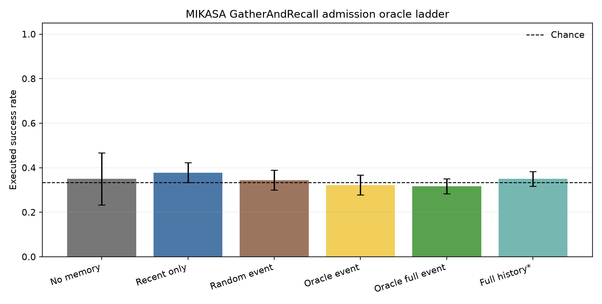
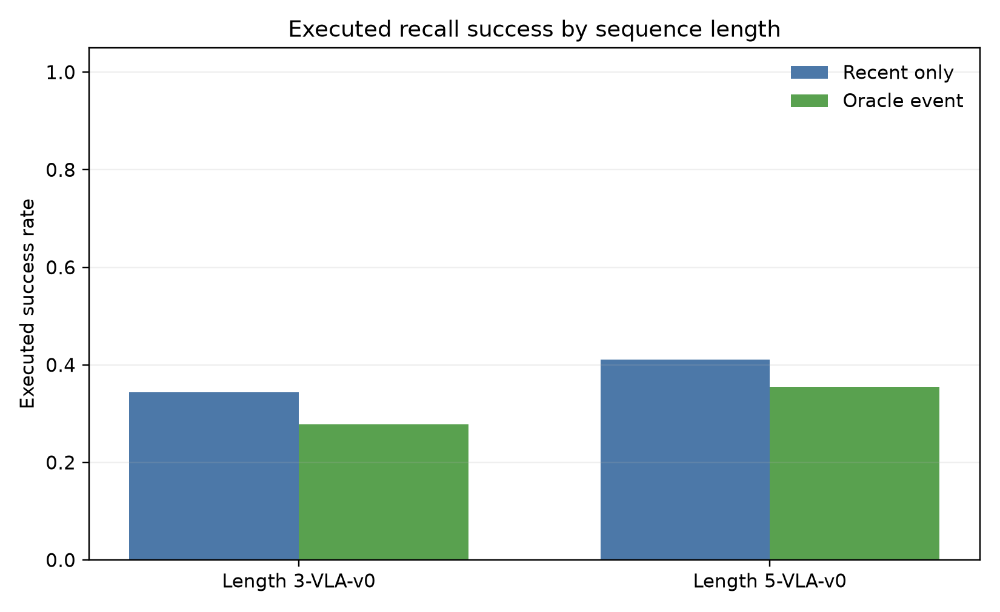
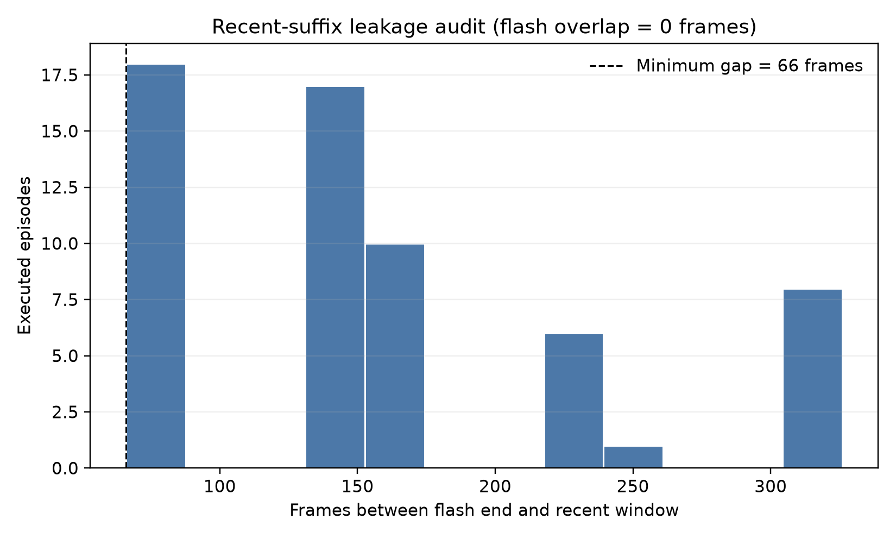
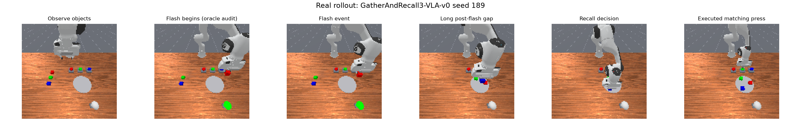

# MIKASA Memory Admission Report

**Admission verdict: FAIL.**

This report is generated from the official MIKASA-Robo-VLA v1.0.0 environment and fresh successful official motion-planning trajectories. The benchmark controller is identical across memory conditions; only the selected raw memory observations differ.

## Source and environment

- Official project: `CognitiveAISystems/MIKASA-Robo`.
- Release/commit: `v1.0.0` / `16634db18bef08128ed79346469c86fc12169aed`.
- License: MIT (CognitiveAISystems, 2026).
- Tasks: `GatherAndRecall3-VLA-v0` (400 steps) and `GatherAndRecall5-VLA-v0` (600 steps).
- Canonical policy input: raw `128×128×6` RGB, 7D proprioception, and the official language instruction.
- Canonical action interface: 7D normalized `pd_ee_delta_pose`.
- Isolated runtime: `mikasa-robo-suite==1.0.0`, `mani-skill==3.0.0b15`, `sapien==3.0.0b1`, and `torch==2.11.0+cu128`.
- Official locked PyTorch 2.2.1 failed on `sm_120`; the isolated environment uses the recorded Blackwell-compatible cu128 override.

## Registered design

- Memory budget: 8 raw observation events for every matched condition; one decision-head call and the same three button candidates.
- Split: disjoint official episode seeds; three learned-head seeds `(17, 29, 43)`; 30 executed test episodes per task.
- The learned head is weakly supervised only by the required button action. At inference it receives no cue label, cue time, lamp crop, saliency mask, oracle state, or realized future.
- All three heads reach 100% held-out validation accuracy on complete demonstrations; this does not transfer to causal pre-decision prefixes.
- `full_history` is an explicitly compute-unmatched diagnostic upper bound and does not enter the gate.

## Admission metrics

- `no_memory` executed success: 35.0% (95% CI 23.3–46.7%).
- `recent_only` executed success: 37.8% (95% CI 33.3–42.2%).
- `random_event` executed success: 34.4% (95% CI 30.0–38.9%).
- `oracle_event` executed success: 32.2% (95% CI 27.8–36.7%).
- `oracle_full_event` executed success: 31.7% (95% CI 28.3–35.0%).
- `full_history` executed success: 35.0% (95% CI 31.7–38.3%).

- Paired oracle-full minus recent: -6.1 pp (95% CI -10.6–-2.2 pp).
- Recent-suffix probe: 37.8% (95% CI 33.3–42.2%).
- Raw suffix audit: 60/60 episodes had zero flash frames in the recent window.
- Candidate controller audit: 60/60 matching candidates succeeded and 120/120 wrong candidates failed.

## Gate clauses

- `recent_is_weak`: PASS.
- `oracle_gain`: FAIL.
- `oracle_execution`: FAIL.
- `recent_suffix_probe`: PASS.

## Figures

## Decision

The fail-closed gate does not pass. Learned CEM training is prohibited. The trained head reaches near-perfect validation on complete demonstrations but falls to chance on causal pre-decision prefixes, localizing a realized-future/demo-tail shortcut rather than a usable long-memory channel.

Machine-readable receipts and per-episode decisions are under `outputs/mikasa_memory_admission_v1/`.
