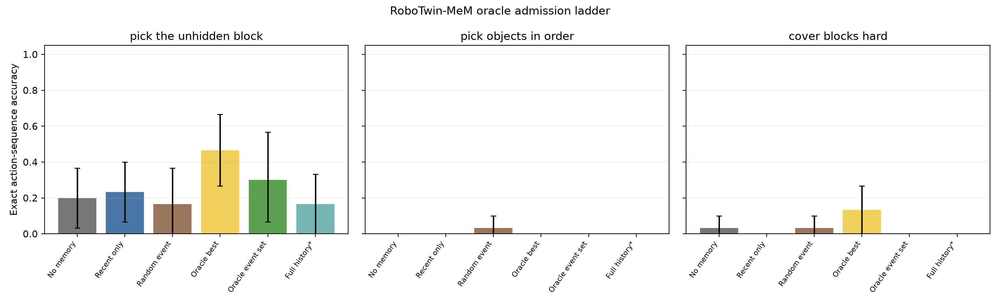
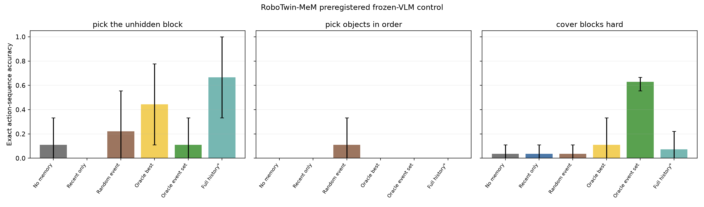
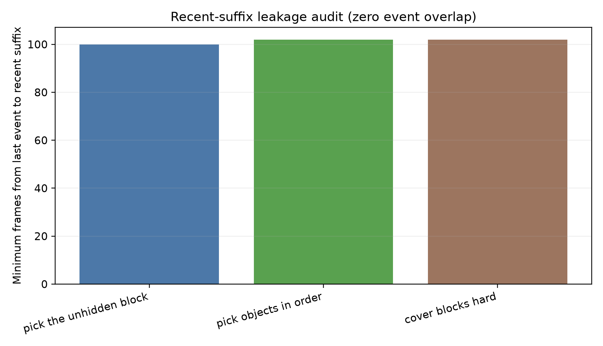
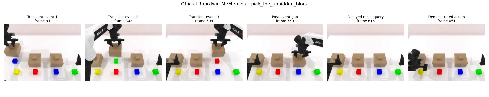

# RoboTwin-MeM CEM Evaluation Report

**Benchmark admission: FAIL. Learned CEM: not reached.**

## Scope and official source

- Paper: EventVLA, arXiv `2606.20092` (v1).
- Official repository: `InternRobotics/EventVLA`, commit `4b5b26030abddf83bc60e1a6b067de8f521fd0ec`.
- Official dataset: `ganlinyang/RoboTwin-MeM`, revision `f67a4ee99a20c65c86897b85d3f5309b205cc897`.
- Licenses: simulator/code MIT; dataset Apache-2.0.
- Tasks: `pick_the_unhidden_block`, `pick_objects_in_order`, and `cover_blocks_hard` under official `demo_clean`.

## Setup status

- The isolated `.venv-robotwin-mem` trajectory runtime passed deterministic LeRobot 2.1 loading and AV1 decoding.
- Policy inputs are the three official 640×480 RGB views, 14D proprioception, and generic task instruction. Frozen DINOv2 uses full frames without crops or saliency.
- Simulator execution is unavailable in the published checkout: `RoboTwin-Mem/task_config/`, `assets/_download.py`, and `data/_download.py` are referenced but absent. No proxy simulator was substituted; all metrics below are official action ranking.
- The release exposes only a 50-episode `train: 0:50` split. This evaluation preregisters a deterministic 30/10/10 train/validation/test split by official episode index and seed.

## Oracle admission

### `pick_the_unhidden_block` — FAIL

- `no_memory` exact sequence: 20.0% (95% CI 3.3–36.7%).
- `recent_only` exact sequence: 23.3% (95% CI 6.7–40.0%).
- `random_event` exact sequence: 16.7% (95% CI 0.0–36.7%).
- `oracle_best_event` exact sequence: 46.7% (95% CI 26.7–66.7%).
- `oracle_event_set` exact sequence: 30.0% (95% CI 6.7–56.7%).
- `full_history` exact sequence: 16.7% (95% CI 0.0–33.3%).
- Paired oracle-set minus recent: 6.7 pp (95% CI -23.3–40.0 pp).
- Recent-only trained probe, per-query: 26.7% (95% CI 0.0–53.3%).
- Minimum event-to-recent gap: 100 frames; event overlap 0.

### `pick_objects_in_order` — FAIL

- `no_memory` exact sequence: 0.0% (95% CI 0.0–0.0%).
- `recent_only` exact sequence: 0.0% (95% CI 0.0–0.0%).
- `random_event` exact sequence: 3.3% (95% CI 0.0–10.0%).
- `oracle_best_event` exact sequence: 0.0% (95% CI 0.0–0.0%).
- `oracle_event_set` exact sequence: 0.0% (95% CI 0.0–0.0%).
- `full_history` exact sequence: 0.0% (95% CI 0.0–0.0%).
- Paired oracle-set minus recent: 0.0 pp (95% CI 0.0–0.0 pp).
- Recent-only trained probe, per-query: 12.2% (95% CI 3.3–23.3%).
- Minimum event-to-recent gap: 102 frames; event overlap 0.

### `cover_blocks_hard` — FAIL

- `no_memory` exact sequence: 3.3% (95% CI 0.0–10.0%).
- `recent_only` exact sequence: 0.0% (95% CI 0.0–0.0%).
- `random_event` exact sequence: 3.3% (95% CI 0.0–10.0%).
- `oracle_best_event` exact sequence: 13.3% (95% CI 0.0–26.7%).
- `oracle_event_set` exact sequence: 0.0% (95% CI 0.0–0.0%).
- `full_history` exact sequence: 0.0% (95% CI 0.0–0.0%).
- Paired oracle-set minus recent: 0.0 pp (95% CI 0.0–0.0 pp).
- Recent-only trained probe, per-query: 36.7% (95% CI 28.3–44.2%).
- Minimum event-to-recent gap: 102 frames; event overlap 0.

## Preregistered strong-control check

After the frozen-DINO head failed, the final frozen Qwen3-VL-4B control was preregistered on untouched confirmatory episodes. One prompt-development episode per task was excluded before this run; the remaining nine episodes and controller source hash are frozen in `vlm_control_protocol_registration.json`.

- `pick_the_unhidden_block`: FAIL; no memory 11.1%, recent 0.0%, oracle set 11.1%, full history 66.7%; paired oracle−recent 11.1 pp (95% CI 0.0–33.3 pp).
- `pick_objects_in_order`: FAIL; no memory 0.0%, recent 0.0%, oracle set 0.0%, full history 0.0%; paired oracle−recent 0.0 pp (95% CI 0.0–0.0 pp).
- `cover_blocks_hard`: FAIL; no memory 3.7%, recent 3.7%, oracle set 63.0%, full history 7.4%; paired oracle−recent 59.3 pp (95% CI 48.1–66.7 pp).

## Decision

Fewer than two tasks pass the fail-closed gate. Per protocol, learned CEM is not run and no benchmark-suitability claim is made.

Executed success is **not available**; the exact next step is for the official authors to publish the referenced `task_config/` and asset/data downloader implementations (or a complete simulator artifact), after which the same seeds and controller can be replayed.

## Reproduction

Run from the repository root with the isolated environment:

```bash
.venv-robotwin-mem/bin/python scripts/run_robotwin_mem_admission.py --stage register
CUDA_VISIBLE_DEVICES=0 .venv-robotwin-mem/bin/python scripts/run_robotwin_mem_admission.py --stage smoke --tasks pick_the_unhidden_block
.venv-robotwin-mem/bin/python scripts/run_robotwin_mem_admission.py --stage index
CUDA_VISIBLE_DEVICES=0 .venv-robotwin-mem/bin/python scripts/run_robotwin_mem_admission.py --stage encode --tasks pick_the_unhidden_block
CUDA_VISIBLE_DEVICES=1 .venv-robotwin-mem/bin/python scripts/run_robotwin_mem_admission.py --stage encode --tasks pick_objects_in_order
CUDA_VISIBLE_DEVICES=2 .venv-robotwin-mem/bin/python scripts/run_robotwin_mem_admission.py --stage encode --tasks cover_blocks_hard
CUDA_VISIBLE_DEVICES=0 .venv-robotwin-mem/bin/python scripts/run_robotwin_mem_admission.py --stage admission --tasks pick_the_unhidden_block
CUDA_VISIBLE_DEVICES=1 .venv-robotwin-mem/bin/python scripts/run_robotwin_mem_admission.py --stage admission --tasks pick_objects_in_order
CUDA_VISIBLE_DEVICES=2 .venv-robotwin-mem/bin/python scripts/run_robotwin_mem_admission.py --stage admission --tasks cover_blocks_hard
.venv-robotwin-mem/bin/python scripts/run_robotwin_mem_admission.py --stage aggregate
.venv-robotwin-mem/bin/python -m pytest -q scripts/test_robotwin_mem_admission.py
```

The secondary VLM commands and untouched episode lists are frozen in `outputs/robotwin_mem_admission_v1/vlm_control_protocol_registration.json`.

## Figures









Machine-readable receipts and per-episode decisions are under `outputs/robotwin_mem_admission_v1/`.
