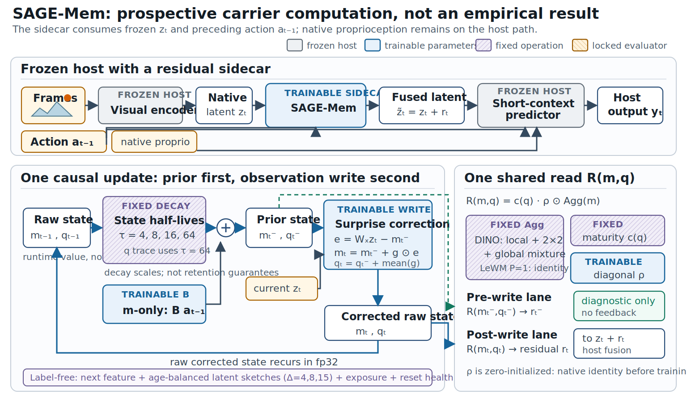
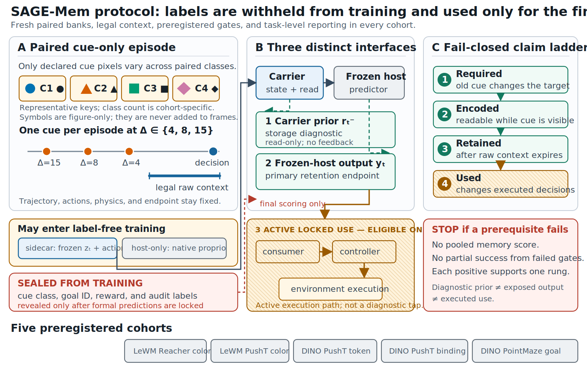

# SAGE-Mem v1: audit-derived design and preregistration contract

**Status:** prospective design specification, 2026-07-08. The isolated carrier
in [`lewm/models/sage_mem.py`](../lewm/models/sage_mem.py) is implemented and
unit-tested, but SAGE-Mem has not been evaluated. The label-free objectives,
host adapters, ablations, and formal runners described below remain an unsealed
experimental contract. Nothing in this document is a model result or evidence
that the proposed mechanism works. Development may select only choices marked
**development-to-seal**. A scientific claim is prohibited until those choices,
source hashes, data banks, seeds, comparator identities, host integration, and
inference code are locked before fresh formal outcomes are opened.

SAGE-Mem expands to **Surprise-gated, Age-balanced, Global,
Exposure-calibrated Memory**. It is a parameter-matched, label-free sidecar for
a frozen short-context latent world model. Its purpose is not to add a larger
generic recurrent block. It targets the two distinct failure locations exposed
by Paper A:

1. old evidence must survive in causal episode state; and
2. retained evidence must be mapped into coordinates exposed by the frozen host
   and a declared consumer.

The architecture source above is
[fig_sage_mem_paper.svg](figures/fig_sage_mem_paper.svg). The outcome-blind
paired-data and audit protocol is shown separately below.

Its editable source is
[fig_sage_mem_protocol_paper.svg](figures/fig_sage_mem_protocol_paper.svg).

## 1. Why this design follows from the audit

The motivation is empirical and diagnostic, not a claim that the proposed
components are individually novel. The values below are copied from the
receipt-bound Paper-A tables and manuscript:

- On matched LeWM color recall, every learned carrier forgets as cue age grows.
  State-space drops from 81.9% to 35.9% on Reacher and 49.6% to 28.1% on
  PushT; fixed-trust drops from 77.2% to 42.1% and 60.3% to 34.2%. The
  registered cross-host fixed-trust-minus-state-space interaction is -0.2
  percentage points, with its 90% interval inside the predeclared +/-5-point
  equivalence region. This motivates a fixed spectrum of age scales rather than
  another single terminal-delay winner claim. See
  [matched_color_results.tex](../paper_a/generated_results/matched_color_results.tex).

- On frozen DINO-WM PushT at age 15, fixed-trust's carrier-prior read remains
  99.2% for token recall and 97.2% for binding, while the corresponding frozen
  host outputs are only 29.3% and 17.6%. State-space priors are 81.2% and 64.2%,
  versus host outputs of 28.5% and 20.3%. Only state-space clears both age-15
  controls for binding. Storage and exposure are therefore different stages;
  increasing state capacity alone attacks the wrong boundary. See
  [Appendix lines 219--225](../paper_a/appendix.tex) and
  [dinowm_pusht_results.tex](../paper_a/generated_results/dinowm_pusht_results.tex).

- On DINO-WM PointMaze at age 15, the host-facing output remains readable:
  state-space reaches 76.0% and fixed-trust 86.6%, corresponding to +51.0 and
  +61.6 points over both no state and context reset. The external fixed
  consumer turns this into 74.5% and 77.5% executed success, versus 23.9% with
  no state. This shows that retained state can matter when exposure and consumer
  geometry align. See
  [pointmaze_carrier_results.tex](../paper_a/generated_results/pointmaze_carrier_results.tex)
  and
  [pointmaze_external_use_results.tex](../paper_a/generated_results/pointmaze_external_use_results.tex).

- The same PointMaze reset produces reset/full next-visual-MSE ratios of
  31.4--38.7 for state-space and 32.8--39.1 for fixed-trust. A positive reset
  contrast can therefore coexist with a severe distribution shift. SAGE-Mem
  includes reset-safe distillation and a strict reset-health gate; it does not
  treat reset sensitivity by itself as memory.

- Two earlier label-free repairs fit their auxiliary targets but failed their
  registered support criteria. SAGE-Mem therefore makes auxiliary objectives
  subordinate to frozen-host prediction health and fresh formal retention/use
  gates. Auxiliary-loss reduction is never a success endpoint. See
  [the repair appendix](../paper_a/appendix.tex).

These observations support a mechanism hypothesis: event-selective writes,
fixed multiscale persistence, and an explicit zero-initialized exposure path may
jointly improve the carrier--host interface. They do **not** establish that this
hypothesis is correct.

## 2. Frozen-host contract and notation

The released host remains immutable throughout development and formal runs.
The encoder, action/proprioceptive encoders, short-context predictor, targets,
native output projection, and controller (where present) are frozen and
hash-checked before and after every cell.

| Symbol | Meaning |
|---|---|
| `D` | latent/channel width: 192 for LeWM, 384 for DINO-WM |
| `A` | action-block width, fixed to 10 in both parameter-count contracts |
| `P` | spatial streams: 1 LeWM vector or 196 DINO patch trajectories |
| `z_t` | current frozen host latent in its native channel coordinates |
| `a_{t-1}` | preceding normalized action block |
| `m_t` | persistent SAGE-Mem state, shape `P x D` for DINO-WM |
| `m_t^-` | causal prior before consuming the current latent |
| `q_t` | scalar write-mass trace per vector/patch stream |
| `y_t` | frozen host output used by the primary endpoint |

For DINO-WM, one set of parameters is shared independently over all 196 patch
trajectories. Only a fixed, parameter-free spatial aggregation operator mixes
patch state before exposure. Native action and proprioceptive channels are not
replaced. For LeWM, `P=1` and the same aggregation operator is exactly the
identity.

### 2.1 Implemented carrier boundary

The v1 carrier consumes native frozen latents directly; it does not insert a
Hadamard transform or a learned preprocessing adapter. `W_x` is initialized to
the identity, the surprise projection `W_g` to the identity, `B` to zero, and
the diagonal read scale `rho` to zero. Recurrence arithmetic and state remain
in fp32 even when the host boundary uses a lower-precision dtype.

The tested sequence interface accepts LeWM tensors `(batch, time, D)` or DINO
tensors `(batch, time, P, D)`, with actions `(batch, time-1, A)`. The equivalent
streaming interface is `initialize`, `observe`, and action-only `imagine`. At
time `t`, `prior_read` is always produced after the action prediction and before
`z_t` is consumed. This timing convention is part of the formal lock.

### 2.2 Pre-selection compute-fairness correction

The deterministic resource ledger caught two implementation mismatches before
any complete development selection or formal run. A dense output matrix was
being applied to both prior and posterior reads, putting the candidate about
51% above the registered baseline FLOP reference, and the inherited gDelta
default width targeted a different historical parameter budget. The incomplete
20-cell diagnostic grid was archived and is excluded from every selection.

The corrected v1.1 graph replaces the twice-applied dense read with a diagonal
scale and spends the unchanged parameter budget on the surprise projection
`W_g`. Its measured ledger gap is 4.6% on LeWM and at most 2.3% on DINO-WM,
inside the unchanged 10% margin. gDelta uses the nearest target-matched state
width (95 for LeWM; 191 for DINO-WM), inside the unchanged 5% parameter margin.
No threshold, cohort, age, seed, optimization rule, or label-free objective was
changed; the correction and archived-grid boundary are machine-readable in the
formal implementation amendment.

## 3. SAGE-Mem state update

### 3.1 Four interleaved fixed age bands

The `D` channels use four fixed half-lives

\[
  \tau = (4, 8, 16, 64).
\]

Channel `j` is assigned round-robin to `tau_{j mod 4}` and has fixed decay

\[
  \Lambda_j = 2^{-1/\tau_{j\bmod 4}}.
\]

Thus a unit in channel `j` is halved after its assigned number of observations.
Because both host widths are divisible by four, every half-life occurs exactly
`D/4` times, but adjacent channels alternate timescales rather than forming
contiguous blocks. The formal ages 4, 8, and 15 are covered by more than one
band, while the 64-observation band supplies a longer tail. No decay is learned
or tuned per task.

### 3.2 Predict, surprise, and correct

For each vector or patch stream, the causal prior is

\[
  m_t^- = \Lambda \odot m_{t-1} + B a_{t-1}.
\]

The innovation in the shared state coordinate is

\[
  e_t = W_x z_t - m_t^-.
\]

The compute-matched implementation first mixes the innovation once and then
preserves its absolute magnitude:

\[
  s_t = \log(1+|W_g e_t|).
\]

Its channelwise surprise gate is

\[
  g_t = \sigma\!\left(
    4\left(s_t-\theta\right)
  \right).
\]

The corrected persistent state is

\[
  m_t = m_t^- + g_t \odot e_t.
\]

`theta` learns a channelwise threshold; the positive gate slope is fixed to
`4`. The initialization makes the reference threshold `log(2)`. No
normalization pools across channels, time, episodes, or counterfactual labels.
The storage diagnostic is taken from `m_t^-` before the current observation is
consumed.

### 3.3 Parameter-free spatial aggregation

For the native 14 x 14 DINO grid, define `m_t^reg` as non-overlapping 2 x 2
regional means broadcast back to their four patches and `m_t^glob` as the
all-patch mean broadcast to every patch. The implemented operator is

\[
  \operatorname{Agg}(m_t)
  = 0.50m_t + 0.25m_t^{\mathrm{reg}} + 0.25m_t^{\mathrm{glob}}.
\]

It satisfies:

1. no trainable weights;
2. prefix causality and no cross-episode mixing;
3. output shape `P x D`;
4. spatial behavior fixed by the native 14 x 14 patch layout; and
5. `Agg(m)=m` when `P=1`.

An arbitrary non-square token set is not a formal v1 input. The implementation
falls back to the global mean for its regional term, but every formal adapter
must reject any patch layout other than `P=196` or the LeWM identity case
`P=1`. The weights, 2 x 2 partition, and boundary behavior are fixed rather
than development choices.

### 3.4 Exposure residual and reset maturity

Write mass decays at the slowest state half-life and accumulates the mean write
gate:

\[
  q_t^- = 2^{-1/64}q_{t-1}, \qquad
  q_t = q_t^- + \frac{1}{D}\sum_{j=1}^{D}g_{t,j}.
\]

Confidence is a monotone function of actual writes rather than elapsed
observation count:

\[
  c(q)=1-\exp\!\left(-\max(q,0)/\kappa\right), \qquad \kappa=4.
\]

The pre-observation prior read and post-observation residual are respectively

\[
  r_t^- = c(q_t^-)\rho\odot\operatorname{Agg}(m_t^-),
\]

and

\[
  \widetilde z_t = z_t + c(q_t)\rho\odot\operatorname{Agg}(m_t).
\]

`rho` is initialized exactly to zero. Consequently, before training both fused
and prior outputs are exactly the no-state host. The diagonal exposure avoids
paying for the same dense projection twice at every step; `W_g` retains a
second dense transform inside the write mechanism, so the parameter budget is
unchanged while measured forward FLOPs remain within the registered 10% band.
Write-based confidence
suppresses an immature read after reset and cannot grow during `imagine`, when
no observation is written. It does not erase the reset intervention or make
reset/full a clean causal estimand.

There is no separate low-rank exposure adapter. The same channelwise read scale
is shared over every DINO patch and both prior/posterior reads.

## 4. Exact trainable parameter count

The only trainable tensors are:

| Tensor | Shape | Parameters |
|---|---:|---:|
| `W_x` | `D x D` | `D^2` |
| `W_g` | `D x D` | `D^2` |
| `B` | `D x A` | `DA` |
| `rho` | `D` | `D` |
| `theta` | `D` | `D` |

Therefore

\[
  N_{\mathrm{SAGE}} = D(2D+A+2).
\]

The two host contracts are exact:

- LeWM (`D=192`, `A=10`): **76,032** trainable parameters.
- DINO-WM (`D=384`, `A=10`): **299,520** trainable parameters.

`Lambda`, `Agg`, the write-mass trace, confidence function, pooling, reset
logic, and telemetry add no trainable carrier parameters. Sharing across 196
DINO patches keeps the
DINO count at 299,520 rather than multiplying it by `P`. The DINO count exactly
matches the Paper-A state-space and fixed-trust arms.

## 5. Prospective label-free training objectives

This section specifies the intended formal loss family; it is not yet a sealed
or end-to-end-tested host integration. No task label, goal ID, cue class, probe
target, executed reward, or formal validation outcome may enter carrier
optimization. Let `Q` be a fixed, hash-locked sketch operator constructed
without labels, and let `E` denote event indices selected causally from detached
surprise statistics. The exact sketch dimension, event tie rule, and loss
normalization are **development-to-seal** choices.

### 5.1 Native next-feature objective

The primary health objective remains the frozen host's native shifted
next-feature loss:

\[
  \mathcal L_{\mathrm{next}}
  = \mathbb E_t\left[
      \lVert F_{\mathrm{frozen}}(\widetilde z_{\le t},a_{\le t})
      - \operatorname{sg}(z_{t+1}^{\star}) \rVert_2^2
    \right].
\]

The target construction, visual/proprioceptive weighting, and legal context are
identical to the corresponding native Paper-A host.

### 5.2 Age-balanced retrospective event sketch

Surprise selects candidate write events without semantic labels. At each
registered age `delta in {4,8,15}`, the prior must preserve a fixed sketch of
the earlier frozen event latent:

\[
  \mathcal L_{\mathrm{ret}}
  = \frac{1}{3}\sum_{\delta\in\{4,8,15\}}
    \mathbb E_{t\in E}\left[
      \left\lVert Q r^-_{t+\delta}
      - \operatorname{sg}(Q z_t^{host})\right\rVert_2^2
    \right].
\]

Each age receives equal weight regardless of how many events survive sampling.
This is the **Age-balanced** part of SAGE-Mem. It trains retention of frozen
latent events, not cue labels.

### 5.3 Host-output exposure sketch

The frozen host output must expose, rather than merely store, the detached prior
sketch:

\[
  \mathcal L_{\mathrm{exp}}
  = \mathbb E_t\left[
      \left\lVert Q y_t^{\mathrm{full}}
      - \operatorname{sg}(Q r_t^-)\right\rVert_2^2
    \right].
\]

This objective calibrates the carrier-to-host interface. It cannot by itself
pass a memory gate: formal success is measured at the host output and under
ablations, not by reducing this training loss or by decoding `r_t^-` alone.

### 5.4 Reset-safe native distillation

On randomly sampled legal short-context resets, the reset arm is distilled
toward the unmodified native host output:

\[
  \mathcal L_{\mathrm{reset}}
  = \mathbb E_t\left[
      \left\lVert y_t^{\mathrm{reset}}
      - \operatorname{sg}(y_t^{\mathrm{native}})\right\rVert_2^2
    \right].
\]

Reset indices are sampled without task labels and shared across compared arms.
This term is a distribution-health constraint, not an attempt to make full and
reset states equivalent.

### 5.5 Development objective and hard constraint

The development objective is

\[
  \mathcal L = \mathcal L_{\mathrm{next}}
  + \lambda_{\mathrm{ret}}\mathcal L_{\mathrm{ret}}
  + \lambda_{\mathrm{exp}}\mathcal L_{\mathrm{exp}}
  + 0.1\mathcal L_{\mathrm{reset}},
\]

with the finite candidate grid

\[
  \lambda_{\mathrm{ret}},\lambda_{\mathrm{exp}}
  \in \{0.1,0.25\}.
\]

Every candidate is inadmissible if its next-feature MSE exceeds 1.02 times the
strongest healthy parameter-matched baseline locked for the next-feature
contrast. Development uses exactly three seeds.
The final pair of auxiliary weights is selected by a prewritten deterministic
rule, then locked; it may not be changed after any fresh ten-seed formal outcome
is inspected.

## 6. Fairness and causal controls

Every formal comparison must preserve the following controls:

- identical frozen checkpoint, encoder outputs, actions, proprioception,
  training/validation episodes, cue placement, endpoints, and counterfactual
  pairing;
- the same optimizer family, schedule, epoch budget, batch construction,
  gradient clipping, early-stopping rule (if any), and numerical precision;
- exact parameter matching within the host contract;
- zero-initialized exposure and the same legal state timing;
- one shared parameter set over all DINO patches;
- no task label in any carrier loss or hyperparameter score;
- full, no-state, context-reset, state-ablation, and exposure-ablation runs from
  matched seeds;
- the same standardized readout family and held-out inference unit used by the
  corresponding Paper-A task;
- frozen-host digests before and after every cell; and
- task-level reporting without a pooled cross-host or cross-family memory score.

The strongest healthy comparator for each branch must be named from sealed
Paper-A artifacts before formal SAGE-Mem outcomes are opened. “Strongest” may
not be redefined after seeing SAGE-Mem, and a comparator that fails its own
predeclared prediction/reset-health requirement cannot be silently removed.

## 7. Development and formal execution map

The five branches use the existing cue-only counterfactual banks and ages
4, 8, and 15.

| Physical GPU | Host/task branches | Development | Fresh formal |
|---:|---|---:|---:|
| 0 | LeWM Reacher matched color; LeWM PushT matched color | 3 seeds | 10 seeds |
| 1 | DINO-WM PushT token recall; DINO-WM PushT binding recall | 3 seeds | 10 seeds |
| 2 | DINO-WM PointMaze goal recall and eligible execution | 3 seeds | 10 seeds |

Each runner must reject a mismatched physical GPU and record both the requested
device and `CUDA_VISIBLE_DEVICES`. GPU 3 is outside this design. Development and
formal seed IDs, formal data banks, controller hashes, and launch commands are
**development-to-seal** records. Formal seeds and formal episodes must be
disjoint from development.

## 8. Admission and formal success gates

### 8.1 Inherited task admission

No carrier trains unless its branch passes the same fail-closed prerequisite
chain as Paper A:

1. paired counterfactuals establish that the target is required;
2. visible-cue balanced accuracy is at least 0.750;
3. where registered, every visible-cue class recall is at least 0.700;
4. late visual/action/proprioceptive shortcuts remain at or below chance +0.05
   (0.300 for four-way tasks and 0.217 for six-way binding);
5. zero pixels change outside the declared cue mask and post-cue inputs are
   byte-identical across labels;
6. the frozen-host hash is unchanged; and
7. execution runs only after its oracle/controller/replay gate passes.

### 8.2 Formal SAGE-Mem gates

All effect gates use paired 95% intervals with a **strictly positive lower
bound**. Exact bootstrap units follow the corresponding Paper-A branch: matched
carrier seed plus class-stratified held-out episode for PushT, and matched seed
plus native-episode counterfactual cluster for PointMaze.

For a branch to support SAGE-Mem retention at age 15, all of the following are
required:

1. **Comparator:** full SAGE-Mem beats the predeclared strongest healthy
   comparator.
2. **Total carrier effect:** full beats no persistent state.
3. **Pre-context dependence:** full beats the identical carrier reset at the
   legal short context.
4. **Host exposure:** the primary frozen-host output passes; a decodable prior
   without an output gain is a failure, not partial success.
5. **Mechanism ablations:** full beats both the persistent-state ablation and
   the exposure-path ablation.
6. **Prediction health:** full next-feature MSE is at most 1.02 times the locked
   strongest healthy parameter-matched baseline MSE.
7. **Reset health:** reset/full next-feature-MSE ratio is at most 1.25.

The program-level executed-use claim additionally requires a resolved execution
improvement on at least **two eligible tasks**. Eligibility is determined only
by preregistered admission and controller gates. Execution must beat both the
declared no-state and random/reference controls under the fixed arm-blind
consumer. A task cannot become eligible or ineligible because its SAGE-Mem
result is favorable or unfavorable.

These are conjunctions. Passing five of seven retention gates does not produce
a weaker “mostly successful” retention claim.

## 9. Ablations and diagnostic reads

The formal model graph exposes three reads and two mechanism ablations:

- **Prior read:** `c(q_t^-) rho ⊙ Agg(m_t^-)`, before the current observation. This diagnoses
  internal storage but is never the primary success endpoint.
- **Output read:** the frozen predictor output after SAGE-Mem fusion. This is the
  primary retention endpoint.
- **Use read:** a fixed arm-blind consumer and fixed controller, only on eligible
  branches.
- **State ablation:** preserves the exposure implementation but removes state
  accumulated before the legal context. It tests whether the multiscale causal
  state, rather than an extra local transformation, is needed.
- **Exposure ablation:** preserves and audits the state/prior but blocks the
  `c(q_t) rho ⊙ Agg(m_t)` residual from the host. It tests whether gains require the
  proposed carrier-to-host path.

The exact ablation construction and any parameter-balancing dummy tensors are
**development-to-seal**. They must not introduce a new trainable path or alter
the frozen host.

## 10. Fail-closed rules

1. Development metrics are for choosing the explicitly finite development
   options only; they carry no confidence interval or paper claim.
2. Before formal launch, seal source hashes, frozen weights, data manifests,
   sketch/Agg definitions, loss normalization, selected auxiliary weights,
   optimizer, seed IDs, comparator identities, ablations, readouts, consumers,
   controller, and bootstrap code.
3. Do not relax a threshold, change an endpoint, add a task, resplit episodes,
   replace a comparator, or alter eligibility after formal outcomes are opened.
4. A failed admission gate stops that branch before training. A failed health
   gate stops the corresponding scientific claim even if probe accuracy rises.
5. A missing/nonfinite cell, wrong GPU, hash mismatch, schema drift, or altered
   frozen host invalidates the grid. Completed favorable cells may not be
   selectively reported.
6. A prior-only gain is an exposure failure. An output-only probe gain is not an
   executed-use claim. Execution on fewer than two eligible tasks fails the
   program-level use claim.
7. A reset/full MSE ratio above 1.25 makes reset-based attribution inadmissible;
   it cannot be rescued by a large full-minus-reset accuracy contrast.
8. Report every task separately. One easy task cannot mask another task's
   failure, and LeWM/DINO absolute scores are never pooled.
9. Preserve stopped branches, null results, negative contrasts, seed arrays,
   predictions, and verifier receipts.
10. No result licenses claims of universal carrier superiority, native-planner
    memory, cross-family dominance, or end-to-end co-adaptation.

## 11. What is fixed now and what remains to be sealed

| Fixed design constant | Development-to-seal before formal |
|---|---|
| Name and frozen-sidecar scope | exact source/commit and dependency hashes |
| v1 equations for `m^-`, `e`, `s`, `g`, `m`, `q`, confidence, and fusion | formal wrapper mapping and host timing checks |
| `D`, `A`, exact parameter formula and zero-init `rho` | fixed sketch `Q`, event selection, tie handling |
| round-robin `tau=(4,8,16,64)` and fixed `Lambda` | loss normalization and deterministic candidate-selection rule |
| native latent coordinates; identity-init `W_x`; zero-init `B` | optimizer, schedule, epochs, batch size, precision |
| write-mass `kappa=4`; `2^{-1/64}` mass decay | seed IDs, bank hashes, cell order, launch receipts |
| fixed `Agg=(0.50,0.25,0.25)`, 2x2 DINO regions; `P=1` identity | host adapters and formal objective integration |
| objective families; reset weight 0.1 | comparator identities and exact ablation construction |
| candidate auxiliary weights `{0.1,0.25}` | eligible consumers/controllers and their hashes |
| ages 4/8/15; 3 development then 10 fresh formal seeds | bootstrap seeds and final reporting manifest |
| GPU 0/1/2 branch mapping | all numerical sanity vectors and atomic-output schema |
| formal gates and failure rules above | any detail not explicitly fixed in the left column |

Until the right column is sealed and the fresh formal grid completes, the only
valid statement is: **SAGE-Mem is an audit-derived, parameter-matched hypothesis
designed to test storage and exposure jointly.**
