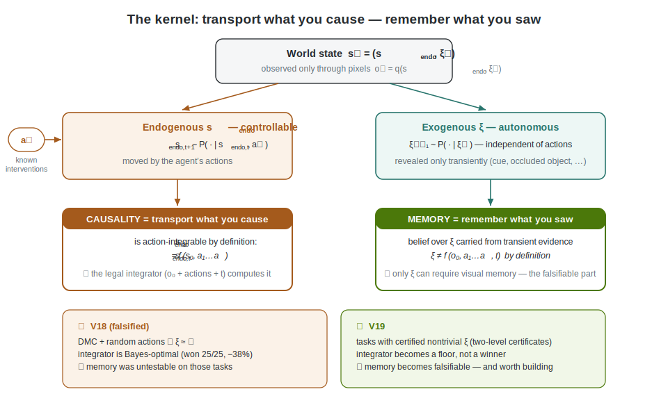
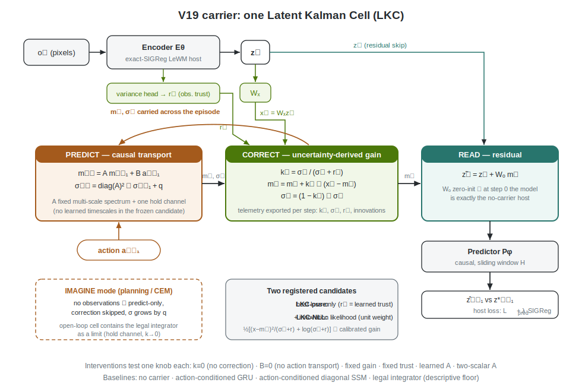
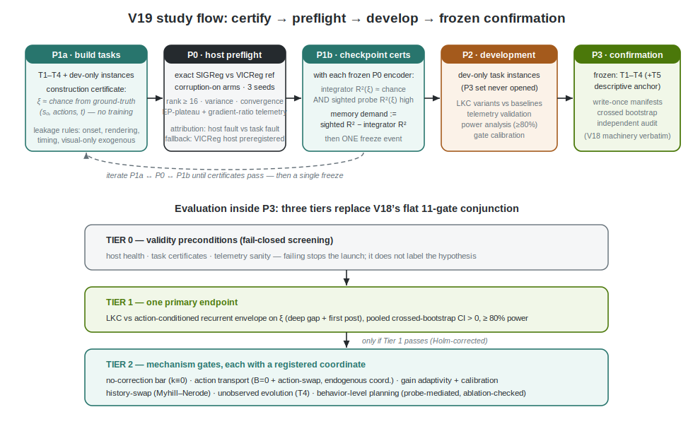

# V19 Proposal — The Kernel of Memory and Causality in LeWM

**Status: PROPOSAL (pre-registration draft, revision 2 after adversarial review). Successor to the V18 frozen falsification (`CONFIRMATION_FAILED`).**

This document does four things: (1) assesses the external review of the V18 paper; (2) distills what V1–V18 actually established — and what that evidence does and does not license; (3) states the formal kernel of memory and causality the program has been circling; and (4) proposes V19 — a deliberately minimal candidate with an honest ledger of every hand choice, evaluated on tasks whose memory demand is certified rather than hoped for.

---

## 1. Assessment of the external review

Verdict: **the review is rational, factually accurate, and should be accepted rather than rebutted.**

- Every number it cites matches the frozen artifacts exactly (recurrent envelope −2.10% [−13.35%, +9.11%]; integrator −38.12%, 0/25; rank 144/200; convergence 126/200).
- Its five asks — (1) a healthier cohort, (2) an exact-SIGReg host, (3) internally action-conditioned recurrent baselines, (4) behavior-level evaluation, (5) retained mechanism telemetry — are a near-restatement of the paper's own "Design implication for a new cohort" paragraph. The review independently converging on our own next-step list is evidence the falsification was honest; V19 adopts all five.
- Its sharpest observation is the one to build on: the prior-state endpoint under IID random actions admits an action-integration shortcut, so *the benchmark never required visual memory*. Section 3 shows this is a theorem-shaped fact, and V19's task design starts from it.
- Where the review under-credits the work: the falsification framing it requests is already the paper's structure, and the frozen-gate/legal-integrator methodology is itself reusable. But without a positive diagnostic result the package is borderline; V19 is designed to produce one — or a falsification sharp enough to be definitive.

---

## 2. What V1–V18 established — and how far that evidence reaches

Fifteen mechanism variants and three host studies leave five load-bearing facts (receipts in `docs/LEARNABLE_MEMORY.md` §7, `paper/review_artifact/confirmation_analysis.json`):

1. **Action transport is the only mechanism that repeatedly survived its own intervention** (V4–V8 development; V18 +9.48% [+2.88%, +16.09%], 23/25, 5/5). Meanwhile: learned timescales lost to fixed decays three times (V5 spectra −7.30%, V9 poles, OC-SMT gates); memory-specific auxiliary objectives were ineffective or harmful four times (+0.39%, +0.30%, two harmful); observer-style correction branches lost to their own `nocorrect` four times (V12–V15); multi-state hierarchies never beat one well-chosen state (V5, V9, V18 single-read rank 2.20 vs 3.80).
2. **The carrier recovered rather than transported.** SAS-PC lost exactly where a persistent carrier must win — deep gap (−1.74%) and first reappearance (−4.42%) — and won only after observations resumed (post-gap +8.27%, 23/25, 5/5). The heuristic gate is the suspect (freeze +10.10% vs Gaussian −20.95% sign flip), but per-step telemetry was not retained. V19 retains it.
3. **The integrator dominance is a theorem, not an artifact.** Initial frame + executed actions + time beat every learned memory 25/25 (pooled 0.656 vs 0.889; per-task −15.91% to −77.40%); action R² on DMC state transitions reaches 0.997–0.99999995. Under IID random actions, DMC native state is (nearly) a deterministic function of (initial frame, action sequence): the Bayes-optimal "memory" *is* the integrator, and no learned carrier can beat it on such tasks even in principle.
4. **Host health is a precondition, not a nuisance.** The VICReg host rank-collapsed on Swimmer (0/40 cells ≥ rank 16, identically across all eight arms) and failed convergence on Quadruped (5/40). V16's SIGReg-family variants collapsed under *our* configuration (projected-zero Epps–Pulley plateau, regularizer/prediction gradient ratio > 12,000) — but V16's `fullsig` was D=128, M=512, with paired corruption views; **an exact-LeWM SIGReg host (D=192, M=1024, no paired views) has never been run.**
5. **Clean decodability ≠ memory.** SAS-PC improved every clean-prior cell (+11.73%, 25/25) while losing the corrupted counterpart.

**Evidence-transfer honesty.** Section 3 argues the V1–V18 tasks were memory-free by construction; it follows that the mechanism falsifications above were measured in a regime where memory was irrelevant. They therefore bind as **frozen defaults, not laws**: the V19 candidate ships without learned timescales, hierarchies, or auxiliary memory losses, but each of these is *re-admitted as exactly one preregistered intervention arm* so that the old verdicts get their first test in a regime where memory matters. If the defaults survive, the rules harden; if not, the earlier falsifications are exposed as regime-specific. Either outcome is informative.

---

## 3. The kernel: memory and causality, stated exactly

The formal object is the **Exogenous Block MDP** (Efroni et al., ICLR 2022, arXiv:2110.08847; COLT 2022, arXiv:2206.04282):

```
s_t = (s_endo_t, s_exo_t)
s_endo_{t+1} ~ P(· | s_endo_t, a_t)        — controllable: action-caused
s_exo_{t+1}  ~ P(· | s_exo_t)              — exogenous: evolves regardless of actions
o_t = q(s_endo_t, s_exo_t)                 — pixels emit both
```



Two definitions fall out, and they are the kernel:

- **Causality (the actionable kind) = transport of the endogenous state by actions.** Executed actions are *known interventions* (Schölkopf et al. 2021; CITRIS arXiv:2202.03169; mechanism sparsity arXiv:2107.10098); the endogenous latent is what multi-step inverse dynamics + forward consistency identifies (AC-State arXiv:2207.08229; ACDF arXiv:2403.11940). With near-deterministic endogenous dynamics this component is **action-integrable from the initial state by definition** — which is why the legal integrator is unbeatable on controllable-only tasks. V18's result is the empirical shadow of the ExoRL theorem.
- **Memory = the belief filter over exogenous persistent latents** (plus the initial endogenous state). Exogenous factors are, by definition, *not* functions of (initial frame, actions, time) — they are the only thing that can *require* visual memory and the only thing on which a memory claim is falsifiable. Object permanence under autonomous motion (CATER arXiv:1910.04744; Loci-Looped arXiv:2310.10372), transient cues (Passive Visual Match arXiv:1810.06721), hidden physical parameters (CoPhy arXiv:1909.12000) are all instances. A caution from the copycat literature (arXiv:1905.11979, 2010.14876): history access invites action-shortcut solutions, so exogenous content must be certified, not assumed.

One sentence: **transport what you cause; remember what you saw; and a memory mechanism is only testable where the second set is non-empty.** V18 ran a technically flawless test on tasks where it was empty.

Corollary for mechanism design: the belief update over a latent state with known-intervention inputs and noisy observations has a canonical *structure* — predict with the action, correct with the innovation, weighted by relative uncertainty. SAS-PC approximated that structure with hand-designed parts (sigmoid gates, a static/dynamic mixture, two hand-picked timescales, a routed read). The literature has since converged on the same family from three directions — gated SSMs, delta-rule linear attention, and Kalman filters are all online least-squares memory with different gain approximations (test-time regression arXiv:2501.12352; Longhorn arXiv:2407.14207; Gated DeltaNet arXiv:2412.06464; MesaNet arXiv:2506.05233). V19's candidate commits to the canonical structure and is honest about which parts are derived and which are chosen.

---

## 4. V19 design

**One sentence: exact-SIGReg LeWM host + one latent Kalman cell with an uncertainty recursion and an honest hand-choice ledger, evaluated on tasks whose memory demand is certified at construction *and* checkpoint level, with a three-tier gate structure and full per-step telemetry.**

### 4.1 Host: exact SIGReg, health as a precondition

- Objective: exact LeWM recipe — `L = L_pred + λ·SIGReg(Z)`, Epps–Pulley over M=1024 sketched directions, λ the only loss coefficient (LeJEPA arXiv:2511.08544; LeWM arXiv:2603.19312). No VICReg terms and no memory-specific losses in the host.
- **Phase P0 (host preflight, on the built tasks, before any memory question):** exact-SIGReg host and the V18-VICReg reference, per task, 3 seeds, **with a corruption-on arm per task** (the regime P2/P3 will actually use — V16's collapse may have been corruption-coupled). Gates: effective rank ≥ 16, channel variance ≥ 1e-4, late-window convergence ≤ 5%, **plus the V16 collapse signature instruments**: per-direction Epps–Pulley statistic (projected-zero plateau detector) and regularizer/prediction gradient-ratio telemetry with explicit thresholds.
- **Attribution rule (prevents task-shopping):** SIGReg fails while VICReg passes → host fault, counts against Claim 1. Both fail → task fault; the task may be replaced at most twice per slot. **Preregistered fallback:** if the exact-SIGReg bet fails, P2/P3 proceed on the VICReg host with per-task health caveats quantified in P0 — the memory question is not hostage to the host bet.
- Encoder/predictor: LeWM-faithful ViT + causal predictor, AdaLN zero-init action conditioning, sliding window H as configured.

### 4.2 Carrier: one latent Kalman cell (LKC)

State `m_t ∈ R^N`, diagonal uncertainty `σ_t ∈ R^N`, lifted observation `x_t = W_x z_t ∈ R^N`. **Diagonal observation model by construction (H ≡ I in the lifted basis):**

```
predict:   m⁻_t = A m_{t-1} + B a_{t-1}            σ⁻_t = diag(A)² ⊙ σ_{t-1} + q
correct:   k_t  = σ⁻_t / (σ⁻_t + r_t)              (elementwise gain)
           m_t  = m⁻_t + k_t ⊙ (x_t − m⁻_t)        σ_t = (1 − k_t) ⊙ σ⁻_t
read:      z̃_t = z_t + W_o m_t                     (residual, zero-init)
imagine:   during planning rollouts there are no observations: predict-only,
           correction skipped, σ grows by q (open-loop mode, used inside CEM)
```



with `r_t` an observation-variance head on the encoder. Precedents: Ac-RKN (CoRL 2020, arXiv:2010.10201 — this cell on real robots, with a factorized-block covariance we deliberately simplify to diagonal), Kalman layers as parallelizable SSM replacements (TMLR 2025, arXiv:2409.16824), R2I modernizing Dreamer's predict–correct (ICLR 2024 oral, arXiv:2403.04253). Representability note: with a near-unit mode and correction off, the open-loop cell computes `m_t = A^t m_0 + Σ A^{t−k} B a_k` — **the legal integrator is contained as a limit**, so the V10 lesson (norm-preserving transport cannot express affine accumulation) is answered by construction.

**What is derived vs. what is chosen — the honest ledger.** Derived: the predict–correct *structure* and the uncertainty recursion (the gain falls out of σ and r rather than being a free sigmoid). Chosen, and admitted as such: (1) state size N; (2) spectrum family for the **fixed** diagonal `A` (HiPPO-LegS / S4D-real, arXiv:2008.07669, 2206.11893) **and its discretization range Δ — this is the actual horizon knob**, registered as: slowest-mode half-life ≥ the maximum certified cue-to-decision delay, plus one exact eigenvalue-1 "hold" channel; (3) diagonal σ (an approximation Ac-RKN does not make — its failure mode, cross-channel-entangled ξ, is precisely the regime under test); (4) q and σ₀ parameterization; (5) variance-head architecture and floor; (6) additive residual read (a full Bayes treatment would weight the read by σ). That is roughly as many hand choices as SAS-PC had — the claim is not "fewer knobs," it is **"every knob sits inside one canonical structure, and each one is either fixed before the freeze or tested by a registered intervention."**

**Two registered candidate variants — the calibration question is empirical, not assumed:**

- **LKC-pure:** trained only through the host loss. Then `r_t` is honestly a learned trust signal (a rational-squash gate, structurally disciplined but not calibrated) — the "gate closes under corruption" prediction is a *descriptive* telemetry check, not a gate.
- **LKC-NLL:** adds the filter's own Gaussian innovation likelihood, `½ Σ [(x_t − m⁻_t)²/(σ⁻_t + r_t) + log(σ⁻_t + r_t)]`, unit weight. This is the one new loss term in the study, and it is what earns the word *calibrated*: with it, Claim 5 gains a **calibration certificate** — on held-out corrupted streams, empirical innovation variance must match σ⁻+r within a registered ratio band. Section 4.6's "no auxiliary objectives" default is explicitly amended for this single term, because the V12–V15 aux failures were bolt-on distillation losses, not the model's own likelihood — and because the old falsifications were measured in a memory-free regime (Section 2).

Telemetry (fixes the V18 blind spot): per-step `k_t, σ_t, r_t`, innovation norms, exported for every evaluation episode.

### 4.3 Arms (all separately trained)

1. No carrier (exact host).
2. **Action-conditioned GRU** and **action-conditioned diagonal SSM** — recurrent references receive `[z_t; a_{t-1}]`, removing V18's baseline asymmetry. Parameter-matched by the V18 rule.
3. LKC-pure and LKC-NLL (candidates).
4. LKC interventions, each testing one knob: **`k_t ≡ 0` (no-correction — the control that killed V12–V15 and must be beaten before any correction claim)**; `B = 0` (no action transport); `k_t ≡ k̄` (fixed gain); `r_t ≡ r̄` (fixed trust); `A` learned, initialized at the fixed spectrum (re-admits the learned-timescale question); `A` two-scalar (exp(−1/2), exp(−1/8) tiled — tests whether the wide fixed spectrum actually beats V5/V9's coarse-decay winner).
5. Legal integrator — computed per checkpoint, reported as a **descriptive floor**, never a confirmatory conjunct (Section 4.5).

### 4.4 Tasks: memory demand certified, twice

Five confirmation tasks + two development-only instances (fresh layouts/cue sets of the same families, so P2 never opens the P3 set). Each confirmation task contains a reward-relevant **exogenous, transiently observable** factor ξ. Common leakage-proofing rules, forced by adversarial review:

- Cue onset strictly after frame 0; onset time and duration drawn independently of ξ; episode length and reset timing constant across ξ values.
- All post-cue rendering identical across ξ values; a **non-re-observability certificate**: a sighted probe restricted to post-cue frames must be ≈ chance on ξ.
- Cue-to-decision delay ≫ H, with a "windowed no-carrier host ≈ chance on ξ at decision time" check (else the finite window is the memory).
- Exogenous elements are visual-only (no contact path to the agent), and swaps/events are teleported simulator state with frame-identical animation across branches.
- Every stream on which any ξ endpoint or gate is computed uses either IID random actions or an open-loop script drawn independently of ξ; per-stream integrator certificates are registered. Confirmatory contrasts are never computed on ξ-conditioned policy streams.

Tasks: **T1 transient-cue reacher** (Passive-Visual-Match-on-DMC; arXiv:1810.06721, 2307.03864); **T2 occlusion swap**, shell-game convention with identical objects and Bernoulli teleport-swap behind a fixed-duration occluder (RoboMME Permanence arXiv:2603.04639; MIKASA arXiv:2502.10550); **T3 exogenous drifter** with a dynamics-irrelevant, appearance-transient flashed property on Distracting-Control infrastructure (arXiv:2101.02722, 2110.08847); **T4 moving target behind freeze** with **stochastic (OU-perturbed) exogenous motion** — deterministic motion would be integrator-computable — where the pass criterion is proximity to the *posterior-mean* advanced position relative to the process-noise floor (WRBench arXiv:2606.20545; CATER arXiv:1910.04744); **T5 legacy DMC anchor** (Acrobot or Manipulator), **descriptive-only**, excluded from all pooled confirmatory endpoints — it quantifies how conclusions change when memory is not required.

**Certification, two-level (fixes the phase circularity):**
- **Construction-level (P1a, encoder-free):** probe ξ from simulator ground truth `[true initial state, action sequence, time]` — must be ≈ chance; information-theoretic, runs before any training.
- **Checkpoint-level (P1b, after P0):** with each frozen P0 encoder, two-sided — checkpoint-matched integrator R² on ξ ≈ chance **and** full-history sighted probe R² on ξ high (the task is non-vacuous *for this encoder*). Probe-level memory demand := sighted-probe R²(ξ) − integrator R²(ξ), the world-model analogue of the MDP/POMDP twin gap (arXiv:2503.01450) — defined on probes, not RL returns. A probe-level temporal range (decay of ξ decodability under history truncation) replaces the policy-based Temporal Range metric.

### 4.5 Evaluation: three tiers, one primary endpoint

**Tier 0 — validity preconditions (fail-closed screening, not confirmatory outcomes):** P0 health gates, task certificates (4.4), telemetry sanity. These determine whether the experiment is interpretable, and failing them stops the launch rather than labeling the hypothesis.

**Tier 1 — ONE primary confirmatory endpoint:** LKC vs. the **action-conditioned recurrent envelope** on the ξ coordinate, deep-gap + first-post prior probe, pooled crossed-bootstrap CI > 0 over T1–T4 (per-task wins reported descriptively). A power analysis is part of registration: simulate the crossed bootstrap against V18's observed variance (the V18 envelope CI was ±11 points at 5 seeds) and set seed/task counts for ≥ 80% power at the smallest effect worth claiming.

**Tier 2 — mechanism gates, hierarchical (tested only if Tier 1 passes; Holm-corrected), each with a registered evaluation coordinate:**

1. **Correction is useful:** LKC beats its own `k≡0` no-correction arm on ξ (the V12–V15 bar, faced head-on).
2. **Transport is causal:** `B=0` degrades — evaluated on the *endogenous/full-state* coordinate and the T5 anchor (on ξ, actions carry no information by construction, so this gate must not use the ξ coordinate); action-swap counterfactual: snapshot simulator state at gap onset, roll executed vs. permuted actions with the same exogenous noise realization, register per-episode Spearman correlation between predicted-latent divergence and ground-truth embedding divergence (CI > 0), plus the factorization check that action swaps leave the ξ-probe output approximately invariant.
3. **The gain adapts for a reason:** fixed-gain and fixed-trust arms degrade on ξ; for LKC-NLL, the calibration certificate (4.2) must hold. For LKC-pure the k_t corruption response is descriptive telemetry.
4. **History-swap (Myhill–Nerode, arXiv:2406.03689), constructively:** pairs built by simulator-state injection — two episodes reset to identical endogenous state and cue timing with same-ξ vs. different-ξ and different nuisance histories; swap `(m_t, σ_t)` and roll the predictor. Registered ratio gate: same-ξ swap divergence ≪ different-ξ swap divergence, and in the different-ξ case the prediction's ξ-probe must follow the donor (generalizing `follow_memory` in `scripts/causal_swap.py` to continuous ξ; the script is a template, not a drop-in).
5. **Unobserved evolution (T4):** prior at reappearance closer to the posterior-mean advanced position than to the frozen one.
6. **Behavior level:** CEM/MPC with the open-loop LKC rollout mode; goal selection via a **frozen post-hoc selector probe** from carrier state to one of K candidate goal embeddings, trained after world-model training on held-out episodes (explicitly probe-mediated; no auxiliary loss touches the host). Success = environment-defined success of executed MPC vs. the identical planner on the no-carrier host, with test-time carrier ablation as the causal check. Build list registered up front: open-loop mode, selector probe, planner cost head — `scripts/eval_planning.py` is a precedent but is not closed-loop and will be rewritten.

### 4.6 Defaults, not laws

Not in the frozen candidates: learned timescales, multi-state hierarchies/routers, post-hoc observer corrections, bolt-on distillation losses. Each is re-admissible **only** as the single registered intervention arm named in 4.3 — because Section 2's falsifications were measured in a memory-free regime and deserve exactly one honest retest, not silent re-adoption. The host keeps SIGReg's λ as its only loss coefficient; the LKC-NLL variant's unit-weight likelihood is the one admitted addition, tested against LKC-pure.

---

## 5. Claims ladder

| # | Claim | Tier | Coordinate | Confirmed if | Falsified if |
|---|---|---|---|---|---|
| 1 | Exact-SIGReg LeWM host is healthy on memory tasks | 0 | — | P0 gates pass (corruption-on) | SIGReg fails where VICReg passes → publish host-stability study; fall back to VICReg host |
| 2 | The task suite requires memory | 0 | ξ | construction + checkpoint certificates pass | integrator or post-cue probes read ξ → fix task before freeze (≤ 2 replacements/slot) |
| 3 | A canonical-structure carrier transports exogenous state | 1 | ξ | beats action-conditioned recurrent envelope, pooled CI > 0 | envelope wins → hand recurrence suffices for this class; report and stop |
| 4 | Correction is finally useful | 2 | ξ | beats own `k≡0` arm | no-correction wins a fifth time → correction abandoned for this model class |
| 5 | Action transport is the causal mechanism | 2 | endo / T5 | `B=0` degrades; action-swap tracks; ξ-probe invariant to action swaps | fails → the +9.48% story was correlational |
| 6 | Gain adaptivity and calibration matter | 2 | ξ | fixed-gain/fixed-trust degrade; NLL calibration certificate holds | fixed gain matches → simplify further; calibration fails → LKC-pure framing stands |

Every row is reportable. Either outcome of every row is publishable — including the first validated persistent-state JEPA world model (none exists in the peer-reviewed record as of July 2026) or a falsification that closes the question for this model class.

## 6. Phasing



- **P1a — build tasks + construction-level certificates** (simulator ground truth only; no training). Includes the two development-only instances.
- **P0 — host preflight** on the built tasks (exact SIGReg vs. VICReg reference, corruption-on arms, collapse-signature telemetry). ~2 GPU-weeks.
- **P1b — checkpoint-level certificates** with frozen P0 encoders (two-sided; iterate P1a↔P0↔P1b until pass, then a single freeze event).
- **P2 — development grid** on the development-only instances: LKC variants vs. baselines, telemetry validation, power analysis, gate calibration.
- **P3 — frozen confirmation**: T1–T4 (+T5 descriptive) × arms × seeds set by the power analysis; write-once manifests, crossed bootstrap, independent audit — the V18 machinery verbatim, with the three-tier gate structure replacing the flat 11-gate conjunction.

## 7. Key sources

Ex-BMDP/exogenous theory: arXiv:2110.08847, 2206.04282, 2207.08229, 2403.11940, 2211.00164, 2404.14552 · Interventional CRL: arXiv:2102.11107, 2202.03169, 2209.11924, 2203.16437, 2107.10098 · World-model evaluation: arXiv:2406.03689, 2412.05337, 2606.20545, 1909.12000 · Memory kernels: arXiv:2008.07669, 2206.11893, 2403.04253, 2307.02064, 2501.12352, 2412.06464, 2407.14207, 2506.05233 · Kalman line: arXiv:1905.07357, 2010.10201, 2107.10043, 2310.18534, 2409.16824 · JEPA line: arXiv:2511.08544, 2603.19312, 2411.04983, 2506.09985, 2505.03176, 2601.01075 · Benchmarks: arXiv:2309.17207, 2210.13383, 2303.01859, 2503.01450, 2502.10550, 2603.04639, 2307.03864, 1810.06721, 2101.02722, 2512.06204 · Copycat caution: arXiv:1905.11979, 2010.14876.
