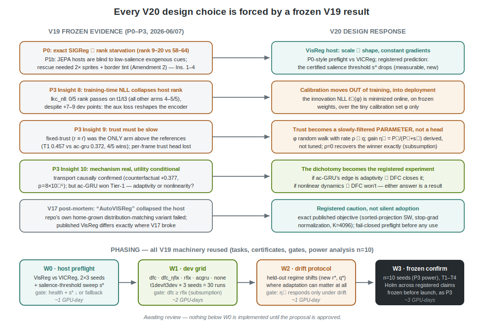
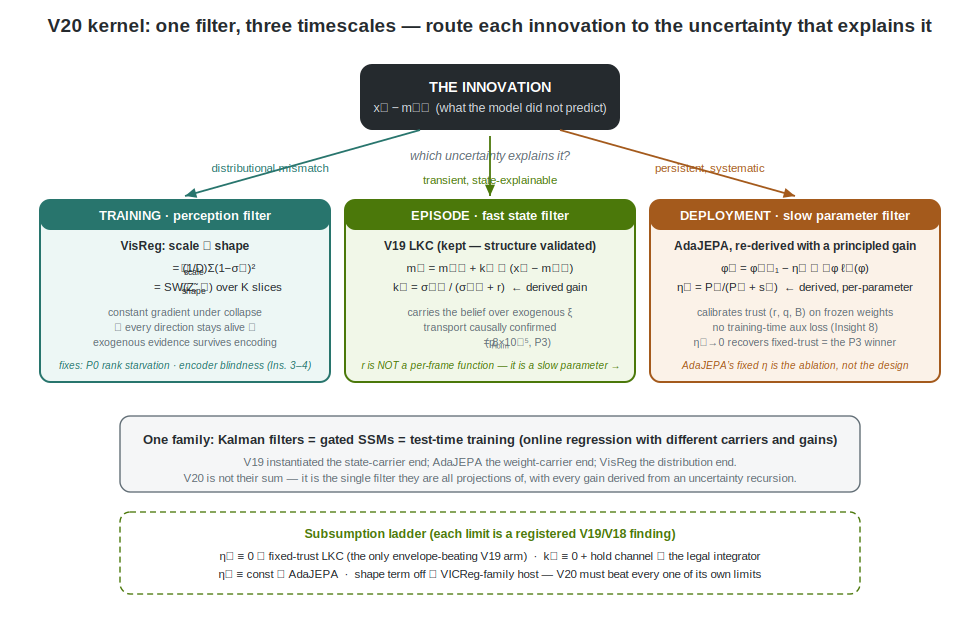
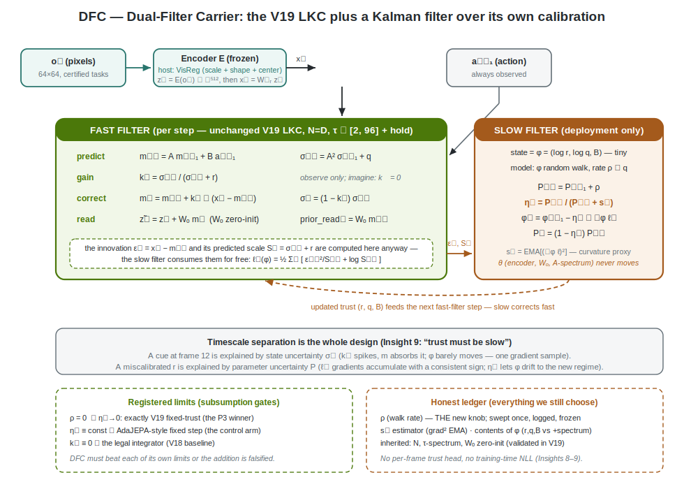

# V20 Proposal — One Filter, Three Timescales

**Status: PROPOSAL (awaiting review). Nothing in this document is implemented; per instruction, implementation begins only after explicit approval. Successor to the V19 frozen falsification (Tier-1 FAIL, `docs/V19_PROPOSAL.md` §12).**

This document does four things: (1) fixes the evidence base — the frozen V19 results that any successor must answer to; (2) reads the two source papers (AdaJEPA, VisReg) through the program's kernel rather than as features to bolt on; (3) states the fused kernel — **one filter, three timescales** — and shows that each source method is a projection of it; (4) proposes V20 — the Dual-Filter Carrier (DFC) on a VisReg host — with registered predictions, a claims ladder, and phasing that reuses the V19 machinery verbatim.

One sentence: **route each innovation to the timescale whose uncertainty explains it — distributional mismatch to the training objective, transient surprise to the fast state, persistent miscalibration to the slow parameters — with every gain derived from the same uncertainty algebra, none tuned.**

---

## 1. The evidence base: what V19 froze, and what it demands

V19 ended in an honest Tier-1 falsification with an unusually precise mechanism-level diagnosis. Five results bind (receipts: `docs/V19_PROPOSAL.md` §7–§12, `outputs/v19_p3/p3_gates.md`):

| # | Frozen V19 result | Number | What it demands of V20 |
|---|---|---|---|
| 1 | **Tier-1 falsified**: LKC-pure lost to the action-conditioned recurrent envelope | −1.647 [−4.444, −0.034], 1/15 seed-task wins | do not re-run the same bet; find what the GRU has that the filter lacks |
| 2 | **Transport is causal**: action-swap divergence tracks ground truth | +0.377 [+0.165, +0.708], p_holm = 8×10⁻⁵ | keep the predict–correct structure; the mechanism is real |
| 3 | **Insight 9 — trust must be slow**: fixed-trust `r≡r̄` was the *only* arm above the envelope anywhere (T1), while per-frame learned trust dragged LKC-pure below its own ablation | T1 0.457 vs 0.372 (+0.086, 4/5); gain_rfix paired −0.917 [−2.351, −0.160] | trust is a slowly-estimated parameter, not a per-frame head |
| 4 | **Insight 8 — training-time calibration poisons the host**: LKC-NLL bought +7–9 dev points and then rank-failed 0/5 on t1/t3 at confirmation scale (every other arm 4–5/5) | Tier-1 exploratory −0.582 [−1.579, −0.014] | calibration must move *out of training* — onto frozen weights, at deployment |
| 5 | **Encoder blindness is salience-bounded** (Insights 3–4): the host deleted low-salience exogenous cues entirely; 2× sprites + border tint took cue probes from chance to 1.000, and T4's rank *rose* 62.7 → 80.7 once ξ crossed threshold | threshold measurable; exact-SIGReg host rank-starved (9–20 vs VICReg 58–64) regardless | the perception objective is a live constraint; the salience threshold s\* is now a measurable property of a host |

And one open question V19 deliberately left as a dichotomy (§12, Insight 10): the ac-GRU's Tier-1 edge is either **adaptivity** (its update adjusts effective gain online; the LKC's spectrum and trust were frozen) or **nonlinear dynamics** (a full nonlinear state update over a linear-diagonal one). V19 could not tell them apart because no arm adapted anything at deployment. V20 makes the dichotomy the registered experiment: it builds the *minimal adaptive* linear filter. If DFC closes the gap, the edge was adaptivity; if the gap persists, it was nonlinearity — and the linear-carrier line closes with a clean answer. Either outcome is a result.



---

## 2. The two source kernels, read through the program's lens

### 2.1 AdaJEPA (arXiv:2606.32026) — test-time adaptation *is* filtering, with the wrong gain

AdaJEPA adapts a JEPA world model inside the MPC loop: one gradient step per replan on the last encoder/predictor layers, loss `ℒ_ada = ℓ(f_θ(z_t, a_t), sg(z_{t+1}))` over a 5-transition buffer, fixed learning rate. Read as engineering, it is "fine-tune a little at test time." Read through the kernel, it is something sharper: **a random-walk Kalman filter over parameters, with the gain frozen at a constant.** Classical parameter estimation treats weights θ as a state with random-walk dynamics `θ_t = θ_{t-1} + w_t` and observations through the prediction likelihood; the optimal update is a gradient step whose per-parameter step size is a *derived* gain `P/(P+s)` that grows when parameter uncertainty accumulates and shrinks when the data is noisy. AdaJEPA's fixed η is the zeroth-order approximation of that gain — the same modeling move V19 just falsified at the fast timescale, where the per-frame learned trust head (an amortized constant-structure gain) lost to its own fixed ablation while the *derived* gain `k = σ⁻/(σ⁻+r)` was the part worth keeping.

Two more V19 lessons bear directly on it. AdaJEPA adapts *representation* weights (last encoder layers) — exactly the parameter class Insight 8 warns about: calibration pressure applied to representation weights reshaped the representation and collapsed rank. And its own stated limitation — adaptation helps only within encoder coverage — is our Insight 3 (encoder blindness) measured from the other side. So V20 does not adopt AdaJEPA's recipe. It adopts its *kernel idea* — the model keeps estimating part of itself after training ends — and re-derives it under V19's constraints: adapt only the tiny **calibration set** φ (trust, process noise, transport map), never θ; and derive the step size from the same uncertainty algebra as the fast gain instead of fixing it.

### 2.2 VisReg (arXiv:2606.02572) — the anti-collapse term as a perception-level filter

VisReg (Wu, Balestriero, Levine) decomposes JEPA anti-collapse into three decoupled distributional constraints on the embedding batch: `ℒ_scale = (1/D) Σ_j (1−σ_j)²` (every coordinate at unit variance), `ℒ_shape` = sliced-Wasserstein distance to an isotropic Gaussian (K=4096 fresh slices, sorted projections against Gaussian quantiles, computed on *stop-grad-standardized* embeddings so shape cannot fight scale), and `ℒ_center = ‖μ‖²`, combined with a single outer λ ∈ [0.6, 0.9]. Its analytical content: SIGReg's Epps–Pulley statistic has *vanishing* gradients at the collapse point (the projected-zero plateau we measured directly in V16), while VisReg's scale term has **constant restoring gradient under collapse** — every latent direction keeps receiving diversifying force no matter how dead it is.

Through the kernel this is not a regularizer but the **third filter**: it holds the *distribution* of the code at a fixed target, on the training timescale, so that low-variance directions — precisely where V19's exogenous cues lived before Amendment 2 — cannot be silently deleted. The V19 rescue raised the *signal* above the host's threshold (2× sprites + border tint); VisReg attacks the *threshold itself*. That yields the first registered, quantitative prediction of V20: **the certified salience threshold s\* — now a measurable property of a host, per Insight 4 — is lower under VisReg than under VICReg.** This converts V19's encoder-blindness discovery from a caveat into an instrument.

**The V17 confrontation (registered caution).** This repo has already burned itself on this family once, and honesty requires the receipt up front. V17 ("AutoVISReg", `docs/V17_AUTOVISREG.md`, label `ADAPTIVE_COLLAPSE_REPAIR_FAILED`) froze a *home-grown variant* — eigenvalue-W2 scale term, self-paced shape multiplier `g`, K=2D=384 slices, gradient-bisector combiner replacing the outer λ — which repaired rank but failed its convergence gates. Worse, V17's excluded numerical preflight screened a "direct VISReg" cell that sat at variance ~10⁻⁶ because the shape gradient dominated the scale direction *in that configuration* (V11-era tied-code host, affine-free LayerNorm, non-published slice count, no λ). The published recipe differs in exactly the load-bearing parts: stop-grad standardization decouples shape from scale (the V17 preflight failure mode), K=4096 ≫ 2D, and the plain outer λ replaces both the self-paced gate and the bisector. So claim 1 below is a genuine risk, tested fail-closed with the *exact published objective* on the V19 task regime (where VICReg is healthy — the regime itself differs from V16/V17's), and the fallback is the proven VICReg host. No silent adoption; if published VisReg also fails here, that is a publishable extension of the V16/V17 host-stability line.

### 2.3 Why not the naive combination

The additive version — "VICReg→VisReg swap + AdaJEPA fine-tuning + keep the LKC" — is three disconnected edits, each with a V19 counterexample waiting: test-time updates to encoder layers re-run the Insight-8 pathology at deployment; a fixed adaptation rate re-runs the amortized-gain mistake of Insight 9; and a regularizer swap without the s\* instrument is untestable beyond generic health gates. The fusion below keeps exactly one idea from each source and threads them on a single assumption.

---

## 3. The fused kernel: one filter, three timescales



The program's kernel (V19 §3) says memory is a belief filter over exogenous persistent latents, driven by innovations. V19 built that filter at one timescale and learned that the *other* quantities it touches — the code distribution below it, the calibration above it — also want to be filtered, just slower or at training time. The V20 claim is that all three are the same object:

```
Level 0 — perception (training time):    hold the code distribution at 𝒩(0, I)
    ℒ_host = ℒ_pred + λ(ℒ_scale + ℒ_shape + ℒ_center)                    [VisReg]

Level 1 — state (per frame):             belief over exogenous latents ξ
    m⁻_t = A m_{t-1} + B a_{t-1}         σ⁻_t = A² σ_{t-1} + q
    k_t  = σ⁻_t / (σ⁻_t + r)             m_t  = m⁻_t + k_t ⊙ (x_t − m⁻_t)   [V19 LKC, unchanged]

Level 2 — calibration (deployment):      belief over the filter's own trust
    ℓ_t(φ) = ½ Σ_i [ ε²_{t,i}/S_{t,i} + log S_{t,i} ],   ε_t = x_t − m⁻_t,  S_t = σ⁻_t + r
    P⁻_t = P_{t-1} + ρ                   η_t = P⁻_t / (P⁻_t + s_t)
    φ_t  = φ_{t-1} − η_t ⊙ ∇_φ ℓ_t       P_t = (1 − η_t) P⁻_t              [AdaJEPA, re-derived]
```

with φ = (log r, log q, B) — the calibration set only — and s_t an EMA of squared gradients (the standard diagonal curvature/observation-noise proxy, giving the update its natural-gradient scaling). Every gain in the stack — λ's effect on σ_j, k_t, η_t — is *derived* from an explicit uncertainty or distributional target; the only genuinely new hand choice is ρ, the parameter-walk rate (honest ledger, §4.2).

**The single thread is Gaussianity.** The LKC's correction and its innovation NLL are exact only if the code x is Gaussian around the filter prediction; VICReg constrains means and covariances but says nothing about shape; VisReg *trains the host to make the carrier's model assumption true* (shape term → Gaussian codes). And ℓ_t(φ) — the slow filter's observation likelihood — is then a proper likelihood rather than a heuristic loss, which is what licenses the Kalman-style gain η_t. Level 0 justifies Level 1's model; Level 1's byproducts (ε_t, S_t are computed by the fast filter anyway) are Level 2's observations; Level 2's output (r, q, B) closes the loop as Level 1's parameters at the next step. Nothing is bolted on: remove any level and the others lose either their assumption, their observations, or their calibration.

**Routing is by timescale separation, not by a router.** A transient cue at frame 12 produces one large innovation that state uncertainty explains: k_t spikes, m absorbs it, φ sees a single noisy gradient sample and (with ρ ≪ q) barely moves. A miscalibrated r produces small innovations with a *consistent* bias: m cannot absorb a systematic effect, the ℓ_t gradients accumulate with one sign, P grows, and η_t lets φ drift to the new regime. The same innovation stream feeds both filters; the timescale prior separates the explanations. This is the classical adaptive-Kalman decomposition (noise-covariance estimation on a slow timescale) — which is exactly what Insight 9 rediscovered by intervention.

**Relation to the literature's convergence.** V19 §3 noted that gated SSMs, delta-rule linear attention, and Kalman filters are one family — online regression with different carriers and gains (arXiv:2501.12352, 2412.06464, 2407.14207, 2506.05233). Test-time training and AdaJEPA sit in the same family with *weights* as the carrier. V20's stack is the first instantiation in this program where state-carried and weight-carried memory coexist with their gains derived from one algebra — and where the training objective is chosen to make that algebra's distributional assumption hold.

**Subsumption (the design's safety net).** ρ = 0 freezes φ at its trained value: DFC *is* V19's fixed-trust LKC, the only arm that beat the envelope. η_t ≡ const is AdaJEPA's update rule, retained as the control arm. k_t ≡ 0 with the hold channel is the legal integrator. The candidate contains every relevant predecessor as an explicit limit, so "DFC must not lose to its own limits" is a gate, not a hope.

---

## 4. V20 design

**One sentence: exact published VisReg host (fail-closed, VICReg fallback) + the V19 LKC unchanged + a derived-gain random-walk filter over its calibration parameters at deployment, evaluated on the frozen V19 certified-memory suite plus a registered drift protocol, against the arms that make the adaptivity dichotomy and both source papers testable.**

### 4.1 Host: published VisReg, with the salience threshold as the instrument

Exact published objective — `ℒ_scale + ℒ_shape + ℒ_center`, K = 4096 fresh slices, stop-grad standardization inside the shape term, single outer λ swept over the published range {0.6, 0.75, 0.9} once at W0 and frozen (the one host knob, logged in the ledger). No V17 machinery: no self-paced gate, no gradient bisector, no eigenvalue-W2 substitution. Health gates are the P0 set verbatim (effective rank ≥ 16, channel variance ≥ 1e-4, convergence ≤ 5%, EP-plateau and gradient-ratio instruments still on — they are cheap and they caught V16).

New instrument, and the first place VisReg earns its keep or doesn't: the **salience-threshold sweep**. Insight 4 established that whether ξ survives encoding is a function of cue pixel-variance, with a threshold crossed somewhere between amendment-1 and amendment-2 salience. W0 runs both hosts on a T1 salience ladder (four levels bracketing the amendment-1→2 range, tasks re-certified per level by the existing P1a machinery — salience is already the certificate parameter) and reads off s\*, the lowest level at which the sighted checkpoint certificate passes. Registered prediction: **s\*(VisReg) < s\*(VICReg)**. This is a falsifiable, quantitative claim about *why* VisReg helps, not just whether.

### 4.2 Carrier: DFC (Dual-Filter Carrier)



The fast filter is the V19 LKC with zero changes — same N = D state width, same fixed log-spaced spectrum τ ∈ [2, 96] + hold channel, same zero-init read, same `prior_read` evaluation coordinate. Structure was validated (correction beat k≡0 for the first time in five generations; transport causal at p = 8×10⁻⁵); it is not re-litigated.

The slow filter is Level 2 above, with the following registered commitments:

- **φ = (log r, log q, B) only.** θ — encoder, W_o, the A-spectrum — never moves at deployment. This is Insight 8 as a design constraint, and it is also what makes the arm cheap: |φ| ≈ 2N + N·|a| parameters, one gradient of a scalar already-computed NLL per step, no second forward pass, no buffer.
- **Training is exactly the V19 fixed-trust recipe** (no NLL term in the training loss — the r̄ arm's protocol, i.e. the winner's). The slow filter exists only at evaluation/deployment, initialized at the trained φ with P₀ = 0: DFC behaves *identically* to fixed-trust until evidence of miscalibration accumulates. On a perfectly stationary stream it should stay there — see prediction 3.
- **Honest ledger** (everything chosen by hand, V19 §4.6 discipline): ρ, the parameter-walk rate — the single new knob, swept log-uniform over 3 values at W1 on dev tasks only, then frozen; the s_t estimator (squared-gradient EMA, decay fixed at 0.99 — stated, not swept); the contents of φ (registered variant: φ ⊇ log-spectrum is *excluded* — learned timescales have lost three times and re-admitting them here would double the moving parts in the same arm). Inherited and already validated: N, τ-spectrum, zero-init W_o.
- **Telemetry** (per-step, retained as in V19): η_t, P_t, φ_t trajectories, innovation z-scores, calibration-certificate ratio (empirical innovation variance / S_t). The mechanism gate reads these: η_t must stay ≈ 0 on stationary streams and respond within the registered window under drift — the routing story is itself tested, not assumed.

### 4.3 Arms (all separately trained where training differs; W1 dev grid)

| Arm | What it is | What it tests |
|---|---|---|
| `dfc` | candidate: fixed-trust training + slow φ-filter at deployment | the fusion |
| `lkc_rfix` | ρ = 0 limit — V19's winning arm verbatim | subsumption floor: `dfc` must not lose to it |
| `dfc_etafix` | slow filter with η ≡ const (best of 3 values on dev) | AdaJEPA's kernel vs the derived gain — the source-paper control |
| `acgru` | action-conditioned GRU, V19 recipe | the envelope; the dichotomy's other horn |
| `none` | no carrier | floor |

Five arms (vs V19's six) — the k≡0, NLL, and per-frame-trust questions are answered and closed. `acssm` is dropped: it never led anywhere in V19 and the GRU is the binding reference.

### 4.4 Tasks: the frozen suite, plus the drift protocol

Tasks are the frozen V19 confirmation set (T1/T3/T4 at amendment-2 salience; T2 retired; T5 descriptive) with certificates and leakage proofs reused byte-for-byte — no new task construction, no re-certification except the W0 salience ladder (which uses the existing P1a machinery at other salience levels).

**The drift protocol (W2) is the one genuinely new evaluation regime, and it exists because of an honest gap in V19:** every V19 evaluation stream was drawn from the training corruption regime — *stationary by construction*. On such streams a correctly-trained fixed trust is near-optimal and adaptation has nothing to adapt to; V19 therefore never actually tested adaptivity, which is half of why Insight 10's dichotomy is open. W2 evaluates frozen models on registered *drifted* streams: mid-stream shifts in corruption rate/intensity (the observation-noise regime the trust parameters model), with the exogenous process and all leakage proofs untouched — drift lives entirely in the evaluation-stream corruption schedule, so construction certificates transfer unchanged. Fixed-trust is provably miscalibrated on the post-shift segment; the question is whether DFC's slow filter converts that into probe points without giving anything back before the shift.

### 4.5 Evaluation: tiers and registered predictions

Three-tier structure, crossed bootstrap, Holm correction, write-once manifests — the V19 P3 machinery verbatim. Primary endpoint unchanged: post-cue/post-shift ξ-probe AUC on `prior_read`. Registered predictions, stated before any code:

1. **W0:** VisReg passes health gates at the exact published recipe on the V19 task regime; s\*(VisReg) < s\*(VICReg). (Risk: the V17 preflight ghost. Fail → VICReg fallback + host-stability publication, and DFC is still tested on claims 3–6.)
2. **W1 (subsumption, must-pass):** `dfc` ≥ `lkc_rfix` on stationary dev streams — i.e., the slow filter does not fire when there is nothing to adapt to. A loss here falsifies the routing claim outright, cheaply.
3. **W2:** `dfc` > `lkc_rfix` under drift, and η_t telemetry localizes the adaptation to the post-shift window. `dfc` > `dfc_etafix` (the derived gain beats the constant gain — the AdaJEPA comparison at kernel level).
4. **W3 (the dichotomy, primary):** if `dfc` closes ≥ half the frozen T1 envelope gap (ac-GRU − LKC-pure), adaptivity was the missing ingredient; if the gap persists with the mechanism gates green, the answer is nonlinear dynamics and the linear-carrier line closes. **Either outcome is the deliverable.**

---

## 5. Claims ladder

| # | Claim | Tier | Coordinate | Confirmed if | Falsified if |
|---|---|---|---|---|---|
| 1 | Published VisReg is a healthy LeWM host | 0 | — | W0 gates pass (corruption-on, exact recipe) | fails → VICReg fallback; extends the V16/V17 host-stability study with the published method |
| 2 | VisReg lowers the certified salience threshold | 1 | ξ | s\*(VisReg) < s\*(VICReg) on the registered ladder | no shift → encoder blindness is objective-independent (a finding against the perception-filter story) |
| 3 | Gaussianity transfer: the carrier's calibration certificate holds on the VisReg host *without* any training-time NLL | 2 | ξ | innovation-variance ratio within the V19 band on held-out streams | fails → the "host makes the carrier's assumption true" coupling is decorative |
| 4 | The slow trust filter never hurts (subsumption) | 1 | ξ | `dfc` ≥ `lkc_rfix`, stationary, pooled CI | `dfc` loses to its own ρ=0 limit → routing falsified; freeze `lkc_rfix` as the program's final linear carrier |
| 5 | The derived gain beats the constant gain under drift | 2 | ξ | `dfc` > `dfc_etafix` on W2 streams | no separation → AdaJEPA's fixed η suffices; the η_t derivation is theory without teeth |
| 6 | Adaptivity, not nonlinearity, is the GRU's edge | 1 | ξ | `dfc` closes ≥ ½ the frozen T1 envelope gap at W3 | gap persists → nonlinear dynamics is the answer; report and close the linear-carrier line |

Every row is reportable in either direction. Rows 2 and 5 are, to our knowledge, the first controlled tests of VisReg's mechanism claim outside its own paper and of AdaJEPA's step-size choice against its classical alternative.

## 6. Phasing and cost

- **W0 — host preflight + salience ladder** (VisReg λ-sweep vs VICReg; s\* instrument; P0 machinery + P1a re-certification at ladder levels). Gate: claims 1–2. ~1 GPU-day on GPUs 0–2.
- **W1 — development grid**: 5 arms × {t1dev, t3dev} × 3 seeds = 30 runs, ρ swept in the `dfc` arm on dev only; power analysis updated with W1 variances (P3's observed T1 effect +0.086 with V19 seed variance points to **n = 10** confirmation seeds; recomputed and frozen here). Gate: claim 4 (subsumption) + telemetry sanity. ~2 GPU-days.
- **W2 — drift protocol**: frozen W1 checkpoints, registered drift streams, no training. Gates: claims 3 and 5, η_t localization. ~1 GPU-day.
- **W3 — frozen confirmation**: T1/T3/T4 × 5 arms × n = 10 seeds, write-once manifests, crossed bootstrap, Holm across the registered claim set — P3 verbatim. Gate: claim 6, the dichotomy. ~3 GPU-days.

Total ≈ 7 GPU-days on the existing 3-GPU budget, W&B project `lewm-v19` conventions carried over (`lewm-v20`). All infrastructure — task banks, certificates, launchers with serial cache pre-generation, gate scripts, aggregation — is reused from V19 with the carrier registry extended by two entries (`dfc`, `dfc_etafix`) and one new evaluation-stream generator (drift schedules).

## 7. Key sources

Source kernels: AdaJEPA arXiv:2606.32026 · VisReg arXiv:2606.02572 · V17 internal post-mortem `docs/V17_AUTOVISREG.md` (`ADAPTIVE_COLLAPSE_REPAIR_FAILED`) · Adaptive/dual Kalman estimation: Mehra 1970 (IEEE TAC 15:175–184, noise-covariance estimation), Wan & Nelson 1997 (dual EKF), Ljung & Söderström 1983 (recursive identification) · Online natural-gradient/preconditioned step-size line: Amari 1998, Adam-family diagonal curvature EMAs · Test-time regression family: arXiv:2501.12352, 2412.06464, 2407.14207, 2506.05233 · Test-time training/adaptation: arXiv:1909.13231, 2006.10726 · Everything else inherits V19 §13.

---

**Approved 2026-07-04; execution log follows.** Implementation: `lewm/models/visreg.py` (exact published objective), `lewm/models/v20_dfc.py` (slow filter; ρ=0 subsumption of `lkc_rfix` verified bit-close by test), salience ladder `t1s1/t1s2/t1s3` appended to the frozen task registry (pre-existing task ids and banks byte-stable; leakage pairing re-proven per level), W0–W2 train/eval/certify/aggregate/launch scripts, 27 new tests (V19 suites still green, 120 tests).

---

## 8. W0 execution: results (2026-07-04)

**Status: COMPLETE — 18/18 wave-1 cells, 0 crashes. Claim 1 FALSIFIED at the registered gate (fail-closed): no VisReg λ passed all three t1 seeds; wave 2 skipped; the vicreg fallback stands for W1. Claim 2 not evaluable under the fallback clause — but the ladder produced a sharp standalone result: s\*(vicreg) = t1s2.**

### 8.1 Claim 1 — published VisReg on the exact-LeWM architecture

| arm | health passes | final rank (per seed) | mean rank | convergence (gate ≤ 0.05) |
|---|---|---|---|---|
| visreg60 | 0/3 | 25.2, 33.6, 32.2 | 30.3 | 3.67, 0.10, 2.20 |
| visreg75 | 0/3 | 28.1, 30.2, 26.1 | 28.1 | 0.26, 1.24, 0.59 |
| visreg90 | 1/3 | 31.8, 30.5, 31.8 | 31.4 | **0.05**, 1.21, 0.27 |
| *(SIGReg, P0-a2 reference)* | 0/12 | 8.8–17.4 | — | non-convergent |

**Insight V20.1 — VisReg's mechanism claim is validated; its recipe still fails the LeWM gate, and the failure has moved.** The published objective does exactly what its analysis promises: **rank starvation is repaired** (every cell 25–34 vs SIGReg's 9–20 on identical data; the ≥16 rank gate passes 9/9) — the constant-restoring-gradient property is real on this host. What fails is different from both V16 (collapse) and P0 (rank starvation): (i) the **scale equilibrium sits at σ ≈ 0.07**, not the target 1.0 (final ℒ_scale ≈ 0.83–0.87 ⇒ mean per-coordinate σ ≈ 0.07–0.09) — in LeWM's single-stream objective, prediction inputs *and targets* are the same embeddings, so shrinking the code shrinks the MSE too; the published λ ∈ [0.6, 0.9] cannot win that fight, and moving λ from 0.6 to 0.9 barely moves the equilibrium (0.864 → 0.834); (ii) the **convergence gate fails by oscillation, not divergence** — late-window val predictive loss bounces in 0.005–0.07 (occasionally 0.2), so the ≤5% relative-change gate reads 0.10–3.67; the K=4096 fresh random slices re-randomize the shape gradient every batch and the two objectives sit at a noisy equilibrium. Verdict: the V17 lineage (`ADAPTIVE_COLLAPSE_REPAIR_FAILED`: rank repaired, convergence failed) now has an **exact published-recipe data point** — the failure was not V17's home-grown machinery; it is the recipe-host interaction, specifically the missing stop-gradient/target separation that the published setting has and single-stream LeWM does not. Descriptive EP telemetry agrees: the code sits near the projected-zero EP plateau (ratio 0.97–0.99) *while healthy in rank* — the EP statistic and effective rank measure different things, which retroactively sharpens why V16's plateau diagnosis needed the rank instrument at all.

### 8.2 Claim 2 instrument — the certified salience threshold (vicreg)

Calibrated P1b certificates (200-permutation nulls, RidgeCV probes) per ladder level; construction salience = mean absolute cue-window pixel difference between paired ξ branches:

| level | knobs (marker, cue, border px) | salience | sighted scores (3 seeds) | level pass |
|---|---|---|---|---|
| t1s1 (= amendment 1) | 4, 3, 0 | 1.05 | 0.297, 0.570, 0.746 | **0/3 FAIL** |
| t1s2 | 4, 3, **1** | 8.43 | 1.000, 1.000, 0.961 | 3/3 PASS |
| t1s3 | 5, 4, 2 | 17.93 | 1.000, 1.000, 1.000 | 3/3 PASS |
| t1 (= amendment 2) | 6, 5, 3 | 24.07 | 1.000, 1.000, 1.000 | 3/3 PASS |

**Insight V20.2 — the salience threshold is sharp, border-borne, and sits between 1.05 and 8.43.** s\*(vicreg) = t1s2: a **single-pixel frame border tint alone** — amendment-1 sprite sizes untouched — takes the sighted certificate from 0/3 to 3/3 (scores ≈ 1.0). Two refinements of V19's Insight 4: the amendment-2 sprite enlargement was unnecessary (the border did all the work), and sub-threshold encoding is *partial and seed-lottery-dependent* (t1s1 scores 0.30/0.57/0.75 — one seed near chance, one carrying most of the cue), i.e. below threshold the objective doesn't deterministically delete the factor, it leaves its survival to initialization luck. That seed-variance is itself a warning for any JEPA memory study running few seeds near threshold. Claim 2's cross-host comparison is not evaluable (no healthy VisReg host), per the registered fallback clause; the instrument itself worked and is reusable the moment any alternative host passes claim 1.

**W1 consequence (registered rule applied):** host = `vicreg`; the DFC question proceeds unchanged — it never depended on the host swap (claims 3–6 are host-agnostic).

---

## 9. W1 execution: results (2026-07-04)

**Status: COMPLETE — 18/18 training cells, 0 crashes; 36 deployment-variant evaluations; claim 4 (subsumption) PASS at ρ\*. Frozen for W2/W3: ρ\* = 1e-6 (`dfc_rho6`), η\* = 1e-3 (`dfc_eta3`), n = 10.**

Development grid (registered probe, mean over 3 seeds; chance ≈ 0.33):

| arm | t1dev | t3dev | reading |
|---|---|---|---|
| **lkc_rfix** | 0.556 | **0.677** | the V19 winner's recipe, now a first-class arm |
| **dfc (ρ=1e-6)** | **0.557** | 0.670 | statistically the same animal (see claim 4) |
| acgru | 0.494 | 0.544 | the envelope — now *behind* fixed-trust on both dev tasks |
| dfc_eta3 (fixed η=1e-3) | 0.426 | 0.564 | best fixed-η control |
| dfc (ρ=1e-4) | 0.383 | 0.468 | adaptation cost, mid |
| dfc (ρ=1e-2) | 0.312 | 0.347 | adaptation cost, large — near floor |
| none | 0.339 | 0.328 | floor |

**Claim 4 — subsumption gate: PASS.** Paired dfc(ρ\*) − lkc_rfix pooled = **−0.0023** (3/6 wins), within the registered −0.01 tolerance: at ρ = 1e-6 the slow filter is statistically inert on stationary streams, exactly as routing demands.

**Insight V20.3 — fixed-trust now leads the recurrent envelope outright.** On both dev tasks, freshly trained `lkc_rfix` beats ac-GRU (+0.06 t1dev, +0.13 t3dev; 6/6 seed-task cells) — P3's Insight 9 arm, promoted from intervention to first-class candidate, is no longer merely "the only arm above the envelope on T1"; it tops the dev grid. The claim-6 dichotomy premise (an ac-GRU advantage for adaptation to close) may therefore be **moot at confirmation** — the C6 gate carries the registered "envelope gap ≤ 0 → dichotomy moot" clause, and W3 decides it at n = 10 on the frozen tasks. If the dev picture holds, V19's Tier-1 falsification inverts: the linear filter with slow trust *is* sufficient for this task class, and the GRU's P3 edge was specific to LKC-pure's per-frame trust head.

**Insight V20.4 — deployment adaptation on stationary streams is a monotone cost in ρ, and the slow filter recalibrates rather than diffuses.** Ordering on both tasks: rfix ≈ dfc(1e-6) > dfc(1e-4) > dfc(1e-2), with every fixed-η control at or below the derived-gain variant of comparable movement. Telemetry gives the mechanism: η_t cold-starts at ≈ 0.38 (the gradient-EMA s starts empty), anneals to 0.04–0.09, and the φ drift **saturates** at ≈ 29 raw units within ~60 episodes and stays flat to episode 240 — the filter walks to a nearby innovation-NLL equilibrium and stops, i.e. genuine recalibration, not a random walk. But the NLL-optimal φ is *not* the probe-optimal φ: the larger ρ lets φ chase deployment NLL, the more ξ-information the prior read loses. This is Insight 8's lesson (calibration pressure trades away task information) reappearing at the *third* timescale — per-frame trust (P3), training-time NLL (P3), and now the deployment walk rate — and it hardens Insight 9 into a scale-free rule: **whatever the timescale, trust movement is paid for in task information; buy only what miscalibration makes necessary.**

**Registered amendment before W2 (selection-rule bias, disclosed).** The ρ\* rule — max pooled *stationary* dev probe — structurally selects the most inert variant; it cannot select *for* adaptivity. The confirmatory W2/W3 claims stay on ρ\* = 1e-6 as registered; the two rejected values (1e-4, 1e-2) run under W2's drift as **pre-registered exploratory arms**, so "an adaptation rate selected on stationary data pins adaptation to zero" is checkable rather than assumed. If ρ\* proves too inert to buy anything under drift while an exploratory ρ would have, that is claim 5's honest failure mode and the registered diagnosis for any V21.

**W3 freeze (from the registered rules):** host = `vicreg`, ρ\* = 1e-6, η\* = 1e-3, n = 10 seeds (observed-scale effects: power ≈ 1.00 at n = 10; the registered +5% effect reaches only 0.59 — W3 is adequately powered for dev-scale effects and honestly underpowered for +5%-scale ones; registered before launch).
