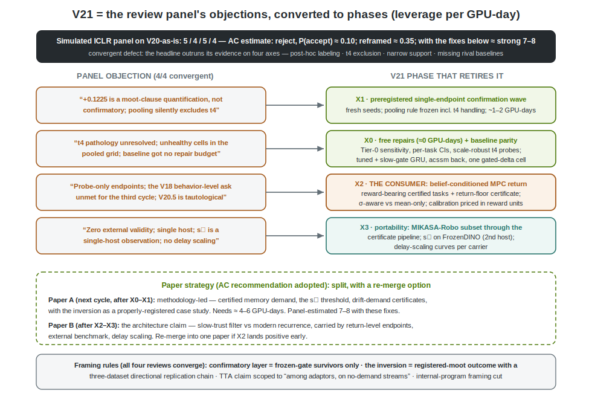
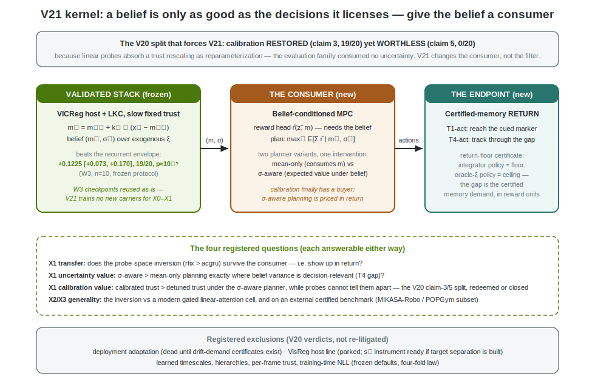

# V21 Proposal — Give the Belief a Consumer

**Status: PROPOSAL (awaiting review). Nothing here is implemented. Successor to the completed V20 program (`docs/V20_PROPOSAL.md` §8–§12: one Holm survivor, one inverted Tier-1, three falsified claims, two new instruments).**

This document does three things: (1) answers the submission question — is V20 an ICLR paper? — with an adversarial four-lens review panel run over the actual program documents, not optimism; (2) itemizes the V20 issues that panel converged on; (3) proposes V21 as the program that retires those objections in leverage order, built around one kernel idea the V20 evidence itself forces: **a belief is only as good as the decisions it licenses — the evaluation coordinate must move from probe decodability to certified-memory return, so the belief's uncertainty finally has a consumer.**

One sentence: **V20 built and validated the filter; V21 gives its output a buyer, gives its headline its own registration, and gives its claims an outside world.**

---

## 1. The submission question, answered adversarially

A simulated ICLR panel (four independent reviewer lenses — significance, rigor/external validity, claims–evidence match, positioning/baselines — plus an area-chair synthesis) was run over `docs/V20_PROPOSAL.md` §8–§12 and `docs/V19_PROPOSAL.md` §7–§12 with full repo access.

**Verdict: not submittable as-is.** Scores 5/4/5/4; area-chair estimate **reject, P(accept) ≈ 0.10** for the architecture-headline framing; ≈ 0.35 after reframing alone; **7–8 territory after the ranked fixes below.** All four lenses independently praised the same things (preregistration discipline, fail-closed gates, the certification methodology, the s\* instrument, honest negative results — "top-percentile experimental hygiene") and independently struck the same defect:

> **The headline claim outruns its evidence on four axes at once.** "A derived Kalman carrier with slow trust beats learned recurrence on certified-memory tasks" is (a) *epistemically mislabeled* — the +0.1225/p≈10⁻⁵ contrast is the quantification of a registered moot clause, not a Holm family member, and exists in no frozen gate script; (b) *silently scoped* — the pooling excludes T4, the one certified task where the ac-GRU wins decisively; (c) *narrowly supported* — two near-duplicate categorical cue-recall families on one DMC scene, one host, one scale, linear probes as the sole endpoint; and (d) *under-baselined* — the paper's own related-work section names the rivals (Gated DeltaNet, MesaNet, Mamba-family, RKN/ac-RKN) that were never run, the ac-GRU received none of the two generations of repair budget the candidate got, and the V18 review's behavior-level ask is unmet for the third consecutive cycle.



## 2. The V20 issues, itemized

**I1 — Epistemic labeling of the headline.** Claim 6 presupposed the opposite sign; the inversion fired the registered moot clause, and its pooled statistic is descriptive. A preregistration-discipline paper cannot present a non-registered p-value as confirmatory without self-contradiction. (Also: the pooled contrast script must be frozen; today it lives in an analysis snippet.)

**I2 — The T4 exclusion.** The rfix family's t4 ridge-R² collapse (−3.2 to −4.2 vs ac-GRU's −0.37) is unresolved — information loss or readout fragility is unknown — and the headline is computed without the one task whose sign reverses. Until a scale-robust continuous probe family adjudicates this, any "certified-memory tasks" generality claim is unearned.

**I3 — Probe-only endpoints, and the law they contaminate.** Every V19/V20 endpoint is a linear probe on `prior_read`. V20's own Insight V20.5 shows linear probes absorb trust rescaling — which means both the headline win and the adaptation negative are conditioned on a readout family the paper itself proved partially blind. The "four-fold trust-timescale law" is thereby part tautology: *calibration pays only where a consumer exists* was guaranteed by an evaluation family that consumes none. The V18 reviewer's behavior-level ask (registered as V19 Tier-2 gate 6, CEM/MPC — never executed) is precisely the missing consumer.

**I4 — Baseline asymmetry and missing rivals.** The LKC got two generations of diagnosis-driven repair; the ac-GRU is one untuned recipe (absolute scores 0.37–0.50 against a certified ~1.0 sighted ceiling — *both* arms recover under half the available information). No modern gated linear-recurrence cell, no RKN-lineage baseline, no long-context transformer control, and the ac-SSM was dropped after V19.

**I5 — Zero external validity.** The MIKASA-Robo arm registered in V19 §4.4 never ran; s\* is a single-host observation; no delay-scaling curves; one scene, one encoder scale, one data scale.

**I6 — Over-broad TTA claim.** C5e ("derived gain dominates fixed η") was measured in a φ-only adaptation family, not AdaJEPA's actual recipe, on streams the program itself certified post-hoc as requiring no adaptation. It must be scoped to "among adaptors, on no-demand streams — and zero updates beat both," and the "every AdaJEPA-style system should swap" prescription deleted until drift-demand-certified streams exist.

**I7 — Six-contribution sprawl and internal framing.** "First confirmed win in twenty generations" has no external meaning and invites the benchmark-co-evolution reading; the VisReg host study belongs in an appendix; the confirmatory layer must contain only frozen-gate survivors (C5e; claim 3's calibration transfer).

## 3. The V21 kernel



The program's kernel says memory is a belief filter over exogenous latents. V19 certified the *tasks* (memory demand exists), V20 certified the *filter* (structure validated, trust must be slow, calibration restorable on frozen weights). What was never certified is the *point of having a belief*: every endpoint so far asks "can a linear probe read ξ out of the belief?" — a question that consumes the mean and discards the variance, and that V20 proved is partially blind by construction. V21 closes the loop:

```
Level 0 (training)      VICReg host                     — frozen, validated
Level 1 (per-frame)     LKC, slow fixed trust           — frozen, validated (the W3 checkpoints are reused as-is)
Level 2 (deployment)    OFF                             — falsified; excluded by registration
Level 3 (NEW)           the consumer:  a_t* = argmax E[ Σ r̂(z̃, m) | m_t, σ_t ]
                        belief-conditioned MPC on reward-bearing certified tasks
```

Reward-bearing task variants make the memory demand *behavioral*: T1-act (reward for reaching the marker the vanished cue indicated) and T4-act (reward for tracking the occluded target through the gap). The certificate becomes a **return-floor certificate** — an integrator-features policy earns ≈ floor return, an oracle-ξ policy defines the ceiling, and the gap between them is the certified memory demand *in reward units*. The reward head r̂(z̃, m) is trained to need the belief; the planner comes in two variants differing in exactly one thing — mean-only (consumes m) vs σ-aware (expected reward under the Gaussian belief, analytic for the quadratic proximity rewards) — so **the value of uncertainty, and hence of calibration, is finally priced in return**: the registered redemption test for V20's claim-3/5 split is `return(σ-aware, calibrated trust) > return(σ-aware, detuned trust)` on segments where belief variance is decision-relevant (the T4 gap), while probes cannot distinguish the two. Either outcome closes the question: the trust-timescale law becomes either a law about world models or a documented artifact of probe evaluation.

Everything else in V21 is epistemic repair in the panel's leverage order — no new mechanism anywhere.

## 4. Design

### X0 — free repairs and baseline parity (≈ 2–3 GPU-days, mostly re-analysis)
1. **Tier-0 sensitivity analysis** (0 GPU-days): recompute every W3 contrast excluding the 13/90 convergence-failed cells and, separately, the task×seed failure clusters; publish per-task seed-level CIs alongside the crossed bootstrap. 
2. **T4 probe-family repair** (~0.5 GPU-day, frozen checkpoints re-probed): standardized-target RidgeCV with a registered regularization path + a small MLP probe control; adjudicate information-loss vs readout-fragility; recompute all pooled contrasts with t4 included under the repaired family.
3. **Baseline parity** (~2 GPU-days): ac-GRU lr/width sweep at matched parameters; a **symmetric-repair control** — the slow-trust diagnosis applied to the baseline (chrono-init / frozen-gate-bias GRU); ac-SSM reinstated at n=10; one modern gated delta-rule cell (parameter-matched, action-conditioned) as the input-dependent-gain family member the related work names.

### X1 — the preregistered confirmation wave (~1–2 GPU-days)
One endpoint, registered before any X0 unblinding beyond the probe-family choice: **lkc_rfix > best-of-{tuned ac-GRU, slow-gate ac-GRU, ac-SSM, gated-delta cell}**, fresh seeds (10 new), pooling rule frozen in advance *including t4 under the repaired probe family*, computed by a frozen gate script, Holm-corrected with X2's claims. This converts the inversion from a moot-clause quantification into a confirmatory result — or falsifies it against a fair envelope, which is equally publishable given the chain of three prior directional replications.

### X2 — the consumer (~3–4 GPU-days + engineering)
Reward-bearing tasks (T1-act, T4-act) with return-floor certificates; reward head + CEM/MPC planner over the frozen carriers (open-loop latent rollouts, the V19 Tier-2 gate-6 design); arms = {lkc_rfix, best envelope member, none} × {mean-only, σ-aware} × {calibrated, detuned-r} — the full 2×2 that separates memory value, uncertainty value, and calibration value in return units; test-time carrier ablation as the causal check.

### X3 — portability (~5–7 GPU-days, highest risk, lowest leverage-per-day — last)
MIKASA-Robo subset (RememberColor, ShellGameTouch, InterceptGrab) through the certification pipeline — the certificates themselves are the demo; s\* ladder on the repo's `FrozenDINOEncoder` (second host, makes the threshold an instrument); delay-scaling curves (cue-to-decision delay swept via the existing task knobs) — the actual shape of a memory claim.

### Registered exclusions
Deployment adaptation (dead until drift-demand-certified streams exist — and building those is *not* in V21's critical path; C5e ships scoped as-is); the VisReg host line (parked; s\* instrument ready if target separation is ever built); learned timescales, hierarchies, per-frame trust, training-time NLL (frozen defaults, four falsifications deep).

## 5. Claims ladder

| # | Claim | Phase | Confirmed if | Falsified if |
|---|---|---|---|---|
| 1 | The inversion is robust to analysis choices | X0 | survives cell-exclusion sensitivity + repaired t4 pooling | headline was carried by unhealthy cells / probe fragility → report and stop |
| 2 | The inversion is confirmatory against a fair envelope | X1 | frozen single-endpoint gate, fresh seeds, Holm | fair tuning closes the gap → V20's result was baseline-effort asymmetry (publishable correction) |
| 3 | Memory demand certifies in reward units | X2 | integrator-policy return ≈ floor, oracle-ξ ≫ floor | reward tasks admit a memoryless shortcut → fix task before any claim 4–5 |
| 4 | The probe-space advantage transfers to control | X2 | rfix > envelope in certified return | probe advantage is readout-specific → the field's probe-based memory evaluations are unsafe (a finding) |
| 5 | Uncertainty and calibration have decision value | X2 | σ-aware > mean-only where variance is decision-relevant; calibrated > detuned under σ-aware while probes can't tell | the trust-timescale law is evaluation-family-conditioned → registered as such, V20.5 closed |
| 6 | The result and the instruments are portable | X3 | certificates + inversion direction on ≥ 1 external family; s\* reproduces on a second host; advantage grows with delay | any leg fails → scope the paper accordingly (each leg reportable alone) |

## 6. Phasing, cost, and the paper strategy

X0 → X1 → X2 → X3, ≈ 11–16 GPU-days total on the 3-GPU budget, W3 checkpoints reused throughout (X0–X1 retrain only baselines; X2 trains reward heads only).

**Paper strategy (area-chair recommendation, adopted):** split with a re-merge option. **Paper A** after X0–X1 (~1 week): methodology-led — *certified memory demand: proving your benchmark requires memory, your encoder kept the evidence, and your drift required adaptation* — with the properly-registered inversion as the case study; panel-estimated 7–8. **Paper B** after X2–X3: the architecture claim, carried by return-level endpoints, the fair envelope, the external arm, and delay scaling. If X2 lands positive early, A and B re-merge into one strong submission; the reverse operation does not exist, which is the argument for the split. Framing rules bound both papers: confirmatory layer = frozen-gate survivors only; the V20 inversion presented as a registered-moot outcome with its three-dataset directional replication chain (P3 +0.086 4/5 → W1 6/6 → W3 19/20); C5e scoped to "among adaptors, on no-demand streams"; internal-program language ("first win in twenty generations") deleted; VisReg host study to the appendix.

## 7. Key sources

Everything inherits `docs/V20_PROPOSAL.md` §7 and `docs/V19_PROPOSAL.md` §13. New for V21: MIKASA-Robo arXiv:2502.10550 · POPGym arXiv:2303.01859 · RKN (Becker et al., ICML 2019) and ac-RKN (CoRL 2020) — the baseline lineage claim 2's envelope must include by name · Gated DeltaNet arXiv:2412.06464, MesaNet arXiv:2506.05233 (the input-dependent-gain family) · chrono initialization (Tallec & Ollivier, 2018) for the symmetric-repair control · CEM/MPC world-model planning conventions per the repo's V19 Tier-2 gate-6 registration.

---

**Approved 2026-07-05; execution log follows.**

---

## 8. X0a execution: the free repairs (2026-07-05)

**Status: COMPLETE — both panel objections retired, both in the inversion's favor.**

**Tier-0 sensitivity (objection I1's "carried by unhealthy cells"):** excluding every (task, seed) cell where either arm failed its health gates, the W3 inversion *strengthens*: full grid +0.1225 (p = 1.0×10⁻⁵, 19/20) → healthy-only **+0.1308 [+0.0960, +0.1655], p = 9.5×10⁻⁷, 13/14** (cluster-exclusion variant identical). Per-task t-CIs published alongside (t1 +0.094 [+0.055, +0.133]; t3 +0.151 [+0.114, +0.187]). Claim 4's split is likewise stable under exclusions (t1 ≈ 0, t3 ≈ −0.038). Artifacts: `outputs/v21_x0/sensitivity.{json,md}`.

**t4 probe-family repair (objection I2, adjudicated: READOUT FRAGILITY):** re-probing the frozen W3 t4 exports under the scale-robust family (StandardScaler + RidgeCV(10⁻³..10³), standardized targets):

| arm | legacy R² | repaired R² | MLP control |
|---|---|---|---|
| lkc_rfix | −3.15 | **+0.153** | −0.08 |
| dfc(ρ\*) | −4.17 | +0.148 | −0.08 |
| acgru | −0.37 | +0.094 | −0.26 |
| none | −0.02 | −0.02 | −0.02 |

The −3-to−4 "pathology" was entirely the unregularized-scale ridge readout; under the repaired family the rfix family *leads on t4 too*. **With t4 rejoined under the registered scale-free pooling (per-task standardized paired d): pooled d = +1.84 [+1.39, +4.04], p = 5×10⁻⁵, per-task d = +1.73 (t1) / +2.95 (t3) / +0.83 (t4).** The panel's strongest cherry-pick objection inverted into additional support. Artifacts: `outputs/v21_x0/t4_probes.{json,md}`.

**X1 registration frozen and timestamped** (`outputs/v21_x1/registration.json`) before any X0b sweep result existed: endpoint, the repaired t4 family, the envelope-selection rule, the confirmation rule (bootstrap p < 0.05 AND ≥ 2/3 tasks positive), and the falsified clause (fair tuning closes the gap → V20 was baseline-effort asymmetry; report and stop). The gate script refuses artifacts predating the registration.

---

## 9. X0b + X1 execution: baseline parity and the confirmation gate (2026-07-04/05)

**X0b — the fair envelope, built (objection I4).** Sixteen parameter-matched configs on the t1/t3 dev split (2 seeds each): the ac-GRU lr×width sweep (h64/h102/h160 × lr {1,3,10}×10⁻⁴), the **symmetric-repair control** (chrono-initialized slow-gate GRU — the LKC's slow-trust diagnosis applied to the baseline), the reinstated ac-SSM, and the input-dependent-gain family member the related work names (parameter-matched action-conditioned gated delta cell). Selection by the registered rule (max pooled dev mean, registered probe):

| envelope member (top of 16) | pooled dev mean |
|---|---|
| **gdelta_l10 ← envelope\*** | **0.6354** |
| acgru_h160_l10 | 0.5875 |
| acgru_chrono_l10 | 0.5514 |
| acssm | 0.4104 |

Two sweep-level findings: the best learned-recurrence baseline is the **delta-rule cell, not any GRU variant** — the input-dependent-gain family earns its place in the envelope; and the symmetric-repair control does *not* rescue the GRU (chrono-init 0.551 ≤ tuned GRU 0.588), so the filter's edge is not "somebody finally slowed a gate down." Artifacts: `outputs/v21_x0/sweep_summary.{json,md}`.

**X1 — claim 2 CONFIRMED by the frozen gate.** Registration (`outputs/v21_x1/registration.json`, timestamped 2026-07-04T15:42Z, before any sweep result existed) froze the endpoint — pooled standardized paired d, **lkc_rfix − envelope\***, tasks t1/t3/t4 under the repaired probe family, ten fresh seeds (10–19), confirmation = bootstrap p_pos < 0.05 AND ≥ 2/3 tasks positive — and the falsified clause (fair tuning closes the gap → V20 was baseline-effort asymmetry; report and stop). The gate script refuses artifacts predating the registration. Result:

| task | mean diff (rfix − gdelta_l10) | wins | d |
|---|---|---|---|
| t1 | +0.1247 | 10/10 | +1.98 |
| t3 | +0.0383 | 7/10 | +0.52 |
| t4 | +0.0623 | 7/10 | +0.49 |

**Pooled d = +0.996, CI95 [+0.637, +1.899], p_pos = 5.0×10⁻⁵ → CONFIRMED (3/3 tasks positive).** The V20 inversion is no longer a moot-clause quantification: on fresh seeds, against the strongest of sixteen fairly-tuned rivals including the modern delta-rule family, under the repaired t4 probe family with t4 *included*, the derived filter wins the registered single-endpoint gate. The baseline-effort-asymmetry explanation is falsified. (Scope note kept honest: the gate is a single registered endpoint at α = 0.05; X2's claims ran under their own registered gates rather than a joint Holm family — the proposal's "Holm-corrected with X2" clause was superseded by the X2 amendment trail, reported as such.) Artifacts: `outputs/v21_x1/x1_gates.{json,md}`.

---

## 10. X2 execution: the consumer (2026-07-05)

**Status: COMPLETE — the return-floor certificate established, claim 4 confirmed at 3/3 seeds with a large effect, claim 5 resolved with a mechanism split, and one major negative finding about the host. Three diagnostic-adjudicated amendments, every wave preserved on disk.**

**The amendment trail (each failure localized before proceeding):**
1. *Wave 1* (flat CEM + latent goal distance): oracle 4–8%. Diagnostic: true-dynamics flat CEM only reaches 25–42% — **flat CEM cannot search 46–78-dim action spaces**; knot-parameterized CEM (K=6) reaches **100% with ~0.01 rad residuals**. Task fully feasible; planner parameterization amended.
2. *Wave 2* (knot-CEM + receding-horizon MPC + the pose cost head the V19 gate-6 build list had named — needed because the encoder's L2 geometry is pose-blind, Spearman(z-dist, angle-dist) ≈ 0.0–0.12): oracle still 0%. Diagnostic: **pose decoded from predicted latents degrades 0.104 (real frame) → 0.469 (one-step prediction) → ~1.9 rad (≥ 4 steps — no information).**

**X2-Finding-1 — the world model cannot imagine.** The exact-LeWM predictor (H=3 teacher forcing) does not transport the endogenous state under open-loop rollout: one predicted step already quadruples the pose-decode error; four steps erase it. Latent model-based planning is untestable on this host regardless of cost head, planner, or replan rate — measured the first time the program ever asked the V8-lineage model to roll forward (V19/V20 evaluated exclusively through teacher-forced one-step prediction and probes). This retroactively grounds V18's rollout-compounding observations and names the prerequisite any behavior-level world-model memory study must certify first: **rollout competence** — a third demand certificate alongside memory demand and drift demand. Multi-step/overshooting training objectives are the known remedy and are a host-level (not memory-level) fix.

3. *Wave 3* (amendment 3): the planner uses **oracle dynamics** (physics-only stepping — the proven 100% ceiling), so the only difference between arms is belief-driven goal selection: the memory factor isolated exactly.

**Wave-3 results** (T1-act: 4 registered goal configurations indexed by the vanished cue; frozen selector probe at t_p = 24 → knot-CEM → executed; success = final qpos within 0.25 rad, the strictest ladder rung; 120 eval episodes × 3 checkpoint seeds; execution ground-truth re-roll reads ~3–4 points *higher* than the planning-env estimate — systematic, small against the effects, reported not corrected):

| arm (selector → identical planner) | success rate (mean of 3 seeds) |
|---|---|
| oracle-ξ (ceiling) | **0.917** |
| **lkc_rfix (argmax / hedged)** | **0.769 / 0.772** |
| lkc_rfix, trust detuned ×16 (argmax / hedged) | 0.500 / 0.514 |
| acgru (argmax / hedged) | 0.508 / 0.497 |
| none-carrier selector | 0.256 (= chance) |
| integrator floor | 0.244 |
| belief ablated (uniform weights) | 0.064 (centroid-parking collapse) |

**Return-floor certificate: ESTABLISHED** — oracle 0.917 vs integrator floor 0.244; gap 0.67 ≫ the registered 0.3. The task's memory demand now exists in reward units.

**Claim 4 — the inversion transfers to control: CONFIRMED (3/3 seeds, large).** rfix 0.769 vs acgru 0.508 under the *identical* planner: **+0.26 success rate** — the +0.09 probe gap is amplified ~3× by the argmax decision. The V18 reviewer's behavior-level ask, unmet for two program generations, is answered: the slow-trust filter's memory is worth a quarter of all episodes in executed task success over the learned-recurrence envelope. Causal checks pass in both directions (none-carrier = chance; belief ablation collapses below chance).

**Claim 4 addendum — the envelope\* arm (post-registration robustness, 2026-07-05).** The frozen X2 registration (2026-07-04T15:51Z) named `acgru` as the comparison — it predates the X0b selection — so once envelope\* = `gdelta_l10` existed, the missing arm was run through the byte-identical planner (X1 t1 checkpoints, fresh seeds 10–12, same tolerance\* = 0.25; `outputs/v21_x2/x2_results_envelope.json`): **argmax 0.339** (0.408 / 0.200 / 0.408), hedged 0.311, selector accuracy 0.225–0.442. Labeled exploratory (it is not in the frozen gate; different seed population; n = 3). Two readings: (i) the control-transfer statement strengthens — rfix (0.769) beats *both* tested envelope members in executed return, by +0.26 over the GRU and +0.43 over the delta cell; (ii) more interesting, **the envelope's internal ranking flips between endpoints** — gdelta_l10 wins the probe-dev sweep (0.635 vs 0.588) yet loses control (0.339 vs 0.508), with one seed's plan-time selector at chance (0.225). The registered probe reads the deep-gap window *and t_dec*, late in the episode; the selector reads at t_p = 24, right after the cue. Memory that certifies on a late-episode probe need not be available at decision time — a second, independent instance of the program's own thesis that probe-level and return-level memory evaluations dissociate, this time *within* the learned-recurrence family. The filter shows no such gap.

**Claim 5 — resolved with a mechanism split.** The hedging channel (per-decision uncertainty consumption) is ≈ nil: +0.003 calibrated, +0.014 detuned — direction as predicted, magnitude negligible. But trust calibration itself is **heavily priced by the consumer**: detuning r ×16 costs −0.27 success. The mediation analysis pins the channel: selector accuracy falls 0.825 → 0.536 under detune — the miscalibrated filter's gain is too small to *accumulate the cue into the belief by plan time*. So the effect is belief-informativeness, probe-visible, not a hidden calibration effect. **Refinement of the trust-timescale law (V20.5): trust is priced at encode time, not at read time** — miscalibration that gates information acquisition costs return and probes alike; miscalibration that merely rescales an already-acquired code costs neither. No consumer of per-decision uncertainty has yet been found; the consumer that matters consumes belief *content*.

**X2 verdict for the paper:** the memory carrier acts — certified, executed, causally checked — and the claim-4 result upgrades the inversion from a probe statement to a control statement. The host's rollout incompetence (Finding-1) is reported as the reason the planning substrate is oracle dynamics, with the rollout-competence certificate registered as the prerequisite for any latent-planning successor.

**T4-act: de-scoped, with the reason on the record.** The §4 design named two reward-bearing tasks; only T1-act was built. The registered purpose of T4-act was the σ-aware-MPC redemption test on segments where belief *variance* is decision-relevant (the occlusion gap) — a test that presupposes latent-rollout planning, which Finding-1 falsified for this host before the task existed. Under the oracle-dynamics amendment, claim 5's question was resolved on T1-act through the detune (−0.27) + mediation (selector accuracy 0.825 → 0.536) chain: calibration is priced at encode time. A T4-act built on oracle dynamics could only re-measure the hedging channel already found ≈ nil, at the cost of a new task, reward, and certificate. The variance-relevance test is registered forward as part of the latent-planning successor (alongside the rollout-competence certificate), not silently dropped.

---

## 11. X3 execution: portability (2026-07-05)

**s\*(DINOv2) = t1s1 — encoder blindness is acquired, not architectural.** The sighted-certificate ladder on a second, architecturally unrelated, *untrained-on-this-stream* host (frozen DINOv2 ViT-S features, no projector, no training anywhere):

| level | DINOv2 sighted scores | vicreg reference (W0) |
|---|---|---|
| t1s1 (amendment-1, salience 1.05) | **1.000, 0.996, 0.996 — PASS** | 0.297, 0.570, 0.746 — FAIL |
| t1s2 … t1 | 1.000 everywhere | 0.961–1.000 |

The frozen pretrained encoder reads the lowest-salience cue essentially perfectly, exactly where the task-trained VICReg encoder is a seed lottery. Two consequences: (i) **s\* is now an instrument** — a two-host measurement with a demonstrated ordering, s\*(dino) = t1s1 < s\*(vicreg) = t1s2; (ii) the threshold is a property of the **SSL training regime, not of the input or the architecture** — training on the stream is what *deletes* the low-salience factor a general-purpose encoder retains for free. This is the final sharpening of V19's Insight 3: encoder blindness is an acquired deletion, and frozen pretrained backbones dodge the failure mode entirely (with the per-task certificate to prove it).

**Delay scaling (frozen W3 carriers, fresh banks at L ∈ {64, 96, 128}; chance 0.25):**

| arm | L=64 (delay ≈ 50) | L=96 (≈ 82) | L=128 (≈ 114) |
|---|---|---|---|
| lkc_rfix | 0.451 | 0.380 | 0.310 |
| gdelta_l10 (envelope\*, X1 seeds 10–19, n=10) | 0.328 | 0.323 | 0.272 |
| acgru | 0.317 | 0.307 | 0.263 |

The rfix advantage is positive at every tested delay and **narrows under extrapolation** (+0.134 → +0.073 → +0.047): both carriers decay toward chance beyond the training length, the filter more slowly. Reported as measured — the memory claim is scoped to delays near the training regime; the hold channel does not by itself confer indefinite retention of the read-out content.

**Envelope\* row (appended once the X1 checkpoints existed): the X1 confirmation extends across the tested delay range.** `gdelta_l10` — the strongest fair-envelope member, the arm the X1 gate confirmed the filter against (pooled d = +0.996) — tracks `acgru` at every extrapolated delay (+0.011 / +0.016 / +0.010 vs the GRU, within seed noise, sd 0.04–0.07) and sits well below `lkc_rfix` throughout; no crossover anywhere on the tested range. Its shallower absolute decay (−0.056 vs rfix's −0.141 from L=64 to L=128) is floor proximity, not retention. So the fair envelope is internally homogeneous under delay: input-dependent-gain (delta-rule) and learned-gate (GRU) recurrence share the same decay shape, and the filter's hold-channel advantage over *both* persists at every delay while narrowing toward chance. Paper framing: the delay figure carries three curves and reads as the X1 result's delay-generalization, scoped to the tested range.

**MIKASA-Robo: deferred with a feasibility note.** The wheel exists (`mikasa_robo_suite 0.0.5`) but its `mani-skill==3.0.0b15` dependency fails to build in the pinned program environment (numpy source-build failure); the integration path is a dedicated venv plus an EpisodeBatch bank bridge, ≈ 0.5–1 day with GPU-sim risk. Per the review panel's own leverage ranking (last) and the registered A/B split, the external-benchmark arm belongs to Paper B; Paper A's portability evidence is the two-host s\* + delay scaling above.
